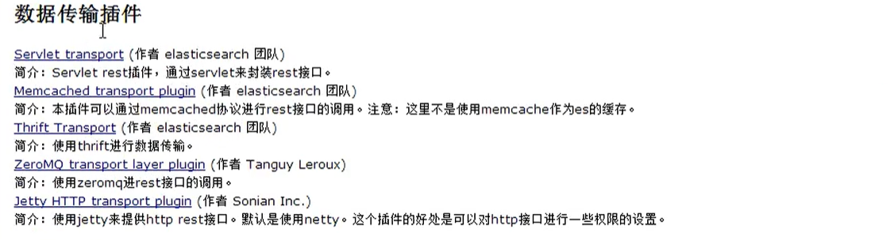
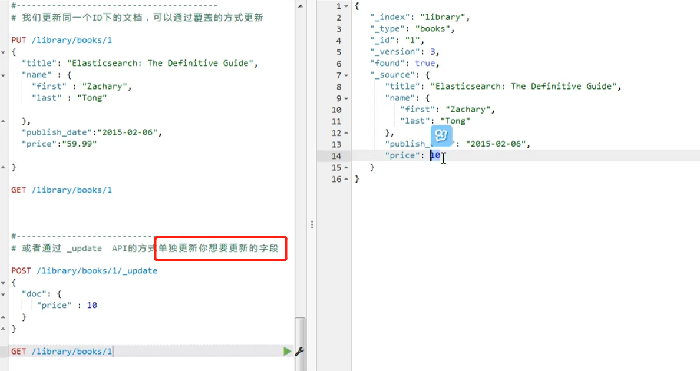
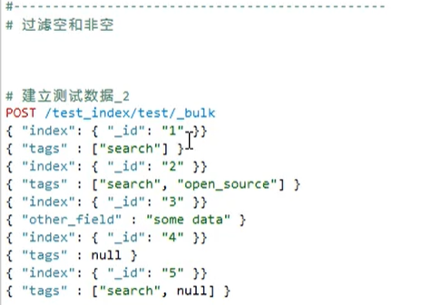
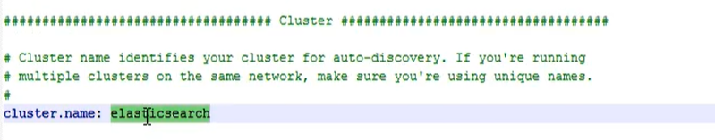
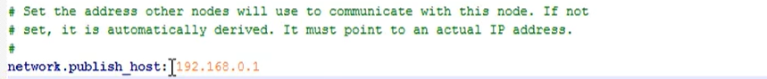
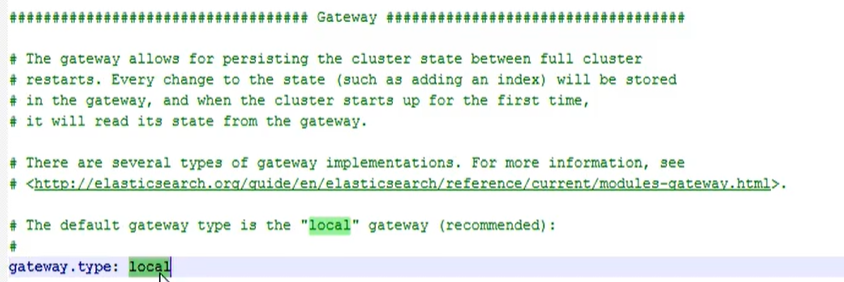
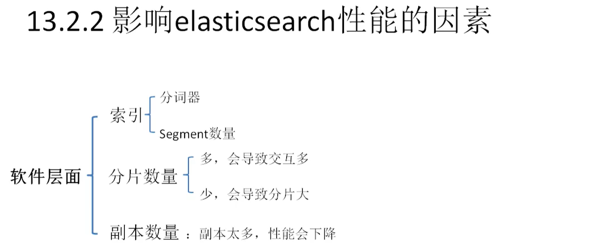
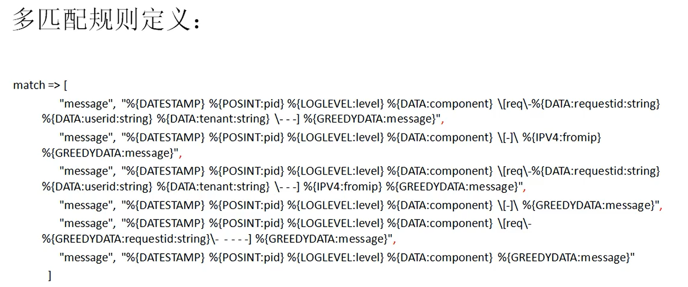

## Elasticsearch 学习

### 什么是Elasticsearch

```
一个采用了 Restful API标准的高可扩展性和高可用性的实时数据分析的全文搜索工具
```

#### elasticsearch 设计的一些概念


```
一个索引的大小可能会超出单个节点硬盘空间的限制，加入1TB大小的文档放在一个结点上，处理搜索的速度肯定很慢，使用分片可以提高IO性能，又扩展了数据的容量。索引的副本机制是在shard 的基础上做的，提高了数据的高可用性。 
shards 在索引创建的时候 可以设置，默认的为5份，索引创建完成之后就不能更改，

上面两个图展示了数据的存储 和查询的过程。

Replicas 即是数据的高可用，也可以做数据查询的负载均衡。
```

#### Elaticsearch 与MySQL的对比


```
ES 的Type在 6 之后，不在支持自定义
```

#### Elaticsearch 的架构


```
Gateway是 elasticsearch 支持的索引数据的存储格式，ES 启动的时候从Gateway 读取索引的数据；
DistrbutedLucene Directory 这一层为Lucene框架，ES基于此框架；
在上面一层为ES的数据处理模块：
	Mapping 定义索引如何创建，以及索引下document 字段的数据类型，相当于MySQL的schema
	River ES内置的一个插件，用来从外部获取异构数据在ES里面创建索引，常见的有 Rabbitmq River、twitter River
Discovery ES的自动发现节点的机制：
	Zen 实现节点自动发现和master节点选举的，ES 是基于p2p 机制的系统，首先通过广播的机制寻找存在的节点，然后通过多播的协议进行节点间的通信，支持点对点的交互
Scripting ES 的脚本执行功能
Plugins ES 支持第三方插件的接口
Transport ES支持的交互方式，默认使用 http传输
RESTful API 最顶层的ES的API
```

### RESTful以及CURL的介绍


```
表现层：资源的表现层，比如网络上的文本，图片，视频等，资源在网络上都有一个表示，可以理解为一个id，这个id一般叫做URI
状态转化：我们平时访问一个网站，就是客户端和服务端的一个状态交互，有了互动数据的状态就会发生转变。我们访问的网站一般为http的协议，而http协议又是无状态的协议（即数据的状态都保存在服务端，客户端不会记录任何操作），因此客户端想要操作服务器，需要使用一定的手段使服务器的资源状态发生转换，表现形式就是在http上添加请求的方法（GET/POST/PUT/DELETE等）
```


### Elasticsearch 安装和插件安装





```
此教程版本为 elasticsearch 1.7 river 功能已经移除 mongodb River plugins 不维护
```

### 倒排索引


```
常规的索引是文档到关键词的索引，需要扫描整个文档，比如 搜索 JSON的单词，建索引的过程要一次的扫描每个单词，知道搜索到JSON 才知道需要建立文档与JSON 关键字的索引关系。
对于大量的文档来说浪费大量的时间。
```

**倒排索引的过程**


```
比如这里有5篇的文档，全文搜索会把5篇文档首先进行 分词，提取要索引的关键字
```


```
每一个单词都有一个ID，没篇文档也有一个ID；
通过对单词集合和文档集合进行组合运算得到一个矩阵。
```


```
比如:
1. 乔布斯的单词在 文章1 的3,11位置出现，文章2 的7位置，文章3的9位置出现

下面的 {(1,<3,11>),2} 2 代表关键字出现的次数
```

### Elasticsearch API 的CURD操作

#### 创建索引


#### 获取索引设置信息


#### 插入数据（PUT/POST）


#### 查询数据


```
（根据自己指定的id或自动生成的uuid查询）
```


```
查询的时候限定输出的字段
```

#### 更新之前的数据


```
是对整个文档进行覆盖更新，不推荐做
```



```
更新单个的字段
```

#### 删除一个文档


```
删除文档，删除_type 以及删除索引
```

### Elasticsearch的内置字段及类型


### mget 获取多个文档（mget）


```
同时获取多个文档id的数据，不同索引的文档也可以的
```


```
获取的同时指定想要的字段
```


```
简写的几种方式
```

### bulk 批量操作


```
删除 /library/books/1
每一行需要存在一个 \n
```


```
因为 这样会每行一个换行符
```


```
每两行 可以插入一个doc
```


```
包含增删改查的 bulk操作
```


### Elasticsearch的版本控制


```
并发情况下库存记录错误的情况，有可能存在超卖的情况
```


```
1. 如何保证在多线程操作的正确性？ 
传统的方法都是通过锁机制进行处理的：
	悲观锁：再进行数据操作的时候，进行锁定，操作完成后在释放锁，使用并发量小的场景
	乐观锁：先假定线程同时修改同一个数据的情况非常少，如果存在多个线程同时更改，在后面操作的线程会更改失败，只有重新获取了新的值的情况下才会修改成功。（会造成数据的读取不实时，产生脏读）
```


```
Elasticsearch 通过 内部版本控制和外部版本控制实现了乐观锁的机制
```


```
进行了更新 version 自动的变为了2
```


```
指定version=3 进行更新，当前version为2的数据会报错，ES通过 version的版本号与操作的数据进行绑定，防线version不对就不让进行操作
```

```
Elasticsearch的数据查询十分强大，一些应用会把数据的查询交给Elasticsearch，而独立的数据库依然使用MySQL等关系数据库，系统的开发者一般会把MySQL的数据同步到elasticsearch中去，而MySQL这样的数据库有自己的版本控制机制，比如使用一个带时间戳的字段，同步到elasticsearch之后也希望es使用带有时间戳的字段进行版本控制，就通过version_type=external 
```


```
这个操作自己定义了version的版本为5 并且类型为external的，当重复之一这条操作version不会自动增长，这个需要自己进行版本的控制。

他会检查当前请求中的version值是否小于等于数据存储的当前version值，也就是操作的版本必须要大于5才能操作。

version 的值必须为 int
```

### Elasticsearch Mapping 映射


```
动态映射只有在跟对象或 类型为object的类型上
```


#### 获取mapping信息


#### 更新索引的mapping信息


#### 删除映射


### Elasticsearch的查询操作


#### 基本查询


```
q=title:elasticsearch 查询title自动为elasticsearch的文档

第三个是在集群的内部跨索引名进行搜索
```

#### term查询


#### terms查询


```
minimum_match 是文档必须包含的关键字个数
```

#### 控制返回结果的数量


#### 返回结果带 version版本


```
不止定version：true的话，查询结果不带有version信息
```

#### match查询


#### match_all查询


#### match_phrase 短语查询


```
slop 定义关键字之间存在多少个未知单词
```

#### multi_match 查询


```
查询多个字段同时包含查询的内容
```

#### 控制返回的字段


 


```
partial_fields 控制加载的字段，还能使用通配符
```

#### 排序


#### prefix前缀匹配查询


#### range控制查询范围 


#### wildcard 通配符查询


#### fuzzy 模糊查询


```
这个和上面的区别是这个只能定义一个字段，上面的可以定义多个的字段
```


### Filter查询


```
filter 和MySQL数据中的where是差不多的功能，就是进行一些条件的过滤

filter 一样可以想query一样查询到数据，但是filter可以将数据很好的 缓存到内存中去，加快下次查询的速度
```

#### 建立测试数据


  

#### 最简单的filter查询


```
filter是和query同级的字段，包含在filtered 下面
```


```
指定多个的字段的值
```


```
此时查询不到数据，是因为 索引的mapping信息这个 productID 这个字段 是string类型的，使用 /_analyze?text=SD535253 结果是sd535253 变为了小写，所以使用 filter的时候，真毒是string类型的字段，大写的分析器会把他变为小写的，可以更改mapping信息，禁止这个字段的分析。
```


#### bool 过滤查询


#### filter的and查询


```
直接使用and查询
```

#### filter的 or查询


#### filter的 not查询


#### filter 的range查询


```
filter内的range查询
```

#### 过滤空和非空



 


### cache缓存


```
是在filter字段下面
```

### 组合查询


```
把基本查询组合 起来的符合查询
```

#### bool查询


#### boosting 查询


```
这个查询使用negative 将在查询 apple时将含有fruit pie tart red sweet单词的文档的分数降低
```

#### constant_score 查询


```
把查询的结果恒定为1
```

#### indices 查询


```
no_match_query 在indices里没有查询到的时候，在另外的索引查询 price：10
```

### Elasticsearch的集群管理




```
谁知集群的名字
```


```
node 节点的名称
```


```
master 为true，而data 为false 则，此节点只做master节点不做索引的相关存储
```


```
只是作为负载均衡器存在，什么也不做
```


```
一台服务器可以运行的节点数
```


```
定义分片的数量和副本的数量
```


```
配置文件的位置和索引数据的存储位置
path.data 可以定义多个的位置
```


```
path.work 临时文件的位置
日志文件位置
查询存放的位置
```


```
列出哪些插件没有安装，这个节点就不允许启动
```


```
设置为true就表示会锁定一些内存给elasticsearch
```


```
节点绑定的地址
```

‘

```
elasticsearch跟其他节点通信的地址
```


```
如果这个设置了上面的两个都可以不用设置了
```


```
设置各个节点通信的地址
```


```
客户端的连接端口
```


```
http的最大的报文长度，如果使用bulk操作最好不要查过这个长度
```



```
设置底层的数据存储类型，默认为local本地文件
```


```
控制集群达到多少个节点之后才开始集群恢复的动作
```


```
达到recover_after_nodes 的节点数之后，再过5min之后再进行数据恢复
```


```
期待的结点数，只要达到5个节点，就开始恢复数据，不用等到 5min之后
```


```
控制一个节点在恢复时候的并发数量，设置初始的恢复过程并发为4
```


```
添加删除结点或负载均衡的时候，默认的恢复并发为2
```


```
设置在恢复数据的时候限制的带宽，0 无限制
```


```
在恢复期间，默认的打开的并发流的个数
```


```
设置集群最少的master结点的个数，默认为1
```


```
集群中自动发现其他节点的超时时间
```


```
打开多播协议发现节点，默认为true
```


```
master发现自动加入集群的结点
```

### Elasticsearch集群的优化管理


#### 分片在索引和删除文档时的工作


```
1. 用户的请求先经过master节点，
2. 如果有删除的操作后，master会告知文档所在的节点node3 的分片P0，
3. P0的删除结果复制到两个副本确认完成后，
```


```
node3 告知master节点所有的操作完成
```

#### 更新文档


```
1. 用户的请求先到大master节点，
2. master节点查找到所要更新的文档在node3节点P0上，node1(master)转发请求到node3，
3. node3 找到更新的文档，更新这个文档，并重新索引这个文档到P0，
4. 如果node3 成功的更新了文档，会把新的文档版本发送给两个副本分片，
5. 确认副本分片更新成功之后，node3放回更新成功的信息
```

#### 检索文档


```
1. 用户把请求发送到任何的一个节点，比如node3
2. node3接受到请求之后会广播到集群的所有的节点中存在其副本的结点上
3. 所有节点分别查询所请求的查询
4. node3 最终把结果返回给用户
```

#### 影响elasticsearch性能的因素



```
索引：
	选择合适的分词器：
		索引越大查询也会变得更慢，业务量大的时候，索引大是正常的，如果是因为分词器没有选择正确，导致词表过大，简介的影响西索引变得庞大。
		词表是分词器根据分词算法构建的一个词库，如果分词器选择不对，就会导致对文档的猜测不准确，词项分的很细，词表自然很大，进而索引变大。
	减少segment的数量：
		索引是有多个的segment组成的，segment会醉着索引的增长而增加，segment增加会影响elasticsearch的查询性能，官方提供了optimize这个方法进行优化，河边多个segment
```

**optimize方法的参数**


```
wait_for_merge 的操作是非常好使的操作，通常设置其为false
```


```
经验：
	1. 单个分片超过30G查询开始出现性能下降，50G之后性能很慢
	2. 数据的冷热分离，就得数据可以放到HDFS中去
```

**设置文件打开数量**


```
系统版本  CentOS Linux release 7.6.1810 (Core)

 

简介

提高服务器性能有很多方法，比如划分图片服务器，主从数据库服务器，和网站服务器在服务器。但是硬件资源额定有限的情况下，最大的压榨服务器的性能，提高服务器的并发处理能力，是很多运维技术人员思考的问题。要提高Linux系统下的负载能力，可以使用nginx等原生并发处理能力就很强的web服务器，如果使用Apache的可以启用其Worker模式，来提高其并发处理能力。除此之外，在考虑节省成本的情况下，可以修改Linux的内核相关TCP参数，来最大的提高服务器性能。当然，最基础的提高负载问题，还是升级服务器硬件了，这是最根本的。

TIME_WAIT

Linux系统下，TCP连接断开后，会以TIME_WAIT状态保留一定的时间，然后才会释放端口。当并发请求过多的时候，就会产生大量的TIME_WAIT状态的连接，无法及时断开的话，会占用大量的端口资源和服务器资源。这个时候我们可以优化TCP的内核参数，来及时将TIME_WAIT状态的端口清理掉。

本文介绍的方法只对拥有大量TIME_WAIT状态的连接导致系统资源消耗有效，如果不是这种情况下，效果可能不明显。可以使用netstat命令去查TIME_WAIT状态的连接状态，输入下面的组合命令，查看当前TCP连接的状态和对应的连接数量：

netstat -n |awk '/^tcp/ {++S[$NF]} END {for(a in S) print a, S[a]}'

 
这个命令会输出类似下面的结果：
LAST_ACK 16
SYN_RECV 348
ESTABLISHED 70
FIN_WAIT1 229
FIN_WAIT2 30
CLOSING 33
TIME_WAIT 18098
我们只用关心TIME_WAIT的个数，在这里可以看到，有18000多个TIME_WAIT，这样就占用了18000多个端口。要知道端口的数量只有65535个，占用一个少一个，会严重的影响到后继的新连接。这种情况下，我们就有必要调整下Linux的TCP内核参数，让系统更快的释放TIME_WAIT连接。

用vim打开配置文件：#vim /etc/sysctl.conf

在这个文件中，加入下面的几行内容：
net.ipv4.tcp_syncookies = 1
net.ipv4.tcp_tw_reuse = 1
net.ipv4.tcp_tw_recycle = 1
net.ipv4.tcp_fin_timeout = 30

输入下面的命令，让内核参数生效：#sysctl -p

简单的说明上面的参数的含义：

net.ipv4.tcp_syncookies = 1
#表示开启SYN Cookies。当出现SYN等待队列溢出时，启用cookies来处理，可防范少量SYN攻击，默认为0，表示关闭；
net.ipv4.tcp_tw_reuse = 1
#表示开启重用。允许将TIME-WAIT sockets重新用于新的TCP连接，默认为0，表示关闭；
net.ipv4.tcp_tw_recycle = 1
#表示开启TCP连接中TIME-WAIT sockets的快速回收，默认为0，表示关闭；
net.ipv4.tcp_fin_timeout
#修改系統默认的 TIMEOUT 时间。

在经过这样的调整之后，除了会进一步提升服务器的负载能力之外，还能够防御小流量程度的DoS、CC和SYN攻击。

此外，如果你的连接数本身就很多，我们可以再优化一下TCP的可使用端口范围，进一步提升服务器的并发能力。依然是往上面的参数文件中，加入下面这些配置：
net.ipv4.tcp_keepalive_time = 1200
net.ipv4.ip_local_port_range = 10000 65000
net.ipv4.tcp_max_syn_backlog = 8192
net.ipv4.tcp_max_tw_buckets = 5000
#这几个参数，建议只在流量非常大的服务器上开启，会有显著的效果。一般的流量小的服务器上，没有必要去设置这几个参数。

net.ipv4.tcp_keepalive_time = 1200
#表示当keepalive起用的时候，TCP发送keepalive消息的频度。缺省是2小时，改为20分钟。
net.ipv4.ip_local_port_range = 10000 65000
#表示用于向外连接的端口范围。缺省情况下很小：32768到61000，改为10000到65000。（注意：这里不要将最低值设的太低，否则可能会占用掉正常的端口！）
net.ipv4.tcp_max_syn_backlog = 8192
#表示SYN队列的长度，默认为1024，加大队列长度为8192，可以容纳更多等待连接的网络连接数。
net.ipv4.tcp_max_tw_buckets = 6000
#表示系统同时保持TIME_WAIT的最大数量，如果超过这个数字，TIME_WAIT将立刻被清除并打印警告信息。默 认为180000，改为6000。对于Apache、Nginx等服务器，上几行的参数可以很好地减少TIME_WAIT套接字数量，但是对于Squid，效果却不大。此项参数可以控制TIME_WAIT的最大数量，避免Squid服务器被大量的TIME_WAIT拖死。

内核其他TCP参数说明：
net.ipv4.tcp_max_syn_backlog = 65536
#记录的那些尚未收到客户端确认信息的连接请求的最大值。对于有128M内存的系统而言，缺省值是1024，小内存的系统则是128。
net.core.netdev_max_backlog = 32768
#每个网络接口接收数据包的速率比内核处理这些包的速率快时，允许送到队列的数据包的最大数目。
net.core.somaxconn = 32768
#web应用中listen函数的backlog默认会给我们内核参数的net.core.somaxconn限制到128，而nginx定义的NGX_LISTEN_BACKLOG默认为511，所以有必要调整这个值。

net.core.wmem_default = 8388608
net.core.rmem_default = 8388608
net.core.rmem_max = 16777216           #最大socket读buffer,可参考的优化值:873200
net.core.wmem_max = 16777216           #最大socket写buffer,可参考的优化值:873200
net.ipv4.tcp_timestsmps = 0
#时间戳可以避免序列号的卷绕。一个1Gbps的链路肯定会遇到以前用过的序列号。时间戳能够让内核接受这种“异常”的数据包。这里需要将其关掉。
net.ipv4.tcp_synack_retries = 2
#为了打开对端的连接，内核需要发送一个SYN并附带一个回应前面一个SYN的ACK。也就是所谓三次握手中的第二次握手。这个设置决定了内核放弃连接之前发送SYN+ACK包的数量。
net.ipv4.tcp_syn_retries = 2
#在内核放弃建立连接之前发送SYN包的数量。
#net.ipv4.tcp_tw_len = 1
net.ipv4.tcp_tw_reuse = 1
# 开启重用。允许将TIME-WAIT sockets重新用于新的TCP连接。

net.ipv4.tcp_wmem = 8192 436600 873200
# TCP写buffer,可参考的优化值: 8192 436600 873200
net.ipv4.tcp_rmem  = 32768 436600 873200
# TCP读buffer,可参考的优化值: 32768 436600 873200
net.ipv4.tcp_mem = 94500000 91500000 92700000
# 同样有3个值,意思是:
net.ipv4.tcp_mem[0]:低于此值，TCP没有内存压力。
net.ipv4.tcp_mem[1]:在此值下，进入内存压力阶段。
net.ipv4.tcp_mem[2]:高于此值，TCP拒绝分配socket。
上述内存单位是页，而不是字节。可参考的优化值是:786432 1048576 1572864

net.ipv4.tcp_max_orphans = 3276800
#系统中最多有多少个TCP套接字不被关联到任何一个用户文件句柄上。
如果超过这个数字，连接将即刻被复位并打印出警告信息。
这个限制仅仅是为了防止简单的DoS攻击，不能过分依靠它或者人为地减小这个值，
更应该增加这个值(如果增加了内存之后)。
net.ipv4.tcp_fin_timeout = 30
#如果套接字由本端要求关闭，这个参数决定了它保持在FIN-WAIT-2状态的时间。对端可以出错并永远不关闭连接，甚至意外当机。缺省值是60秒。2.2 内核的通常值是180秒，你可以按这个设置，但要记住的是，即使你的机器是一个轻载的WEB服务器，也有因为大量的死套接字而内存溢出的风险，FIN- WAIT-2的危险性比FIN-WAIT-1要小，因为它最多只能吃掉1.5K内存，但是它们的生存期长些。

经过这样的优化配置之后，你的服务器的TCP并发处理能力会显著提高。以上配置仅供参考，用于生产环境请根据自己的实际情况。
```


```
影响因素的重要性
```

### logstash

#### logstash 运行参数


#### logstash的语法


#### logstash的插件


##### logstash 编码解码


```
negate: true  向前匹配，及匹配老的日志行
```


##### logstash filter配置





