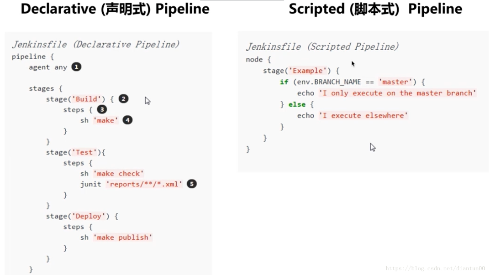
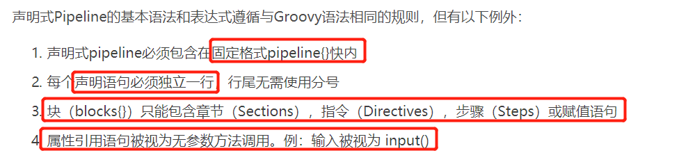
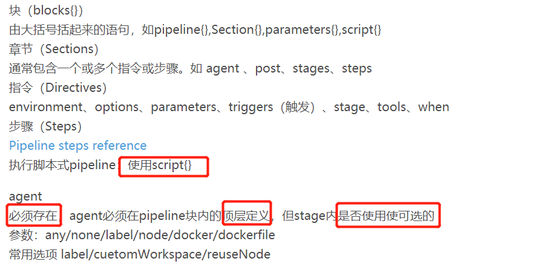

## Jenkins Pipeline

#### 基本概念

**Stage：阶段，一个Pipeline可以划分成若干个Stage，每个Stage代表一组操作，例如：“Build”，“Test”，“Deploy”**

注意，Stage是一个逻辑分组的概念，可以跨多个Node

**Node：节点，一个Node就是一个Jenkins节点，或者是Master，或者是Agent，是执行Step的具体运行环境。**

**Step：步骤，Step是最基本的操作单元，小到创建一个目录，大到构建一个Docker镜像，由各类Jenklins Plugin提供，例如：sh ‘make’**

#### Pipeline和Freestyle的区别

```
Freestyle： 
    上游/下游Job调度，如 
    BuildJob —> TestJob —> DeployJob 
    在DSL Job里面调度多个子Job（利用Build Flow Plugin）

Pipeline： 
    单个Job中完成所有的任务编排 
    全局视图

	Multibranch Pipeline根据你的代码中Jenlinsfile自动创建Job

```

#### Jenlins Pipeline的基础语法 

> 支持两种语法 
> Declarative 声明式（在Pipeline plugin 2.5中引入） 
> Scripted Pipeline 脚本式







**agent使用实例**

```
agent { label 'my-label' }

agent {
    node {
        label 'my-label'
        customWorkspace '/some/other/path'
    }
}

agent {
    docker {
        image 'nginx:1.12.2'
        label 'my-label'
        args '-v /tmp:/tmp'
    }
}
```

