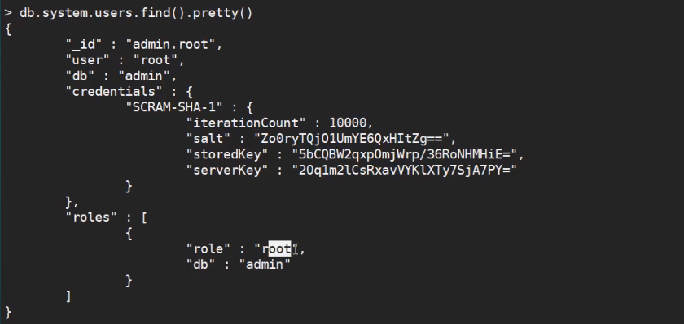
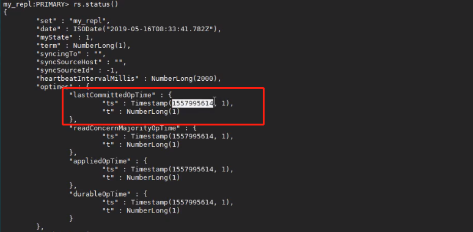
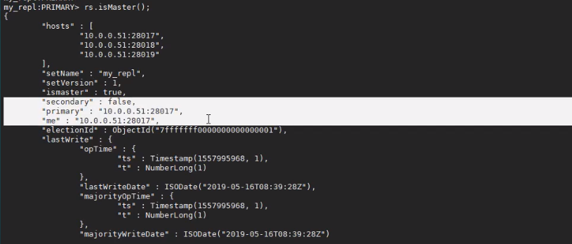
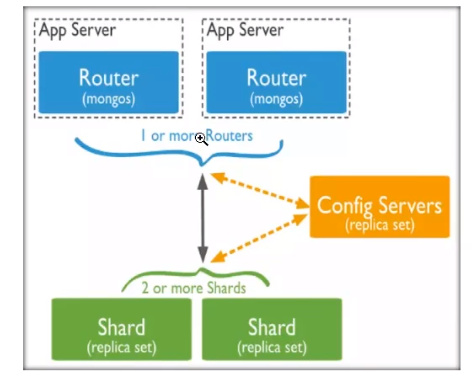
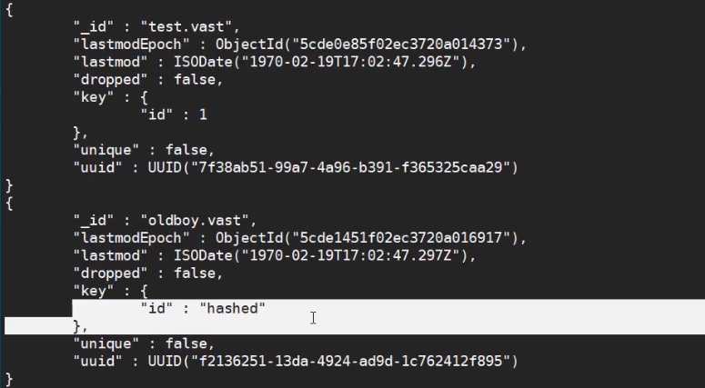
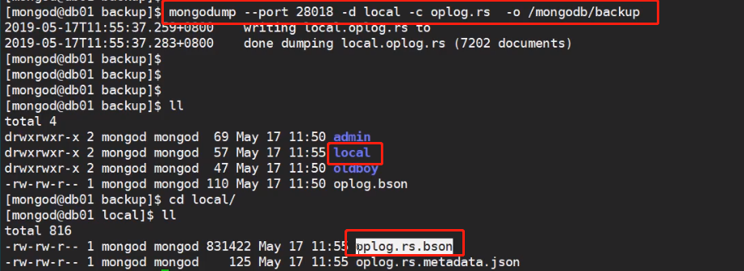
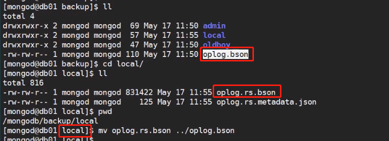

### MongoDB 核心技术

#### 第一章：逻辑结构

```dart
Mongodb 逻辑结构                         MySQL逻辑结构
库database                                 库
集合（collection）                          表
文档（document）                            数据行

选择之所以称之为选择,肯定是痛苦的!
                       -------> oldguo 
```

#### 第二章：安装部署

##### 1、系统准备

```bash
（1）redhat或centos6.2以上系统
（2）系统开发包完整
（3）ip地址和hosts文件解析正常
（4）iptables防火墙&SElinux关闭
（5）关闭大页内存机制
########################################################################
root用户下
在vi /etc/rc.local最后添加如下代码
    if test -f /sys/kernel/mm/transparent_hugepage/enabled; then
      echo never > /sys/kernel/mm/transparent_hugepage/enabled
    fi
    if test -f /sys/kernel/mm/transparent_hugepage/defrag; then
       echo never > /sys/kernel/mm/transparent_hugepage/defrag
    fi

    cat  /sys/kernel/mm/transparent_hugepage/enabled        
    cat /sys/kernel/mm/transparent_hugepage/defrag  
其他系统关闭参照官方文档：   

https://docs.mongodb.com/manual/tutorial/transparent-huge-pages/
---------------
为什么要关闭？
Transparent Huge Pages (THP) is a Linux memory management system 
that reduces the overhead of Translation Lookaside Buffer (TLB) 
lookups on machines with large amounts of memory by using larger memory pages.
However, database workloads often perform poorly with THP, 
because they tend to have sparse rather than contiguous memory access patterns. 
You should disable THP on Linux machines to ensure best performance with MongoDB.

透明大页面（THP）是一个Linux内存管理系统
这减少了翻译查找缓冲区（TLB）的开销
通过使用较大的内存页查找具有大量内存的计算机。
但是，数据库工作负载通常在THP中执行得很差，
因为它们往往具有稀疏而不是连续的内存访问模式。 ****
您应该在Linux机器上禁用THP，以确保MongoDB的最佳性能。
############################################################################   
```

##### 2、mongodb安装

###### **创建所需用户和组**

```undefined
useradd mongod
passwd mongod
```

###### **创建mongodb所需目录结构**

```bash
mkdir -p /mongodb/conf
mkdir -p /mongodb/log
mkdir -p /mongodb/data
```

###### **上传并解压软件到指定位置**

```kotlin
[root@db01 data]# cd   /data
[root@db01 data]# tar xf mongodb-linux-x86_64-rhel70-3.6.12.tgz 
[root@db01 data]#  cp -r /data/mongodb-linux-x86_64-rhel70-3.6.12/bin/ /mongodb
```

###### **设置目录结构权限**

```undefined
chown -R mongod:mongod /mongodb
```

###### **设置用户环境变量**

```bash
su - mongod
vi .bash_profile
export PATH=/mongodb/bin:$PATH
source .bash_profile
```

###### **启动mongodb**

```cpp
mongod --dbpath=/mongodb/data --logpath=/mongodb/log/mongodb.log --port=27017 --logappend --fork 
```

###### **登录mongodb**

```ruby
[mongod@server2 ~]$ mongo
```

###### **使用配置文件**

```tsx
YAML模式

NOTE：
YAML does not support tab characters for indentation: use spaces instead.

--系统日志有关  
systemLog:
   destination: file        
   path: "/mongodb/log/mongodb.log"    --日志位置
   logAppend: true                     --日志以追加模式记录
  
--数据存储有关   
storage:
   journal:
      enabled: true
   dbPath: "/mongodb/data"            --数据路径的位置

-- 进程控制  
processManagement:
   fork: true              --后台守护进程
   pidFilePath: <string>   --pid文件的位置，一般不用配置，可以去掉这行，自动生成到data中
    
--网络配置有关   
net:            
   bindIp: <ip>                       -- 监听地址，3.6 不设IP登录不了
   port: <port>                       -- 端口号,默认不配置端口号，是27017
   
-- 安全验证有关配置      
security:
  authorization: enabled              --是否打开用户名密码验证

  
------------------以下是复制集与分片集群有关----------------------  

replication:
 oplogSizeMB: <NUM>
 replSetName: "<REPSETNAME>"
 secondaryIndexPrefetch: "all"
 
sharding:
   clusterRole: <string>
   archiveMovedChunks: <boolean>
      
---for mongos only
replication:
   localPingThresholdMs: <int>

sharding:
   configDB: <string>

++++++++++++++++++++++
YAML例子
cat >  /mongodb/conf/mongo.conf <<EOF
systemLog:
   destination: file
   path: "/mongodb/log/mongodb.log"
   logAppend: true
storage:
   journal:
      enabled: true
   dbPath: "/mongodb/data/"
processManagement:
   fork: true
net:
   port: 27017
   bindIp: 10.0.0.51,127.0.0.1
EOF
                                     
mongod -f /mongodb/conf/mongo.conf --shutdown
mongod -f /mongodb/conf/mongo.conf   
```

###### **mongodb的关闭方式**

```css
mongod -f mongo.conf  --shutdown
```

###### **mongodb 使用systemd管理**

```ruby
[root@db01 ~]# cat > /etc/systemd/system/mongod.service <<EOF
[Unit]
Description=mongodb 
After=network.target remote-fs.target nss-lookup.target
[Service]
User=mongod
Type=forking
ExecStart=/mongodb/bin/mongod --config /mongodb/conf/mongo.conf
ExecReload=/bin/kill -s HUP $MAINPID
ExecStop=/mongodb/bin/mongod --config /mongodb/conf/mongo.conf --shutdown
PrivateTmp=true  
[Install]
WantedBy=multi-user.target
EOF

[root@db01 ~]# systemctl restart mongod
[root@db01 ~]# systemctl stop mongod
[root@db01 ~]# systemctl start mongod
```

##### 3、mongodb常用基本操作

###### 3.0  mongodb 默认存在的库

```dart
test: 登录时默认存在的库
管理MongoDB有关的系统库
    admin库: 系统预留库, MongoDB系统管理库
    local库: 本地预留库, 存储关键日志
    config库: MongoDB配置信息库

show databases/show dbs
show collections/show tables
use admin 
db/select database()	## 查看当前所在的库
```

###### 3.1 命令种类

**db 对象相关命令**

```css
db.[TAB][TAB]
db.help()
db.oldboy.[TAB][TAB]
db.oldboy.help()
```

**rs 复制集有关(replication set):**

```css
rs.[TAB][TAB]
rs.help()
```

**sh 分片集群(sharding cluster)**

```css
sh.[TAB][TAB]
sh.help()
```

##### 4. mongodb对象操作

```rust
mongo        mysql
库    ----->  库
集合  ----->  表
文档  ----->  数据行
```

###### 4.1 库的操作

```bash
> use test
> db.dropDatabase()   
{ "dropped" : "test", "ok" : 1 }
```

###### 4.2 集合的操作

```objectivec
方法1：
	app> db.createCollection('a')
	{ "ok" : 1 }
	app> db.createCollection('b')

方法2：当插入一个文档的时候，一个集合就会自动创建。
    use oldboy
    db.test.insert({name:"zhangsan"})
    db.stu.insert({id:101,name:"zhangsan",age:20,gender:"m"})
    show tables;
    db.stu.insert({id:102,name:"lisi"})
    db.stu.insert({a:"b",c:"d"})
    db.stu.insert({a:1,c:2})
```

###### 4.3 文档操作

```cpp
数据录入：
    for(i=0;i<10000;i++){
        db.log.insert({
      		"uid":i,"name":"mongodb","age":6,"date":new Date()
        })
    }

查询数据行数：
	> db.log.count()
全表查询：
	> db.log.find()

每页显示50条记录：
	> DBQuery.shellBatchSize=50; 
按照条件查询：
	> db.log.find({uid:999})
以标准的json格式显示数据：
	> db.log.find({uid:999}).pretty()
    {
        "_id" : ObjectId("5cc516e60d13144c89dead33"),
        "uid" : 999,
        "name" : "mongodb",
        "age" : 6,
        "date" : ISODate("2019-04-28T02:58:46.109Z")
    }

删除集合中所有记录
	app> db.log.remove({})
```

###### 4.4 查看集合存储信息

```cpp
app> db.log.totalSize() //集合中索引+数据压缩存储之后的大小    
```

##### 5. 用户及权限管理

###### 5.1 注意

```rust
验证库: 建立用户时use到的库，在使用用户时，要加上验证库才能登陆。

对于管理员用户,必须在admin下创建.
1. 建用户时,use到的库,就是此用户的验证库
2. 登录时, 必须明确指定验证库才能登录
3. 通常, 管理员用的验证库是admin, 普通用户的验证库一般是所管理的库设置为验证库
4. 如果直接登录到数据库,不进行use, 默认的验证库是test, 不是我们生产建议的.
5. 从3.6 版本开始，不添加bindIp参数，默认不让远程登录，只能本地管理员登录。
```

###### 5.2 用户创建语法

```bash
## MongoDB 只能针对库级别设置权限不能针对表
use admin 
db.createUser(
    {
        user: "<name>",
        pwd: "<cleartext password>",
        roles: [
           { role: "<role>",
         db: "<database>" } | "<role>",
        ...
        ]
    }
)

基本语法说明：
    user: 用户名
    pwd: 密码
    roles:
        role: 角色名
        db: 作用对象 
    role：
        root 超级管理员
        readWrite 可读可写
        read 只读

验证数据库：
	mongo -u oldboy -p 123 10.0.0.53/oldboy
```

###### 5.3  用户管理例子

```rust
创建 **超级管理员**：管理所有数据库（必须use admin再去创建）
$ mongo
use admin
db.createUser(
{
    user: "root",
    pwd: "root123",
    roles: [ { role: "root", db: "admin" } ]
}
)
```

**验证用户**

```bash
db.auth('root','root123')
```

**配置文件中，加入以下配置**

```undefined
security:
  authorization: enabled
```

**重启mongodb**

```undefined
mongod -f /mongodb/conf/mongo.conf --shutdown 
mongod -f /mongodb/conf/mongo.conf 
```

**登录验证**

```rust
mongo -uroot -proot123  admin
mongo -uroot -proot123  10.0.0.53/admin

或者
mongo
use admin
db.auth('root','root123')
```

**查看用户**

```css
use admin
db.system.users.find().pretty()
```



**创建应用用户**

```css
use oldboy
db.createUser(
    {
        user: "app01",
        pwd: "app01",
        roles: [ { role: "readWrite" , db: "oldboy" } ]
    }
)

mongo  -uapp01 -papp01 app
```

**查询mongodb中的用户信息**

```swift
mongo -uroot -proot123 10.0.0.53/admin
db.system.users.find().pretty()
```

###### 5.4 删除用户（root身份登录，use到验证库）

```bash
删除用户：
	db.createUser({user: "app02",pwd: "app02",roles: [ { role: "readWrite" , db: "oldboy1" } ]})
    mongo -uroot -proot123 10.0.0.53/admin
        use oldboy1
        db.dropUser("app02")
```

###### 5.5 用户管理注意事项

```undefined
1. 建用户要有验证库，管理员admin，普通用户是要管理的库
2. 登录时，注意验证库
	mongo -uapp01 -papp01 10.0.0.51:27017/oldboy
3. 重点参数
    net:
       port: 27017
       bindIp: 10.0.0.51,127.0.0.1
    security:
       authorization: enabled
```

##### 6. MongoDB复制集RS（ReplicationSet）

###### 6.1 基本原理


```undefined
基本构成是1主2从的结构，自带互相监控投票机制（Raft（MongoDB）  Paxos（mysql MGR 用的是变种））
如果发生主库宕机，复制集内部会进行投票选举，选择一个新的主库替代原有主库对外提供服务。同时复制集会自动通知
客户端程序，主库已经发生切换了。应用就会连接到新的主库。
```

###### 6.2  Replication Set配置过程详解

**6.2.1  规划**

```undefined
三个以上的mongodb节点（或多实例）
```

**6.2.2 环境准备**

**多个端口：**

```undefined
28017、28018、28019、28020
```

**多套目录：**

```bash
su - mongod 
mkdir -p /mongodb/28017/conf /mongodb/28017/data /mongodb/28017/log
mkdir -p /mongodb/28018/conf /mongodb/28018/data /mongodb/28018/log
mkdir -p /mongodb/28019/conf /mongodb/28019/data /mongodb/28019/log
mkdir -p /mongodb/28020/conf /mongodb/28020/data /mongodb/28020/log
```

**多套配置文件**

```undefined
/mongodb/28017/conf/mongod.conf
/mongodb/28018/conf/mongod.conf
/mongodb/28019/conf/mongod.conf
/mongodb/28020/conf/mongod.conf
```

**配置文件内容**

```tsx
cat > /mongodb/28017/conf/mongod.conf <<EOF
systemLog:
  destination: file
  path: /mongodb/28017/log/mongodb.log
  logAppend: true
storage:
  journal:
    enabled: true
  dbPath: /mongodb/28017/data
  directoryPerDB: true
  #engine: wiredTiger
  wiredTiger:
    engineConfig:
      cacheSizeGB: 1
      directoryForIndexes: true
    collectionConfig:
      blockCompressor: zlib
    indexConfig:
      prefixCompression: true
processManagement:
  fork: true
net:
  bindIp: 10.0.0.51,127.0.0.1
  port: 28017
replication:
  oplogSizeMB: 2048
  replSetName: my_repl
EOF

cp  /mongodb/28017/conf/mongod.conf  /mongodb/28018/conf/
cp  /mongodb/28017/conf/mongod.conf  /mongodb/28019/conf/
cp  /mongodb/28017/conf/mongod.conf  /mongodb/28020/conf/

sed 's#28017#28018#g' /mongodb/28018/conf/mongod.conf -i
sed 's#28017#28019#g' /mongodb/28019/conf/mongod.conf -i
sed 's#28017#28020#g' /mongodb/28020/conf/mongod.conf -i
```

**启动多个实例备用**

```undefined
mongod -f /mongodb/28017/conf/mongod.conf
mongod -f /mongodb/28018/conf/mongod.conf
mongod -f /mongodb/28019/conf/mongod.conf
mongod -f /mongodb/28020/conf/mongod.conf
netstat -lnp|grep 280
```

###### 6.3 配置普通复制集：

```bash
1主2从，从库普通从库
mongo --port 28017 admin
config = {_id: 'my_repl', members: [
            {_id: 0, host: '10.0.0.51:28017'},
            {_id: 1, host: '10.0.0.51:28018'},
            {_id: 2, host: '10.0.0.51:28019'}]
          }                   
rs.initiate(config) 
查询复制集状态
rs.status();
```

###### 6.4 1主1从1个arbiter

```bash
mongo -port 28017 admin
config = {_id: 'my_repl', members: [
            {_id: 0, host: '10.0.0.51:28017'},
            {_id: 1, host: '10.0.0.51:28018'},
            {_id: 2, host: '10.0.0.51:28019',"arbiterOnly":true}]
          }                
rs.initiate(config) 
```

###### 6.5 复制集管理操作

**6.5.1 查看复制集状态**

```cpp
rs.status();     // 查看整体复制集状态
rs.isMaster();   // 查看当前是否是主节点
rs.conf()；   	// 查看复制集配置信息
```



```
lastCommittedOpTime: 最后一次提交的 OpTime
	ts： 1557995614 是 操作时间戳， 1 为这个时间戳下的第几个操作
如果 复制集 的各个成员数据一致，则OpTime 的时间戳是一致的

当某个节点宕机之后，恢复后加入节点，复制集自动的补偿数据
```



```
获取主节点信息
```


```
复制集的配置信息
```


**6.5.2 添加删除节点**


```
当移除一个节点， 复制机会把这个节点的mongo自动的停掉，arbiter 添加后，需要启动节点，才能正常
```


```csharp
rs.remove("ip:port"); // 删除一个节点
rs.add("ip:port"); // 新增从节点
rs.addArb("ip:port"); // 新增仲裁节点

例子：
添加 arbiter节点
1、连接到主节点
	[mongod@db03 ~]$ mongo --port 28018 admin
2、添加仲裁节点
	my_repl:PRIMARY> rs.addArb("10.0.0.53:28020")
3、查看节点状态
	my_repl:PRIMARY> rs.isMaster()
    {
        "hosts" : [
            "10.0.0.53:28017",
            "10.0.0.53:28018",
            "10.0.0.53:28019"
        ],
        "arbiters" : [
            "10.0.0.53:28020"
        ],

rs.remove("ip:port"); // 删除一个节点
例子：
    my_repl:PRIMARY> rs.remove("10.0.0.53:28019");
    { "ok" : 1 }
    my_repl:PRIMARY> rs.isMaster()
    rs.add("ip:port"); // 新增从节点
例子：
    my_repl:PRIMARY> rs.add("10.0.0.53:28019")
    { "ok" : 1 }
    my_repl:PRIMARY> rs.isMaster()
```

**6.5.3 特殊从节点**


**介绍：**

```undefined
arbiter节点：主要负责选主过程中的投票，但是不存储任何数据，也不提供任何服务
hidden节点：隐藏节点，不参与选主，也不对外提供服务。
delay节点：延时节点，数据落后于主库一段时间，因为数据是延时的，也不应该提供服务或参与选主，所以通常会配合hidden（隐藏）
一般情况下会将delay+hidden一起配置使用
```

**配置延时节点（一般延时节点也配置成hidden）**

```bash
cfg=rs.conf() 
cfg.members[2].priority=0		## 0 不参与选主
cfg.members[2].hidden=true		## 隐藏节点，不对外服务
cfg.members[2].slaveDelay=120	## 延时时间
rs.reconfig(cfg)    


取消以上配置：
    cfg=rs.conf() 
    cfg.members[2].priority=1
    cfg.members[2].hidden=false
    cfg.members[2].slaveDelay=0
    rs.reconfig(cfg)    
    
    ## 这个 members[2] 中的2是 members 这个数组的下标， 并不是 members 中各节点 _id 的值，节点的增加删除，_id 会变化
配置成功后，通过以下命令查询配置后的属性
	rs.conf(); 
```


**6.5.4 副本集其他操作命令**

```rust
查看副本集的配置信息
	admin> rs.conf()
查看副本集各成员的状态
	admin> rs.status()

++++++++++++++++++++++++++++++++++++++++++++++++
--副本集角色切换（不要人为随便操作）
	admin> rs.stepDown()
注：
	admin> rs.freeze(300) //锁定从库，使其不会转变成主库
	freeze()和stepDown单位都是秒。

+++++++++++++++++++++++++++++++++++++++++++++
设置副本节点可读：在副本节点执行
	admin> rs.slaveOk()
eg：
    admin> use app
    switched to db app
    app> db.createCollection('a')
    { "ok" : 0, "errmsg" : "not master", "code" : 10107 }

查看副本节点（监控主从延时）
    admin> rs.printSlaveReplicationInfo()
        source: 192.168.1.22:27017
        syncedTo: Thu May 26 2016 10:28:56 GMT+0800 (CST)
        0 secs (0 hrs) behind the primary

OPlog日志（备份恢复章节）
```

##### 7. MongoDB Sharding Cluster 分片集群



```
Shard节点：数据存储（replica set）
Config Server： 节点的配置信息， 分片的配置， 数据的分布（类似 zk，etcd， mycat 内置的是zk），config server 不能配置 arbiter
mongos: 负责请求的路由
```

###### 7.1 规划

```css
10个实例：38017-38026
（1）configserver:38018-38020
	3台构成的复制集（1主两从，不支持arbiter）38018-38020（复制集名字configsvr）
（2）shard节点：
    sh1：38021-23    （1主两从，其中一个节点为arbiter，复制集名字sh1）
    sh2：38024-26    （1主两从，其中一个节点为arbiter，复制集名字sh2）
（3） mongos:
	38017
```

###### 7.2 Shard节点配置过程

**7.2.1 目录创建：**

```bash
mkdir -p /mongodb/38021/conf  /mongodb/38021/log  /mongodb/38021/data
mkdir -p /mongodb/38022/conf  /mongodb/38022/log  /mongodb/38022/data
mkdir -p /mongodb/38023/conf  /mongodb/38023/log  /mongodb/38023/data
mkdir -p /mongodb/38024/conf  /mongodb/38024/log  /mongodb/38024/data
mkdir -p /mongodb/38025/conf  /mongodb/38025/log  /mongodb/38025/data
mkdir -p /mongodb/38026/conf  /mongodb/38026/log  /mongodb/38026/data
```

**7.2.2 修改配置文件：**

**第一组复制集搭建：21-23（1主 1从 1Arb）**

```tsx
cat >  /mongodb/38021/conf/mongodb.conf  <<EOF
systemLog:
  destination: file
  path: /mongodb/38021/log/mongodb.log   
  logAppend: true
storage:
  journal:
    enabled: true
  dbPath: /mongodb/38021/data
  directoryPerDB: true
  #engine: wiredTiger
  wiredTiger:
    engineConfig:
      cacheSizeGB: 1
      directoryForIndexes: true
    collectionConfig:
      blockCompressor: zlib
    indexConfig:
      prefixCompression: true
net:
  bindIp: 10.0.0.51,127.0.0.1
  port: 38021
replication:
  oplogSizeMB: 2048
  replSetName: sh1
sharding:
  clusterRole: shardsvr		## shard 配置
processManagement: 
  fork: true
EOF
cp  /mongodb/38021/conf/mongodb.conf  /mongodb/38022/conf/
cp  /mongodb/38021/conf/mongodb.conf  /mongodb/38023/conf/

sed 's#38021#38022#g' /mongodb/38022/conf/mongodb.conf -i
sed 's#38021#38023#g' /mongodb/38023/conf/mongodb.conf -i
```

**第二组节点：24-26(1主1从1Arb)**

```jsx
cat > /mongodb/38024/conf/mongodb.conf <<EOF
systemLog:
  destination: file
  path: /mongodb/38024/log/mongodb.log   
  logAppend: true
storage:
  journal:
    enabled: true
  dbPath: /mongodb/38024/data
  directoryPerDB: true
  wiredTiger:
    engineConfig:
      cacheSizeGB: 1
      directoryForIndexes: true
    collectionConfig:
      blockCompressor: zlib
    indexConfig:
      prefixCompression: true
net:
  bindIp: 10.0.0.51,127.0.0.1
  port: 38024
replication:
  oplogSizeMB: 2048
  replSetName: sh2
sharding:
  clusterRole: shardsvr		## shard 配置
processManagement: 
  fork: true
EOF

cp  /mongodb/38024/conf/mongodb.conf  /mongodb/38025/conf/
cp  /mongodb/38024/conf/mongodb.conf  /mongodb/38026/conf/

sed 's#38024#38025#g' /mongodb/38025/conf/mongodb.conf -i
sed 's#38024#38026#g' /mongodb/38026/conf/mongodb.conf -i
```

**7.2.3 启动所有节点，并搭建复制集**

```bash
mongod -f  /mongodb/38021/conf/mongodb.conf 
mongod -f  /mongodb/38022/conf/mongodb.conf 
mongod -f  /mongodb/38023/conf/mongodb.conf 
mongod -f  /mongodb/38024/conf/mongodb.conf 
mongod -f  /mongodb/38025/conf/mongodb.conf 
mongod -f  /mongodb/38026/conf/mongodb.conf  
ps -ef |grep mongod

mongo --port 38021
use  admin
config = {_id: 'sh1', members: [
            {_id: 0, host: '10.0.0.51:38021'},
            {_id: 1, host: '10.0.0.51:38022'},
            {_id: 2, host: '10.0.0.51:38023',"arbiterOnly":true}]
           }

rs.initiate(config)
  
mongo --port 38024 
use admin
config = {_id: 'sh2', members: [
            {_id: 0, host: '10.0.0.51:38024'},
            {_id: 1, host: '10.0.0.51:38025'},
            {_id: 2, host: '10.0.0.51:38026',"arbiterOnly":true}]
           }
  
rs.initiate(config)
```

###### 7.3 config节点配置

**7.3.1 目录创建**

```bash
mkdir -p /mongodb/38018/conf  /mongodb/38018/log  /mongodb/38018/data
mkdir -p /mongodb/38019/conf  /mongodb/38019/log  /mongodb/38019/data
mkdir -p /mongodb/38020/conf  /mongodb/38020/log  /mongodb/38020/data
```

**7.3.2修改配置文件：**

```tsx
cat > /mongodb/38018/conf/mongodb.conf <<EOF
systemLog:
  destination: file
  path: /mongodb/38018/log/mongodb.conf
  logAppend: true
storage:
  journal:
    enabled: true
  dbPath: /mongodb/38018/data
  directoryPerDB: true
  #engine: wiredTiger
  wiredTiger:
    engineConfig:
      cacheSizeGB: 1
      directoryForIndexes: true
    collectionConfig:
      blockCompressor: zlib
    indexConfig:
      prefixCompression: true
net:
  bindIp: 10.0.0.51,127.0.0.1
  port: 38018
replication:
  oplogSizeMB: 2048
  replSetName: configReplSet
sharding:
  clusterRole: configsvr	## 角色为 config server
processManagement: 
  fork: true
EOF

cp /mongodb/38018/conf/mongodb.conf /mongodb/38019/conf/
cp /mongodb/38018/conf/mongodb.conf /mongodb/38020/conf/

sed 's#38018#38019#g' /mongodb/38019/conf/mongodb.conf -i
sed 's#38018#38020#g' /mongodb/38020/conf/mongodb.conf -i
```

**7.3.3启动节点，并配置复制集**

```bash
mongod -f /mongodb/38018/conf/mongodb.conf 
mongod -f /mongodb/38019/conf/mongodb.conf 
mongod -f /mongodb/38020/conf/mongodb.conf 

mongo --port 38018
use  admin
 config = {_id: 'configReplSet', members: [
             {_id: 0, host: '10.0.0.51:38018'},
             {_id: 1, host: '10.0.0.51:38019'},
             {_id: 2, host: '10.0.0.51:38020'}]
           }
rs.initiate(config)  
  
注：configserver 可以是一个节点，官方建议复制集。configserver不能有arbiter。
新版本中，要求必须是复制集。
注：mongodb 3.4之后，虽然要求config server为replica set，但是不支持arbiter
```

###### 7.4 mongos节点配置：

**7.4.1创建目录：**

```bash
mkdir -p /mongodb/38017/conf  /mongodb/38017/log 
```

**7.4.2配置文件：**

```cpp
cat > /mongodb/38017/conf/mongos.conf <<EOF
systemLog:
  destination: file
  path: /mongodb/38017/log/mongos.log
  logAppend: true
net:
  bindIp: 10.0.0.51,127.0.0.1
  port: 38017
sharding:
  configDB: configReplSet/10.0.0.51:38018,10.0.0.51:38019,10.0.0.51:38020
      ## 指定config server的地址
processManagement: 
  fork: true
EOF
```

**7.4.3启动mongos**

```undefined
 mongos -f /mongodb/38017/conf/mongos.conf 
```

###### 7.5 分片集群添加节点

```ruby
连接到其中一个mongos（10.0.0.51），做以下配置
（1）连接到mongs的admin数据库
	# su - mongod
	$ mongo 10.0.0.51:38017/admin		## 通过 mongos 登录
（2）添加分片的 复制集节点
    db.runCommand( { addshard : "sh1/10.0.0.51:38021,10.0.0.51:38022,10.0.0.51:38023",name:"shard1"} )
    db.runCommand( { addshard : "sh2/10.0.0.51:38024,10.0.0.51:38025,10.0.0.51:38026",name:"shard2"} )
（3）列出分片
	mongos> db.runCommand( { listshards : 1 } )
（4）整体状态查看
	mongos> sh.status();
```

###### 7.6 使用分片集群


```
MongoDB的自动分片：
1. 插入数据的时候，mongos 会读取 config server，如果 config server 没有配置任何的分片策略，会采用广播的形式（boardcast）, 获取节点信息，进行自动数据的存储，这种的存储会随机
2. 采用 boardcast 这种形式分布的数据可能会导致数据分片不均衡，带来某个节点压力过大。
	balancer 会进行chunk 的迁移，把 多的节点移动到 少的节点，但是这个迁移特别耗费网络IO资源

MongoDB的 chunk 每个64M固定大小
```

**7.6.1 RANGE分片配置及测试**

**1、激活数据库分片功能**

```css
mongo --port 38017 admin
admin>  ( { enablesharding : "数据库名称" } )
## 哪个数据库开启 分片的功能
eg：
	admin> db.runCommand( { enablesharding : "test" } )
```

**2、指定分片键对集合分片**

```css
创建索引
    use test
    > db.vast.ensureIndex( { id: 1 } )
开启分片
    use admin
    > db.runCommand( { shardcollection : "test.vast",key : {id: 1} } )
	## 设定 分片的key
```

**3、集合分片验证**

```bash
admin> use test
test> for(i=1;i<1000000;i++){ 	db.vast.insert({"id":i,"name":"shenzheng","age":70,"date":new Date()}); }
test> db.vast.stats()
```

**4、分片结果测试**

```css
shard1:
    mongo --port 38021
    db.vast.count();

shard2:
    mongo --port 38024
    db.vast.count();
```

**7.6.2 Hash分片例子：**

```rust
对oldboy库下的vast大表进行hash
创建哈希索引
（1）对于oldboy开启分片功能
    mongo --port 38017 admin
    use admin
    admin> db.runCommand( { enablesharding : "oldboy" } )
（2）对于oldboy库下的vast表建立hash索引
    use oldboy
    oldboy> db.vast.ensureIndex( { id: "hashed" } )
（3）开启分片 
    use admin
    admin > sh.shardCollection( "oldboy.vast", { id: "hashed" } )
（4）录入10w行数据测试
    use oldboy
    for(i=1;i<100000;i++){ db.vast.insert({"id":i,"name":"shenzheng","age":70,"date":new Date()}); }
（5）hash分片结果测试
    mongo --port 38021
    use oldboy
    db.vast.count();
    mongo --port 38024
    use oldboy
    db.vast.count();
```

###### 7.7 分片集群的查询及管理

**7.7.1 判断是否Shard集群**

```css
admin> db.runCommand({ isdbgrid : 1})
```

**7.7.2 列出所有分片信息**

```css
admin> db.runCommand({ listshards : 1})
```

**7.7.3 列出开启分片的数据库**


```swift
admin> use config
config> db.databases.find( { "partitioned": true } )
或者：
config> db.databases.find() //列出所有数据库分片情况
```

**7.7.4 查看分片的片键**



```
id: 1  就是 range 类型的 分片
id: hashed 就是hash 类型的分片
```

```swift
config> db.collections.find().pretty()
{
    "_id" : "test.vast",
    "lastmodEpoch" : ObjectId("58a599f19c898bbfb818b63c"),
    "lastmod" : ISODate("1970-02-19T17:02:47.296Z"),
    "dropped" : false,
    "key" : {
        "id" : 1
    },
    "unique" : false
}
```

**7.7.5 查看分片的详细信息**

```css
admin> sh.status()
```

**7.7.6 删除分片节点（谨慎）**

```css
（1）确认blancer是否在工作
	sh.getBalancerState()
（2）删除shard2节点(谨慎)
	mongos> db.runCommand( { removeShard: "shard2" } )

注意：删除操作一定会立即触发blancer,进行 chunk的迁移
```

##### 7.8 balancer操作

**7.8.1 介绍**

```css
mongos的一个重要功能，自动巡查所有shard节点上的chunk的情况，自动做chunk迁移。
什么时候工作？
    1、自动运行，会检测系统不繁忙的时候做迁移
    2、在做节点删除的时候，立即开始迁移工作
    3、balancer只能在预设定的时间窗口内运行

有需要时可以关闭和开启blancer（备份的时候）
    mongos> sh.stopBalancer()
    mongos> sh.startBalancer()
```

**7.8.2 自定义 自动平衡进行的时间段**

```objectivec
https://docs.mongodb.com/manual/tutorial/manage-sharded-cluster-balancer/#schedule-the-balancing-window
// connect to mongos

use config
sh.setBalancerState( true )
db.settings.update({ _id : "balancer" }, { $set : { activeWindow : { start : "3:00", stop : "5:00" } } }, true )
## 设置balancer 的工作时间点

sh.getBalancerWindow()		## 查看设置的窗口
sh.status()		## 也可以查看

关于集合的balancer（了解下）
关闭某个集合的balancer
	sh.disableBalancing("students.grades")
打开某个集合的balancer
	sh.enableBalancing("students.grades")
确定某个集合的balance是开启或者关闭
    db.getSiblingDB("config").collections.findOne({_id : "students.grades"}).noBalance;
```

###### 8. 备份恢复

**8.1 备份恢复工具介绍：**

```undefined
（1）**   mongoexport/mongoimport
（2）***** mongodump/mongorestore

## 版本升级，迁移升级，搭建新的版本环境，数据导入迁移
```

**8.2 备份工具区别在哪里？**

```rust
应用场景总结:
	mongoexport/mongoimport: 支持json和csv
1、异构平台迁移  mysql  <---> mongodb		## mongo 和 MySQL都支持 csv格式
2、同平台，跨大版本：mongodb 2  ----> mongodb 3
	mongodump/mongorestore
	日常备份恢复时使用
```

**8.3 导出工具mongoexport**

```bash
mongoexport具体用法如下所示：
$ mongoexport --help  
参数说明：
    -h: 指明数据库宿主机的IP
    -u: 指明数据库的用户名
    -p: 指明数据库的密码
    -d: 指明数据库的名字
    -c: 指明collection的名字
    -f: 指明要导出那些列
    -o: 指明到要导出的文件名
    -q: 指明导出数据的过滤条件
    --authenticationDatabase admin

1.单表备份至json格式
	mongoexport -uroot -proot123 --port 27017 --authenticationDatabase admin -d oldboy -c log -o /mongodb/log.json

注：备份文件的名字可以自定义，默认导出了JSON格式的数据。

2. 单表备份至csv格式
如果我们需要导出CSV格式的数据，则需要使用 --type=csv参数：

 	mongoexport -uroot -proot123 --port 27017 --authenticationDatabase admin -d test -c log --type=csv -f uid,name,age,date  -o /mongodb/log.csv
```

**8.4 导入工具mongoimport**

```tsx
$ mongoimport --help
参数说明：
    -h: 指明数据库宿主机的IP
    -u: 指明数据库的用户名
    -p: 指明数据库的密码
    -d: 指明数据库的名字
    -c: 指明collection的名字
    -f: 指明要导入那些列
    -j, --numInsertionWorkers=<number>  number of insert operations to run concurrently   (defaults to 1) //并行

数据恢复:
1.恢复json格式表数据到log1
	mongoimport -uroot -proot123 --port 27017 --authenticationDatabase admin -d oldboy -c log1 /mongodb/log.json
2.恢复csv格式的文件到log2
	上面演示的是导入JSON格式的文件中的内容，如果要导入CSV格式文件中的内容，则需要通过--type参数指定导入格式，具体如下所示：

注意：
（1）csv格式的文件头行，有列名字
	mongoimport -uroot -proot123 --port 27017 --authenticationDatabase admin   -d oldboy -c log2 --type=csv --headerline --file /mongodb/log.csv
	## --headerline: 指明第一行是列名，不需要导入

（2）csv格式的文件头行，没有列名字
	mongoimport -uroot -proot123 --port 27017 --authenticationDatabase admin   -d oldboy -c log3 --type=csv -f id,name,age,date --file /mongodb/log.csv
	## 没有列名的话，使用 -f 来指定数据的列名
```

**8.5 异构平台迁移案例**

```bash
mysql   -----> mongodb  
world数据库下city表进行导出，导入到mongodb

（1）mysql开启安全路径
	vim /etc/my.cnf   ---> 添加以下配置
		secure-file-priv=/tmp

    --重启数据库生效
    /etc/init.d/mysqld restart

（2）导出mysql的city表数据
	source /root/world.sql
	select * from world.city into outfile '/tmp/city1.csv' fields terminated by ',';

（3）处理备份文件
    desc world.city
      ID          | int(11)  | NO   | PRI | NULL    | auto_increment |
    | Name        | char(35) | NO   |     |         |                |
    | CountryCode | char(3)  | NO   | MUL |         |                |
    | District    | char(20) | NO   |     |         |                |
    | Population

	vim /tmp/city.csv  ----> 添加第一行列名信息

	ID,Name,CountryCode,District,Population

(4)在mongodb中导入备份
    mongoimport -uroot -proot123 --port 27017 --authenticationDatabase admin -d world  -c city --type=csv -f ID,Name,CountryCode,District,Population --file  /tmp/city1.csv

    use world
    db.city.find({CountryCode:"CHN"});

-------------
world共100张表，全部迁移到mongodb

select table_name ,group_concat(column_name) from columns where table_schema='world' group by table_name;

select * from world.city into outfile '/tmp/world_city.csv' fields terminated by ',';

select concat("select * from ",table_schema,".",table_name ," into outfile '/tmp/",table_schema,"_",table_name,".csv' fields terminated by ',';")
from information_schema.tables where table_schema ='world';

导入：
	提示，使用infomation_schema.columns + information_schema.tables

mysql导出csv：
    select * from test_info   
    into outfile '/tmp/test.csv'   
    fields terminated by ','　　　 ##  字段间以,号分隔
    optionally enclosed by '"'　　 ##  字段用"号括起
    escaped by '"'   　　　　　　    ##  字段中使用的转义符为"
    lines terminated by '\r\n';　　 ## 行以\r\n结束

mysql导入csv：
    load data infile '/tmp/test.csv'   
    into table test_info    
    fields terminated by ','  
    optionally enclosed by '"' 
    escaped by '"'   
    lines terminated by '\r\n'; 
```

###### 8.6 mongodump和mongorestore

**8.6.1介绍**

```undefined
mongodump能够在Mongodb运行时进行备份，它的工作原理是对运行的Mongodb做查询，然后将所有查到的文档写入磁盘。
但是存在的问题时使用mongodump产生的备份不一定是数据库的实时快照，如果我们在备份时对数据库进行了写入操作，
则备份出来的文件可能不完全和Mongodb实时数据相等。另外在备份时可能会对其它客户端性能产生不利的影响。
```

**8.6.2 mongodump用法如下：**

```swift
$ mongodump --help
参数说明：
    -h: 指明数据库宿主机的IP
    -u: 指明数据库的用户名
    -p: 指明数据库的密码
    -d: 指明数据库的名字
    -c: 指明collection的名字
    -o: 指明到要导出的文件名
    -q: 指明导出数据的过滤条件
    -j, --numParallelCollections=  number of collections to dump in parallel (4 by default)
    --oplog  备份的同时备份oplog
```

**8.6.3 mongodump和mongorestore基本使用**

**全库备份**

```undefined
mkdir /mongodb/backup
mongodump -uroot -proot123 --port 27017 --authenticationDatabase admin -o /mongodb/backup

## 属于物理的备份，格式为 bson 的，二进制 json
```

**备份world库**

```ruby
$ mongodump -uroot -proot123 --port 27017 --authenticationDatabase admin -d world -o /mongodb/backup/
```

**备份oldboy库下的log集合**

```bash
$ mongodump -uroot -proot123 --port 27017 --authenticationDatabase admin -d oldboy -c log -o /mongodb/backup/
```

**压缩备份**

```ruby
$ mongodump -uroot -proot123 --port 27017 --authenticationDatabase admin -d oldguo -o /mongodb/backup/ --gzip
 mongodump   -uroot -proot123 --port 27017 --authenticationDatabase admin -o /mongodb/backup/ --gzip
$ mongodump -uroot -proot123 --port 27017 --authenticationDatabase admin -d app -c vast -o /mongodb/backup/ --gzip
```

**恢复world库**

```ruby
$ mongorestore -uroot -proot123 --port 27017 --authenticationDatabase admin -d world1  /mongodb/backup/world
```

**恢复oldguo库下的t1集合**

```ruby
[mongod@db03 oldboy]$ mongorestore -uroot -proot123 --port 27017 --authenticationDatabase admin -d world -c t1 --gzip  /mongodb/backup.bak/oldboy/log1.bson.gz 
	## 直接指定到 备份的 单个集合的 bson.gz 的文件
```

**drop表示恢复的时候把之前的集合drop掉(危险)**

```ruby
$ mongorestore  -uroot -proot123 --port 27017 --authenticationDatabase admin -d oldboy --drop  /mongodb/backup/oldboy
## 在恢复的时候，如果之前的库存在的话，不能进行恢复，需要 drop 掉
```

###### 8.7 mongodump和mongorestore高级企业应用（--oplog）

```bash
注意：这是replica set或者master/slave模式专用
--oplog
 use oplog for taking a point-in-time snapshot
```

**8.7.1 oplog介绍**

```bash
在replica set中 oplog 是一个定容集合（capped collection），循环使用，它的默认大小是磁盘空间的5%（可以通过--oplogSizeMB参数修改）

位于local库的db.oplog.rs，有兴趣可以看看里面到底有些什么内容。
其中记录的是整个mongod实例一段时间内数据库的所有变更（插入/更新/删除）操作。
当空间用完时新记录自动覆盖最老的记录。
其覆盖范围被称作oplog时间窗口。需要注意的是，因为oplog是一个定容集合，
所以时间窗口能覆盖的范围会因为你单位时间内的更新次数不同而变化。
想要查看当前的oplog时间窗口预计值，可以使用以下命令：
 
 use local 
 db.oplog.rs.find().pretty()	## 查看oplog的记录内容
     "ts" : Timestamp(1553597844, 1),	## 操作时间戳，以及当前时间戳下的第几次操作
     "op" : "n"		## op：n  表示提示的信息，没什么作用
     "o"  :		## 具体操作的数据信息

	op的种类：
        "i": insert
        "u": update
        "d": delete
        "c": db cmd

test:PRIMARY> rs.printReplicationInfo()
configured oplog size:   1561.5615234375MB  <--集合大小
log length start to end: 423849secs (117.74hrs) <--预计窗口覆盖时间，备份的周期要小于这个时间
oplog first event time:  Wed Sep 09 2015 17:39:50 GMT+0800 (CST)
oplog last event time:   Mon Sep 14 2015 15:23:59 GMT+0800 (CST)
now:                     Mon Sep 14 2015 16:37:30 GMT+0800 (CST)
```

**8.7.2 oplog企业级应用**


```csharp
（1）实现热备，在备份时使用--oplog选项
	注：为了演示效果我们在备份过程，模拟数据插入
（2）准备测试数据
    [mongod@db01 conf]$ mongo --port 28018
    use oldboy
    for(var i = 1 ;i < 100; i++) {
        db.foo.insert({a:i});
    }

	my_repl:PRIMARY> db.oplog.rs.find({"op":"i"}).pretty()
        ## 查询插入操作的 日志

oplog 配合mongodump实现热备：
	mongodump --port 28018 --oplog -o /mongodb/backup
	作用介绍：
        --oplog 会记录备份过程中的数据变化。会以oplog.bson保存下来，oplog 的日志，和 mysql GTID类似，也具有幂等性
        
恢复：
	mongorestore  --port 28018 --oplogReplay /mongodb/backup
        ## 恢复的时候添加 --oplogReplay
```

**8.8 oplog高级应用**


```
全备的过程中，产生的oplog日志
```



```
备份drop误删除之后的 oplog.rs 的日志，会在 backup下面多了一个 local 的库
```



```
使用刚备份出来的 oplog日志，直接覆盖备份期间产生的oplog日志
因为oplog的循环覆盖的周期，大于备份的周期，所以在备份期间的oplog日志，会存在刚刚dump出来的oplog日志记录中
```


```bash
背景：每天0点全备，oplog恢复窗口为48小时
	某天，上午10点world.city 业务表被误删除。
恢复思路：
    1、停应用
    2、找测试库
    3、恢复昨天晚上全备
    4、截取全备之后到 world.city误删除时间点的oplog，并恢复到测试库
    5、将误删除表导出，恢复到生产库

恢复步骤：
模拟故障环境：

1、全备数据库
	模拟原始数据:

    mongo --port 28017
    use wo
    for(var i = 1 ;i < 20; i++) {
        db.ci.insert({a: i});
    }

    全备:
        rm -rf /mongodb/backup/*
        mongodump --port 28018 --oplog -o /mongodb/backup

    --oplog功能: 在备份同时,将备份过程中产生的日志进行备份
    文件必须存放在/mongodb/backup下, 自动命名为oplog.bson

    再次模拟数据：
        db.ci1.insert({id:1})
        db.ci2.insert({id:2})

2、上午10点：删除wo库下的ci表
    10:00时刻,误删除
    db.ci.drop()
    show tables;

3、备份现有的oplog.rs表
	mongodump --port 28018 -d local -c oplog.rs  -o /mongodb/backup
	## 把oplog的日志表先备份出来

4、截取oplog并恢复到drop之前的位置
	更合理的方法：登陆到原数据库
        [mongod@db03 local]$ mongo --port 28018
        my_repl:PRIMARY> use local
        db.oplog.rs.find({op:"c"}).pretty();	## op: c 是和db相关的操作
        {
            "ts" : Timestamp(1553659908, 1),	## ts 为所有操作的唯一标识，类似于gtid， 这个是幂等性的，做过的操作就会跳过
            "t" : NumberLong(2),
            "h" : NumberLong("-7439981700218302504"),
            "v" : 2,
            "op" : "c",
            "ns" : "wo.$cmd",
            "ui" : UUID("db70fa45-edde-4945-ade3-747224745725"),
            "wall" : ISODate("2019-03-27T04:11:48.890Z"),
            "o" : {
                "drop" : "ci"
            }
        }

	获取到oplog误删除时间点位置:
		"ts" : Timestamp(1553659908, 1)

 5、恢复备份+应用oplog
    [mongod@db03 backup]$ cd /mongodb/backup/local/
    [mongod@db03 local]$ ls		## 故障后到处的 oplog的数据
    oplog.rs.bson  oplog.rs.metadata.json
    [mongod@db03 local]$ cp oplog.rs.bson ../oplog.bson ## 使用刚dump出的oplog日志，覆盖全备的过程中的 oplog日志
    rm -rf /mongodb/backup/local/

    mongorestore --port 38021  --oplogReplay --oplogLimit "1553659908:1"  --drop   /mongodb/backup/
```

**8.9 分片集群的备份思路（了解）**

```undefined
1、你要备份什么？
    config server
    shard 节点

单独进行备份
2、备份有什么困难和问题
（1）chunk迁移的问题（备份的数据可能是chunk迁移之前的数据，则恢复的时候，config记录的chunk的信息是不正确的）
    人为控制在备份的时候，避开迁移的时间窗口，或停止chunk的迁移，在进行备份
（2）shard节点之间的数据不在同一时间点（备份的时间不同，sh1 备份了5min中，sh2 备份了10min中，则备份出来的数据时间点是同的，数据不同步）
    选业务量较少的时候  
    
        
Ops Manager ## 企业版的工具
```

1.使用mongodump备份小量分片集群数据

如果一个分片集群的数据集比较小，可以直接使用mongodump连接到mongos实例进行数据备份。默认情况下，mongodump到非primary的节点进行数据查询。

如：

```plain
mongodump --host 192.168.100.200 --port 28018 -d taiwan_game1 -o .
mongorestore --host 192.168.100.200 --port 28018 taiwan_game1
```

需要注意的是如果使用mongodump的时候不指定库名或者集合名称，mongodump将直接从config server中获取集合数据和分片集群的元数据

```plain
mongodump --host 192.168.100.200 --port 28018
mongodump --host 192.168.100.200 --port 28018 -o .
```

不能使用--oplog参数从mongos获取数据，否则会报错。

can't use 'local' database through mongos

如果要获取集群某一时刻的备份数据，需要停掉整个集群的写操作。


mongodump备份出来的数据不能反映集群中的集合的数据快和数据的分布情况。可以将数据恢复到任何MongoDB实例，或者是单个MongoDB实例，MongoDB Replica Set或者一个新的分片集群。


2.从文件系统快照中备份分片集群数据

如果要备份point-in-time实时集群数据，必须要停止集群中的所有写操作，在生产环境中，只能获取接近实时的数据备份。

1) 停掉balancer进程，停止各个shard间数据的均匀分配。

在进行备份之前停掉balancer进程是基本操作，如果在备份的时候没有停掉balancer进程，那么备份出来的数据可能会有重复的或者丢失的情况发生，因为在备份的时候可能会有数据块迁移。

```plain
mongos> use config;
switched to db config
mongos> sh.stopBalancer();
Waiting for active hosts...
Waiting for the balancer lock...
Waiting again for active hosts after balancer is off...
```

2) 锁定每个分片中的每个replica set中的一个Secondary成员。所以这时备份的数据可以最接近某一个的实时数据。使用db.fsyncLock()将所有挂起的写操作数据刷新到磁盘然后锁定mongodb实例。


3备份其中一个config server数据。备份config server的数据就是备份整个集群的元数据。只需要备份其中一个的数据就行，因为每个config server的数据都是一样的。

可以使用以下两种方式备份：

A.创建一个文件系统快照。参见 [Backup and Restore with Filesystem Snapshots](http://docs.mongodb.org/v2.4/tutorial/backup-with-filesystem-snapshots/)

B.使用mongodump备份config server数据。

连接到其中一台config server

```plain
mongodump --host 192.168.100.65 --port 28018 --oplog  -o .
```

4）备份锁定的Replica Set成员数据。 [Backup and Restore with Filesystem Snapshots](http://docs.mongodb.org/v2.4/tutorial/backup-with-filesystem-snapshots/).

5）解锁被锁定的Replica Set成员。使用db.fsyncUnlock()

6）重新启动balancer进程

```plain
mongos> use config;
switched to db config
mongos> sh.setBalancerState(true);
```

3.使用Dtabase Dumps备份集群数据

以下步骤将先停掉balancer进程，然后备份config server的数据，然后使用mongodump备份每个shard的数据。如果需要某一个时刻的准确数据，就需要停掉应用的写操作。否则，只能备份接近实时的数据。

1）停掉balancer进程

```plain
mongos> use config;
switched to db config
mongos> sh.getBalancerState();
true
mongos> sh.stopBalancer();
Waiting for active hosts...
Waiting for the balancer lock...
Waiting again for active hosts after balancer is off...
mongos> sh.getBalancerState();
false
mongos>
```

2）锁定每个shard的replica set的一个secondary成员.关掉每个replica set的一个secondary成员。确保这些secondary的oplog的大小足够使他们在备份数据完成以后可以同步到Primary的数据

使用db.shutdownServer()关掉实例

```plain
taiwan_shard1:SECONDARY> use admin;
switched to db admin
taiwan_shard1:SECONDARY> db.shutdownServer();
Thu Mar 19 02:15:22.815 DBClientCursor::init call() failed
server should be down...
Thu Mar 19 02:15:22.816 trying reconnect to 127.0.0.1:28018
Thu Mar 19 02:15:22.816 reconnect 127.0.0.1:28018 failed couldn't connect to server 127.0.0.1:28018
> 
Thu Mar 19 02:15:24.083 trying reconnect to 127.0.0.1:28018
Thu Mar 19 02:15:24.083 reconnect 127.0.0.1:28018 failed couldn't connect to server 127.0.0.1:28018
```

3）备份其中一个config server的数据。

```plain
mongodump --host 192.168.100.64 --port 28018 --oplog
```

4）使用mogodump备份被关掉的Secondary成员

```plain
mongodump --journal --dbpath /data/app_data/mongodb/data2822/game/ --out .
```

5）重新启动被关掉的Secondary成员

6）重新动balancer进程

```plain
mongos> use config;
switched to db config
mongos> sh.getBalancerState();
false
mongos> sh.startBalancer();
mongos> sh.getBalancerState();
true
```

4.调整分片集群备份窗口时间

在一个分片集群中，balancer进程负责集群中分片数据在均匀分布在每个分片上。但是在作备份操作时，需要确保停掉balancer进程，以免当备份时还有数据块在迁移。可以设置一个备份窗口时间用于自动化备份操作，在这个时间段内，balancer进程一直处于停止状态。

```plain
mongos> use config;
switched to db config
mongos> db.settings.update( { _id : "balancer" }, { $set : { activeWindow : { start : "6:00", stop : "23:00" } } }, true );
```

设置balancer进程从6点开始运行，晚上23点停止，其余的时间段可以用来作备份操作。

5.恢复单个分片数据

总是将分片集群作为一个整体来恢复数据。当恢复单个分片数据的时候，牢记balancer进程可能从上次备份后已经从这个分片上移走数据快或者从其他分片移动数据块到这个分片上。如果有这种情况发生，需要手动移动这些数据块，按照以下的步骤执行：

1）恢复这个分片的数据

2）对于那些从这个分片移走的数据块不需要做任何操作。不需要删除这个分片上已经被移走的文档，因为mongos会自动过滤数据块。

3）对于那些在最近一次备份后移动到这个分片的数据块，必须手动从其他分片备份中恢复。判断有哪些数据块移动了，可以查看conifg数据块的changelog 集合。


6.恢复分片集群数据

1）停掉所有的mongos和mongod进程

2）恢复每个分片中的每个服务器的数据文件和每个config server的数据文件

3）重新启动所有的config server

4）如果分片名称有变更，执行以下操作：

 a. 启动一个mongos实例，启动之前更新新的configdb参数指定的字符串

 b. 更新config库的shards集合

 c. 停掉mongos实例

5）重新启动所有的分片mongod实例

6）重新启动所有的mongos实例，启动之前更新正确的configdb

7）连接到一个mongos实例，确保集群可用。db.printShardingStatus();