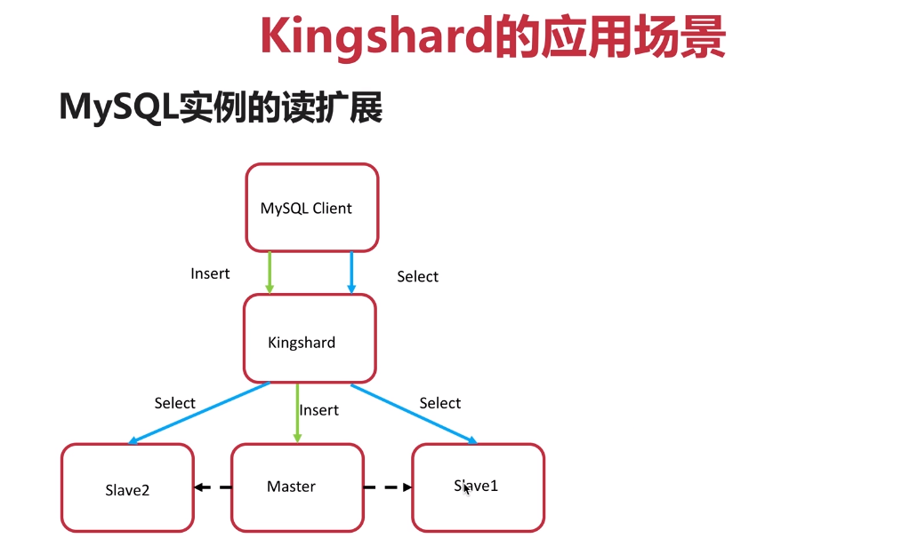
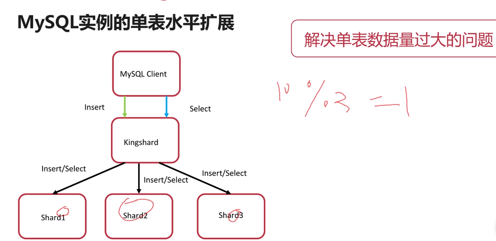
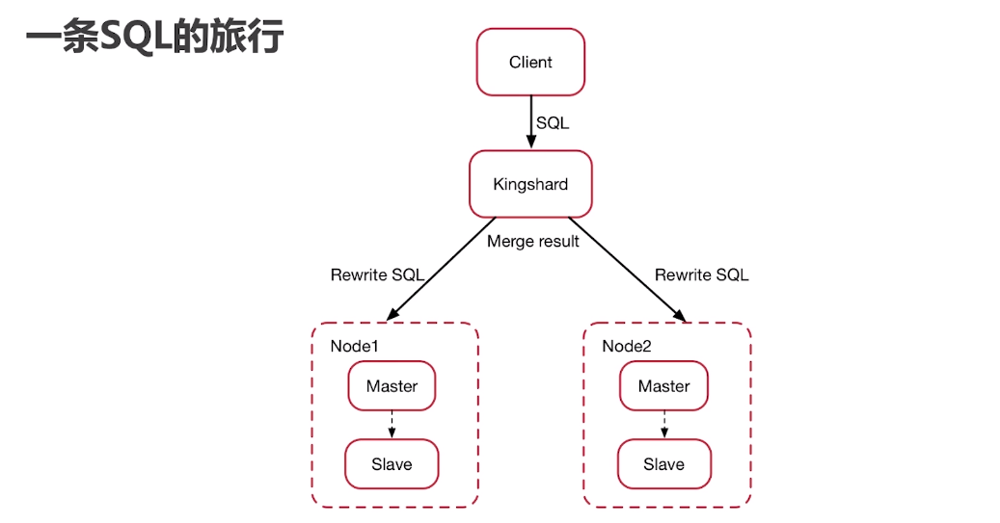
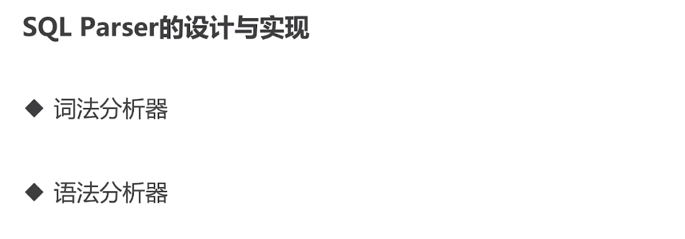
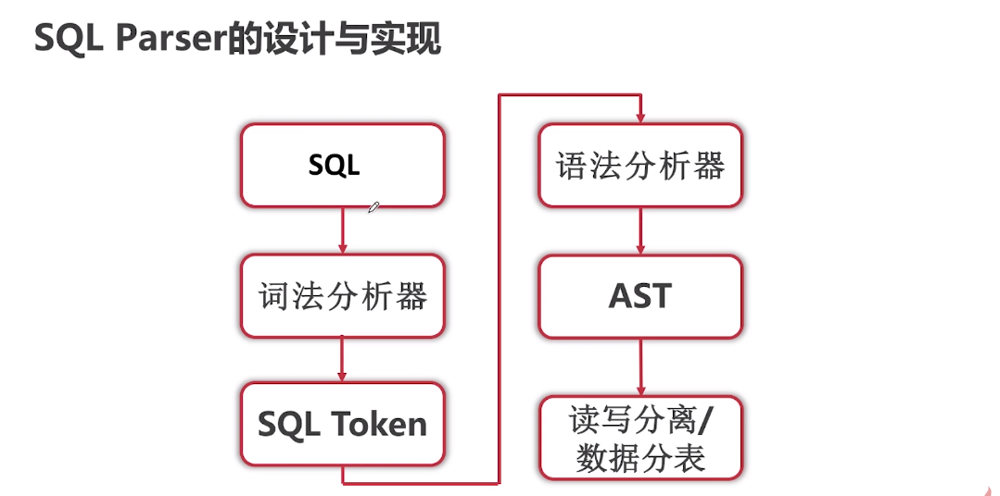
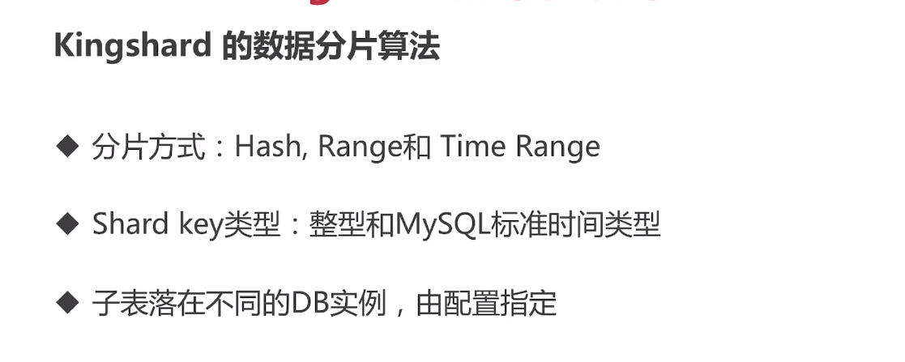
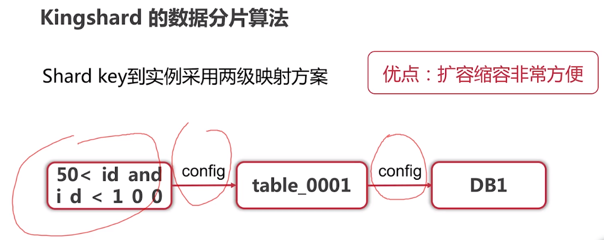

### Kingshard 学习笔记

#### Kingshard应用场景



```
针对插入的数据，由于数据同步的延迟，在从上不能查到数据，Kingshard 可以指定 查询 /*master*/ 进行指定在master进行执行
```



```
对于分表的join，需要 两个表有一个表是全表。
```

#### 一条SQL的旅行



#### SQL Parser的设计与实现



```
词法分析器：将SQL语句分割为一个个的单词（token）
语法分析器：语法分析器根据拆分的单词(token)构造语法分析树
```



```
AST 抽象语法树，可以简单的认为是一个结构体
```

#### Kingshard的数据分片算法



```
Hash: 一般为取模，均匀的分布数据到不同的表上，缺点是对于范围的查询并不友好
range: 对于范围查询是十分友好的，但是存在写热点的问题，对一个范围内的数据批量更新，会落到一个分片上
```



```
查询条件到 表的映射，对于hash这种方式，需要开始的时候建立足够的表，方便后续的数据量增大的扩容问题，而通过range的方式进行分表的方式不存在这样的扩容问题，当数据超过一定的量的时候，添加节点就好了。
表到 数据库的映射
```

