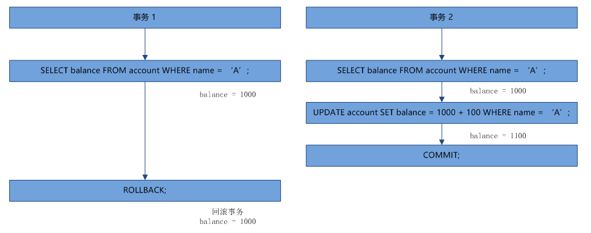
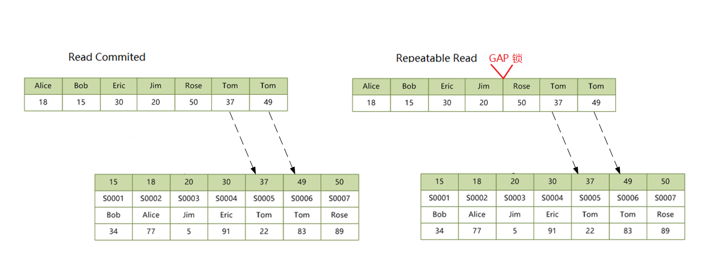

## MySQL解决死锁之路

### 解决死锁之路 - 学习事务与隔离级别

上个月在查看线上错误日志的时候，偶然发现了下面这样的异常，异常发生的次数并不是很多，但是可以看出几乎每天都有那么几次。看异常信息就知道是发生了数据库死锁，由于对这块不是很了解，加上这个异常对系统业务没有啥大的影响，所以就一直拖了一个月的时间。最近实在忍不住，于是花了两周的时间，从网上找到了各种关于数据库死锁相关的文章，将 MySQL 数据库的一些基础知识，包括事务、隔离级别、索引和锁等等知识点仔细复习了一遍，也顺利解决了线上的死锁问题。

异常信息如下：

```
`### Error updating database. Cause: com.mysql.jdbc.exceptions.jdbc4.MySQLTransactionRollbackException: ``Deadlock found when trying to get lock; try restarting transaction`
```

光从应用层面的这个日志肯定是定位不出问题的，这里面包含的信息太少了，几乎没有我们需要的信息。于是找到了 DBA，让他帮我拉一份数据库的死锁日志，谁知道线上数据库的死锁日志竟然没开，于是让他打开死锁日志开关，又等了一天，果不其然，第二天这个死锁又发生了，拿到了想要的日志文件。拿到死锁日志文件的时候其实还是很兴奋的，感觉问题肯定可以迎刃而解，但是打开文件的一刹那，我傻眼了，因为根本看不懂！没办法，只能开启学习模式恶补基础知识了。事后利用业余时间将相关的技术整理了一下，打算写一个死锁系列。

1. 学习事务与隔离级别
2. [了解常见锁类型](http://www.aneasystone.com/archives/2017/11/solving-dead-locks-two.html)
3. [掌握常见 SQL 语句的加锁分析](http://www.aneasystone.com/archives/2017/12/solving-dead-locks-three.html)
4. [死锁问题的分析和解决](http://www.aneasystone.com/archives/2018/04/solving-dead-locks-four.html)

说起死锁，则不得不说事务，当两个或两个以上的事务相互持有和请求锁的时候，如果形成一个循环的依赖关系，就会产生死锁。所以我们先从事务说起。

## 一、事务四要素：ACID

对于事务，我之前的理解是很粗糙的，不就是为了保证操作的原子性么？一般订单系统或者财务系统跟钱打交道的都会用到对吧？事务可以保证所有的操作一次性提交，要么全部成功，要么全部失败，譬如 A 转账给 B 100 元，先从 A 的账户里扣除 100 元，再在 B 的账户上加上 100 元，这两个操作必须同时成功，如果 A 的钱减了之后程序异常了，事务会将 A 的钱回滚回去，就是这么简单啊。

确实如此，原子性可以说是事务四要素中最直白的一个，也是最容易理解的一个。但是我们往往忽略了事务的另外三个要素：一致性、隔离性和持久性。这四个要素合起来就是 **ACID** 。

- 原子性（Atomicity）：要么全部完成，要么全部不完成；
- 一致性（Consistency）：一个事务单元需要提交之后才会被其他事务可见；
- 隔离性（Isolation）：并发事务之间不会互相影响，设立了不同程度的隔离级别，通过适度的破坏一致性，得以提高性能；
- 持久性（Durability）：事务提交后即持久化到磁盘不会丢失。

关于 **一致性** 的概念比较模糊，网上也存在着几种不同的解释，譬如[有的人理解是](http://novoland.github.io/数据库/2014/07/26/MySQL总结.html)：**事务开始前和结束后数据都是满足约束规则的，如外键约束**，我这里使用的是[这里的说法](http://fanyilun.me/2015/12/29/事务的隔离级别以及Mysql事务的使用/)，对错在其次，个人感觉比较容易理解吧，如果有意见欢迎讨论。

在大学学习数据库理论的时候，其实就已经接触过 ACID 了，记得考试时还考过一个选择题，“下面哪个不是数据库事务的四要素？”，只是当时对事务并没有什么感性的认识，只是照本宣科而已。现在回过头来看看 ACID 这四个要素，仔细想一想，数据库是如何实现这四要素的？发现还真不是那么简单。

但是对于我们了解死锁来说，我们还是应该把注意力放在 “I” 上面，因为不同的隔离级别，可能对应的加锁过程也不一样，而正是由于引入了各种各样的隔离级别，才让锁问题变得格外复杂。解决和分析死锁问题，首先得知道当前数据库的隔离级别。那么隔离级别是个什么东西呢？其实从上面也看的出来，隔离性和一致性是有冲突的，有时候为了提高性能，会适度的破坏一致性，可能会出现一个事务还没提交，它的修改就被其他事务看见了，这其实就是传说中的 **脏读**，它属于最低级的隔离级别：**读未提交** 。

## 二、事务并发存在的问题

在细讲事务的隔离级别之前，让我们先来看一下下面这张表，以及几个对这个表的操作，瞧瞧在多事务并发处理数据的时候可能会发生哪些意想不到的情况。

表很简单，就三个字段，主键 id、姓名 name 和余额 balance，其中 name 为二级索引，如下：


### 2.1 脏读（dirty read）

假设有两个事务，一个在进行转账操作，将 A 账户的 100 元转到 B 账户，同时有另一个事务在对 A 和 B 的账户余额进行求和统计，如下图所示：


我们不考虑任何加锁机制，仅仅从程序运行的角度来看，事务 1 执行成功之后，A 成功转了 100 元到 B 账户，这时 A 余额还剩 900 元，B 余额剩 1100，总和为 2000；但是事务 2 的统计求和算出来的结果却是 A + B = 1900。这个就是上面说的，没有提交的事务被其他事务读取到了，这叫做 **脏读** 。

### 2.2 不可重复读（unrepeatable read）

第二种场景叫 **不可重复读**，如下图所示，事务 2 第一次获取 A 的账户余额为 1000 元，这个时候事务 1 对 A 的账户余额进行操作减去了 100 元，事务 2 再去查询 A 的账户余额发现变成了 900 元，这样就出现了同一个事务对同一条记录读取两遍，两次读出来的结果竟然不一样。


不可重复读和脏读的区别在于，脏读是读取了另一个事务未提交的修改，而不可重复读是读取了另一个事务提交之后的修改，本质上都是其他事务的修改影响了本事务的读取。那么不可重复读有什么问题呢？假设上面的事务 2 存在着两个子例程，第一个例程是读取所有账户的余额计算总和，可以得到所有人的余额总和为 3000，第二个例程是再次读取所有账户的余额计算平均值，3 个人总和 3000 按理应该是平均每人 1000 才对，却计算出了 2900/3 = 966，这就导致了数据不一致。

### 2.3 幻读（phantom read）

第一次听到 **幻读** 这个名字觉得很酷，但是这个很酷的名字却是数据库中最难理解的一个名词之一。网上关于幻读和可重复读的讨论特别多，因为幻读和可重复读很类似，有时候真的傻傻分不清楚。对于幻读，最简单的解释就是：**同样的条件，第一次和第二次读出来的记录数不一样。**幻读和不可重复读的区别在于，后者是两次读取同一条记录，得到不一样的结果；而前者是两次读取同一个范围内的记录，得到不一样的记录数（这种说法其实只是便于理解，但并不准确，因为可能存在另一个事务先插入一条记录然后再删除一条记录的情况，这个时候两次查询得到的记录数也是一样的，但这也是幻读，所以严格点的说法应该是：**两次读取得到的结果集不一样**）。很显然，不可重复读是因为其他事务进行了 UPDATE 操作，幻读是因为其他事务进行了 INSERT 或者 DELETE 操作。同样的，下面举一个幻读的例子：


事务 2 的两次查询，第一次查出 2 条记录，第二次却查出 3 条记录，多出来的这条记录，正如 phantom（幽灵，幻影，错觉） 的意思，就像幽灵一样。

### 2.4 丢失更新（lost update）

上面说的三种情况，都是一个事务写，一个事务读，由于一个事务的写导致另一个事务读到了不该读的数据；那么如果两个事务都是写，又会发生什么呢？

假设两个事务同时对 A 的余额进行修改，他们都查出 A 的当前余额为 1000，然后事务 2 修改 A 的余额，将 A 的余额加 100 变成 1100 并提交，这个时候 A 的余额应该是 1100，但是这个时候事务 1 并不知道 A 的余额已经变动，而是继续在 1000 的基础上进行减 100 的操作并提交事务，就这样事务 2 的提交被覆盖掉了，事务 1 提交之后 A 的余额变成了 900 元。这就是说事务 1 的提交覆盖了事务 2 的提交，事务 2 的 UPDATE 操作完全丢失了，整个过程如下图所示：


这就是经典的 **丢失更新** 问题，由于最后一步是提交操作，所以又叫做 **提交覆盖**，有时候又叫 [**Read-Modify-Write 问题**](https://en.wikipedia.org/wiki/Read-modify-write)。一个典型的场景是并发对某个变量进行自增或自减，譬如商品表的库存字段，每次下单之后库存值需要减 1，大概的流程如下：

1. SELECT name, stock FROM product WHERE id = 100;
2. 判断 stock 值是否足够，如果足够，则下单：if (stock > n) process order;
3. 更新 stock 值，减去下单的商品数量：new_stock = stock - n;
4. UPDATE product SET stock = new_stock WHERE id = 100;

如果两个线程同时下单，很可能就会出现下面这样的情况：

1. 线程 A 获取库存值为 10；
2. 线程 B 获取库存值为 10；
3. 线程 A 需要买 5 个商品，校验通过，并下单；
4. 线程 B 需要买 5 个商品，校验通过，并下单；
5. 线程 A 下单完成，更新库存值为 10 - 5 = 5；
6. 线程 B 下单完成，更新库存值为 10 - 5 = 5；

两个线程下单结束后，商品的库存还剩 5 个，而实际上 10 个商品都已经卖光了。和提交覆盖相对的，还有另一个 **丢失更新** 问题，叫做 **回滚覆盖**，如下图所示：



操作和提交覆盖情景基本上一样，只是最后一步事务 1 的提交变成了回滚，这样 A 的余额恢复成原始值 1000，事务 2 的 UPDATE 操作也完全没有生效，想一想这真的是非常可怕，一个事务的回滚操作竟然影响了另一个正常提交的事务。回滚覆盖问题可以说是程序 bug 了，因此几乎所有的数据库都不允许回滚覆盖。

有时候我们把回滚覆盖称之为 **第一类丢失更新** 问题，提交覆盖称为 **第二类丢失更新** 问题。

## 三、隔离级别

上面说了这么多并发场景下数据操作可能遇到的问题，那么要如何解决呢？我们能想到的最简单的方法就是对操作的数据进行加锁，写的时候不允许其他事务读，读的时候不允许其他事务写，这样是不是就完美解决了？确实如此。这其实就是四大隔离级别里的 **序列化**，在序列化隔离级别下，可以保证事务的安全执行，数据库的一致性得以保障，但是它大大降低了事务的并发能力，性能最低。

为了调和事务的安全性和性能之间的冲突，适当的降低隔离级别，可以有效的提高数据库的并发性能。于是便有了四种不同的隔离级别：

- 读未提交（Read Uncommitted）：可以读取未提交的记录，会出现脏读，幻读，不可重复读，所有并发问题都可能遇到；
- 读已提交（Read Committed）：事务中只能看到已提交的修改，不会出现脏读现象，但是会出现幻读，不可重复读；（大多数数据库的默认隔离级别都是 RC，但是 MySQL InnoDb 默认是 RR）
- 可重复读（Repeatable Read）：MySQL InnoDb 默认的隔离级别，解决了不可重复读问题，但是任然存在幻读问题；（MySQL 的实现有差异，后面介绍）
- 序列化（Serializable）：最高隔离级别，啥并发问题都没有。

针对这四种隔离级别，应该根据具体的业务来取舍，如果某个系统的业务里根本就不会出现重复读的场景，完全可以将数据库的隔离级别设置为 RC，这样可以最大程度的提高数据库的并发性。不同的隔离级别和可能发生的并发现象如下表：


其中，在 **可重复读（RR）** 隔离级别下，是否可能出现第二类丢失更新问题（提交覆盖）比较有争议，有的人认为提交覆盖问题其实是不可重复读问题的一种特殊形式，所以在 RR 隔离级别解决了不可重复读，自然也不可能出现提交覆盖，比如 [这里](http://fanyilun.me/2015/12/29/事务的隔离级别以及Mysql事务的使用/) 和 [这里](http://blog.csdn.net/zhangzeyuaaa/article/details/46400419)，但是也有人认为 RR 下会出现提交覆盖问题，比如 [Mysql Repeatable-Read级别第二类丢失更新](http://weifuwu.io/2015/12/30/mysql-second-kind-lose-update/)。我自己在 MySQL 的 RR 隔离级别下做了个类似的实验，发现确实会存在提交覆盖，目前我对这个问题也比较迷茫，如果有哪位同学知道，还望不吝赐教。

------------------- 2017-10-01 补充 -----------------------

通过查阅多方资料，终于对这个问题有了一个初步的认识。网上对此有很多不一致的说法，其实也是因为 MySQL 的实现和 ANSI-SQL 标准之间的差异，在标准的传统实现中，RR 隔离级别是使用持续的 X 锁和持续的 S 锁来实现的（参看下面的 “隔离级别的实现” 一节），由于是持续的 S 锁，所以避免了其他事务有写操作，也就不存在提交覆盖问题。但是 MySQL 在 RR 隔离级别下，普通的 SELECT 语句只是快照读，没有任何的加锁，和标准的 RR 是不一样的。如果要让 MySQL 在 RR 隔离级别下不发生提交覆盖，可以使用 SELECT ... LOCK IN SHARE MODE 或者 SELECT ... FOR UPDATE 。

## 四、隔离级别的实现

上面所说的事务和隔离级别的概念，其实都是 SQL 标准中通用的概念，但是不同的数据库产品对标准的实现也会有很大的不同。譬如在 SQL 标准中，RR 隔离级别解决了不可重复读问题，但是依然存在幻读现象；而在 MySQL 的 RR 隔离级别下，通过多版本快照读和间隙锁技术解决了幻读问题。关于这一点也有人心存质疑，譬如 [Innodb 中 RR 隔离级别能否防止幻读？](https://github.com/Yhzhtk/note/issues/42) 和 [MySQL的InnoDB的幻读问题](http://blog.sina.com.cn/s/blog_499740cb0100ugs7.html)，不过我认为第二篇博客中讲的两种场景，都不算是幻读现象。第一种场景是事务 1 SELECT 的时候提示没有记录，但是 INSERT 的时候却报主键冲突，这其实混淆了当前读和快照读，事务 1 SELECT 的时候是快照读，而 INSERT 的时候必须先进行一次当前读确保主键不冲突然后才能插入数据，我们在 INSERT 报错之后，继续使用 SELECT 查询，可以发现还是会提示没有记录，这正说明了事务 1 没有发生幻读现象。第二种场景是事务 1 SELECT 的时候只有一条记录，但是 UPDATE 的时候却提示两条记录被修改，而且 UPDATE 之后再进行 SELECT 也会返回两条记录。至于这个现象到底算不算幻读，我也不好说，因为它感觉也符合幻读的定义（两次同样的查询返回的结果集不同），但是问题是这两次查询之间存在 UPDATE 操作，UPDATE 语句会更新当前事务的版本号，所以后面的 SELECT 是使用新的版本号进行快照读了，这和在两个 SELECT 语句之间插入一个 INSERT 语句效果是一样的，如果在两个 SELECT 语句之间插入一个 INSERT，第二次的查询结果和第一次的查询结果也不一样，难道这也算幻读么？

<span style='color:red'>我不确定的是，这个现象是不是 read skew、write skew 问题？</span> 在这篇博客的最后，作者写道：

> 可重复读和提交读是矛盾的。在同一个事务里，如果保证了可重复读，就会看不到其他事务的提交，违背了提交读；如果保证了提交读，就会导致前后两次读到的结果不一致，违背了可重复读。

对于这句话，我表示深深的认可。不过我仍倾向于认同 MySQL 的 RR 隔离级别下不存在幻读现象，因为“幻读”的这个“读”字在 MySQL 里本身就存在歧义，这个“读”到底指的是快照读，还是当前读？如果是快照读，MySQL 通过版本号来保证同一个事务里每次查询得到的结果集都是一致的；如果是当前读，MySQL 通过 Next-key locks 保证其他事务无法插入新的数据，从而避免幻读问题。当然，如果你的场景里一会是快照读，一会是当前读，导致幻读现象，MySQL 也只能表示自己很无奈了。

### 4.1 传统的隔离级别

上面说了很多，其实我一直在刻意的避免谈到锁，因为隔离级别和锁本身就是两个东西，SQL 规范中定义的四种隔离级别，分别是为了解决事务并发时可能遇到的四种问题，至于如何解决，实现方式是什么，规范中并没有严格定义。锁作为最简单最显而易见的实现方式，可能被广为人知，所以大家在讨论某个隔离级别的时候，往往会说这个隔离级别的加锁方式是什么样的。其实，锁只是实现隔离级别的几种方式之一，除了锁，实现并发问题的方式还有[时间戳](https://en.wikipedia.org/wiki/Timestamp-based_concurrency_control)，[多版本控制](https://en.wikipedia.org/wiki/Multiversion_concurrency_control)等等，这些也可以称为[无锁的并发控制](https://en.wikipedia.org/wiki/Non-lock_concurrency_control)。

传统的隔离级别是基于锁实现的，这种方式叫做 **基于锁的并发控制（Lock-Based Concurrent Control，简写 LBCC）**。通过对读写操作加不同的锁，以及对释放锁的时机进行不同的控制，就可以实现四种隔离级别。传统的锁有两种：读操作通常加共享锁（Share locks，S锁，又叫读锁），写操作加排它锁（Exclusive locks，X锁，又叫写锁）；加了共享锁的记录，其他事务也可以读，但不能写；加了排它锁的记录，其他事务既不能读，也不能写。另外，对于锁的粒度，又分为行锁和表锁，行锁只锁某行记录，对其他行的操作不受影响，表锁会锁住整张表，所有对这个表的操作都受影响。

归纳起来，四种隔离级别的加锁策略如下：

- 读未提交（Read Uncommitted）：事务读不阻塞其他事务读和写，事务写阻塞其他事务写但不阻塞读；通过对写操作加 “持续X锁”，对读操作不加锁 实现；
- 读已提交（Read Committed）：事务读不会阻塞其他事务读和写，事务写会阻塞其他事务读和写；通过对写操作加 “持续X锁”，对读操作加 “临时S锁” 实现；不会出现脏读；
- 可重复读（Repeatable Read）：事务读会阻塞其他事务事务写但不阻塞读，事务写会阻塞其他事务读和写；通过对写操作加 “持续X锁”，对读操作加 “持续S锁” 实现；
- 序列化（Serializable）：为了解决幻读问题，行级锁做不到，需使用表级锁。

结合上面介绍的每种隔离级别分别是用来解决事务并发中的什么问题，再来看看它的加锁策略其实都挺有意思的。其中 **读未提交** 网上有很多人认为不需要加任何锁，这其实是错误的，我们上面讲过，有一种并发问题在任何隔离级别下都不允许存在，那就是第一类丢失更新（回滚覆盖），如果不对写操作加 X 锁，当两个事务同时去写某条记录时，可能会出现丢失更新问题，[这里](http://www.jianshu.com/p/71a79d838443) 有一个例子可以看到写操作不加 X 锁发生了回滚覆盖。再看 **读已提交**，它是为了解决脏读问题，只能读取已提交的记录，要怎么做才可以保证事务中的读操作读到的记录都是已提交的呢？很简单，对读操作加上 S 锁，这样如果其他事务有正在写的操作，必须等待写操作提交之后才能读，因为 S 和 X 互斥，如果在读的过程中其他事务想写，也必须等事务读完之后才可以。这里的 S 锁是一个临时 S 锁，表示事务读完之后立即释放该锁，可以让其他事务继续写，如果事务再读的话，就可能读到不一样的记录，这就是 **不可重复读** 了。为了让事务可以重复读，加在读操作的 S 锁变成了持续 S 锁，也就是直到事务结束时才释放该锁，这可以保证整个事务过程中，其他事务无法进行写操作，所以每次读出来的记录是一样的。最后，**序列化** 隔离级别下单纯的使用行锁已经实现不了，因为行锁不能阻止其他事务的插入操作，这就会导致幻读问题，这种情况下，我们可以把锁加到表上（也可以通过范围锁来实现，但是表锁就相当于把表的整个范围锁住，也算是特殊的范围锁吧）。

从上面的描述可以看出，通过对锁的类型（读锁还是写锁），锁的粒度（行锁还是表锁），持有锁的时间（临时锁还是持续锁）合理的进行组合，就可以实现四种不同的隔离级别。这四种不同的加锁策略实际上又称为 **封锁协议（Locking Protocol）**，所谓协议，就是说不论加锁还是释放锁都得按照特定的规则来。**读未提交** 的加锁策略又称为 **一级封锁协议**，后面的分别是二级，三级，**序列化** 的加锁策略又称为 **四级封锁协议**。

其中三级封锁协议在事务的过程中为写操作加持续 X 锁，为读操作加持续 S 锁，并且在事务结束时才对锁进行释放，像这种加锁和解锁明确的分成两个阶段我们把它称作 **两段锁协议（2-phase locking，简称 2PL）**。在两段锁协议中规定，加锁阶段只允许加锁，不允许解锁；而解锁阶段只允许解锁，不允许加锁。这种方式虽然无法避免死锁，但是两段锁协议可以保证事务的并发调度是串行化的（关于串行化是一个非常重要的概念，尤其是在数据恢复和备份的时候）。在两段锁协议中，还有一种特殊的形式，叫 **一次封锁**，意思是指在事务开始的时候，将事务可能遇到的数据全部一次锁住，再在事务结束时全部一次释放，这种方式可以有效的避免死锁发生。但是这在数据库系统中并不适用，因为事务开始时并不知道这个事务要用到哪些数据，一般在应用程序中使用的比较多。

### 4.2 MySQL 的隔离级别

虽然数据库的四种隔离级别通过 LBCC 技术都可以实现，但是它最大的问题是它只实现了并发的读读，对于并发的读写还是冲突的，写时不能读，读时不能写，当读写操作都很频繁时，数据库的并发性将大大降低，针对这种场景，MVCC 技术应运而生。MVCC 的全称叫做 **Multi-Version Concurrent Control（多版本并发控制）**，InnoDb 会为每一行记录增加几个隐含的“辅助字段”，（实际上是 3 个字段：一个隐式的 ID 字段，一个事务 ID，还有一个回滚指针），事务在写一条记录时会将其拷贝一份生成这条记录的一个原始拷贝，写操作同样还是会对原记录加锁，但是读操作会读取未加锁的新记录，这就保证了读写并行。要注意的是，生成的新版本其实就是 **undo log**，它也是实现事务回滚的关键技术。关于 InnoDb 的 MVCC 机制的实现原理推荐看下这篇文章：[MySQL数据库事务各隔离级别加锁情况--read committed && MVCC](http://www.imooc.com/article/17290)。

InnoDb 通过 MVCC 实现了读写并行，但是在不同的隔离级别下，读的方式也是有所区别的。首先要特别指出的是，在 read uncommit 隔离级别下，每次都是读取最新版本的数据行，所以不能用 MVCC 的多版本，而 serializable 隔离级别每次读取操作都会为记录加上读锁，也和 MVCC 不兼容，所以只有 RC 和 RR 这两个隔离级别才有 MVCC。下面我们通过两个例子，来看看这两个隔离级别下 MVCC 有什么区别。

还是使用上面的 account 表，首先将 MySQL 的事务隔离级别设置为 RR，然后开启一个事务，执行下面的 SQL：

```
`mysql> begin;``Query OK, 0 rows affected (0.00 sec)` `mysql> select * from account where id = 1;``+----+----------+---------+``| id |   name | balance |``+----+----------+---------+``| 1 |    A | 1000  |``+----+----------+---------+``1 row in set (0.00 sec)` `mysql> update account set balance = 2000 where id = 1;``Query OK, 1 row affected (0.00 sec)``Rows matched: 1 Changed: 1 Warnings: 0` `mysql> select * from account where id = 1;``+----+----------+---------+``| id |   name | balance |``+----+----------+---------+``| 1 |    A | 2000  |``+----+----------+---------+``1 row in set (0.00 sec)`
```

开启第二个事务，如下：

```
`mysql> begin;``Query OK, 0 rows affected (0.00 sec)` `mysql> select * from account where id = 1;``+----+----------+---------+``| id |   name | balance |``+----+----------+---------+``| 1 |    A | 1000  |``+----+----------+---------+``1 row in set (0.00 sec)`
```

可以看到事务 2 查询出来的还是 A 原始的信息，这个时候事务 1 使用 commit 提交：

```
`mysql> commit;``Query OK, 0 rows affected (0.05 sec)`
```

并在事务 2 中再查询一次，发现查询出来的结果不变，还是原始值：

```
`mysql> select * from account where id = 1;``+----+----------+---------+``| id |   name | balance |``+----+----------+---------+``| 1 |    A | 1000  |``+----+----------+---------+``1 row in set (0.00 sec)`
```

同样的，我们将数据库的隔离级别设置为 RC，重新做一次这个实验，第一步都是一样的，只是第二步当事务 1 commit 之后，事务 2 再查一次发现查询出来的是最新提交的记录了：

```
`mysql> select * from account where id = 1;``+----+----------+---------+``| id |   name | balance |``+----+----------+---------+``| 1 |    A | 2000  |``+----+----------+---------+``1 row in set (0.00 sec)`
```

通过这个实验可以知道，尽管 RR 和 RC 隔离级别都实现了 MVCC 来满足读写并行，但是读的实现方式是不一样的：**RC 总是读取记录的最新版本，如果该记录被锁住，则读取该记录最新的一次快照，而 RR 是读取该记录事务开始时的那个版本。**虽然这两种读取方式不一样，但是它们读取的都是快照数据，并不会被写操作阻塞，所以这种读操作称为 **快照读（Snapshot Read）**，有时候也叫做 **非阻塞读（Nonlocking Read）**，RR 隔离级别下的叫做 [**一致性非阻塞读（Consistent Nonlocking Read）**](https://dev.mysql.com/doc/refman/5.7/en/innodb-consistent-read.html)。

除了 **快照读** ，MySQL 还提供了另一种读取方式：**当前读（Current Read）**，有时候又叫做 **加锁读（Locking Read）** 或者 **阻塞读（Blocking Read）**，这种读操作读的不再是数据的快照版本，而是数据的最新版本，并会对数据加锁，根据加锁的不同，又分成两类：

- SELECT ... LOCK IN SHARE MODE：加 S 锁
- SELECT ... FOR UPDATE：加 X 锁
- INSERT / UPDATE / DELETE：加 X 锁

当前读在 RR 和 RC 两种隔离级别下的实现也是不一样的：**RC 只加记录锁，RR 除了加记录锁，还会加间隙锁，用于解决幻读问题**，关于记录锁和间隙锁的概念后面再讲，有兴趣的同学可以和上面一样，通过两个例子来感受一下。

首先在 RC 隔离级别下，开启一个事务，执行下面的 SQL 查询所有 id > 3 的记录，使用当前读而不是快照读：

```
`mysql> begin;``Query OK, 0 rows affected (0.00 sec)` `mysql> select * from account where id > 3 lock in share mode;``+----+----------+---------+``| id |   name | balance |``+----+----------+---------+``| 4 |    D | 1000  |``+----+----------+---------+``1 row in set (0.00 sec)`
```

同时，开启另一个事务，向 account 表中新增一条记录，然后修改 id = 4 的记录：

```
`mysql> begin;``Query OK, 0 rows affected (0.00 sec)` `mysql> insert into account(name, balance) value('E', 1000);``Query OK, 1 row affected (6.24 sec)` `mysql> update account set balance = 2000 where id = 4;`
```

可以看到事务 2 在事务 1 当前读之后，仍然可以新增记录，但是在执行 update 操作的时候被阻塞，这说明了事务 1 在执行当前读的时候在 id = 4 这条记录上加了锁，但是并没有对 id > 3 这个范围加锁。然后我们切换到事务 1 中，再次查询：

```
`mysql> select * from account where id > 3 lock in share mode;``ERROR 1213 (40001): Deadlock found when trying to get lock; try restarting transaction`
```

这个时候事务 1 直接死锁了，原因其实很简单，事务 2 在 insert 新纪录的时候（id = 5）会在新纪录上加锁，所以事务 1 再次执行当前读，想获取 id > 3 的记录，就需要在 id = 4 和 id = 5 这两条记录上加锁，但是 id = 5 这条记录已经被事务 2 锁住了，于是事务 1 被事务 2 阻塞，同时事务 2 还在等待 事务 1 释放 id = 4 上的锁，于是便产生了死锁。

接下来把隔离级别设置成 RR，再重复事务 1 刚刚的操作：

```
`mysql> begin;``Query OK, 0 rows affected (0.00 sec)` `mysql> select * from account where id > 3 lock in share mode;``+----+----------+---------+``| id |   name | balance |``+----+----------+---------+``| 4 |    D | 1000  |``+----+----------+---------+``1 row in set (0.00 sec)`
```

同时，事务 2 向 account 表中新增一条记录：

```
`mysql> begin;``Query OK, 0 rows affected (0.00 sec)` `mysql> insert into account(name, balance) value('E', 1000);`
```

我们发现，这个时候事务 2 就被阻塞了，很显然事务 1 在执行 select ... lock in share mode 的时候，不仅在 id = 4 这条记录上加了锁，而且在 id > 3 这个范围上也加了锁。

关于 MySQL 不同的隔离级别，读操作的差异总结起来如下图所示（其中，读未提交和可序列化都和 MVCC 不兼容，可以暂且认为它们都属于当前读）：


### 4.3 查看和设置 MySQL 的隔离级别

可以通过查看 MySQL 中的系统变量 `tx_isolation` 的值来确定当前 MySQL 正在使用什么隔离级别。使用下面的 SQL 查询当前数据库的隔离级别：

```
`mysql> select @@tx_isolation;``+-----------------+``| @@tx_isolation |``+-----------------+``| REPEATABLE-READ |``+-----------------+`
```

这里要注意的是在 MySQL 中变量一般分为两类：**用户变量** 和 **系统变量**，用户变量的变量名格式为 `@variable`，而系统变量的格式为 `@@variable`，`tx_isolation` 是系统变量，所以变量名为 `@@tx_isolation`。其中，系统变量又可以分为 **全局变量** 和 **会话变量**，默认情况下使用 `select @@variable` 查询出来的是会话变量的值，也可以写作 `select @@session.variable` 或者 `select @@local.variable`，如果要查询全局变量的值，则使用 `select @@global.variable`。

所以通常使用下面的 SQL 查询数据库的隔离级别：

```
`mysql> select @@session.tx_isolation, @@global.tx_isolation;``+------------------------+-----------------------+``| @@session.tx_isolation | @@global.tx_isolation |``+------------------------+-----------------------+``| REPEATABLE-READ    | REPEATABLE-READ    |``+------------------------+-----------------------+`
```

另外可以使用 [`SET TRANSACTION`](https://dev.mysql.com/doc/refman/5.7/en/set-transaction.html) 命令修改 MySQL 的隔离级别，譬如下面的 SQL 修改隔离级别为 RC：

```
`mysql> set transaction isolation level read committed;`
```

同样其他的隔离级别可以使用下面的 SQL 进行修改：

- set transaction isolation level read uncommitted;
- set transaction isolation level read committed;
- set transaction isolation level repeatable read;
- set transaction isolation level serializable;

这里也有一个要注意的地方，默认的 `SET TRANSACTION` 命令 **只对当前会话的下一个事务有效**，当下个事务结束之后，下下个事务又会恢复到当前会话的隔离级别。我在这个地方困惑了好久，因为使用 `SET TRANSACTION` 命令设置完隔离级别之后，通过 `select @@tx_isolation` 查询当前会话的隔离级别是不会变化的，但是实际上下一个事务的隔离级别确实已经修改了（而且似乎没有什么好的方法可以查询当前事务的隔离级别，如果有谁知道，欢迎指点一二 ^_^）。

------------------- 2017-10-14 补充 -----------------------

找到了一种可以查看事务隔离级别的方法，那就是查 `information_schema.INNODB_TRX` 表。这种方式有一个不方便的地方在于，事务里必须要先执行一条 SQL 语句，才会在 INNODB_TRX 表中有记录，如下所示：

```
`mysql> select * from information_schema.INNODB_TRX\G``*************************** 1. row ***************************``          ``trx_id: 282133714024240``         ``trx_state: RUNNING``        ``trx_started: 2017-10-14 23:12:58``   ``trx_requested_lock_id: NULL``     ``trx_wait_started: NULL``        ``trx_weight: 0``    ``trx_mysql_thread_id: 40``         ``trx_query: NULL``    ``trx_operation_state: NULL``     ``trx_tables_in_use: 0``     ``trx_tables_locked: 0``     ``trx_lock_structs: 0``   ``trx_lock_memory_bytes: 1136``      ``trx_rows_locked: 0``     ``trx_rows_modified: 0``  ``trx_concurrency_tickets: 0``    ``trx_isolation_level: READ COMMITTED``     ``trx_unique_checks: 1``  ``trx_foreign_key_checks: 1``trx_last_foreign_key_error: NULL`` ``trx_adaptive_hash_latched: 0`` ``trx_adaptive_hash_timeout: 0``     ``trx_is_read_only: 0``trx_autocommit_non_locking: 0``1 row in set (0.00 sec)`
```

如果要修改当前会话的隔离级别，而不是仅仅下一个事务的隔离级别（这在做实验时挺有用的），需要使用下面命令：

```
`mysql> set session transaction isolation level read committed;`
```

另外，也可以使用修改系统变量的方法来修改隔离级别：

```
`mysql> set @@session.tx_isolation = 'READ-COMMITTED';`
```

如果要修改全局变量的话，则使用命令 `set global transaction isolation level ...` 或者 `set @@global.tx_isolation = ...`，方法与上面类似，不再赘述。不过要注意的是，这个命令不会改变当前会话的隔离级别，而是对新的会话有影响，所以要关闭当前会话，重新开启一个会话才能看到效果。

#### 题外话：事务 与 autocommit

> 网上有很多文章中在开启事务之前，还会提到要先执行一下 `set autocommit = 0;` 其实我感觉没有必要。autocommit 的默认值为 1，指的是 MySQL 默认情况下会自动提交执行的每一条 SQL 语句，每执行一条 SQL 都会新建一个独立的事务，这其实叫做 **隐式事务（implicit transaction）**；而我们经常用的 begin/start transaction 这种方式新建的事务叫做 **显式事务（explicit transaction）**，并使用 commit/rollback 来结束事务。我们在 MySQL Client 里测试的时候，这种交互方式其实就是典型的隐式事务，不过大多数时候我们都是用 begin/commit 来测试，用 begin 开启一个事务的时候，autocommit 就相当于设置成 0 了，完全没必要手工再设置这个值。不过有意思的是，我们也可以使用 set autocommit = 0/set autocommit = 1 来替代 begin/commit，效果是一样的。

## 参考

1. [数据库的脏读、幻读、不可重复读](http://dr-yanglong.github.io/2016/06/06/transaction-feature/)
2. [事务的隔离级别以及Mysql事务的使用](http://fanyilun.me/2015/12/29/事务的隔离级别以及Mysql事务的使用/)
3. [事务并发的可能问题与其解决方案](http://www.jianshu.com/p/71a79d838443)
4. [Innodb 中 RR 隔离级别能否防止幻读？](https://github.com/Yhzhtk/note/issues/42)
5. [Innodb中的事务隔离级别和锁的关系](https://tech.meituan.com/innodb-lock.html)
6. [MySQL总结](http://novoland.github.io/数据库/2014/07/26/MySQL总结.html)
7. [MySQL的并发控制与加锁分析](http://www.cnblogs.com/yelbosh/p/5813865.html)
8. [MySQL加锁分析](http://www.fanyilun.me/2017/04/20/MySQL加锁分析/)
9. [数据库并发不一致分析](http://yhzhtk.info/2014/06/16/database-consistency-lock.html)
10. [MySQL的InnoDB的幻读问题](http://blog.sina.com.cn/s/blog_499740cb0100ugs7.html)
11. [mysql、innodb和加锁分析](https://liuzhengyang.github.io/2016/09/25/mysqlinnodb/)
12. [mysql的write skew问题](http://blog.csdn.net/load2006/article/details/53505407)
13. [浅谈数据库隔离级别](http://loopjump.com/db_isolation_level/)
14. [数据库并发的五个问题以及四级封锁协议与事务隔离的四个级别](http://blog.csdn.net/zhangzeyuaaa/article/details/46400419)
15. [MySQL 乐观锁与悲观锁](http://www.jianshu.com/p/f5ff017db62a)

### 解决死锁之路 - 了解常见的锁类型

在上一篇博客中，我们学习了事务以及事务并发时可能遇到的问题，并介绍了四种不同的隔离级别来解决这些并发问题，在隔离级别的实现一节中，我们提到了锁的概念，锁是实现事务并发的关键。其实，锁的概念不仅仅出现在数据库中，在大多数的编程语言中也存在，譬如 Java 中的 synchronized，C# 中的 lock 等，所以对于开发同学来说应该是不陌生的。但是数据库中的锁有很多花样，一会是行锁表锁，一会是读锁写锁，又一会是记录锁意向锁，概念真是层出不穷，估计很多同学就晕了。

在讨论传统的隔离级别实现的时候，我们就提到：通过对锁的类型（读锁还是写锁），锁的粒度（行锁还是表锁），持有锁的时间（临时锁还是持续锁）合理的进行组合，就可以实现四种不同的隔离级别；但是上一篇博客中并没有对锁做更深入的介绍，我们这一篇就来仔细的学习下 MySQL 中常见的锁类型。

这是《解决死锁之路》系列博文中的一篇，你还可以阅读其他几篇：

1. [学习事务与隔离级别](http://www.aneasystone.com/archives/2017/10/solving-dead-locks-one.html)
2. 了解常见的锁类型
3. [掌握常见 SQL 语句的加锁分析](http://www.aneasystone.com/archives/2017/12/solving-dead-locks-three.html)
4. [死锁问题的分析和解决](http://www.aneasystone.com/archives/2018/04/solving-dead-locks-four.html)

## 一、表锁 vs. 行锁

在 MySQL 中锁的种类有很多，但是最基本的还是表锁和行锁：表锁指的是对一整张表加锁，一般是 DDL 处理时使用，也可以自己在 SQL 中指定；而行锁指的是锁定某一行数据或某几行，或行和行之间的间隙。行锁的加锁方法比较复杂，但是由于只锁住有限的数据，对于其它数据不加限制，所以并发能力强，通常都是用行锁来处理并发事务。表锁由 MySQL 服务器实现，行锁由存储引擎实现，常见的就是 InnoDb，所以通常我们在讨论行锁时，隐含的一层意义就是数据库的存储引擎为 InnoDb ，而 MyISAM 存储引擎只能使用表锁。

### 1.1 表锁

表锁由 MySQL 服务器实现，所以无论你的存储引擎是什么，都可以使用。一般在执行 DDL 语句时，譬如 **ALTER TABLE** 就会对整个表进行加锁。在执行 SQL 语句时，也可以明确对某个表加锁，譬如下面的例子：

```
`mysql> lock table products read;``Query OK, 0 rows affected (0.00 sec)` `mysql> select * from products where id = 100;` `mysql> unlock tables;``Query OK, 0 rows affected (0.00 sec)`
```

上面的 SQL 首先对 products 表加一个表锁，然后执行查询语句，最后释放表锁。表锁可以细分成两种：读锁和写锁，如果是加写锁，则是 `lock table products write` 。详细的语法可以参考 [MySQL 的官网文档](https://dev.mysql.com/doc/refman/5.7/en/lock-tables.html)。

关于表锁，我们要了解它的加锁和解锁原则，要注意的是它使用的是 **一次封锁** 技术，也就是说，我们会在会话开始的地方使用 lock 命令将后面所有要用到的表加上锁，在锁释放之前，我们只能访问这些加锁的表，不能访问其他的表，最后通过 unlock tables 释放所有表锁。这样的好处是，不会发生死锁！所以我们在 MyISAM 存储引擎中，是不可能看到死锁场景的。对多个表加锁的例子如下：

```
`mysql> lock table products read, orders read;``Query OK, 0 rows affected (0.00 sec)` `mysql> select * from products where id = 100;` `mysql> select * from orders where id = 200;` `mysql> select * from users where id = 300;``ERROR 1100 (HY000): Table 'users' was not locked with LOCK TABLES` `mysql> update orders set price = 5000 where id = 200;``ERROR 1099 (HY000): Table 'orders' was locked with a READ lock and can't be updated` `mysql> unlock tables;``Query OK, 0 rows affected (0.00 sec)`
```

可以看到由于没有对 users 表加锁，在持有表锁的情况下是不能读取的，另外，由于加的是读锁，所以后面也不能对 orders 表进行更新。MySQL 表锁的加锁规则如下：

- 对于读锁
  - 持有读锁的会话可以读表，但不能写表；
  - 允许多个会话同时持有读锁；
  - 其他会话就算没有给表加读锁，也是可以读表的，但是不能写表；
  - 其他会话申请该表写锁时会阻塞，直到锁释放。
- 对于写锁
  - 持有写锁的会话既可以读表，也可以写表；
  - 只有持有写锁的会话才可以访问该表，其他会话访问该表会被阻塞，直到锁释放；
  - 其他会话无论申请该表的读锁或写锁，都会阻塞，直到锁释放。

锁的释放规则如下：

- 使用 UNLOCK TABLES 语句可以显示释放表锁；
- 如果会话在持有表锁的情况下执行 LOCK TABLES 语句，将会释放该会话之前持有的锁；
- 如果会话在持有表锁的情况下执行 START TRANSACTION 或 BEGIN 开启一个事务，将会释放该会话之前持有的锁；
- 如果会话连接断开，将会释放该会话所有的锁。

### 1.2 行锁

表锁不仅实现和使用都很简单，而且占用的系统资源少，所以在很多存储引擎中使用，如 MyISAM、MEMORY、MERGE 等，MyISAM 存储引擎几乎完全依赖 MySQL 服务器提供的表锁机制，查询自动加表级读锁，更新自动加表级写锁，以此来解决可能的并发问题。但是表锁的粒度太粗，导致数据库的并发性能降低，为了提高数据库的并发能力，InnoDb 引入了行锁的概念。行锁和表锁对比如下：

- 表锁：开销小，加锁快；不会出现死锁；锁定粒度大，发生锁冲突的概率最高，并发度最低；
- 行锁：开销大，加锁慢；会出现死锁；锁定粒度最小，发生锁冲突的概率最低，并发度也最高。

行锁和表锁一样，也分成两种类型：读锁和写锁。常见的增删改（INSERT、DELETE、UPDATE）语句会自动对操作的数据行加写锁，查询的时候也可以明确指定锁的类型，SELECT ... LOCK IN SHARE MODE 语句加的是读锁，SELECT ... FOR UPDATE 语句加的是写锁。

行锁这个名字听起来像是这个锁加在某个数据行上，实际上这里要指出的是：在 MySQL 中，行锁是加在索引上的。所以要深入了解行锁，还需要先了解下 MySQL 中索引的结构。

#### 1.2.1 MySQL 的索引结构

我们知道，数据库中索引的作用是方便服务器根据用户条件快速查找数据库中的数据。在一堆有序的数据集中查找某条特定的记录，通常我们会使用[二分查找算法（Binary search）](https://zh.wikipedia.org/wiki/二分搜索算法)，使用该算法查询一组固定长度的数组数据是没问题的，但是如果数据集是动态增减的，使用扁平的数组结构就变得不那么方便了。所以，后来又发明了一种新的数据结构：[二叉查找树（Binary search tree）](https://zh.wikipedia.org/wiki/二元搜尋樹)，又叫做排序二叉树（Sorted binary tree），使用树形结构的好处是，可以大大的提高数据插入和删除的复杂度。二叉查找树查找算法的复杂度依赖于树的高度，为 O(log n)，譬如下面这样的一颗 3 层的二叉查找树，查找任意元素最多不超过 3 次比较就可以找到。


当然这是最理想的一种情况，我们考虑下最糟糕的一种情况，当数据本身就是有序的时候，生成的二叉树将会退化为线性表，复杂度就变成了 O(n)，如下图所示：


为了解决这个问题，人们又想出了一种新的解决方法，那就是[平衡树（Balanced search tree）](https://zh.wikipedia.org/wiki/平衡树)，其实平衡树有很多种，但是通常我们讨论的是 [AVL 树](https://zh.wikipedia.org/wiki/AVL树)，这个名字来自于它的发明者：G.M. Adelson-Velsky 和 E.M. Landis。通过平衡树的 **树旋转** 操作，可以使得任何情况下二叉树的任意两个子树高度最大差为 1，也就是说让二叉树一直保持着矮矮胖胖的身材，这样保证对树的所有操作最坏复杂度都是 O(log n)。

那这些树结构和 MySQL 的索引有什么关系呢？其实，无论是 InnoDb 还是 MyISAM 存储引擎，它们的索引采用的数据结构都是[B+ 树](https://zh.wikipedia.org/wiki/B%2B树)，而 B+ 树又是从 [B 树](https://zh.wikipedia.org/wiki/B树)演变而来。二叉树虽然查找效率很高，但是也有着一些局限性，特别是当数据存储于外部设备时（如数据库或文件系统），因为这个时候不仅需要考虑算法本身的复杂度，还需要考虑程序与外部设备之间的读写效率。在二叉树中，每一个树节点只保存一条数据，并且最多有两个子节点。程序在查找数据时，读取一条数据，比较，再读取另一条数据，再比较，再读取，如此往复。每读取一次，都涉及到程序和外部设备之间的 IO 开销，而这个开销将大大降低程序的查找效率。于是，便有人提出了增加节点保存的数据条数的想法，譬如 [2-3 树](https://zh.wikipedia.org/wiki/2-3树)（每个节点保存 1 条或 2 条数据）、[2-3-4 树](https://zh.wikipedia.org/wiki/2-3-4树)（每个节点保存 1 条、2 条或 3 条数据）等，当然也不用限定得这么死，数值范围可以 1 - n 条，这就是 B 树。在实际应用中，会根据硬盘上一个 page 的大小来调整 n 的数值，这样可以让一次 IO 操作就读取到 n 条数据，减少了 IO 开销，并且，树的高度显著降低了，查找时只需几次 page 的 IO 即可定位到目标（page 翻译为中文为页，表示 InnoDB 每次从磁盘（data file）到内存（buffer pool）之间传送数据的大小）。一颗典型的 B 树如下图所示（[图片来源](http://novoland.github.io/数据库/2014/07/26/MySQL总结.html)）：


不过在现实场景里几乎没有地方在使用 B 树，这是因为 B 树没有很好的伸缩性，它将多条数据都保存在节点里，如果数据中某个字段太长，一个 page 能容纳的数据量将受到限制，最坏的情况是一个 page 保存一条数据，这个时候 B 树退化成二叉树；另外 B 树无法修改字段最大长度，除非调整 page 大小，重建整个数据库。于是，B+ 树横空出世，在 B+ 树里，内节点（非叶子节点）中不再保存数据，而只保存用于查找的 key，并且所有的叶子节点按顺序使用链表进行连接，这样可以大大的方便范围查询，只要先查到起始位置，然后按链表顺序查找，一直查到结束位置即可。如下图所示（[图片来源](http://novoland.github.io/数据库/2014/07/26/MySQL总结.html)）：


那么在 B+ 树中，数据保存在什么地方呢？关于这一点，InnoDb 和 MyISAM 的实现是不一样的，InnoDb 将数据保存在叶子节点中，而 MyISAM 将数据保存在独立的文件中，MyISAM 有三种类型的文件：*.frm 用于存储表的定义，*.MYI 用于存放表索引，*.MYD 用于存放数据。MYD 文件中的数据是以堆表的形式存储的，所以像 MyISAM 这样以堆形式存储数据的我们通常把它叫做 **堆组织表（Heap organized table，简称 HOT）**，而像 InnoDb 这种将数据保存在叶子节点中，叫做 **索引组织表（Index organized table，简称 IOT）**。

MyISAM 索引结构如下图所示（[图片来源](http://novoland.github.io/数据库/2014/07/26/MySQL总结.html)）：


InnoDb 索引结构如下图所示（[图片来源](http://novoland.github.io/数据库/2014/07/26/MySQL总结.html)）：


可以看到，MyISAM 索引的 B+ 树中，非叶子节点中保存 key，叶子节点中保存着数据的地址，指向数据文件中数据的位置；InnoDb 索引的 B+ 树中，非叶子节点和 MyISAM 一样保存 key，但是叶子节点直接保存数据。所以，MyISAM 在通过索引查找数据时，必须通过两步才能拿到数据（先获取数据的地址，再读取数据文件），InnoDb 在通过索引查找数据时，可以直接读取数据。

注意上面两张图都是对应着 Primary Key 的情况，MySQL 有两种索引类型：主键索引（Primary Index）和非主键索引（Secondary Index，又称为二级索引、辅助索引），MyISAM 存储引擎对两种索引的存储没有区别，InnoDb 存储引擎的数据是保存在主键索引里的，非主键索引里保存着该节点对应的主键。所以 InnoDb 的主键索引有时候又被称为 **聚簇索引（Clustered Index）**，二级索引被称为 **非聚簇索引（Nonclustered Index）**。如果没有主键，InnoDB 会试着使用一个非空的唯一索引（Unique nonnullable index）代替；如果没有这种索引，会定义一个隐藏的主键。所以 InnoDb 的表一定会有主键索引。关于聚簇索引和二级索引，可以参看这里的 [MySQL 文档](https://dev.mysql.com/doc/refman/5.7/en/innodb-index-types.html)。（疑惑：MyISAM 如果没有索引，会怎么样？会定义隐藏的主键吗？）

#### 1.2.2 MySQL 加锁流程

关于 MySQL 的索引是一个很大的话题，譬如，增删改查时 B+ 树的调整算法是怎样实现的，如何通过索引加快 SQL 的执行速度，如何优化索引，等等等等。我们这里为了加强对锁的理解，只需要了解索引的数据结构即可。当执行下面的 SQL 时（id 为 students 表的主键），我们要知道，InnoDb 存储引擎会在 id = 49 这个主键索引上加一把 X 锁。

```
`mysql> update students set score = 100 where id = 49;`
```

当执行下面的 SQL 时（name 为 students 表的二级索引），InnoDb 存储引擎会在 name = 'Tom' 这个索引上加一把 X 锁，同时会通过 name = 'Tom' 这个二级索引定位到 id = 49 这个主键索引，并在 id = 49 这个主键索引上加一把 X 锁。

```
`mysql> update students set score = 100 where name = 'Tom';`
```

加锁过程如下图所示：


像上面这样的 SQL 比较简单，只操作单条记录，如果要同时更新多条记录，加锁的过程又是什么样的呢？譬如下面的 SQL（假设 score 字段为二级索引）：

```
`mysql> update students set level = 3 where score >= 60;`
```

下图展示了当用户执行这条 SQL 时，MySQL Server 和 InnoDb 之间的执行流程：


从图中可以看到当 UPDATE 语句被发给 MySQL 后，MySQL Server 会根据 WHERE 条件读取第一条满足条件的记录，然后 InnoDB 引擎会将第一条记录返回并加锁（current read），待 MySQL Server 收到这条加锁的记录之后，会再发起一个 UPDATE 请求，更新这条记录。一条记录操作完成，再读取下一条记录，直至没有满足条件的记录为止。因此，MySQL 在操作多条记录时 InnoDB 与 MySQL Server 的交互是一条一条进行的，加锁也是一条一条依次进行的，先对一条满足条件的记录加锁，返回给 MySQL Server，做一些 DML 操作，然后在读取下一条加锁，直至读取完毕。理解这一点，对我们后面分析复杂 SQL 语句的加锁过程将很有帮助。

### 1.2.3 行锁种类

根据锁的粒度可以把锁细分为表锁和行锁，行锁根据场景的不同又可以进一步细分，在 MySQL 的源码里，定义了四种类型的行锁，如下：

```
`#define LOCK_TABLE 16 /* table lock */``#define LOCK_REC  32 /* record lock */` `/* Precise modes */``#define LOCK_ORDINARY  0  ``#define LOCK_GAP  512 ``#define LOCK_REC_NOT_GAP 1024  ``#define LOCK_INSERT_INTENTION 2048`
```

- LOCK_ORDINARY：也称为 **Next-Key Lock**，锁一条记录及其之前的间隙，这是 RR 隔离级别用的最多的锁，从名字也能看出来；
- LOCK_GAP：间隙锁，锁两个记录之间的 GAP，防止记录插入；
- LOCK_REC_NOT_GAP：只锁记录；
- LOCK_INSERT_INTENSION：插入意向 GAP 锁，插入记录时使用，是 LOCK_GAP 的一种特例。

这四种行锁将是理解并解决数据库死锁的关键，我们下面将深入研究这四种锁的特点。但是在介绍这四种锁之前，让我们再来看下 MySQL 下锁的模式。

## 二、读锁 vs. 写锁

MySQL 将锁分成两类：锁类型（lock_type）和锁模式（lock_mode）。锁类型就是上文中介绍的表锁和行锁两种类型，当然行锁还可以细分成记录锁和间隙锁等更细的类型，锁类型描述的锁的粒度，也可以说是把锁具体加在什么地方；而锁模式描述的是到底加的是什么锁，譬如读锁或写锁。锁模式通常是和锁类型结合使用的，锁模式在 MySQL 的源码中定义如下：

```
`/* Basic lock modes */``enum` `lock_mode {``  ``LOCK_IS = 0, ``/* intention shared */``  ``LOCK_IX,  ``/* intention exclusive */``  ``LOCK_S,   ``/* shared */``  ``LOCK_X,   ``/* exclusive */``  ``LOCK_AUTO_INC, ``/* locks the auto-inc counter of a table in an exclusive mode*/``  ``...``};`
```

- LOCK_IS：读意向锁；
- LOCK_IX：写意向锁；
- LOCK_S：读锁；
- LOCK_X：写锁；
- LOCK_AUTO_INC：自增锁；

将锁分为读锁和写锁主要是为了提高读的并发，如果不区分读写锁，那么数据库将没办法并发读，并发性将大大降低。而 IS（读意向）、IX（写意向）只会应用在表锁上，方便表锁和行锁之间的冲突检测。LOCK_AUTO_INC 是一种特殊的表锁。下面依次进行介绍。

### 2.1 读写锁

读锁和写锁都是最基本的锁模式，它们的概念也比较容易理解。读锁，又称共享锁（Share locks，简称 S 锁），加了读锁的记录，所有的事务都可以读取，但是不能修改，并且可同时有多个事务对记录加读锁。写锁，又称排他锁（Exclusive locks，简称 X 锁），或独占锁，对记录加了排他锁之后，只有拥有该锁的事务可以读取和修改，其他事务都不可以读取和修改，并且同一时间只能有一个事务加写锁。（注意：这里说的读都是当前读，快照读是无需加锁的，记录上无论有没有锁，都可以快照读）

在其他的数据库系统中（譬如 MSSQL），我们可能还会看到一种基本的锁模式：更新锁（Update locks，简称 U 锁），MySQL 暂时不支持 U 锁，所以这里只是稍微了解一下。这个锁主要是用来防止死锁的，因为多数数据库在加 X 锁的时候是先获取 S 锁，获取成功之后再升级成 X 锁，如果有两个事务同时获取了 S 锁，然后又同时尝试升级 X 锁，就会发生死锁。增加 U 锁表示有事务对该行有更新意向，只允许一个事务拿到 U 锁，该事务在发生写后 U 锁变 X 锁，未写时看做 S 锁。（疑问：MySQL 更新的时候是直接申请 X 锁么？）

### 2.2 读写意向锁

表锁锁定了整张表，而行锁是锁定表中的某条记录，它们俩锁定的范围有交集，因此表锁和行锁之间是有冲突的。譬如某个表有 10000 条记录，其中有一条记录加了 X 锁，如果这个时候系统需要对该表加表锁，为了判断是否能加这个表锁，系统需要遍历表中的所有 10000 条记录，看看是不是某条记录被加锁，如果有锁，则不允许加表锁，显然这是很低效的一种方法，为了方便检测表锁和行锁的冲突，从而引入了意向锁。

意向锁为表级锁，也可分为读意向锁（IS 锁）和写意向锁（IX 锁）。当事务试图读或写某一条记录时，会先在表上加上意向锁，然后才在要操作的记录上加上读锁或写锁。这样判断表中是否有记录加锁就很简单了，只要看下表上是否有意向锁就行了。意向锁之间是不会产生冲突的，也不和 AUTO_INC 表锁冲突，它只会阻塞表级读锁或表级写锁，另外，意向锁也不会和行锁冲突，行锁只会和行锁冲突。

下面是各个表锁之间的兼容矩阵：


这个矩阵看上去有点眼花缭乱，其实很简单，因为是斜对称的，所以我们用一条斜线把表格分割成两个部分，只需要看左下角的一半即可。总结起来有下面几点：

- 意向锁之间互不冲突；
- S 锁只和 S/IS 锁兼容，和其他锁都冲突；
- X 锁和其他所有锁都冲突；
- AI 锁只和意向锁兼容；

### 2.3 AUTO_INC 锁

AUTO_INC 锁又叫自增锁（一般简写成 AI 锁），它是一种特殊类型的表锁，当插入的表中有自增列（AUTO_INCREMENT）的时候可能会遇到。当插入表中有自增列时，数据库需要自动生成自增值，在生成之前，它会先为该表加 AUTO_INC 表锁，其他事务的插入操作阻塞，这样保证生成的自增值肯定是唯一的。AUTO_INC 锁具有如下特点：

- AUTO_INC 锁互不兼容，也就是说同一张表同时只允许有一个自增锁；
- 自增锁不遵循二段锁协议，它并不是事务结束时释放，而是在 INSERT 语句执行结束时释放，这样可以提高并发插入的性能。
- 自增值一旦分配了就会 +1，如果事务回滚，自增值也不会减回去，所以自增值可能会出现中断的情况。

显然，AUTO_INC 表锁会导致并发插入的效率降低，为了提高插入的并发性，MySQL 从 5.1.22 版本开始，引入了一种可选的轻量级锁（mutex）机制来代替 AUTO_INC 锁，我们可以通过参数 `innodb_autoinc_lock_mode` 控制分配自增值时的并发策略。参数 `innodb_autoinc_lock_mode` 可以取下列值：

- innodb_autoinc_lock_mode = 0 （traditional lock mode）
  - 使用传统的 AUTO_INC 表锁，并发性比较差。
- innodb_autoinc_lock_mode = 1 （consecutive lock mode）
  - MySQL 默认采用这种方式，是一种比较折中的方法。
  - MySQL 将插入语句分成三类：`Simple inserts、Bulk inserts、Mixed-mode inserts`。通过分析 INSERT 语句可以明确知道插入数量的叫做 `Simple inserts`，譬如最经常使用的 INSERT INTO table VALUE(1,2) 或 INSERT INTO table VALUES(1,2), (3,4)；通过分析 INSERT 语句无法确定插入数量的叫做 `Bulk inserts`，譬如 INSERT INTO table SELECT 或 LOAD DATA 等；还有一种是不确定是否需要分配自增值的，譬如 INSERT INTO table VALUES(1,'a'), (NULL,'b'), (5, 'C'), (NULL, 'd') 或 INSERT ... ON DUPLICATE KEY UPDATE，这种叫做 `Mixed-mode inserts`。
  - Bulk inserts 不能确定插入数使用表锁；Simple inserts 和 Mixed-mode inserts 使用轻量级锁 mutex，只锁住预分配自增值的过程，不锁整张表。Mixed-mode inserts 会直接分析语句，获得最坏情况下需要插入的数量，一次性分配足够的自增值，缺点是会分配过多，导致浪费和空洞。
  - 这种模式的好处是既平衡了并发性，又能保证同一条 INSERT 语句分配的自增值是连续的。
- innodb_autoinc_lock_mode = 2 （interleaved lock mode）
  - 全部都用轻量级锁 mutex，并发性能最高，按顺序依次分配自增值，不会预分配。
  - 缺点是不能保证同一条 INSERT 语句内的自增值是连续的，这样在复制（replication）时，如果 binlog_format 为 statement-based（基于语句的复制）就会存在问题，因为是来一个分配一个，同一条 INSERT 语句内获得的自增值可能不连续，主从数据集会出现数据不一致。所以在做数据库同步时要特别注意这个配置。

可以参考 MySQL 的这篇文档 [AUTO_INCREMENT Handling in InnoDB](https://dev.mysql.com/doc/refman/5.7/en/innodb-auto-increment-handling.html) 了解自增锁，InnoDb 处理自增值的方式，以及在不同的复制模式下可能遇到的问题。

## 三、细说 MySQL 锁类型

前面在讲行锁时有提到，在 MySQL 的源码中定义了四种类型的行锁，我们这一节将学习这四种锁。在我刚接触数据库锁的概念时，我理解的行锁就是将锁锁在行上，这一行记录不能被其他人修改，这种理解其实很肤浅，因为行锁也有可能并不是锁在行上而是行与行之间的间隙上，事实上，我理解的这种锁是最简单的行锁模式：记录锁。

### 3.1 记录锁（Record Locks）

[**记录锁**](https://dev.mysql.com/doc/refman/5.7/en/innodb-locking.html#innodb-record-locks) 是最简单的行锁，并没有什么好说的。譬如下面的 SQL 语句（id 为主键）：

```
`mysql> UPDATE accounts SET level = 100 WHERE id = 5;`
```

这条 SQL 语句就会在 id = 5 这条记录上加上记录锁，防止其他事务对 id = 5 这条记录进行修改或删除。记录锁永远都是加在索引上的，就算一个表没有建索引，数据库也会隐式的创建一个索引。如果 WHERE 条件中指定的列是个二级索引，那么记录锁不仅会加在这个二级索引上，还会加在这个二级索引所对应的聚簇索引上（参考上面的加锁流程一节）。

注意，如果 SQL 语句无法使用索引时会走主索引实现全表扫描，这个时候 MySQL 会给整张表的所有数据行加记录锁。如果一个 WHERE 条件无法通过索引快速过滤，存储引擎层面就会将所有记录加锁后返回，再由 MySQL Server 层进行过滤。不过在实际使用过程中，MySQL 做了一些改进，在 MySQL Server 层进行过滤的时候，如果发现不满足，会调用 unlock_row 方法，把不满足条件的记录释放锁（显然这违背了二段锁协议）。这样做，保证了最后只会持有满足条件记录上的锁，但是每条记录的加锁操作还是不能省略的。可见在没有索引时，不仅会消耗大量的锁资源，增加数据库的开销，而且极大的降低了数据库的并发性能，所以说，更新操作一定要记得走索引。

### 3.2 间隙锁（Gap Locks）

还是看上面的那个例子，如果 id = 5 这条记录不存在，这个 SQL 语句还会加锁吗？答案是可能有，这取决于数据库的隔离级别。

还记得我们在上一篇博客中介绍的数据库并发过程中可能存在的问题吗？其中有一个问题叫做 **幻读**，指的是在同一个事务中同一条 SQL 语句连续两次读取出来的结果集不一样。在 read committed 隔离级别很明显存在幻读问题，在 repeatable read 级别下，标准的 SQL 规范中也是存在幻读问题的，但是在 MySQL 的实现中，使用了间隙锁的技术避免了幻读。

[**间隙锁**](https://dev.mysql.com/doc/refman/5.7/en/innodb-locking.html#innodb-gap-locks) 是一种加在两个索引之间的锁，或者加在第一个索引之前，或最后一个索引之后的间隙。有时候又称为范围锁（Range Locks），这个范围可以跨一个索引记录，多个索引记录，甚至是空的。使用间隙锁可以防止其他事务在这个范围内插入或修改记录，保证两次读取这个范围内的记录不会变，从而不会出现幻读现象。很显然，间隙锁会增加数据库的开销，虽然解决了幻读问题，但是数据库的并发性一样受到了影响，所以在选择数据库的隔离级别时，要注意权衡性能和并发性，根据实际情况考虑是否需要使用间隙锁，大多数情况下使用 read committed 隔离级别就足够了，对很多应用程序来说，幻读也不是什么大问题。

回到这个例子，这个 SQL 语句在 RC 隔离级别不会加任何锁，在 RR 隔离级别会在 id = 5 前后两个索引之间加上间隙锁。

值得注意的是，间隙锁和间隙锁之间是互不冲突的，间隙锁唯一的作用就是为了防止其他事务的插入，所以加间隙 S 锁和加间隙 X 锁没有任何区别。

### 3.3 Next-Key Locks

[**Next-key 锁**](https://dev.mysql.com/doc/refman/5.7/en/innodb-locking.html#innodb-next-key-locks) 是记录锁和间隙锁的组合，它指的是加在某条记录以及这条记录前面间隙上的锁。假设一个索引包含
10、11、13 和 20 这几个值，可能的 Next-key 锁如下：

- (-∞, 10]
- (10, 11]
- (11, 13]
- (13, 20]
- (20, +∞)

通常我们都用这种左开右闭区间来表示 Next-key 锁，其中，圆括号表示不包含该记录，方括号表示包含该记录。前面四个都是 Next-key 锁，最后一个为间隙锁。和间隙锁一样，在 RC 隔离级别下没有 Next-key 锁，只有 RR 隔离级别才有。继续拿上面的 SQL 例子来说，如果 id 不是主键，而是二级索引，且不是唯一索引，那么这个 SQL 在 RR 隔离级别下会加什么锁呢？答案就是 Next-key 锁，如下：

- (a, 5]
- (5, b)

其中，a 和 b 是 id = 5 前后两个索引，我们假设 a = 1、b = 10，那么此时如果插入一条 id = 3 的记录将会阻塞住。之所以要把 id = 5 前后的间隙都锁住，仍然是为了解决幻读问题，因为 id 是非唯一索引，所以 id = 5 可能会有多条记录，为了防止再插入一条 id = 5 的记录，必须将下面标记 ^ 的位置都锁住，因为这些位置都可能再插入一条 id = 5 的记录：

1 ^ 5 ^ 5 ^ 5 ^ 10 11 13 15

可以看出来，Next-key 锁确实可以避免幻读，但是带来的副作用是连插入 id = 3 这样的记录也被阻塞了，这根本就不会引起幻读问题的。

关于 Next-key 锁，有一个比较有意思的问题，比如下面这个 orders 表（id 为主键，order_id 为二级非唯一索引）：

```
`+-----+----------+``| id | order_id |``+-----+----------+``|  1 |    1 |``|  3 |    2 |``|  5 |    5 |``|  7 |    5 |``| 10 |    9 |``+-----+----------+`
```

事务 A 执行下面的 SQL：

```
`mysql> begin;``mysql> select * from orders where order_id = 5 for update;``+-----+----------+``| id | order_id |``+-----+----------+``|  5 |    5 |``|  7 |    5 |``+-----+----------+``2 rows in set (0.00 sec)`
```

这个时候不仅 order_id = 5 这条记录会加上 X 记录锁，而且这条记录前后的间隙也会加上锁，加锁位置如下：

1 2 ^ 5 ^ 5 ^ 9

可以看到 (2, 9) 这个区间都被锁住了，这个时候如果插入 order_id = 4 或者 order_id = 8 这样的记录肯定会被阻塞，这没什么问题，那么现在问题来了，如果插入一条记录 order_id = 2 或者 order_id = 9 会被阻塞吗？答案是可能阻塞，也可能不阻塞，这取决于插入记录主键的值，感兴趣的读者可以参考[这篇博客](http://blog.sina.com.cn/s/blog_a1e9c7910102vnrj.html)。

### 3.4 插入意向锁（Insert Intention Locks）

[**插入意向锁**](https://dev.mysql.com/doc/refman/5.7/en/innodb-locking.html#innodb-insert-intention-locks) 是一种特殊的间隙锁（所以有的地方把它简写成 II GAP），这个锁表示插入的意向，只有在 INSERT 的时候才会有这个锁。注意，这个锁虽然也叫意向锁，但是和上面介绍的表级意向锁是两个完全不同的概念，不要搞混淆了。插入意向锁和插入意向锁之间互不冲突，所以可以在同一个间隙中有多个事务同时插入不同索引的记录。譬如在上面的例子中，id = 1 和 id = 5 之间如果有两个事务要同时分别插入 id = 2 和 id = 3 是没问题的，虽然两个事务都会在 id = 1 和 id = 5 之间加上插入意向锁，但是不会冲突。

插入意向锁只会和间隙锁或 Next-key 锁冲突，正如上面所说，间隙锁唯一的作用就是防止其他事务插入记录造成幻读，那么间隙锁是如何防止幻读的呢？正是由于在执行 INSERT 语句时需要加插入意向锁，而插入意向锁和间隙锁冲突，从而阻止了插入操作的执行。

### 3.5 行锁的兼容矩阵

下面我们对这四种行锁做一个总结，它们之间的兼容矩阵如下图所示：


其中，**第一行表示已有的锁，第一列表示要加的锁**。这个矩阵看起来很复杂，因为它是不对称的，如果要死记硬背可能会晕掉。其实仔细看可以发现，不对称的只有插入意向锁，所以我们先对插入意向锁做个总结，如下：

- 插入意向锁不影响其他事务加其他任何锁。也就是说，一个事务已经获取了插入意向锁，对其他事务是没有任何影响的；
- 插入意向锁与间隙锁和 Next-key 锁冲突。也就是说，一个事务想要获取插入意向锁，如果有其他事务已经加了间隙锁或 Next-key 锁，则会阻塞。

了解插入意向锁的特点之后，我们将它从矩阵中移去，兼容矩阵就变成了下面这个样子：


这个看起来就非常简单了，可以得出下面的结论：

- 间隙锁不和其他锁（不包括插入意向锁）冲突；
- 记录锁和记录锁冲突，Next-key 锁和 Next-key 锁冲突，记录锁和 Next-key 锁冲突；

### 3.6 在 MySQL 中观察行锁

为了更好的理解不同的行锁，下面我们在 MySQL 中对不同的锁实际操作一把。有两种方式可以在 MySQL 中观察行锁，第一种是通过下面的 SQL 语句：

```
`mysql> select * from information_schema.innodb_locks;`
```

这个命令会打印出 InnoDb 的所有锁信息，包括锁 ID、事务 ID、以及每个锁的类型和模式等其他信息。第二种是使用下面的 SQL 语句：

```
`mysql> show engine innodb status\G`
```

这个命令并不是专门用来查看锁信息的，而是用于输出当前 InnoDb 引擎的状态信息，包括：BACKGROUND THREAD、SEMAPHORES、TRANSACTIONS、FILE I/O、INSERT BUFFER AND ADAPTIVE HASH INDEX、LOG、BUFFER POOL AND MEMORY、ROW OPERATIONS 等等。其中 TRANSACTIONS 部分会打印当前 MySQL 所有的事务，如果某个事务有加锁，还会显示加锁的详细信息。如果发生死锁，也可以通过这个命令来定位死锁发生的原因。不过在这之前需要先打开 Innodb 的锁监控：

```
`mysql> set global innodb_status_output = ON;``mysql> set global innodb_status_output_locks = ON;`
```

打开锁监控之后，使用 `show engine innodb status` 命令，会输出大量的信息，我们在其中可以找到 **TRANSACTIONS** 部分，这里面就包含了每个事务及相关锁的信息，如下所示：

```
`------------``TRANSACTIONS``------------``Trx id counter 3125``Purge done for trx's n:o < 3106 undo n:o < 0 state: running but idle``History list length 17``LIST OF TRANSACTIONS FOR EACH SESSION:``---TRANSACTION 3124, ACTIVE 10 sec``4 lock struct(s), heap size 1136, 3 row lock(s)``MySQL thread id 19, OS thread handle 6384, query id 212 localhost ::1 root``TABLE LOCK table `accounts` trx id 3124 lock mode IX``RECORD LOCKS space id 53 page no 5 n bits 72 index createtime of table `accounts` trx id 3124 lock_mode X``Record lock, heap no 4 PHYSICAL RECORD: n_fields 2; compact format; info bits 0`` ``0: len 4; hex 5a119f98; asc Z  ;;`` ``1: len 4; hex 80000005; asc   ;;` `RECORD LOCKS space id 53 page no 3 n bits 80 index PRIMARY of table `accounts` trx id 3124 lock_mode X locks rec but not gap``Record lock, heap no 4 PHYSICAL RECORD: n_fields 7; compact format; info bits 0`` ``0: len 4; hex 80000005; asc   ;;`` ``1: len 6; hex 000000000c1c; asc    ;;`` ``2: len 7; hex b70000012b0110; asc   + ;;`` ``3: len 4; hex 80000005; asc   ;;`` ``4: len 4; hex 80000005; asc   ;;`` ``5: len 0; hex ; asc ;;`` ``6: len 4; hex 5a119f98; asc Z  ;;` `RECORD LOCKS space id 53 page no 5 n bits 72 index createtime of table `accounts` trx id 3124 lock_mode X locks gap before rec``Record lock, heap no 5 PHYSICAL RECORD: n_fields 2; compact format; info bits 0`` ``0: len 4; hex 5a119fa1; asc Z  ;;`` ``1: len 4; hex 8000000a; asc   ;;`
```

可以看出，`show engine innodb status` 的输出比较晦涩，要读懂它还需要学习一些其他知识，我们这里暂且不提，后面再专门对其进行介绍。这里使用 `information_schema.innodb_locks` 表来体验一下 MySQL 中不同的行锁。

要注意的是，只有在两个事务出现锁竞争时才能在这个表中看到锁信息，譬如你执行一条 UPDATE 语句，它会对某条记录加 X 锁，这个时候 `information_schema.innodb_locks` 表里是没有任何记录的。

另外，只看这个表只能得到当前持有锁的事务，至于是哪个事务被阻塞，可以通过 `information_schema.innodb_lock_waits` 表来查看。

#### 3.6.1 记录锁

根据上面的行锁兼容矩阵，记录锁和记录锁或 Next-key 锁冲突，所以想观察到记录锁，可以让两个事务都对同一条记录加记录锁，或者一个事务加记录锁另一个事务加 Next-key 锁。

事务 A 执行：

```
`mysql> begin;``mysql> select * from accounts where id = 5 for update;``+----+----------+-------+``| id |   name | level |``+----+----------+-------+``| 5 | zhangsan |   7 |``+----+----------+-------+``1 row in set (0.00 sec)`
```

事务 B 执行：

```
`mysql> begin;``mysql> select * from accounts where id = 5 lock in share mode;`
```

事务 B 阻塞，出现锁竞争，查看锁状态：

```
`mysql> select * from information_schema.innodb_locks;``+-------------+-------------+-----------+-----------+------------+------------+------------+-----------+----------+-----------+``| lock_id   | lock_trx_id | lock_mode | lock_type | lock_table | lock_index | lock_space | lock_page | lock_rec | lock_data |``+-------------+-------------+-----------+-----------+------------+------------+------------+-----------+----------+-----------+``| 3108:53:3:4 | 3108    | S     | RECORD  | `accounts` | PRIMARY  |     53 |     3 |    4 | 5     |``| 3107:53:3:4 | 3107    | X     | RECORD  | `accounts` | PRIMARY  |     53 |     3 |    4 | 5     |``+-------------+-------------+-----------+-----------+------------+------------+------------+-----------+----------+-----------+``2 rows in set, 1 warning (0.00 sec)`
```

#### 3.6.2 间隙锁

根据兼容矩阵，间隙锁只和插入意向锁冲突，而且是先加间隙锁，然后加插入意向锁时才会冲突。

事务 A 执行（id 为主键，且 id = 3 这条记录不存在）：

```
`mysql> begin;``mysql> select * from accounts where id = 3 lock in share mode;``Empty set (0.00 sec)`
```

事务 B 执行：

```
`mysql> begin;``mysql> insert into accounts(id, name, level) value(3, 'lisi', 10);`
```

事务 B 阻塞，出现锁竞争，查看锁状态：

```
`mysql> select * from information_schema.innodb_locks;``+-------------+-------------+-----------+-----------+------------+------------+------------+-----------+----------+-----------+``| lock_id   | lock_trx_id | lock_mode | lock_type | lock_table | lock_index | lock_space | lock_page | lock_rec | lock_data |``+-------------+-------------+-----------+-----------+------------+------------+------------+-----------+----------+-----------+``| 3110:53:3:4 | 3110    | X,GAP   | RECORD  | `accounts` | PRIMARY  |     53 |     3 |    4 | 3     |``| 3109:53:3:4 | 3109    | S,GAP   | RECORD  | `accounts` | PRIMARY  |     53 |     3 |    4 | 3     |``+-------------+-------------+-----------+-----------+------------+------------+------------+-----------+----------+-----------+``2 rows in set, 1 warning (0.00 sec)`
```

#### 3.6.3 Next-key 锁

根据兼容矩阵，Next-key 锁和记录锁、Next-key 锁或插入意向锁冲突，但是貌似很难制造 Next-key 锁和记录锁冲突的场景，也很难制造 Next-key 锁和 Next-key 锁冲突的场景（如果你能找到这样的例子，还望不吝赐教）。所以还是用 Next-key 锁和插入意向锁冲突的例子，和上面间隙锁的例子几乎一样。

事务 A 执行（level 为二级索引）：

```
`mysql> begin;``mysql> select * from accounts where level = 7 lock in share mode;``+----+----------+-------+``| id |   name | level |``+----+----------+-------+``| 5 | zhangsan |   7 |``| 9 |  liusan |   7 |``+----+----------+-------+``2 rows in set (0.00 sec)`
```

事务 B 执行：

```
`mysql> begin;``mysql> insert into accounts(name, level) value('lisi', 7);`
```

事务 B 阻塞，出现锁竞争，查看锁状态：

```
`mysql> select * from information_schema.innodb_locks;``+-------------+-------------+-----------+-----------+------------+------------+------------+-----------+----------+----------------+``| lock_id   | lock_trx_id | lock_mode | lock_type | lock_table | lock_index | lock_space | lock_page | lock_rec | lock_data   |``+-------------+-------------+-----------+-----------+------------+------------+------------+-----------+----------+----------------+``| 3114:53:5:5 | 3114    | X,GAP   | RECORD  | `accounts` |   level |     53 |     5 |    5 | 0x5A119FA1, 10 |``| 3113:53:5:5 | 3113    | S,GAP   | RECORD  | `accounts` |   level |     53 |     5 |    5 | 0x5A119FA1, 10 |``+-------------+-------------+-----------+-----------+------------+------------+------------+-----------+----------+----------------+``2 rows in set, 1 warning (0.00 sec)`
```

可以看到除了锁住的索引不同之外，Next-key 锁和间隙锁之间几乎看不出任何差异。

## 四、乐观锁 vs. 悲观锁

关于 MySQL 下的锁类型到这里就告一段落了。在结束这边博客之前，我认为还有必要介绍下乐观锁和悲观锁的概念，这两个概念听起来很像是一种特殊的锁，但实际上它并不是什么具体的锁，而是一种锁的思想。这种思想无论是在操作数据库时，还是在编程项目中，都非常实用。

我们知道，不同的隔离级别解决不同的并发问题，MySQL 能够根据设置的隔离级别自动管理事务内的锁，不需要开发人员关心就能避免那些并发问题的发生，譬如在 RC 级别下，开发人员不用担心会出现脏读问题，只要正常的写 SQL 语句就可以了。但对于当前隔离级别无法解决的并发问题，我们就需要自己来处理了，譬如在 MySQL 的 RR 级别下（不是标准的 RR 级别），你肯定会遇到丢失更新问题，对于这种问题，通常有两种解决思路。其实在讲 MVCC 的时候也提到过，解决并发问题的方式除了锁，还可以利用时间戳或者版本号等等手段。前一种处理数据的方式通常叫做 **悲观锁（Pessimistic Lock）**，第二种无锁方式叫做 **乐观锁（Optimistic Lock）**。

- 悲观锁，顾名思义就是很悲观，每次拿数据时都假设有别人会来修改，所以每次在拿数据的时候都会给数据加上锁，用这种方式来避免跟别人冲突，虽然很有效，但是可能会出现大量的锁冲突，导致性能低下。
- 乐观锁则是完全相反，每次去拿数据的时候都认为别人不会修改，所以不会上锁，但是在更新的时候会判断一下在此期间别人有没有改过这个数据，可以使用版本号等机制来判断。

我们在上一篇博客中丢失更新那一节举了一个商品库存的例子，我们分别用悲观锁和乐观锁来解决这个问题，以此来体会两个思想之间的区别以及优缺点。这个例子如下：

> 譬如商品表的库存字段，每次下单之后库存值需要减 1，大概的流程如下：
>
> - SELECT name, stock FROM product WHERE id = 100;
> - 判断 stock 值是否足够，如果足够，则下单：if (stock > n) process order;
> - 更新 stock 值，减去下单的商品数量：new_stock = stock - n;
> - UPDATE product SET stock = new_stock WHERE id = 100;
>
> 如果两个线程同时下单，很可能就会出现下面这样的情况：
>
> - 线程 A 获取库存值为 10；
> - 线程 B 获取库存值为 10；
> - 线程 A 需要买 5 个商品，校验通过，并下单；
> - 线程 B 需要买 5 个商品，校验通过，并下单；
> - 线程 A 下单完成，更新库存值为 10 - 5 = 5；
> - 线程 B 下单完成，更新库存值为 10 - 5 = 5；

如果采用悲观锁的思想，我们在线程 A 获取商品库存的时候对该商品记录加 X 锁，并在最后下单完成并更新库存值之后再释放锁，这样线程 B 在获取库存值时就会等待，从而也不会出现线程 B 并发修改库存的情况了。

如果采用乐观锁的思想，我们不对记录加锁，于是线程 A 获取库存值为 10，线程 B 获取库存也为 10，然后线程 A 更新库存为 5 的时候使用类似于这样的 SQL 来校验当前库存值是否被修改过：`UPDATE product SET stock = new_stock WHERE id = 100 AND stock = 10;` 如果 UPDATE 成功则认为没有修改过，下单成功；同样线程 B 更新库存为 5 的时候也用同样的方式校验，很显然校验失败，这个时候我们可以重新查询最新的库存值并下单，或者直接抛出异常提示下单失败。这种带条件的更新就是乐观锁。但是要注意的是，这种带条件的更新还可能会遇到 [ABA 问题](https://en.wikipedia.org/wiki/ABA_problem)（关于 ABA 问题可以参考 [CAS](https://en.wikipedia.org/wiki/Compare-and-swap)），解决方法则是为每一条记录增加一个唯一的版本号字段，使用版本号字段来进行判断。再举一个很现实的例子，我们通常使用 svn 更新和提交代码，也是使用了乐观锁的思想，当用户提交代码时，会根据你提交的版本号和代码仓库中最新的版本号进行比较，如果一致则允许提交，如果不一致，则提示用户更新代码到最新版本。

总的来说，**悲观锁需要使用数据库的锁机制来实现，而乐观锁是通过程序的手段来实现**，这两种锁各有优缺点，不可认为一种好于另一种，像乐观锁适用于读多写少的情况下，即冲突真的很少发生，这样可以省去锁的开销，加大系统的吞吐量。但如果经常产生冲突，上层应用不断的进行重试，这样反倒是降低了性能，所以这种情况下用悲观锁更合适。虽然使用带版本检查的乐观锁能够同时保持高并发和高可伸缩性，但它也不是万能的，譬如它不能解决脏读问题，所以在实际应用中还是会和数据库的隔离级别一起使用。

不仅仅是数据库，其实在分布式系统中，我们也可以看到悲观锁和乐观锁的影子。譬如酷壳上的这篇文章[《多版本并发控制(MVCC)在分布式系统中的应用》](https://coolshell.cn/articles/6790.html)中提到的案例，就是一个典型的提交覆盖问题，可以通过悲观锁或者乐观锁来解决。


## 参考

1. [MySQL 5.7 Reference Manual - LOCK TABLES and UNLOCK TABLES Syntax](https://dev.mysql.com/doc/refman/5.7/en/lock-tables.html)

2. [MySQL 5.7 Reference Manual - Internal Locking Methods](https://dev.mysql.com/doc/refman/5.7/en/internal-locking.html)

3. [MySQL 5.7 Reference Manual - InnoDB Locking](https://dev.mysql.com/doc/refman/5.7/en/innodb-locking.html)

4. [MySQL 5.7 Reference Manual - AUTO_INCREMENT Handling in InnoDB](https://dev.mysql.com/doc/refman/5.7/en/innodb-auto-increment-handling.html)

5. [MySQL 5.7 Reference Manual - Clustered and Secondary Indexes](https://dev.mysql.com/doc/refman/5.7/en/innodb-index-types.html)

6. [克鲁斯卡尔的博客 - MySQL总结](http://novoland.github.io/数据库/2014/07/26/MySQL总结.html)

7. [克鲁斯卡尔的博客 - InnoDB 锁](http://novoland.github.io/数据库/2015/08/17/InnoDB 锁.html)

8. [MySQL InnoDB锁机制之Gap Lock、Next-Key Lock、Record Lock解析](http://blog.sina.com.cn/s/blog_a1e9c7910102vnrj.html)

9. [MySQL加锁分析](http://www.fanyilun.me/2017/04/20/MySQL加锁分析/)

10. [mysql、innodb和加锁分析](https://liuzhengyang.github.io/2016/09/25/mysqlinnodb/)

11. [MySQL中的锁（表锁、行锁） 并发控制锁](https://github.com/MrLining/mysql/wiki/MySQL中的锁（表锁、行锁）-并发控制锁)

12. [《深入浅出MySQL：数据库开发、优化与管理维护》](https://book.douban.com/subject/25817684/)

13. [MySQL 乐观锁与悲观锁](http://www.jianshu.com/p/f5ff017db62a)

    

### 解决死锁之路 - 常见 SQL 语句的加锁分析

这篇博客将对一些常见的 SQL 语句进行加锁分析，看看我们平时执行的那些 SQL 都会加什么锁。只有对我们所写的 SQL 语句加锁过程了如指掌，才能在遇到死锁问题时倒推出是什么锁导致的问题。在前面的博客中我们已经学习了 MySQL 下不同的锁模式和锁类型，我们要特别注意它们的兼容矩阵，熟悉哪些锁是不兼容的，这些不兼容的锁往往就是导致死锁的罪魁祸首。总体来说，MySQL 中的锁可以分成两个粒度：表锁和行锁，表锁有：表级读锁，表级写锁，读意向锁，写意向锁，自增锁；行锁有：读记录锁，写记录锁，间隙锁，Next-key 锁，插入意向锁。不出意外，绝大多数的死锁问题都是由这些锁之间的冲突导致的。

我们知道，不同的隔离级别加锁也是不一样的，譬如 RR 隔离级别下有间隙锁和 Next-key 锁，这在 RC 隔离级别下是没有的（也有例外），所以在对 SQL 进行加锁分析时，必须得知道数据库的隔离级别。由于 RR 和 RC 用的比较多，所以这篇博客只对这两种隔离级别做分析。

这是《解决死锁之路》系列博文中的一篇，你还可以阅读其他几篇：

1. [学习事务与隔离级别](http://www.aneasystone.com/archives/2017/10/solving-dead-locks-one.html)
2. [了解常见的锁类型](http://www.aneasystone.com/archives/2017/11/solving-dead-locks-two.html)
3. 掌握常见 SQL 语句的加锁分析
4. [死锁问题的分析和解决](http://www.aneasystone.com/archives/2018/04/solving-dead-locks-four.html)

## 一、基本的加锁规则

虽然 MySQL 的锁各式各样，但是有些基本的加锁原则是保持不变的，譬如：快照读是不加锁的，更新语句肯定是加排它锁的，RC 隔离级别是没有间隙锁的等等。这些规则整理如下，后面就不再重复介绍了：

- 常见语句的加锁
  - SELECT ... 语句正常情况下为快照读，不加锁；
  - SELECT ... LOCK IN SHARE MODE 语句为当前读，加 S 锁；
  - SELECT ... FOR UPDATE 语句为当前读，加 X 锁；
  - 常见的 DML 语句（如 INSERT、DELETE、UPDATE）为当前读，加 X 锁；
  - 常见的 DDL 语句（如 ALTER、CREATE 等）加表级锁，且这些语句为隐式提交，不能回滚；
- 表锁
  - 表锁（分 S 锁和 X 锁）
  - 意向锁（分 IS 锁和 IX 锁）
  - 自增锁（一般见不到，只有在 innodb_autoinc_lock_mode = 0 或者 Bulk inserts 时才可能有）
- 行锁
  - 记录锁（分 S 锁和 X 锁）
  - 间隙锁（分 S 锁和 X 锁）
  - Next-key 锁（分 S 锁和 X 锁）
  - 插入意向锁
- 行锁分析
  - 行锁都是加在索引上的，最终都会落在聚簇索引上；
  - 加行锁的过程是一条一条记录加的；
- 锁冲突
  - S 锁和 S 锁兼容，X 锁和 X 锁冲突，X 锁和 S 锁冲突；
  - 表锁和行锁的冲突矩阵参见前面的博客 [了解常见的锁类型](http://www.aneasystone.com/archives/2017/11/solving-dead-locks-two.html)；
- 不同隔离级别下的锁
  - 上面说 SELECT ... 语句正常情况下为快照读，不加锁；但是在 Serializable 隔离级别下为当前读，加 S 锁；
  - RC 隔离级别下没有间隙锁和 Next-key 锁（特殊情况下也会有：purge + unique key）；
  - 不同隔离级别下锁的区别，参见前面的博客 [学习事务与隔离级别](http://www.aneasystone.com/archives/2017/10/solving-dead-locks-one.html)；

## 二、简单 SQL 的加锁分析

何登成前辈在他的博客[《MySQL 加锁处理分析》](http://hedengcheng.com/?p=771)中对一些常见的 SQL 加锁进行了细致的分析，这篇博客可以说是网上介绍 MySQL 加锁分析的一个范本，网上几乎所有关于加锁分析的博客都是参考了这篇博客，勘称经典，强烈推荐。我这里也不例外，只是在他的基础上进行了一些整理和总结。

我们使用下面这张 students 表作为实例，其中 id 为主键，no（学号）为二级唯一索引，name（姓名）和 age（年龄）为二级非唯一索引，score（学分）无索引。


这一节我们只分析最简单的一种 SQL，它只包含一个 WHERE 条件，等值查询或范围查询。虽然 SQL 非常简单，但是针对不同类型的列，我们还是会面对各种情况：

- 聚簇索引，查询命中：UPDATE students SET score = 100 WHERE id = 15;
- 聚簇索引，查询未命中：UPDATE students SET score = 100 WHERE id = 16;
- 二级唯一索引，查询命中：UPDATE students SET score = 100 WHERE no = 'S0003';
- 二级唯一索引，查询未命中：UPDATE students SET score = 100 WHERE no = 'S0008';
- 二级非唯一索引，查询命中：UPDATE students SET score = 100 WHERE name = 'Tom';
- 二级非唯一索引，查询未命中：UPDATE students SET score = 100 WHERE name = 'John';
- 无索引：UPDATE students SET score = 100 WHERE score = 22;
- 聚簇索引，范围查询：UPDATE students SET score = 100 WHERE id <= 20;
- 二级索引，范围查询：UPDATE students SET score = 100 WHERE age <= 23;
- 修改索引值：UPDATE students SET name = 'John' WHERE id = 15;

### 2.1 聚簇索引，查询命中

语句 `UPDATE students SET score = 100 WHERE id = 15` 在 RC 和 RR 隔离级别下加锁情况一样，都是对 id 这个聚簇索引加 X 锁，如下：


### 2.2 聚簇索引，查询未命中

如果查询未命中纪录，在 RC 和 RR 隔离级别下加锁是不一样的，因为 RR 有 GAP 锁。语句 `UPDATE students SET score = 100 WHERE id = 16` 在 RC 和 RR 隔离级别下的加锁情况如下（RC 不加锁）：


### 2.3 二级唯一索引，查询命中

语句 `UPDATE students SET score = 100 WHERE no = 'S0003'` 命中二级唯一索引，上一篇博客中我们介绍了索引的结构，我们知道二级索引的叶子节点中保存了主键索引的位置，在给二级索引加锁的时候，主键索引也会一并加锁。这个在 RC 和 RR 两种隔离级别下没有区别：


那么，为什么主键索引上的记录也要加锁呢？因为有可能其他事务会根据主键对 students 表进行更新，如：`UPDATE students SET score = 100 WHERE id = 20`，试想一下，如果主键索引没有加锁，那么显然会存在并发问题。

### 2.4 二级唯一索引，查询未命中

如果查询未命中纪录，和 2.2 情况一样，RR 隔离级别会加 GAP 锁，RC 无锁。语句 `UPDATE students SET score = 100 WHERE no = 'S0008'` 加锁情况如下：


这种情况下只会在二级索引加锁，不会在聚簇索引上加锁。

### 2.5 二级非唯一索引，查询命中

如果查询命中的是二级非唯一索引，在 RR 隔离级别下，还会加 GAP 锁。语句 `UPDATE students SET score = 100 WHERE name = 'Tom'` 加锁如下：


为什么非唯一索引会加 GAP 锁，而唯一索引不用加 GAP 锁呢？原因很简单，GAP 锁的作用是为了解决幻读，防止其他事务插入相同索引值的记录，而唯一索引和主键约束都已经保证了该索引值肯定只有一条记录，所以无需加 GAP 锁。

这里还有一点要注意一下，数一数右图中的锁你可能会觉得一共加了 7 把锁，实际情况不是，要注意的是 (Tom, 37) 上的记录锁和它前面的 GAP 锁合起来是一个 Next-key 锁，这个锁加在 (Tom, 37) 这个索引上，另外 (Tom, 49) 上也有一把 Next-key 锁。那么最右边的 GAP 锁加在哪呢？右边已经没有任何记录了啊。其实，在 InnoDb 存储引擎里，每个数据页中都会有两个虚拟的行记录，用来限定记录的边界，分别是：`Infimum Record` 和 `Supremum Record`，Infimum 是比该页中任何记录都要小的值，而 Supremum 比该页中最大的记录值还要大，这两条记录在创建页的时候就有了，并且不会删除。上面右边的 GAP 锁就是加在 Supremum Record 上。所以说，上面右图中共有 2 把 Next-key 锁，1 把 GAP 锁，2 把记录锁，一共 5 把锁。

### 2.6 二级非唯一索引，查询未命中

如果查询未命中纪录，和 2.2、2.4 情况一样，RR 隔离级别会加 GAP 锁，RC 无锁。语句 `UPDATE students SET score = 100 WHERE name = 'John'` 加锁情况如下：



### 2.7 无索引

如果 WHERE 条件不能走索引，MySQL 会如何加锁呢？有的人说会在表上加 X 锁，也有人说会根据 WHERE 条件将筛选出来的记录在聚簇索引上加上 X 锁，那么究竟如何，我们看下图：


在没有索引的时候，只能走聚簇索引，对表中的记录进行全表扫描。在 RC 隔离级别下会给所有记录加行锁，在 RR 隔离级别下，不仅会给所有记录加行锁，所有聚簇索引和聚簇索引之间还会加上 GAP 锁。

语句 `UPDATE students SET score = 100 WHERE score = 22` 满足条件的虽然只有 1 条记录，但是聚簇索引上所有的记录，都被加上了 X 锁。那么，为什么不是只在满足条件的记录上加锁呢？这是由于 MySQL 的实现决定的。如果一个条件无法通过索引快速过滤，那么存储引擎层面就会将所有记录加锁后返回，然后由 MySQL Server 层进行过滤，因此也就把所有的记录都锁上了。

不过在实际的实现中，MySQL 有一些改进，如果是 RC 隔离级别，在 MySQL Server 过滤条件发现不满足后，会调用 unlock_row 方法，把不满足条件的记录锁释放掉（违背了 2PL 的约束）。这样做可以保证最后只会持有满足条件记录上的锁，但是每条记录的加锁操作还是不能省略的。如果是 RR 隔离级别，一般情况下 MySQL 是不能这样优化的，除非设置了 `innodb_locks_unsafe_for_binlog` 参数，这时也会提前释放锁，并且不加 GAP 锁，这就是所谓的 **semi-consistent read**，关于 semi-consistent read 可以参考 [这里](http://hedengcheng.com/?p=220)。

### 2.8 聚簇索引，范围查询

上面所介绍的各种情况其实都是非常常见的 SQL，它们有一个特点：全部都只有一个 WHERE 条件，并且都是等值查询。那么问题来了，如果不是等值查询而是范围查询，加锁情况会怎么样呢？有人可能会觉得这很简单，根据上面的加锁经验，我们只要给查询范围内的所有记录加上锁即可，如果隔离级别是 RR，所有记录之间再加上间隙锁。事实究竟如何，我们看下面的图：


SQL 语句为 `UPDATE students SET score = 100 WHERE id <= 20`，按理说我们只需要将 id = 20、18、15 三条记录锁住即可，但是看右边的图，在 RR 隔离级别下，我们还把 id = 30 这条记录以及 (20, 30] 之间的间隙也锁起来了，很显然这是一个 Next-key 锁。如果 WHERE 条件是 id < 20，则会把 id = 20 这条记录锁住。为什么会这样我也不清楚，网上搜了很久，有人说是为了防止幻读，但 id 是唯一主键，(20, 30] 之间是不可能再插入一条 id = 20 的，所以具体的原因还需要再分析下，如果你知道，还请不吝赐教。

所以对于范围查询，如果 WHERE 条件是 id <= N，那么 N 后一条记录也会被加上 Next-key 锁；如果条件是 id < N，那么 N 这条记录会被加上 Next-key 锁。另外，如果 WHERE 条件是 id >= N，只会给 N 加上记录锁，以及给比 N 大的记录加锁，不会给 N 前一条记录加锁；如果条件是 id > N，也不会锁前一条记录，连 N 这条记录都不会锁。

====================== 11月26号补充 =========================

我在做实验的时候发现，在 RR 隔离级别，条件是 id >= 20，有时会对 id < 20 的记录加锁，有时候又不加，感觉找不到任何规律，请以实际情况为准。我对范围查询的加锁原理还不是很明白，后面有时间再仔细研究下，也欢迎有兴趣的同学一起讨论下。

下面是我做的一个简单的实验，表很简单，只有一列主键 id：

```
`mysql> show create table t1;``+-------+--------------------------------------------+``| Table | Create Table                |``+-------+--------------------------------------------+``| t1  | CREATE TABLE `t1` (            |``|    |  `id` int(11) NOT NULL AUTO_INCREMENT,  |``|    |  PRIMARY KEY (`id`)           |``|    | ) ENGINE=InnoDB DEFAULT CHARSET=utf8    |``+-------+--------------------------------------------+`
```

表里一共三条数据：

```
`mysql> select * from t1;``+----+``| id |``+----+``| 2 |``| 4 |``| 6 |``+----+``3 rows in set (0.00 sec)`
```

执行 `delete from t1 where id > 2` 时加锁情况是：(2, 4], (4, 6], (6, +∞)
执行 `select * from t1 where id > 2 for update` 时加锁情况是：(-∞, 2], (2, 4], (4, 6], (6, +∞)
可见 **select for update** 和 **delete** 的加锁还是有所区别的，至于 select for update 为什么加 (-∞, 2] 这个锁，我还是百思不得其解。后来无意中给表 t1 加了一个字段 a int(11) NOT NULL，竟然发现 `select * from t1 where id > 2 for update` 就不会给 (-∞, 2] 加锁了，真的非常奇怪。

====================== 12月3号补充 =========================

经过几天的搜索，终于找到了一个像样的解释（但不好去证实）：当数据表中数据非常少时，譬如上面那个的例子，select ... [lock in share mode | for update] 语句会走全表扫描，这样表中所有记录都会被锁住，这就是 (-∞, 2] 被锁的原因。而 delete 语句并不会走全表扫描。

### 2.9 二级索引，范围查询

然后我们把范围查询应用到二级非唯一索引上来，SQL 语句为：`UPDATE students SET score = 100 WHERE age <= 23`，加锁情况如下图所示：


可以看出和聚簇索引的范围查询一样，除了 WHERE 条件范围内的记录加锁之外，后面一条记录也会加上 Next-key 锁，这里有意思的一点是，尽管满足 age = 24 的记录有两条，但只有第一条被加锁，第二条没有加锁，并且第一条和第二条之间也没有加锁。

### 2.10 修改索引值

这种情况比较容易理解，WHERE 部分的索引加锁原则和上面介绍的一样，多的是 SET 部分的加锁。譬如 `UPDATE students SET name = 'John' WHERE id = 15` 不仅在 id = 15 记录上加锁之外，还会在 name = 'Bob'（原值）和 name = 'John'（新值） 上加锁。示意图如下（<span style='color:red;'>此处理解有误，参见下面的评论区</span>）：


RC 和 RR 没有区别。

## 三、复杂条件加锁分析

前面的例子都是非常简单的 SQL，只包含一个 WHERE 条件，并且是等值查询，当 SQL 语句中包含多个条件时，对索引的分析就相当重要了。因为我们知道行锁最终都是加在索引上的，如果我们连执行 SQL 语句时会使用哪个索引都不知道，又怎么去分析这个 SQL 所加的锁呢？

MySQL 的索引是一个很复杂的话题，甚至可以写一本书出来了。这里就只是学习一下在对复杂 SQL 加锁分析之前如何先对索引进行分析。譬如下面这样的 SQL：

```
`mysql> DELETE FROM students WHERE name = 'Tom' AND age = 22;`
```

其中 name 和 age 两个字段都是索引，那么该如何加锁？这其实取决于 MySQL 用哪个索引。可以用 [EXPLAIN 命令](https://dev.mysql.com/doc/refman/5.7/en/explain-output.html)分析 MySQL 是如何执行这条 SQL 的，通过这个命令可以知道 MySQL 会使用哪些索引以及怎么用索引来执行 SQL 的，只有执行会用到的索引才有可能被加锁，没有使用的索引是不加锁的，这里有[一篇 EXPLAIN 的博客](http://www.cnitblog.com/aliyiyi08/archive/2008/09/09/48878.html)可以参考。也可以使用 MySQL 的 [optimizer_trace 功能](http://mysqllover.com/?p=708) 来对 SQL 进行分析，它支持将执行的 SQL 的查询计划树记录下来，这个稍微有点难度，有兴趣的同学可以研究下。那么 MySQL 是如何选择合适的索引呢？其实 MySQL 会给每一个索引一个指标，叫做索引的选择性，这个值越高表示使用这个索引能最大程度的过滤更多的记录，关于这个，又是另一个话题了。

当然，从两个索引中选择一个索引来用，这种情况的加锁分析和我们上一节讨论的情形并没有本质的区别，只需要将那个没有用索引的 WHERE 条件当成普通的过滤条件就好了。这里我们会把用到的索引称为 **Index Key**，而另一个条件称为 **Table Filter**。譬如这里如果用到的索引为 age，那么 age 就是 Index Key，而 name = 'Tom' 就是 Table Filter。Index Key 又分为 First Key 和 Last Key，如果 Index Key 是范围查询的话，如下面的例子：

```
`mysql> DELETE FROM students WHERE name = 'Tom' AND age > 22 AND age < 25;`
```

其中 First Key 为 age > 22，Last Key 为 age < 25。

所以我们在加锁分析时，只需要确定 Index Key 即可，锁是加在 First Key 和 Last Key 之间的记录上的，如果隔离级别为 RR，同样会有间隙锁。要注意的是，当索引为复合索引时，Index Key 可能会有多个，何登成的这篇博客[《SQL中的where条件，在数据库中提取与应用浅析》](http://hedengcheng.com/?p=577) 详细介绍了如何从一个复杂的 WHERE 条件中提取出 Index Key，推荐一读。[这里](http://www.fordba.com/spend-10-min-to-understand-how-mysql-use-index.html) 也有一篇博客介绍了 MySQL 是如何利用索引的。

当索引为复合索引时，不仅可能有多个 **Index Key**，而且还可能有 **Index Filter**。所谓 Index Filter，就是复合索引中除 Index Key 之外的其他可用于过滤的条件。如果 MySQL 是 5.6 之前的版本，Index Filter 和 Table Filter 没有区别，统统将 Index First Key 与 Index Last Key 范围内的索引记录，回表读取完整记录，然后返回给 MySQL Server 层进行过滤。而在 MySQL 5.6 之后，Index Filter 与 Table Filter 分离，Index Filter 下降到 InnoDB 的索引层面进行过滤，减少了回表与返回 MySQL Server 层的记录交互开销，提高了SQL的执行效率，这就是传说中的 [ICP（Index Condition Pushdown）](http:)，使用 Index Filter 过滤不满足条件的记录，无需加锁。

这里引用何登成前辈博客中的一个例子（[图片来源](http://hedengcheng.com/?p=771)）：


可以看到 pubtime > 1 and pubtime < 20 为 Index First Key 和 Index Last Key，MySQL 会在这个范围内加上记录锁和间隙锁；userid = 'hdc' 为 Index Filter，这个过滤条件可以在索引层面就可以过滤掉一条记录，因此如果数据库支持 ICP 的话，(4, yyy, 3) 这条记录就不会加锁；comment is not NULL 为 Table Filter，虽然这个条件也可以过滤一条记录，但是它不能在索引层面过滤，而是在根据索引读取了整条记录之后才过滤的，因此加锁并不能省略。

## 四、DELETE 语句加锁分析

一般来说，DELETE 的加锁和 SELECT FOR UPDATE 或 UPDATE 并没有太大的差异，DELETE 语句一样会有下面这些情况：

- 聚簇索引，查询命中：DELETE FROM students WHERE id = 15;
- 聚簇索引，查询未命中：DELETE FROM students WHERE id = 16;
- 二级唯一索引，查询命中：DELETE FROM students WHERE no = 'S0003';
- 二级唯一索引，查询未命中：DELETE FROM students WHERE no = 'S0008';
- 二级非唯一索引，查询命中：DELETE FROM students WHERE name = 'Tom';
- 二级非唯一索引，查询未命中：DELETE FROM students WHERE name = 'John';
- 无索引：DELETE FROM students WHERE score = 22;
- 聚簇索引，范围查询：DELETE FROM students WHERE id <= 20;
- 二级索引，范围查询：DELETE FROM students WHERE age <= 23;

针对这些情况的加锁分析和上文一致，这里不再赘述。

那么 DELETE 语句和 UPDATE 语句的加锁到底会有什么不同呢？我们知道，在 MySQL 数据库中，执行 DELETE 语句其实并没有直接删除记录，而是在记录上打上一个删除标记，然后通过后台的一个叫做 purge 的线程来清理。从这一点来看，DELETE 和 UPDATE 确实是非常相像。事实上，DELETE 和 UPDATE 的加锁也几乎是一样的，这里要单独加一节来说明 DELETE 语句的加锁分析，其实并不是因为 DELETE 语句的加锁和其他语句有所不同，而是因为 DELETE 语句导致多了一种特殊类型的记录：标记为删除的记录，对于这种类型记录，它的加锁和其他记录的加锁机制不一样。所以这一节的标题叫做 **标记为删除的记录的加锁分析** 可能更合适。

那么问题又来了：什么情况下会对已标记为删除的记录加锁呢？我总结下来会有两种情况：**阻塞后加锁** 和 **快照读后加锁**（自己取得名字），下面分别介绍。

**阻塞后加锁** 如下图所示，事务 A 删除 id = 18 这条记录，同时事务 B 也删除 id = 18 这条记录，很显然，id 为主键，DELETE 语句需要获取 X 记录锁，事务 B 阻塞。事务 A 提交之后，id = 18 这条记录被标记为删除，此时事务 B 就需要对已删除记录进行加锁。


**快照读后加锁** 如下图所示，事务 A 删除 id = 18 这条记录，并提交。事务 B 在事务 A 提交之前有一次 id = 18 的快照读，所以在后面删除 id = 18 这条记录的时候就需要对已删除记录加锁了。如果没有事务开头的这个快照读，DELETE 语句就只是简单的删除一条不存在的记录。


注意，上面的事务 B 不限于 DELETE 语句，换成 UPDATE 或 SELECT FOR UPDATE 同样适用。网上对这种删除记录的加锁分析并不多，我通过自己做的实验，得到了下面这些结论，如有不正确的地方，欢迎斧正。（实验环境，MySQL 版本：5.7，隔离级别：RR）

- 删除记录为聚簇索引
  - 阻塞后加锁：在删除记录上加 X 记录锁（rec but not gap），并在删除的后一条记录上加间隙锁（gap before rec）
  - 快照读后加锁：在删除记录上加 X 记录锁（rec but not gap）
- 删除记录为二级索引（唯一索引和非唯一索引都适用）
  - 阻塞后加锁：在删除记录上加 Next-key 锁，并在删除的后一条记录上加间隙锁
  - 快照读后加锁：在删除记录上加 Next-key 锁，并在删除的后一条记录上加间隙锁

要注意的是，这里的隔离级别为 RR，如果在 RC 隔离级别下，加锁过程应该会不一样，感兴趣的同学可以自行实验。关于 DELETE 语句的加锁，何登成前辈在他的博客：[一个最不可思议的MySQL死锁分析](http://hedengcheng.com/?p=844) 里面有详细的分析，并介绍了页面锁的相关概念，还原了仅仅只有一条 DELETE 语句也会造成死锁的整个过程，讲的很精彩。

## 五、INSERT 语句加锁分析

上面所提到的加锁分析，都是针对 SELECT FOR UPDATE、UPDATE、DELETE 等进行的，那么针对 INSERT 加锁过程又是怎样的呢？我们下面继续探索。

还是用 students 表来实验，譬如我们执行下面的 SQL：

```
`mysql> insert into students(no, name, age, score) value('S0008', 'John', 26, 87);`
```

然后我们用 `show engine innodb status\G` 查询事务的锁情况：

```
`---TRANSACTION 3774, ACTIVE 2 sec``1 lock struct(s), heap size 1136, 0 row lock(s), undo log entries 1``MySQL thread id 150, OS thread handle 10420, query id 3125 localhost ::1 root``TABLE LOCK table `sys`.`t3` trx id 3774 lock mode IX`
```

我们发现除了一个 IX 的 TABLE LOCK 之外，就没有其他的锁了，难道 INSERT 不加锁？一般来说，加锁都是对表中已有的记录进行加锁，而 INSERT 语句是插入一条新的纪录，这条记录表中本来就没有，那是不是就不需要加锁了？显然不是，至少有两个原因可以说明 INSERT 加了锁：

1. 为了防止幻读，如果记录之间加有 GAP 锁，此时不能 INSERT；
2. 如果 INSERT 的记录和已有记录造成唯一键冲突，此时不能 INSERT；

要解决这两个问题，都是靠锁来解决的（第一个加插入意向锁，第二个加 S 锁进行当前读），只是在 INSERT 的时候如果没有出现这两种情况，那么锁就是隐式的，只是我们看不到而已。这里我们不得不提一个概念叫 **隐式锁（Implicit Lock）**，它对我们分析 INSERT 语句的加锁过程至关重要。

关于隐式锁，这篇文章[《MySQL数据库InnoDB存储引擎中的锁机制》](http://www.uml.org.cn/sjjm/201205302.asp)对其做了详细的说明，讲的非常清楚，推荐一读。可以参考上一篇介绍的悲观锁和乐观锁。

> 锁是一种悲观的顺序化机制，它假设很可能发生冲突，因此在操作数据时，就加锁，如果冲突的可能性很小，多数的锁都是不必要的。Innodb 实现了一个延迟加锁的机制来减少加锁的数量，这被称为隐式锁。
>
> 隐式锁中有个重要的元素：事务ID（trx_id）。隐式锁的逻辑过程如下：
>
> A. InnoDB 的每条记录中都有一个隐含的 trx_id 字段，这个字段存在于簇索引的 B+Tree 中;
> B. 在操作一条记录前，首先根据记录中的 trx_id 检查该事务是否是活动的事务（未提交或回滚），如果是活动的事务，首先将隐式锁转换为显式锁（就是为该事务添加一个锁）；
> C. 检查是否有锁冲突，如果有冲突，创建锁，并设置为 waiting 状态；如果没有冲突不加锁，跳到 E；
> D. 等待加锁成功，被唤醒，或者超时；
> E. 写数据，并将自己的 trx_id 写入 trx_id 字段。
>
> 隐式锁的特点是只有在可能发生冲突时才加锁，减少了锁的数量。另外，隐式锁是针对被修改的 B+Tree 记录，因此都是 Record 类型的锁，不可能是 Gap 或 Next-Key 类型。
>
> 1. INSERT 操作只加隐式锁，不需要显示加锁；
> 2. UPDATE、DELETE 在查询时，直接对查询用的 Index 和主键使用显示锁，其他索引上使用隐式锁。
>
> 理论上说，可以对主键使用隐式锁的。提前使用显示锁应该是为了减少死锁的可能性。INSERT，UPDATE，DELETE 对 B+Tree 们的操作都是从主键的 B+Tree 开始，因此对主键加锁可以有效的阻止死锁。

INSERT 加锁流程如下（[参考](http://keithlan.github.io/2017/06/21/innodb_locks_algorithms/)）：

- 首先对插入的间隙加插入意向锁（Insert Intension Locks）
  - 如果该间隙已被加上了 GAP 锁或 Next-Key 锁，则加锁失败进入等待；
  - 如果没有，则加锁成功，表示可以插入；
- 然后判断插入记录是否有唯一键，如果有，则进行唯一性约束检查
  - 如果不存在相同键值，则完成插入
  - 如果存在相同键值，则判断该键值是否加锁
    - 如果没有锁， 判断该记录是否被标记为删除
      - 如果标记为删除，说明事务已经提交，还没来得及 purge，这时加 S 锁等待；
      - 如果没有标记删除，则报 1062 duplicate key 错误；
    - 如果有锁，说明该记录正在处理（新增、删除或更新），且事务还未提交，加 S 锁等待；
- 插入记录并对记录加 X 记录锁；

这里的表述其实并不准确，有兴趣的同学可以去阅读 InnoDb 的源码分析 INSERT 语句具体的加锁过程，我在 [《读 MySQL 源码再看 INSERT 加锁流程》](http://www.aneasystone.com/archives/2018/06/insert-locks-via-mysql-source-code.html) 这篇博客中有详细的介绍。


## 参考

1. [何登成的技术博客 - MySQL 加锁处理分析](http://hedengcheng.com/?p=771)

2. [何登成的技术博客 - MySQL+InnoDB semi-consitent read原理及实现分析](http://hedengcheng.com/?p=220)

3. [何登成的技术博客 - SQL中的where条件，在数据库中提取与应用浅析](http://hedengcheng.com/?p=577)

4. [何登成的技术博客 - 一个最不可思议的MySQL死锁分析](http://hedengcheng.com/?p=844)

5. [Yilun Fan's Blog - MySQL加锁分析](http://www.fanyilun.me/2017/04/20/MySQL加锁分析/)

6. [10分钟让你明白MySQL是如何利用索引的](http://www.fordba.com/spend-10-min-to-understand-how-mysql-use-index.html)

7. [MySQL innodb中各种SQL语句加锁分析](http://www.fordba.com/locks-set-by-different-sql-statements-in-innodb.html)

8. [MySQL的并发控制与加锁分析](http://www.cnblogs.com/yelbosh/p/5813865.html)

9. [克鲁斯卡尔的博客 - InnoDB 锁](http://novoland.github.io/数据库/2015/08/17/InnoDB 锁.html)

10. [MySQL数据库InnoDB存储引擎中的锁机制](http://www.uml.org.cn/sjjm/201205302.asp)

11. [MySQL DELETE 删除语句加锁分析](http://www.fordba.com/lock-analyse-of-delete.html)

12. [MySQL锁系列（七）之 锁算法详解](http://keithlan.github.io/2017/06/21/innodb_locks_algorithms/)

13. [[MySQL 5.6\] 初识5.6的optimizer trace](http://mysqllover.com/?p=708)

14. [[MySQL学习\] Innodb锁系统(4) Insert/Delete 锁处理及死锁示例分析](http://mysqllover.com/?p=431)

    

### 解决死锁之路（终结篇） - 再见死锁

在前面的几篇博客中，我们学习了事务，隔离级别，各种锁类型，以及各种 SQL 语句的加锁原理，这一系列的知识学习下来，断断续续，竟然已经过去了大半年的时间。随着对数据库原理的学习越来越深入，越发现一发不可收拾，这里面的水实在是太深了。这是这个系列的最后一篇，也让我们回到这个系列的初衷，如何通过死锁日志来诊断死锁的成因，如何分析和解决我们开发过程中遇到的数据库死锁问题。

这是《解决死锁之路》系列博文中的最后一篇，你还可以阅读其他几篇：

1. [学习事务与隔离级别](http://www.aneasystone.com/archives/2017/10/solving-dead-locks-one.html)
2. [了解常见的锁类型](http://www.aneasystone.com/archives/2017/11/solving-dead-locks-two.html)
3. [掌握常见 SQL 语句的加锁分析](http://www.aneasystone.com/archives/2017/12/solving-dead-locks-three.html)
4. 死锁问题的分析和解决

## 一、开启锁监控

在遇到线上死锁问题时，我们应该第一时间获取相关的死锁日志。我们可以通过 `show engine innodb status` 命令来获取死锁信息，但是它有个限制，只能拿到最近一次的死锁日志。MySQL 提供了一套 InnoDb 的监控机制，用于周期性（每隔 15 秒）输出 InnoDb 的运行状态到 mysqld 服务的标准错误输出（stderr）。默认情况下监控是关闭的，只有当需要分析问题时再开启，并且在分析问题之后，建议将监控关闭，因为它对数据库的性能有一定影响，另外每 15 秒输出一次日志，会使日志文件变得特别大。

InnoDb 的监控主要分为四种：标准监控（Standard InnoDB Monitor）、锁监控（InnoDB Lock Monitor）、表空间监控（InnoDB Tablespace Monitor）和表监控（InnoDB Table Monitor）。后两种监控已经基本上废弃了，关于各种监控的作用可以参考 MySQL 的官方文档 [Enabling InnoDB Monitors](https://dev.mysql.com/doc/refman/5.6/en/innodb-enabling-monitors.html) 或者 [这篇文章](http://yeshaoting.cn/article/database/开启InnoDB监控/)。

要获取死锁日志，我们需要开启 InnoDb 的标准监控，我推荐将锁监控也打开，它可以提供一些额外的锁信息，在分析死锁问题时会很有用。开启监控的方法有两种：

### 1. 基于系统表

MySQL 使用了几个特殊的表名来作为监控的开关，比如在数据库中创建一个表名为 `innodb_monitor` 的表开启标准监控，创建一个表名为 `innodb_lock_monitor` 的表开启锁监控。MySQL 通过检测是否存在这个表名来决定是否开启监控，至于表的结构和表里的内容无所谓。相反的，如果要关闭监控，则将这两个表删除即可。这种方法有点奇怪，在 5.6.16 版本之后，推荐使用系统参数的形式开启监控。

```
`-- 开启标准监控``CREATE` `TABLE` `innodb_monitor (a ``INT``) ENGINE=INNODB;` `-- 关闭标准监控``DROP` `TABLE` `innodb_monitor;` `-- 开启锁监控``CREATE` `TABLE` `innodb_lock_monitor (a ``INT``) ENGINE=INNODB;` `-- 关闭锁监控``DROP` `TABLE` `innodb_lock_monitor;`
```

### 2. 基于系统参数

在 MySQL 5.6.16 之后，可以通过设置系统参数来开启锁监控，如下：

```
`-- 开启标准监控``set` `GLOBAL` `innodb_status_output=``ON``;` `-- 关闭标准监控``set` `GLOBAL` `innodb_status_output=``OFF``;` `-- 开启锁监控``set` `GLOBAL` `innodb_status_output_locks=``ON``;` `-- 关闭锁监控``set` `GLOBAL` `innodb_status_output_locks=``OFF``;`
```

另外，MySQL 提供了一个系统参数 `innodb_print_all_deadlocks` 专门用于记录死锁日志，当发生死锁时，死锁日志会记录到 MySQL 的错误日志文件中。

```
`set` `GLOBAL` `innodb_print_all_deadlocks=``ON``;`
```

除了 MySQL 自带的监控机制，还有一些有趣的监控工具也很有用，比如 [Innotop](http://yeshaoting.cn/article/database/命令行监控工具Innotop/) 和 Percona Toolkit 里的小工具 [pt-deadlock-logger](https://www.linuxidc.com/Linux/2014-03/97830.htm)。

## 二、读懂死锁日志

一切准备就绪之后，我们从 DBA 那里拿到了死锁日志（其中的SQL语句做了省略）：

```
`------------------------``LATEST DETECTED DEADLOCK``------------------------``2017-09-06 11:58:16 7ff35f5dd700``*** (1) TRANSACTION:``TRANSACTION 182335752, ACTIVE 0 sec inserting``mysql tables in use 1, locked 1``LOCK WAIT 11 lock struct(s), heap size 1184, 2 row lock(s), undo log entries 15``MySQL thread id 12032077, OS thread handle 0x7ff35ebf6700, query id 196418265 10.40.191.57 RW_bok_db update``INSERT INTO bok_task``         ``( order_id ...``*** (1) WAITING FOR THIS LOCK TO BE GRANTED:``RECORD LOCKS space id 300 page no 5480 n bits 552 index `order_id_un` of table `bok_db`.`bok_task` ``  ``trx id 182335752 lock_mode X insert intention waiting``*** (2) TRANSACTION:``TRANSACTION 182335756, ACTIVE 0 sec inserting``mysql tables in use 1, locked 1``11 lock struct(s), heap size 1184, 2 row lock(s), undo log entries 15``MySQL thread id 12032049, OS thread handle 0x7ff35f5dd700, query id 196418268 10.40.189.132 RW_bok_db update``INSERT INTO bok_task``         ``( order_id ...``*** (2) HOLDS THE LOCK(S):``RECORD LOCKS space id 300 page no 5480 n bits 552 index `order_id_un` of table `bok_db`.`bok_task` ``  ``trx id 182335756 lock_mode X``*** (2) WAITING FOR THIS LOCK TO BE GRANTED:``RECORD LOCKS space id 300 page no 5480 n bits 552 index `order_id_un` of table `bok_db`.`bok_task` ``  ``trx id 182335756 lock_mode X insert intention waiting``*** WE ROLL BACK TRANSACTION (2)`
```

日志中列出了死锁发生的时间，以及导致死锁的事务信息（只显示两个事务，如果由多个事务导致的死锁也只显示两个），并显示出每个事务正在执行的 SQL 语句、等待的锁以及持有的锁信息等。下面我们就来研究下这份死锁日志，看看从这份死锁日志中能不能发现死锁的原因？

首先看事务一的信息：

> *** (1) TRANSACTION:
> TRANSACTION 182335752, ACTIVE 0 sec inserting

ACTIVE 0 sec 表示事务活动时间，inserting 为事务当前正在运行的状态，可能的事务状态有：fetching rows，updating，deleting，inserting 等。

> mysql tables in use 1, locked 1
> LOCK WAIT 11 lock struct(s), heap size 1184, 2 row lock(s), undo log entries 15

tables in use 1 表示有一个表被使用，locked 1 表示有一个表锁。LOCK WAIT 表示事务正在等待锁，11 lock struct(s) 表示该事务的锁链表的长度为 11，每个链表节点代表该事务持有的一个锁结构，包括表锁，记录锁以及 autoinc 锁等。heap size 1184 为事务分配的锁堆内存大小。
2 row lock(s) 表示当前事务持有的行锁个数，通过遍历上面提到的 11 个锁结构，找出其中类型为 LOCK_REC 的记录数。undo log entries 15 表示当前事务有 15 个 undo log 记录，因为二级索引不记 undo log，说明该事务已经更新了 15 条聚集索引记录。

> MySQL thread id 12032077, OS thread handle 0x7ff35ebf6700, query id 196418265 10.40.191.57 RW_bok_db update

事务的线程信息，以及数据库 IP 地址和数据库名，对我们分析死锁用处不大。

> INSERT INTO bok_task
>
> ```
> `( order_id ...`
> ```

这里显示的是正在等待锁的 SQL 语句，死锁日志里每个事务都只显示一条 SQL 语句，这对我们分析死锁很不方便，我们必须要结合应用程序去具体分析这个 SQL 之前还执行了哪些其他的 SQL 语句，或者根据 binlog 也可以大致找到一个事务执行的 SQL 语句。

> *** (1) WAITING FOR THIS LOCK TO BE GRANTED:

RECORD LOCKS space id 300 page no 5480 n bits 552 index `order_id_un` of table `bok_db`.`bok_task` trx id 182335752 lock_mode X insert intention waiting

这里显示的是事务正在等待什么锁。RECORD LOCKS 表示记录锁（并且可以看出要加锁的索引为 order_id_un），space id 为 300，page no 为 5480，n bits 552 表示这个记录锁结构上留有 552 个 bit 位（该 page 上的记录数 + 64）。
lock_mode X 表示该记录锁为排他锁，insert intention waiting 表示要加的锁为插入意向锁，并处于锁等待状态。

在上面有提到 `innodb_status_output_locks` 这个系统变量可以开启 InnoDb 的锁监控，如果开启了，这个地方还会显示出锁的一些额外信息，包括索引记录的 info bits 和数据信息等：

```
`Record lock, heap no 2 PHYSICAL RECORD: n_fields 2; compact format; info bits 0`` ``0: len 4; hex 80000002; asc   ;;`` ``1: len 4; hex 80000001; asc   ;;`
```

在 [《了解常见的锁类型》](http://www.aneasystone.com/archives/2017/11/solving-dead-locks-two.html) 中我们说过，一共有四种类型的行锁：记录锁，间隙锁，Next-key 锁和插入意向锁。这四种锁对应的死锁日志各不相同，如下：

- 记录锁（LOCK_REC_NOT_GAP）: lock_mode X locks rec but not gap
- 间隙锁（LOCK_GAP）: lock_mode X locks gap before rec
- Next-key 锁（LOCK_ORNIDARY）: lock_mode X
- 插入意向锁（LOCK_INSERT_INTENTION）: lock_mode X locks gap before rec insert intention

这里有一点要注意的是，并不是在日志里看到 lock_mode X 就认为这是 Next-key 锁，因为还有一个例外：如果在 supremum record 上加锁，`locks gap before rec` 会省略掉，间隙锁会显示成 `lock_mode X`，插入意向锁会显示成 `lock_mode X insert intention`。譬如下面这个：

```
`RECORD LOCKS space id 0 page no 307 n bits 72 index `PRIMARY` of table `test`.`test` trx id 50F lock_mode X``Record lock, heap no 1 PHYSICAL RECORD: n_fields 1; compact format; info bits 0`
```

看起来像是 Next-key 锁，但是看下面的 `heap no 1` 表示这个记录是 supremum record（另外，infimum record 的 heap no 为 0），所以这个锁应该看作是一个间隙锁。

看完第一个事务，再来看看第二个事务：

> *** (2) TRANSACTION:

TRANSACTION 182335756, ACTIVE 0 sec inserting
mysql tables in use 1, locked 1
11 lock struct(s), heap size 1184, 2 row lock(s), undo log entries 15
MySQL thread id 12032049, OS thread handle 0x7ff35f5dd700, query id 196418268 10.40.189.132 RW_bok_db update
INSERT INTO bok_task

```
`( order_id ...`
```

*** (2) HOLDS THE LOCK(S):
RECORD LOCKS space id 300 page no 5480 n bits 552 index `order_id_un` of table `bok_db`.`bok_task` trx id 182335756 lock_mode X
*** (2) WAITING FOR THIS LOCK TO BE GRANTED:
RECORD LOCKS space id 300 page no 5480 n bits 552 index `order_id_un` of table `bok_db`.`bok_task` trx id 182335756 lock_mode X insert intention waiting

事务二和事务一的日志基本类似，不过它多了一部分 HOLDS THE LOCK(S)，表示事务二持有什么锁，这个锁往往就是事务一处于锁等待的原因。这里可以看到事务二正在等待索引 order_id_un 上的插入意向锁，并且它已经持有了一个 X 锁（Next-key 锁，也有可能是 supremum 上的间隙锁）。

到这里为止，我们得到了很多关键信息，此时我们可以逆推出死锁发生的原因吗？这可能也是每个开发人员和 DBA 最关心的问题，如何通过死锁日志来诊断死锁的成因？实际上这是非常困难的。

如果每个事务都只有一条 SQL 语句，这种情况的死锁成因还算比较好分析，因为我们可以从死锁日志里找到每个事务执行的 SQL 语句，只要对这两条 SQL 语句的加锁过程有一定的了解，死锁原因一般不难定位。但也有可能死锁的成因非常隐蔽，这时需要我们对这两条 SQL 语句的加锁流程做非常深入的研究才有可能分析出死锁的根源。

不过大多数情况下，每个事务都不止一条 SQL 语句，譬如上面的死锁日志里显示的 `undo log entries 15`，说明执行 INSERT 语句之前肯定还执行了其他的 SQL 语句，但是具体是什么，我们不得而知，我们只能根据 HOLDS THE LOCK(S) 部分知道有某个 SQL 语句对 order_id_un 索引加了 Next-key 锁（或间隙锁）。另外事务二在 WAITING FOR 插入意向锁，至于它和事务一的哪个锁冲突也不得而知，因为事务一的死锁日志里并没有 HOLDS THE LOCK(S) 部分。

所以，对死锁的诊断不能仅仅靠死锁日志，还应该结合应用程序的代码来进行分析，如果实在接触不到应用代码，还可以通过数据库的 binlog 来分析（只要你的死锁不是 100% 必现，那么 binlog 日志里肯定能找到一份完整的事务一和事务二的 SQL 语句）。通过应用代码或 binlog 理出每个事务的 SQL 执行顺序，这样分析死锁时就会容易很多。

## 三、常见死锁分析

尽管上面说通过死锁日志来推断死锁原因非常困难，但我想也不是完全不可能。我在 Github 上新建了一个项目 [mysql-deadlocks](https://github.com/aneasystone/mysql-deadlocks)，这个项目收集了一些常见的 MySQL 死锁案例，大多数案例都来源于网络，并对它们进行分类汇总，试图通过死锁日志分析出每种死锁的原因，还原出死锁现场。这虽然有点痴人说梦的感觉，但还是希望能给后面的开发人员在定位死锁问题时带来一些便利。

我将这些死锁按事务执行的语句和正在等待或已持有的锁进行分类汇总（目前已经收集了十余种死锁场景）：


表中的语句虽然只列出了 delete 和 insert，但实际上绝大多数的 delete 语句和 update 或 select ... for update 加锁机制是一样的，所以为了避免重复，对于 update 语句就不在一起汇总了（当然也有例外，譬如使用 update 对索引进行更新时加锁机制和 delete 是有区别的，这种情况我会单独列出）。

对每一个死锁场景，我都会定义一个死锁名称（实际上就是事务等待和持有的锁），每一篇分析，我都分成了 死锁特征、死锁日志、表结构、重现步骤、分析和参考 这几个部分。

对于这种分类方法我感觉并不是很好，但也想不出什么其他更好的方案，如果你有更好的建议，欢迎讨论。另外，如果你有新的死锁案例，或者对某个死锁的解释有异议，欢迎 [给我提 Issue 或 PR](https://github.com/aneasystone/mysql-deadlocks)。

下面我们介绍几种常见的死锁场景，还是以前面提到的 students 表为例：


其中，id 为主键，no（学号）为二级唯一索引，name（姓名）和 age（年龄）为二级非唯一索引，score（学分）无索引。数据库隔离级别为 RR。

### 3.1 死锁案例一


死锁的根本原因是有两个或多个事务之间加锁顺序的不一致导致的，这个死锁案例其实是最经典的死锁场景。

首先，事务 A 获取 id = 20 的锁（lock_mode X locks rec but not gap），事务 B 获取 id = 30 的锁；然后，事务 A 试图获取 id = 30 的锁，而该锁已经被事务 B 持有，所以事务 A 等待事务 B 释放该锁，然后事务 B 又试图获取 id = 20 的锁，这个锁被事务 A 占有，于是两个事务之间相互等待，导致死锁。

### 3.2 死锁案例二


首先事务 A 和事务 B 执行了两条 UPDATE 语句，但是由于 id = 25 和 id = 26 记录都不存在，事务 A 和 事务 B 并没有更新任何记录，但是由于数据库隔离级别为 RR，所以会在 (20, 30) 之间加上间隙锁（lock_mode X locks gap before rec），间隙锁和间隙锁并不冲突。之后事务 A 和事务 B 分别执行 INSERT 语句要插入记录 id = 25 和 id = 26，需要在 (20, 30) 之间加插入意向锁（lock_mode X locks gap before rec insert intention），插入意向锁和间隙锁冲突，所以两个事务互相等待，最后形成死锁。

要解决这个死锁很简单，显然，前面两条 UPDATE 语句是无效的，将其删除即可。另外也可以将数据库隔离级别改成 RC，这样在 UPDATE 的时候就不会有间隙锁了。这个案例正是文章开头提到的死锁日志中的死锁场景，别看这个 UPDATE 语句是无效的，看起来很傻，但是确实是真实的场景，因为在真实的项目中代码会非常复杂，比如采用了 ORM 框架，应用层和数据层代码分离，一般开发人员写代码时都不知道会生成什么样的 SQL 语句，我也是从 DBA 那里拿到了 binlog，然后从里面找到了事务执行的所有 SQL 语句，发现其中竟然有一行无效的 UPDATE 语句，最后追本溯源，找到对应的应用代码，将其删除，从而修复了这个死锁。

### 3.3 死锁案例三


别看这个案例里每个事务都只有一条 SQL 语句，但是却实实在在可能会导致死锁问题，其实说起来，这个死锁和案例一并没有什么区别，只不过理解起来要更深入一点。要知道在范围查询时，加锁是一条记录一条记录挨个加锁的，所以虽然只有一条 SQL 语句，如果两条 SQL 语句的加锁顺序不一样，也会导致死锁。

在案例一中，事务 A 的加锁顺序为： id = 20 -> 30，事务 B 的加锁顺序为：id = 30 -> 20，正好相反，所以会导致死锁。这里的情景也是一样，事务 A 的范围条件为 id < 30，加锁顺序为：id = 15 -> 18 -> 20，事务 B 走的是二级索引 age，加锁顺序为：(age, id) = (24, 18) -> (24, 20) -> (25, 15) -> (25, 49)，其中，对 id 的加锁顺序为 id = 18 -> 20 -> 15 -> 49。可以看到事务 A 先锁 15，再锁 18，而事务 B 先锁 18，再锁 15，从而形成死锁。

### 3.4 如何避免死锁

在工作过程中偶尔会遇到死锁问题，虽然这种问题遇到的概率不大，但每次遇到的时候要想彻底弄懂其原理并找到解决方案却并不容易。其实，对于 MySQL 的 InnoDb 存储引擎来说，死锁问题是避免不了的，没有哪种解决方案可以说完全解决死锁问题，但是我们可以通过一些可控的手段，降低出现死锁的概率。

1. 如上面的案例一和案例三所示，对索引加锁顺序的不一致很可能会导致死锁，所以如果可以，尽量以相同的顺序来访问索引记录和表。在程序以批量方式处理数据的时候，如果事先对数据排序，保证每个线程按固定的顺序来处理记录，也可以大大降低出现死锁的可能；
2. 如上面的案例二所示，Gap 锁往往是程序中导致死锁的真凶，由于默认情况下 MySQL 的隔离级别是 RR，所以如果能确定幻读和不可重复读对应用的影响不大，可以考虑将隔离级别改成 RC，可以避免 Gap 锁导致的死锁；
3. 为表添加合理的索引，如果不走索引将会为表的每一行记录加锁，死锁的概率就会大大增大；
4. 我们知道 MyISAM 只支持表锁，它采用一次封锁技术来保证事务之间不会发生死锁，所以，我们也可以使用同样的思想，在事务中一次锁定所需要的所有资源，减少死锁概率；
5. 避免大事务，尽量将大事务拆成多个小事务来处理；因为大事务占用资源多，耗时长，与其他事务冲突的概率也会变高；
6. 避免在同一时间点运行多个对同一表进行读写的脚本，特别注意加锁且操作数据量比较大的语句；我们经常会有一些定时脚本，避免它们在同一时间点运行；
7. 设置锁等待超时参数：`innodb_lock_wait_timeout`，这个参数并不是只用来解决死锁问题，在并发访问比较高的情况下，如果大量事务因无法立即获得所需的锁而挂起，会占用大量计算机资源，造成严重性能问题，甚至拖跨数据库。我们通过设置合适的锁等待超时阈值，可以避免这种情况发生。

## 总结

终于写完了这个系列的博客。

一开始是去年 9 月份的时候，线上某个系统遇到了一个死锁问题，当时对这个死锁百思不得其解，慢慢的从困惑到感兴趣，虽然那时花了大概一个礼拜的时间研究后就已经把这个死锁问题解决了，但是对死锁的执念却一直没有放下，开始翻阅大量的文档和资料，看 MySQL 官方文档，买 MySQL 书籍，甚至去读 MySQL 源码，从事务、隔离级别、索引一直看到加锁机制、死锁分析等等。再到后来，突然觉得没意思想放弃，感觉就算知道了什么语句加什么锁也没有多大意义，这个都是死记硬背的东西，花时间把这些规则背下来没什么价值，还不如需要的时候自己去实验一把也就知道了。中间歇了有两个多月时间，后来想想不能半途而废，逼自己一定要把这个系列写完，最后一篇死锁问题的分析肯定需要收集然后对这些死锁问题进行大量的分析，于是去网上找了各种各样的死锁日志，然后一次一次的做实验，这不收集还好，一收集便停不下来，这应该就是死锁收藏癖吧。

对死锁的研究前前后后烧了不少的脑细胞，特别是后期收集死锁日志的时候，才发现死锁场景各式各样，有些死的很荒谬，有些死的很精妙，还有些死的不明不白，直到现在我还没搞懂为什么。所有的这些死锁案例都收集在 [这里](https://github.com/aneasystone/mysql-deadlocks)，如果你感兴趣，欢迎来和我一起添砖加瓦，希望有一天，真的可以和死锁说再见。

## 参考

1. [开启InnoDB监控](http://yeshaoting.cn/article/database/开启InnoDB监控/)
2. [Enabling InnoDB Monitors](https://dev.mysql.com/doc/refman/5.6/en/innodb-enabling-monitors.html)
3. [命令行监控工具Innotop](http://yeshaoting.cn/article/database/命令行监控工具Innotop/)
4. [MySQL中用Percona Toolkit监视死锁](https://www.linuxidc.com/Linux/2014-03/97830.htm)
5. [[MySQL 学习\] Innodb锁系统(1)之如何阅读死锁日志](http://mysqllover.com/?p=411)
6. [【MySQL】如何阅读死锁日志](http://m.blog.itpub.net/22664653/viewspace-2145133/)
7. [InnoDB locking](https://github.com/octachrome/innodb-locks)
8. [MySQL中的事务与锁](http://zheming.wang/blog/2015/04/23/16301743-802B-4795-B79F-5DB37C7D587B/)
9. [mysql死锁问题分析](http://www.cnblogs.com/LBSer/p/5183300.html)
10. [MySQL · 引擎特性 · InnoDB 事务锁系统简介](http://mysql.taobao.org/monthly/2016/01/01/)
11. [MySQL · 答疑解惑 · MySQL 锁问题最佳实践](http://mysql.taobao.org/monthly/2016/03/10/)