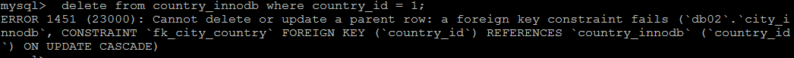
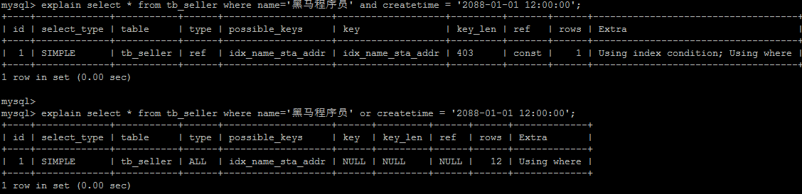
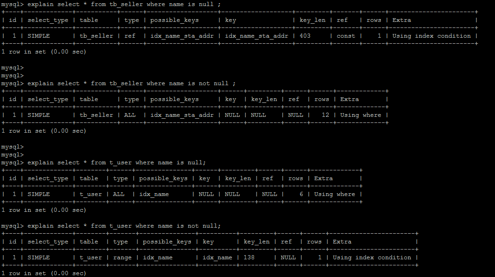
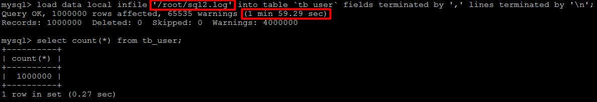
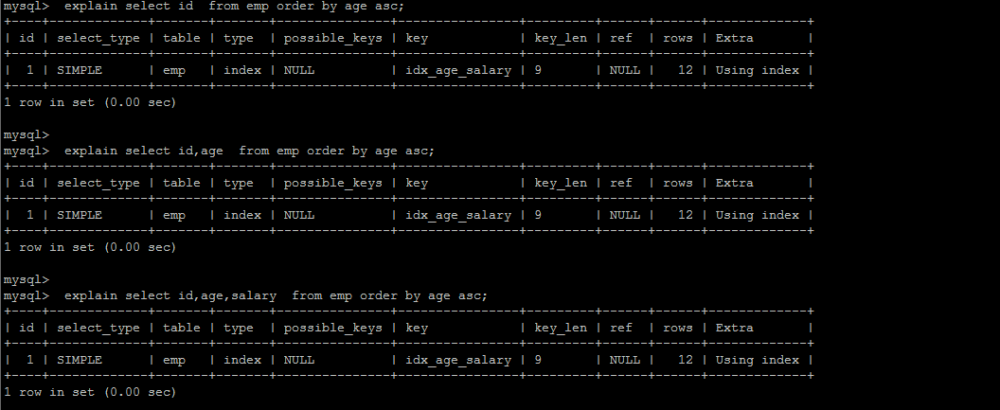

# Mysql高级-day02

### 1. Mysql的体系结构概览

 

整个MySQL Server由以下组成

- Connection Pool : 连接池组件
- Management Services & Utilities : 管理服务和工具组件
- SQL Interface : SQL接口组件
- Parser : 查询分析器组件
- Optimizer : 优化器组件
- Caches & Buffers : 缓冲池组件
- Pluggable Storage Engines : 存储引擎
- File System : 文件系统


1） 连接层

最上层是一些客户端和链接服务，包含本地sock 通信和大多数基于客户端/服务端工具实现的类似于 TCP/IP的通信。主要完成一些类似于连接处理、授权认证、及相关的安全方案。在该层上引入了线程池的概念，为通过认证安全接入的客户端提供线程。同样在该层上可以实现基于SSL的安全链接。服务器也会为安全接入的每个客户端验证它所具有的操作权限。

2） 服务层

第二层架构主要完成大多数的核心服务功能，如SQL接口，并完成缓存的查询，SQL的分析和优化，部分内置函数的执行。所有跨存储引擎的功能也在这一层实现，如 过程、函数等。在该层，服务器会解析查询并创建相应的内部解析树，并对其完成相应的优化如确定表的查询的顺序，是否利用索引等， 最后生成相应的执行操作。如果是select语句，服务器还会查询内部的缓存，如果缓存空间足够大，这样在解决大量读操作的环境中能够很好的提升系统的性能。

3） 引擎层

存储引擎层， 存储引擎真正的负责了MySQL中数据的存储和提取，服务器通过API和存储引擎进行通信。不同的存储引擎具有不同的功能，这样我们可以根据自己的需要，来选取合适的存储引擎。

4）存储层

数据存储层， 主要是将数据存储在文件系统之上，并完成与存储引擎的交互。


和其他数据库相比，MySQL有点与众不同，它的架构可以在多种不同场景中应用并发挥良好作用。主要体现在存储引擎上，插件式的存储引擎架构，将查询处理和其他的系统任务以及数据的存储提取分离。这种架构可以根据业务的需求和实际需要选择合适的存储引擎。


### 2. 存储引擎

#### 2.1 存储引擎概述

​	和大多数的数据库不同, MySQL中有一个存储引擎的概念, 针对不同的存储需求可以选择最优的存储引擎。

​	存储引擎就是存储数据，建立索引，更新查询数据等等技术的实现方式 。存储引擎是基于表的，而不是基于库的。所以存储引擎也可被称为表类型。

​	Oracle，SqlServer等数据库只有一种存储引擎。MySQL提供了插件式的存储引擎架构。所以MySQL存在多种存储引擎，可以根据需要使用相应引擎，或者编写存储引擎。

​	MySQL5.0支持的存储引擎包含 ： InnoDB 、MyISAM 、BDB、MEMORY、MERGE、EXAMPLE、NDB Cluster、ARCHIVE、CSV、BLACKHOLE、FEDERATED等，其中InnoDB和BDB提供事务安全表，其他存储引擎是非事务安全表。

可以通过指定 show engines ， 来查询当前数据库支持的存储引擎 ： 

 

创建新表时如果不指定存储引擎，那么系统就会使用默认的存储引擎，MySQL5.5之前的默认存储引擎是MyISAM，5.5之后就改为了InnoDB。

查看Mysql数据库默认的存储引擎 ， 指令 ：

```
 show variables like '%storage_engine%' ； 
```

  	 


#### 2.2 各种存储引擎特性

下面重点介绍几种常用的存储引擎， 并对比各个存储引擎之间的区别， 如下表所示 ： 

| 特点         | InnoDB               | MyISAM   | MEMORY | MERGE | NDB  |
| ------------ | -------------------- | -------- | ------ | ----- | ---- |
| 存储限制     | 64TB                 | 有       | 有     | 没有  | 有   |
| 事务安全     | ==支持==             |          |        |       |      |
| 锁机制       | ==行锁(适合高并发)== | ==表锁== | 表锁   | 表锁  | 行锁 |
| B树索引      | 支持                 | 支持     | 支持   | 支持  | 支持 |
| 哈希索引     |                      |          | 支持   |       |      |
| 全文索引     | 支持(5.6版本之后)    | 支持     |        |       |      |
| 集群索引     | 支持                 |          |        |       |      |
| 数据索引     | 支持                 |          | 支持   |       | 支持 |
| 索引缓存     | 支持                 | 支持     | 支持   | 支持  | 支持 |
| 数据可压缩   |                      | 支持     |        |       |      |
| 空间使用     | 高                   | 低       | N/A    | 低    | 低   |
| 内存使用     | 高                   | 低       | 中等   | 低    | 高   |
| 批量插入速度 | 低                   | 高       | 高     | 高    | 高   |
| 支持外键     | ==支持==             |          |        |       |      |

下面我们将重点介绍最长使用的两种存储引擎： InnoDB、MyISAM ， 另外两种 MEMORY、MERGE ， 了解即可。


##### 2.2.1 InnoDB

​	InnoDB存储引擎是Mysql的默认存储引擎。InnoDB存储引擎提供了具有提交、回滚、崩溃恢复能力的事务安全。但是对比MyISAM的存储引擎，InnoDB写的处理效率差一些，并且会占用更多的磁盘空间以保留数据和索引。

InnoDB存储引擎不同于其他存储引擎的特点 ： 

**事务控制**

```
create table goods_innodb(
	id int NOT NULL AUTO_INCREMENT,
	name varchar(20) NOT NULL,
    primary key(id)
)ENGINE=innodb DEFAULT CHARSET=utf8;
```

```
start transaction;

insert into goods_innodb(id,name)values(null,'Meta20');

commit;
```

 

测试，发现在InnoDB中是存在事务的 ；


**外键约束**

​	MySQL支持外键的存储引擎只有InnoDB ， 在创建外键的时候， 要求父表必须有对应的索引 ， 子表在创建外键的时候， 也会自动的创建对应的索引。

​	下面两张表中 ， country_innodb是父表 ， country_id为主键索引，city_innodb表是子表，country_id字段为外键，对应于country_innodb表的主键country_id 。

```sql
create table country_innodb(
	country_id int NOT NULL AUTO_INCREMENT,
    country_name varchar(100) NOT NULL,
    primary key(country_id)
)ENGINE=InnoDB DEFAULT CHARSET=utf8;


create table city_innodb(
	city_id int NOT NULL AUTO_INCREMENT,
    city_name varchar(50) NOT NULL,
    country_id int NOT NULL,
    primary key(city_id),
    key idx_fk_country_id(country_id),
    CONSTRAINT `fk_city_country` FOREIGN KEY(country_id) REFERENCES country_innodb(country_id) ON DELETE RESTRICT ON UPDATE CASCADE
)ENGINE=InnoDB DEFAULT CHARSET=utf8;


insert into country_innodb values(null,'China'),(null,'America'),(null,'Japan');
insert into city_innodb values(null,'Xian',1),(null,'NewYork',2),(null,'BeiJing',1);

```

在创建索引时， 可以指定在删除、更新父表时，对子表进行的相应操作，包括 RESTRICT、CASCADE、SET NULL 和 NO ACTION。

RESTRICT和NO ACTION相同， 是指限制在子表有关联记录的情况下， 父表不能更新；

CASCADE表示父表在更新或者删除时，更新或者删除子表对应的记录；

SET NULL 则表示父表在更新或者删除的时候，子表的对应字段被SET NULL 。

针对上面创建的两个表， 子表的外键指定是ON DELETE RESTRICT ON UPDATE CASCADE 方式的， 那么在主表删除记录的时候， 如果子表有对应记录， 则不允许删除， 主表在更新记录的时候， 如果子表有对应记录， 则子表对应更新 。

表中数据如下图所示 ： 

 


外键信息可以使用如下两种方式查看 ： 

```
show create table city_innodb ;
```

 	


删除country_id为1 的country数据： 

```
 delete from country_innodb where country_id = 1;
```

 

更新主表country表的字段 country_id : 

```
update country_innodb set country_id = 100 where country_id = 1;
```

  

更新后， 子表的数据信息为 ： 

  


**存储方式**	

InnoDB 存储表和索引有以下两种方式 ： 

①. 使用共享表空间存储， 这种方式创建的表的表结构保存在.frm文件中， 数据和索引保存在 innodb_data_home_dir 和 innodb_data_file_path定义的表空间中，可以是多个文件。

②. 使用多表空间存储， 这种方式创建的表的表结构仍然存在 .frm 文件中，但是每个表的数据和索引单独保存在 .ibd 中。

 


##### 2.2.2 MyISAM

​	MyISAM 不支持事务、也不支持外键，其优势是访问的速度快，对事务的完整性没有要求或者以SELECT、INSERT为主的应用基本上都可以使用这个引擎来创建表 。有以下两个比较重要的特点： 

**不支持事务**

```sql
create table goods_myisam(
	id int NOT NULL AUTO_INCREMENT,
	name varchar(20) NOT NULL,
    primary key(id)
)ENGINE=myisam DEFAULT CHARSET=utf8;
```

 

通过测试，我们发现，在MyISAM存储引擎中，是没有事务控制的 ；


**文件存储方式**

每个MyISAM在磁盘上存储成3个文件，其文件名都和表名相同，但拓展名分别是 ： 

.frm (存储表定义)；

.MYD(MYData , 存储数据)；

.MYI(MYIndex , 存储索引)；

 


##### 2.2.3 MEMORY

​	Memory存储引擎将表的数据存放在内存中。每个MEMORY表实际对应一个磁盘文件，格式是.frm ，该文件中只存储表的结构，而其数据文件，都是存储在内存中，这样有利于数据的快速处理，提高整个表的效率。MEMORY 类型的表访问非常地快，因为他的数据是存放在内存中的，并且默认使用HASH索引 ， 但是服务一旦关闭，表中的数据就会丢失。


##### 2.2.4 MERGE

​	MERGE存储引擎是一组MyISAM表的组合，这些MyISAM表必须结构完全相同，MERGE表本身并没有存储数据，对MERGE类型的表可以进行查询、更新、删除操作，这些操作实际上是对内部的MyISAM表进行的。

​	对于MERGE类型表的插入操作，是通过INSERT_METHOD子句定义插入的表，可以有3个不同的值，使用FIRST 或 LAST 值使得插入操作被相应地作用在第一或者最后一个表上，不定义这个子句或者定义为NO，表示不能对这个MERGE表执行插入操作。

​	可以对MERGE表进行DROP操作，但是这个操作只是删除MERGE表的定义，对内部的表是没有任何影响的。

 

下面是一个创建和使用MERGE表的示例 ： 

1）. 创建3个测试表 order_1990, order_1991, order_all , 其中order_all是前两个表的MERGE表 ： 

```sql
create table order_1990(
	order_id int ,
	order_money double(10,2),
	order_address varchar(50),
	primary key (order_id)
)engine = myisam default charset=utf8;


create table order_1991(
	order_id int ,
	order_money double(10,2),
	order_address varchar(50),
	primary key (order_id)
)engine = myisam default charset=utf8;


create table order_all(
	order_id int ,
	order_money double(10,2),
	order_address varchar(50),
	primary key (order_id)
)engine = merge union = (order_1990,order_1991) INSERT_METHOD=LAST default charset=utf8;


```

2）. 分别向两张表中插入记录 

```sql
insert into order_1990 values(1,100.0,'北京');
insert into order_1990 values(2,100.0,'上海');

insert into order_1991 values(10,200.0,'北京');
insert into order_1991 values(11,200.0,'上海');
```

3）. 查询3张表中的数据。

order_1990中的数据 ： 

 

order_1991中的数据 ： 

  

order_all中的数据 ：

 

​	 

4）. 往order_all中插入一条记录 ，由于在MERGE表定义时，INSERT_METHOD 选择的是LAST，那么插入的数据会想最后一张表中插入。

```sql
insert into order_all values(100,10000.0,'西安')；
```

 	 	


#### 2.3 存储引擎的选择

​	在选择存储引擎时，应该根据应用系统的特点选择合适的存储引擎。对于复杂的应用系统，还可以根据实际情况选择多种存储引擎进行组合。以下是几种常用的存储引擎的使用环境。

- InnoDB : 是Mysql的默认存储引擎，用于事务处理应用程序，支持外键。如果应用对事务的完整性有比较高的要求，在并发条件下要求数据的一致性，数据操作除了插入和查询意外，还包含很多的更新、删除操作，那么InnoDB存储引擎是比较合适的选择。InnoDB存储引擎除了有效的降低由于删除和更新导致的锁定， 还可以确保事务的完整提交和回滚，对于类似于计费系统或者财务系统等对数据准确性要求比较高的系统，InnoDB是最合适的选择。
- MyISAM ： 如果应用是以读操作和插入操作为主，只有很少的更新和删除操作，并且对事务的完整性、并发性要求不是很高，那么选择这个存储引擎是非常合适的。
- MEMORY：将所有数据保存在RAM中，在需要快速定位记录和其他类似数据环境下，可以提供几块的访问。MEMORY的缺陷就是对表的大小有限制，太大的表无法缓存在内存中，其次是要确保表的数据可以恢复，数据库异常终止后表中的数据是可以恢复的。MEMORY表通常用于更新不太频繁的小表，用以快速得到访问结果。
- MERGE：用于将一系列等同的MyISAM表以逻辑方式组合在一起，并作为一个对象引用他们。MERGE表的优点在于可以突破对单个MyISAM表的大小限制，并且通过将不同的表分布在多个磁盘上，可以有效的改善MERGE表的访问效率。这对于存储诸如数据仓储等VLDB环境十分合适。


### 3. 优化SQL步骤

在应用的的开发过程中，由于初期数据量小，开发人员写 SQL 语句时更重视功能上的实现，但是当应用系统正式上线后，随着生产数据量的急剧增长，很多 SQL 语句开始逐渐显露出性能问题，对生产的影响也越来越大，此时这些有问题的 SQL 语句就成为整个系统性能的瓶颈，因此我们必须要对它们进行优化，本章将详细介绍在 MySQL 中优化 SQL 语句的方法。

当面对一个有 SQL 性能问题的数据库时，我们应该从何处入手来进行系统的分析，使得能够尽快定位问题 SQL 并尽快解决问题。

#### 3.1 查看SQL执行频率

MySQL 客户端连接成功后，通过 show [session|global] status 命令可以提供服务器状态信息。show [session|global] status 可以根据需要加上参数“session”或者“global”来显示 session 级（当前连接）的计结果和 global 级（自数据库上次启动至今）的统计结果。如果不写，默认使用参数是“session”。

下面的命令显示了当前 session 中所有统计参数的值：

```
show status like 'Com_______';
```

  

```
show status like 'Innodb_rows_%';
```


Com_xxx 表示每个 xxx 语句执行的次数，我们通常比较关心的是以下几个统计参数。

| 参数                 | 含义                                                         |
| :------------------- | ------------------------------------------------------------ |
| Com_select           | 执行 select 操作的次数，一次查询只累加 1。                   |
| Com_insert           | 执行 INSERT 操作的次数，对于批量插入的 INSERT 操作，只累加一次。 |
| Com_update           | 执行 UPDATE 操作的次数。                                     |
| Com_delete           | 执行 DELETE 操作的次数。                                     |
| Innodb_rows_read     | select 查询返回的行数。                                      |
| Innodb_rows_inserted | 执行 INSERT 操作插入的行数。                                 |
| Innodb_rows_updated  | 执行 UPDATE 操作更新的行数。                                 |
| Innodb_rows_deleted  | 执行 DELETE 操作删除的行数。                                 |
| Connections          | 试图连接 MySQL 服务器的次数。                                |
| Uptime               | 服务器工作时间。                                             |
| Slow_queries         | 慢查询的次数。                                               |

Com_***      :  这些参数对于所有存储引擎的表操作都会进行累计。

Innodb_*** :  这几个参数只是针对InnoDB 存储引擎的，累加的算法也略有不同。


#### 3.2 定位低效率执行SQL

可以通过以下两种方式定位执行效率较低的 SQL 语句。

- 慢查询日志 : 通过慢查询日志定位那些执行效率较低的 SQL 语句，用--log-slow-queries[=file_name]选项启动时，mysqld 写一个包含所有执行时间超过 long_query_time 秒的 SQL 语句的日志文件。具体可以查看本书第 26 章中日志管理的相关部分。
- show processlist  : 慢查询日志在查询结束以后才纪录，所以在应用反映执行效率出现问题的时候查询慢查询日志并不能定位问题，可以使用show processlist命令查看当前MySQL在进行的线程，包括线程的状态、是否锁表等，可以实时地查看 SQL 的执行情况，同时对一些锁表操作进行优化。

 

```
1） id列，用户登录mysql时，系统分配的"connection_id"，可以使用函数connection_id()查看

2） user列，显示当前用户。如果不是root，这个命令就只显示用户权限范围的sql语句

3） host列，显示这个语句是从哪个ip的哪个端口上发的，可以用来跟踪出现问题语句的用户

4） db列，显示这个进程目前连接的是哪个数据库

5） command列，显示当前连接的执行的命令，一般取值为休眠（sleep），查询（query），连接（connect）等

6） time列，显示这个状态持续的时间，单位是秒

7） state列，显示使用当前连接的sql语句的状态，很重要的列。state描述的是语句执行中的某一个状态。一个sql语句，以查询为例，可能需要经过copying to tmp table、sorting result、sending data等状态才可以完成

8） info列，显示这个sql语句，是判断问题语句的一个重要依据
```


#### 3.3 explain分析执行计划

通过以上步骤查询到效率低的 SQL 语句后，可以通过 EXPLAIN或者 DESC命令获取 MySQL如何执行 SELECT 语句的信息，包括在 SELECT 语句执行过程中表如何连接和连接的顺序。

查询SQL语句的执行计划 ： 

```sql
explain  select * from tb_item where id = 1;
```


```sql
explain  select * from tb_item where title = '阿尔卡特 (OT-979) 冰川白 联通3G手机3';
```

  

| 字段          | 含义                                                         |
| ------------- | ------------------------------------------------------------ |
| id            | select查询的序列号，是一组数字，表示的是查询中执行select子句或者是操作表的顺序。 |
| select_type   | 表示 SELECT 的类型，常见的取值有 SIMPLE（简单表，即不使用表连接或者子查询）、PRIMARY（主查询，即外层的查询）、UNION（UNION 中的第二个或者后面的查询语句）、SUBQUERY（子查询中的第一个 SELECT）等 |
| table         | 输出结果集的表                                               |
| type          | 表示表的连接类型，性能由好到差的连接类型为( system  --->  const  ----->  eq_ref  ------>  ref  ------->  ref_or_null---->  index_merge  --->  index_subquery  ----->  range  ----->  index  ------> all ) |
| possible_keys | 表示查询时，可能使用的索引                                   |
| key           | 表示实际使用的索引                                           |
| key_len       | 索引字段的长度                                               |
| rows          | 扫描行的数量                                                 |
| extra         | 执行情况的说明和描述                                         |


##### 3.3.1 环境准备

 

```sql
CREATE TABLE `t_role` (
  `id` varchar(32) NOT NULL,
  `role_name` varchar(255) DEFAULT NULL,
  `role_code` varchar(255) DEFAULT NULL,
  `description` varchar(255) DEFAULT NULL,
  PRIMARY KEY (`id`),
  UNIQUE KEY `unique_role_name` (`role_name`)
) ENGINE=InnoDB DEFAULT CHARSET=utf8;


CREATE TABLE `t_user` (
  `id` varchar(32) NOT NULL,
  `username` varchar(45) NOT NULL,
  `password` varchar(96) NOT NULL,
  `name` varchar(45) NOT NULL,
  PRIMARY KEY (`id`),
  UNIQUE KEY `unique_user_username` (`username`)
) ENGINE=InnoDB DEFAULT CHARSET=utf8;


CREATE TABLE `user_role` (
  `id` int(11) NOT NULL auto_increment ,
  `user_id` varchar(32) DEFAULT NULL,
  `role_id` varchar(32) DEFAULT NULL,
  PRIMARY KEY (`id`),
  KEY `fk_ur_user_id` (`user_id`),
  KEY `fk_ur_role_id` (`role_id`),
  CONSTRAINT `fk_ur_role_id` FOREIGN KEY (`role_id`) REFERENCES `t_role` (`id`) ON DELETE NO ACTION ON UPDATE NO ACTION,
  CONSTRAINT `fk_ur_user_id` FOREIGN KEY (`user_id`) REFERENCES `t_user` (`id`) ON DELETE NO ACTION ON UPDATE NO ACTION
) ENGINE=InnoDB DEFAULT CHARSET=utf8;


insert into `t_user` (`id`, `username`, `password`, `name`) values('1','super','$2a$10$TJ4TmCdK.X4wv/tCqHW14.w70U3CC33CeVncD3SLmyMXMknstqKRe','超级管理员');
insert into `t_user` (`id`, `username`, `password`, `name`) values('2','admin','$2a$10$TJ4TmCdK.X4wv/tCqHW14.w70U3CC33CeVncD3SLmyMXMknstqKRe','系统管理员');
insert into `t_user` (`id`, `username`, `password`, `name`) values('3','itcast','$2a$10$8qmaHgUFUAmPR5pOuWhYWOr291WJYjHelUlYn07k5ELF8ZCrW0Cui','test02');
insert into `t_user` (`id`, `username`, `password`, `name`) values('4','stu1','$2a$10$pLtt2KDAFpwTWLjNsmTEi.oU1yOZyIn9XkziK/y/spH5rftCpUMZa','学生1');
insert into `t_user` (`id`, `username`, `password`, `name`) values('5','stu2','$2a$10$nxPKkYSez7uz2YQYUnwhR.z57km3yqKn3Hr/p1FR6ZKgc18u.Tvqm','学生2');
insert into `t_user` (`id`, `username`, `password`, `name`) values('6','t1','$2a$10$TJ4TmCdK.X4wv/tCqHW14.w70U3CC33CeVncD3SLmyMXMknstqKRe','老师1');


INSERT INTO `t_role` (`id`, `role_name`, `role_code`, `description`) VALUES('5','学生','student','学生');
INSERT INTO `t_role` (`id`, `role_name`, `role_code`, `description`) VALUES('7','老师','teacher','老师');
INSERT INTO `t_role` (`id`, `role_name`, `role_code`, `description`) VALUES('8','教学管理员','teachmanager','教学管理员');
INSERT INTO `t_role` (`id`, `role_name`, `role_code`, `description`) VALUES('9','管理员','admin','管理员');
INSERT INTO `t_role` (`id`, `role_name`, `role_code`, `description`) VALUES('10','超级管理员','super','超级管理员');


INSERT INTO user_role(id,user_id,role_id) VALUES(NULL, '1', '5'),(NULL, '1', '7'),(NULL, '2', '8'),(NULL, '3', '9'),(NULL, '4', '8'),(NULL, '5', '10') ;


```


##### 3.3.2 explain 之 id

id 字段是 select查询的序列号，是一组数字，表示的是查询中执行select子句或者是操作表的顺序。id 情况有三种 ： 

1） id 相同表示加载表的顺序是从上到下。

```
explain select * from t_role r, t_user u, user_role ur where r.id = ur.role_id and u.id = ur.user_id ;
```


2） id 不同id值越大，优先级越高，越先被执行。 

``` SQL
EXPLAIN SELECT * FROM t_role WHERE id = (SELECT role_id FROM user_role WHERE user_id = (SELECT id FROM t_user WHERE username = 'stu1'))
```

 


3） id 有相同，也有不同，同时存在。id相同的可以认为是一组，从上往下顺序执行；在所有的组中，id的值越大，优先级越高，越先执行。

```sql 
EXPLAIN SELECT * FROM t_role r , (SELECT * FROM user_role ur WHERE ur.`user_id` = '2') a WHERE r.id = a.role_id ; 
```

 


##### 3.3.3 explain 之 select_type

 表示 SELECT 的类型，常见的取值，如下表所示：

| select_type  | 含义                                                         |
| ------------ | ------------------------------------------------------------ |
| SIMPLE       | 简单的select查询，查询中不包含子查询或者UNION                |
| PRIMARY      | 查询中若包含任何复杂的子查询，最外层查询标记为该标识         |
| SUBQUERY     | 在SELECT 或 WHERE 列表中包含了子查询                         |
| DERIVED      | 在FROM 列表中包含的子查询，被标记为 DERIVED（衍生） MYSQL会递归执行这些子查询，把结果放在临时表中 |
| UNION        | 若第二个SELECT出现在UNION之后，则标记为UNION ； 若UNION包含在FROM子句的子查询中，外层SELECT将被标记为 ： DERIVED |
| UNION RESULT | 从UNION表获取结果的SELECT                                    |


##### 3.3.4 explain 之 table

展示这一行的数据是关于哪一张表的 


##### 3.3.5 explain 之 type

type 显示的是访问类型，是较为重要的一个指标，可取值为： 

| type   | 含义                                                         |
| ------ | ------------------------------------------------------------ |
| NULL   | MySQL不访问任何表，索引，直接返回结果                        |
| system | 表只有一行记录(等于系统表)，这是const类型的特例，一般不会出现 |
| const  | 表示通过索引一次就找到了，const 用于比较primary key 或者 unique 索引。因为只匹配一行数据，所以很快。如将主键置于where列表中，MySQL 就能将该查询转换为一个常亮。const于将 "主键" 或 "唯一" 索引的所有部分与常量值进行比较 |
| eq_ref | 类似ref，区别在于使用的是唯一索引，使用主键的关联查询，关联查询出的记录只有一条。常见于主键或唯一索引扫描 |
| ref    | 非唯一性索引扫描，返回匹配某个单独值的所有行。本质上也是一种索引访问，返回所有匹配某个单独值的所有行（多个） |
| range  | 只检索给定返回的行，使用一个索引来选择行。 where 之后出现 between ， < , > , in 等操作。 |
| index  | index 与 ALL的区别为  index 类型只是遍历了索引树， 通常比ALL 快， ALL 是遍历数据文件。 |
| all    | 将遍历全表以找到匹配的行                                     |

结果值从最好到最坏以此是：

```
NULL > system > const > eq_ref > ref > fulltext > ref_or_null > index_merge > unique_subquery > index_subquery > range > index > ALL


system > const > eq_ref > ref > range > index > ALL
```

==一般来说， 我们需要保证查询至少达到 range 级别， 最好达到ref 。==


##### 3.3.6 explain 之  key

```
possible_keys : 显示可能应用在这张表的索引， 一个或多个。 

key ： 实际使用的索引， 如果为NULL， 则没有使用索引。

key_len : 表示索引中使用的字节数， 该值为索引字段最大可能长度，并非实际使用长度，在不损失精确性的前提下， 长度越短越好 。
```


##### 3.3.7 explain 之 rows

扫描行的数量。


##### 3.3.8 explain 之 extra

其他的额外的执行计划信息，在该列展示 。

| extra            | 含义                                                         |
| ---------------- | ------------------------------------------------------------ |
| using  filesort  | 说明mysql会对数据使用一个外部的索引排序，而不是按照表内的索引顺序进行读取， 称为 “文件排序”, 效率低。 |
| using  temporary | 使用了临时表保存中间结果，MySQL在对查询结果排序时使用临时表。常见于 order by 和 group by； 效率低 |
| using  index     | 表示相应的select操作使用了覆盖索引， 避免访问表的数据行， 效率不错。 |


#### 3.4 show profile分析SQL

Mysql从5.0.37版本开始增加了对 show profiles 和 show profile 语句的支持。show profiles 能够在做SQL优化时帮助我们了解时间都耗费到哪里去了。

通过 have_profiling 参数，能够看到当前MySQL是否支持profile：

 

默认profiling是关闭的，可以通过set语句在Session级别开启profiling：

 

```sql
set profiling=1; //开启profiling 开关；
```

通过profile，我们能够更清楚地了解SQL执行的过程。

首先，我们可以执行一系列的操作，如下图所示：

```sql
show databases;

use db01;

show tables;

select * from tb_item where id < 5;

select count(*) from tb_item;
```

执行完上述命令之后，再执行show profiles 指令， 来查看SQL语句执行的耗时：

  

通过show  profile for  query  query_id 语句可以查看到该SQL执行过程中每个线程的状态和消耗的时间：

 

```tex
TIP ：
	Sending data 状态表示MySQL线程开始访问数据行并把结果返回给客户端，而不仅仅是返回个客户端。由于在Sending data状态下，MySQL线程往往需要做大量的磁盘读取操作，所以经常是整各查询中耗时最长的状态。
```


在获取到最消耗时间的线程状态后，MySQL支持进一步选择all、cpu、block io 、context switch、page faults等明细类型类查看MySQL在使用什么资源上耗费了过高的时间。例如，选择查看CPU的耗费时间  ：

 

| 字段       | 含义                           |
| ---------- | ------------------------------ |
| Status     | sql 语句执行的状态             |
| Duration   | sql 执行过程中每一个步骤的耗时 |
| CPU_user   | 当前用户占有的cpu              |
| CPU_system | 系统占有的cpu                  |


#### 3.5 trace分析优化器执行计划

MySQL5.6提供了对SQL的跟踪trace, 通过trace文件能够进一步了解为什么优化器选择A计划, 而不是选择B计划。

打开trace ， 设置格式为 JSON，并设置trace最大能够使用的内存大小，避免解析过程中因为默认内存过小而不能够完整展示。

```sql
SET optimizer_trace="enabled=on",end_markers_in_json=on;
set optimizer_trace_max_mem_size=1000000;
```

执行SQL语句 ：

```sql
select * from tb_item where id < 4;
```

最后， 检查information_schema.optimizer_trace就可以知道MySQL是如何执行SQL的 ：

```sql
select * from information_schema.optimizer_trace\G;
```

```json
*************************** 1. row ***************************
QUERY: select * from tb_item where id < 4
TRACE: {
  "steps": [
    {
      "join_preparation": {
        "select#": 1,
        "steps": [
          {
            "expanded_query": "/* select#1 */ select `tb_item`.`id` AS `id`,`tb_item`.`title` AS `title`,`tb_item`.`price` AS `price`,`tb_item`.`num` AS `num`,`tb_item`.`categoryid` AS `categoryid`,`tb_item`.`status` AS `status`,`tb_item`.`sellerid` AS `sellerid`,`tb_item`.`createtime` AS `createtime`,`tb_item`.`updatetime` AS `updatetime` from `tb_item` where (`tb_item`.`id` < 4)"
          }
        ] /* steps */
      } /* join_preparation */
    },
    {
      "join_optimization": {
        "select#": 1,
        "steps": [
          {
            "condition_processing": {
              "condition": "WHERE",
              "original_condition": "(`tb_item`.`id` < 4)",
              "steps": [
                {
                  "transformation": "equality_propagation",
                  "resulting_condition": "(`tb_item`.`id` < 4)"
                },
                {
                  "transformation": "constant_propagation",
                  "resulting_condition": "(`tb_item`.`id` < 4)"
                },
                {
                  "transformation": "trivial_condition_removal",
                  "resulting_condition": "(`tb_item`.`id` < 4)"
                }
              ] /* steps */
            } /* condition_processing */
          },
          {
            "table_dependencies": [
              {
                "table": "`tb_item`",
                "row_may_be_null": false,
                "map_bit": 0,
                "depends_on_map_bits": [
                ] /* depends_on_map_bits */
              }
            ] /* table_dependencies */
          },
          {
            "ref_optimizer_key_uses": [
            ] /* ref_optimizer_key_uses */
          },
          {
            "rows_estimation": [
              {
                "table": "`tb_item`",
                "range_analysis": {
                  "table_scan": {
                    "rows": 9816098,
                    "cost": 2.04e6
                  } /* table_scan */,
                  "potential_range_indices": [
                    {
                      "index": "PRIMARY",
                      "usable": true,
                      "key_parts": [
                        "id"
                      ] /* key_parts */
                    }
                  ] /* potential_range_indices */,
                  "setup_range_conditions": [
                  ] /* setup_range_conditions */,
                  "group_index_range": {
                    "chosen": false,
                    "cause": "not_group_by_or_distinct"
                  } /* group_index_range */,
                  "analyzing_range_alternatives": {
                    "range_scan_alternatives": [
                      {
                        "index": "PRIMARY",
                        "ranges": [
                          "id < 4"
                        ] /* ranges */,
                        "index_dives_for_eq_ranges": true,
                        "rowid_ordered": true,
                        "using_mrr": false,
                        "index_only": false,
                        "rows": 3,
                        "cost": 1.6154,
                        "chosen": true
                      }
                    ] /* range_scan_alternatives */,
                    "analyzing_roworder_intersect": {
                      "usable": false,
                      "cause": "too_few_roworder_scans"
                    } /* analyzing_roworder_intersect */
                  } /* analyzing_range_alternatives */,
                  "chosen_range_access_summary": {
                    "range_access_plan": {
                      "type": "range_scan",
                      "index": "PRIMARY",
                      "rows": 3,
                      "ranges": [
                        "id < 4"
                      ] /* ranges */
                    } /* range_access_plan */,
                    "rows_for_plan": 3,
                    "cost_for_plan": 1.6154,
                    "chosen": true
                  } /* chosen_range_access_summary */
                } /* range_analysis */
              }
            ] /* rows_estimation */
          },
          {
            "considered_execution_plans": [
              {
                "plan_prefix": [
                ] /* plan_prefix */,
                "table": "`tb_item`",
                "best_access_path": {
                  "considered_access_paths": [
                    {
                      "access_type": "range",
                      "rows": 3,
                      "cost": 2.2154,
                      "chosen": true
                    }
                  ] /* considered_access_paths */
                } /* best_access_path */,
                "cost_for_plan": 2.2154,
                "rows_for_plan": 3,
                "chosen": true
              }
            ] /* considered_execution_plans */
          },
          {
            "attaching_conditions_to_tables": {
              "original_condition": "(`tb_item`.`id` < 4)",
              "attached_conditions_computation": [
              ] /* attached_conditions_computation */,
              "attached_conditions_summary": [
                {
                  "table": "`tb_item`",
                  "attached": "(`tb_item`.`id` < 4)"
                }
              ] /* attached_conditions_summary */
            } /* attaching_conditions_to_tables */
          },
          {
            "refine_plan": [
              {
                "table": "`tb_item`",
                "access_type": "range"
              }
            ] /* refine_plan */
          }
        ] /* steps */
      } /* join_optimization */
    },
    {
      "join_execution": {
        "select#": 1,
        "steps": [
        ] /* steps */
      } /* join_execution */
    }
  ] /* steps */
}
```


### 4. 索引的使用

索引是数据库优化最常用也是最重要的手段之一, 通过索引通常可以帮助用户解决大多数的MySQL的性能优化问题。


#### 4.1 验证索引提升查询效率

在我们准备的表结构tb_item 中， 一共存储了 300 万记录；

A. 根据ID查询 

```
select * from tb_item where id = 1999\G;
```

 

查询速度很快， 接近0s ， 主要的原因是因为id为主键， 有索引；

 


2). 根据 title 进行精确查询

```SQL
select * from tb_item where title = 'iphoneX 移动3G 32G941'\G; 
```

 

查看SQL语句的执行计划 ： 

 


处理方案 ， 针对title字段， 创建索引 ： 

```SQL
create index idx_item_title on tb_item(title);
```

 


索引创建完成之后，再次进行查询 ： 

 

通过explain ， 查看执行计划，执行SQL时使用了刚才创建的索引 

 


#### 4.2 索引的使用

##### 4.2.1 准备环境

```sql
create table `tb_seller` (
	`sellerid` varchar (100),
	`name` varchar (100),
	`nickname` varchar (50),
	`password` varchar (60),
	`status` varchar (1),
	`address` varchar (100),
	`createtime` datetime,
    primary key(`sellerid`)
)engine=innodb default charset=utf8mb4; 

insert into `tb_seller` (`sellerid`, `name`, `nickname`, `password`, `status`, `address`, `createtime`) values('alibaba','阿里巴巴','阿里小店','e10adc3949ba59abbe56e057f20f883e','1','北京市','2088-01-01 12:00:00');
insert into `tb_seller` (`sellerid`, `name`, `nickname`, `password`, `status`, `address`, `createtime`) values('baidu','百度科技有限公司','百度小店','e10adc3949ba59abbe56e057f20f883e','1','北京市','2088-01-01 12:00:00');
insert into `tb_seller` (`sellerid`, `name`, `nickname`, `password`, `status`, `address`, `createtime`) values('huawei','华为科技有限公司','华为小店','e10adc3949ba59abbe56e057f20f883e','0','北京市','2088-01-01 12:00:00');
insert into `tb_seller` (`sellerid`, `name`, `nickname`, `password`, `status`, `address`, `createtime`) values('itcast','传智播客教育科技有限公司','传智播客','e10adc3949ba59abbe56e057f20f883e','1','北京市','2088-01-01 12:00:00');
insert into `tb_seller` (`sellerid`, `name`, `nickname`, `password`, `status`, `address`, `createtime`) values('itheima','黑马程序员','黑马程序员','e10adc3949ba59abbe56e057f20f883e','0','北京市','2088-01-01 12:00:00');
insert into `tb_seller` (`sellerid`, `name`, `nickname`, `password`, `status`, `address`, `createtime`) values('luoji','罗技科技有限公司','罗技小店','e10adc3949ba59abbe56e057f20f883e','1','北京市','2088-01-01 12:00:00');
insert into `tb_seller` (`sellerid`, `name`, `nickname`, `password`, `status`, `address`, `createtime`) values('oppo','OPPO科技有限公司','OPPO官方旗舰店','e10adc3949ba59abbe56e057f20f883e','0','北京市','2088-01-01 12:00:00');
insert into `tb_seller` (`sellerid`, `name`, `nickname`, `password`, `status`, `address`, `createtime`) values('ourpalm','掌趣科技股份有限公司','掌趣小店','e10adc3949ba59abbe56e057f20f883e','1','北京市','2088-01-01 12:00:00');
insert into `tb_seller` (`sellerid`, `name`, `nickname`, `password`, `status`, `address`, `createtime`) values('qiandu','千度科技','千度小店','e10adc3949ba59abbe56e057f20f883e','2','北京市','2088-01-01 12:00:00');
insert into `tb_seller` (`sellerid`, `name`, `nickname`, `password`, `status`, `address`, `createtime`) values('sina','新浪科技有限公司','新浪官方旗舰店','e10adc3949ba59abbe56e057f20f883e','1','北京市','2088-01-01 12:00:00');
insert into `tb_seller` (`sellerid`, `name`, `nickname`, `password`, `status`, `address`, `createtime`) values('xiaomi','小米科技','小米官方旗舰店','e10adc3949ba59abbe56e057f20f883e','1','西安市','2088-01-01 12:00:00');
insert into `tb_seller` (`sellerid`, `name`, `nickname`, `password`, `status`, `address`, `createtime`) values('yijia','宜家家居','宜家家居旗舰店','e10adc3949ba59abbe56e057f20f883e','1','北京市','2088-01-01 12:00:00');


create index idx_seller_name_sta_addr on tb_seller(name,status,address);
```


##### 4.2.2 避免索引失效

1).  全值匹配 ，对索引中所有列都指定具体值。

改情况下，索引生效，执行效率高。

```sql
explain select * from tb_seller where name='小米科技' and status='1' and address='北京市'\G;
```

 


2). 最左前缀法则

如果索引了多列，要遵守最左前缀法则。指的是查询从索引的最左前列开始，并且不跳过索引中的列。


匹配最左前缀法则，走索引：

  


违法最左前缀法则 ， 索引失效：

 


如果符合最左法则，但是出现跳跃某一列，只有最左列索引生效：

 


3). 范围查询右边的列，不能使用索引 。

 

根据前面的两个字段name ， status 查询是走索引的， 但是最后一个条件address 没有用到索引。


4). 不要在索引列上进行运算操作， 索引将失效。

 


5). 字符串不加单引号，造成索引失效。

 

由于，在查询是，没有对字符串加单引号，MySQL的查询优化器，会自动的进行类型转换，造成索引失效。


6). 尽量使用覆盖索引，避免select *

尽量使用覆盖索引（只访问索引的查询（索引列完全包含查询列）），减少select * 。

 

如果查询列，超出索引列，也会降低性能。

 

```
TIP : 
	
    using index ：使用覆盖索引的时候就会出现

    using where：在查找使用索引的情况下，需要回表去查询所需的数据

    using index condition：查找使用了索引，但是需要回表查询数据

    using index ; using where：查找使用了索引，但是需要的数据都在索引列中能找到，所以不需要回表查询数据
```


7). 用or分割开的条件， 如果or前的条件中的列有索引，而后面的列中没有索引，那么涉及的索引都不会被用到。

示例，name字段是索引列 ， 而createtime不是索引列，中间是or进行连接是不走索引的 ： 

```sql
explain select * from tb_seller where name='黑马程序员' or createtime = '2088-01-01 12:00:00'\G;	
```

 


8).  以%开头的Like模糊查询，索引失效。

如果仅仅是尾部模糊匹配，索引不会失效。如果是头部模糊匹配，索引失效。

 

解决方案 ： 

通过覆盖索引来解决 

 


9). 如果MySQL评估使用索引比全表更慢，则不使用索引。

 


10). is  NULL ， is NOT NULL  <font color='red'>有时</font>索引失效。

  


11). in 走索引， not in 索引失效。

  


12). 单列索引和复合索引。

尽量使用复合索引，而少使用单列索引 。

创建复合索引 

```
create index idx_name_sta_address on tb_seller(name, status, address);

就相当于创建了三个索引 ： 
	name
	name + status
	name + status + address

```


创建单列索引 

```
create index idx_seller_name on tb_seller(name);
create index idx_seller_status on tb_seller(status);
create index idx_seller_address on tb_seller(address);
```

数据库会选择一个最优的索引（辨识度最高索引）来使用，并不会使用全部索引 。


#### 4.3 查看索引使用情况

```sql
show status like 'Handler_read%';	

show global status like 'Handler_read%';	
```

 

```
Handler_read_first：索引中第一条被读的次数。如果较高，表示服务器正执行大量全索引扫描（这个值越低越好）。

Handler_read_key：如果索引正在工作，这个值代表一个行被索引值读的次数，如果值越低，表示索引得到的性能改善不高，因为索引不经常使用（这个值越高越好）。

Handler_read_next ：按照键顺序读下一行的请求数。如果你用范围约束或如果执行索引扫描来查询索引列，该值增加。

Handler_read_prev：按照键顺序读前一行的请求数。该读方法主要用于优化ORDER BY ... DESC。

Handler_read_rnd ：根据固定位置读一行的请求数。如果你正执行大量查询并需要对结果进行排序该值较高。你可能使用了大量需要MySQL扫描整个表的查询或你的连接没有正确使用键。这个值较高，意味着运行效率低，应该建立索引来补救。

Handler_read_rnd_next：在数据文件中读下一行的请求数。如果你正进行大量的表扫描，该值较高。通常说明你的表索引不正确或写入的查询没有利用索引。
```


### 5. SQL优化

#### 5.1 大批量插入数据

环境准备 ： 

```sql
CREATE TABLE `tb_user_2` (
  `id` int(11) NOT NULL AUTO_INCREMENT,
  `username` varchar(45) NOT NULL,
  `password` varchar(96) NOT NULL,
  `name` varchar(45) NOT NULL,
  `birthday` datetime DEFAULT NULL,
  `sex` char(1) DEFAULT NULL,
  `email` varchar(45) DEFAULT NULL,
  `phone` varchar(45) DEFAULT NULL,
  `qq` varchar(32) DEFAULT NULL,
  `status` varchar(32) NOT NULL COMMENT '用户状态',
  `create_time` datetime NOT NULL,
  `update_time` datetime DEFAULT NULL,
  PRIMARY KEY (`id`),
  UNIQUE KEY `unique_user_username` (`username`)
) ENGINE=InnoDB DEFAULT CHARSET=utf8 ;
```


当使用load 命令导入数据的时候，适当的设置可以提高导入的效率。

 

对于 InnoDB 类型的表，有以下几种方式可以提高导入的效率：

1） 主键顺序插入

因为InnoDB类型的表是按照主键的顺序保存的，所以将导入的数据按照主键的顺序排列，可以有效的提高导入数据的效率。如果InnoDB表没有主键，那么系统会自动默认创建一个内部列作为主键，所以如果可以给表创建一个主键，将可以利用这点，来提高导入数据的效率。

```
脚本文件介绍 :
	sql1.log  ----> 主键有序
	sql2.log  ----> 主键无序
```

插入ID顺序排列数据：


插入ID无序排列数据：

 


2） 关闭唯一性校验

在导入数据前执行 SET UNIQUE_CHECKS=0，关闭唯一性校验，在导入结束后执行SET UNIQUE_CHECKS=1，恢复唯一性校验，可以提高导入的效率。

 


3） 手动提交事务

如果应用使用自动提交的方式，建议在导入前执行 SET AUTOCOMMIT=0，关闭自动提交，导入结束后再执行 SET AUTOCOMMIT=1，打开自动提交，也可以提高导入的效率。


#### 5.2 优化insert语句

当进行数据的insert操作的时候，可以考虑采用以下几种优化方案。

- 如果需要同时对一张表插入很多行数据时，应该尽量使用多个值表的insert语句，这种方式将大大的缩减客户端与数据库之间的连接、关闭等消耗。使得效率比分开执行的单个insert语句快。

  示例， 原始方式为：

  ```sql
  insert into tb_test values(1,'Tom');
  insert into tb_test values(2,'Cat');
  insert into tb_test values(3,'Jerry');
  ```

  优化后的方案为 ： 

  ```sql
  insert into tb_test values(1,'Tom'),(2,'Cat')，(3,'Jerry');
  ```

- 在事务中进行数据插入。

  ```sql
  start transaction;
  insert into tb_test values(1,'Tom');
  insert into tb_test values(2,'Cat');
  insert into tb_test values(3,'Jerry');
  commit;
  ```

- 数据有序插入

  ```sql
  insert into tb_test values(4,'Tim');
  insert into tb_test values(1,'Tom');
  insert into tb_test values(3,'Jerry');
  insert into tb_test values(5,'Rose');
  insert into tb_test values(2,'Cat');
  ```

  优化后

  ```sql
  insert into tb_test values(1,'Tom');
  insert into tb_test values(2,'Cat');
  insert into tb_test values(3,'Jerry');
  insert into tb_test values(4,'Tim');
  insert into tb_test values(5,'Rose');
  ```


#### 5.3 优化order by语句

##### 5.3.1 环境准备

```SQL
CREATE TABLE `emp` (
  `id` int(11) NOT NULL AUTO_INCREMENT,
  `name` varchar(100) NOT NULL,
  `age` int(3) NOT NULL,
  `salary` int(11) DEFAULT NULL,
  PRIMARY KEY (`id`)
) ENGINE=InnoDB  DEFAULT CHARSET=utf8mb4;

insert into `emp` (`id`, `name`, `age`, `salary`) values('1','Tom','25','2300');
insert into `emp` (`id`, `name`, `age`, `salary`) values('2','Jerry','30','3500');
insert into `emp` (`id`, `name`, `age`, `salary`) values('3','Luci','25','2800');
insert into `emp` (`id`, `name`, `age`, `salary`) values('4','Jay','36','3500');
insert into `emp` (`id`, `name`, `age`, `salary`) values('5','Tom2','21','2200');
insert into `emp` (`id`, `name`, `age`, `salary`) values('6','Jerry2','31','3300');
insert into `emp` (`id`, `name`, `age`, `salary`) values('7','Luci2','26','2700');
insert into `emp` (`id`, `name`, `age`, `salary`) values('8','Jay2','33','3500');
insert into `emp` (`id`, `name`, `age`, `salary`) values('9','Tom3','23','2400');
insert into `emp` (`id`, `name`, `age`, `salary`) values('10','Jerry3','32','3100');
insert into `emp` (`id`, `name`, `age`, `salary`) values('11','Luci3','26','2900');
insert into `emp` (`id`, `name`, `age`, `salary`) values('12','Jay3','37','4500');

create index idx_emp_age_salary on emp(age,salary);
```

##### 5.3.2 两种排序方式

1). 第一种是通过对返回数据进行排序，也就是通常说的 filesort 排序，所有不是通过索引直接返回排序结果的排序都叫 FileSort 排序。

 

2). 第二种通过有序索引顺序扫描直接返回有序数据，这种情况即为 using index，不需要额外排序，操作效率高。

 

多字段排序

 


了解了MySQL的排序方式，优化目标就清晰了：尽量减少额外的排序，通过索引直接返回有序数据。where 条件和Order by 使用相同的索引，并且Order By 的顺序和索引顺序相同， 并且Order  by 的字段都是升序，或者都是降序。否则肯定需要额外的操作，这样就会出现FileSort。


##### 5.3.3 Filesort 的优化

通过创建合适的索引，能够减少 Filesort 的出现，但是在某些情况下，条件限制不能让Filesort消失，那就需要加快 Filesort的排序操作。对于Filesort ， MySQL 有两种排序算法：

1） 两次扫描算法 ：MySQL4.1 之前，使用该方式排序。首先根据条件取出排序字段和行指针信息，然后在排序区 sort buffer 中排序，如果sort buffer不够，则在临时表 temporary table 中存储排序结果。完成排序之后，再根据行指针回表读取记录，该操作可能会导致大量随机I/O操作。

2）一次扫描算法：一次性取出满足条件的所有字段，然后在排序区 sort  buffer 中排序后直接输出结果集。排序时内存开销较大，但是排序效率比两次扫描算法要高。


MySQL 通过比较系统变量 max_length_for_sort_data 的大小和Query语句取出的字段总大小， 来判定是否那种排序算法，如果max_length_for_sort_data 更大，那么使用第二种优化之后的算法；否则使用第一种。

可以适当提高 sort_buffer_size  和 max_length_for_sort_data  系统变量，来增大排序区的大小，提高排序的效率。

 


#### 5.4 优化group by 语句

由于GROUP BY 实际上也同样会进行排序操作，而且与ORDER BY 相比，GROUP BY 主要只是多了排序之后的分组操作。当然，如果在分组的时候还使用了其他的一些聚合函数，那么还需要一些聚合函数的计算。所以，在GROUP BY 的实现过程中，与 ORDER BY 一样也可以利用到索引。

如果查询包含 group by 但是用户想要避免排序结果的消耗， 则可以执行order by null 禁止排序。如下 ：

```SQL
drop index idx_emp_age_salary on emp;

explain select age,count(*) from emp group by age;
```

  

优化后

```sql
explain select age,count(*) from emp group by age order by null;
```

  

从上面的例子可以看出，第一个SQL语句需要进行"filesort"，而第二个SQL由于order  by  null 不需要进行 "filesort"， 而上文提过Filesort往往非常耗费时间。


创建索引 ：

```SQL
create index idx_emp_age_salary on emp(age,salary)；
```

 


#### 5.5 优化嵌套查询

Mysql4.1版本之后，开始支持SQL的子查询。这个技术可以使用SELECT语句来创建一个单列的查询结果，然后把这个结果作为过滤条件用在另一个查询中。使用子查询可以一次性的完成很多逻辑上需要多个步骤才能完成的SQL操作，同时也可以避免事务或者表锁死，并且写起来也很容易。但是，有些情况下，子查询是可以被更高效的连接（JOIN）替代。

示例 ，查找有角色的所有的用户信息 : 

```SQL
 explain select * from t_user where id in (select user_id from user_role );
```

执行计划为 : 

   


优化后 :

```SQL
explain select * from t_user u , user_role ur where u.id = ur.user_id;
```

   


连接(Join)查询之所以更有效率一些 ，是因为MySQL不需要在内存中创建临时表来完成这个逻辑上需要两个步骤的查询工作。


#### 5.6 优化OR条件

对于包含OR的查询子句，如果要利用索引，则OR之间的每个条件列都必须用到索引 ， 而且不能使用到复合索引； 如果没有索引，则应该考虑增加索引。

获取 emp 表中的所有的索引 ： 

  

示例 ： 

```SQL
explain select * from emp where id = 1 or age = 30;
```


  

建议使用 union 替换 or ： 

 

我们来比较下重要指标，发现主要差别是 type 和 ref 这两项

type 显示的是访问类型，是较为重要的一个指标，结果值从好到坏依次是：

```
system > const > eq_ref > ref > fulltext > ref_or_null  > index_merge > unique_subquery > index_subquery > range > index > ALL
```

UNION 语句的 type 值为 ref，OR 语句的 type 值为 range，可以看到这是一个很明显的差距

UNION 语句的 ref 值为 const，OR 语句的 type 值为 null，const 表示是常量值引用，非常快

这两项的差距就说明了 UNION 要优于 OR 。


#### 5.7 优化分页查询

一般分页查询时，通过创建覆盖索引能够比较好地提高性能。一个常见又非常头疼的问题就是 limit 2000000,10  ，此时需要MySQL排序前2000010 记录，仅仅返回2000000 - 2000010 的记录，其他记录丢弃，查询排序的代价非常大 。

 

##### 5.7.1 优化思路一

在索引上完成排序分页操作，最后根据主键关联回原表查询所需要的其他列内容。

 


##### 5.7.2 优化思路二

该方案适用于主键自增的表，可以把Limit 查询转换成某个位置的查询 。

 


#### 5.8 使用SQL提示

SQL提示，是优化数据库的一个重要手段，简单来说，就是在SQL语句中加入一些人为的提示来达到优化操作的目的。

##### 5.8.1 USE INDEX

在查询语句中表名的后面，添加 use index 来提供希望MySQL去参考的索引列表，就可以让MySQL不再考虑其他可用的索引。

```
create index idx_seller_name on tb_seller(name);
```

 

##### 5.8.2 IGNORE INDEX

如果用户只是单纯的想让MySQL忽略一个或者多个索引，则可以使用 ignore index 作为 hint 。

```
 explain select * from tb_seller ignore index(idx_seller_name) where name = '小米科技';
```

 

##### 5.8.3 FORCE INDEX

为强制MySQL使用一个特定的索引，可在查询中使用 force index 作为hint 。 

``` SQL
create index idx_seller_address on tb_seller(address);
```

 


