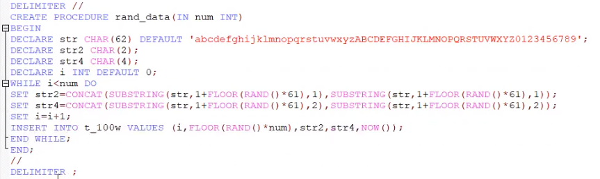
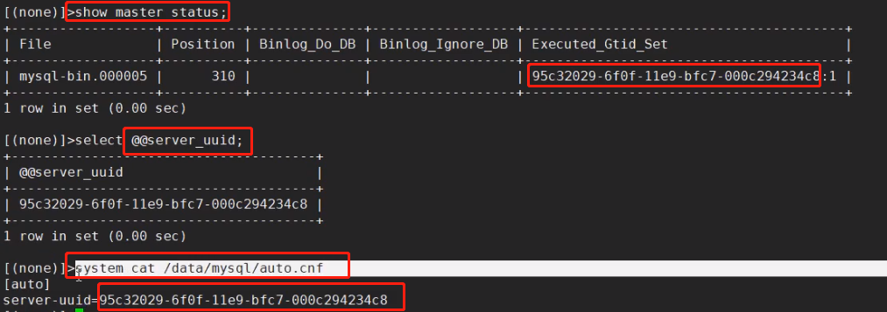
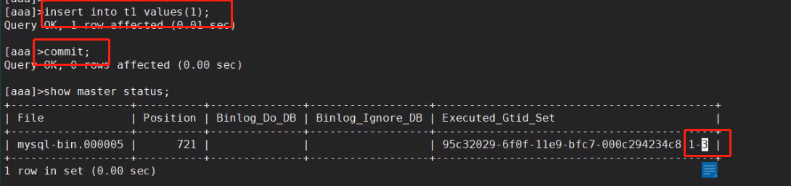
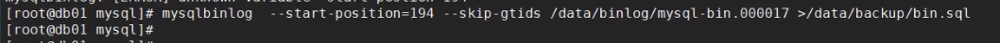
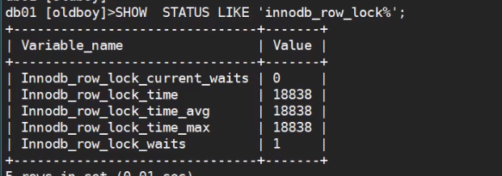
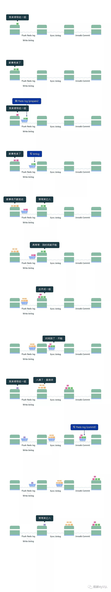
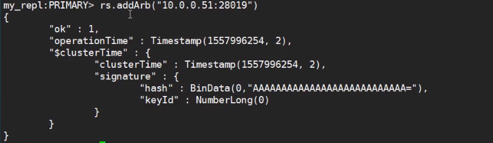

## 老男孩DBA学习笔记

[TOC]

**参考博客：https://www.jianshu.com/p/7e3e2f814d22**

### 一、MySQL 安装

#### 企业使用的MySQL的主流版本

```
MySQL5.6
MySQL5.7
MySQL8.0 命名规则发生改变
```

#### 企业版本选择（MySQL的分支版本）

```
Oracle：
	MySQL官方版本
RedHat：
	MariaDB
Percona:
	PerconaDB
```

#### 版本选择建议

```
1. 一般选择官方版本： 5.6/5.7
2. GA 稳定发布版本
3. 6-12月的产品版本

课程版本：5.7.20 二进制安装(2017.09.13 GA)

5.6.38 也是 2017.09.13 GA 与 5.7.20 同一天GA
```

#### 下载地址

**官网地址：https://download.mysql.com/archives/community/**

**之前的下载界面：**


**当前的下载界面：**


#### MySQL 源码安装


```
一般不在建议使用源码安装，除非需要定制某些功能、编译参数，或自定义开发
```

#### MySQL 二进制安装

0. 卸载mariaDB

1. 创建目录/app/

2. 上传MySQL二进制压缩包，解压

   

3. 改名或软连接

   

4. 添加环境变量

   

   

5. 创建MySQL用户和用户组

   

6. 初始化数据库

   

   

7. 创建MySQL的配置文件 my.cnf

   

8. 配置启动脚本

   

   ```
   可以使用 mysql.server start 进行启动
   ```

   

   ```
   centOS6 管理MySQL的方法，centos7 也适用
   ```

   

   ```
   systemd 启动方式的配置
   ```

9. 给超级管理员用户设置密码

   

   

### 二、MySQL CS结构及实例

#### MySQL连接方式


```
本地适用 mysql -uroot -p 的方式连接的也我sockt 连接方式
```

#### 实例的介绍

、

#### MySQL的程序架构


##### SQL的执行过程


```
show processlist; 查看所在的连接线程
```


```
解析器：对语句在执行前进行预处理，生产解析树（生成执行计划，方案（可能多个方案））
优化器：根据算法判断，早期的算法以时间为模型，执行的快，则优先我选用，现在是执行代价模型，以执行的代价为标准。
```


```
SQL层主要和优化的方面比较多，而存储引擎层主要和安全方面影响较多
```

#### MySQL逻辑结构


```
user.MYI 是 MyISAM 存储引擎的索引数据
```


```
页：是最小的IO单元，为16k
区：一个或多个连续分配的 页
段：一个表就是一个段，包含一个或多个区
```

### 三、基础管理


#### 权限管理


```
to  去给拿给用户授权
```


```
from  从哪个用户上收回权限
```

#### MySQL管理员密码丢失


```
--skip-grant-tables: 启动的时候不加载用户的授权表
--skip-networking: 启动的时候只允许本地socket 连接，不允许TCP/IP 远程连接
```


```
存在 socket 文件，但是没有监听端口
```


```
此时登录后直接修改root密码是不行的，因为 启动的时候 没有加载授权表，内存中没有授权信息，不能执行alter操作
使用 flush privileges; 把授权表的信息 刷入到内存中去
```

#### MySQL的启动方式


```
mysqld_safe: 会监控MySQL的状态，down 机后会自动的重启
mysqld_safe 和mysqld 可以在启动的时候，添加一些参数，方便维护的时候使用
```

#### 初始化的配置

```
配置文件作用：通过参数干预控制MySQL的启动，影响客户端的连接
```

****

```
MySQL会依次读取上面路径的my.cnf 的配置，都会进行加载，如果配置重复，则最后一个设定的进行覆盖生效。
如果使用--default-file=xxx 上面的路径的配置文件都不会进行读取了
```


#### MySQL多实例搭建


### 四、SQL基础应用


```
5.7 之后使用SQL92 严格模式，使用sql_mode 参数进行控制
```

#### 字段数据类型


```cpp
tinyint  ： -128~127
int       ：-2^31~2^31-1
说明：手机号是无法存储到int的。一般是使用char类型来存储收集号
```


```css
DATETIME 
范围为从 1000-01-01 00:00:00.000000 至 9999-12-31 23:59:59.999999。
TIMESTAMP 
1970-01-01 00:00:00.000000 至 2038-01-19 03:14:07.999999。
timestamp会受到时区的影响
```


```
二进制一般不应该存储在MySQL中，MySQL并不擅长，可以存储一个链接地址，二进制文件保存在存储上。
```

#### 列属性

```cpp
约束(一般建表时添加):
**primary key** ：主键约束
设置为主键的列，此列的值必须非空且唯一，主键在一个表中只能有一个，但是可以有多个列一起构成。
**not null**      ：非空约束
列值不能为空，也是表设计的规范，尽可能将所有的列设置为非空。可以设置默认值为0
**unique key** ：唯一键，列值不能重复

**unsigned** ：无符号
针对数字列，非负数。

其他属性:
**key** :索引
可以在某列上建立索引，来优化查询,一般是根据需要后添加
**default**           :默认值
列中，没有录入值时，会自动使用default的值填充
**auto_increment**:自增长
针对数字列，顺序的自动填充数据（默认是从1开始，将来可以设定起始点和偏移量）
**comment ** : 注释
```

#### 表的属性

```undefined
存储引擎:
InnoDB（默认的）
字符集和排序规则:
utf8       
utf8mb4
```

#### 字符集

```
utf8		## 3个字符
utf8mb4		## 4个字符，支持 emoji
```

#### 校对规则（排序规则）

```
大小写是否敏感， 英文拼音的大小写问题
u 与 ü 的存储需要 进行 校对规则开启
```

#### DDL应用

```
数据定义语言
```

##### 库定义

```dart
create database school;
create schema sch;		## 也可以进行库的创建
show charset;			## 查看数据库支持的字符集
show collation;
CREATE DATABASE test CHARSET utf8;
create database xyz charset utf8mb4 collate utf8mb4_bin;

建库规范：
1.库名不能有大写字母（因为Windows 不区分大小写，导致在mac其他环境存在问题）
2.建库要加字符集         
3.库名不能有数字开头
4.库名要和业务相关
```


```
使用 show  collation 进行查看所有字符集机器校对规则
以 ci 结尾的是大小写不敏感的， bin 结尾的为大小写敏感的，严格区分的
```

```dart
mysql> create database db charset utf8mb4;
mysql> show create database xuexiao;
```

```rust
mysql> drop database oldboy;
```

```undefined
SHOW CREATE DATABASE school;	## 查看创建库的语句，及库使用的字符集
ALTER DATABASE school  CHARSET utf8;
注意：修改字符集，修改后的字符集一定是原字符集的严格超集
```

##### 表定义

```undefined
create table stu(
列1  属性（数据类型、约束、其他属性） ，
列2  属性，
列3  属性
)
```


```
USE school;
CREATE TABLE stu(
id      INT NOT NULL PRIMARY KEY AUTO_INCREMENT COMMENT '学号',
sname   VARCHAR(255) NOT NULL COMMENT '姓名',
sage    TINYINT UNSIGNED NOT NULL DEFAULT 0 COMMENT '年龄',
sgender ENUM('m','f','n') NOT NULL DEFAULT 'n' COMMENT '性别' ,
sfz     CHAR(18) NOT NULL UNIQUE  COMMENT '身份证',
intime  TIMESTAMP NOT NULL DEFAULT NOW() COMMENT '入学时间'
) ENGINE=INNODB CHARSET=utf8 COMMENT '学生表';
```

```undefined
1. 表名小写
2. 不能是数字开头
3. 注意字符集和存储引擎
4. 表名和业务有关
5. 选择合适的数据类型
6. 每个列都要有注释
7. 每个列设置为非空，无法保证非空，用0来填充。
```

```rust
drop table t1;		## 删除表
```

```php
## 在stu表中添加qq列， 添加到最后面
DESC stu;
ALTER TABLE stu ADD qq VARCHAR(20) NOT NULL UNIQUE COMMENT 'qq号';
```

```php
## 在sname后加 wechat列
ALTER TABLE stu ADD wechat VARCHAR(64) NOT NULL UNIQUE  COMMENT '微信号' AFTER sname ;		## AFTER 写在最后面
```

```dart
## 在id列前面添加一个新列 num ，在所有的字段前面  使用 FIRST
ALTER TABLE stu ADD num INT NOT NULL COMMENT '数字' FIRST;
DESC stu;
```

```dart
## 把刚才的列字段都删除掉
ALTER TABLE stu DROP num;
ALTER TABLE stu DROP qq;
ALTER TABLE stu DROP wechat;
```

```cpp
## 修改sname数据类型的属性，把数据类型从 varchar(255) 改动 varchar(128)
ALTER TABLE stu MODIFY sname VARCHAR(128)  NOT NULL ;
```

```php
## 将字段sgender 重命名改为 sg ，数据类型改为 CHAR 类型
ALTER TABLE stu CHANGE sgender sg CHAR(1) NOT NULL DEFAULT 'n' ;
DESC stu;
```

**在线DDL**

```
ALTER的更改需要在业务不繁忙的时候进行添加，因为 ALTER会对 整表进行锁定，影响业务

可以使用 pt-osc 进行在线的DDL，执行添加语句，他的原理是创建一个新的表，更改好结构后，把数据mv过去。

8.0 之后内置了在线的DDL特性，不在锁表
```

```dart
## DQL 语句
use school
show tables；	## 显示这个库下面的所有的表
desc stu;		## 显示表的 各个字段等属性信息，定义的属性
show create table stu；		## 显示创建表的语句
CREATE TABLE ceshi LIKE stu;	## 以stu 表为模板创建新的表
```

#### DCL应用

```
grant	## 授权命令
revoke	## 取消授权命令
```

#### DML应用

```
## 作用
对表中的数据进行 增删改
```

##### insert

```csharp
--- 最标准的insert语句
INSERT INTO stu(id,sname,sage,sg,sfz,intime) 
VALUES
(1,'zs',18,'m','123456',NOW());
SELECT * FROM stu;

--- 省事的写法, 没有写明插入的表的字段，代表全部字段都插入
INSERT INTO stu 
VALUES
(2,'ls',18,'m','1234567',NOW());

--- 针对性的录入数据
INSERT INTO stu(sname,sfz)
VALUES ('w5','34445788');

--- 同时录入多行数据
INSERT INTO stu(sname,sfz)
VALUES 
('w55','3444578d8'),
('m6','1212313'),
('aa','123213123123');
SELECT * FROM stu;
```

##### update

```bash
DESC stu;
SELECT * FROM stu;
UPDATE stu SET sname='zhao4' WHERE id=2;

注意：update语句必须要加where（指定唯一条件）, 否则所有的sname 都被更新为 zhao4
```

##### delete

```objectivec
DELETE FROM stu  WHERE id=3;		## 删除指定id 的数据

## 删除了id为3 的数据，查询的时候是不可见的，再进行插入的时候，id 不会使用 3的，因为他物理上是存在的
```


```
上图中插入新的数据后，id 为3 的就成为了缝隙，物理存储没有释放
```

```cpp
## 整表删除的两种方式
DELETE FROM stu
truncate table stu;

区别:
delete: DML操作, 是逻辑性质删除,逐行进行删除,速度慢，数据不可见了，占用的数据页的物理空间并不会删除
truncate: DDL操作,对 **表段**中的 **数据页** 进行清空,速度快，物理性质的删除

drop table t1; 也是物理意义上的删除，只不过把表的定义也删除了，而truncate 不会对表定义删除
```

```objectivec
## 伪删除：用update来替代delete，最终保证业务中查不到（select）即可
1.添加状态列
ALTER TABLE stu ADD state TINYINT NOT NULL DEFAULT 1 ;
SELECT * FROM stu;

2. UPDATE 替代 DELETE
UPDATE stu SET state=0 WHERE id=6;

3. 业务语句查询
SELECT * FROM stu WHERE state=1;
```

#### DQL应用（select）

##### 单独使用

```css
-- select @@xxx 查看系统参数
SELECT @@port;
SELECT @@basedir;
SELECT @@datadir;
SELECT @@socket;
SELECT @@server_id;
show variable like ‘innodb%’; 模糊查询，show 语句是MySQL封装的视图查询功能

-- select 函数();
SELECT NOW();
SELECT DATABASE();		## 当前 use 的数据库
SELECT USER();
SELECT CONCAT("hello world");	## 拼接字符串
SELECT CONCAT(USER,"@",HOST) FROM mysql.user;
SELECT GROUP_CONCAT(USER,"@",HOST) FROM mysql.user;

## MySQL的内置函数文档
https://dev.mysql.com/doc/refman/5.7/en/func-op-summary-ref.html?tdsourcetag=s_pcqq_aiomsg
```


```
CONCAT 多个用户每个用户一行
GROUP_CONCAT 所有用户连接到一行了
```

##### 单表子句-from

```undefined
SELECT 列1,列2 FROM 表
SELECT  *  FROM 表

SELECT sname , intime FROM stu;
```

##### 单表子句-where

```undefined
SELECT col1,col2 FROM TABLE WHERE colN 条件;
```

###### where配合等值查询

例子:

- 查询中国(CHN)所有城市信息

```bash
SELECT * FROM city WHERE countrycode='CHN';
```

- 查询北京市的信息

```bash
SELECT * FROM city WHERE NAME='peking';
```

- 查询甘肃省所有城市信息

```bash
SELECT * FROM city WHERE district='gansu';
```

###### where配合比较操作符(>  <   >=   <=   <> 或 != )

例子:

- 查询世界上少于100人的城市

```undefined
SELECT * FROM city WHERE population<100;
```

###### where配合逻辑运算符(and  or )

例子:

- 中国人口数量大于500w

```bash
SELECT * FROM city WHERE countrycode='CHN' AND population>5000000;
```

- 中国或美国城市信息

```bash
SELECT * FROM city WHERE countrycode='CHN' OR countrycode='USA';
```


```
HAVING 可以对where 查询出来的结果在进行 条件过滤
```

###### where配合 LIKE 模糊查询

例子:

- 查询省的名字前面带guang开头的

```ruby
SELECT * FROM city WHERE district LIKE 'guang%';

注意:
%不能放在前面,因为不走索引，索引是遵循最左原则
如果使用 %guang% 不走索引，性能很差
```

###### where配合in语句

- 中国或美国城市信息

```csharp
SELECT * FROM city WHERE countrycode IN ('CHN' ,'USA');
```

###### where配合between and

例子:

- 查询世界上人口数量大于100w小于200w的城市信息

```undefined
SELECT * FROM city  WHERE population >1000000 AND population <2000000;
SELECT * FROM city  WHERE population BETWEEN 1000000 AND 2000000;
```

##### 单表子句-group by + 常用聚合函数

###### 作用

```csharp
根据 by后面的条件进行分组，方便统计，by后面跟一个列或多个列
```

###### 常用聚合函数

```swift
max()      ：最大值
min()      ：最小值
avg()      ：平均值
sum()      ：总和
count()    ：个数
group_concat() : 列转行
```

###### 例子：

- 统计世界上每个国家的总人口数.

```php
USE world
SELECT countrycode, SUM(population) FROM  city  GROUP BY countrycode;
```

- 统计中国各个省的总人口数量(练习)

```bash
SELECT district, SUM(Population) FROM city WHERE countrycode='chn' GROUP BY district;
```

- 统计世界上每个国家的城市数量(练习)

```objectivec
SELECT countrycode, COUNT(id) FROM city GROUP BY countrycode;
```

- 统计中国每个省城市名字的列表

```
## district 省
SELECT district, GROUP_CONCAT(NAME) FROME city WHERE countrycode='CHN'
GROUP BY district;
```


##### 单表子句-having

```csharp
where|group|having		## 语句的放置顺序
    
## where 可以做的 having 也可以做，只不过 执行顺序在 group by 的后面
## where 前过滤器，having 后过滤器
```

- 统计中国每个省的总人口数，只打印总人口数小于100w

```csharp
SELECT district,SUM(Population)
FROM city
WHERE countrycode='chn'
GROUP BY district
HAVING SUM(Population) < 1000000 ;		## 在group by 之后的数据在进行二次过滤
    
## 注意： having 的条件是不做索引的，一般可以通过使用临时表解决
```

##### 单表子句-order by + limit

```
order by  是在having 之后的

SELECT  FROM  WHERE  GROUP BY  HAVING  ORDER BY  LIMIT ## 语句的放置顺序
```

###### 作用

```csharp
实现先排序，by后添加条件列
```

###### 应用案例

- 查看中国所有的城市，并按人口数进行排序(从大到小)

```bash
SELECT * FROM city WHERE countrycode='CHN' ORDER BY population DESC;

## DESC 降序
## ASC 升序，默认
```

- 统计中国各个省的总人口数量，按照总人口从大到小排序

```php
SELECT district AS 省 ,SUM(Population) AS 总人口
FROM city
WHERE countrycode='chn'
GROUP BY district
ORDER BY 总人口 DESC ;
```

- 统计中国,每个省的总人口,找出总人口大于500w的,并按总人口从大到小排序,只显示前三名

```csharp
SELECT  district, SUM(population)  FROM  city 
WHERE countrycode='CHN'
GROUP BY district 
HAVING SUM(population)>5000000
ORDER BY SUM(population) DESC
LIMIT 3 ;

LIMIT N ,M --->跳过N,显示一共M行
LIMIT 3,5
等同：LIMIT 5 OFFSET 3  从第三行开始显示接下来的5行

SELECT  district, SUM(population)  FROM  city 
WHERE countrycode='CHN'
GROUP BY district 
HAVING SUM(population)>5000000
ORDER BY SUM(population) DESC
LIMIT 5,5;
```

##### distinct：去重复

```cpp
SELECT countrycode FROM city ;
SELECT DISTINCT(countrycode) FROM city  ;
```

##### 联合查询- union all

```csharp
-- 中国或美国城市信息

SELECT * FROM city 
WHERE countrycode IN ('CHN' ,'USA');

SELECT * FROM city WHERE countrycode='CHN'
UNION ALL
SELECT * FROM city WHERE countrycode='USA'
UNION ALL
SELECT * FROM city WHERE countrycode='JANP'
## 将多条语句的查询结果进行合并，需要保证列的字段结构一样

说明: 一般情况下,我们会将 IN 或者 OR 语句 改写成 UNION ALL,**来提高性能**
UNION     去重复
UNION ALL 不去重复
```

##### join 多表连接查询

###### 案例准备

按需求创建一下表结构:

```php
use school
student ：学生表
sno：    学号
sname：学生姓名
sage： 学生年龄
ssex： 学生性别

teacher ：教师表
tno：     教师编号
tname：教师名字

course ：课程表
cno：  课程编号
cname：课程名字
tno：  教师编号

score  ：成绩表
sno：  学号
cno：  课程编号
score：成绩

-- 项目构建
drop database school;
CREATE DATABASE school CHARSET utf8;
USE school

CREATE TABLE student(
sno INT NOT NULL PRIMARY KEY AUTO_INCREMENT COMMENT '学号',
sname VARCHAR(20) NOT NULL COMMENT '姓名',
sage TINYINT UNSIGNED  NOT NULL COMMENT '年龄',
ssex  ENUM('f','m') NOT NULL DEFAULT 'm' COMMENT '性别'
)ENGINE=INNODB CHARSET=utf8;

CREATE TABLE course(
cno INT NOT NULL PRIMARY KEY COMMENT '课程编号',
cname VARCHAR(20) NOT NULL COMMENT '课程名字',
tno INT NOT NULL  COMMENT '教师编号'
)ENGINE=INNODB CHARSET utf8;

CREATE TABLE sc (
sno INT NOT NULL COMMENT '学号',
cno INT NOT NULL COMMENT '课程编号',
score INT  NOT NULL DEFAULT 0 COMMENT '成绩'
)ENGINE=INNODB CHARSET=utf8;

CREATE TABLE teacher(
tno INT NOT NULL PRIMARY KEY COMMENT '教师编号',
tname VARCHAR(20) NOT NULL COMMENT '教师名字'
)ENGINE=INNODB CHARSET utf8;

INSERT INTO student(sno,sname,sage,ssex)
VALUES (1,'zhang3',18,'m');

INSERT INTO student(sno,sname,sage,ssex)
VALUES
(2,'zhang4',18,'m'),
(3,'li4',18,'m'),
(4,'wang5',19,'f');

INSERT INTO student
VALUES
(5,'zh4',18,'m'),
(6,'zhao4',18,'m'),
(7,'ma6',19,'f');

INSERT INTO student(sname,sage,ssex)
VALUES
('oldboy',20,'m'),
('oldgirl',20,'f'),
('oldp',25,'m');


INSERT INTO teacher(tno,tname) VALUES
(101,'oldboy'),
(102,'hesw'),
(103,'oldguo');

DESC course;
INSERT INTO course(cno,cname,tno)
VALUES
(1001,'linux',101),
(1002,'python',102),
(1003,'mysql',103);

DESC sc;
INSERT INTO sc(sno,cno,score)
VALUES
(1,1001,80),
(1,1002,59),
(2,1002,90),
(2,1003,100),
(3,1001,99),
(3,1003,40),
(4,1001,79),
(4,1002,61),
(4,1003,99),
(5,1003,40),
(6,1001,89),
(6,1003,77),
(7,1001,67),
(7,1003,82),
(8,1001,70),
(9,1003,80),
(10,1003,96);

SELECT * FROM student;
SELECT * FROM teacher;
SELECT * FROM course;
SELECT * FROM sc;
```

###### 语法


```
UNION 是将多个表的结果按行 拼成一个显示结果，字段是相同的
JOIN 是将多个表的字段进行扩展，必须要存在连接条件，即 上图中 通过 id 相同，进行连接
```

查询张三的家庭住址

```bash
SELECT A.name,B.address FROM
A JOIN  B
ON A.id=B.id		## on 关联条件
WHERE A.name='zhangsan'
```

###### 例子：

-  查询一下世界上人口数量小于100人的城市名和国家名

```php
SELECT b.name ,a.name ,a.population
FROM  city  AS a
JOIN  country AS b
ON    b.code=a.countrycode
WHERE  a.Population<100
```

- 查询城市shenyang，城市人口，所在国家名（name）及国土面积（SurfaceArea）

```php
SELECT a.name,a.population,b.name ,b.SurfaceArea
FROM city  AS a JOIN country AS b
ON a.countrycode=b.code
WHERE a.name='shenyang';
```

###### 别名

```php
列别名,表别名
SELECT 
a.Name AS an ,
b.name AS bn ,
b.SurfaceArea AS bs,
a.Population AS bp
FROM city AS a  JOIN country AS b
ON a.CountryCode=b.Code
WHERE a.name ='shenyang';
```

######  多表SQL练习题

- 统计zhang3,学习了几门

```php
SELECT st.sname , COUNT(sc.cno)
FROM student AS st
JOIN
sc
ON st.sno=sc.sno
WHERE st.sname='zhang3'
```

- 查询zhang3,学习的课程名称有哪些?

```php
SELECT st.sname , GROUP_CONCAT(co.cname)
FROM student AS st
JOIN sc
ON st.sno=sc.sno
JOIN course AS co
ON sc.cno=co.cno
WHERE st.sname='zhang3'
```

- 查询oldguo老师教的学生名.

```php
SELECT te.tname ,GROUP_CONCAT(st.sname)
FROM student AS st
JOIN sc
ON st.sno=sc.sno
JOIN course AS co
ON sc.cno=co.cno
JOIN teacher AS te
ON co.tno=te.tno
WHERE te.tname='oldguo';
```

- 查询oldguo所教课程的平均分数

```php
SELECT te.tname,AVG(sc.score)
FROM teacher AS te
JOIN course AS co
ON te.tno=co.tno
JOIN sc
ON co.cno=sc.cno
WHERE te.tname='oldguo'
```

- 每位老师所教课程的平均分,并按平均分排序

```objectivec
SELECT te.tname,AVG(sc.score)
FROM teacher AS te
JOIN course AS co
ON te.tno=co.tno
JOIN sc
ON co.cno=sc.cno
GROUP BY te.tname
ORDER BY AVG(sc.score) DESC ;
```

- 查询oldguo所教的不及格的学生姓名

```php
SELECT te.tname,st.sname,sc.score
FROM teacher AS te
JOIN course  AS co
ON te.tno=co.tno
JOIN sc
ON co.cno=sc.cno
JOIN student AS st
ON sc.sno=st.sno
WHERE te.tname='oldguo' AND sc.score<60;
```

- 查询所有老师所教学生不及格的信息

```php
SELECT te.tname,st.sname,sc.score
FROM teacher AS te
JOIN course  AS co
ON te.tno=co.tno
JOIN sc
ON co.cno=sc.cno
JOIN student AS st
ON sc.sno=st.sno
WHERE sc.score<60;
```

###### 综合练习

```undefined
1. 查询平均成绩大于60分的同学的学号和平均成绩；
2. 查询所有同学的学号、姓名、选课数、总成绩；
3. 查询各科成绩最高和最低的分：以如下形式显示：课程ID，最高分，最低分 
4. 统计各位老师,所教课程的及格率
5. 查询每门课程被选修的学生数
6. 查询出只选修了一门课程的全部学生的学号和姓名
7. 查询选修课程门数超过1门的学生信息
8. 统计每门课程:优秀(85分以上),良好(70-85),一般(60-70),不及格(小于60)的学生列表
9. 查询平均成绩大于85的所有学生的学号、姓名和平均成绩 
```

##### left join,right join,inner join,full join之间的区别

sql中的连接查询有inner join(内连接）、left join(左连接)、right join（右连接）、full join（全连接）四种方式，它们之间其实并没有太大区别，仅仅是查询出来的结果有所不同。
例如我们有两张表：


Orders表通过外键Id_P和Persons表进行关联。

###### 1. inner join（内连接），在两张表进行连接查询时，只保留两张表中完全匹配的结果集。

我们使用inner join对两张表进行连接查询，sql如下：

```
SELECT p.LastName, p.FirstName, o.OrderNo
FROM Persons p
INNER JOIN Orders o
ON p.Id_P=o.Id_P and 1=1　　--用and连接多个条件
ORDER BY p.LastName
```

查询结果集：


此种连接方式Orders表中Id_P字段在Persons表中找不到匹配的，则不会列出来。

**注意：单纯的select \* from a,b是笛卡尔乘积。比如a表有5条数据，b表有3条数据，那么最后的结果有5\*3=15条数据。**

**但是如果对两个表进行关联:select \* from a,b where a.id = b.id 意思就变了，此时就等价于：**

**select \* from a inner join b on a.id = b.id。即就是内连接。**

但是这种写法并不符合规范，可能只对某些数据库管用，如sqlserver。推荐最好不要这样写。最好写成inner join的写法。

 

[内连接查询 (select * from a join b on a.id = b.id) 与 关联查询 (select * from a , b where a.id = b.id)的区别](http://www.cnblogs.com/lijingran/p/9001835.html)

 

###### 2. left join,在两张表进行连接查询时，会返回左表所有的行，即使在右表中没有匹配的记录。

我们使用left join对两张表进行连接查询，sql如下：

```
SELECT p.LastName, p.FirstName, o.OrderNo
FROM Persons p
LEFT JOIN Orders o
ON p.Id_P=o.Id_P
ORDER BY p.LastName
```

查询结果如下：

可以看到，左表（Persons表）中LastName为Bush的行的Id_P字段在右表（Orders表）中没有匹配，但查询结果仍然保留该行。

###### 3.right join,在两张表进行连接查询时，会返回右表所有的行，即使在左表中没有匹配的记录。

我们使用right join对两张表进行连接查询，sql如下：

```
SELECT p.LastName, p.FirstName, o.OrderNo
FROM Persons p
RIGHT JOIN Orders o
ON p.Id_P=o.Id_P
ORDER BY p.LastName
```

查询结果如下：


Orders表中最后一条记录Id_P字段值为65，在左表中没有记录与之匹配，但依然保留。

###### 4.full join,在两张表进行连接查询时，返回左表和右表中所有没有匹配的行。

我们使用full join对两张表进行连接查询，sql如下：

```
SELECT p.LastName, p.FirstName, o.OrderNo
FROM Persons p
FULL JOIN Orders o
ON p.Id_P=o.Id_P
ORDER BY p.LastName
```

查询结果如下：

查询结果是left join和right join的并集。

这些连接查询的区别也仅此而已。

##### information_schema.tables 视图库（虚拟库）

###### 视图创建


```
VIEW 定义了语句查询的方法，可以通过直接查询view 来对定义的SQL 执行
视图的查询方法和表是一样的，只是不保存任何的数据，视图可以有效的减少代码量

表：元数据+数据行
元数据存储在 “基表”中，是我们没法直接访问的，MySQL为我们提供了 DML，DCL来进行对元数据修改，提供了 information_schema，performance_schema, sys(三个视图库) 和show语句来查询元数据

performance_schema 和 sys 对 information_schema 的高级封装
```

```
use information_schema;
show tables; 显示的就是MySQL内置的一些视图
```

###### 查询数据库的表的相关信息

```rust
DESC information_schema.TABLES
TABLE_SCHEMA    ---->库名
TABLE_NAME      ---->表名
ENGINE          ---->引擎
TABLE_ROWS      ---->表的行数
AVG_ROW_LENGTH  ---->表中行的平均行（字节）
INDEX_LENGTH    ---->索引的占用空间大小（字节）
```


- 查询整个数据库中所有库和所对应的表信息

```css
SELECT table_schema,GROUP_CONCAT(table_name)
FROM  information_schema.tables
GROUP BY table_schema;
```

- 统计所有库下的表个数

```css
SELECT table_schema,COUNT(table_name)
FROM information_schema.TABLES
GROUP BY table_schema
```

- 查询所有innodb引擎的表及所在的库

```go
SELECT table_schema,table_name,engine FROM information_schema.`TABLES`
WHERE ENGINE='innodb';
```

- 统计**world数据库下每张表**的磁盘空间占用

```php
SELECT table_name,CONCAT((TABLE_ROWS*AVG_ROW_LENGTH+INDEX_LENGTH)/1024," KB")  AS size_KB
FROM information_schema.tables WHERE TABLE_SCHEMA='world';
```


- 统计**所有数据库**的总的磁盘空间占用

```objectivec
SELECT
TABLE_SCHEMA,
CONCAT(SUM(TABLE_ROWS*AVG_ROW_LENGTH+INDEX_LENGTH)/1024," KB") AS Total_KB
FROM information_schema.tables
GROUP BY table_schema;

mysql -uroot -p123 -e "SELECT TABLE_SCHEMA,CONCAT(SUM(TABLE_ROWS*AVG_ROW_LENGTH+INDEX_LENGTH)/1024,' KB') AS Total_KB FROM information_schema.tables GROUP BY table_schema;"
```

- 生成整个数据库下的所有表的单独备份语句

```jsx
模板语句：
mysqldump -uroot -p123 world city >/tmp/world_city.sql

SELECT CONCAT("mysqldump -uroot -p123 ",table_schema," ",table_name," >/tmp/",table_schema,"_",table_name,".sql" )
FROM information_schema.tables
WHERE table_schema NOT IN('information_schema','performance_schema','sys')
INTO OUTFILE '/tmp/bak.sh' ;

CONCAT("mysqldump -uroot -p123 ",table_schema," ",table_name," >/tmp/",table_schema,"_",table_name,".sql" )
```


```
使用 INTO OUTFILE 的时候要配置 secure-file 路径，5.6 之后加入的安全策略，不允许select 直接导出文件
```

- 107张表，都需要执行以下2条语句

```csharp
ALTER TABLE world.city DISCARD TABLESPACE;
ALTER TABLE world.city IMPORT TABLESPACE;


SELECT CONCAT("alter table ",table_schema,".",table_name," discard tablespace")
FROM information_schema.tables
WHERE table_schema='world'
INTO OUTFILE '/tmp/dis.sql';

## 在没有备份，没有日志的情况下恢复数据
使用 source 载入
```

##### show 命令

```csharp
show  databases;                          #查看所有数据库
show tables;                            #查看当前库的所有表
SHOW TABLES FROM  d1;                      #查看某个指定库下的表
show create database world                #查看建库语句
show create table world.city                #查看建表语句
show  grants for  root@'localhost'       #查看用户的权限信息
show  charset；                                   #查看字符集
show collation                                      #查看校对规则
show processlist;                                  #查看数据库连接情况
show index from t1;                                #表的索引情况
show status                                         #数据库状态查看
SHOW STATUS LIKE '%lock%';         #模糊查询数据库某些状态
SHOW VARIABLES                             #查看所有配置信息
SHOW variables LIKE '%lock%';          #查看部分配置信息
show engines                                       #查看支持的所有的存储引擎
show engine innodb status\G               #查看InnoDB引擎相关的状态信息
show binary logs                                    #列举所有的二进制日志
show master status                                 #查看数据库的日志位置信息
show binlog evnets in 'XXX'                         #查看二进制日志事件
show relaylog events				## 查看从库的主从状态
show slave status \G                             #查看从库状态
SHOW RELAYLOG EVENTS               #查看从库relaylog事件信息
desc  (show colums from city)               #查看表的列定义信息
    
http://dev.mysql.com/doc/refman/5.7/en/show.html
```

### 五、索引及执行计划

#### 1. 索引作用

```undefined
提供了类似于书中目录的作用,目的是为了优化查询
```

#### 2. 索引的种类(算法)

```undefined
B树索引
Hash索引
R树
Full text
GIS 
```

#### 3. B树 基于不同的查找算法分类介绍


```
上面的两个图为B+ 树索引的数据结构；每一个方框代表一个 page（16k），B+ 树分为根节点，枝节点，叶子节点，只有叶子节点存储数据
蓝色的方块，代表存储的数据，黄色的代表数据查找下一层的指针。
root 节点，存储的是每个枝节点存储的 最小值及枝节点的指针地址，

例如：查找73 的位置，先到root节点查找，73 大于65，所以通过根节点的 P3找到枝节点，在与枝节点的数进行比较，小于80，所以数据在第一列，通过枝节点的 P1指针查找数据存储位置

## B+ 树，在B树的基础上，添加了底层的双向指针（粉色Q）
当查询 >27 的时候，可以在27所在的当前列，通过指针Q向右进行读取即都是大于27 的数据的存储
```


```
B* 树，在枝节点上 也添加了枝节点的相互指针
```


```jsx
B-tree
B+Tree 在范围查询方面提供了更好的性能(> < >= <= like)
B*Tree
```

##### 3.1 MySQLB+Tree 索引树的高度计算

在举例之前，先给出一个千万级记录表的索引的高度大概在3-5的样。

举例前先做一下举例时用到的公式的一些维度的说明

**假设：**

```
表的记录数是N

每一个BTREE节点平均有B个索引KEY

那么B+TREE索引树的高度就是logNB(等价于logN/logB)
```

由于索引树每个节点的大小固定（16k），所以**索引KEY越小，B值就越大**，那么每个BTREE节点上**可以保存更多的索引KEY**，也就是B值越大，索引树的高度就越小，那么基于索引的查询的性能就越高。所以相同表记录数的情况下，**索引KEY越小，索引树的高度就越小**。

现在我们假设表3000W条记录（因为2^25=33554432），如果**每个节点保存64个索引KEY**,那么索引的**高度就是（log2^25)/log64≈ 25/6 ≈ 4.17**

通过上面的计算可知，要计一张表索引树的高度，只需要知道一个节点有多大，从而就能知道每个节点能存储多少个索引KEY。现代数据库经过不断的探索和优化，并结合磁盘的预读特点，**每个索引节点一般都是操作系统页的整数倍**，操作系统页可通过命令得到该值得大小，且一般是4094，即4k。而InnoDB的pageSize可以通过命令得到，**默认值是16k**。

以BIGINT为例，存储大小为8个字节。INT存储大小为4个字节（32位）。索引树上每个节点除了存储KEY，还需要存储指针。所以每个节点保存的KEY的数量为pagesize/(keysize+pointsize)（如果是**B-TREE索引结构**，则是**pagesize/(keysize+datasize+pointsize)**）。

假设平均指针大小是4个字节，那么索引树的每个节点可以存储16k/((8+4)*8)≈171。那么：一个拥有3000w数据，且主键是BIGINT类型的表的主键索引树的高度就是(log2^25)/log171 ≈ 25/7.4 ≈ 3.38。

假设平均指针大小是8个字节，那么索引树的每个节点可以存储16k/((8+8)*8)≈128。那么：一个拥有3000w数据，且主键是BIGINT类型的表的主键索引树的高度就是(log2^25)/log128 ≈ 25/7 ≈ 3.57

由上面的计算可知：**一个千万量级，且存储引擎是MyISAM或者InnoDB的表，其索引树的高度在3~5之间**。

#### 4. 在功能上的分类

##### 4.1 辅助索引(S)怎么构建B树结构的?

```csharp
(1) 索引是基于表中,列(索引键)的值生成的B树结构
(2) 首先提取此列所有的值,进行自动排序
(3) 将排好序的值,均匀的分布到索引树的叶子节点数据页中(16K)
(4) 然后生成此索引键值所对应得后端数据页的指针
(5) 生成枝节点和根节点,根据数据量级和索引键长度,生成合适的索引树高度
    
id  name  age  gender
select  *  from  t1 where id=10;

问题: 基于索引键做where查询,对于id列是顺序IO,但是对于其他列的查询,可能是随机IO.
```


```
辅助索引的查询过程：
比如查询 id 为5 的行，通过B+ 树，查询到id的值为5的叶子节点，叶子节点不仅存储id值，还存储这个ID 的page页，拿到page页之后，再进行 遍历，获取存在page中的数据

因为数据库存储到page 的不是顺序的，而是随机存储的，（可能id为5的在117页，id为6的数据在88页），所以在遍历的过程中 带来随机IO
```

##### 4.2 聚集索引(C)

###### 4.2.1 前提

```undefined
(1) 表中设置了主键,主键列就会自动被作为聚集索引.
(2) 如果没有主键,会选择唯一键作为聚集索引.
(3) 聚集索引必须在建表时才有意义,一般是表的无关列(ID)
```

###### 4.2.2 聚集索引(S)怎么构建B树结构的?

```undefined
(1) 在建表时,设置了主键列(ID)
(2) 在将来录入数据时,就会按照ID列的 **顺序存储到磁盘上** (我们又称之为聚集索引组织表)
(3) 将排好序的整行数据,生成叶子节点.可以理解为,磁盘的 ** 数据页就是叶子节点 **； 直接以数据页作为叶子节点，不需要再创建索引的时候单独生成叶子节点了
```

###### 4.2.3  聚集索引和辅助索引构成区别

```undefined
聚集索引只能有一个, 非空唯一, 一般是主键

辅助索引,可以有多个, 是配合聚集索引使用的

聚集索引叶子节点,就是 **磁盘的数据行存储的数据页**
MySQL是根据**聚集索引,组织存储数据**,数据存储时就是按照聚集索引的顺序进行存储数据

辅助索引,只会提取**索引键值,进行自动排序生成B树结构**
```

###### 4.2.4 辅助索引和聚集索引的配合


```
前提：id 为数据表的 主键 PK，且唯一自增长
当数据插入的时候，数据会直接 按 主键pk（id）的大小顺序的写入到 page页中，形成聚集索引。

当我们使用语句 select * from t1 where name='e'; 的时候，可以在 t1 创建以 name字段的 辅助索引，则查询的时候，通过 name='e' 查询到叶子节点，此时获取的是 name='e' 的 id值，id因为 聚集索引的存在，顺序存储，可以加快读取
```

```
得出的结论：
1. 建表的时候一定要指定 主键
2. 辅助索引 根据查询哪个字段查的多，进行创建
3. 创建索引可以优化 数据的排序，group by， order by， join的操作，因为创建索引的时候已经排好序了
4. 频繁更新的列不推荐创建索引，因为更新的时候，索引也要跟着更新，耗费性能。也有可能出现 索引失效的问题，索引的数据，和实际的数据不一致（之前的数据被更新了）
```

#### 5.辅助索引细分

```undefined
1.普通的单列辅助索引
2.联合索引 多个列作为索引条件,生成索引树,理论上设计的好的,可以减少大量的回表查询
	select * from t1 where name='b' and age=18;
3.唯一索引 索引列的值都是唯一的.
```

#### 6. 什么会影响索引树的高度？

```csharp
## B+ 树的高度最好不要超过4层，三层的B+树就可以存储 千万级的数据量

1. 数据量级, 解决方法: 分表, 分库, 分布式
    超过 千万的 可以考虑 分表
2. 索引列值过长 , 解决方法: 前缀索引（只取前10个字符）
    因为列值的长度过长，意味这需要更多的页，也就需要更多的页子节点进行存储
3. 数据类型:
变长长度字符串,使用了char,解决方案:变长字符串使用varchar
    因为 char 使用固定的长度，可能造成空间的浪费导致 叶子节点过多
enum类型的使用enum ('山东','河北','黑龙江','吉林','辽宁','陕西'......)
                    1      2      3
```

#### 7. 索引的基本管理

##### 7.0 索引建立前

```ruby
db01 [world]>desc city;
+-------------+----------+------+-----+---------+----------------+
| Field      | Type    | Null | Key | Default | Extra          |
+-------------+----------+------+-----+---------+----------------+
| ID          | int(11)  | NO  | PRI | NULL    | auto_increment |
| Name        | char(35) | NO  |    |        |                |
| CountryCode | char(3)  | NO  | MUL |        |                |
| District    | char(20) | NO  |    |        |                |
| Population  | int(11)  | NO  |    | 0      |                |
+-------------+----------+------+-----+---------+----------------+
5 rows in set (0.00 sec)

Field :列名字
key  :有没有索引,索引类型
PRI: 主键索引
UNI: 唯一索引
MUL: 辅助索引(单列,联和,前缀)
```

##### 7.1 单列普通辅助索引

###### 7.1.1 创建索引

```csharp
db01 [world]>alter table city add index idx_name(name);
                          表              索引名（列名）
db01 [world]>create index idx_name1 on city(name);
db01 [world]>show index from city;
```


```
PKI 主键（聚集索引）
UNI 唯一键索引
MUL 辅助索引
```


###### 7.1.2 删除索引:

```
db01 [world]>alter table city drop index idx_name1;
                          表名                 索引名
```

##### 7.2 覆盖索引(联合索引)

```csharp
Master [world]>alter table city add index idx_co_po(countrycode,population);
```


##### 7.3 前缀索引

```csharp
db01 [world]>alter table city add index idx_di(district(5));
注意：数字列不能用作前缀索引。
```


##### 7.4 唯一索引

```csharp
db01 [world]>alter table city add unique index idx_uni1(name);
ERROR 1062 (23000): Duplicate entry 'San Jose' for key 'idx_uni1'
```


```csharp
统计city表中，以省的名字为分组，统计组的个数
select district,count(id) from city group by district;

需求: 找到world下,city表中 name列有重复值的行,最后删掉重复的行
db01 [world]>select name,count(id) as cid from city group by name  having cid>1 order by cid desc;
db01 [world]>select * from city where name='suzhou';
```

#### 8. 执行计划获取及分析



```
插入 100w 条数据
call rand_data(1000000)
```

##### 8.0 介绍

```csharp
(1) DESC/EXPLAIN 获取到的是优化器选择完成的,他认为代价最小的执行计划.
作用: 语句执行前,先看执行计划信息,可以有效的防止性能较差的语句带来的性能问题.
如果业务中出现了慢语句，我们也需要借助此命令进行语句的评估，分析优化方案。
(2) select 获取数据的方法
1. 全表扫描(应当尽量避免,因为性能低)
2. 索引扫描
3. 获取不到数据
```

##### 8.1 执行计划获取

获取优化器选择后的执行计划（DESC 和 EXPLAIN 都可以）


##### 8.2 执行计划分析

###### 8.2.0 重点关注字段的信息说明

```bash
table: city                               ---->查询操作的表    
possible_keys: CountryCode,idx_co_po      ---->可能会走的索引  
key: CountryCode   						  ---->真正走的索引    
type: ALL 								  ---->查询的类型（ALL全表扫描、INDEX索引 等）     
key_len: 5 					----> 应用索引的长度
Extra: Using index condition              ---->额外信息        
```

###### 8.2.1 type 详解


```
ID 和 countrycode 是存在索引的
```

```
从左到右性能依次变好：
ALL<INDEX<RANGE<ref<eq_ref<system,const<NULL(查不到数据)
```

**ALL：全表扫描,不走索引**

```
1. 查询条件列,没有索引
	SELECT * FROM t_100w WHERE k2='780P';  
2. 查询条件出现以下语句(辅助索引列)
    USE world;
    DESC city;
    DESC SELECT * FROM city WHERE countrycode <> 'CHN';
    DESC SELECT * FROM city WHERE countrycode NOT IN ('CHN','USA');
    DESC SELECT * FROM city WHERE countrycode LIKE '%CH%';	## 前面加 % 号不行

3. 注意:对于聚集索引列,使用以上语句,依然会走索引
DESC SELECT * FROM city WHERE id <> 10;
```


**INDEX: 全索引扫描**

```
1. 查询需要获取整个索引树的值时:
	DESC SELECT countrycode  FROM city;

2. 联合索引中,任何一个非最左列作为查询条件时:
	idx_a_b_c(a,b,c)  ---> a  ab  abc
	## 建立一个 idx_a_b_c 的联合索引，等同建立了 a、ab、abc 三个索引

    SELECT * FROM t1 WHERE b>100; 
    SELECT * FROM t1 WHERE c<1200;
    ## 这两种的类型是 走 INDEX 的全索引扫描（之前是不走索引的）
```


```
单个条件 countrycode ,走的是联合索引 idx_c_p
```


```
这两个语句 不论是 population 在前 还是 countrycode 在前，都走联合索引idx_c_p

建立的联合索引为 idx(a,b) 查询的条件为 b,a ;优化器会进行调换为 a,b 的查询
```

**RANGE：索引范围扫描**

```
辅助索引： > < >= <= LIKE IN OR 
主键： <>  NOT IN

例子:
1. 
	DESC SELECT * FROM city WHERE id<5;
2. 
	DESC SELECT * FROM city WHERE countrycode LIKE 'CH%';
3. 
	DESC SELECT * FROM city WHERE countrycode IN ('CHN','USA');

注意: 
1和2例子中,可以享受到B+树的优势,但是3例子中是不能享受的.

所以,我们可以将3号列子改写:
    DESC SELECT * FROM city WHERE countrycode='CHN'
    UNION ALL 
    SELECT * FROM city WHERE countrycode='USA';
```


```
union all 走了两个 ref
```

**ref: 非唯一性索引，等值查询**

```
## 普通辅助索引（单列、复合索引、前缀索引），不是唯一索引
## 等值查询的时候 显示为 ref
	DESC SELECT * FROM city WHERE countrycode='CHN';
```

**eq_ref: 在多表连接时,on 连接条件使用了唯一索引(uk  pK)**

```
DESC SELECT b.name,a.name FROM city AS a 
JOIN country AS b 
ON a.countrycode=b.code 	## code 为country表的主键
WHERE a.population <100;
```

**system，const: 唯一索引的等值查询**

```php
DESC SELECT * FROM city WHERE id=10;
```

###### 8.2.2 其他字段解释


```kotlin
extra: Using filesort (extra 出现 filesort 说明order by 没有走索引)
## 原因是 population 没有索引，让建立索引的时候就对population数据排序可以解决

DESC SELECT * FROM city WHERE countrycode='CHN'  ORDER BY population 

ALTER TABLE city ADD INDEX idx_p(population);
DESC SELECT * FROM city WHERE countrycode='CHN'  ORDER BY population 
## 再建立 idx_p 单列索引 是没有用的，因为优化器 同一条语句只能选择一个索引

## 按照语句的执行顺序建立联合索引
ALTER TABLE city ADD INDEX idx_c_p(countrycode,population);

DESC SELECT * FROM city WHERE countrycode='CHN'  ORDER BY population 

结论: 
1.当我们看到执行计划extra位置出现filesort,说明由文件排序出现
2.观察需要排序(ORDER BY,GROUP BY ,DISTINCT )的条件,有没有索引
3.根据子句的执行顺序,去创建联合索引
	SELECT 
	FROM
	WHERE a
	GROUP BY b
	HAVING c
	ORDER BY d
	## 这是SQL的执行顺序，这个建立索引只能创建 a和b 的联合索引，因为 到达HAVING之后就不会走索引了，存在 HAVING的话可以使用 临时表去解决
```

###### 8.2.3 索引优化效果测试 

**优化前**

```
[root@db01 ~]# mysqlslap --defaults-file=/etc/my.cnf \
 --concurrency=100 --iterations=1 --create-schema='oldboy' \
 --query="select * from oldboy.t_100w where k2='780P'" engine=innodb \
 --number-of-queries=2000 -uroot -p123 -verbose
mysqlslap: [Warning] Using a password on the command line interface can be insecure.
Benchmark
    Running for engine rbose
    Average number of seconds to run all queries: 701.743 seconds
    Minimum number of seconds to run all queries: 701.743 seconds
    Maximum number of seconds to run all queries: 701.743 seconds
    Number of clients running queries: 100
    Average number of queries per client: 20
```


```
可以看到是全表扫描
```

**查看表是否存在索引**


```
没有任何的索引
```

**创建索引**


```
对条件的列 添加索引
```

**优化后**

```
[root@db01 ~]# mysqlslap --defaults-file=/etc/my.cnf --concurrency=100 --iterations=1 --create-schema='oldboy' --query="select * from oldboy.t_100w where k2='780P'" engine=innodb --number-of-queries=2000 -uroot -p123 -verbose
mysqlslap: [Warning] Using a password on the command line interface can be insecure.
Benchmark
    Running for engine rbose
    Average number of seconds to run all queries: 0.190 seconds
    Minimum number of seconds to run all queries: 0.190 seconds
    Maximum number of seconds to run all queries: 0.190 seconds
    Number of clients running queries: 100
    Average number of queries per client: 20
```

```
联合索引:
1. SELECT * FROM t1  WHERE a=  b=   
我们建立联合索引时:
    ALTER TABLE t1 ADD INDEX idx_a_b(a,b);  
    ALTER TABLE t1 ADD INDEX idx_b_a(b,a);  
以上的查询不考虑索引的顺序,优化器会自动调整where的条件顺序
注意: 索引,我们在这种情况下建索引时,需要考虑哪个列的唯一值更多,哪个放在索引左边.

2. 如果出现where 条件中出现	**不等值查询条件**
	DESC SELECT * FROM t_100w WHERE num <1000 AND k2='DEEF';
	## 语句在执行到 num的时候，后面的 k2 不会使用 idx_num_k2 的联合索引
我们建索引时:
	ALTER TABLE t_100w ADD INDEX idx_2_n(k2,num);
	## 不等值得列放最后
语句书写时
	DESC SELECT * FROM t_100w WHERE  k2='DEEF'  AND  num <1000 ;
	## 不等的条件 放语句的最后面
3. 如果查询中出现多子句
	我们要按照子句的执行顺序进行建立索引
```

###### 8.2.4 explain(desc)使用场景（面试题）

```css
题目意思:  我们公司业务慢,请你从数据库的角度分析原因
1.mysql出现性能问题,我总结有两种情况:
（1）应急性的慢：突然夯住
	应急情况:数据库hang(卡了,资源耗尽)
	处理过程:
        1) show full processlist;  获取到导致数据库hang的语句
        2) explain 分析SQL的执行计划,有没有走索引,索引的类型情况
        3) 建索引,改语句
（2）一段时间慢(持续性的):
    1) 记录慢日志slowlog,分析slowlog
    2) explain 分析SQL的执行计划,有没有走索引,索引的类型情况
    3) 建索引,改语句
```

#### 9.  索引应用规范

```rust
业务
1.产品的功能
2.用户的行为
"热"查询语句 --->较慢--->slowlog
"热"数据
```

##### 9.1  建立索引的原则（DBA运维规范）

###### 9.1.0 说明

```undefined
为了使索引的使用效率更高，在创建索引时，必须考虑在哪些字段上创建索引和创建什么类型的索引。那么索引设计原则又是怎样的?
```

###### 9.1.1 (必须的) 建表时一定要有主键,一般是个无关列

略.回顾一下,聚集索引结构.

###### 9.1.2 选择唯一性索引

```csharp
1. 唯一性索引的值是唯一的，可以更快速的通过该索引来确定某条记录。走的是 system、const 这种查询类型，速度快
2. 联合索引的时候把唯一的字段放置到条件的最左侧，可以加速查询

例如，学生表中学号是具有唯一性的字段。为该字段建立唯一性索引可以很快的确定某个学生的信息。
如果使用姓名的话，可能存在**同名现象**，从而降低查询速度。

优化方案:
(1) 如果非得使用重复值较多的列作为查询条件(例如:男女),可以将表逻辑拆分
(2) 可以将此列和其他的查询类,做联合索引

## 判断某个列重复的字段多少
select count(*) from world.city;
select count(distinct countrycode) from world.city;
select count(distinct countrycode,population ) from world.city;
```

###### 9.1.3 (必须的) 为经常需要where 、ORDER BY、GROUP BY、JOIN ON等操作的字段，

```csharp
排序操作会浪费很多时间。
where  A B C  ---->  A  B  C 
in 
where A   group by B  order by C
联合索引：A,B，C

如果为其建立索引，优化查询
注：如果经常作为条件的列，重复值特别多，可以建立联合索引。
```

###### 9.1.4 尽量使用前缀来索引

```undefined
如果索引字段的值很长，最好使用值的前缀来索引。

前缀索引可以降低索引树的高度
```

###### 9.1.5 限制索引的数目

```undefined
索引的数目不是越多越好。
可能会产生的问题:
(1) 每个索引都需要占用磁盘空间，索引越多，需要的磁盘空间就越大。
(2) 修改表时，对索引的重构和更新很麻烦。越多的索引，会使更新表变得很浪费时间。
(3) 优化器的负担会很重,有可能会影响到优化器的选择.
percona-toolkit中有个工具,专门分析索引是否有用
```

###### 9.1.6 删除不再使用或者很少使用的索引(percona toolkit)


```undefined
pt-duplicate-key-checker

表中的数据被大量更新，或者数据的使用方式被改变后，原有的一些索引可能不再需要。数据库管理
员应当定期找出这些索引，将它们删除，从而减少索引对更新操作的影响。
```

###### 9.1.7 大表加索引,要在业务不繁忙期间操作

```
大表建索引，因为需要对数据进行排序，会很比较慢
```

###### 9.1.8 尽量少在经常更新值的列上建索引

```
每次更新需要更新索引，可能导致索引的失效
```

###### 9.1.9 建索引原则

```csharp
(1) 必须要有主键,如果没有可以做为主键条件的列,创建无关列
(2) 经常做为where条件列  order by  group by  join on, distinct 的条件(业务:产品功能+用户行为)
(3) 最好使用**唯一值多的列**作为索引,如果索引列**重复值**较多,可以考虑使用**联合索引**
(4) 列值长度较长的索引列,我们建议使用前缀索引.
(5) 降低索引条目,一方面不要创建没用索引,不常使用的索引清理,percona toolkit(pt-duplicate-key-checker)
(6) 索引维护要避开业务繁忙期
```

##### 9.2 不走索引的情况（开发规范）

##### 9.2.1 没有查询条件，或者查询条件没有建立索引

```csharp
全表扫描：
    select * from tab;       
    select  * from tab where 1=1;
在业务数据库中，特别是数据量比较大的表，是没有全表扫描这种需求。
    1、对用户查看是非常痛苦的。
    2、对服务器来讲毁灭性的。

（1）
    select * from tab;
    SQL改写成以下语句：
    select  * from  tab  order by  price  limit 10; 需要在price列上建立索引
（2）
	select  * from  tab where name='zhangsan';  name列没有索引
    改：
    1、换成有索引的列作为查询条件
    2、将name列建立索引
```

##### 9.2.2 查询结果集是原表中的大部分数据，应该是25％以上。

```objectivec
查询的结果集，超过了总数行数25%，优化器觉得就没有必要走索引了。

假如：tab表 id，name    id:1-100w  ，id列有(辅助)索引
select * from tab  where id>500000;
如果业务允许，可以使用limit控制。

怎么改写 ？
结合业务判断，有没有更好的方式。如果没有更好的改写方案
尽量不要在mysql存放这个数据了。放到redis里面。
```

##### 9.2.3  索引本身失效，统计数据不真实

```csharp
索引有自我维护的能力。
对于表内容变化比较频繁的情况下，有可能会出现索引失效。
一般是删除重建索引

现象:
有一条select语句平常查询时很快,突然有一天很慢,会是什么原因
select ? 查询语句  --->索引失效,，统计数据不真实
DML ? 更新的语句   --->锁冲突, A事务进行了锁定，B事务等待
```

##### 9.2.4 查询条件使用函数在索引列上，或者对索引列进行运算，运算包括(+，-，*，/，! 等)

```csharp
例子：
错误的例子：select * from test where id-1=9;
正确的例子：select * from test where id=10;
算术运算
函数运算
子查询
```

##### 9.2.5  隐式转换导致索引失效.这一点应当引起重视.也是开发中经常会犯的错误.

```ruby
这样会导致索引失效. 错误的例子：
mysql> alter table tab add index inx_tel(telnum);
Query OK, 0 rows affected (0.03 sec)
Records: 0  Duplicates: 0  Warnings: 0
mysql>
mysql> desc tab;
+--------+-------------+------+-----+---------+-------+
| Field  | Type        | Null | Key | Default | Extra |
+--------+-------------+------+-----+---------+-------+
| id    | int(11)    | YES  |    | NULL    |      |
| name  | varchar(20) | YES  |    | NULL    |      |
| telnum | varchar(20) | YES  | MUL | NULL    |      |
+--------+-------------+------+-----+---------+-------+
3 rows in set (0.01 sec)
mysql> select * from tab where telnum='1333333';
+------+------+---------+
| id  | name | telnum  |
+------+------+---------+
|    1 | a    | 1333333 |
+------+------+---------+
1 row in set (0.00 sec)
mysql> select * from tab where telnum=1333333;
+------+------+---------+
| id  | name | telnum  |
+------+------+---------+
|    1 | a    | 1333333 |
+------+------+---------+
1 row in set (0.00 sec)
mysql> explain  select * from tab where telnum='1333333';
+----+-------------+-------+------+---------------+---------+---------+-------+------+-----------------------+
| id | select_type | table | type | possible_keys | key    | key_len | ref  | rows | Extra                |
+----+-------------+-------+------+---------------+---------+---------+-------+------+-----------------------+

|  1 | SIMPLE      | tab  | ref  | inx_tel      | inx_tel | 63      | const |    1 | Using index condition |
+----+-------------+-------+------+---------------+---------+---------+-------+------+-----------------------+
1 row in set (0.00 sec)
mysql> explain  select * from tab where telnum=1333333;
+----+-------------+-------+------+---------------+------+---------+------+------+-------------+
| id | select_type | table | type | possible_keys | key  | key_len | ref  | rows | Extra      |
+----+-------------+-------+------+---------------+------+---------+------+------+-------------+
|  1 | SIMPLE      | tab  | ALL  | inx_tel      | NULL | NULL    | NULL |    2 | Using where |
+----+-------------+-------+------+---------------+------+---------+------+------+-------------+
1 row in set (0.00 sec)
```


```
字段值的类型为 字符串，在使用查询的时候，使用数字作为 查询条件，MySQL 会隐式转换，将数字转换为字符串，造成不走索引
```

##### 9.2.6  <>  ，not in 不走索引（辅助索引）

```csharp
EXPLAIN  SELECT * FROM teltab WHERE telnum  <> '110';
EXPLAIN  SELECT * FROM teltab WHERE telnum  NOT IN ('110','119');

mysql> select * from tab where telnum <> '1555555';
+------+------+---------+
| id  | name | telnum  |
+------+------+---------+
|    1 | a    | 1333333 |
+------+------+---------+
1 row in set (0.00 sec)
mysql> explain select * from tab where telnum <> '1555555';

单独的>,<,in 有可能走，也有可能不走，和结果集有关，尽量结合业务添加limit
    
or或in  尽量改成union
    EXPLAIN  SELECT * FROM teltab WHERE telnum  IN ('110','119');
    改写成：
    EXPLAIN SELECT * FROM teltab WHERE telnum='110'
    UNION ALL
    SELECT * FROM teltab WHERE telnum='119'
```

##### 9.2.7  like "%_" 百分号在最前面不走

```go
EXPLAIN SELECT * FROM teltab WHERE telnum LIKE '31%'  ## 走range索引扫描
EXPLAIN SELECT * FROM teltab WHERE telnum LIKE '%110'  ## 不走索引

%linux%类的搜索需求，可以使用elasticsearch+mongodb 专门做搜索服务的数据库产品
```

#### 10. percona-toolkit 使用

##### 1. pt工具安装


```css
[root@master ~]# yum install -y  percona-toolkit-3.1.0-2.el7.x86_64.rpm
```

##### 2. 常用工具使用介绍

###### pt-archiver 归档表

```bash
# 重要参数
--limit 100       每次取100行数据用pt-archive处理    
--txn-size  100   设置100行为一个事务提交一次，    
--where 'id<3000'  设置操作条件    
--progress 5000     每处理5000行输出一次处理信息    
--statistics       输出执行过程及最后的操作统计。（只要不加上--quiet，默认情况下pt- archive都会输出执行过程的）    
--charset=UTF8     指定字符集为UTF8—这个最后加上不然可能出现乱码。    
--bulk-delete      批量删除source上的旧数据(例如每次1000行的批量删除操作)
使用案例：
1.归档到数据库

pt-archiver --source h=10.0.0.11,D=world,t=city,u=root,p=123 --dest h=10.0.0.11,D=world,t=city2,u=root,p=123 --where 'id<1000' --no-check-charset --no-delete --limit=100 --commit-each --progress 200 --statistics

2.只清理数据

pt-archiver --source h=127.0.0.1,D=world,t=city2,u=root,p=123 --where 'id<100' --purge --limit=1 --no-check-charset

3.只把数据导出到外部文件，但是不删除源表里的数据
pt-archiver --source h=10.0.0.11,D=world,t=city,u=root,p=123 --where '1=1' --no-check-charset --no-delete --file="/tmp/archiver.dat" 
```

###### pt-osc

```bash
pt-osc工作流程：
1、检查更改表是否有主键或唯一索引，是否有触发器
2、检查修改表的表结构，创建一个临时表，在新表上执行ALTER TABLE语句
3、在源表上创建三个触发器分别对于INSERT UPDATE DELETE操作
4、从源表拷贝数据到临时表，在拷贝过程中，对源表的更新操作会写入到新建表中
5、将临时表和源表rename（需要元数据修改锁，需要短时间锁表）
6、删除源表和触发器，完成表结构的修改。

##=====================================================##
pt-osc工具限制
1、源表必须有主键或唯一索引，如果没有工具将停止工作
2、如果线上的复制环境过滤器操作过于复杂，工具将无法工作
3、如果开启复制延迟检查，但主从延迟时，工具将暂停数据拷贝工作
4、如果开启主服务器负载检查，但主服务器负载较高时，工具将暂停操作
5、当表使用外键时，如果未使用--alter-foreign-keys-method参数，工具将无法执行
6、只支持Innodb存储引擎表，且要求服务器上有该表1倍以上的空闲空间。

pt-osc之alter语句限制
1、不需要包含alter table关键字，可以包含多个修改操作，使用逗号分开，如"drop clolumn c1, add column c2 int"
2、不支持rename语句来对表进行重命名操作
3、不支持对索引进行重命名操作
4、如果删除外键，需要对外键名加下划线，如删除外键fk_uid, 修改语句为"DROP FOREIGN KEY _fk_uid"

pt-osc之命令模板
## --execute表示执行
## --dry-run表示只进行模拟测试
## 表名只能使用参数t来设置，没有长参数
pt-online-schema-change \
--host="127.0.0.1" \
--port=3358 \
--user="root" \
--password="root@root" \
--charset="utf8" \
--max-lag=10 \
--check-salve-lag='xxx.xxx.xxx.xxx' \
--recursion-method="hosts" \
--check-interval=2 \
--database="testdb1" \
 t="tb001" \
--alter="add column c4 int" \
--execute

例子：
pt-online-schema-change --user=root --password=123 --host=10.0.0.11 --alter "add column age int default 0" D=test,t=t1 --print --execute
```

###### pt-table-checksum

```bash
创建数据库
Create database pt CHARACTER SET utf8;
创建用户checksum并授权
GRANT ALL ON *.* TO 'checksum'@'10.0.0.%' IDENTIFIED BY 'checksum';
flush privileges;

--[no]check-replication-filters：是否检查复制的过滤器，默认是yes，建议启用不检查模式。
--databases | -d：指定需要被检查的数据库，多个库之间可以用逗号分隔。
--[no]check-binlog-format：是否检查binlog文件的格式，默认值yes。建议开启不检查。因为在默认的row格式下会出错。
--replicate`：把checksum的信息写入到指定表中。
--replicate-check-only：只显示不同步信息

pt-table-checksum --nocheck-replication-filters --no-check-binlog-format --replicate=pt.checksums --create-replicate-table --databases=test --tables=t1 h=10.0.0.11,u=checksum,p=checksum,P=3306

#!/bin/bash
date >> /root/db/checksum.log
pt-table-checksum --nocheck-binlog-format --nocheck-plan
--nocheck-replication-filters --replicate=pt.checksums --set-vars
innodb_lock_wait_timeout=120 --databases UAR_STATISTIC -u'checksum' -p'checksum'
-h'10.0.0.11' >> /root/db/checksum.log
date >> /root/db/checksum.log
```

###### pt-table-sync

```dart
主要参数介绍
--replicate ：指定通过pt-table-checksum得到的表.
--databases : 指定执行同步的数据库。
--tables ：指定执行同步的表，多个用逗号隔开。
--sync-to-master ：指定一个DSN，即从的IP，他会通过show processlist或show slave status 去自动的找主。
h= ：服务器地址，命令里有2个ip，第一次出现的是Master的地址，第2次是Slave的地址。
u= ：帐号。
p= ：密码。
--print ：打印，但不执行命令。
--execute ：执行命令。
pt-table-sync --replicate=pt.checksums h=10.0.0.11,u=root,p=123,P=3306 --print
```

###### mysql死锁监测

```bash
pt-deadlock-logger h='127.0.0.1' --user=root --password=123456
```

###### 主键冲突检查

```bash
pt-duplicate-key-checker --database=world h='127.0.0.1' --user=root --password=123456
```

###### pt-kill 语句

```bash
常用参数说明
--daemonize  放在后台以守护进程的形式运行；
--interval  多久运行一次，单位可以是s,m,h，d等默认是s –不加这个默认是5秒
--victims 默认是oldest,只杀最古老的查询。这是防止被查杀是不是真的长时间运行的查询，他们只是长期等待 这种种匹配按时间查询，杀死一个时间最高值。
--all 杀掉所有满足的线程
--kill-query      只杀掉连接执行的语句，但是线程不会被终止
--print               打印满足条件的语句
--busy-time 批次查询已运行的时间超过这个时间的线程；
--idle-time 杀掉sleep 空闲了多少时间的连接线程，必须在--match-command sleep时才有效—也就是匹配使用 -- –match-command 匹配相关的语句。
----ignore-command 忽略相关的匹配。 这两个搭配使用一定是ignore-commandd在前 match-command在后，
--match-db cdelzone 匹配哪个库
command有：Query、Sleep、Binlog Dump、Connect、Delayed insert、Execute、Fetch、Init DB、Kill、Prepare、Processlist、Quit、Reset stmt、Table Dump

例子：
---杀掉空闲链接sleep 5秒的 SQL 并把日志放到/home/pt-kill.log文件中
/usr/bin/pt-kill  --user=用户名 --password=密码 --match-command Sleep  --idle-time 5 --victim all --interval 5 --kill --daemonize -S /tmp/mysql.sock --pid=/tmp/ptkill.pid --print --log=/tmp/pt-kill.log &

---查询SELECT 超过1分钟路

/usr/bin/pt-kill --user=用户名 --password=密码 --busy-time 60  --match-info "SELECT|select" --victim all --interval 5 --kill --daemonize -S  -S /tmp/mysql.sock --pid=/tmp/ptkill.pid --print --log=/tmp/pt-kill.log &

--- Kill掉 select IFNULl.*语句开头的SQL

pt-kill --user=用户名 --password=密码 --victims all --busy-time=0 --match-info="select IFNULl.*" --interval 1 -S /tmp/mysqld.sock --kill --daemonize --pid=/tmp/ptkill.pid --print --log=/tmp/pt-kill.log &

----kill掉state Locked

/usr/bin/pt-kill --user=用户名 --password=密码  --victims all --match-state='Locked' --victim all --interval 5 --kill --daemonize -S /tmp/mysqld.sock --pid=/tmp/ptkill.pid --print --log=/tmp/pt-kill.log &

---kill掉 a库，web为10.0.0.11的链接

pt-kill  --user=用户名 --password=密码 --victims all  --match-db='a' --match-host='10.0.0.11' --kill --daemonize --interval 10  -S /tmp/mysqld.sock  --pid=/tmp/ptkill.pid --print-log=/tmp/pt-kill.log &

---指定哪个用户kill

pt-kill   --user=用户名 --password=密码 --victims all --match-user='root' --kill  --daemonize --interval 10 -S /home/zb/data/my6006/socket/mysqld.sock --pid=/tmp/ptkill.pid --print --log=/home/pt-kill.log &

---查询SELECT 超过1分钟路

pt-kill  --user=用户名 --password=密码 --busy-time 60 --match-info "SELECT|select" --victim all  --interval 5 --kill --daemonize -S /tmp/mysqld.sock --pid=/tmp/ptkill.pid --print --log=/tmp/pt-kill.log &


----kill掉 command query | Execute

pt-kill --user=用户名 --password=密码 --victims all  --match-command= "query|Execute" --interval 5 --kill --daemonize -S /tmp/mysqld.sock --pid=/tmp/ptkill.pid --print --log=/home/pt-kill.log &
```

###### 其他

```swift
pt-find ---找出几天之前建立的表
pt-slave-restart -----主从报错，跳过报错
pt-summary ---整个系统的的概述
pt-mysql-summary ---MySQL的表述，包括配置文件的描述
pt-duplicate-key-checker ---检查数据库重复索引
```

**其他参考：**

**https://www.cnblogs.com/zishengY/p/6852280.html**

**https://zhuanlan.zhihu.com/p/102116512**

### 六、MySQL的存储引擎

#### 1、简介

```undefined
相当于Linux文件系统，只不过比文件系统强大

MySQL      ibd        buffer poll
-----------------------------------
sys        /data/       os buffer
-----------------------------------
			/dev/sdb 磁盘
写入的流程是先写入到 MySQL的buffer pool，然后写入到os buffer，在写入ibd文件（也是在sys文件系统）
```

#### 2、存储引擎功能了解

```undefined
数据读写
数据安全和一致性
提高性能
热备份
自动故障恢复
高可用方面支持
```

#### 3、存储引擎种类（笔试）

##### 3.1 介绍(Oracle MySQL)

```undefined
InnoDB
MyISAM		## 早期MySQL存储引擎
MEMORY		## 系统的视图的表使用的 MEMORY的引擎
ARCHIVE
FEDERATED
EXAMPLE
BLACKHOLE	## 这个引擎的表不会在内存中储存也不会再磁盘存储，但是会打印相应日志
MERGE
NDBCLUSTER
CSV
```

##### 3.2 引擎种类查看

```dart
show engines;
存储引擎是作用在表上的，也就意味着，不同的表可以有不同的存储引擎类型

PerconaDB: 默认是XtraDB
MariaDB: 默认是InnoDB

其他的存储引擎支持:
TokuDB   ## 使用与写多读少，数据有高压缩比，索引采用分形索引 
RocksDB	 ##  RocksDB不是一个分布式的DB，而是一个高效、高性能、单点的数据库引擎。RocksDB是一个持久化存储keys和values的c++ library
MyRocks
以上三种存储引擎的共同点:压缩比较高,数据插入性能极高（zabbix 可以使用）
现在很多的NewSQL,使用比较多的功能特性.
```


##### 3.3 简历案例---zabbix监控系统架构整改

```css
环境: zabbix 3.2    mariaDB 5.5  centos 7.3
现象 : zabbix卡的要死 ,  每隔3-4个月,都要重新搭建一遍zabbix,存储空间经常爆满.
问题 :
1. zabbix 版本 
2. 数据库版本
3. zabbix数据库500G,存在一个文件里

优化建议:
1.数据库版本升级到5.7版本,zabbix升级更高版本
2.存储引擎改为tokudb
3.监控数据按月份进行切割，使用分区表
4.关闭binlog和双1（刷新磁盘的策略）
5.参数调整....

为什么?
1. 原生态支持TokuDB,另外经过测试环境,5.7要比5.5 版本性能 高2-3倍
2. TokuDB: insert数据比Innodb快的多，数据压缩比要Innodb高
3. 监控数据按月份进行切割,为了能够truncate每个分区表,立即释放空间
4. 关闭binlog ----->减少无关日志的记录.
5. 参数调整...----->安全性参数关闭,提高性能.
```

##### 3.4 InnoDB个MyISAM存储引擎的替换

```css
环境: centos5.8 ,MySQL 5.0版本, MyISAM存储引擎, 网站业务(LNMP), 数据量50G左右
现象问题: 业务压力大的时候, 非常卡; 经历过宕机, 会有部分数据丢失

问题分析:
1. MyISAM存储引擎**表级锁**,在高并发时,会有很高锁等待
2. MyISAM存储引擎**不支持事务**,在断电时,会有可能丢失数据

职责：
1. 监控锁的情况: 有很多的表锁等待
2. 存储引擎查看: 所有表默认是MyISAM

解决方案:
1. 升级MySQL 5.6.10版本
2. 迁移所有表到新环境
3. 开启双1安全参数
```

#### 4、InnoDB存储引擎介绍


```css
在MySQL5.5版本之后，默认的存储引擎，提供高可靠性和高性能。
```

##### 4.1 优点

```php
1、支持事务（Transaction），安全， 遵循ACID
2、MVCC（Multi-Version Concurrency Control多版本并发控制）
3、行级锁(Row-level Lock) 锁粒度小，行级锁，myisam 表级锁
4、ACSR（Auto Crash Safety Recovery）自动的故障安全恢复
5、支持热备份(Hot Backup)
6、Replication: Group Commit , GTID (Global Transaction ID) ,多线程(Multi-Threads-SQL ) 
7、聚集索引组织表 
8、支持外键，保证多表的数据一致性
```

##### 4.2 笔试题

```undefined
请你列举MySQL InnoDB存储优点？
请你列举 InooDB和MyIsam的区别？
```

#### 5. 存储引擎查看

##### 5.1 使用 SELECT 确认会话存储引擎

```csharp
SELECT @@default_storage_engine;
```

##### 5.2 存储引擎(不代表生产操作)

```
会话级别:
	set default_storage_engine=myisam;
全局级别(仅影响新会话):
	set global default_storage_engine=myisam;
重启之后,所有参数均失效

如果要永久生效:
写入配置文件
    vim /etc/my.cnf
        [mysqld]
        default_storage_engine=myisam
存储引擎是表级别的,每个表创建时可以指定不同的存储引擎,但是我们建议统一为innodb.
```

##### 5.3 SHOW 确认每个表的存储引擎：

```bash
SHOW CREATE TABLE City\G;
SHOW TABLE STATUS LIKE 'CountryLanguage'\G
```

##### 5.4 INFORMATION_SCHEMA 确认每个表的存储引擎

```csharp
[world]> select table_schema,table_name ,engine from information_schema.tables where table_schema not in ('sys','mysql','information_schema','performance_schema');
Master [world]> show table status;
Master [world]> show create table city;
```


##### 5.5 修改一个表的存储引擎

```css
db01 [oldboy]> alter table t1 engine innodb;

注意：此命令我们经常使用他，进行innodb表的碎片整理
```

##### 5.6 平常处理过的MySQL问题--碎片处理

```css
环境: centos7.4, MySQL 5.7.20, InnoDB存储引擎
业务特点: 数据量级较大, 经常需要按月删除历史数据
问题: 磁盘空间占用很大, 不释放

处理方法:
    以前: 将数据逻辑导出（物理导出是文件）,手工drop表, 然后导入进去
    现在:
        对表进行按月进行分表(partition, 中间件进行分表)
	业务按月进行分表，删除替换为truncate方式，truncate历史表的数据
```

##### 5.6  扩展: 如何批量修改表引擎

```csharp
需求: 将zabbix库中的所有表,innodb替换为tokudb
select concat("alter table zabbix.",table_name," engine tokudb;") from
information_schema.tables where table_schema='zabbix' into outfile '/tmp/tokudb.sql';
```


#### 6、InnoDB存储引擎物理存储结构

##### 6.0 最直观的存储方式(/data/mysql/data)


```undefined
ibdata1：系统的元数据，系统数据字典信息(统计信息)，UNDO表空间等数据
ib_logfile0 ~ ib_logfile1: REDO日志文件，事务日志文件。
ibtmp1： 临时表空间磁盘位置，存储临时表
frm：存储表的列信息
ibd：表的数据行和索引
```

##### 6.1 表空间(Tablespace)


```
表空间是为了降低 数据库 和存储层（磁盘）的耦合度，在两者之间添加了 TBS的逻辑层（类似于LVM的技术），方便进行数据的扩展，存储空间不够的时候，可以在线添加存储到TBS逻辑层
```

###### 6.1.1、共享表空间


```
自动的进行增长，默认开始 12M, 每次extend 增长 64M
```

```css
共享表空间定义：需要将所有数据存储到同一个表空间中 ，管理比较混乱（ibdata1）
5.5 版本开始出现的 表空间 管理模式，也是默认的管理模式。
5.6 版本，共享表空间保留，只用来存储: 数据字典信息,undo,临时表；出现独立表空间
5.7 版本, 临时表被独立出来了（ibtmp1）
8.0 版本, undo也被独立出去了
```

表空间具体变化参考官方文档:
 [https://dev.mysql.com/doc/refman/5.6/en/innodb-architecture.html](https://links.jianshu.com/go?to=https%3A%2F%2Fdev.mysql.com%2Fdoc%2Frefman%2F5.6%2Fen%2Finnodb-architecture.html)
 [https://dev.mysql.com/doc/refman/5.7/en/innodb-architecture.html](https://links.jianshu.com/go?to=https%3A%2F%2Fdev.mysql.com%2Fdoc%2Frefman%2F5.7%2Fen%2Finnodb-architecture.html)
 [https://dev.mysql.com/doc/refman/5.8/en/innodb-architecture.html](https://links.jianshu.com/go?to=https%3A%2F%2Fdev.mysql.com%2Fdoc%2Frefman%2F5.8%2Fen%2Finnodb-architecture.html)

###### 6.1.2 共享表空间设置

```csharp
共享表空间设置(在搭建MySQL时，初始化数据之前设置到参数文件中)

[(none)]>select @@innodb_data_file_path;
[(none)]>show variables like '%extend%';
innodb_data_file_path=ibdata1:512M:ibdata2:512M:autoextend
innodb_autoextend_increment=64
```

###### 6.1.3 独立表空间

```cpp
从5.6，默认表空间不再使用共享表空间，替换为独立表空间
独立表空间主要存储的是用户数据
    
存储特点为：
	一个表一个ibd文件，存储数据行和索引信息

基本表结构元数据存储：
    xxx.frm
    最终结论：
          元数据            数据行+索引
    mysql表数据    =（ibdataX+frm）+ibd(段、区、页)
            DDL             DML+DQL

MySQL的存储引擎日志：
    Redo Log: ib_logfile0  ib_logfile1，重做日志
    Undo Log: ibdata1 ibdata2(存储在共享表空间中)，回滚日志
临时表: ibtmp1，在做join union操作产生临时数据，用完就自动删除
```

###### 6.1.4 独立表空间设置问题

```dart
## 设置是独立表空间还是共享表空间，0则为共享表空间（将所有的数据存放在 ibdata1中）
db01 [(none)]> select @@innodb_file_per_table;
+-------------------------+
| @@innodb_file_per_table |
+-------------------------+
|                      1 |
+-------------------------+

alter table city discard tablespace;	
## 删除表空间文件，元数据还在
alter table city import tablespace;
## 拷贝ibd 文件到一个新的数据库，表的结构还在的话，可以通过 import ibd 文件来进行数据的恢复
```


```
设置 共享表空间后，创建 bbb 的表，只看到 frm 的表结构文件，ibd 数据文件被存放在ibdata1 中去了
```

###### 6.1.5 真实的学生案例

**案例背景:**

```css
硬件及软件环境:
联想服务器（IBM） 
磁盘500G 没有raid
centos 6.8
mysql 5.6.33  innodb引擎  独立表空间
备份没有，日志也没开

开发用户专用库:
	jira(bug追踪)、confluence(内部知识库)    ------> LNMT 环境
```

**故障描述:**

```undefined
服务器断电了，启动完成后操作系统 根"/", 变为了 只读
fsck 重启, 系统成功启动, mysql启动不了

结果：
	confulence库在， jira库不见了
```

```
附加故障处理点：
	针对断电，在系统启动的时候，进入救援模式，使用dd 工具进行磁盘的镜像（dd if=/dev/sda/ of=/dev/sdb）,备份数据到 sdb中，再做恢复操作。
	fsck 可能会修复操作系统启动，可能带来数据丢失的风险
```

**学员求助内容:**

```csharp
求助：
	这种情况怎么恢复？
我问：
	有备份没
求助：
	连二进制日志都没有，没有备份，没有主从
我说：
	没招了，jira库需要硬盘恢复了。
求助：
    1、jira问题拿到中关村修复
    2、能不能暂时把confulence库先打开用着
	将生产库confulence，拷贝到1:1虚拟机上/var/lib/mysql,直接访问时访问不了的

问：有没有工具能直接读取ibd
我说：我查查，最后发现没有（Oracle 是有直接读取ibd 的工具，dol）
        
## MySQL 启动不了是因为，jira 的元数据还在，但是frm和ibd文件不存在了，启动检查不通过。
而 confulence 拷到一个新的数据库，不能启动，是frm和ibd数据存在，元数据没有。
```

**我想出一个办法来：**


```
直接将 frm和ibd 拷过去，是不能直接查询的，因为表的元数据在新的库上没有
```


```
创建t2表，表结构和要恢复的一样
```


```
清除 刚创建的t2 的表空间
```


```
恢复的数据更改为t2.ibd
```


```
把需要恢复的表空间 导入到 t2 表中
```

```css
表空间迁移:
create table t2;  ## t2的表结构需要和t1 的表结构一样
alter table  confulence.t2 discard tablespace;	## 清除新创建的t2 的表空间
cp t1.ibd t2.ibd
alter table confulence.t2 import tablespace;	## 把t1 的表空间导入
```

**处理问题思路:**

```csharp
confulence库中一共有107张表。
1、创建107和和原来一模一样的表。
    他有2016年的历史库，我让他去他同事电脑上 mysqldump备份confulence库
    mysqldump -uroot -ppassw0rd -B  confulence --no-data >test.sql
    拿到你的测试库，进行恢复，到这步为止，表结构有了
2、表空间删除。
    select concat('alter table ',table_schema,'.'table_name,' discard tablespace;') from information_schema.tables where table_schema='confluence' into outfile '/tmp/discad.sql';
    source /tmp/discard.sql
    执行过程中发现，有20-30个表无法成功。主外键关系
    很绝望，一个表一个表分析表结构，很痛苦。
    set foreign_key_checks=0 跳过外键检查。
    把有问题的表表空间也删掉了。
3、拷贝生产中confulence库下的所有表的ibd文件拷贝到准备好的环境中
    select concat('alter table ',table_schema,'.'table_name,' import tablespace;') from information_schema.tables where table_schema='confluence' into outfile '/tmp/discad.sql';
4、验证数据
表都可以访问了，数据挽回到了出现问题时刻的状态
```


```
外键约束问题
```


```
跳过外键的检查
```

```
另一案例：
	共享表空间ibdata1 被不小心删除了，其他表的 frm和ibd存在，数据库启动不了
重新启动一新的实例， 创建表结构，导入存在的表空间
```

#### 7、MySQL面试题


#### 8、事务的ACID特性

```
将业务逻辑中的 多条的语句 放到一个组中执行，要么全成功，要么全失败
```

**Atomic（原子性）**

```undefined
不可以再分了
所有语句作为一个单元全部成功执行或全部取消。不能出现中间状态。
```

**Consistent（一致性）**

```undefined
如果数据库在事务开始时 处于一致状态 ，则在执行该事务 期间和结束 将保留一致状态。

数据操作的一致性
读一致性
```

**Isolated（隔离性）**

```undefined
事务之间不相互影响。
```

**Durable（持久性）**

```undefined
事务成功完成后，所做的所有更改都会准确地记录在数据库中。所做的更改不会丢失。
```

#### 9、事务的生命周期（事务控制语句）

##### 9.1 事务的开始

```ruby
begin
	说明: 在5.5 以上的版本，不需要手工begin，只要你执行的是一个DML（update、insert），会自动在前面加一个begin命令
```

##### 9.2 事务的结束

```undefined
commit：提交事务
	完成一个事务，一旦事务提交成功 ，就说明具备ACID特性了。
rollback ：回滚事务
	将内存中，已执行过的操作，回滚回去
```

##### 9.3 自动提交策略（autocommit）

```csharp
## 只要操作一条 语句，自动的 commit
## 在有事务要求的业务中，需要关闭，因为 我的事务可能存在多条的语句，自动提交影响自定义的事务    

db01 [(none)]> select @@autocommit;
db01 [(none)]> set autocommit=0;
db01 [(none)]> set global autocommit=0;

注：自动提交是否打开，一般在有事务需求的MySQL中，将其关闭
不管有没有事务需求，我们一般也都建议设置为0，可以很大程度上提高数据库性能
(1)
    set autocommit=0;   ## 等同 set session autocommit=0
    set global autocommit=0;
(2)
    vim /etc/my.cnf
    autocommit=0     
```

##### 9.4  隐式提交语句

```ruby
用于隐式提交的 SQL 语句：
begin 
a
b
begin		## 第一个 begin 没有commit， 又开启了个begin 则第一个 自动的进行提交

SET AUTOCOMMIT = 1	## 也会提交之前的事务

导致提交的非事务语句：
    DDL语句： （ALTER、CREATE 和 DROP）
    DCL语句： （GRANT、REVOKE 和 SET PASSWORD）
    锁定语句：（LOCK TABLES 和 UNLOCK TABLES）
    
导致隐式提交的语句示例：
    TRUNCATE TABLE
    LOAD DATA INFILE
    SELECT FOR UPDATE
```

##### 9.5 开始事务流程：

```csharp
1、检查autocommit是否为关闭状态
select @@autocommit;
或者：
show variables like 'autocommit';
2、开启事务,并结束事务
begin
delete from student where name='alexsb';
update student set name='alexsb' where name='alex';
rollback;

begin
delete from student where name='alexsb';
update student set name='alexsb' where name='alex';
commit;
```

#### 10. InnoDB 事务的ACID如何保证?

##### 10.0 一些概念

```ruby
一旦commit 成功的事务，一定是保证 ACID的。

redo log ---> 重做日志 ib_logfile0~1   50M, 轮询使用
redo log buffer ---> redo内存区域

ibd     ----> 存储 数据行和索引 
buffer pool --->缓冲区池,数据和索引的缓冲
LSN : 日志序列号 
磁盘数据页, redo文件, buffer pool, redo buffer

MySQL 每次数据库启动, 都会比较磁盘数据页和redolog的LSN, 必须要求两者LSN一致数据库才能正常启动
WAL: write ahead log 日志优先写的方式实现持久化
脏页: 内存脏页, 内存中发生了修改, 没写入到磁盘之前, 我们把内存页称之为脏页
CKPT: Checkpoint, 检查点, 就是将脏页刷写到磁盘的动作
TXID: 事务号,InnoDB会为每一个事务生成一个事务号,伴随着整个事务
```


##### 10.1 redo log

```
t1.ibd 中存储了 一个数据A，想要把他改为B，则需要把A 从磁盘的 page 读取到内存中的 page buffer中，执行 把 A改为B的操作，按正常的逻辑 在commit的时候，一定要保证ACID，所以必须要 内存中的B写入到 磁盘page中去（这个过程如果有大量的事务，每一个小的更改都需要，从磁盘读取整个 16k的页的数据，再写回磁盘16k的数据，造成性能低下）。

redo log 的作用是，在内存中做了A-->B 的更改后，会在内存中的redo buffer 记录这个更改的操作日志（A-->B），在commit的时候，保证这条redo日志持久化到磁盘的 ib_logfile 中去（这个过程是按 磁盘顺序写），即使没有完成 t1.ibd 中数据A的更改，断电的情况下，可以在启动的时候加载 redo log 到redo buffer中，重新再内存中 更改 A--->B, 保证数据的一致性

对提交的没有刷入磁盘的变更在异常断电的过程中，MySQL启动的时候，如何把redo log日志恢复？
MySQL为每次的事务分配唯一的TXID，直至commit 写入redo日志， redo日志和磁盘数据页都包含TXID和 日志序列LSN
MySQL启动的过程，检查redo log 的和磁盘的LSN，发现不一致，则加载磁盘中的数据到内存中，利用redo log 把不一致的变更写入内存中，之后再刷入磁盘更改磁盘的LSN
```

###### 10.1.1 Redo是什么？

```ruby
redo, 顾名思义“重做日志”，是事务日志的一种。
```

###### 10.1.2 作用是什么？

```undefined
在事务ACID过程中，实现的是“D”持久化的作用。对于AC也有相应的作用
```

###### 10.1.3 redo日志位置

```ruby
redo的日志文件：iblogfile0 iblogfile1
```

###### 10.1.4 redo buffer

```ruby
redo的buffer:数据页的变化信息+数据页当时的LSN号
LSN：日志序列号  磁盘数据页、内存数据页、redo buffer、redolog
```

###### 10.1.5 redo的刷新策略

```ruby
commit;
刷新当前事务的redo buffer到磁盘
还会顺便将一部分redo buffer中没有提交的事务日志也刷新到磁盘
```

###### 10.1.6 MySQL CSR --- 前滚

```ruby
## 前滚：追上已更新提交的数据，当前的磁盘中的数据 落后日志中的数据

MySQL : 在启动时,必须保证redo日志文件和数据文件LSN必须一致, 如果不一致就会触发CSR,最终保证一致
情况一:
我们做了一个事务,begin;update;commit.
    1.在begin ,会立即分配一个TXID=tx_01.
    2.update时,会将需要修改的数据页(dp_01,LSN=101),加载到data buffer中
    3.DBWR线程,会进行dp_01数据页修改更新,并更新LSN=102		## DBWR 名字不准
    4.LOGBWR日志写线程,会将dp_01数据页的变化+LSN+TXID存储到redobuffer	## LOGBWR 名字不准
    5. 执行commit时,LGWR日志写线程会将redobuffer信息写入redolog日志文件中,基于WAL原则,
    在日志完全写入磁盘后,commit命令才执行成功,(会将此日志打上commit标记)
    6.假如此时宕机,内存脏页没有来得及写入磁盘,内存数据全部丢失
    7.MySQL再次重启时,必须要redolog和磁盘数据页的LSN是一致的.但是,此时dp_01,TXID=tx_01磁盘是LSN=101,dp_01,TXID=tx_01,redolog中LSN=102
    MySQL此时无法正常启动,MySQL触发CSR.在内存追平LSN号,触发ckpt,将内存数据页更新到磁盘,从而保证磁盘数据页和redolog LSN一值.这时MySQL正常启动

    以上的工作过程,我们把它称之为基于REDO的"前滚操作"
```

#### 11.2 undo 回滚日志


```
多个事务运行可能出现的情况：
	两个事物：A->B 和 C-D ，这两个事务并发执行的，同一时间点都有写日志到 redo buffer中去，在此时 A-B 的事务进行了commit，C-D 依然是prepare状态。A-B 提交之后，会把redo buffer中的日志都刷入到 磁盘日志文件中，区别在与 A-B 的日志最后又commit的标注，而C-D的日志没有commit 的标志。
	异常宕机的后，重新启动的过程，已经commit的日志，可以恢复到内存中去，恢复的脏数据A-B可以刷盘到磁盘中保持数据的一致。没有提交的事务C-D 也会前滚到内存中去，没有提交会从undo日志中把之前的数据给读取出来进行恢复。
```


```
再做A-B 的更改的时候，会把 更改之前的数据保存一份到 undo buffer，undo buffer的写入也会写redo 日志到 redo buffer。

修改A-B之前需要写当前版本到 undo日志保障刷盘到磁盘（ibdata1）后, 进行事务的回滚需要把 undo的日志数据版本恢复到内存中。

从redo log中恢复到 内存后，发现C-D 没有commit，通过 txid 把undo log中事务槽中的数据恢复出来
```

##### 11.2.1 undo是什么？

```undefined
undo,顾名思义“回滚日志”
```

##### 11.2.2 作用是什么？

- 在事务ACID过程中，实现的是“A” 原子性的作用
- CI 也依赖于Undo
- 在rolback时,将数据恢复到修改之前的状态
- 在CSR实现的是,将redo当中记录的未提交的时候进行回滚
- undo提供**快照技术**,保存事务修改之前的数据状态.保证了**MVCC,隔离**性,mysqldump的热备

#### 11.3 概念性的东西

```ruby
redo 怎么应用的
undo 怎么应用的
CSR(自动故障恢复)过程
LSN : 日志序列号
TXID: 事务ID
CKPT(Checkpoint)
```

#### 11.4 锁

```ruby
“锁”顾名思义就是锁定的意思。
“锁”的作用是什么？
	在事务ACID过程中，“锁”和“隔离级别”一起来实现“I”隔离性和"C" 一致性 (redo也有参与)

悲观锁: 行级锁定(行锁)
	谁先来操作某个数据行,就会持有<这行>的(X)锁.
乐观锁: 不用先锁定，谁先提交算谁的，通过版本控制，没有改动成功的获取新的版本
```

#### 11.5 隔离级别

```csharp
影响到数据的读取,默认的级别是 RR模式.
查看隔离级别的参数：
	transaction_isolation   隔离级别(参数)
    
负责的是, MVCC,读一致性问题

四种隔离级别：
    RU: 读未提交, 可脏读, 一般部议叙出现
    RC: 读已提交,可能出现幻读, 可以防止脏读.
    RR: 可重复读（Repeatable Read）, 功能是防止"幻读"现象 ,利用的是undo的快照技术+GAP(间隙锁)+Next-key Lock(下键锁)
    SR: 可串行化,可以防止死锁,但是并发事务性能较差

补充: 在RC级别下,可以减轻GAP+NextLock锁的问题,但是会出现幻读现象,一般在为了读一致性会在正常select后添加for update语句.但是,请记住执行完一定要commit 否则容易出现所等待比较严重.
例如:
[world]>select * from city where id=999 for update;
[world]>commit;
```


```
默认的RR的操作结果（需要关闭自动的事务提交）
一个会话 保持的读是一致的（不论其他会话的 事务更改前或更改后，都保持刚开始会话时读取的结果）
```


```
read-committed 隔离级别的查询情况
```


```
设置为RC 的隔离级别后，可以在查询的时候 语句 添加 for update 可以防止没有查询完成进行的更新操作
可以看到没有commit的时候，左边的窗口是一致卡着的，查询完提交之后，左边才可以更新
```


```
结论：
	锁是用来解决数据写入冲突问题，隔离级别用来解决数据的读取问题，两者保证数据的一致
```

#### 11.6 架构改造项目

```css
项目背景:
    2台 IBM X3650 32G, 原来主从关系, 2年多没有主从了,"小问题"不断(锁,宕机后的安全)
    MySQL 5.1.77   默认存储引擎 MyISAM  
数据量: 60G左右 ,每周全备,没有开二进制日志
架构方案:
    1. 升级数据库版本到5.7.20 
    2. 更新所有业务表的存储引擎为InnoDB
    3. 重新设计备份策略为热备份,每天全备,并备份日志
    4. 重新构建主从
结果:
    1.性能
    2.安全方面
    3.快速故障处理
```

#### 12 InnoDB存储引擎核心特性-参数补充

##### 12.1 存储引擎相关

###### 12.1.1 查看

```dart
show engines;
show variables like 'default_storage_engine';
select @@default_storage_engine;
```

###### 12.1.2 如何指定和修改存储引擎

```undefined
(1) 通过参数设置默认引擎
(2) 建表的时候进行设置
(3) alter table t1 engine=innodb;
```

##### 12.2. 表空间

###### 12.2.1 共享表空间

```undefined
innodb_data_file_path
一般是在初始化数据之前就设置好
例子:
innodb_data_file_path=ibdata1:512M:ibdata2:512M:autoextend
```

###### 12.2.2 独立表空间

```dart
show variables like 'innodb_file_per_table';
```

##### 12.3. 缓冲区池

###### 12.3.1 查询


```
官方建议物理内存的90%
一般建议最多是物理内存的 75-80%
```


```
在线进行修改
```

```css
select @@innodb_buffer_pool_size;
show engine innodb status\G
innodb_buffer_pool_size 
```


```
show engine innodb status\G ## 查看 innodb的参数
16384 是内存page页的个数

Free buffers 是剩余的 page页
Database pages 330: 是使用的内存的页的个数
```

##### 12.4. innodb_flush_log_at_trx_commit  (双一标准之一)

###### 12.4.1 作用

```bash
## 事务提交的时候，刷新 redo log的触发条件 
主要控制了innodb将log buffer中的数据写入日志文件并flush磁盘的时间点，取值分别为0、1、2 三个
```

###### 12.4.2 查询

```css
select @@innodb_flush_log_at_trx_commit;
```

###### 12.4.3 参数说明:

```bash
1，每次事务的提交都会引起日志文件写入、flush磁盘的操作，确保了事务的ACID；flush 到操作系统的文件系统缓存  fsync到物理磁盘

0，表示当事务提交时，不做日志写入操作，而是每秒钟将log buffer中的数据写入文件系统缓存并且秒fsync磁盘一次；
2，每次事务提交引起写入文件系统缓存,但每秒钟完成一次fsync磁盘操作。

--------
The default setting of 1 is required for full ACID compliance. Logs are written and flushed to disk at each transaction commit.
With a setting of 0, logs are written and flushed to disk once per second. Transactions for which logs have not been flushed can be lost in a crash.
With a setting of 2, logs are written after each transaction commit and flushed to disk once per second. Transactions for which logs have not been flushed can be lost in a crash.
-------
```

##### 12.5. Innodb_flush_method=(O_DIRECT, fdatasync)


[https://dev.mysql.com/doc/refman/5.7/en/innodb-parameters.html#sysvar_innodb_flush_method](https://links.jianshu.com/go?to=https%3A%2F%2Fdev.mysql.com%2Fdoc%2Frefman%2F5.7%2Fen%2Finnodb-parameters.html%23sysvar_innodb_flush_method)


###### 12.5.1 作用

```bash
控制的是, log buffer 和data buffer, 刷写磁盘的时候是否经过文件系统缓存
```

###### 12.5.2 查看

```dart
show variables like '%innodb_flush%';
```

###### 12.5.3 参数值说明

```undefined
O_DIRECT: 数据缓冲区直接写磁盘,不走OS buffer，日志走 os buffer 再到磁盘
fsync: 日志和数据缓冲区,都走OS buffer，再到磁盘
O_DSYNC: 日志缓冲区直接写磁盘,不走 OS buffer，数据 走 os buffer 再到磁盘
```

###### 12.5.4 使用建议

```undefined
最高安全模式：
    innodb_flush_log_at_trx_commit=1
    Innodb_flush_method=O_DIRECT
最高性能:
    innodb_flush_log_at_trx_commit=0
    Innodb_flush_method=fsync
```

##### 12.6. redo日志有关的参数

```undefined
innodb_log_buffer_size=16777216
innodb_log_file_size=50331648
innodb_log_files_in_group = 3

## 如果 size 设置过大，则一旦down机需要恢复更多的日志
```

#### 13.扩展(自己扩展，建议是官方文档)

```csharp
RR模式(对索引进行删除时):
GAP:          间隙锁
next-key lock:    下一键锁定

例子:
id（有索引）
1 2 3 4 5 6 
GAP：
	在对3这个值做变更时，会产生两种锁，一种是本行的行级锁，另一种会在2和4索引键上进行加锁
next-lock：
	对第六行变更时，一种是本行的行级锁，在索引末尾键进行加锁，6以后的值在这时是不能被插入
    
总之：
	GAP、next lock都是为了保证RR模式下，不会出现幻读，降低隔离级别或取消索引，这两种锁都不会产生

IX：意向排它锁 
IS：意向共享锁
X: 排它锁 
S: 共享锁
```

### 七、日志管理


#### 1.错误日志(log_error)

##### 1.1 作用

```undefined
记录启动\关闭\日常运行过程中, 状态信息, 警告, 错误
```

##### 1.2 错误日志配置

```dart
默认就是开启的:  /数据路径下/hostname.err
手工设定:
	Master [(none)]> select @@log_error;

    vim /etc/my.cnf
        log_error=/var/log/mysql.log
        log_timestamps=system
重启生效:
	show variables like 'log_error';
```

##### 1.3 日志内容查看

```css
主要关注[ERROR], 看上下文
```

#### 2.  binary logs(binlog): 二进制日志 

##### 2.1 作用

```undefined
(1) 备份恢复必须依赖二进制日志
(2) 主从复制必须依赖二进制日志
```

##### 2.2 binlog配置 (5.7必须加server_id)

```css
注意：MySQL默认是没有开启二进制日志的
基础参数查看:
    二进制开关:
        [(none)]>select @@log_bin;
    日志路径及名字:
        [(none)]>select @@log_bin_basename;
    服务ID号:
        [(none)]>select @@server_id;
二进制日志格式:
	[(none)]>select @@binlog_format;
双一标准之二:
	[(none)]>select @@sync_binlog;
```

###### 2.2.1 创建日志目录

```kotlin
mkdir /data/binlog
chown -R mysql.mysql /data/binlog
```

###### 2.2.2 修改配置文件

```jsx
vim /etc/my.cnf
	server_id=6       ## 5.6中，单机可以不需要此参数              
    log_bin=/data/binlog/mysql-bin		## mysql-bin 为二进制文件的命名前缀
    binlog_format=row ## 默认也为 row
```


###### 2.2.3 重启数据库生效

```csharp
[root@db01 mysql]# /etc/init.d/mysqld restart
```

###### 2.2.4 参数说明

```jsx
server_id=3306 	## 主要是在主从复制过程中必须要加的,但是在5.7版本中,要用以下参数(log_bin),开启binlog日志,即使是单机也是必加的

log_bin=/data/binlog/mysql-bin
    (1) 开启二进制日志功能
    (2) 设置二进制日志目录及名称前缀
binlog_format=row	## binlog的记录格式 有rows/statment/mix
```

##### 2.3 binlog记录了什么?

###### 2.3.0 引入

```undefined
binlog是SQL层的功能。记录的是变更SQL语句，不记录查询语句。
```

###### 2.3.1 记录SQL语句种类

```undefined
## 影响数据库变化的语句
DDL ：原封不动的记录当前DDL(statement语句方式)。
DCL ：原封不动的记录当前DCL(statement语句方式)。
## 上面两种的类型记录不会收binlog_format 的影响

DML ：只记录已经提交的事务DML
## DML 的语句会受binlog_format 的影响
```

###### 2.3.2 DML三种记录方式

```css
binlog_format（binlog的记录格式）参数影响
（1）statement（5.6默认）SBR(statement based replication) ：语句模式原封不动的记录当前DML。
（2）ROW(5.7 默认值) RBR(ROW based replication) ：记录数据行的变化(用户看不懂，需要工具分析)
（3）mixed（混合）MBR(mixed based replication)模式  ：以上两种模式的混合
```

###### 2.3.3 面试题

```csharp
1. SBR与RBR模式的对比：
    STATEMENT：可读性较高，日志量少，但是不够严谨
    ROW      ：可读性很低，日志量大，足够严谨
2. update t1 set xxx=xxx where id>1000  ## 一共500w行，问row模式怎么记录的日志？
    记录所有行的变化，从什么变化成什么
3. 为什么row模式严谨？
    id  name    intime
    insert into t1 values(1,'zs',now())		
    ## statement 使用binlog进行恢复，这个now(), 的时间就和之前插入的时间是不一致的

我们建议使用：row记录模式
```

##### 2.4 event（事件）是什么?

###### 2.4.1 事件的简介

```csharp
event是二进制日志记录的最小记录单元

对于DDL,DCL,一个语句就是一个event

对于DML语句来讲: 只记录已提交的事务：
    如下列子, 一个事务就被分为了4个event
    begin;      120  - 340
    DML1        340  - 460
    DML2        460  - 550
    commit;     550  - 760
```

###### 2.4.2 event的组成

```undefined
三部分构成:
    (1) 事件的开始标识
    (2) 事件内容
    (3) 事件的结束标识
    
Position:	## 相对位置号
开始标识: at 194	## 事件开始的位置
结束标识: end_log_pos 254	## 事件结束的位置，下一个事件开始位置从254开始不是255

194 和 254 是某个事件在binlog中的相对位置号
位置号的作用：为了方便我们截取事件
```

##### 2.5 日志文件查看

###### 2.5.1 查看日志的开启情况

**log_bin参数设置的路径,可以找到二进制日志**

```ruby
Master [(none)]>show variables like '%log_bin%';
+---------------------------------+------------------------------+
| Variable_name                   | Value                        |
+---------------------------------+------------------------------+
| log_bin                         | ON                           |
| log_bin_basename                | /data/binlog/mysql-bin       |
| log_bin_index                   | /data/binlog/mysql-bin.index |
| log_bin_trust_function_creators | OFF                          |
| log_bin_use_v1_row_events       | OFF                          |
| sql_log_bin                     | ON                           |
+---------------------------------+------------------------------+
6 rows in set (0.01 sec)
```


```
当前使用的二进制的文件
```

###### 2.5.2 查看一共多少个binlog

```ruby
Master [(none)]>show binary logs;
+------------------+-----------+
| Log_name         | File_size |
+------------------+-----------+
| mysql-bin.000001 |       154 |
+------------------+-----------+
1 row in set (0.01 sec)

Master [(none)]>flush logs;	
## 刷新一个新的二进制文件，可以使用备份二进制日志的时候使用
Query OK, 0 rows affected (0.03 sec)

Master [(none)]>flush logs;
Query OK, 0 rows affected (0.01 sec)

Master [(none)]>show binary logs;
+------------------+-----------+
| Log_name         | File_size |
+------------------+-----------+
| mysql-bin.000001 |       201 |
| mysql-bin.000002 |       201 |
| mysql-bin.000003 |       154 |
+------------------+-----------+
3 rows in set (0.00 sec)

Master [(none)]>
```

###### 2.5.3 查看mysql正在使用的日志文件

```ruby
Master [(none)]>show master status;
+------------------+----------+--------------+------------------+-------------------+
| File             | Position | Binlog_Do_DB | Binlog_Ignore_DB | Executed_Gtid_Set |
+------------------+----------+--------------+------------------+-------------------+
| mysql-bin.000003 |      154 |              |                  |                   |
+------------------+----------+--------------+------------------+-------------------+
Master [(none)]>

## file：当前MySQL正在使用的文件名
## Position：最后一个事件的结束位置号
```

##### 2.6 日志内容查看

###### 2.6.1 二进制日志 event查看

```ruby
Master [binlog]>show binlog events in 'mysql-bin.000003';
## 一行为一个事件
+------------------+-----+----------------+-----------+-------------+----------------------------------------+
| Log_name         | Pos | Event_type     | Server_id | End_log_pos | Info                                   |
+------------------+-----+----------------+-----------+-------------+----------------------------------------+
| mysql-bin.000003 |   4 | Format_desc    |         6 |         123 | Server ver: 5.7.20-log, Binlog ver: 4  |
| mysql-bin.000003 | 123 | Previous_gtids |         6 |         154 |                                        |
| mysql-bin.000003 | 154 | Anonymous_Gtid |         6 |         219 | SET @@SESSION.GTID_NEXT= 'ANONYMOUS'   |
| mysql-bin.000003 | 219 | Query          |         6 |         319 | create database binlog                 |
| mysql-bin.000003 | 319 | Anonymous_Gtid |         6 |         384 | SET @@SESSION.GTID_NEXT= 'ANONYMOUS'   |
| mysql-bin.000003 | 384 | Query          |         6 |         486 | use `binlog`; create table t1 (id int) |
+------------------+-----+----------------+-----------+-------------+----------------------------------------+

## 前面的两行为每个二进制文件的都存在的，二进制文件的头信息，MySQL识别出二进制的头信息
Log_name：binlog文件名
Pos：开始的position    *****
Event_type：事件类型
Format_desc：格式描述，每一个日志文件的第一个事件，多用户没有意义，MySQL识别binlog必要信息
Server_id：mysql服务号标识
End_log_pos：事件的结束位置号 *****
Info：事件内容*****

补充:
SHOW BINLOG EVENTS
   [IN 'log_name']
   [FROM pos]
   [LIMIT [offset,] row_count]
[root@db01 binlog]# mysql -e "show binlog events in 'mysql-bin.000004'" |grep drop
```


```
DDL的语句直接记录 SQL语句到二进制文件中
```


```
insert 了一条语句，查看二进制事件，没有记录，这是因为 没有开启自动commit， 二进制日志没有提交就不会记录
```


###### 2.6.2 binlog文件内容详细查看

```kotlin
mysqlbinlog /data/mysql/mysql-bin.000006

## 对事务的 进行解码后查看
mysqlbinlog --base64-output=decode-rows -vvv /data/binlog/mysql-bin.000003

## 只看某一库的binlog
mysqlbinlog  -d oldboy /data/binlog/mysql-bin.000003

## 指定时间区间查看 binlog
[root@db01 binlog]# mysqlbinlog --start-datetime='2019-05-06 17:00:00' --stop-datetime='2019-05-06 17:01:00' /data/binlog/mysql-bin.000004 
```


```
# at 219  这个事件的开始位置号
#190506 16:56:50  事件的事件
	server id 6  这个MySQL配置的server_id 为多少
	end_log_pos 319 事件的结束位置号是 319
	CRC32 0x6fa15080  是将SQL语句通过 CRC32 的hash 算法得到的值
```


```
一个事务记录的 二进制记录内容
```


```
通过指定 --base64-output=decode-rows 查看事务的具体操作
### INSERT INTO oldboy.t1   插入数据操作
### SET
### @1=1     ## @1 表示第一行， =1 表示给值赋为1
```

##### 2.7 基于Position号进行日志截取

```csharp
二进制日志的核心就是找截取的起点和终点
--start-position=321
--stop-position=513

## 通过 日志位置号 查看日志
mysqlbinlog --start-position=219 --stop-position=1347 /data/binlog/mysql-bin.000003 >/tmp/bin.sql
```

**案例: 使用binlog日志进行数据恢复**

```
模拟:
1. 创建测试库
	[(none)]>create database binlog charset utf8;
2. 创建测试表
    [(none)]>use binlog;
    [binlog]>create table t1(id int);
3. 数据插入
    [binlog]>insert into t1 values(1);
    [binlog]>commit;
    [binlog]>insert into t1 values(2);
    [binlog]>commit;
    [binlog]>insert into t1 values(3);
    [binlog]>commit;
4. 模拟删除数据库
	[binlog]>drop database binlog;

通过二进制日志进行数据恢复:
    [(none)]>show master status ;
    [(none)]>show binlog events in 'mysql-bin.000004';
    [root@db01 binlog]# mysqlbinlog --start-position=1227 --stop-position=2342 /data/binlog/mysql-bin.000004 >/tmp/bin.sql
    [(none)]>set sql_Log_bin=0;		## 临时关闭恢复会话的时候载入恢复SQL产生的二进制日志
    [(none)]>source /tmp/bin.sql

面试案例:
    1. 备份策略每天全备,有全量的二进制日志
    2. 业务中一共10个库,其中一个被误drop了
    3. 需要在其他9个库正常工作过程中进行数据恢复
    
    恢复：找测试库，恢复到昨天备份时间节点的数据，在利用二进制日志单独生成 被删除库的备份时间点 到 drop 时间点的SQL，在测试库恢复后，导出问题库，在线上单独恢复 问题库。
```


```
截取二进制日志 1227 到 2342 的位置的数据，就可以恢复
```

##### 2.8 binlog日志的GTID新特性


```
基于 position的截取，针对需要跳过500到650之间的二进制日志，则只能分两次进行截取
```

###### 2.8.1 GTID 介绍

```css
5.6 版本新加的特性, 5.7中做了加强
5.6 中不开启,没有这个功能.
5.7 中的GTID,即使不开也会有自动生成
SET @@SESSION.GTID_NEXT= 'ANONYMOUS'	## 这个主要在主从复制的时候使用
```

###### 2.8.2. GTID(Global Transaction ID)

```undefined
GTID是对于一个已提交事务的编号，并且是一个全局唯一的编号。

它的官方定义如下：
    GTID = server_uuid ：transaction_id
    7E11FA47-31CA-19E1-9E56-C43AA21293967:29
```

**重要参数介绍：**

```
vim /etc/my.cnf
    gtid-mode=on
    enforce-gtid-consistency=true
systemctl restart mysqld
```



```
server_uuid： 对于每一个数据库实例都是唯一的
```


```
:1-2 记录的事务id，从gtid开启后 执行了两个事务
```



```
针对DDL 则一条语句则一个编号
针对DML 则一个事务一编号
```


```
查看二进制日志的记录方式
```

###### 2.8.3. 基于GTID进行查看binlog

```php
具备GTID后,截取查看某些事务日志:
    --include-gtids		## 包含的那些gtid
    --exclude-gtids		## 排除不需要的gtid

mysqlbinlog --include-gtids='dff98809-55c3-11e9-a58b-000c2928f5dd:1-6' --exclude-gtids='dff98809-55c3-11e9-a58b-000c2928f5dd:4' /data/binlog/mysql-bin.000004 >> /tmp/bin.sql
```

###### 2.8.4  GTID的幂等性

```kotlin
开启GTID后,MySQL恢复Binlog时,GTID是具有幂等性的，重复GTID的事务（之前已经有的GTID）不会再执行了
在没有使用 --skip-gtids 进行跳过的话，导出的SQL是执行不了的

mysqlbinlog --skip-gtids --include-gtids='3ca79ab5-3e4d-11e9-a709-000c293b577e:4' /data/binlog/mysql-bin.000004 >> /tmp/binlog.sql
set sql_log_bin=0;
source /tmp/binlog.sql
set sql_log_bin=1;
```


```
使用--skip-gtids 在导出SQL的时候，生成新的gtid事务
```


```
使用 --skip-gtids 导出的（右边的），和不适用导出的SQL的区别是  删除了之前的 gtid的 SET 配置，自己手动删除也可以。

右边的使用--skip-gtids 导出的，在执行的时候会重新生成新的gtid
```

##### 2.9 使用二进制日志恢复数据案例

###### 2.9.1 故障环境介绍

```csharp
创建了一个库  db, 导入了表t1 ,t1表中录入了很多数据
一个开发人员,drop database db;
没有备份,日志都在.怎么恢复?
思路:找到建库语句到删库之前所有的日志,进行恢复.(开启了GTID模式)
故障案例模拟:
(0) drop database if exists db ;
(1) create database db charset utf8;     
(2) use db;
(3) create table t1 (id int);
(4) insert into t1 values(1),(2),(3);
(5) insert into t1 values(4),(5),(6);
(6) commit
(7) update t1 set id=30 where id=3;
(8) commit;
(9) delete from t1 where id=4;
(10)commit;
(11)insert into t1 values(7),(8),(9);
(12)commit;
(13)drop database db;
========================
drop database if exists db ;
create database db charset utf8; 
use db;
create table t1 (id int);
insert into t1 values(1),(2),(3);
insert into t1 values(4),(5),(6);
commit;
update t1 set id=30 where id=3;
commit;
delete from t1 where id=4;
commit;
insert into t1 values(7),(8),(9);
commit;
drop database db;
=======
运行以上语句，模拟故障场景
需求：将数据库恢复到以下状态（提示第9步和第13步是误操作，其他都是正常操作）
```

###### 2.9.2 恢复过程(无GTID时的恢复)

1. 查看当前使用的 binlog文件

   ```
   oldguo [db]>show master status ;
   +------------------+----------+--------------+------------------+-------------------+
   
   | File            | Position | Binlog_Do_DB | Binlog_Ignore_DB | Executed_Gtid_Set |
   
   +------------------+----------+--------------+------------------+-------------------+
   
   | mysql-bin.000006 |    1873 |              |                  |                  |
   
   +------------------+----------+--------------+------------------+-------------------+
   ```

2. 查看事件

   **第一段：**

   ```
   | mysql-bin.000006 |  813 | Query      |        1 |        907 | use `db`; create table t1 (id int)                  |
   
   | mysql-bin.000006 |  907 | Query      |        1 |        977 | BEGIN                                              |
   
   | mysql-bin.000006 |  977 | Table_map  |        1 |        1020 | table_id: 77 (db.t1)                                |
   
   | mysql-bin.000006 | 1020 | Write_rows  |        1 |        1070 | table_id: 77 flags: STMT_END_F                      |
   
   | mysql-bin.000006 | 1070 | Table_map  |        1 |        1113 | table_id: 77 (db.t1)                                |
   
   | mysql-bin.000006 | 1113 | Write_rows  |        1 |        1163 | table_id: 77 flags: STMT_END_F                      |
   
   | mysql-bin.000006 | 1163 | Xid        |        1 |        1194 | COMMIT /* xid=74 */                                |
   
   | mysql-bin.000006 | 1194 | Query      |        1 |        1264 | BEGIN                                              |
   
   | mysql-bin.000006 | 1264 | Table_map  |        1 |        1307 | table_id: 77 (db.t1)                                |
   
   | mysql-bin.000006 | 1307 | Update_rows |        1 |        1353 | table_id: 77 flags: STMT_END_F                      |
   
   | mysql-bin.000006 | 1353 | Xid        |        1 |        1384 | COMMIT /* xid=77 */   
   
   mysqlbinlog --start-position=813 --stop-position=1384 /data/mysql/mysql-bin.000006 >/tmp/bin1.sql 
   ```

   **第二段：**

   ```
   | mysql-bin.000006 | 1568 | Query      |        1 |        1638 | BEGIN                                              |
   
   | mysql-bin.000006 | 1638 | Table_map  |        1 |        1681 | table_id: 77 (db.t1)                                |
   
   | mysql-bin.000006 | 1681 | Write_rows  |        1 |        1731 | table_id: 77 flags: STMT_END_F                      |
   
   | mysql-bin.000006 | 1731 | Xid        |        1 |        1762 | COMMIT /* xid=81 */ 
   
   mysqlbinlog --start-position=1568 --stop-position=1762 /data/mysql/mysql-bin.000006 >/tmp/bin2.sql
   ```

3. 恢复

   ```
   set sql_log_bin=0;
   source /tmp/bin1.sql
   source /tmp/bin2.sql
   set sql_log_bin=1;
   ```

###### 2.9.3 有GTID的恢复:

1. 截取

   

   ```
   mysqlbinlog --skip-gtids --include-gtids='3ca79ab5-3e4d-11e9-a709-000c293b577e:7-12' --exclude-gtids='3ca79ab5-3e4d-11e9-a709-000c293b577e:11' mysql-bin.000004> /tmp/bin.sq
   ```

2. 恢复

   ```
   set sql_log_bin=0;
   source /tmp/bin.sql
   ```

##### 2.10二进制日志其他操作

###### 2.10.1 自动清理日志

```csharp
show variables like '%expire%';
expire_logs_days  0   	## 二进制日志的保留时间， 0 表示永不过期

自动清理时间,是要按照全备周期+1
	set global expire_logs_days=15;		## 两轮的全备份的周期(若为7天) +1
永久生效:
    my.cnf
    expire_logs_days=15;
企业建议,至少保留两个全备周期+1的binlog
```

###### 2.10.2 手工清理

```csharp
PURGE BINARY LOGS BEFORE now() - INTERVAL 3 day;	
## 删除三天之前的binlog日志
PURGE BINARY LOGS TO 'mysql-bin.000010';
## 删除 mysql-bin.000010之前的binlog

注意:不要手工 rm binlog文件

如果想清空binlog:
    1. my.cnf binlog 关闭掉,启动数据库
    2. 把数据库关闭,开启binlog,启动数据库
```


```
之前的 binlog日志全部删除掉
```


```
使用 reset master 操作，清除所有的二进制日志，从 0001 开始

reset master：主从关系中，主库执行此操作，主从环境必崩
```

###### 2.10.3 日志是怎么滚动

```ruby
触发binlog日志滚动的几种方式:
	1. flush logs； 命令进行日志切割
	2. 重启mysql也会自动滚动一个新的binlog日志
	3. 日志文件达到1G大小(max_binlog_size)
		| max_binlog_size | 1073741824     
	4. 备份时,加入参数也可以自动滚动
```

#### 3. slow_log 慢查询日志

##### 3.1 作用

```undefined
记录慢SQL语句的日志, 定位低效SQL语句的工具日志
```

##### 3.2 开启慢日志(默认没开启)

```cpp
慢日志开关:
	slow_query_log=1
文件位置及名字：
	slow_query_log_file=/data/mysql/slow.log
设定慢查询时间:
	long_query_time=0.1
没走索引的语句也记录:
	log_queries_not_using_indexes

永久配置记录慢日志：
    vim /etc/my.cnf
        slow_query_log=1 
        slow_query_log_file=/data/mysql/slow.log
        long_query_time=0.1
        log_queries_not_using_indexes
	systemctl restart mysqld
```

##### 3.3 mysqldumpslow 分析慢日志


```
慢查询的日志 记录的是明文的， 里面包含执行语句的时间点，执行的SQL语句的好事，具体的SQL语句，锁表时间，扫描行数等

里面有很多的重复性的，SQL结构类似的语句记录
```

**mysqldumpslow**

```
mysqldumpslow -s c -t 10 /data/mysql/slow.log
-s : 指定排序的方式， c 是按执行的次数进行排序（作为第一排序条件）， 时间排序是默认的排序条件（这里作为第二排序条件）
-t ： 指定top 10
```


```
第一个 一共执行了5次，每次平均 1.29s， 总共耗时 6s
```

**percona-toolkit 配合 anemometer**

```cpp
# percona-toolkit 第三方工具(自己扩展)
    https://www.percona.com/downloads/percona-toolkit/LATEST/
    yum install perl-DBI perl-DBD-MySQL perl-Time-HiRes perl-IO-Socket-SSL perl-Digest-MD5

percona-toolkit工具包中的命令:
	./pt-query-diagest  /data/mysql/slow.log

Anemometer 是基于pt-query-digest将MySQL慢查询可视化
```


**anemometer 搭建参考：https://blog.51cto.com/11257187/2119534**

### 八、MySQL备份恢复

#### 1. 运维在数据库备份恢复方面的职责

##### 1.1 设计备份策略

```undefined
全备、增量、时间、自动
```

##### 1.2 日常备份检查

```undefined
备份是否存在
备份是否成功
备份文件是否可恢复
备份空间够用否
```

##### 1.3 定期恢复演练(测试库)

```undefined
一季度 或者 半年
```

##### 1.4 故障恢复

```undefined
通过现有备份, 能够将数据库恢复到故障之前的时间点       
```

##### 1.5 迁移

```undefined
1. 停机时间
2. 回退方案

## 重构迁移，5.6 到 5.7 的迁移
## 异构迁移，MySQL 迁移到redis 或mongodb
```

#### 2. 备份类型

##### 2.1 热备

```undefined
在数据库正常业务时,备份数据,并且能够一致性恢复（只能是innodb）
对业务影响非常小
```

##### 2.2 温备

```undefined
锁表备份,只能查询不能修改（myisam）
影响到写入操作
```

##### 2.3 冷备

```undefined
关闭数据库业务,数据库没有任何变更的情况下,进行备份数据
业务停止
```

#### 3. 备份方式及工具介绍

##### 3.1 逻辑备份工具

```undefined
基于SQL语句进行备份
mysqldump  ## 将磁盘上存储的 idb 文件转换为SQL语句，需要耗费CPU资源，数据量大不太适合
mysqlbinlog  
```

##### 3.2 物理备份工具

```undefined
基于磁盘数据文件备份
    xtrabackup(XBK)：percona 第三方  ## 直接拷贝ibd 文件等数据
    MySQL Enterprise Backup（MEB）## 官方收费的物理备份方法
```

#### 4.  逻辑备份和物理备份的比较

##### 4.1 mysqldump

```undefined
优点：
    1. 不需要下载安装
    2. 备份出来的是SQL，文本格式，可读性高,便于备份处理
    3. 压缩比较高，节省备份的磁盘空间

缺点：
    4.依赖于数据库引擎，需要从磁盘把数据读出
    然后转换成SQL进行转储，比较耗费资源，数据量大的话效率较低
    
建议：
    100G以内的数据量级，可以使用mysqldump
    超过TB以上，我们也可能选择的是mysqldump，配合分库分表（因为数据量大的话，考虑到备份所使用磁盘耗费情况，拆分为较小的表，单独进行备份）
    1EB  =1024PB  =1000000 TB
```

##### 4.2 xtrabackup(XBK)

```undefined
优点：
    1.类似于直接cp数据文件，不需要管逻辑结构，相对来说性能较高
缺点：
    2.可读性差
    3.压缩比低，需要更多磁盘空间
建议：
	100G < 数据量 < TB 使用 XBK
```

#### 5.备份策略

```undefined
备份方式：
    全备: 全库备份，备份所有数据
    增量: 备份变化的数据
    逻辑备份 = mysqldump + mysqlbinlog
    物理备份 = xtrabackup_full + xtrabackup_incr + binlog 或者xtrabackup_full+binlog
备份周期:
    根据数据量设计备份周期
    比如：周日全备，周1-周6增量
```

#### 6.备份工具使用 mysqldump

##### 6.1 mysqldump (逻辑备份的客户端工具)

###### 6.1.1 客户端通用参数

```undefined
-u  -p   -S   -h  -P    
本地备份:
	mysqldump -uroot -p  -S /tmp/mysql.sock
远程备份:
	mysqldump -uroot -p  -h 10.0.0.51 -P3306
```

###### 6.1.2 备份专用基本参数

**-A   全备参数**

```swift
例子1:
[root@db01 ~]# mkdir -p /data/backup
mysqldump -uroot -p -A >/data/backup/full.sql
Enter password: 

mysqldump: [Warning] Using a password on the command line interface can be insecure.
Warning: A partial dump from a server that has GTIDs will by default include the GTIDs of all transactions, even those that changed suppressed parts of the database. If you don't want to restore GTIDs, pass --set-gtid-purged=OFF. To make a complete dump, pass --all-databases --triggers --routines --events. 

补充:
1. 常规备份是要加 --set-gtid-purged=OFF, 解决备份时的警告
	[root@db01 ~]# mysqldump -uroot -p123 -A  --set-gtid-purged=OFF  >/backup/full.sql
2. 构建主从时,做的备份,不需要加这个参数
	[root@db01 ~]# mysqldump -uroot -p123 -A  --set-gtid-purged=ON >/backup/full.sql
```


```
## 上面图片 
	1. 关闭了二进制日志记录
	2. 设置了 GTID的 purge的范围：1-761734， 这是全备的数据GTID的范围
结论：
	加了--set-gtid-purged=OFF时，在恢复数据的时候会记录binlog日志；
	如果不加，不记录binlog日志，所以在我们做主从用了gtid时，用mysqldump备份时就要加--set-gtid-purged=OFF，否则你在主上导入恢复了数据，主没有了binlog日志，同步则不会被同步。
```

**-B db1  db2  db3  备份多个单库**

```kotlin
说明：生产中需要备份，生产相关的库和MySQL库
例子2:
	mysqldump -B mysql gtid --set-gtid-purged=OFF >/data/backup/b.sql 
```


```
mysqldump -uroot -p123 -B world > world.sql
mysqldump -uroot -p123 world > world1.sql	## 相当于 world 后面默认跟的是所有的表名

## 两者的区别在于 使用-B备份的时候存在 建库语句
```

**备份单个或多个表**

```bash
例子3：world数据库下的city, country表
	mysqldump -uroot -p world city country >/backup/bak1.sql
以上备份恢复时: 首先需要恢复的库必须存在, 并且use 到库之后，才能source SQL进行恢复
```


```
可以推荐：
	1. 方便单库单表的恢复
	2. 可以并发进行恢复，同事执行多个SQL文件
```

###### 6.1.3 高级参数应用

**特殊参数1使用（必须要加）**

```csharp
## trigger的应用场景是，每次对A表的更新，需要对B进行操作，通知B进行了更新，可以使用 trigger进行实现

-R，--routines			备份存储过程及函数
--triggers    			备份触发器
-E，--events            备份事件

例子4:
	[root@db01 backup]# mysqldump -uroot -p -A -R -E --triggers >/data/backup/full.sql
```

**-F  在备份开始时,刷新一个新binlog日志**

```jsx
## 备份的时候切分个新的binlog日志，方便 binlog 恢复位置的查找
## 问题是 有多少个库就刷出多少个二进制文件
例子5:
	mysqldump -uroot -p  -A  -R --triggers -F >/bak/full.sql
```

**--master-data=2**

```kotlin
以注释的形式,保存备份开始时间点的binlog的状态信息（文件名和位置信息）

mysqldump -uroot -p  -A  -R --triggers --master-data=2   >/back/world.sql
[root@db01 ~]# grep 'CHANGE' /backup/world.sql 
-- CHANGE MASTER TO MASTER_LOG_FILE='mysql-bin.000035', MASTER_LOG_POS=194;

功能：
（1）在备份时，会自动记录，二进制日志文件名和位置号
    0  默认值
    1  以change master to命令形式，可以用作主从复制
    2  以注释的形式记录，备份时刻的文件名+postion号
（2） 这个参数可以自动锁表
（3）如果配合--single-transaction，只对非InnoDB表进行锁表备份，InnoDB表进行“热“”备，实际上是实现快照备份。
```


```
master-data 1和2 的区别：
	1： change master to 是作为 语句 保存在SQL文件中的
	2： change master to 是作为 注释 保存在SQL文件中的
```

**--single-transaction**

```kotlin
innodb 存储引擎开启热备(快照备份)功能       
master-data可以自动加锁
（1）在不加--single-transaction ，启动所有表的温备份，所有表都锁定
（1）加上--single-transaction ,对innodb进行快照备份,对非innodb表可以实现自动锁表功能

例子6: 备份必加参数
	mysqldump -uroot -p -A -R -E --triggers --master-data=2  --single-transaction --set-gtid-purged=OFF >/data/backup/full.sql
```

**--set-gtid-purged=auto**

```kotlin
## 是否 清理掉 原来库的gtid（是否把gtid也备份）

auto, on	## 默认值
off 

使用场景:
	1. --set-gtid-purged=OFF,可以使用在日常备份参数中
		mysqldump -uroot -p -A -R -E --triggers --master-data=2  --single-transaction --set-gtid-purged=OFF >/data/backup/full.sql
	2. auto , on: 在构建主从复制环境时需要的参数配置
		mysqldump -uroot -p -A -R -E --triggers --master-data=2  --single-transaction --set-gtid-purged=ON >/data/backup/full.sql
```

**--max-allowed-packet=#**


```
这个是服务端的 allowed_packet 大小
```

```csharp
## 针对数据库的数据量特别大的情况
	mysqldump -uroot -p -A -R -E --triggers --master-data=2  --single-transaction --set-gtid-purged=OFF --max-allowed-packet=256M >/data/backup/full.sql

 --max-allowed-packet=# 
The maximum packet length to send to or receive from server.
```

##### 6.2 小练习：

###### 6.2.1  实现所有表的单独备份

```csharp
提示：
information_schema.tables
mysqldump -uroot -p123 world city >/backup/world_city.sql

select concat("mysqldump -uroot -p123 ",table_schema," ",table_name," --master-data=2 --single-transaction --set-gtid-purged=0  -R -E --triggers>/backup/",table_schema,"_",table_name,".sql") from information_schema.tables where table_schema not in ('sys','information_schema','performance_schema');
```

###### 6.2.2 模拟故障案例并恢复

```
（1）每天全备
（2）binlog日志是完整
（3）模拟白天的数据变化
（4）模拟下午两点误删除数据库

需求： 利用全备+binlog回复数据库误删除之前

故障模拟及恢复：
    1. 模拟周一23:00的全备
    	mysqldump -uroot -p -A -R -E --triggers --master-data=2  --single-transaction --set-gtid-purged=OFF >/data/backup/full.sql
    2. 模拟白天的数据变化
        Master [(none)]>create database day1 charset utf8;
        Master [(none)]>use day1
        Master [day1]>create table t1(id int);
        Master [day1]>insert into t1 values(1),(2),(3);
        Master [day1]>commit;
        Master [world]>update city set countrycode='CHN';
        Master [world]>commit;

模拟磁盘损坏：
[root@db01 data]# rm -rf /data/mysql/data/
    
    3. 恢复故障
        [root@db01 data]# pkill mysqld
        [root@db01 data]# rm -rf /data/mysql/data/
    4. 恢复思路
        1.检查备份可用性
        2.从备份中获取二进制日志位置
        3.根据日志位置截取需要的二进制日志
        4.初始化数据库,并启动
        5.恢复全备
        6.恢复二进制日志
```


```
从二进制日志导出 全备时间点之后的SQL
```


```
初始化一个新的数据库
```


```
导入 全备的数据
```


```
导入二进制的SQL
```



```
二进制到处的SQL 也需要 --skip-gtids 跳过gtid
```

##### 6.3. 压缩备份并添加时间戳

```jsx
例子：
    mysqldump -uroot -p123 -A  -R  --triggers --master-data=2  --single-transaction | gzip > /backup/full_$(date +%F).sql.gz
    mysqldump -uroot -p123 -A  -R  --triggers --master-data=2  --single-transaction | gzip > /backup/full_$(date +%F-%T).sql.gz

mysqldump备份的恢复方式（在生产中恢复要谨慎，恢复会删除重复的表）
    set sql_log_bin=0;
    source /backup/full_2018-06-28.sql

注意：
    1、mysqldump在备份和恢复时都需要mysql实例启动为前提。
    2、一般数据量级100G以内，大约15-45分钟可以恢复，数据量级很大很大的时候（PB、EB）
    3、mysqldump是覆盖形式恢复的方法。

一般我们认为，在同数据量级，物理备份要比逻辑备份速度快.
逻辑备份的优势:
    1、可读性强
    2、压缩比很高
```

#### 7、企业故障恢复案例

##### 7.1 背景环境：

```css
正在运行的网站系统，mysql-5.7.20 数据库，数据量50G，日业务增量1-5M。
```

##### 7.2 备份策略：

```css
每天23:00点，计划任务调用mysqldump执行全备脚本
```

##### 7.3 故障时间点：

```undefined
年底故障演练:模拟周三上午10点误删除数据库，并进行恢复.
```

##### 7.4 思路：

```css
1、停业务，避免数据的二次伤害
2、找一个临时库，恢复周三23：00全备
3、截取周二23：00  --- 周三10点误删除之间的binlog，恢复到临时库
4、测试可用性和完整性
5、 
    5.1 方法一：直接使用临时库顶替原生产库，前端应用割接到新库
    5.2 方法二：将误删除的表导出，导入到原生产库
6、开启业务

处理结果：经过20分钟的处理，最终业务恢复正常
```

##### 7.5 故障模拟演练

###### 7.5.1 准备数据

```csharp
create database backup;
use backup
create table t1 (id int);
insert into t1 values(1),(2),(3);
commit;

rm -rf /backup/*
```

###### 7.5.2 周二 23：00全备

```tsx
mysqldump -uroot -p123 -A  -R  --triggers --set-gtid-purged=OFF --master-data=2  --single-transaction|gzip > /backup/full_$(date +%F).sql.gz
```

###### 7.5.3 模拟周二 23：00到周三 10点之间数据变化

```csharp
use backup
insert into t1 values(11),(22),(33);
commit;
create table t2 (id int);
insert into t2 values(11),(22),(33);
```

###### 7.5.4 模拟故障,删除表(只是模拟，不代表生产操作)

```rust
drop database backup;
```

##### 7.6 恢复过程

###### 7.6.1 准备临时数据库（多实例3307）

```undefined
systemctl start mysqld3307
```

###### 7.6.2 准备备份

```ruby
（1）准备全备：
    cd /backup
    gunzip full_2018-10-17.sql.gz 
（2）截取二进制日志
    -- CHANGE MASTER TO MASTER_LOG_FILE='mysql-bin.000036', MASTER_LOG_POS=793;
    mysqlbinlog --skip-gtids --include-gtids='3ca79ab5-3e4d-11e9-a709-000c293b577e:6-7' /data/binlog/mysql-bin.000036 >/backup/bin.sql
```


```
## 没有开启 GTID的情况下

起点是 全备中 记录的 MASTER_LOG_POS=793 的位置
终点 是binlog中记录的 drop database backup; 语句操作的 位置
```


###### 7.6.3 恢复备份到临时库

```bash
mysql -S /data/3307/mysql.sock
    set sql_log_bin=0;
    source /backup/full_2018-10-17.sql
    source /backup/bin.sql
```

###### 7.6.4 将故障表导出并恢复到生产

```bash
mysqldump -S /data/3307/mysql.sock backup t1 >/backup/t1.sql
mysql -uroot -p123 
    set sql_log_bin=0
    use backup 
    source /backup/t1.sql;
```

#### 8. 课下作业

```undefined
练习：
    1、创建一个数据库 oldboy
    2、在oldboy下创建一张表t1
    3、插入5行任意数据
    4、全备
    5、插入两行数据，任意修改3行数据，删除1行数据
    6、删除所有数据
    7、再t1中又插入5行新数据，修改3行数据

需求，跳过第六步恢复表数据
写备份脚本和策略

## 针对行的更该，可以使用工具，解析处binlog日志，进行反操作，比如：binlog记录 1-->2 ,解析后，生成SQL 把 2 --> 1 做更改

工具：
	https://github.com/danfengcao/binlog2sql
	## 只能针对DML语句进行操作，DDL（create、drop的无法解析回滚）
```


```
mariadb的flashback: 通过截取二进制的时候，通过 --flashback的参数进行翻转操作语句
```

#### 9. 备份时优化参数:

```tsx
(1) max_allowed_packet   最大的数据包大小

mysqldump -uroot -p123 -A  -R  --triggers --set-gtid-purged=OFF --master-data=2 max_allowed_packet=128M  --single-transaction|gzip > /backup/full_$(date +%F).sql.gz

(2) 增加key_buffer_size    (临时表有关)
(3) 分库分表并发备份       (作业)
(4) 架构分离,分别备份      (架构拆分,分布式备份)
```

#### 10. MySQL物理备份工具 xtrabackup(XBK、Xbackup)

##### 10.1安装

###### 10.1.1 安装依赖包：

```cpp
wget -O /etc/yum.repos.d/epel.repo http://mirrors.aliyun.com/repo/epel-7.repo
yum -y install perl perl-devel libaio libaio-devel perl-Time-HiRes perl-DBD-MySQL libev
```

###### 10.1.2 下载软件并安装

```ruby
wget https://www.percona.com/downloads/XtraBackup/Percona-XtraBackup-2.4.12/binary/redhat/7/x86_64/percona-xtrabackup-24-2.4.12-1.el7.x86_64.rpm

https://www.percona.com/downloads/XtraBackup/Percona-XtraBackup-2.4.4/binary/redhat/6/x86_64/percona-xtrabackup-24-2.4.4-1.el6.x86_64.rpm

yum -y install percona-xtrabackup-24-2.4.4-1.el7.x86_64.rpm
```

##### 10.2、备份命令介绍:


```
innobackupex 这个工具默认会读取 配置文件/etc/my.cnf, 读取相关的参数（扇面的红框）
```

```undefined
xtrabackup
innobackupex    ## 直接推荐使用这个， 可以自动的对数据库进行热备（innodb），飞innodb的表进行温备（锁表）

两者区别：
	xtrabackup可以在不加锁的情况下备份innodb数据表，不过此工具不能操作myisam。
	innobackupex是一个封装了xtrabackup的脚本，能同时处理innodb和myisam，但在处理myisam时需要加一个读锁。
```

##### 10.3 备份方式——物理备份

```ruby
备份机制：
    （1）对于非Innodb表（比如 myisam）是，锁表cp数据文件，属于一种温备份。
    （2）对于Innodb的表（支持事务的），不锁表，拷贝数据页，最终以数据文件的方式保存下来，把一部分redo和undo一并备走，属于热备方式。
```

###### 10.3.1 面试题： xbk 在innodb表备份恢复的流程

```ruby
  0、xbk备份执行的瞬间,立即触发ckpt,已提交的数据脏页,从内存刷写到磁盘,并记录此时的LSN号
  1、备份时，拷贝磁盘数据页，并且记录备份 过程中 产生的redo和undo一起拷贝走,也就是checkpoint LSN之后的日志
  2、在恢复之前，模拟Innodb“自动故障恢复”的过程，将redo（前滚）与undo（回滚）进行应用
  3、恢复过程是cp 备份到原来数据目录下
```

##### 10.4、innobackupex使用

###### 10.4.1 全备

```csharp
## 默认是全备
[root@db01 backup]# innobackupex --user=root --password=123  /data/backup
```


```
配置client 连接的时候 socket的位置， 默认 innobackupex 查找路径 在/var/lib 下
```


```
生成一时间的目录
```


**自主定制备份路径名**

```csharp
[root@db01 backup]# innobackupex --user=root --password=123 --no-timestamp /data/backup/full
## 备份的数据在 full 目录下， full 进行自动的创建
```

**innobackupex 备份中多出来的文件作用：**

```ruby
-rw-r----- 1 root root       24 Jun 29 09:59 xtrabackup_binlog_info
-rw-r----- 1 root root      119 Jun 29 09:59 xtrabackup_checkpoints
-rw-r----- 1 root root      489 Jun 29 09:59 xtrabackup_info
-rw-r----- 1 root root     2560 Jun 29 09:59 xtrabackup_logfile

xtrabackup_binlog_info ：（备份时刻的binlog位置）
    [root@db01 full]# cat xtrabackup_binlog_info 
    mysql-bin.000003    536749
    79de40d3-5ff3-11e9-804a-000c2928f5dd:1-7
	记录的是备份时刻，binlog的文件名字和当时的结束的position，可以用来作为截取binlog时的起点。

xtrabackup_checkpoints ：
    backup_type = full-backuped
    from_lsn = 0   ## 上次所到达的LSN号(对于全备就是从0开始,对于增量有别的显示方法)
    to_lsn = 160683027  ## 备份开始时间(ckpt)点数据页的LSN    
    last_lsn = 160683036 ## 备份结束后，redo日志最终的LSN，和to_lsn 相差9个，备份的过程中占用的，没有额外的数据写入
    compact = 0
    recover_binlog_info = 0

xtrabackup_logfile:
	二进制文件，备份期间的redo日志

（1）备份时刻，立即将已经commit过的，内存中的数据页刷新到磁盘(CKPT).开始备份数据，数据文件的LSN会停留在to_lsn位置。
（2）备份时刻有可能会有其他的数据写入，已备走的数据文件就不会再发生变化了。
（3）在备份过程中，备份软件会一直监控着redo的undo，如果一旦有变化会将日志也一并备走，并记录LSN到last_lsn

从to_lsn  ----> last_lsn 就是，备份过程中产生的数据变化.
```

###### 10.4.2 全备的恢复

**准备备份（Prepared）**

```ruby
将redo进行重做，已提交的写到数据文件，未提交的使用undo回滚掉。模拟了CSR的过程
[root@db01 ~]# innobackupex --apply-log  /backup/full

## apply-log 之后，数据恢复到了 last_lsn 的位置，准备好了恢复的数据
```

**恢复备份**

```undefined
## 拷贝数据到数据库的目录
[root@db01 ~]# innobackupex --copy-back  /backup/full
chown -R mysql.mysql /data/mysql  

前提：
1、被恢复的目录是空
2、被恢复的数据库的实例是关闭
	systemctl stop mysqld
```

**创建新目录**

```csharp
[root@db01 backup]# mkdir /data/mysql1
```

**数据授权**

```kotlin
chown -R mysql.mysql /data/mysql1
```

**恢复备份**

```ruby
## 直接copy 到新的数据目录，也是可以的
[root@db01 full]# cp -a /backup/full/* /data/mysql1/
```

**启动数据库**

```kotlin
vim /etc/my.cnf
    datadir=/data/mysql1
[root@db01 mysql1]# chown -R mysql.mysql /data/mysql1
systemctl start mysqld
```

###### 10.4.3 innobackupex 增量备份(incremental)

```undefined
（1）增量备份的方式，是基于上一次备份进行增量。
（2）增量备份无法单独恢复。必须基于全备进行恢复。
（3）所有增量必须要按顺序合并到全备中。
```

**增量备份命令**

```csharp
（1）全备（周日）
	[root@db01 backup]# innobackupex --user=root --password --no-timestamp /backup/full >&/tmp/xbk_full.log

（2）模拟周一数据变化
    db01 [(none)]>create database cs charset utf8;
    db01 [(none)]>use cs
    db01 [cs]>create table t1 (id int);
    db01 [cs]>insert into t1 values(1),(2),(3);
    db01 [cs]>commit;

（3）第一次增量备份（周一）
	innobackupex --user=root --password=123 --no-timestamp --incremental --incremental-basedir=/backup/full  /backup/inc1 &>/tmp/inc1.log
    ## --incremental 指定是增量备份
    ## --incremental-basedir=/backup/full 指定在哪个 全备的基础上进行增量
    ## 增量的数据备份的目录
（4）模拟周二数据
    db01 [cs]>create table t2 (id int);
    db01 [cs]>insert into t2 values(1),(2),(3);
    db01 [cs]>commit;

（5）周二增量
	innobackupex --user=root --password=123 --no-timestamp --incremental --incremental-basedir=/backup/inc1  /backup/inc2  &>/tmp/inc2.log
    ## --incremental-basedir=/backup/inc1 指定上次增量的目录
    
（6）模拟周三数据变化
    db01 [cs]>create table t3 (id int);
    db01 [cs]>insert into t3 values(1),(2),(3);
    db01 [cs]>commit;
    db01 [cs]>drop database cs;		## 误删除时间点 
```


```
backup_type = incremental 是怎量的备份

全备的 to_lsn 的位置，是增量备份的 from_lsn的位置
```

**恢复到周三误drop之前的数据状态**

```undefined
恢复思路：
    1. 挂出维护页，停止当天的自动备份脚本
    2. 检查备份：周日full+周一inc1+周二inc2，周三的完整二进制日志
    3. 进行备份整理（细节），截取关键的二进制日志（从备份——误删除之前）
    4. 测试库进行备份恢复及日志恢复
    5. 应用进行测试无误，开启业务
    6. 此次工作的总结
```

**恢复过程**


```
最后一次增量备份之前的所有的 增量备份，都需要 使用 --redo-only 参数，只进行 redolog的应用不进行 undo log的应用，是因为  连续的多个 增量备份的 LSN 是紧接相连的，如果使用 undo 做出了回滚操作，则后续 增量日志LSN接不上回滚的LSN，无法应用日志
```


```
合并之后的 to_lsn 和 from_lsn 是一样的
```


```
二进制截取，备份的是 1-7， drop 语句的gtid是 10
截取 8-9 的二进制日志
```


```
重新启动一个数据库，把 apply-log 好的数据 拷贝到新势力的 数据目录
```


```kotlin
1. 检查全库备份
	1afe8136-601d-11e9-9022-000c2928f5dd:7-9
2. 备份整理（apply-log）+合并备份（full+inc1+inc2）
	(1) 全备的整理 （--redo-only, 全库页需要 redo-only）
		[root@db01 one]# innobackupex --apply-log --redo-only /data/backup/full
	(2) 合并inc1到full中 （--redo-only）
		[root@db01 one]# innobackupex --apply-log --redo-only --incremental-dir=/data/backup/inc1 /data/backup/full
		## --incremental-dir 指定要合并的 增量
	(3) 合并inc2到full中
		[root@db01 one]# innobackupex --apply-log  --incremental-dir=/data/backup/inc2 /data/backup/full
	(4) 最后一次整理全备(最后一次不用使用 --redo-only)
		[root@db01 backup]#  innobackupex --apply-log  /data/backup/full
3. 截取周二 23:00 到drop 之前的 binlog 
	[root@db01 inc2]# mysqlbinlog --skip-gtids --include-gtids='1afe8136-601d-11e9-9022-000c2928f5dd:7-9' /data/binlog/mysql-bin.000009 >/data/backup/binlog.sql
4. 准备新环境进行恢复
	[root@db01 backup]# mkdir /data/mysql/data2 -p
	[root@db01 full]# cp -a * /data/mysql/data2		## 拷贝要恢复的数据
	[root@db01 backup]# chown -R mysql.  /data/*
	[root@db01 backup]# systemctl stop mysqld
	vim /etc/my.cnf
		datadir=/data/mysql/data2
5. 恢复二进制 SQL 数据
	[root@db01 backup]# systemctl start mysqld
        Master [(none)]>set sql_log_bin=0;
        Master [(none)]>source /data/backup/binlog.sql	## 恢复 二进制导出的数据
```

#### 11. 作业

**作业1**

```css
 Xtrabackup企业级增量恢复实战
背景：
	某大型网站，mysql数据库，数据量500G，每日更新量20M-30M
备份策略：
	xtrabackup，每周日0:00进行全备，周一到周六00:00进行增量备份。
故障场景：
	周三下午2点出现数据库意外删除表操作， 而这个表很小只有10M

如何恢复？
	## xtrabackup 备份的是物理备份，可以重新创建一个相同结构的表，利用 xtrabackup 的idb 文件，进行 表空间迁移恢复
	## 之后，在通过 提取 全备之后的二进制日志，关于这个要恢复库的增量数据的SQL，进行全备之外的恢复
```

**作业2**

```undefined
练习：mysqldump备份恢复例子
    1、创建一个数据库 oldboy
    2、在oldboy下创建一张表t1
    3、插入5行任意数据
    4、全备
    5、插入两行数据，任意修改3行数据，删除1行数据
    6、删除所有数据
    7、再t1中又插入5行新数据，修改3行数据

需求，跳过第六步恢复表数据
```

**作业3**

```undefined
分别写备份脚本和策略
```

**作业4：备份集中单独恢复表**

```kotlin
思考:在之前的项目案例中,如果误删除的表只有10M,而备份有500G,该如何快速恢复误删除表?

提示：
    drop table city;
    create table city like city_bak;

    alter table city discard tablespace;
    cp /backup/full/world/city.ibd  /application/mysql/data/world/
    chown -R mysql.mysql  /application/mysql/data/world/city.ibd 
    alter table city import  tablespace;
```

**作业5： 从mysqldump 全备中获取库和表的备份**

```kotlin
1、获得表结构
	# sed -e '/./{H;$!d;}' -e 'x;/CREATE TABLE `city`/!d;q' full.sql > createtable.sql

2、获得INSERT INTO 语句，用于数据的恢复
	# grep -i 'INSERT INTO `city`'  full.sqll >data.sql &

3.获取单库的备份
	# sed -n '/^-- Current Database: `world`/,/^-- Current Database: `/p' all.sql >world.sql
```

### 九、MySQL主从复制基础

#### 0. 企业高可用性标准 

##### 0.1 全年无故障率(非计划内故障停机)

```rust
99.9%                 ----> 0.001*365*24*60=525.6  min
99.99%                ----> 0.0001*365*24*60=52.56 min
99.999%               ----> 0.0001*365*24*60=5.256 min
```

##### 0.2 高可用架构方案

```undefined
负载均衡: 有一定的高可用性 
	LVS  Nginx
主备系统: 有高可用性, 但是需要切换master, 是单活的架构
	KeepAlive , MHA(主备系统), MMM

真正高可用(多活系统): 多个节点并发对外提供访问，一个宕机不影响可用性，没有切换动作
    NDB Cluster（MySQL的集群，收费的）
    Oracle RAC（Oracle的集群方案，收费的）
    Sysbase cluster
    InnoDB Cluster（MGR） 免费的
    PXC	（percona 提供的）
    MGC
```

#### 1. 主从复制简介 

```css
1.1. 基于二进制日志复制的
1.2. 主库的修改操作会记录二进制日志
1.3. 从库会请求新的二进制日志并回放,最终达到主从数据同步
1.4. 主从复制核心功能:
	辅助备份,处理物理损坏  

扩展新型的架构: 高可用, 高性能, 分布式架构等

物理损坏：磁盘，文件系统，操作系统 crash 导致的数据损坏
逻辑损坏：数据库内部的误操作
```

#### 2. 主从复制前提(搭建主从的过程)   

```css
1 两台以上mysql实例, server_id, server_uuid不同
2 主库开启二进制日志
3 专用的复制用户
4 保证主从开启之前的某个时间点, 从库数据是和主库一致(把主库数据备份一份 导入从库)
5 告知从库, 主库复制信息，user,passwd,IP port, 以及复制起点(change master to)
6 线程(三个): Dump thread/IO thread/SQL thread 
	开启(start slave)
```

#### 3. 主从复制搭建(Classic replication) 

##### 3.1 清理主库数据

```kotlin
rm -rf /data/3307/data/*
```

##### 3.2 重新初始化3307

```jsx
mysqld --initialize-insecure --user=mysql --basedir=/app/mysql --datadir=/data/3307/data
```

##### 3.3 修改my.cnf ,开启二进制日志功能

```kotlin
[root@db01 3307]# vim /data/3307/my.cnf 
log_bin=/data/3307/data/mysql-bin
```

##### 3.4 启动所有节点

```ruby
[root@db01 3307]# systemctl start mysqld3307
[root@db01 3307]# systemctl start mysqld3308
[root@db01 3307]# systemctl start mysqld3309
[root@db01 3307]# ps -ef |grep mysqld
mysql      3684      1  4 09:59 ?        00:00:00 /app/mysql/bin/mysqld --defaults-file=/data/3307/my.cnf
mysql      3719      1  7 09:59 ?        00:00:00 /app/mysql/bin/mysqld --defaults-file=/data/3308/my.cnf
mysql      3754      1  8 09:59 ?        00:00:00 /app/mysql/bin/mysqld --defaults-file=/data/3309/my.cnf
[root@db01 3307]# mysql -S /data/3307/mysql.sock -e "select @@server_id"
[root@db01 3307]# mysql -S /data/3308/mysql.sock -e "select @@server_id"
[root@db01 3307]# mysql -S /data/3309/mysql.sock -e "select @@server_id"
```

##### 3.5 主库中创建复制用户

```csharp
[root@db01 3307]# mysql -S /data/3307/mysql.sock 
	db01 [(none)]>grant replication slave on *.* to repl@'10.0.0.%' identified by '123';
	db01 [(none)]>select user,host from mysql.user;
```

##### 3.6 备份主库并恢复到从库

```kotlin
[root@db01 3307]# mysqldump -S /data/3307/mysql.sock -A --master-data=2 --single-transaction  -R --triggers >/backup/full.sql
    -- CHANGE MASTER TO MASTER_LOG_FILE='mysql-bin.000001', MASTER_LOG_POS=653;
[root@db01 3307]# mysql -S /data/3308/mysql.sock
db01 [(none)]>source /backup/full.sql
```

##### 3.7 告知从库关键复制信息

```latex
从库需要知道主库的信息：
	ip port user  password  binlog position 
[root@db01 3307]# mysql -S /data/3308/mysql.sock
db01 [mysql]> help change master to		##  查看 change master to 的帮助

CHANGE MASTER TO
  MASTER_HOST='10.0.0.51',
  MASTER_USER='repl',
  MASTER_PASSWORD='123',
  MASTER_PORT=3307,
  MASTER_LOG_FILE='mysql-bin.000001',
  MASTER_LOG_POS=653,
  MASTER_CONNECT_RETRY=10;	## 因网络问题重试次数
```

##### 3.8 开启主从专用线程

```undefined
start slave;	## 开启 slave线程
```

##### 3.9 检查复制状态

```tex
db01 [mysql]>show slave  status \G
Slave_IO_Running: Yes
Slave_SQL_Running: Yes
```

#### 4. 主从复制的原理 (Classic Replication)

##### 4.1 主从中设置到的文件和线程

###### 4.1.1 主从复制涉及的线程

```undefined
主库:
	Binlog_Dimp_Thread: Dump 线程
从库:
    Slave_IO_Running: IO线程
    Slave_SQL_Running: SQL线程
```

###### 4.1.2 主从复制涉及的文件

```dart
主库:
	mysql-bin.000001（二进制日志）
从库: 
	db01-relay.000001     ===> 中继日志
	master.info           ===> 主库信息记录日志
	relay-log.info      ===> 记录中继应用情况信息
```

##### 4.2 主从复制原理


**主从复制原理描述：**

```cpp
1. change master to 时，ip pot user password binlog position写入到master.info进行记录
2. start slave 时，从库会启动IO线程和SQL线程
3. IO_T，读取master.info信息，获取主库信息连接主库
4. 主库会分配一个 binlog DUMP线程，来响应从库（dump线程一直在主库存在）
5. IO_T根据master.info记录的binlog 文件名 和 position号，请求主库DUMP最新日志
6. DUMP线程检查主库的binlog日志，如果有新的，TP(传送)给从从库的IO_T
7. IO_T将收到的日志存储到了TCP/IP 缓存，立即返回ACK给主库，主库工作完成
8. IO_T将缓存中的数据，存储到relay-log日志文件,更新master.info文件binlog 文件名和postion，IO_T工作完成
9. SQL_T读取relay-log.info文件，获取到上次执行到的relay-log的位置，作为起点，回放relay-log
10. SQL_T回放完成之后，会更新relay-log.info文件
11. relay-log会有自动清理的功能
    
IO线程如何知道主库有新的数据要同步：
	1. 主库一旦有新的日志生成，binlog思维dump线程 会发送“信号”给从服务器的IO线程存在新的日志，IO线程再请求
```

#### 5. 主从故障监控\分析\处理 

##### 5.1 线程相关监控

###### 主库:

```css
show full processlist;
## 每个从库都会有一行dump相关的信息
HOSTS: 
db01:47176
State:
Master has sent all binlog to slave; waiting for more updates
如果显示非以上信息,说明主从之间的关系出现了问题    
```

###### 从库:

```css
db01 [(none)]> show slave status \G
*************************** 1. row ***************************
```

###### 主库相关信息监控

```css
Master_Host: 10.0.0.51
Master_User: repl
Master_Port: 3307
Master_Log_File: mysql-bin.000005
Read_Master_Log_Pos: 444	## 读到master二进制日志的位置
```

###### 从库中继日志的应用状态

```css
Relay_Log_File: db01-relay-bin.000002
Relay_Log_Pos: 485
```

###### 从库复制线程有关的状态

```undefined
Slave_IO_Running: Yes
Slave_SQL_Running: Yes

## 具体的报错信息
Last_IO_Errno: 0
Last_IO_Error: 
Last_SQL_Errno: 0
Last_SQL_Error: 
```

###### 过滤复制有关的状态

```undefined
## 过滤的 一些 库和表
Replicate_Do_DB: 
Replicate_Ignore_DB: 
Replicate_Do_Table: 
Replicate_Ignore_Table: 
Replicate_Wild_Do_Table: 
Replicate_Wild_Ignore_Table: 
```

###### 主从延时相关状态(非人为)

```undefined
## 主从数据的 同步延迟了 多少
Seconds_Behind_Master: 0
```

###### 延时从库有关的状态(人为)

```cpp
## 人为配置的 延迟从库的信息
SQL_Delay: 0
SQL_Remaining_Delay: NULL
```

###### GTID 复制有关的状态

```undefined
Retrieved_Gtid_Set: 
Executed_Gtid_Set: 
Auto_Position: 0
```

##### 5.2  主从复制故障分析

###### 5.2.1 IO 线程故障

1. **连接不上主库**

   ```
   Last_IO_Error: error reconnecting to master 'repl@10.0.0.51:3307' - retry-time: 10  retries: 7
   [root@db01 ~]# mysql -urepl  -p123333  -h 10.0.0.51 -P 3307
   ERROR 1045 (28000): Access denied for user 'repl'@'db01' (using password: YES)
   
   ## IO 线程一直处于 connecting的状态，就可能原因:
       密码错误 
       用户错误 
       skip_name_resolve
       地址错误
       端口
       防火墙
       主库连接数上线,或者是主库太繁忙
   ```

   

   

   

   **处理方法：**

   ```
   解决从库连接主库的问题
   ```

   

2. **二进制日志损坏，不能请求**

   ```
   主库缺失二进制日志：
   从库方面, 二进制日志位置点不对
   
   Last_IO_Error: Got fatal error 1236 from master when reading data from binary log: 'could not find next log; the first event 'mysql-bin.000001' at 154, the last event read from '/data/3307/data/mysql-bin.000002' at 154, the last byte read from '/data/3307/data/mysql-bin.000002' at 154.'
   ```

   

   

   **处理方法：**

   ```
   注意: 在主从复制环境中,严令禁止主库中reset master; 可以选择expire 进行定期清理主库二进制日志
   针对 reset master导致主从问题的解决方案:
   	重新构建主从
   	
   搭建步骤：
       stop  slave  	## 停止两个线程
       reset slave all ## 清除之前的slave的信息 
       change master to XXX	## 重新制定主库的binlog位置
       start save	## 开启slave
   ```

###### 5.2.2 SQL 线程故障

**SQL线程功能：**

```cpp
(1) 读写relay-log.info 
(2) relay-log 损坏, 断节, 找不到
(3) 接收到的SQL无法执行
```

**导致SQL线程故障原因分析：**

```rust
1. 版本差异，参数设定不同，比如：数据类型的差异，SQL_MODE影响（采用数据库的SQL标准不一致，5.7采用 SQL92 严格模式）
2. 要创建的数据库对象, 已经存在（重复插入）
3. 要删除或修改的对象不存在  
4. DML语句不符合表定义及约束时
5. 权限，主库可以进行的修改，从库执行不了

归根揭底的原因都是由于从库发生了写入操作：
	Last_SQL_Error: Error 'Can't create database 'db'; database exists' on query. Default database: 'db'. Query: 'create database db'
```

**处理方法(以从库为核心的处理方案)：**

```csharp
方法一：
    stop slave; 
    set global sql_slave_skip_counter = 1;
    # 将同步指针向下移动一个，如果多次不同步，可以重复操作。
    start slave;

方法二：
    vim /etc/my.cnf
    	slave-skip-errors = 1032,1062,1007

常见错误代码:
    1007: 对象已存在
    1032: 无法执行DML
    1062: 主键冲突,或约束冲突

但是，以上操作有时是有风险的，最安全的做法就是重新构建主从。把握一个原则,一切以主库为主.
```

**一劳永逸的方法:**

```dart
(1) 可以设置从库只读.
    db01 [(none)]>show variables like '%read_only%';
		read_only=on
注意：
	只会影响到普通用户，对管理员用户无效。
(2) 加中间件
	读写分离（所有的写到主库）
```

#### 6. 主从延时监控及原因

```undefined
主库做了修改操作,从库比较长时间才能追上
```

##### 6.1  导致延时的外在因素

```undefined
网络 
主从硬件差异较大
版本差异
参数因素
```

##### 6.2 主库可能导致延时的原因

```css
(1) 二进制日志写入不及时
	[rep]>select @@sync_binlog;
		sync_binlog 在5.7 的时候默认为1， 当提交 commit的时候立马进行binlog的写入
(2) 传统的主从复制中, binlog_dump线程是以事件为单元, 串行传送二进制日志(5.6 5.5)
    1. 主库并发事务量大, 主库可以并行, 传送时是串行
    2. 主库发生了大事务, 由于是串行传送, 会产生阻塞后续的事务

解决方案:
    1. 5.6 开始, 开启GTID,实现了GC(group commit)机制,可以并行传输日志给从库IO
    2. 5.7 开始, 不开启GTID, 会自动维护匿名的GTID, 也能实现GC(group commit),我们建议还是认为开启GTID
    3. 大事务拆成多个小事务,可以有效的减少主从延时
```

##### 6.3  从库可能导致的延时原因

```css
SQL线程导致的主从延时
在传统复制情况下: 从库默认情况下只有一个SQL,只能串行回放事务SQL
    1. 主库如果并发事务量较大, 从库只能串行回放
    2. 主库发生了大事务, 会阻塞后续的所有的事务的运行

解决方案:
	1. 5.6 版本开启GTID之后, 加入了SQL多线程的特性, 但是只能针对不同库(database)下的事务进行并发回放
	2. 5.7 版本开始GTID之后, 在SQL方面, 提供了基于逻辑时钟(logical_clock), binlog加入了seq_no机制（解决同一时间点的事务顺序问题）, 真正实现了基于事务级别的并发回放, 这种技术我们把它称之为MTS(enhanced multi-threaded slave)
	3. 大事务拆成多个小事务, 可以有效的减少主从延时

[https://dev.mysql.com/worklog/task/?id=6314]
```

#### 7. 小结

```csharp
1. 主从复制原理
2. 主从复制故障
3. 主从延时：group commit    MTS   
```

### 十、MySQL主从复制高级

#### 1. 延时从库

##### 1.1 介绍

```undefined
是我们认为配置的一种特殊从库. 人为配置从库和主库延时N小时.
```

##### 1.2 为什么要有延时从

```undefined
数据库故障：
    物理损坏：
        主从复制非常擅长解决物理损坏.
    逻辑损坏：	
        普通主从复制没办法解决逻辑损坏，为了延迟可能人为的误操作导致从库数据也吴更改
```

##### 1.3 配置延时从库

```cpp
SQL线程延时: 数据已经写入relaylog中了, SQL线程"慢点"运行
一般企业建议3-6小时, 具体看公司运维人员对于故障的反应时间

mysql>stop slave;
mysql>CHANGE MASTER TO MASTER_DELAY = 300;		## 延时执行的时间 秒 为单位
mysql>start slave;
mysql> show slave status \G
    SQL_Delay: 300
    SQL_Remaining_Delay: NULL		## 到达SQL 执行还剩多少秒
```

##### 1.4 延时从库应用

###### 1.4.1 逻辑故障恢复思路

```undefined
1主1从架构, 从库延时5分钟, 主库误删除1个库

    1. 5分钟之内 侦测到误删除操作
    2. 停止延时从库SQL线程
    3. 截取relaylog
        起点: 停止SQL线程时, relay最后应用位置
        终点: 误删除之前的position(GTID)
    4. 恢复截取的日志到从库
    5. 从库身份解除,替代主库工作
```

###### 1.4.2 故障模拟及恢复

1. **主库数据操作**

   ```
   db01 [(none)]>create database relay charset utf8;
   db01 [(none)]>use relay
   db01 [relay]>create table t1 (id int);
   db01 [relay]>insert into t1 values(1);
   db01 [relay]>drop database relay;
   ```

2. **停止从库SQL线程**

   ```
   stop slave sql_thread;		## 只停止slave SQL线程
   ```

3. **找relaylog的截取起点和终点**

   

   

   ```
   relay log 的 Pos 是开始的位置，如图中 create 语句的起点是 385， 但1071 不是 create语句的终点，而是 master 的binlog的起点
   
   relaylog 并没有binlog的那样的 前一个的 End_log_pos 是下一个的起点
   ```

   ****

   ```
   截取relay日志起点:	（也可以在relay-log.info 里面查看）
       Relay_Log_File: db01-relay-bin.000002
       Relay_Log_Pos: 482
   截取relay日志终点:
   	show relaylog events in 'db01-relay-bin.000002'
       | db01-relay-bin.000002 | 1046 | Xid            |         7 |        2489 | COMMIT /* xid=144 */                  |
       | db01-relay-bin.000002 | 1077 | Anonymous_Gtid |         7 |        2554 | SET @@SESSION.GTID_NEXT= 'ANONYMOUS'  |
   
   提取relaylog日志为 恢复SQL文件：
       mysqlbinlog --start-position=482 --stop-position=1077  /data/3308/data/db01-relay-bin.000002 > /tmp/relay.sql
   ```

   

4.  **从库恢复relaylog**

   ```
   source /tmp/relay.sql
   ```

5.  **从库身份解除**

   ```
   db01 [relay]>stop slave;
   db01 [relay]>reset slave all 	## 业务流量导到这个从库就可以了
   ```

#### 2. 半同步复制

```undefined
解决主从数据一致性问题

## 传统的复制是 异步进行的， 主把日志大宋给从之后，就不管了， 从库可能收到日志还在TCP缓存中的，没有写入磁盘就宕机了，数据就会丢失

5.5 版本出现 半同步复制，但是性能极差
5.6 对半同步复制进行了加强
5.7 半同步复制比较完善，性能也差不多
	5.7.17 后又新开发了 MGR的复制（组复制/无损复制）
```

##### 2.1 半同步复制工作原理的变化

```dart
1. 主库执行新的事务, commit时, 更新 show master  status\G ,触发一个信号给
2. binlog dump 接收到主库的 show master status\G信息,通知从库日志更新了
3. 从库IO线程请求新的二进制日志事件
4. 主库会通过dump线程传送新的日志事件,给从库IO线程
5. 从库IO线程接收到binlog日志,当日志写入到磁盘上的relaylog文件时,给主库ACK_receiver线程
6. ACK_receiver线程触发一个事件,告诉主库commit可以成功了
7. 如果ACK达到了我们预设值的超时时间,半同步复制会切换为原始的异步复制.
```


##### 2.2 配置半同步复制

```dart
加载插件
主库:
	INSTALL PLUGIN rpl_semi_sync_master SONAME 'semisync_master.so';
从库:
	INSTALL PLUGIN rpl_semi_sync_slave SONAME 'semisync_slave.so';
查看是否加载成功:
	show plugins;
启动:
    主库:
        SET GLOBAL rpl_semi_sync_master_enabled = 1;
    从库:
        SET GLOBAL rpl_semi_sync_slave_enabled = 1;
重启从库上的IO线程
    STOP SLAVE IO_THREAD;
    START SLAVE IO_THREAD;
查看是否在运行
    主库:
        show status like 'Rpl_semi_sync_master_status';
    从库:
        show status like 'Rpl_semi_sync_slave_status';
```

#### 3 . 过滤复制

##### 3.1 说明

```
只复制特定的库或表的数据
```

**主库：**

```dart
show master status;
Binlog_Do_DB
Binlog_Ignore_DB 
```

**从库：**


```dart
推荐在从库进行控制，因为让主库的某些库不打印二进制文件，存在风险
show slave status\G
Replicate_Do_DB: 
Replicate_Ignore_DB: 
```

##### 3.2 实现过程

```csharp
mysqldump -S /data/3307/mysql.sock -A --master-data=2 --single-transaction  -R --triggers >/backup/full.sql

vim  /backup/full.sql
    -- CHANGE MASTER TO MASTER_LOG_FILE='mysql-bin.000002', MASTER_LOG_POS=154;

[root@db01 ~]# mysql -S /data/3309/mysql.sock 
	source /backup/full.sql

CHANGE MASTER TO
MASTER_HOST='10.0.0.51',
MASTER_USER='repl',
MASTER_PASSWORD='123',
MASTER_PORT=3307,
MASTER_LOG_FILE='mysql-bin.000002',
MASTER_LOG_POS=154,
MASTER_CONNECT_RETRY=10;
start  slave;

[root@db01 ~]# vim /data/3309/my.cnf 
    replicate_do_db=ppt
	replicate_do_db=word
[root@db01 ~]# systemctl restart mysqld3309

主库：
Master [(none)]>create database word;
Query OK, 1 row affected (0.00 sec)
Master [(none)]>create database ppt;
Query OK, 1 row affected (0.00 sec)
Master [(none)]>create database excel;
Query OK, 1 row affected (0.01 sec)
```

#### 4. GTID复制

##### 4.1 GTID介绍

```objectivec
GTID(Global Transaction ID)是对于一个已提交事务的唯一编号，并且是一个全局(主从复制)唯一的编号。
它的官方定义如下：
    GTID = sever_uuid ：transaction_id
    7E11FA47-31CA-19E1-9E56-C43AA21293967:29

什么是sever_uuid，和Server-id 区别？
	server_uuid可以替代server_id的绝大部分功能
	server_uuid是自动生成的，不是很容易冲突, 每一个实例一个
	server_id是用户配置的
核心特性: 
	全局唯一,具备幂等性
```

##### 4.2 GTID核心参数

**重要参数：**

```bash
gtid-mode=on        ## 启用gtid类型，否则就是普通的复制架构
enforce-gtid-consistency=true   ## 强制GTID的一致性
log-slave-updates=1    ## slave更新是否记入日志(保证二进制日志和主是一致的)
```

##### 4.3  GTID复制配置过程：

###### 4.3.1 清理环境

```kotlin
pkill mysqld
rm -rf /data/mysql/data/*
rm -rf /data/binlog/*
```

###### 4.3.2 准备配置文件

```kotlin
Master db01：
    cat > /etc/my.cnf <<EOF
    [mysqld]
    basedir=/data/mysql/
    datadir=/data/mysql/data
    socket=/tmp/mysql.sock
    server_id=51
    port=3306
    secure-file-priv=/tmp
    autocommit=0
    log_bin=/data/binlog/mysql-bin
    binlog_format=row
    gtid-mode=on
    enforce-gtid-consistency=true
    log-slave-updates=1
    [mysql]
    prompt=db01 [\\d]>
    EOF

slave1(db02)：
    cat > /etc/my.cnf <<EOF
    [mysqld]
    basedir=/data/mysql
    datadir=/data/mysql/data
    socket=/tmp/mysql.sock
    server_id=52
    port=3306
    secure-file-priv=/tmp
    autocommit=0
    log_bin=/data/binlog/mysql-bin
    binlog_format=row
    gtid-mode=on
    enforce-gtid-consistency=true
    log-slave-updates=1
    [mysql]
    prompt=db02 [\\d]>
    EOF

slave2(db03)：
    cat > /etc/my.cnf <<EOF
    [mysqld]
    basedir=/data/mysql
    datadir=/data/mysql/data
    socket=/tmp/mysql.sock
    server_id=53
    port=3306
    secure-file-priv=/tmp
    autocommit=0
    log_bin=/data/binlog/mysql-bin
    binlog_format=row
    gtid-mode=on
    enforce-gtid-consistency=true
    log-slave-updates=1
    [mysql]
    prompt=db03 [\\d]>
    EOF
```

###### 4.3.3 初始化数据

```kotlin
mysqld --initialize-insecure --user=mysql --basedir=/data/mysql  --datadir=/data/mysql/data 
```

###### 4.3.4 启动数据库

```kotlin
/etc/init.d/mysqld start
```

###### 4.3.5 构建主从：

```csharp
server_id: 
    master: 51
    slave: 52, 53

51:
	grant replication slave  on *.* to repl@'10.0.0.%' identified by '123';

52\53:
    change master to 
    master_host='10.0.0.51',
    master_user='repl',
    master_password='123' ,
    MASTER_AUTO_POSITION=1;		## 直接 设置 auto_position 就可以了

	start slave;

## 对于运行很久的MySQL 搭建 基于 GTID的 主从复制，在导出SQL的过程中，一定要把 set-gtid-purged=ON (默认为on)， 把主库的gtid 原封不动的导入到从库， 从库配置 MASTER_AUTO_POSITION=1 后自动的去查找 同步的位置
```

##### 4.4 GTID 从库误写入操作处理（GTID跳过错误事务）


```
每一个事务 都会有一个 下一个 gtid的语句  GTID_NEXT
```

```rust
查看监控信息:
Last_SQL_Error: Error 'Can't create database 'oldboy'; database exists' on query. Default database: 'oldboy'. Query: 'create database oldboy'

Retrieved_Gtid_Set: 71bfa52e-4aae-11e9-ab8c-000c293b577e:1-3
Executed_Gtid_Set:  71bfa52e-4aae-11e9-ab8c-000c293b577e:1-2,
7ca4a2b7-4aae-11e9-859d-000c298720f6:1


注入空事物的方法：
    stop slave;
    set gtid_next='99279e1e-61b7-11e9-a9fc-000c2928f5dd:3';
    begin;commit;
    set gtid_next='AUTOMATIC';		## 提交之后再 设置gtid 自动往下走

这里的xxxxx:N 也就是你的slave sql thread报错的GTID， 或者说是你想要跳过的GTID。

最好的解决方案：
	重新构建主从环境
```

##### 4.5  GTID 复制和普通复制的区别


```dart
CHANGE MASTER TO
MASTER_HOST='10.0.0.51',
MASTER_USER='repl',
MASTER_PASSWORD='123',
MASTER_PORT=3307,
MASTER_LOG_FILE='mysql-bin.000001',
MASTER_LOG_POS=444,
MASTER_CONNECT_RETRY=10;

change master to 
master_host='10.0.0.51',
master_user='repl',
master_password='123' ,
MASTER_AUTO_POSITION=1;
start slave;

（0）在主从复制环境中，主库发生过的事务，在全局都是由唯一GTID记录的，更方便Failover
（1）额外功能参数    
    gtid-mode=on
    enforce-gtid-consistency=true
    log-slave-updates=1
（2）change master to 的时候不再需要binlog 文件名和position号, MASTER_AUTO_POSITION=1;
（3）在复制过程中，从库不再依赖master.info文件，而是直接读取最后一个relaylog的 GTID号
（4）mysqldump备份时，默认会将备份中包含的事务操作，以以下方式
    SET @@GLOBAL.GTID_PURGED='8c49d7ec-7e78-11e8-9638-000c29ca725d:1';
    告诉从库，我的备份中已经有以上事务，你就不用运行了，直接从下一个GTID开始请求binlog就行。
```

### 十一、MySQL MHA 高可用架构

#### 1.  主从复制架构演变介绍

##### 1.1 基本结构

```undefined
（1）一主一从
（2）一主多从
（3）多级主从（级联复制）
（4）双主
（5）循环复制
（6）MGR
```

##### 1.2 高级应用架构演变

###### 1.2.1 高性能架构

```php
读写分离架构(读性能较高):
    Atlas(360)
    MySQL Router(Oracle 官方)
    ProxySQL(percona)
    maxscale

分布式架构(读写性能都提高):
	Atlas-Sharding(360)
	Mycat(DBLE，开源)
	TDDL（Taobao）
```

###### 1.2.2  高可用架构

```css
（1）单活: MMM架构 keepalive +双主+一从（google）
（2）单活: MHA架构 三节点，1主2从 (mysql-master-ha)(日本DeNa), T-MHA(1主1从)
（3）多活: MGR 5.7 新特性 MySQL Group replication(5.7.17) ---> Innodb Cluster
（4）多活: 
	MariaDB Galera Cluster(MGC)
	Percona XtraDB Cluster(PXC)
	NDB Cluster
	Oracle rac
```

#### 2. 高可用MHA  

##### 2.1 架构工作原理

**主库宕机处理过程**

```undefined
1. 监控各个节点 (通过配置文件获取所有节点信息)
   系统, 网络, SSH连接性
   主从状态, 重点是主库
2. 选主
    1) 如果判断从库(position或者GTID),数据有差异,最接近于Master的slave, 成为备选主
    2) 如果判断从库(position或者GTID), 数据一致, 按照配置文件顺序, 选主
    3) 如果设定有权重(candidate_master=1), 按照权重强制指定备选主
        1) 默认情况下如果一个slave落后master 100M的relay logs的话，即使有权重,也会失效
        2) 如果check_repl_delay=0的话,即使落后很多日志,也强制选择其为备选主
3. 数据补偿
    (1) 当SSH能连接,从库对比主库GTID 或者position号,立即将二进制日志保存至各个从节点并且应用(save_binary_logs脚本)
    (2) 当SSH不能连接, 对比从库之间的relaylog的差异(apply_diff_relay_logs脚本) 
4. Failover（mastermha_master_swith）
	鼓棒节点剔除集群
    将备选主进行身份切换,对外提供服务
    其余从库和新主库确认新的主从关系
5. 应用透明(VIP)
6. 故障切换通知(send_reprt)
7. 二次数据补偿(binlog_server)
```

##### 2.2 架构介绍:

```undefined
1主2从， master：db01   slave：db02 db03：
MHA 高可用方案软件构成
Manager软件：选择一个从节点安装
Node软件：所有节点都要安装
```

##### 2.3 MHA软件包构成

```undefined
Manager工具包主要包括以下几个工具：
    masterha_manger         	启动MHA 
    mastermha_stop				关闭manager
    masterha_check_ssh      	检查MHA的SSH配置状况 
    masterha_check_repl         检查MySQL复制状况 
    masterha_master_monitor     检测master是否宕机 
    masterha_check_status       检测当前MHA运行状态 
    masterha_master_switch  	控制故障转移（自动或者手动）
    masterha_conf_host      	添加或删除配置的server信息，故障切换时候，更改主库的信息


Node工具包主要包括以下几个工具：
这些工具通常由MHA Manager的脚本触发，无需人为操作
    save_binary_logs            保存和复制master的二进制日志 
    apply_diff_relay_logs       识别差异的中继日志事件并将其差异的事件应用于其他的
    purge_relay_logs            清除中继日志（不会阻塞SQL线程），一般配置MHA的时候需要关闭从库的自动清理relaylog 的配置，使用这个脚本进行清理
```

##### 2.4  MHA环境搭建

###### 2.4.1 规划:

```undefined
主库: 
	51    node 
从库: 
    52    node
    53    node    manager
```

###### 2.4.2 准备环境

**略。1主2从GTID模式**

###### 2.4.3 配置关键程序软连接

```kotlin
## 原因是 MHA 把 mysql 和 mysqlbinlog 的路径写死了
## 各个节点都做
ln -s /data/mysql/bin/mysqlbinlog    /usr/bin/mysqlbinlog
ln -s /data/mysql/bin/mysql          /usr/bin/mysql
```

###### 2.4.4  配置各节点互信

```ruby
db01：
    rm -rf /root/.ssh 
    ssh-keygen
    cd /root/.ssh 
    mv id_rsa.pub authorized_keys
    scp  -r  /root/.ssh  10.0.0.52:/root 
    scp  -r  /root/.ssh  10.0.0.53:/root

各节点验证:
db01:
    ssh 10.0.0.51 date
    ssh 10.0.0.52 date
    ssh 10.0.0.53 date
db02:
    ssh 10.0.0.51 date
    ssh 10.0.0.52 date
    ssh 10.0.0.53 date
db03:
    ssh 10.0.0.51 date
    ssh 10.0.0.52 date
    ssh 10.0.0.53 date
```

###### 2.4.5 安装软件

**下载mha软件**

```cpp
mha官网： https://code.google.com/archive/p/mysql-master-ha/
github下载地址： https://github.com/yoshinorim/mha4mysql-manager/wiki/Downloads
```

**所有节点安装Node软件依赖包**

```css
yum install perl-DBD-MySQL -y
rpm -ivh mha4mysql-node-0.56-0.el6.noarch.rpm
```

**在db01主库中创建mha需要的用户:**

```css
grant all privileges on *.* to mha@'10.0.0.%' identified by 'mha';
```

**Manager软件安装（db03）:**

```css
yum install -y perl-Config-Tiny epel-release perl-Log-Dispatch perl-Parallel-ForkManager perl-Time-HiRes
rpm -ivh mha4mysql-manager-0.56-0.el6.noarch.rpm
```

###### 2.4.6 配置文件准备(db03)

```csharp
创建配置文件目录：
	mkdir -p /etc/mha
创建日志目录：
	mkdir -p /var/log/mha/app1		## manager 日志的位置
编辑mha配置文件：
    vim /etc/mha/app1.cnf
        [server default]
        manager_log=/var/log/mha/app1/manager        
        manager_workdir=/var/log/mha/app1            
        master_binlog_dir=/data/mysql/binlog   ## 主库的二进制日志位置   
        user=mha                                   
        password=mha                               
        ping_interval=2		## 探测节点状态的时间间隔，一共探测3次
		repl_user=repl		## 构建新的主从的时候需要的复制用户
        repl_password=123
        ssh_user=root   ## 保障安全的话可以使用非root用户，但是要有拷贝binlog权限                           
        [server1]                                   
        hostname=10.0.0.51
        port=3306                                  
        [server2]            
        hostname=10.0.0.52
        port=3306
        [server3]
        hostname=10.0.0.53
        port=3306
```

###### 2.4.7 状态检查

**互信检查**

```kotlin
 masterha_check_ssh  --conf=/etc/mha/app1.cnf 
    Fri Apr 19 16:39:34 2019 - [warning] Global configuration file /etc/masterha_default.cnf not found. Skipping.
    Fri Apr 19 16:39:34 2019 - [info] Reading application default configuration from /etc/mha/app1.cnf..
    Fri Apr 19 16:39:34 2019 - [info] Reading server configuration from /etc/mha/app1.cnf..
    Fri Apr 19 16:39:34 2019 - [info] Starting SSH connection tests..
    Fri Apr 19 16:39:35 2019 - [debug] 
    Fri Apr 19 16:39:34 2019 - [debug]  Connecting via SSH from root@10.0.0.51(10.0.0.51:22) to root@10.0.0.52(10.0.0.52:22)..
    Fri Apr 19 16:39:34 2019 - [debug]   ok.
    Fri Apr 19 16:39:34 2019 - [debug]  Connecting via SSH from root@10.0.0.51(10.0.0.51:22) to root@10.0.0.53(10.0.0.53:22)..
    Fri Apr 19 16:39:35 2019 - [debug]   ok.
    Fri Apr 19 16:39:36 2019 - [debug] 
    Fri Apr 19 16:39:35 2019 - [debug]  Connecting via SSH from root@10.0.0.52(10.0.0.52:22) to root@10.0.0.51(10.0.0.51:22)..
    Fri Apr 19 16:39:35 2019 - [debug]   ok.
    Fri Apr 19 16:39:35 2019 - [debug]  Connecting via SSH from root@10.0.0.52(10.0.0.52:22) to root@10.0.0.53(10.0.0.53:22)..
    Fri Apr 19 16:39:35 2019 - [debug]   ok.
    Fri Apr 19 16:39:37 2019 - [debug] 
    Fri Apr 19 16:39:35 2019 - [debug]  Connecting via SSH from root@10.0.0.53(10.0.0.53:22) to root@10.0.0.51(10.0.0.51:22)..
    Fri Apr 19 16:39:35 2019 - [debug]   ok.
    Fri Apr 19 16:39:35 2019 - [debug]  Connecting via SSH from root@10.0.0.53(10.0.0.53:22) to root@10.0.0.52(10.0.0.52:22)..
    Fri Apr 19 16:39:36 2019 - [debug]   ok.
    Fri Apr 19 16:39:37 2019 - [info] All SSH connection tests passed successfully.
```

**主从状态检查**

```kotlin
[root@db03 ~]# masterha_check_ssh  --conf=/etc/mha/app1.cnf 
    Fri Apr 19 16:39:34 2019 - [warning] Global configuration file /etc/masterha_default.cnf not found. Skipping.
    Fri Apr 19 16:39:34 2019 - [info] Reading application default configuration from /etc/mha/app1.cnf..
    Fri Apr 19 16:39:34 2019 - [info] Reading server configuration from /etc/mha/app1.cnf..
    Fri Apr 19 16:39:34 2019 - [info] Starting SSH connection tests..
    Fri Apr 19 16:39:35 2019 - [debug] 
    Fri Apr 19 16:39:34 2019 - [debug]  Connecting via SSH from root@10.0.0.51(10.0.0.51:22) to root@10.0.0.52(10.0.0.52:22)..
    Fri Apr 19 16:39:34 2019 - [debug]   ok.
    Fri Apr 19 16:39:34 2019 - [debug]  Connecting via SSH from root@10.0.0.51(10.0.0.51:22) to root@10.0.0.53(10.0.0.53:22)..
    Fri Apr 19 16:39:35 2019 - [debug]   ok.
    Fri Apr 19 16:39:36 2019 - [debug] 
    Fri Apr 19 16:39:35 2019 - [debug]  Connecting via SSH from root@10.0.0.52(10.0.0.52:22) to root@10.0.0.51(10.0.0.51:22)..
    Fri Apr 19 16:39:35 2019 - [debug]   ok.
    Fri Apr 19 16:39:35 2019 - [debug]  Connecting via SSH from root@10.0.0.52(10.0.0.52:22) to root@10.0.0.53(10.0.0.53:22)..
    Fri Apr 19 16:39:35 2019 - [debug]   ok.
    Fri Apr 19 16:39:37 2019 - [debug] 
    Fri Apr 19 16:39:35 2019 - [debug]  Connecting via SSH from root@10.0.0.53(10.0.0.53:22) to root@10.0.0.51(10.0.0.51:22)..
    Fri Apr 19 16:39:35 2019 - [debug]   ok.
    Fri Apr 19 16:39:35 2019 - [debug]  Connecting via SSH from root@10.0.0.53(10.0.0.53:22) to root@10.0.0.52(10.0.0.52:22)..
    Fri Apr 19 16:39:36 2019 - [debug]   ok.
    Fri Apr 19 16:39:37 2019 - [info] All SSH connection tests passed successfully.
    [root@db03 ~]# masterha_check_repl  --conf=/etc/mha/app1.cnf 
    Fri Apr 19 16:40:50 2019 - [warning] Global configuration file /etc/masterha_default.cnf not found. Skipping.
    Fri Apr 19 16:40:50 2019 - [info] Reading application default configuration from /etc/mha/app1.cnf..
    Fri Apr 19 16:40:50 2019 - [info] Reading server configuration from /etc/mha/app1.cnf..
    Fri Apr 19 16:40:50 2019 - [info] MHA::MasterMonitor version 0.56.
    Fri Apr 19 16:40:51 2019 - [info] GTID failover mode = 1
    Fri Apr 19 16:40:51 2019 - [info] Dead Servers:
    Fri Apr 19 16:40:51 2019 - [info] Alive Servers:
    Fri Apr 19 16:40:51 2019 - [info]   10.0.0.51(10.0.0.51:3306)
    Fri Apr 19 16:40:51 2019 - [info]   10.0.0.52(10.0.0.52:3306)
    Fri Apr 19 16:40:51 2019 - [info]   10.0.0.53(10.0.0.53:3306)
    Fri Apr 19 16:40:51 2019 - [info] Alive Slaves:
    Fri Apr 19 16:40:51 2019 - [info]   10.0.0.52(10.0.0.52:3306)  Version=5.7.20-log (oldest major version between slaves) log-bin:enabled
    Fri Apr 19 16:40:51 2019 - [info]     GTID ON
    Fri Apr 19 16:40:51 2019 - [info]     Replicating from 10.0.0.51(10.0.0.51:3306)
    Fri Apr 19 16:40:51 2019 - [info]   10.0.0.53(10.0.0.53:3306)  Version=5.7.20-log (oldest major version between slaves) log-bin:enabled
    Fri Apr 19 16:40:51 2019 - [info]     GTID ON
    Fri Apr 19 16:40:51 2019 - [info]     Replicating from 10.0.0.51(10.0.0.51:3306)
    Fri Apr 19 16:40:51 2019 - [info] Current Alive Master: 10.0.0.51(10.0.0.51:3306)
    Fri Apr 19 16:40:51 2019 - [info] Checking slave configurations..
    Fri Apr 19 16:40:51 2019 - [info]  read_only=1 is not set on slave 10.0.0.52(10.0.0.52:3306).
    Fri Apr 19 16:40:51 2019 - [info]  read_only=1 is not set on slave 10.0.0.53(10.0.0.53:3306).
    Fri Apr 19 16:40:51 2019 - [info] Checking replication filtering settings..
    Fri Apr 19 16:40:51 2019 - [info]  binlog_do_db= , binlog_ignore_db= 
    Fri Apr 19 16:40:51 2019 - [info]  Replication filtering check ok.
    Fri Apr 19 16:40:51 2019 - [info] GTID (with auto-pos) is supported. Skipping all SSH and Node package checking.
    Fri Apr 19 16:40:51 2019 - [info] Checking SSH publickey authentication settings on the current master..
    Fri Apr 19 16:40:51 2019 - [info] HealthCheck: SSH to 10.0.0.51 is reachable.
    Fri Apr 19 16:40:51 2019 - [info] 
    10.0.0.51(10.0.0.51:3306) (current master)
     +--10.0.0.52(10.0.0.52:3306)
     +--10.0.0.53(10.0.0.53:3306)

    Fri Apr 19 16:40:51 2019 - [info] Checking replication health on 10.0.0.52..
    Fri Apr 19 16:40:51 2019 - [info]  ok.
    Fri Apr 19 16:40:51 2019 - [info] Checking replication health on 10.0.0.53..
    Fri Apr 19 16:40:51 2019 - [info]  ok.
    Fri Apr 19 16:40:51 2019 - [warning] master_ip_failover_script is not defined.
    Fri Apr 19 16:40:51 2019 - [warning] shutdown_script is not defined.
    Fri Apr 19 16:40:51 2019 - [info] Got exit code 0 (Not master dead).
    MySQL Replication Health is OK.
```

###### 2.4.8  开启MHA(db03)

```ruby
nohup masterha_manager --conf=/etc/mha/app1.cnf --remove_dead_master_conf --ignore_last_failover < /dev/null > /var/log/mha/app1/manager.log 2>&1 &
```

###### 2.4.9  查看MHA状态

```ruby
## 可以自动的获取 主从关系
[root@db03 ~]# masterha_check_status --conf=/etc/mha/app1.cnf
app1 (pid:4719) is running(0:PING_OK), master:10.0.0.51

[root@db03 ~]# mysql -umha -pmha -h 10.0.0.51 -e "show variables like 'server_id'"
mysql: [Warning] Using a password on the command line interface can be insecure.
+---------------+-------+
| Variable_name | Value |
+---------------+-------+
| server_id     | 51    |
+---------------+-------+
[root@db03 ~]# mysql -umha -pmha -h 10.0.0.52 -e "show variables like 'server_id'"
mysql: [Warning] Using a password on the command line interface can be insecure.
+---------------+-------+
| Variable_name | Value |
+---------------+-------+
| server_id     | 52    |
+---------------+-------+
[root@db03 ~]# mysql -umha -pmha -h 10.0.0.53 -e "show variables like 'server_id'"
mysql: [Warning] Using a password on the command line interface can be insecure.
+---------------+-------+
| Variable_name | Value |
+---------------+-------+
| server_id     | 53    |
+---------------+-------+
```

###### 2.4.10 故障模拟及处理

```bash
停主库db01:    
	/etc/init.d/mysqld stop

确认切换的主库：
	show slave status\G
	
    观察manager日志: tail -f /var/log/mha/app1/manager
    末尾必须显示successfully，才算正常切换成功。                            
```


```
主库宕机后，manager自动退出
```


```
manager的配置文件，剔除了 server1
```


**修复主库**

```csharp
[root@db01 ~]# /etc/init.d/mysqld start
```

**恢复主从结构**


```
可以从 manager的日志中查看change master 语句
```

```bash
CHANGE MASTER TO 
MASTER_HOST='10.0.0.52',
MASTER_PORT=3306, 
MASTER_USER='repl', 
MASTER_PASSWORD='123',
MASTER_AUTO_POSITION=1;

start slave ;
```

**修改配置文件**

```csharp
## manager的配置文件，添加被剔除的MySQL 之前master的信息
[server1]
hostname=10.0.0.51
port=3306
```

**启动MHA**

```ruby
nohup masterha_manager --conf=/etc/mha/app1.cnf --remove_dead_master_conf --ignore_last_failover < /dev/null > /var/log/mha/app1/manager.log 2>&1 &
```

###### 2.4.11  Manager额外参数介绍

```bash
说明：
主库宕机谁来接管？
1. 所有从节点日志都是一致的，默认会以配置文件的顺序去选择一个新主。
2. 从节点日志不一致，自动选择最接近于主库的从库
3. 如果对于某节点设定了权重（candidate_master=1），权重节点会优先选择。
但是此节点日志量落后主库100M日志的话，也不会被选择。可以配合check_repl_delay=0，关闭日志量的检查，强制选择候选节点。

(1) ping_interval=1
	# 设置监控主库，发送ping包的时间间隔，尝试三次没有回应的时候自动进行failover
(2) candidate_master=1
	# 设置为候选master，如果设置该参数以后，发生主从切换以后将会将此从库提升为主库，即使这个主库不是集群中事件最新的slave
(3) check_repl_delay=0
	# 默认情况下如果一个slave落后master 100M的relay logs的话，

MHA将不会选择该slave作为一个新的master，因为对于这个slave的恢复需要花费很长时间，通过设置check_repl_delay=0,MHA触发切换在选择一个新的master的时候将会忽略复制延时，这个参数对于设置了candidate_master=1的主机非常有用，因为这个候选主在切换的过程中一定是新的master
```

###### 2.4.12 MHA 的vip功能

**配置参数**

```bash
master_ip_failover_script=/usr/local/bin/master_ip_failover
注意：/usr/local/bin/master_ip_failover，必须事先准备好
```

```perl
#!/usr/bin/env perl
use strict;
use warnings FATAL => 'all';

use Getopt::Long;

my (
$command, $ssh_user, $orig_master_host, $orig_master_ip,
$orig_master_port, $new_master_host, $new_master_ip, $new_master_port
);
#############################添加内容部分#########################################
my $vip = '10.150.20.200';
my $brdc = '10.150.20.255';
my $ifdev = 'ens3';
my $key = '1';
my $ssh_start_vip = "/usr/sbin/ip addr add $vip/24 brd $brdc dev $ifdev label $ifdev:$key;/usr/sbin/arping -q -A -c 1 -I $ifdev $vip;iptables -F;";
my $ssh_stop_vip = "/usr/sbin/ip addr del $vip/24 dev $ifdev label $ifdev:$key";
##################################################################################
GetOptions(
'command=s' => \$command,
'ssh_user=s' => \$ssh_user,
'orig_master_host=s' => \$orig_master_host,
'orig_master_ip=s' => \$orig_master_ip,
'orig_master_port=i' => \$orig_master_port,
'new_master_host=s' => \$new_master_host,
'new_master_ip=s' => \$new_master_ip,
'new_master_port=i' => \$new_master_port,
);

exit &main();

sub main {

print "\n\nIN SCRIPT TEST====$ssh_stop_vip==$ssh_start_vip===\n\n";

if ( $command eq "stop" || $command eq "stopssh" ) {

my $exit_code = 1;
eval {
print "Disabling the VIP on old master: $orig_master_host \n";
&stop_vip();
$exit_code = 0;
};
if ($@) {
warn "Got Error: $@\n";
exit $exit_code;
}
exit $exit_code;
}
elsif ( $command eq "start" ) {

my $exit_code = 10;
eval {
print "Enabling the VIP - $vip on the new master - $new_master_host \n";
&start_vip();
$exit_code = 0;
};
if ($@) {
warn $@;
exit $exit_code;
}
exit $exit_code;
}
elsif ( $command eq "status" ) {
print "Checking the Status of the script.. OK \n";
exit 0;
}
else {
&usage();
exit 1;
}
}
sub start_vip() {
`ssh $ssh_user\@$new_master_host \" $ssh_start_vip \"`;
}
# A simple system call that disable the VIP on the old_master
sub stop_vip() {
`ssh $ssh_user\@$orig_master_host \" $ssh_stop_vip \"`;
}

sub usage {
print
"Usage: master_ip_failover --command=start|stop|stopssh|status --orig_master_host=host --orig_master_ip=ip --orig_master_port=port --new_master_host=host --new_master_ip=ip --new_master_port=port\n";
}

master_ip_failover
```

**修改脚本内容**

```bash
vi  /usr/local/bin/master_ip_failover
my $vip = '10.0.0.55/24';
my $key = '1';
my $ssh_start_vip = "/sbin/ifconfig eth0:$key $vip";
my $ssh_stop_vip = "/sbin/ifconfig eth0:$key down";
```

**更改manager配置文件：**

```ruby
vim /etc/mha/app1.cnf
添加：
	master_ip_failover_script=/usr/local/bin/master_ip_failover

注意：
[root@db03 ~]# dos2unix /usr/local/bin/master_ip_failover 
dos2unix: converting file /usr/local/bin/master_ip_failover to Unix format ...
[root@db03 ~]# chmod +x /usr/local/bin/master_ip_failover 
```

**主库上，手工生成第一个vip地址**

```undefined
手工在主库上绑定vip，注意一定要和配置文件中的ethN一致，我的是eth0:1(1是key指定的值)
ifconfig eth0:1 10.0.0.55/24
```

**重启mha**

```jsx
masterha_stop --conf=/etc/mha/app1.cnf
nohup masterha_manager --conf=/etc/mha/app1.cnf --remove_dead_master_conf --ignore_last_failover < /dev/null > /var/log/mha/app1/manager.log 2>&1 &
```

###### 2.4.13 邮件提醒

```perl
#!/usr/bin/perl  
  
#  Copyright (C) 2011 DeNA Co.,Ltd.  
#  
#  This program is free software; you can redistribute it and/or modify  
#  it under the terms of the GNU General Public License as published by  
#  the Free Software Foundation; either version 2 of the License, or  
#  (at your option) any later version.  
#  
#  This program is distributed in the hope that it will be useful,  
#  but WITHOUT ANY WARRANTY; without even the implied warranty of  
#  MERCHANTABILITY or FITNESS FOR A PARTICULAR PURPOSE.  See the  
#  GNU General Public License for more details.  
#  
#  You should have received a copy of the GNU General Public License  
#   along with this program; if not, write to the Free Software  
#  Foundation, Inc.,  
#  51 Franklin Street, Fifth Floor, Boston, MA  02110-1301  USA  
  
## Note: This is a sample script and is not complete. Modify the script based on your environment.  
  
use strict;  
use warnings FATAL => 'all';  
use Mail::Sender;  
use Getopt::Long;  
  
#new_master_host and new_slave_hosts are set only when recovering master succeeded  
my ( $dead_master_host, $new_master_host, $new_slave_hosts, $subject, $body );  
  
my $smtp='smtp.163.com';  
my $mail_from='from@163.com';  
my $mail_user='from@163.com';  
my $mail_pass='password';  
#my $mail_to=['to1@qq.com','to2@qq.com'];  
my $mail_to='to@qq.com';  
  
GetOptions(  
  'orig_master_host=s' => \$dead_master_host,  
  'new_master_host=s'  => \$new_master_host,  
  'new_slave_hosts=s'  => \$new_slave_hosts,  
  'subject=s'          => \$subject,  
  'body=s'             => \$body,  
);  
  
# Do whatever you want here  
mailToContacts($smtp,$mail_from,$mail_user,$mail_pass,$mail_to,$subject,$body);  
  
sub mailToContacts {  
    my ($smtp, $mail_from, $mail_user, $mail_pass, $mail_to, $subject, $msg ) = @_;  
    open my $DEBUG, ">/var/log/masterha/app1/mail.log"  
        or die "Can't open the debug    file:$!\n";  
    my $sender = new Mail::Sender {  
        ctype       => 'text/plain;charset=utf-8',  
        encoding    => 'utf-8',  
        smtp        => $smtp,  
        from        => $mail_from,  
        auth        => 'LOGIN',  
        TLS_allowed => '0',  
        authid      => $mail_user,  
        authpwd     => $mail_pass,  
        to      => $mail_to,  
        subject     => $subject,  
        debug       => $DEBUG  
    };  
    $sender->MailMsg(  
        {  
            msg => $msg,  
            debug => $DEBUG  
        }  
    ) or print $Mail::Sender::Error;  
    return 1;  
}  
  
exit 0;  
```


```jsx
1. manager 配置参数：
	report_script=/usr/local/bin/send
2. 准备邮件脚本
    send_report
    (1) 准备发邮件的脚本(上传 email_2019-最新.zip中的脚本，到/usr/local/bin/中)
    (2) 将准备好的脚本添加到mha配置文件中,让其调用

3. 修改manager配置文件，调用邮件脚本
    vim /etc/mha/app1.cnf
    	report_script=/usr/local/bin/send

    （3）停止MHA
    masterha_stop --conf=/etc/mha/app1.cnf
    （4）开启MHA    
    nohup masterha_manager --conf=/etc/mha/app1.cnf --remove_dead_master_conf --ignore_last_failover < /dev/null > /var/log/mha/app1/manager.log 2>&1 &
    (5) 关闭主库,看警告邮件

故障修复：
1. 恢复故障节点
    （1）实例宕掉
    /etc/init.d/mysqld start 
    （2）主机损坏，有可能数据也损坏了
备份并恢复故障节点。
2.恢复主从环境
    看日志文件：
    CHANGE MASTER TO MASTER_HOST='10.0.0.52', MASTER_PORT=3306, MASTER_AUTO_POSITION=1, MASTER_USER='repl', MASTER_PASSWORD='123';
    start slave ;
3.恢复manager
    3.1 修好的故障节点配置信息，加入到配置文件
    [server1]
    hostname=10.0.0.51
    port=3306
    3.2 启动manager   
    nohup masterha_manager --conf=/etc/mha/app1.cnf --remove_dead_master_conf --ignore_last_failover < /dev/null > /var/log/mha/app1/manager.log 2>&1 &
```

###### 2.4.14 binlog server（db03）

**参数：**

```csharp
binlogserver配置：
找一台额外的机器，必须要有5.6以上的版本，支持gtid并开启，我们直接用的第二个slave（db03）
vim /etc/mha/app1.cnf 
    [binlog1]
    no_master=1		## 不会进行选主
    hostname=10.0.0.53
    master_binlog_dir=/data/mysql/binlog
```

**创建必要目录**

```kotlin
mkdir -p /data/mysql/binlog
chown -R mysql.mysql /data/*
修改完成后，将主库binlog拉过来（从000001开始拉，之后的binlog会自动按顺序过来）
```

**拉取主库binlog日志**

```bash
cd /data/mysql/binlog   ## 必须进入到自己创建好的目录
mysqlbinlog  -R --host=10.0.0.52 --user=mha --password=mha --raw  --stop-never mysql-bin.000001 &

注意：
	拉取日志的起点,需要按照目前从库的已经获取到的二进制日志点为起点
```

**重启MHA**

```jsx
masterha_stop --conf=/etc/mha/app1.cnf
nohup masterha_manager --conf=/etc/mha/app1.cnf --remove_dead_master_conf --ignore_last_failover < /dev/null > /var/log/mha/app1/manager.log 2>&1 &
```

**故障处理**


```undefined
主库宕机，binlogserver 自动停掉，manager 也会自动停止。

处理思路：
    1、重新获取新主库的binlog到binlogserver中（删除之前拉去的主库的binlog日志，重新拉去新的主库的binlog文件（确定从库最迟的binlog文件是哪个））
    2、重新配置文件binlog server信息
    3、最后再启动MHA
```

##### 3. 管理员在高可用架构维护的职责

```css
1. 搭建：MHA+VIP+SendReport+BinlogServer
2. 监控及故障处理
3. 高可用架构的优化
	核心是：尽可能降低主从的延时，让MHA花在数据补偿上的时间尽量减少

5.7 版本，开启GTID模式，开启从库SQL并发复制。 
```

### 十二、读写分离架构Atlas

#### 1. Atlas介绍


```
针对阿里云环境无法配置VIP的情况思索：
	1. 首先配置MHA的环境，应用的访问通过SLB的四层进行（相当于VIP），配置MHA故障转移的时候，通过脚本调用SLB的api 更改后端的MySQL的新主的位置
	2. 整体的架构 web应用 --> SLB1 --> Atlas(2个互备，写节点配置到 SLB2, 读节点配置slave MySQL) --> SLB2 --> mysql master
```


```cpp
Atlas是由 Qihoo 360, Web平台部基础架构团队开发维护的一个基于MySQL协议的数据中间层项目。
它是在mysql-proxy 0.8.2版本的基础上，对其进行了优化，增加了一些新的功能特性。
360内部使用Atlas运行的mysql业务，每天承载的读写请求数达几十亿条
    
下载地址：
	https://github.com/Qihoo360/Atlas/releases
注意：
    1、Atlas只能安装运行在64位的系统上
    2、Centos 5.X安装 Atlas-XX.el5.x86_64.rpm，Centos 6.X安装Atlas-XX.el6.x86_64.rpm。
    3、后端mysql版本应大于5.1，建议使用Mysql 5.6以上
```

#### 2.安装配置

```bash
## 安装 直接rpm 安装
	yum install -y Atlas*
## 安装目录/usr/local/mysql-proxy/conf
    cd /usr/local/mysql-proxy/conf
    mv test.cnf test.cnf.bak	## test.cnf 模板文件
 	vim test.cnf
        [mysql-proxy]
        admin-username = user		## Atlas 的管理用户密码
        admin-password = pwd
        proxy-backend-addresses = 10.0.0.55:3306	
        	## 写节点，这里是MHA的VIP地址
        proxy-read-only-backend-addresses = 10.0.0.51:3306,10.0.0.53:3306
        	## 读节点
        pwds = repl:3yb5jEku5h4=,mha:O2jBXONX098=
        	## 后端数据库必须要存在的用户，这里显示的是密码加密后的
        daemon = true
        keepalive = true
        event-threads = 8
        log-level = message
        log-path = /usr/local/mysql-proxy/log
        sql-log=ON		## 时候记录操作日志
        proxy-address = 0.0.0.0:33060	## 对外提供应用连接的端口
        admin-address = 0.0.0.0:2345	## 管理Atlas的地址
        charset=utf8
        
## 启动atlas
/usr/local/mysql-proxy/bin/mysql-proxyd test start
	## test 是配置文件的名字，一套的 Atlas 可以管理多套的数据库
ps -ef |grep proxy
```

#### 3. Atlas功能测试

```css
测试读操作：
mysql -umha -pmha  -h 10.0.0.53 -P 33060 
db03 [(none)]>select @@server_id;
测试写操作：
mysql> begin;select @@server_id;commit;
```

#### 4. 生产用户要求

```csharp
开发人员申请一个应用用户 app(select/update/insert) 密码123456,要通过10网段登录
1. 在主库中,创建用户
	grant select ,update,insert on *.* to app@'10.0.0.%' identified by '123456';
2. 在atlas中添加生产用户
	/usr/local/mysql-proxy/bin/encrypt  123456     ## 制作加密密码

    vim test.cnf
		pwds = repl:3yb5jEku5h4=,mha:O2jBXONX098=,app:/iZxz+0GRoA=

/usr/local/mysql-proxy/bin/mysql-proxyd test restart	
	## 可以不重启，使用Atlas的管理功能
[root@db03 conf]# mysql -uapp -p123456  -h 10.0.0.53 -P 33060
```

#### 5. Atlas基本管理

**连接管理接口**

```css
mysql -uuser -ppwd -h127.0.0.1 -P2345
```

**打印帮助：**

```csharp
mysql> select * from help;
## Atlas的 管理命令
```


**查询后端所有节点信息：**


```ruby
mysql>  SELECT * FROM backends    ;
+-------------+----------------+-------+------+
| backend_ndx | address        | state | type |
+-------------+----------------+-------+------+
|           1 | 10.0.0.55:3306 | up    | rw   |
|           2 | 10.0.0.51:3306 | up    | ro   |
|           3 | 10.0.0.53:3306 | up    | ro   |
+-------------+----------------+-------+------+
3 rows in set (0.00 sec)
```

**动态添加删除节点**

```undefined
REMOVE BACKEND 3;
## 删除从库 10.0.0.53的， 编号是3
```

**动态添加节点**

```css
ADD SLAVE 10.0.0.53:3306;
## 添加从节点
```

**保存配置到配置文件**

```undefined
SAVE CONFIG;
## 动态删除添加节点后，保存配置到 配置文件
```


**查看用户密码**


#### 6. 自动分表

**介绍**

```css
使用Atlas的分表功能时，首先需要在配置文件test.cnf设置tables参数。
tables参数设置格式： 数据库名. 表名. 分表字段. 子表数量，
比如：
	你的数据库名叫school，表名叫stu，分表字段叫id，总共分为2张表，那么就写为school.stu.id.2，如果还有其他的分表，以逗号分隔即可。
```

#### 7. 关于读写分离建议

```rust
MySQL-Router    ---> MySQL官方
ProxySQL         --->Percona推荐的，据说很强大
	https://www.cnblogs.com/f-ck-need-u/p/7586194.html
Maxscale         ---> MariaDB
```

### 十三、分布式架构 MyCAT

#### 1. MyCAT基础架构图


```
两个分片， 红色的为 shard1， 蓝色的为shard2

两个 3307互为主从， 两个3308 互为主从
3309 为3307 的从
3310 为3308 的从
```

#### 2. MyCAT基础架构准备

##### 2.1 环境准备：

```undefined
两台虚拟机 db01 db02
每台创建四个mysql实例：3307 3308 3309 3310
```

##### 2.2 删除历史环境：

```kotlin
pkill mysqld
rm -rf /data/330* 
mv /etc/my.cnf /etc/my.cnf.bak
```

##### 2.3 创建相关目录初始化数据

```kotlin
mkdir /data/33{07..10}/data -p
mysqld --initialize-insecure  --user=mysql --datadir=/data/3307/data --basedir=/app/mysql
mysqld --initialize-insecure  --user=mysql --datadir=/data/3308/data --basedir=/app/mysql
mysqld --initialize-insecure  --user=mysql --datadir=/data/3309/data --basedir=/app/mysql
mysqld --initialize-insecure  --user=mysql --datadir=/data/3310/data --basedir=/app/mysql
```

##### 2.4 准备配置文件和启动脚本

```jsx
=================================db01================================
cat >/data/3307/my.cnf<<EOF
[mysqld]
basedir=/app/mysql
datadir=/data/3307/data
socket=/data/3307/mysql.sock
port=3307
log-error=/data/3307/mysql.log
log_bin=/data/3307/mysql-bin
binlog_format=row
skip-name-resolve
server-id=7
gtid-mode=on
enforce-gtid-consistency=true
log-slave-updates=1
EOF

cat >/data/3308/my.cnf<<EOF
[mysqld]
basedir=/app/mysql
datadir=/data/3308/data
port=3308
socket=/data/3308/mysql.sock
log-error=/data/3308/mysql.log
log_bin=/data/3308/mysql-bin
binlog_format=row
skip-name-resolve
server-id=8
gtid-mode=on
enforce-gtid-consistency=true
log-slave-updates=1
EOF

cat >/data/3309/my.cnf<<EOF
[mysqld]
basedir=/app/mysql
datadir=/data/3309/data
socket=/data/3309/mysql.sock
port=3309
log-error=/data/3309/mysql.log
log_bin=/data/3309/mysql-bin
binlog_format=row
skip-name-resolve
server-id=9
gtid-mode=on
enforce-gtid-consistency=true
log-slave-updates=1
EOF
cat >/data/3310/my.cnf<<EOF
[mysqld]
basedir=/app/mysql
datadir=/data/3310/data
socket=/data/3310/mysql.sock
port=3310
log-error=/data/3310/mysql.log
log_bin=/data/3310/mysql-bin
binlog_format=row
skip-name-resolve
server-id=10
gtid-mode=on
enforce-gtid-consistency=true
log-slave-updates=1
EOF

cat >/etc/systemd/system/mysqld3307.service<<EOF
[Unit]
Description=MySQL Server
Documentation=man:mysqld(8)
Documentation=http://dev.mysql.com/doc/refman/en/using-systemd.html
After=network.target
After=syslog.target
[Install]
WantedBy=multi-user.target
[Service]
User=mysql
Group=mysql
ExecStart=/app/mysql/bin/mysqld --defaults-file=/data/3307/my.cnf
LimitNOFILE = 5000
EOF

cat >/etc/systemd/system/mysqld3308.service<<EOF
[Unit]
Description=MySQL Server
Documentation=man:mysqld(8)
Documentation=http://dev.mysql.com/doc/refman/en/using-systemd.html
After=network.target
After=syslog.target
[Install]
WantedBy=multi-user.target
[Service]
User=mysql
Group=mysql
ExecStart=/app/mysql/bin/mysqld --defaults-file=/data/3308/my.cnf
LimitNOFILE = 5000
EOF

cat >/etc/systemd/system/mysqld3309.service<<EOF
[Unit]
Description=MySQL Server
Documentation=man:mysqld(8)
Documentation=http://dev.mysql.com/doc/refman/en/using-systemd.html
After=network.target
After=syslog.target
[Install]
WantedBy=multi-user.target
[Service]
User=mysql
Group=mysql
ExecStart=/app/mysql/bin/mysqld --defaults-file=/data/3309/my.cnf
LimitNOFILE = 5000
EOF
cat >/etc/systemd/system/mysqld3310.service<<EOF
[Unit]
Description=MySQL Server
Documentation=man:mysqld(8)
Documentation=http://dev.mysql.com/doc/refman/en/using-systemd.html
After=network.target
After=syslog.target

[Install]
WantedBy=multi-user.target
[Service]
User=mysql
Group=mysql
ExecStart=/app/mysql/bin/mysqld --defaults-file=/data/3310/my.cnf
LimitNOFILE = 5000
EOF


==============================db02=====================================
cat >/data/3307/my.cnf<<EOF
[mysqld]
basedir=/app/mysql
datadir=/data/3307/data
socket=/data/3307/mysql.sock
port=3307
log-error=/data/3307/mysql.log
log_bin=/data/3307/mysql-bin
binlog_format=row
skip-name-resolve
server-id=17
gtid-mode=on
enforce-gtid-consistency=true
log-slave-updates=1
EOF
cat >/data/3308/my.cnf<<EOF
[mysqld]
basedir=/app/mysql
datadir=/data/3308/data
port=3308
socket=/data/3308/mysql.sock
log-error=/data/3308/mysql.log
log_bin=/data/3308/mysql-bin
binlog_format=row
skip-name-resolve
server-id=18
gtid-mode=on
enforce-gtid-consistency=true
log-slave-updates=1
EOF
cat >/data/3309/my.cnf<<EOF
[mysqld]
basedir=/app/mysql
datadir=/data/3309/data
socket=/data/3309/mysql.sock
port=3309
log-error=/data/3309/mysql.log
log_bin=/data/3309/mysql-bin
binlog_format=row
skip-name-resolve
server-id=19
gtid-mode=on
enforce-gtid-consistency=true
log-slave-updates=1
EOF


cat >/data/3310/my.cnf<<EOF
[mysqld]
basedir=/app/mysql
datadir=/data/3310/data
socket=/data/3310/mysql.sock
port=3310
log-error=/data/3310/mysql.log
log_bin=/data/3310/mysql-bin
binlog_format=row
skip-name-resolve
server-id=20
gtid-mode=on
enforce-gtid-consistency=true
log-slave-updates=1
EOF

cat >/etc/systemd/system/mysqld3307.service<<EOF
[Unit]
Description=MySQL Server
Documentation=man:mysqld(8)
Documentation=http://dev.mysql.com/doc/refman/en/using-systemd.html
After=network.target
After=syslog.target
[Install]
WantedBy=multi-user.target
[Service]
User=mysql
Group=mysql
ExecStart=/app/mysql/bin/mysqld --defaults-file=/data/3307/my.cnf
LimitNOFILE = 5000
EOF

cat >/etc/systemd/system/mysqld3308.service<<EOF
[Unit]
Description=MySQL Server
Documentation=man:mysqld(8)
Documentation=http://dev.mysql.com/doc/refman/en/using-systemd.html
After=network.target
After=syslog.target
[Install]
WantedBy=multi-user.target
[Service]
User=mysql
Group=mysql
ExecStart=/app/mysql/bin/mysqld --defaults-file=/data/3308/my.cnf
LimitNOFILE = 5000
EOF

cat >/etc/systemd/system/mysqld3309.service<<EOF
[Unit]
Description=MySQL Server
Documentation=man:mysqld(8)
Documentation=http://dev.mysql.com/doc/refman/en/using-systemd.html
After=network.target
After=syslog.target
[Install]
WantedBy=multi-user.target
[Service]
User=mysql
Group=mysql
ExecStart=/app/mysql/bin/mysqld --defaults-file=/data/3309/my.cnf
LimitNOFILE = 5000
EOF
cat >/etc/systemd/system/mysqld3310.service<<EOF
[Unit]
Description=MySQL Server
Documentation=man:mysqld(8)
Documentation=http://dev.mysql.com/doc/refman/en/using-systemd.html
After=network.target
After=syslog.target
[Install]
WantedBy=multi-user.target
[Service]
User=mysql
Group=mysql
ExecStart=/app/mysql/bin/mysqld --defaults-file=/data/3310/my.cnf
LimitNOFILE = 5000
EOF
```

##### 2.5 修改权限，启动多实例

```kotlin
chown -R mysql.mysql /data/*
systemctl start mysqld3307
systemctl start mysqld3308
systemctl start mysqld3309
systemctl start mysqld3310

mysql -S /data/3307/mysql.sock -e "show variables like 'server_id'"
mysql -S /data/3308/mysql.sock -e "show variables like 'server_id'"
mysql -S /data/3309/mysql.sock -e "show variables like 'server_id'"
mysql -S /data/3310/mysql.sock -e "show variables like 'server_id'"
```

##### 2.6 节点主从规划

```css
箭头指向谁是主库
    10.0.0.51:3307   <----->  	10.0.0.52:3307
    10.0.0.51:3309   ------>  	10.0.0.51:3307
    10.0.0.52:3309   ------>  	10.0.0.52:3307

    10.0.0.52:3308   <----->     10.0.0.51:3308
    10.0.0.52:3310   ------>     10.0.0.52:3308
    10.0.0.51:3310   ------>     10.0.0.51:3308
```

##### 2.7 分片规划


```css
shard1：
    Master：10.0.0.51:3307
    slave1：10.0.0.51:3309
    Standby Master：10.0.0.52:3307
    slave2：10.0.0.52:3309
shard2：
    Master：10.0.0.52:3308
    slave1：10.0.0.52:3310
    Standby Master：10.0.0.51:3308
    slave2：10.0.0.51:3310
```

##### 2.8 开始配置

###### **shard1**

```kotlin
10.0.0.51:3307    <----->  10.0.0.52:3307

db01/db02：设定复制用户 repl
    mysql  -S /data/3307/mysql.sock -e "grant replication slave on *.* to repl@'10.0.0.%' identified by '123';"	## 复制用户
    mysql  -S /data/3307/mysql.sock -e "grant all  on *.* to root@'10.0.0.%' identified by '123'  with grant option;"	## 管理用户，可以不用创建

db01： 设定db01 3307 的主为 db02 的 3307
    mysql  -S /data/3307/mysql.sock -e "CHANGE MASTER TO MASTER_HOST='10.0.0.52', MASTER_PORT=3307, MASTER_AUTO_POSITION=1, MASTER_USER='repl', MASTER_PASSWORD='123';"
    mysql  -S /data/3307/mysql.sock -e "start slave;"
    mysql  -S /data/3307/mysql.sock -e "show slave status\G"

db02: 设定db02 3307 的值为 db01 的 3307 
    mysql  -S /data/3307/mysql.sock -e "CHANGE MASTER TO MASTER_HOST='10.0.0.51', MASTER_PORT=3307, MASTER_AUTO_POSITION=1, MASTER_USER='repl', MASTER_PASSWORD='123';"
    mysql  -S /data/3307/mysql.sock -e "start slave;"
    mysql  -S /data/3307/mysql.sock -e "show slave status\G"
```


```
10.0.0.51:3309    ------>  10.0.0.51:3307

db01: 配置db01 3309 的主为 db01 的3307
    mysql  -S /data/3309/mysql.sock  -e "CHANGE MASTER TO MASTER_HOST='10.0.0.51', MASTER_PORT=3307, MASTER_AUTO_POSITION=1, MASTER_USER='repl', MASTER_PASSWORD='123';"
    mysql  -S /data/3309/mysql.sock  -e "start slave;"
    mysql  -S /data/3309/mysql.sock  -e "show slave status\G"
```


```
10.0.0.52:3309    ------>  10.0.0.52:3307

db02: 配置db02 3309 的主为 db02 的3307
    mysql  -S /data/3309/mysql.sock -e "CHANGE MASTER TO MASTER_HOST='10.0.0.52', MASTER_PORT=3307, MASTER_AUTO_POSITION=1, MASTER_USER='repl', MASTER_PASSWORD='123';"
    mysql  -S /data/3309/mysql.sock -e "start slave;"
    mysql  -S /data/3309/mysql.sock -e "show slave status\G"
```


###### **shard2**

```
10.0.0.52:3308  <----->    10.0.0.51:3308

db01/db02： 分别设定 3308 的 复制用户
	mysql  -S /data/3308/mysql.sock -e "grant replication slave on *.* to repl@'10.0.0.%' identified by '123';"
mysql  -S /data/3308/mysql.sock -e "grant all  on *.* to root@'10.0.0.%' identified by '123'  with grant option;"

db02: db02 的3308 master db01 3308
    mysql  -S /data/3308/mysql.sock -e "CHANGE MASTER TO MASTER_HOST='10.0.0.51', MASTER_PORT=3308, MASTER_AUTO_POSITION=1, MASTER_USER='repl', MASTER_PASSWORD='123';"
    mysql  -S /data/3308/mysql.sock -e "start slave;"
    mysql  -S /data/3308/mysql.sock -e "show slave status\G"

db01: db01的3308 的 master 为 db02 3308
    mysql  -S /data/3308/mysql.sock -e "CHANGE MASTER TO MASTER_HOST='10.0.0.52', MASTER_PORT=3308, MASTER_AUTO_POSITION=1, MASTER_USER='repl', MASTER_PASSWORD='123';"
    mysql  -S /data/3308/mysql.sock -e "start slave;"
    mysql  -S /data/3308/mysql.sock -e "show slave status\G"
```


```kotlin
10.0.0.52:3310    ----->       10.0.0.52:3308

db02：
    mysql  -S /data/3310/mysql.sock -e "CHANGE MASTER TO MASTER_HOST='10.0.0.52', MASTER_PORT=3308, MASTER_AUTO_POSITION=1, MASTER_USER='repl', MASTER_PASSWORD='123';"
    mysql  -S /data/3310/mysql.sock -e "start slave;"
    mysql  -S /data/3310/mysql.sock -e "show slave status\G"
```


```
10.0.0.51:3310  ----->     10.0.0.51:3308

db01:
    mysql  -S /data/3310/mysql.sock -e "CHANGE MASTER TO MASTER_HOST='10.0.0.51', MASTER_PORT=3308, MASTER_AUTO_POSITION=1, MASTER_USER='repl', MASTER_PASSWORD='123';"
    mysql  -S /data/3310/mysql.sock -e "start slave;"
    mysql  -S /data/3310/mysql.sock -e "show slave status\G"
```

##### 2.9 检测主从状态

```
mysql -S /data/3307/mysql.sock -e "show slave status\G"|grep Yes
mysql -S /data/3308/mysql.sock -e "show slave status\G"|grep Yes
mysql -S /data/3309/mysql.sock -e "show slave status\G"|grep Yes
mysql -S /data/3310/mysql.sock -e "show slave status\G"|grep Yes

注：如果中间出现错误，在每个节点进行执行以下命令
mysql -S /data/3307/mysql.sock -e "stop slave; reset slave all;"
mysql -S /data/3308/mysql.sock -e "stop slave; reset slave all;"
mysql -S /data/3309/mysql.sock -e "stop slave; reset slave all;"
mysql -S /data/3310/mysql.sock -e "stop slave; reset slave all;"
```


##### 2.10 MySQL分布式架构介绍


```undefined
1. schema拆分（列的拆分）及业务分库（不同的业务使用不同的 数据库实例）
	列的拆分，表的设计的时候，列字段不能过多，分成不同的表去存储，避免行锁定的时候，锁定的数据列较多，耦合较高
2. 垂直拆分-分库分表（同一库的不同表，拆分到不同的实例）
3. 水平拆分-分片（同一张表进行拆分成多个表）
	行的拆分， 根据不同的 id 写入到不同的 分表中，放到不同的节点


## order 表比其他的两个表都繁忙，垂直拆分并不能解决 order 的压力，瓶颈点依然在order表

## 分区表（MySQL partition 功能）， 提供把单一的一个ibd 文件拆分为多个文件，但是还是在一个磁盘上的，没有办法 跨主机
```

##### 2.11 MySQL分布式架构企业代表产品

```undefined
Mycat
360 Atlas-Sharding
Alibaba  cobar 
TDDL
Heisenberg
Oceanus
Vitess
OneProxy 
DRDS  阿里云
```

#### 3. MyCAT安装

##### 3.1 预先安装Java运行环境

```undefined
yum install -y java
```

##### 3.2下载

```cpp
Mycat-server-xxxxx.linux.tar.gz
http://dl.mycat.io/
```

##### 3.3 解压文件

```css
tar xf Mycat-server-1.6.5-release-20180122220033-linux.tar.gz
```

##### 3.4 软件目录结构

```css
ls
bin  catlet  conf  lib  logs  version.txt
```

##### 3.5 启动和连接

```bash
配置环境变量
    vim /etc/profile
    	export PATH=/application/mycat/bin:$PATH
    source /etc/profile
启动
	mycat start
连接mycat：
	mysql -uroot -p123456 -h 127.0.0.1 -P8066
```

#### 4. 配置文件介绍

```css
logs目录:
    wrapper.log       ----> mycat启动日志
    mycat.log         ----> mycat详细工作日志
conf目录:
	schema.xml  ## 主配置文件（读写分离、高可用、分布式策略定制、节点控制）
	server.xml  ## mycat软件本身相关的配置
	rule.xml 	## 分片规则配置文件,记录分片规则列表、使用方法等
```

#### 5.应用前环境准备

##### 5.1 用户创建及数据库导入

```kotlin
db01:
    mysql -S /data/3307/mysql.sock 
    grant all on *.* to root@'10.0.0.%' identified by '123';
    source /root/world.sql

    mysql -S /data/3308/mysql.sock 
    grant all on *.* to root@'10.0.0.%' identified by '123';
    source /root/world.sql
```

##### 5.2 配置文件处理

```xml
cd /application/mycat/conf
mv schema.xml schema.xml.bak
vim schema.xml 
    <?xml version="1.0"?>  
    <!DOCTYPE mycat:schema SYSTEM "schema.dtd">  
    <mycat:schema xmlns:mycat="http://io.mycat/">
    <schema name="TESTDB" checkSQLschema="false" sqlMaxLimit="100" dataNode="dn1"> 
    </schema>  
        <dataNode name="dn1" dataHost="localhost1" database= "wordpress" />  
        <dataHost name="localhost1" maxCon="1000" minCon="10" balance="1"  writeType="0" dbType="mysql"  dbDriver="native" switchType="1"> 
            <heartbeat>select user()</heartbeat>  
        <writeHost host="db1" url="10.0.0.51:3307" user="root" password="123"> 
                <readHost host="db2" url="10.0.0.51:3309" user="root" password="123" /> 
        </writeHost> 
        </dataHost>  
    </mycat:schema>
```

#### 6. 配置文件简单介绍

##### 6.1 逻辑库：schema

```xml
<schema name="TESTDB" checkSQLschema="false" sqlMaxLimit="100" dataNode="dn1"> 
</schema>  
```

```
TESTDB 是mycat 中定义的 逻辑库， 就是在这个文件中定义的

应用访问 TESTDB的时候，mycat 会把 请求给到 dataNode dn1
```


```
连接mycat
默认的mycat 的用户名密码 root/123456 ，仅仅是连接mycat的密码
```


```
show databases 查看逻辑库 TESTDB 
```


##### 6.2 数据节点: datanode

```xml
<dataNode name="dn1" dataHost="localhost1" database= "world" />  

## dataNode dn1 的 dataHost 为 localhost1 上的数据库 world 
```

##### 6.3 数据主机：datahost(w和r)

```xml
<dataHost name="localhost1" maxCon="1000" minCon="10" balance="1"  writeType="0" dbType="mysql"  dbDriver="native" switchType="1"> 
        <heartbeat>select user()</heartbeat>  
    <writeHost host="db1" url="10.0.0.51:3307" user="root" password="123"> 
            <readHost host="db2" url="10.0.0.52:3309" user="root" password="123" /> 
    </writeHost> 
</dataHost>  

## 这个 localhost1 的配置
## writeHost 配置 写的库的地址
## readHost 定义读的库的地址， readHost 嵌套在 writeHost 下面，默认的主宕机之后，readHost 也就无法进行 查询了使用了
```

#### 7. 读写分离结构配置

```xml
vim schema.xml 

<?xml version="1.0"?>
<!DOCTYPE mycat:schema SYSTEM "schema.dtd">  
<mycat:schema xmlns:mycat="http://io.mycat/">
<schema name="TESTDB" checkSQLschema="false" sqlMaxLimit="100" dataNode="sh1"> 
</schema>  
        <dataNode name="sh1" dataHost="oldguo1" database= "world" />         
        <dataHost name="oldguo1" maxCon="1000" minCon="10" balance="1"  writeType="0" dbType="mysql"  dbDriver="native" switchType="1">    
                <heartbeat>select user()</heartbeat>  
        <writeHost host="db1" url="10.0.0.51:3307" user="root" password="123"> 
            <readHost host="db2" url="10.0.0.51:3309" user="root" password="123" /> 
        </writeHost> 
        </dataHost>  
</mycat:schema>

重启mycat
	mycat restart

读写分离测试
 mysql -uroot -p -h 127.0.0.1 -P8066
     show variables like 'server_id';
     begin;
     show variables like 'server_id';

总结： 
以上案例实现了1主1从的读写分离功能，写操作落到主库，读操作落到从库.如果主库宕机，从库不能在继续提供服务了
```

#### 8. 配置读写分离及高可用

```xml
[root@db01 conf]# mv schema.xml schema.xml.rw
[root@db01 conf]# vim schema.xml

<?xml version="1.0"?>  
<!DOCTYPE mycat:schema SYSTEM "schema.dtd">  
<mycat:schema xmlns:mycat="http://io.mycat/">
<schema name="TESTDB" checkSQLschema="false" sqlMaxLimit="100" dataNode="sh1"> 
</schema>  
    <dataNode name="sh1" dataHost="oldguo1" database= "world" />  
    <dataHost name="oldguo1" maxCon="1000" minCon="10" balance="1"  writeType="0" dbType="mysql"  dbDriver="native" switchType="1"> 
        <heartbeat>select user()</heartbeat>  
    <writeHost host="db1" url="10.0.0.51:3307" user="root" password="123"> 
            <readHost host="db2" url="10.0.0.51:3309" user="root" password="123" /> 
    </writeHost> 
    <writeHost host="db3" url="10.0.0.52:3307" user="root" password="123"> 
            <readHost host="db4" url="10.0.0.52:3309" user="root" password="123" /> 
    </writeHost>        
    </dataHost>  
</mycat:schema>

真正的 writehost：负责写操作的writehost  
standby writeHost：和readhost一样，只提供读服务

当写节点宕机后，后面跟的readHost也不提供服务，这时候standby的writehost就提供写服务，
后面跟的readhost提供读服务

测试：
	mysql -uroot -p123456 -h 127.0.0.1 -P 8066
	show variables like 'server_id';
读写分离测试:
	 mysql -uroot -p -h 127.0.0.1 -P8066
         show variables like 'server_id';
         show variables like 'server_id';
         show variables like 'server_id';

		 begin;
 		 show variables like 'server_id';

对db01 3307节点进行关闭和启动,测试读写操作
```

#### 9. 配置中的属性介绍:

##### balance属性（默认1）

```csharp
负载均衡类型，目前的取值有3种： 
1. balance="0", 不开启读写分离机制，所有读操作都发送到 **当前可用 的writeHost上**（即第一个writeHost）。 
2. balance="1"，全部的readHost与standby writeHost参与select语句的负载均衡，简单的说，当双主双从模式(M1->S1，M2->S2，并且M1与 M2互为主备)，正常情况下，M2,S1,S2都参与select语句的负载均衡。 
3. balance="2"，所有读操作都随机的在writeHost、readhost上分发(四个节点都可以读)
```

##### writeType属性（默认0）

```ruby
负载均衡类型，目前的取值有2种： 
1. writeType="0", 所有写操作发送到配置的 第一个writeHost，
第一个挂了切到还生存的第二个writeHost，重新启动后已切换后的为主，切换记录在配置文件中:dnindex.properties
2. writeType=“1”，所有写操作都随机的发送到配置的writeHost，但**不推荐使用**
```

##### switchType属性

```dart
-1 表示不自动切换（主库宕机了也不切换）
1 默认值，自动切换 
2 基于MySQL主从同步的状态决定是否切换，心跳语句为 show slave status 
```

##### datahost其他配置

```csharp
<dataHost name="localhost1" maxCon="1000" minCon="10" balance="1"  writeType="0" dbType="mysql"  dbDriver="native" switchType="1"> 

maxCon="1000"：最大的并发连接数（读写的比例一般1:4）
minCon="10" ：mycat在启动之后，会在后端mysql节点上自动开启的连接线程
tempReadHostAvailable="1": 这个一主一从时（1个writehost，1个readhost时），主库宕机，可以开启这个参数(临时让从库可读)，如果2个writehost，2个readhost时，没有必要
<heartbeat>select user()</heartbeat>  监测心跳，检测数据库是否有问题
```

**schema的其他配置**

```
<schema name="TESTDB" checkSQLschema="false" sqlMaxLimit="100" dataNode="sh1"> 

sqlMaxLimit="100"： 默认参数， 自动的进行分页，比如查询结果1000 行，会100行 100行的显示，在启用分表的时候才可以生效
```

#### 10. MyCAT核心特性——垂直分表


```
分片sh1, 存储的是taobao库的 user表， 还有除了user和order表的 其他表的数据（TESTDB 默认找sh1）
```


```
分片sh2， 存储的是tabobao库的 order表的数据
```


```xml
vim schema.xml
<?xml version="1.0"?>
<!DOCTYPE mycat:schema SYSTEM "schema.dtd">
<mycat:schema xmlns:mycat="http://io.mycat/">
<schema name="TESTDB" checkSQLschema="false" sqlMaxLimit="100" dataNode="sh1">
        <table name="user" dataNode="sh1"/>
        <table name="order_t" dataNode="sh2"/>
</schema>
    <dataNode name="sh1" dataHost="oldguo1" database= "taobao" />
    <dataNode name="sh2" dataHost="oldguo2" database= "taobao" />
    <dataHost name="oldguo1" maxCon="1000" minCon="10" balance="1"  writeType="0" dbType="mysql"  dbDriver="native" switchType="1">
        <heartbeat>select user()</heartbeat>
    <writeHost host="db1" url="10.0.0.51:3307" user="root" password="123">
            <readHost host="db2" url="10.0.0.51:3309" user="root" password="123" />
    </writeHost>
    <writeHost host="db3" url="10.0.0.52:3307" user="root" password="123">
            <readHost host="db4" url="10.0.0.52:3309" user="root" password="123" />
    </writeHost>
    </dataHost>
    <dataHost name="oldguo2" maxCon="1000" minCon="10" balance="1"  writeType="0" dbType="mysql"  dbDriver="native" switchType="1">
        <heartbeat>select user()</heartbeat>
    <writeHost host="db1" url="10.0.0.51:3308" user="root" password="123">
            <readHost host="db2" url="10.0.0.51:3310" user="root" password="123" />
    </writeHost>
    <writeHost host="db3" url="10.0.0.52:3308" user="root" password="123">
            <readHost host="db4" url="10.0.0.52:3310" user="root" password="123" />
    </writeHost>
    </dataHost>
</mycat:schema>

创建测试库和表:
    [root@db01 conf]# mysql -S /data/3307/mysql.sock -e "create database taobao charset utf8;"
    [root@db01 conf]# mysql -S /data/3308/mysql.sock -e "create database taobao charset utf8;"
    [root@db01 conf]# mysql -S /data/3307/mysql.sock -e "use taobao;create table user(id int,name varchar(20))";
    [root@db01 conf]# mysql -S /data/3308/mysql.sock -e "use taobao;create table order_t(id int,name varchar(20))"
```

#### 11. MyCAT核心特性——分片（水平拆分）

```bash
分片：对一个"bigtable"， 比如说t3表， 数据量大，且访问频繁
    (1) 行数非常多，800w
    (2) 访问非常频繁

分片的目的：
    （1）将大数据量进行分布存储
    （2）提供均衡的访问路由

分片策略：
    范围 range  800w  1-400w 400000001-800w
    	缺点是： 如果数据查询修改不均匀，都落在 1-400w 则，这台机器负载还高
    取模 mod    取余数
    	数据按id 取模后，数据更加离散，数据访问更加均匀
    枚举 
    	对具备枚举类型的列进行拆分， 例如 按不同的省
    哈希 hash 
    	把某一列做一个hash值，再做数据的分配
    时间 流水
    	一个月一个月的分

优化关联查询：（A、B两个表的数据分片到不同的主机，再进行join操作，mycat会进行整合）
    全局表
    ER分片
```

#### 12 .范围分片


```csharp
比如说t3表
    (1) 行数非常多，2000w（1-1000w:sh1   1000w01-2000w:sh2）
    (2) 访问非常频繁，用户访问较离散
 
vim schema.xml
    <schema name="TESTDB" checkSQLschema="false" sqlMaxLimit="100" dataNode="sh1"> 
            <table name="t3" dataNode="sh1,sh2" rule="auto-sharding-long" />	## 使用的是 auto-sharding-long 的分片规则
    </schema>  
        <dataNode name="sh1" dataHost="oldguo1" database= "taobao" /> 
        <dataNode name="sh2" dataHost="oldguo2" database= "taobao" />  

vim rule.xml
    <tableRule name="auto-sharding-long">	## 分片规则的定义
        <rule>
            <columns>id</columns>
            <algorithm>rang-long</algorithm>	## 算法 rang-long
        </rule>     
    ## rang-long 的配置
    <function name="rang-long"
        class="io.mycat.route.function.AutoPartitionByLong">
        <property name="mapFile">autopartition-long.txt</property>
    </function>
            
===================================         
vim autopartition-long.txt
    ## 根据 <dataNode name="sh1" 的先后顺序，第一个出现为0，下一行的DataNode为1
    0-10=0	
    10-20=1
```

```
创建测试表：
    mysql -S /data/3307/mysql.sock -e "use taobao;create table t3 (id int not null primary key auto_increment,name varchar(20) not null);"

    mysql -S /data/3308/mysql.sock  -e "use taobao;create table t3 (id int not null primary key auto_increment,name varchar(20) not null);"

测试：
	重启mycat
		mycat restart
		mysql -uroot -p123456 -h 127.0.0.1 -P 8066
            insert into t3(id,name) values(1,'a');
            insert into t3(id,name) values(2,'b');
            insert into t3(id,name) values(3,'c');
            insert into t3(id,name) values(4,'d');
            insert into t3(id,name) values(11,'aa');
            insert into t3(id,name) values(12,'bb');
            insert into t3(id,name) values(13,'cc');
            insert into t3(id,name) values(14,'dd');
```


```
3307的实例
```


```
3308的实例
```

#### 13. 取模分片（mod-long）

```csharp
取余分片方式：
	分片键（一个列）与节点数量进行取余，得到余数，将数据写入对应节点

vim schema.xml
    <table name="t4" dataNode="sh1,sh2" rule="mod-long" />
    vim rule.xml
    	<property name="count">2</property>		## 节点数量2

准备测试环境
     
创建测试表：
    mysql -S /data/3307/mysql.sock -e "use taobao;create table t4 (id int not null primary key auto_increment,name varchar(20) not null);"
    mysql -S /data/3308/mysql.sock -e "use taobao;create table t4 (id int not null primary key auto_increment,name varchar(20) not null);"

重启mycat 
	mycat restart 
```

```
测试： 
	mysql -uroot -p123456 -h10.0.0.52 -P8066

    use TESTDB
    insert into t4(id,name) values(1,'a');
    insert into t4(id,name) values(2,'b');
    insert into t4(id,name) values(3,'c');
    insert into t4(id,name) values(4,'d');

分别登录后端节点查询数据
    mysql -S /data/3307/mysql.sock 
        use taobao
        select * from t4;

	mysql -S /data/3308/mysql.sock 
        use taobao
        select * from t4;
```

#### 14. 枚举分片

```csharp
t5 表：
    id name telnum
    1   bj   1212
    2   sh   22222
    3   bj   3333
    4   sh   44444
    5   bj   5555

sharding-by-intfile
vim schema.xml
<table name="t5" dataNode="sh1,sh2" rule="sharding-by-intfile" />

vim rule.xml
    <tableRule name="sharding-by-intfile"> 
        <rule> 
    		<columns>name</columns> 
        	<algorithm>hash-int</algorithm> 
        </rule> 
    </tableRule> 

    <function name="hash-int" class="org.opencloudb.route.function.PartitionByFileMap"> 
    	<property name="mapFile">partition-hash-int.txt</property> 
      	<property name="type">1</property>
         <property name="defaultNode">0</property>
    </function> 

partition-hash-int.txt 配置： 
    bj=0 
    sh=1
    DEFAULT_NODE=1 		## 没有枚举的 给个默认的分片
columns 标识将要分片的表字段，algorithm 分片函数， 其中分片函数配置中，mapFile标识配置文件名称
```

```
准备测试环境
    mysql -S /data/3307/mysql.sock -e "use taobao;create table t5 (id int not null primary key auto_increment,name varchar(20) not null);"

    mysql -S /data/3308/mysql.sock -e "use taobao;create table t5 (id int not null primary key auto_increment,name varchar(20) not null);"
    
重启mycat 
	mycat restart 
	mysql -uroot -p123456 -h10.0.0.51 -P8066
        use TESTDB
        insert into t5(id,name) values(1,'bj');
        insert into t5(id,name) values(2,'sh');
        insert into t5(id,name) values(3,'bj');
        insert into t5(id,name) values(4,'sh');
        insert into t5(id,name) values(5,'tj');
```

#### 15 .  Mycat全局表


```csharp
a   b   c  d   
join 
t 
## t 算是一个 字典表， 经常会被 a/b/c/d 等多个表进行关联的查询
    
select  t1.name,t.x  from  t1 
join t 
select  t2.name,t.x  from  t2 
join t 
select  t3.name,t.x  from  t3 
join t 

使用场景：
    如果你的业务中有些数据类似于数据字典，比如配置文件的配置，
    常用业务的配置或者**数据量不大很少变动的表**，这些表往往不是特别大，
    而且**大部分的业务场景都会用到**，那么这种表适合于Mycat全局表，无须对数据进行切分，
    要在 **所有的分片上保存一份数据即可**，Mycat 在Join操作中，业务表与全局表进行Join聚合会优先选择 **相同分片内的全局表join**，
    **避免跨库Join**，在进行数据插入操作时，mycat将把数据**分发到全局表对应的所有分片执行**，在进行数据读取时候将会随机获取一个节点读取数据。 

全局表的配置：
    vim schema.xml 
    	<table name="t_area" primaryKey="id"  type="global" dataNode="sh1,sh2" /> 

后端数据准备
    mysql -S /data/3307/mysql.sock 
        use taobao
        create table t_area (id int not null primary key auto_increment,name varchar(20) not null);

	mysql -S /data/3308/mysql.sock 
        use taobao
        create table t_area  (id int not null primary key auto_increment,name varchar(20) not null);

重启mycat 
	mycat restart 

测试： 
    mysql -uroot -p123456 -h10.0.0.52 -P8066

        use TESTDB
        insert into t_area(id,name) values(1,'a');
        insert into t_area(id,name) values(2,'b');
        insert into t_area(id,name) values(3,'c');
        insert into t_area(id,name) values(4,'d');
```

#### 16. E-R分片（父子分片）


```csharp
A 
join 
B  
为了防止跨分片join，可以使用E-R模式， B表（子表）的数据跟着父表一起走

A   join   B
on  A.xx=B.yy
join C
on A.id=C.id	## 多个关联, 再写个childTable

<table name="A" dataNode="sh1,sh2" rule="mod-long"> 
       <childTable name="B" joinKey="yy" parentKey="xx" /> 
       <childTable name="C" joinKey="id" parentKey="id" /> 
</table> 
```

### 十四、MySQL的优化

#### 1.优化哲学

##### 1.1 为什么优化？

```undefined
为了获得成就感?
为了证实比系统设计者更懂数据库?
为了从优化成果来证实优化者更有价值?
```


```undefined
但通常事实证实的结果往往会和您期待相反！
优化有风险，涉足需谨慎！
```

##### 1.2 优化风险

```undefined
优化不总是对一个单纯的环境进行！还很可能是一个复杂的已投产的系统。
优化手段本来就有很大的风险，只不过你没能力意识到和预见到！
任何的技术可以解决一个问题，但必然存在带来一个问题的风险！
对于优化来说解决问题而带来的问题控制在可接受的范围内才是有成果。
保持现状或出现更差的情况都是失败！

稳定性和业务可持续性通常比性能更重要！
优化不可避免涉及到变更，变更就有风险！
优化使性能变好，维持和变差是等概率事件！
优化不能只是数据库管理员担当风险，但会所有的人分享优化成果！
所以优化工作是由业务需要驱使的！！！
```

##### 1.3 谁参与优化

```undefined
数据库管理员
业务部门代表
应用程序架构师
应用程序设计人员
应用程序开发人员
硬件及系统管理员
存储管理员
```


##### 1.4 优化方向

```undefined
安全优化（业务持续性）
性能优化（业务高效性）
```

##### 1.5 优化的范围及思路

```csharp
优化范围：
    存储、主机和操作系统:
        主机架构稳定性
        I/O规划及配置
        Swap
        OS内核参数
        网络问题
    应用程序:（Index，lock，session）
            应用程序稳定性和性能
            SQL语句性能
        串行访问资源
        性能欠佳会话管理
    数据库优化:（内存、数据库设计、参数）
        内存
        数据库结构(物理&逻辑)
        实例配置
```

##### 1.6 优化效果和成本的评估：


#### 2. 优化工具的使用

##### 2.1 系统层面的

###### 2.1.1 CPU 

**top**

**cpu使用情况的平均值：**


**CPU每个核心的分别使用的情况（按1）：**


**程序是如何使用CPU的？**

```undefined
系统给每个程序分配CPU的时候，以时间来划分表的。
```

**CPU有效工作时间?**

```undefined
计算: 程序运行,数据处理
控制: 少量的关于申请资源和释放资源等

CPU结构：
	计算器：算术四则运算，与、或、求反等逻辑运算，算术和逻辑移位操作，比较数值，变更符号
	控制器：资源调用，设备调用（通过内核（系统调用）进行设备调用）
	寄存器（L1 L2 L3）存储一些数据，缓存
```

**CPU无效工作时间**

```undefined
等待 IO
```

**CPU各项指标说明**

```css
0.0 us
    用户程序，在运行过程中，使用的CPU时间的占比
    我们希望的是越高越好，尽量控制在90%
0.0 sy
	控制: 资源管理，内核的工作(系统调用)
sys高的原因: 
    1. bug ,中病毒了
    2. 锁的问题
99.9 id 
	CPU空闲的时间占比      
0.0 wa
	CPU花在等待上的时间
wa高的原因（io wait）：
    1. 锁
    2. IO （raid，过度条带化）
    3. 索引
多cpu使用情况监控：
	主要判断我们cpu多核心有没有被充分利用。
	现象：单颗很忙，其他很闲，对于MySQL来讲，有可能是并发参数设定不合理导致的。
```

###### 2.1.2 MEM


```
tmpfs 临时文件，也是在内存中的，操作系统的一些缓存， 进程不在使用的话，就会释放
```

```cpp
KiB Mem :  4028432 total,  3774464 free,   116240 used,   137728 buff/cache

total :总内存大小
free  ：空闲的
used  ：在使用的
buff/cache ：缓冲区 和 缓存
```

###### 2.1.3 内存管理子系统：

```swift
操作系统管理内存：
    slab Allocator
    buddy system 
程序=指令+数据
对于page cache来讲(OS buffer)
1. 内存的可用空间的计算   free +buffer cache 
2. 内存回收(buffer)的方式:
    (1) 写入磁盘
    (2) swap  对于数据库来讲：需要将swap屏蔽掉
```

###### 2.1.4 swap

```ruby
KiB Swap:  2097148 total,  2097148 free,        0 used.  3701464 avail Mem 
Linux 6操作系统，默认回收策略（buffer cache），不立即回收策略
	内存使用达到100%-60%时候，40% 会使用swap
Linux 7操作系统
	内存使用达到100%-30%（70%）时候，才会时候swap
	cat /proc/sys/vm/swappiness 	## 设定的值
	30  

echo 0 >/proc/sys/vm/swappiness    的内容改成0（临时更改）
vim /etc/sysctl.conf	## 永久更改
	vm.swappiness=0
sysctl -p 
```

##### 2.2. iostat 命令

```ruby
dd if=/dev/zero of=/tmp/bigfile bs=1M count=4096
iostat -dm 1
现象说明：
    1. IO高，cpu us也高：属于正常现象
    2. CPU us高，IO很低：MySQL不在做增删改查,有可能是存储过程,函数,排序,分组,多表连接
	3. Wait,SYS高,IO低: IO出问题了,锁等待过多的几率比较大

IOPS：每秒磁盘最多能够发生的IO次数，每个磁盘这是个定值。 
	频繁小事务, IOPS很高, 达到阈值, 可能IO吞吐量没超过磁盘IO最大吞吐量.无法进行新的IO了，存储规划有问题（过分的条带化，比如 raid0 的两块盘，两次的条带化，本来一次IO就可以完成写入，需要拆分数据，分四次写入磁盘，多占用了三次的IO。对于频繁小文件写入，特别耗费IO）
```

##### 2.3 数据库优化工具

```dart
show status  
show variables 
show index  
show processlist 
show slave status
show engine innodb status 
desc /explain 
slowlog 日志

扩展类深度优化:
    pt系列
    mysqlslap 
    sysbench 
    information_schema 
    performance_schema
    sys
```

#### 3. 优化思路分解

##### 3.1 硬件优化

**主机**

```undefined
真实的硬件（PC Server）: DELL R系列，华为，浪潮，HP，联想
	选择硬件的时候，需要选择不同品牌，同品牌的不同批次的产品
云产品：ECS、数据库RDS、DRDS（分布式架构）
IBM 小型机 P6  570  595   P7 720 750 780 P8 
```

**CPU根据数据库类型**

```undefined
OLTP： 在线事务处理，主要做增删改查的，IO密集型
OLAP： 查询分析，结算， CPU密集型
IO密集型：线上系统，OLTP主要是IO密集型的业务，高并发
CPU密集型：数据分析数据处理，OLAP，cpu密集型的，需要CPU高计算能力（i系列，IBM power系列）
CPU密集型： I 系列的，主频很高，核心少 
IO密集型：  E系列（至强），主频相对低，核心数量多
```

**内存**

```undefined
建议2-3倍cpu核心数量 （ECC）
```

**磁盘选择**

```bash
SAS: 有600G 900G的，没有 2T的， 2T的是 SATA
	相比SATA，SAS在磁盘性能上更占优势。主要得益于强大SCSI指令集(包括SCSI指令队列)、双核处理器，以及对硬件顺序流处理的支持。SAS硬盘支持双向全双工模式，为同时发生的读写操作提供了两路活动通道

SATA-III   SAS    Fc    SSD（sata） pci-e  ssd  Flash
主机 RAID卡的BBU(Battery Backup Unit)关闭
	BBU在电源供应出现问题的时候，为RAID控制器缓存提供电源。当电源断电时，BBU电力可以使控制器内缓存中的数据可以保存一定时间（根据BBU的型号而决定）。用户只需要在BBU电力耗尽之前恢复正常供电，缓存中的数据即可被完整的写回RAID中,避免断电导致数据丢失

## 可能会有这种规划：
	二进制日志存放在 ssd 上面，数据放在SAS的盘上，目的是为了保证二进制日志快速写入，保证数据的同步
```

**存储**

```undefined
根据存储数据种类的不同，选择不同的存储设备
配置合理的RAID级别(raid5、raid10、热备盘)   
r0 : 条带化,性能高（一份数据分两份分别写入两块磁盘）
r1 : 镜像，安全
r5 : 校验+条带化，安全较高+性能较高（读），写性能较低（适合于读多写少）
	raid5存储了 三分之一的 校验数据，一旦一块盘坏了之后，数据恢复期间, 性能急剧的下降，一盘配置四块盘，一块盘作为备盘
r10： 安全+性能都很高，最少四块盘，浪费一半的空间（高IO要求）
```

**网络**

```undefined
1、硬件买好的（单卡单口）
2、网卡绑定（bonding），交换机端口汇聚（Trunk）
	网卡bonding：多个物理网卡整合为一块逻辑网卡
		https://www.cnblogs.com/huangweimin/articles/6527058.html
	交换机堆叠（Trunk）
		TRUNK 的主要功能就是将多个物理端口(一般为2-8个)绑定为一个逻辑的通道，使其工作起来就像一个通道一样。将多个物理链路捆绑在一起后，不但提升了整个网络的带宽，而且数据还可以同时经由被绑定的多个物理链路传输，具有链路冗余的作用，在网络出现故障或其他原因断开其中一条或多条链路时，剩下的链路还可以工作
		
	网卡bonding为负载均衡模式时，当bonding的两个网卡连接两个不同的交换机网口，则两个网口需要进行trunk汇聚，否则轮询到的网卡，可能因为 交换机没有trunk 收不到数据包。
	此时 TCP的重传机制，导致网络大量的包一致在重试，导致网络拥堵

以上问题，提前规避掉。
```

##### 3.2 操作系统优化

**Swap调整**

```bash
echo 0 >/proc/sys/vm/swappiness的内容改成0（临时生效），
/etc/sysctl.conf
上添加vm.swappiness=0（永久生效）
sysctl -p

这个参数决定了Linux是倾向于使用swap，还是倾向于释放文件系统cache。在内存紧张的情况下，数值越低越倾向于释放文件系统cache。
当然，这个参数只能减少使用swap的概率，并不能避免Linux使用swap。

修改MySQL的配置参数innodb_flush_method，开启O_DIRECT模式
这种情况下，InnoDB的buffer pool会直接绕过文件系统cache来访问磁盘，但是redo log依旧会使用文件系统cache。值得注意的是，Redo log是覆写模式的，即使使用了文件系统的cache，也不会占用太多
```

**IO调度策略**

```bash
centos 7 默认是deadline（最后期限）,解决CPU 因为IO迟迟不把数据加载到内存而等待时间过长
cat /sys/block/sda/queue/scheduler

#临时修改为deadline(centos6) 
echo deadline >/sys/block/sda/queue/scheduler 
vi /boot/grub/grub.conf
    更改到如下内容:
    kernel /boot/vmlinuz-2.6.18-8.el5 ro root=LABEL=/ elevator=deadline rhgb quiet

IO ：
    raid
    no lvm
    ext4或xfs	## 推荐
    ssd
    IO调度策略
提前规划好以上所有问题，减轻MySQL优化的难度

## rm 一个数据是可以被恢复的
	此时文件的信息，只是被设置为 可覆盖 状态，所以避免 被删除的文件所在磁盘的写入IO操作，可最大程度的保证文件找回的概率
```

##### 3.3 应用端

```bash
1. 开发过程规范,标准
2. 减少烂SQL:不走索引,复杂逻辑,切割大事务.
3. 避免业务逻辑混乱、错误,避免锁争用.
这个阶段,需要我们DBA深入业务,或者要和开发人员/业务人员配合实现

优化,最根本的是"优化"人.
                    ----oldguo      
```

#### 4. MySQL参数优化测试

```csharp
虚拟机vm12.5，OS centos 6.9（系统已优化），cpu*4（I5 4440 3.1GHZ）,MEM*4GB ,HardDisk:SSD

模拟数据库数据
drop database if exists oldboy;
create database oldboy charset utf8mb4 collate utf8mb4_bin;
use oldboy;
create table t_100w (id int,num int,k1 char(2),k2 char(4),dt timestamp);
delimiter //
create  procedure rand_data(in num int)
begin
declare str char(62) default 'abcdefghijklmnopqrstuvwxyzABCDEFGHIJKLMNOPQRSTUVWXYZ0123456789';
declare str2 char(2);
declare str4 char(4);
declare i int default 0;
while i<num do
set str2=concat(substring(str,1+floor(rand()*61),1),substring(str,1+floor(rand()*61),1));
set str4=concat(substring(str,1+floor(rand()*61),2),substring(str,1+floor(rand()*61),2));
set i=i+1;
insert into t_100w values (i,floor(rand()*num),str2,str4,now());
end while;
end;
//
delimiter ;

插入100w条数据：
call rand_data(10000000);
commit;

mysqlslap --defaults-file=/etc/my.cnf \
--concurrency=100 --iterations=1 --create-schema='oldboy' \
--query="select * from oldboy.t1000w where k2='FGCD'" engine=innodb \
--number-of-queries=200 -uroot -p123 -verbose
```

#### 5. 优化细节

##### 5.1 参数优化

###### Max_connections *\*\*\*\*

```ruby
（1）简介
    Mysql的最大连接数，如果服务器的并发请求量比较大，可以调高这个值，当然这是要建立在机器能够支撑的情况下，因为如果连接数越来越多，mysql会为每个连接提供缓冲区，就会开销的越多的内存，所以需要适当的调整该值，不能随便去提高设值
（2）判断依据
    show variables like 'max_connections';
        +-----------------+-------+
        | Variable_name   | Value |
        +-----------------+-------+
        | max_connections | 151   |
        +-----------------+-------+
    show status like 'Max_used_connections';	## 作为调节连接数依据
        +----------------------+-------+
        | Variable_name        | Value |
        +----------------------+-------+
        | Max_used_connections | 101   |
        +----------------------+-------+
（3）修改方式举例
	vim /etc/my.cnf 
		Max_connections=1024

调节依据补充:
    1. 开启数据库时,我们可以临时设置一个比较大的测试值
    2. 观察show status like 'Max_used_connections';变化
    3. 如果max_used_connections跟max_connections相同,那么就是max_connections设置过低或者超过服务器的负载上限了，低于10%则设置过大
```

###### back_log ***

```dart
（1）简介
    mysql能暂存的连接数量，当主要mysql线程在一个很短时间内得到非常多的连接请求时候它就会起作用，如果mysql的连接数据达到max_connections时候，新来的请求将会被存在堆栈中，等待某一连接释放资源，该推栈的数量及back_log,如果等待连接的数量超过back_log，将不被授予连接资源
	back_log值指出在mysql暂时停止回答新请求之前的短时间内有多少个请求可以被存在推栈中，只有如果期望在一个短时间内有很多连接的时候需要增加它
（2）判断依据
	show full processlist
	发现大量的待连接进程时，就需要加大back_log或者加大max_connections的值
（3）修改方式举例
	vim /etc/my.cnf 
		back_log=1024
```

###### wait_timeout和interactive_timeout *\*\*\*

```dart
（1）简介
	wait_timeout：指的是mysql在关闭一个非交互的连接之前所要等待的秒数（sleep）
	interactive_timeout：指的是mysql在关闭一个交互的连接之前所需要等待的秒数，比如我们在终端上进行mysql管理，使用的即使交互的连接，这时候，如果没有操作的时间超过了interactive_time设置的时间就会自动的断开，默认的是28800（8h），可调优为7200。
	wait_timeout: 如果设置太小，那么连接关闭的就很快，从而使一些持久的连接不起作用
（2）设置建议
	如果设置太大，容易造成连接打开时间过长，在show processlist时候，能看到很多的连接 ，一般希望wait_timeout尽可能低
（3）修改方式举例
	wait_timeout=60
	interactive_timeout=1200
    
长连接的应用，为了不去反复的回收和分配资源，降低额外的开销。
一般我们会将wait_timeout设定比较小，interactive_timeout要和应用开发人员沟通长链接的应用是否很多。如果他需要长链接，那么这个值可以不需要调整。
另外还可以使用类外的参数弥补。
```

###### key_buffer_size *\*\*\*\*

```dart
（1）简介
	key_buffer_size指定索引缓冲区的大小，它决定索引处理的速度，尤其是索引读的速度
	<1> 此参数与myisam表的索引有关
	**<2> 临时表的创建有关（多表链接、子查询中、union）
     在有以上查询语句出现的时候，需要创建临时表，用完之后会被丢弃
     临时表有两种创建方式：
        内存中-------> key_buffer_size
        磁盘上-------> ibdata1(5.6)
        		  `-> ibtmp1 (5.7）
（2）设置依据
    通过key_read_requests和key_reads可以知道key_baffer_size设置是否合理。
    mysql> show variables like "key_buffer_size%";
    +-----------------+---------+
    | Variable_name   | Value   |
    +-----------------+---------+
    | key_buffer_size | 8388608 |	## 默认8M
    +-----------------+---------+
    1 row in set (0.00 sec)

    mysql> show status like "key_read%";
    +-------------------+-------+
    | Variable_name     | Value |
    +-------------------+-------+
    | Key_read_requests | 10    |
    | Key_reads         | 2     |
    +-------------------+-------+
    2 rows in set (0.00 sec)

	一共有10个索引读取请求，有2个请求在内存中没有找到直接从硬盘中读取索引控制在5%以内 。
                              
注意： key_buffer_size只对myisam表起作用，即使不使用myisam表，但是内部的临时磁盘表是myisam表，也要使用该值。
可以使用检查状态值created_tmp_disk_tables得知：

    mysql> show status like "created_tmp%";
    +-------------------------+-------+
    | Variable_name           | Value |
    +-------------------------+-------+
    | Created_tmp_disk_tables | 0     |
    | Created_tmp_files       | 6     |
    | Created_tmp_tables      | 1     |
    +-------------------------+-------+
    3 rows in set (0.00 sec)
 
通常地，我们习惯以 Created_tmp_tables/(Created_tmp_disk_tables + Created_tmp_tables) 
，Created_tmp_disk_tables/(Created_tmp_disk_tables + Created_tmp_tables) 

或者已各自的一个时段内的差额计算，来判断基于内存的临时表利用率。
所以，我们会比较关注Created_tmp_disk_tables 是否过多，从而认定当前服务器运行状况的优劣。
Created_tmp_disk_tables/(Created_tmp_disk_tables + Created_tmp_tables)控制在5%-10%以内
                              
看以下例子：
    在调用mysqldump备份数据时，大概执行步骤如下：
    180322 17:39:33       7 Connect     root@localhost on
    7 Query       /*!40100 SET @@SQL_MODE='' */
    7 Init DB     guo
    7 Query       SHOW TABLES LIKE 'guo'
    7 Query       LOCK TABLES `guo` READ /*!32311 LOCAL */
    7 Query       SET OPTION SQL_QUOTE_SHOW_CREATE=1
    7 Query       show create table `guo`
    7 Query       show fields from `guo`
    7 Query       show table status like 'guo'
    7 Query       SELECT /*!40001 SQL_NO_CACHE */ * FROM `guo`
    7 Query       UNLOCK TABLES
    7 Quit

其中，有一步是：show fields from `guo`。从slow query记录的执行计划中，可以知道它也产生了 Tmp_table_on_disk。

所以说，以上公式并不能真正反映到mysql里临时表的利用率，有些情况下产生的 Tmp_table_on_disk 我们完全不用担心，因此没必要过分关注 Created_tmp_disk_tables，但如果它的值大的离谱的话，那就好好查一下，你的服务器到底都在执行什么查询了。 
（3）配置方法
	key_buffer_size=64M
```

###### query_cache_size ***


```
5.7 默认关闭，8.0没有这个配置
```


```bash
（1）简介：
	查询缓存简称QC，使用查询缓冲，mysql将查询结果存放在缓冲区中，今后对于同样的select语句（区分大小写）,将直接从缓冲区中读取结果。

SQL层：
    select * from t1 where name=:NAME;
    select * from t1 where name=:NAME;

    1、第一次查询完结果之后，会对SQL语句进行hash运算，得出hash值,我们把他称之为SQL_ID
    2、第二次会将存储引擎返回的结果+SQL_ID存储到缓存中。

存储方式：
例子：select * from t1  where id=10;  100次

    1、将select * from t1  where id=10; 进行hash运算计算出一串hash值，我们把它称之为“SQL_ID"
    2、将存储引擎返回上来的表的内容+SQLID存储到查询缓存中

使用方式：
    1、一条SQL执行时，进行hash运算，得出SQLID，去找query cache
    2、如果cache中有，则直接返回数据行，如果没有，就走原有的SQL执行流程

一个sql查询如果以select开头，那么mysql服务器将尝试对其使用查询缓存。
注意：两个sql语句，只要想差哪怕是一个字符（列如大小写不一样；多一个空格等）,那么这两个sql将使用不同的一个cache。

（2）判断依据
    mysql> show status like "%Qcache%";
    +-------------------------+---------+
    | Variable_name           | Value   |
    +-------------------------+---------+
    | Qcache_free_blocks      | 1       |
    | Qcache_free_memory      | 1031360 |
    | Qcache_hits             | 0       |
    | Qcache_inserts          | 0       |
    | Qcache_lowmem_prunes    | 0       |
    | Qcache_not_cached       | 2002    |
    | Qcache_queries_in_cache | 0       |
    | Qcache_total_blocks     | 1       |
    +-------------------------+---------+
    8 rows in set (0.00 sec)

----------------------------------状态说明-------------------------------
Qcache_free_blocks：缓存中相邻内存块的个数。
	如果该值显示较大，则说明Query Cache 中的内存碎片较多了，FLUSH QUERY CACHE会对缓存中的碎片进行整理，从而得到一个空闲块。
	注：当一个表被更新之后，和它相关的cache blocks将被free。但是这个block依然可能存在队列中，除非是在队列的尾部。可以用FLUSH QUERY CACHE语句来清空free blocks

Qcache_free_memory：Query Cache 中目前剩余的内存大小。通过这个参数我们可以较为准确的观察出当前系统中的Query Cache 内存大小是否足够，是需要增加还是过多了。

Qcache_hits：表示有多少次命中缓存。我们主要可以通过该值来验证我们的查询缓存的效果。数字越大，缓存效果越理想。

Qcache_inserts：表示多少次未命中然后插入，意思是新来的SQL请求在缓存中未找到，不得不执行查询处理，执行查询处理后把结果insert到查询缓存中。这样的情况的次数越多，表示查询缓存应用到的比较少，效果也就不理想。当然系统刚启动后，查询缓存是空的，这很正常。

Qcache_lowmem_prunes：多少条Query因为内存不足而被清除出QueryCache。通过“Qcache_lowmem_prunes”和“Qcache_free_memory”相互结合，能够更清楚的了解到我们系统中Query Cache 的内存大小是否真的足够，是否非常频繁的出现因为内存不足而有Query 被换出。这个数字最好长时间来看；如果这个数字在不断增长，就表示可能碎片非常严重，或者内存很少。（上面的free_blocks和free_memory可以告诉您属于哪种情况）

Qcache_not_cached：不适合进行缓存的查询的数量，通常是由于这些查询不是 SELECT 语句或者用了now()之类的函数。

Qcache_queries_in_cache：当前Query Cache 中cache 的Query 数量；
Qcache_total_blocks：当前Query Cache 中的block 数量；。
Qcache_hits / (Qcache_inserts+Qcache_not_cached+Qcache_hits) 
    90/         10000             0             90

如果出现hits比例过低，其实就可以关闭查询缓存了。使用redis专门缓存数据库

Qcache_free_blocks    来判断碎片
Qcache_free_memory   +   Qcache_lowmem_prunes  来判断内存够不够
Qcache_hits 多少次命中  Qcache_hits / (Qcache_inserts+Qcache_not_cached+Qcache_hits)  

（3）配置示例
    mysql> show variables like '%query_cache%' ;
    +------------------------------+---------+
    | Variable_name                | Value   |
    +------------------------------+---------+
    | have_query_cache             | YES     |
    | query_cache_limit            | 1048576 |
    | query_cache_min_res_unit     | 4096    |
    | query_cache_size             | 1048576 |
    | query_cache_type             | OFF     |
    | query_cache_wlock_invalidate | OFF     |
    +------------------------------+---------+
    6 rows in set (0.00 sec)

mysql> 
-------------------配置说明-------------------------------
以上信息可以看出query_cache_type为off表示不缓存任何查询

各字段的解释：
	query_cache_limit：超过此大小的查询将不缓存
	query_cache_min_res_unit：缓存块的最小大小，query_cache_min_res_unit的配置是一柄”双刃剑”，默认是4KB，设置值大对大数据查询有好处，但如果你的查询都是小数据查询，就容易造成内存碎片和浪费。
	query_cache_size：查询缓存大小 (注：QC存储的最小单位是1024byte，所以如果你设定了一个不是1024的倍数的值，这个值会被四舍五入到最接近当前值的等于1024的倍数的值。)

	query_cache_type：缓存类型，决定缓存什么样的查询，注意这个值不能随便设置，必须设置为数字，可选项目以及说明如下：
    如果设置为0，那么可以说，你的缓存根本就没有用，相当于禁用了。
    如果设置为1，将会缓存所有的结果，除非你的select语句使用SQL_NO_CACHE禁用了查询缓存。
    如果设置为2，则只缓存在select语句中通过SQL_CACHE指定需要缓存的查询。

修改/etc/my.cnf,配置完后的部分文件如下：
    query_cache_size=128M
    query_cache_type=1
```

###### max_connect_errors ***

```undefined
max_connect_errors 是一个mysql中与安全有关的计数器值，它负责阻止过多尝试失败的客户端以防止暴力破解密码等情况，当超过指定次数，mysql服务器将禁止host的连接请求，直到mysql服务器重启或通过flush hosts命令清空此host的相关信息 max_connect_errors的值与性能并无太大关系。

修改/etc/my.cnf文件，在[mysqld]下面添加如下内容
	max_connect_errors=2000
```

###### sort_buffer_size ***

```cpp
（1）简介：
    每个需要进行排序的线程分配该大小的一个缓冲区。增加这值加速
    ORDER BY 
    GROUP BY
    distinct
    union 

（2）配置依据
	Sort_Buffer_Size并不是越大越好，由于是connection级的参数，过大的设置+高并发可能会耗尽系统内存资源。
    
	列如：500个连接将会消耗500*sort_buffer_size（2M）=1G内存
（3）配置方法
 	修改/etc/my.cnf文件，在[mysqld]下面添加如下：
		sort_buffer_size=1M
```

###### max_allowed_packet *\*\*\*\*

```undefined
（1）简介：
	mysql根据配置文件会限制，server接受的数据包大小。
（2）配置依据：
	有时候大的插入和更新会受max_allowed_packet参数限制，导致写入或者更新失败，更大值是1GB，必须设置1024的倍数
（3）配置方法：
	max_allowed_packet=32M
```

###### join_buffer_size ***

```csharp
select a.name,b.name from a join b on a.id=b.id where xxxx
用于表间关联缓存的大小，和sort_buffer_size一样，该参数对应的分配内存也是每个连接独享。
    
尽量在SQL方面进行优化，效果较为明显。
优化的方法：在on条件列加索引，至少应当是有MUL索引
```

###### thread_cache_size  *\*\*\*\*

```ruby
线程缓存的个数，来了一个线程处理完后，线程退出，这时候这个资源不回收，直接下个线程重用，下一个不用重新分配线程，也不用回收线程，降低CPU sys的有力。
服务器处理此客户的线程将会缓存起来以响应下一个客户而不是销毁(前提是缓存数未达上限)

(1) 简介
	服务器线程缓存，这个值表示可以重新利用保存在缓存中线程的数量,当断开连接时,那么客户端的线程将被放到缓存中以响应下一个客户而不是销毁(前提是缓存数未达上限),如果线程重新被请求，那么请求将从缓存中读取,如果缓存中是空的或者是新的请求，那么这个线程将被重新创建,如果有很多新的线程，增加这个值可以改善系统性能.
(2) 配置依据
	通过比较 Connections 和 Threads_created 状态的变量，可以看到这个变量的作用。
	设置规则如下：
		1GB 内存配置为8，2GB配置为16，3GB配置为32，4GB或更高内存，可配置更大。

试图连接到MySQL(不管是否连接成功)的连接数
    mysql>  show status like 'threads_%';
    +-------------------+-------+
    | Variable_name     | Value |
    +-------------------+-------+
    | Threads_cached    | 8     |
    | Threads_connected | 2     |
    | Threads_created   | 4783  |
    | Threads_running   | 1     |
    +-------------------+-------+
    4 rows in set (0.00 sec)

    Threads_cached: 代表当前此时此刻线程缓存中有多少空闲线程。
    Threads_connected: 代表当前已建立连接的数量，因为一个连接就需要一个线程，所以也可以看成当前被使用的线程数。
    Threads_created: 代表从最近一次服务启动，已创建线程的数量，如果发现Threads_created值过大的话，表明MySQL服务器一直在创建线程，这也是比较耗cpu SYS资源，可以适当增加配置文件中thread_cache_size值。
    Threads_running: 代表当前激活的（非睡眠状态）线程数。并不是代表正在使用的线程数，有时候连接已建立，但是连接处于sleep状态。

(3) 配置方法：
	thread_cache_size=32

整理：
	Threads_created：一般在架构设计阶段，会设置一个测试值，做压力测试。
	结合zabbix监控，看一段时间内此状态的变化。
	如果在一段时间内，Threads_created趋于平稳，说明对应参数设定是OK。
	如果一直陡峭的增长，或者出现大量峰值，那么继续增加此值的大小，在系统资源够用的情况下（内存）
```

###### innodb_buffer_pool_size  \*\*\*\*\*

```undefined
（1）简介
	对于InnoDB表来说，innodb_buffer_pool_size的作用就相当于key_buffer_size对于MyISAM表的作用一样。
（2）配置依据：
	InnoDB使用该参数指定大小的内存来缓冲数据和索引。
	对于单独的MySQL数据库服务器，最大可以把该值设置成物理内存的80%,一般我们建议不要超过物理内存的70%。
（3）配置方法
	innodb_buffer_pool_size=2048M
```

###### innodb_flush_log_at_trx_commit  \*\*\*\*\*

```bash
（1）简介
	主要控制了innodb将log buffer中的数据写入日志文件并flush磁盘的时间点，取值分别为0、1、2三个
	0: 表示当事务提交时，不做日志写入操作，而是每秒钟将log buffer中的数据写入日志文件并flush磁盘一次；
	1: 每次事务的提交都会引起redo日志文件写入、flush磁盘的操作，确保了事务的ACID；
	2: 每次事务提交引起写入日志文件的动作,但每秒钟完成一次flush磁盘操作。

（2）配置依据
	实际测试发现，该值对插入数据的速度影响非常大，设置为2时插入10000条记录只需要2秒，设置为0时只需要1秒，而设置为1时则需要229秒。因此，MySQL手册也建议尽量将插入操作合并成一个事务，这样可以大幅提高速度。
	根据MySQL官方文档，在允许丢失最近部分事务的危险的前提下，可以把该值设为0或2

（3）配置方法
	innodb_flush_log_at_trx_commit=1
	双1标准中的一个1
```

###### innodb_thread_concurrency  ***

```dart
（1）简介
	此参数用来设置innodb线程的并发数量，默认值为0表示不限制。
    控制CPU的并发使用度
（2）配置依据
	在官方doc上，对于innodb_thread_concurrency的使用，也给出了一些建议，如下：
	如果一个工作负载中，并发用户线程的数量小于64，建议设置
    	innodb_thread_concurrency=0；
	如果工作负载一直较为严重甚至偶尔达到顶峰，建议先设置
    	innodb_thread_concurrency=128，
	并通过不断的降低这个参数，96, 80, 64等等，直到发现能够提供最佳性能的线程数。
    
	例如，假设系统通常有40到50个用户，但定期的数量增加至60，70，甚至200。你会发现，
性能在80个并发用户设置时表现稳定，如果高于这个数，性能反而下降。在这种情况下，
	建议设置innodb_thread_concurrency参数为80，以避免影响性能。
	如果你不希望InnoDB使用的虚拟CPU数量比用户线程使用的虚拟CPU更多（比如20个虚拟CPU），建议通过设置innodb_thread_concurrency 参数为这个值（也可能更低，这取决于性能体现）。
	如果你的目标是将MySQL与其他应用隔离，你可以考虑绑定mysqld进程到专有的虚拟CPU。
	但是需 要注意的是，这种绑定，在myslqd进程一直不是很忙的情况下，可能会导致非最优的硬件使用率。在这种情况下，你可能会设置mysqld进程绑定的虚拟 CPU，允许其他应用程序使用虚拟CPU的一部分或全部。
	在某些情况下，最佳的innodb_thread_concurrency参数设置可以比虚拟CPU的数量小。
	定期检测和分析系统，负载量、用户数或者工作环境的改变可能都需要对innodb_thread_concurrency参数的设置进行调整。

128  -----> top  cpu  
设置标准：
	1、当前系统cpu使用情况，均不均匀
		top
	2、当前的连接数，有没有达到顶峰
		show status like 'threads_%';
		show processlist;
	（3）配置方法：
		innodb_thread_concurrency=8
方法:
    1. 看top, 观察每个cpu的各自的负载情况
    2. 发现不平均,先设置参数为cpu个数,然后不断增加(一倍)这个数值
    3. 一直观察top状态,直到达到比较均匀时,说明已经到位了.
```

###### innodb_log_buffer_size \*\*\*\*

```objectivec
那内存来换取IO
该参数确保有足够大的日志缓冲区来保存脏数据在被写入到日志文件之前
此参数确定些日志文件所用的内存大小，以M为单位。缓冲区更大能提高性能，对于较大的事务，可以增大缓存大小
innodb_log_buffer_size=128M

设定依据：
    1、大事务： 存储过程调用 CALL
    2、多事务
```

###### innodb_log_file_size = 100M    \*\*\*\*\*

```undefined
设置 ib_logfile0  ib_logfile1 
此参数确定数据日志文件的大小，以M为单位，更大的设置可以提高性能.
innodb_log_file_size = 100M		## 文件顺序写，默认50M

## 这个 关乎的是redolog存放数据的多少，这个越大存储的redolog越多，也可以减少 数据缓存区（脏页数据）的刷盘频率
## 不能设置太大，如果宕机的话，则需要更多的时间，恢复脏页数据
```

###### innodb_log_files_in_group = 3  \*\*\*\*\*

```undefined
为提高性能，MySQL可以以循环方式将日志文件写到多个文件。推荐设置为3
```

###### read_buffer_size = 1M  **

```undefined
MySql读入缓冲区大小。对表进行顺序扫描的请求将分配一个读入缓冲区，MySql会为它分配一段内存缓冲区。如果对表的顺序扫描请求非常频繁，并且你认为频繁扫描进行得太慢，可以通过增加该变量值以及内存缓冲区大小提高其性能。和 sort_buffer_size一样，该参数对应的分配内存也是每个连接独享
```

###### read_rnd_buffer_size = 1M **

```undefined
MySql的随机读（查询操作）缓冲区大小。当按任意顺序读取行时(例如，按照排序顺序)，将分配一个随机读缓存区。进行排序查询时，MySql会首先扫描一遍该缓冲，以避免磁盘搜索，提高查询速度，如果需要排序大量数据，可适当调高该值。

但MySql会为每个客户连接发放该缓冲空间，所以应尽量适当设置该值，以避免内存开销过大。

注：
	顺序读是指根据索引的叶节点数据就能顺序地读取所需要的行数据。
	随机读是指一般需要根据辅助索引叶节点中的主键寻找实际行数据，而辅助索引和主键所在的数据段不同，因此访问方式是随机的。
```

###### bulk_insert_buffer_size = 8M **

```undefined
批量插入数据缓存大小，可以有效提高插入效率，默认为8M
tokuDB    percona
myrocks   
RocksDB
TiDB
MongoDB
```

###### binary log  \*\*\*\*\*

```kotlin
log-bin=/data/mysql-bin
binlog_cache_size = 2M
	为每个session 分配的内存，在事务过程中用来存储二进制日志的缓存, 提高记录bin-log的效率。
	没有什么大事务，dml也不是很频繁的情况下可以设置小一点;
	如果事务大而且多，dml操作也频繁，则可以适当的调大一点。
	前者建议是--1M，后者建议是：即 2--4M
max_binlog_cache_size = 8M 
	表示的是binlog 能够使用的最大cache 内存大小
max_binlog_size= 512M 
	指定binlog日志文件的大小，如果当前的日志大小达到max_binlog_size，还会自动创建新的二进制日志。你不能将该变量设置为大于1GB或小于4096字节。默认值是1GB。
	在导入大容量的sql文件时，建议关闭sql_log_bin，否则硬盘扛不住，而且建议定期做删除。
expire_logs_days = 7 
	定义了mysql清除过期日志的时间, 二进制日志自动删除的天数。
	默认值为0,表示“没有自动删除”。
log-bin=/data/mysql-bin
binlog_format=row 
sync_binlog=1
	双1标准(基于安全的控制)：
	什么时候刷新binlog到磁盘，每次事务commit
innodb_flush_log_at_trx_commit=1
set sql_log_bin=0;
show status like 'com_%';
```

##### 5.2 安全参数  \*\*\*\*\*

```ruby
Innodb_flush_method=(O_DIRECT, fsync) 
1、fsync：
	（1）在数据页需要持久化时，首先将数据写入OS buffer中，然后由os决定什么时候写入磁盘
	（2）在redo buffuer需要持久化时，首先将数据写入OS buffer中，然后由os决定什么时候写入磁盘
	但，如果innodb_flush_log_at_trx_commit=1的话，日志还是直接每次commit直接写入磁盘
2、 Innodb_flush_method=O_DIRECT
	（1）在数据页需要持久化时，直接写入磁盘
	（2）在redo buffuer需要持久化时，首先将数据写入OS buffer中，然后由os决定什么时候写入磁盘
	但，如果innodb_flush_log_at_trx_commit=1的话，日志还是直接每次commit直接写入磁盘

最安全模式：
    innodb_flush_log_at_trx_commit=1
    innodb_flush_method=O_DIRECT
最高性能模式：
    innodb_flush_log_at_trx_commit=0
    innodb_flush_method=fsync
        
一般情况下，我们更偏向于安全
双一标准:
    innodb_flush_log_at_trx_commit=1        ***************
    sync_binlog=1                           ***************
    innodb_flush_method=O_DIRECT
```

##### 5.3 查看MySQL所有的参数

```
show variables; 	## 500多个参数
```

#### 6. 参数优化结果

```tsx
[mysqld]
basedir=/data/mysql
datadir=/data/mysql/data
socket=/tmp/mysql.sock
log-error=/var/log/mysql.log
log_bin=/data/binlog/mysql-bin
binlog_format=row
skip-name-resolve
server-id=52
gtid-mode=on
enforce-gtid-consistency=true
log-slave-updates=1
relay_log_purge=0
max_connections=1024
back_log=128
wait_timeout=60
interactive_timeout=7200
key_buffer_size=16M
query_cache_size=64M
query_cache_type=1
query_cache_limit=50M
max_connect_errors=20
sort_buffer_size=2M
max_allowed_packet=32M
join_buffer_size=2M
thread_cache_size=200
innodb_buffer_pool_size=1024M
innodb_flush_log_at_trx_commit=1
innodb_log_buffer_size=32M
innodb_log_file_size=128M
innodb_log_files_in_group=3
binlog_cache_size=2M
max_binlog_cache_size=8M
max_binlog_size=512M
expire_logs_days=7
read_buffer_size=2M
read_rnd_buffer_size=2M
bulk_insert_buffer_size=8M
[client]
socket=/tmp/mysql.sock  
        
再次压力测试  ：
	mysqlslap --defaults-file=/etc/my.cnf --concurrency=100 --iterations=1 --create-schema='oldboy' --query="select * from oldboy.t_100w where k2='FGCD'" engine=innodb --number-of-queries=200000 -uroot -p123 -verbose
```

#### 7. 锁的监控及处理

```
死锁的情况：
	A、B两个事务在同一时刻开始：
		A 事务 首先更改了 第10行的数据， 接着会更改 第50行的数据；
		B 事务 首先更改了 第50行的数据， 接着会更改 第10行的数据。
		A 事务等待 B 事务结束，才能更改50行，B事务等待 A事务结束，才能更改第10行，相互等待，则进入了死锁状态
		
		解决的话，业务层面 把 B事务也 更改为 先更改 第10行，在更改 第50行就可以解决
```

##### 7.1 锁等待模拟

```undefined
概念：
    Record Lock 	## 记录锁，行级锁
    Next Lock 		## 更新记录的时候，不仅锁定本行，还锁定下一行
    GAP Lock		## 4行和6行更新的时候，把第5行也锁定
    X 		## 排它锁
    IX		## 意向排它锁
    S 		## 共享锁， 普通的select 是不加锁的，只有在 select * for update 和 select * lock in shard mode出现
    IS		## 意向共享锁
```

```php
tx1:
	USE oldboy
	UPDATE t_100w SET k1='av' WHERE id=10;
tx2:
    USE oldboy 
    UPDATE  t_100w SET k1='az' WHERE id=10;
```

##### 7.2 监控锁状态




```
Innodb_row_lock_waits： 历史上层级发生过的锁等待
Innodb_row_lock_current_waits: 当前有没有锁等待
```


```php
## 1. 看有没有锁等待
	SHOW  STATUS LIKE 'innodb_row_lock%';

## 2. 查看哪个事务在等待(被阻塞了)
	USE information_schema
	SELECT * FROM information_schema.INNODB_TRX WHERE trx_state='LOCK WAIT';

trx_id: 事务ID号
trx_state: 当前事务的状态
trx_mysql_thread_id: 连接层的,连接线程ID(SHOW PROCESSLIST ===>Id或trx_id )
trx_query: 当前被阻塞的操作(一般是要丢给开发的)
```


```
找到被锁定的语句
SELECT * FROM information_schema.INNODB_TRX WHERE trx_state='LOCK WAIT';
```

##### 7.3. 查看锁源,谁锁的我!


```bash
SELECT * FROM sys.innodb_lock_waits;     ## ====>被锁的和锁定它的之间关系

locked_table : 哪张表出现的等待 
waiting_trx_id: 等待的事务(与上个视图trx_id 对应)
waiting_pid   : 等待的线程号(与上个视图trx_mysql_thread_id)
blocking_trx_id : 锁源的事务ID 
blocking_pid    : 锁源的线程号（连接线程）
```

##### 7.4. 找到锁源的thread_id(SQL 线程)

```dart
SELECT * FROM performance_schema.threads WHERE processlist_id=15;
## ====> 41

processlist_id 为 innodb_locak_waits 中查到的 blocking_pid
```

##### 7.5. 找到锁源的SQL语句


```go
-- 当前在执行的语句
	SELECT * FROM performance_schema.`events_statements_current` WHERE thread_id=41;
-- 执行语句的历史
	SELECT * FROM performance_schema.`events_statements_history` WHERE thread_id=41;

得出结果,丢给开发
    表信息 
    被阻塞的
    锁源SQL

练习:
	一键获得以上信息,请写出具体的SQL语句
```

##### 7.6 优化项目:锁的监控及处理

```csharp
1. 背景: 
硬件环境: DELL R720,E系列16核,48G MEM,SAS*900G*6,RAID10
在例行巡检时,发现9-11点时间段的CPU压力非常高(80-90%)

2. 项目的职责
    2.1 通过top详细排查,发现mysqld进程占比达到了700-800%
    2.2 其中有量的CPU是被用作的SYS和WAIT,us处于正常
    2.3 怀疑是MySQL 锁 或者SQL语句出了问题
    2.4 经过排查slowlog及锁等待情况,发现有大量锁等待及少量慢语句    
        (1) pt-query-diagest 查看慢日志  
        (2) 锁等待有没有?
            db03 [(none)]>show status like 'innodb_row_lock%';
        +-------------------------------+-------+
            | Variable_name                 | Value |
            +-------------------------------+-------+
            | Innodb_row_lock_current_waits | 0     |
            | Innodb_row_lock_time          | 0     |
            | Innodb_row_lock_time_avg      | 0     |
            | Innodb_row_lock_time_max      | 0     |
            | Innodb_row_lock_waits         | 0     |
            +-------------------------------+-------+
    情况一:
            有100多个current_waits,说明当前很多锁等待情况
    情况二:
            存在1000多个lock_waits,说明历史上发生过的锁等待很多
    2.5 查看那个事务在等待(被阻塞了)
    2.6 查看锁源事务信息(谁锁的我)
    2.7 找到锁源的thread_id 
    2.8 找到锁源的SQL语句
3. 找到语句之后,和应用开发人员进行协商   
    (1)
    开发人员描述,此语句是事务挂起导致
    我们提出建议是临时kill 会话,最终解决问题
    (2) 
    开发人员查看后,发现是业务逻辑问题导致的死锁,产生了大量锁等待
    临时解决方案,将阻塞事务的会话kill掉.
    最终解决方案,修改代码中的业务逻辑
项目结果:
    经过排查处理,锁等待的个数减少80%.解决了CPU持续峰值的问题.
    
锁监控设计到的命令:
show status like 'innodb_rows_lock%'
select * from information_schema.innodb_trx;
select * from sys.innodb_lock_waits;
select * from performance_schema.threads;
select * from performance_schema.events_statements_current;
select * from performance_schema.events_statements_history;
```

##### 7.7 死锁监控

```dart
show engine innodb status\G		## 只能查看最后一次的死锁情况
show variables like '%deadlock%';
vim /etc/my.cnf 
	innodb_print_all_deadlocks = 1  	## 把所有死锁的情况记录到日志中
```

##### 8. 主从优化：

```go
## 5.7 从库多线程MTS（多线程slave）
基本要求:
    5.7以上的版本(忘记小版本)
    必须开启GTID 
    binlog必须是row模式  

gtid_mode=ON
enforce_gtid_consistency=ON
log_slave_updates=ON
slave-parallel-type=LOGICAL_CLOCK
slave-parallel-workers=16
master_info_repository=TABLE
relay_log_info_repository=TABLE
relay_log_recovery=ON

5.7 :
    slave-parallel-type=LOGICAL_CLOCK
		## 基于事务线程的SQL并发
    slave-parallel-workers=8	## cpu核心数作为标准

CHANGE MASTER TO
  MASTER_HOST='10.0.0.128',
  MASTER_USER='repl',
  MASTER_PASSWORD='123',
  MASTER_PORT=3307,
  MASTER_AUTO_POSITION=1;
start slave;
```

```
## 针对Dump 线程，dump二进制的时候，单线程，串行的解决方案是，设计了 组提交（group commit），多线程进行事务提交
```




### 十五、Redis缓存技术

#### 0. NoSQL 产品(key-value)

```css
RDBMS：MySQL，Oracle ，MSSQL，PG
NoSQL: Redis, MongoDB，列存储存储相关
NewSQL-----> 分布式数据库架构（学习了MongoDB）

缓存产品介绍：
    memcached （大公司会做二次开发）
    redis
    Tair(Taobao 针对 memcached二次开发的)
```

#### 1. Redis功能介绍

```undefined
数据类型丰富    （笔试、面试）*****
支持持久化      （笔试、面试） *****
多种内存分配及回收策略
支持事务            （面试）    ****
消息队列、消息订阅 
支持高可用                                 ****
支持分布式分片集群 （面试）   *****
缓存穿透\雪崩（笔试、面试）   *****
Redis API                  **
```

#### 2、企业缓存产品介绍

```bash
Memcached:
	优点：高性能读写、单一数据类型、支持客户端式分布式集群、一致性hash
		多核结构、多线程读写性能高。
	缺点：无持久化、节点故障可能出现缓存穿透、分布式需要客户端实现、跨机房数据同步困难、架构扩容复杂度高
Redis:  
	优点：高性能读写、多数据类型支持、数据持久化、高可用架构、支持自定义虚拟内存、支持分布式分片集群、单线程读写性能极高
	缺点：多线程读写较Memcached慢
	
新浪、京东、直播类平台、网页游戏
    
memcache与redis在读写性能的对比
memcached 适合,多用户访问,每个用户少量的rw
redis     适合,少用户访问,每个用户大量rw 
            
Tair：
	优点：高性能读写、支持三种存储引擎（ddb、rdb、ldb）、支持高可用、支持分布式分片集群、支撑了几乎所有淘宝业务的缓存。
    缺点：单机情况下，读写性能较其他两种产品较慢
```

#### 3、Redis使用场景介绍

```undefined
Memcached：多核的缓存服务，更加适合于多用户并发访问次数较少的应用场景
Redis：单核的缓存服务，单节点情况下，更加适合于少量用户，多次访问的应用场景。
Redis一般是单机多实例架构，配合redis集群出现。
```

#### 4、Redis安装部署：

```dart
下载：
	wget http://download.redis.io/releases/redis-3.2.12.tar.gz
解压：
    上传至 /data
    tar xzf redis-3.2.12.tar.gz
    mv redis-3.2.12 redis

安装：
	yum -y install gcc automake autoconf libtool make
	cd redis
	make

环境变量：
    vim /etc/profile 
    	export PATH=/data/redis/src:$PATH
    source /etc/profile 

启动：
	redis-server & 

连接测试：
    redis-cli 
    127.0.0.1:6379> set num 10
    OK
    127.0.0.1:6379> get num
    10
```

#### 5、Redis基本管理操作

##### 5.1基础配置文件介绍

```kotlin
mkdir /data/6379
cat > /data/6379/redis.conf<<EOF
daemonize yes
port 6379
logfile /data/6379/redis.log
dir /data/6379
dbfilename dump.rdb
EOF

redis-cli shutdown 
redis-server /data/6379/redis.conf 
netstat -lnp|grep 63

+++++++++++配置文件说明++++++++++++++
redis.conf
是否后台运行：
	daemonize yes
默认端口：
	port 6379
日志文件位置
	logfile /var/log/redis.log
持久化文件存储位置
	dir /data/6379
RDB持久化数据文件:
	dbfilename dump.rdb
++++++++++++++++++++++++++++++++++++++
redis-cli
127.0.0.1:6379> set name zhangsan 
OK
127.0.0.1:6379> get name
"zhangsan"
```

##### 5.2 redis安全配置


```ruby
redis默认开启了保护模式，只允许本地回环地址登录并访问数据库。
禁止protected-mode
protected-mode yes/no （保护模式，是否只允许本地访问）

(1) Bind: 指定IP进行监听
vim /data/6379/redis.conf
	bind 10.0.0.51  127.0.0.1

(2) 增加requirepass  {password}
vim /data/6379/redis.conf
	requirepass 123456

----------验证----------
方法一：
    [root@db03 ~]# redis-cli -a 123456
    127.0.0.1:6379> set name zhangsan 
    OK
    127.0.0.1:6379> exit
方法二：
    [root@db03 ~]# redis-cli
    127.0.0.1:6379> auth 123456
    OK
    127.0.0.1:6379> set a b
    [root@db01 src]# redis-cli -a 123 -h 10.0.0.51 -p 6379
    10.0.0.51:6379> set b 2
    OK
```

##### 5.3 在线查看和修改配置

```undefined
CONFIG GET *
CONFIG GET requirepass
CONFIG GET r*
CONFIG SET requirepass 123
```

##### 5.4 redis持久化（内存数据保存到磁盘）

```kotlin
RDB、AOF

RDB 持久化
    可以在指定的时间间隔内生成数据集的 时间点快照（point-in-time snapshot）。
    优点：速度快，适合于用做备份，主从复制也是基于RDB持久化功能实现的。
    缺点：会有数据丢失

rdb持久化核心配置参数：
vim /data/6379/redis.conf
    dir /data/6379
    dbfilename dump.rdb
    save 900 1
    save 300 10
    save 60 10000

配置分别表示：
    900秒（15分钟）内有1个更改
    300秒（5分钟）内有10个更改
    60秒内有10000个更改
  
AOF 持久化(append-only log file)
    记录服务器执行的所有写操作命令，并在服务器启动时，通过重新执行这些命令来还原数据集。 
    AOF 文件中的命令全部以 Redis 协议的格式来保存，新命令会被追加到文件的末尾。
    优点：可以最大程度保证数据不丢
    缺点：日志记录量级比较大

AOF持久化配置：
    appendonly yes
    appendfsync always
    appendfsync everysec
    appendfsync no

是否打开aof日志功能
每1个命令，无论这个key是否写过,都立即同步到aof 
每秒写1次
写入工作交给操作系统,由操作系统判断缓冲区大小,统一写入到aof.

vim /data/6379/redis.conf
    appendonly yes
    appendfsync everysec 

面试： 
redis 持久化方式有哪些？有什么区别？
    rdb：基于快照的持久化，速度更快，一般用作备份，主从复制也是依赖于rdb持久化功能
    aof：以追加的方式记录redis操作日志的文件。可以最大程度的保证redis数据安全，类似于mysql的binlog
```

#### 6、Redis数据类型(笔试)：

##### 6.1 介绍

```dart
String：      字符类型
Hash：         字典类型
List：         列表     
Set：          集合 
Sorted set：   有序集合（有分数的概念）
```


##### 6.2 KEY的通用操作

```css
KEYS *   keys a  keys a*    查看已存在所有键的名字   ****
TYPE                        返回键所存储值的类型     ****
EXPIRE\ PEXPIRE             以秒\毫秒设定生存时间       ***
TTL\ PTTL                   以秒\毫秒为单位返回生存时间 ***
PERSIST                     取消生存时间设置            ***
DEL                         删除一个key
EXISTS                      检查是否存在
RENAME                      变更KEY名

例子：
127.0.0.1:6379> set name zhangsan 
127.0.0.1:6379> EXPIRE name 60
(integer) 1
127.0.0.1:6379> ttl name
(integer) 57
127.0.0.1:6379> set a b ex 60
OK
127.0.0.1:6379> ttl a
127.0.0.1:6379> PERSIST a	## 取消过期时间设置
(integer) 1
127.0.0.1:6379> ttl a
(integer) -1
```

##### 6.3 Strings

```css
应用场景
    session 共享
    常规计数：微博数，粉丝数，订阅、礼物
    key: value
----------------------
（1）
 	set name zhangsan  
（2）
 	MSET id 101 name zhangsan age 20 gender m
 等价于以下操作：
     SET id 101 
     set name zhangsan 
     set age 20 
     set gender m
（3）计数器
    每点一次关注，都执行以下命令一次
    	127.0.0.1:6379> incr num
    显示粉丝数量：
    	127.0.0.1:6379> get num

暗箱操作：
    127.0.0.1:6379> INCRBY num 10000
    (integer) 10006
    127.0.0.1:6379> get num
    "10006"
    127.0.0.1:6379> DECRBY num 10000
    (integer) 6
    127.0.0.1:6379> get num
    "6"

详细的例子：------------------------------------

增：
set mykey "test"                为键设置新值，并覆盖原有值
getset mycounter 0              设置值,取值同时进行
setex mykey 10 "hello"          设置指定 Key 的过期时间为10秒,在存活时间可以获

查：
setnx mykey "hello"             若该键不存在，则为键设置新值
mset key3  "zyx"  key4 "xyz"    批量设置键

删：
del mykey                        删除已有键

改：
append mykey "hello"            若该键并不存在,返回当前 Value 的长度
                                该键已经存在，返回追加后 Value的长度
incr mykey              值增加1,若该key不存在,创建key,初始值设为0,增加后结果为1
decrby  mykey  5        值减少5
setrange mykey 20 dd    把第21和22个字节,替换为dd, 超过value长度,自动补0

查：  
exists mykey                    判断该键是否存在，存在返回 1，否则返回0
get mykey                       获取Key对应的value
strlen mykey                    获取指定 Key 的字符长度
ttl mykey                       查看一下指定 Key 的剩余存活时间(秒数)
getrange mykey 1 20   	获取第2到第20个字节,若20超过value长度,则截取第2个和后面所有的
mget key3 key4                  批量获取键
```

##### 6.4 hash类型（字典类型）

```csharp
MySQL数据缓存到redis的实现：
    1. 业务自己进行实现
    2. 使用canel 解析二进制日志后，导入到redis
    
应用场景：
    存储部分变更的数据，如用户信息等。
    最接近mysql表结构的一种类型
    主要是可以做数据库缓存

存数据：
	hmset stu  id 101 name zhangsan age 20 gender m
	hmset stu1 id 102 name zhangsan1 age 21 gender f

取数据：
    HMGET stu id name age gender
    HMGET stu1 id name age gender

select concat("hmset city_",id," id ",id," name ",name," countrycode ",countrycode," district ",district," population ",population) from city limit 10 into outfile '/tmp/hmset.txt'

---------------------更多的例子---------------
增：
	hset myhash field1 "s"    	
    	若字段field1不存在,创建该键及与其关联的Hashes, Hashes中,key为field1 ,并设value为s ，若存在会覆盖原value
	hsetnx myhash field1 s    
		若字段field1不存在,创建该键及与其关联的Hashes, Hashes中,key为field1 ,并设value为s， 若字段field1存在,则无效
	hmset myhash field1 "hello" field2 "world    一次性设置多个字段

删：
    hdel myhash field1      删除 myhash 键中字段名为 field1 的字段
    del myhash              删除键
改：  
	hincrby myhash field 1  给field的值加1

查：
	hget myhash field1      获取键值为 myhash,字段为 field1 的值
    hlen myhash             获取myhash键的字段数量
    hexists myhash field1   判断 myhash 键中是否存在字段名为 field1 的字段
    hmget myhash field1 field2 field3       一次性获取多个字段
    hgetall myhash          返回 myhash 键的所有字段及其值
    hkeys myhash            获取myhash 键中所有字段的名字
    hvals myhash            获取 myhash 键中所有字段的值
```

##### 6.5 LIST（列表）

```ruby
应用场景
	消息队列系统
比如sina微博：
	在Redis中我们的最新微博ID使用了常驻缓存，这是一直更新的。
	但是做了限制不能超过5000个ID，因此获取ID的函数会一直询问Redis。
	只有在start/count参数超出了这个范围的时候，才需要去访问数据库。
	系统不会像传统方式那样“刷新”缓存，Redis实例中的信息永远是一致的。
	SQL数据库（或是硬盘上的其他类型数据库）只是在用户需要获取“很远”的数据时才会被触发，而主页或第一个评论页是不会麻烦到硬盘上的数据库了。

微信朋友圈：
    127.0.0.1:6379> LPUSH wechat "today is nice day !"
    127.0.0.1:6379> LPUSH wechat "today is bad day !"
    127.0.0.1:6379> LPUSH wechat "today is good  day !"
    127.0.0.1:6379> LPUSH wechat "today is rainy  day !"
    127.0.0.1:6379> LPUSH wechat "today is friday !"

    [5,4,3,2,1]
     0 1 2 3 4 

    [e,d,c,b,a]
    0 1 2 3  4

    127.0.0.1:6379> lrange wechat  0 0
    1) "today is friday !"
    127.0.0.1:6379> lrange wechat  0 1
    1) "today is friday !"
    2) "today is rainy  day !"
    127.0.0.1:6379> lrange wechat  0 2
    1) "today is friday !"
    2) "today is rainy  day !"
    3) "today is good  day !"
    127.0.0.1:6379> lrange wechat  0 3
    127.0.0.1:6379> lrange wechat  -2 -1
    1) "today is bad day !"
    2) "today is nice day !"


----------------------------
增： 
lpush mykey a b             若key不存在,创建该键及与其关联的List,依次插入a ,b， 若List类型的key存在,则插入value中
lpushx mykey2 e             若key不存在,此命令无效， 若key存在,则插入value中
linsert mykey before a a1   在 a 的前面插入新元素 a1
linsert mykey after e e2    在e 的后面插入新元素 e2
rpush mykey a b             在链表尾部先插入b,在插入a
rpushx mykey e              若key存在,在尾部插入e, 若key不存在,则无效
rpoplpush mykey mykey2      将mykey的尾部元素弹出,再插入到mykey2 的头部(原子性的操作)

删：
del mykey                   删除已有键 
lrem mykey 2 a              从头部开始找,按先后顺序,值为a的元素,删除数量为2个,若存在第3个,则不删除
ltrim mykey 0 2             从头开始,索引为0,1,2的3个元素,其余全部删除

改：
lset mykey 1 e              从头开始, 将索引为1的元素值,设置为新值e, 若索引越界,则返回错误信息
rpoplpush mykey mykey       将 mykey 中的尾部元素移到其头部

查：
lrange mykey 0 -1           取链表中的全部元素，其中0表示第一个元素,-1表示最后一个元素。
lrange mykey 0 2            从头开始,取索引为0,1,2的元素
lrange mykey 0 0            从头开始,取第一个元素,从第0个开始,到第0个结束
lpop mykey                  获取头部元素,并且弹出头部元素,出栈
lindex mykey 6              从头开始,获取索引为6的元素 若下标越界,则返回nil 
```

##### 6.6 SET 集合类型（join union）

```css
应用场景：
	案例：在微博应用中，可以将一个用户所有的关注人存在一个集合中，将其所有粉丝存在一个集合。
	Redis还为集合提供了求交集、并集、差集等操作，可以非常方便的实现如共同关注、共同喜好、二度好友等功能，
	对上面的所有集合操作，你还可以使用不同的命令选择将结果返回给客户端还是存集到一个新的集合中。

127.0.0.1:6379> sadd lxl pg1 jnl baoqiang gsy alexsb
(integer) 5
127.0.0.1:6379> sadd jnl baoqiang ms bbh yf wxg
(integer) 5
127.0.0.1:6379> SUNION lx jnl
1) "baoqiang"
2) "yf"
3) "bbh"
4) "ms"
5) "wxg"
127.0.0.1:6379> SUNION lxl  jnl
1) "gsy"
2) "yf"
3) "alexsb"
4) "bbh"
5) "jnl"
6) "pg1"
7) "baoqiang"
8) "ms"
9) "wxg"

127.0.0.1:6379> SINTER lxl jnl
1) "baoqiang"

127.0.0.1:6379> SDIFF jnl lxl
1) "wxg"
2) "yf"
3) "bbh"
4) "ms"
 
127.0.0.1:6379> SDIFF lxl jnl
1) "jnl"
2) "pg1"
3) "gsy"
4) "alexsb"

增
sadd myset a b c  
若key不存在,创建该键及与其关联的set,依次插入a ,b,若key存在,则插入value中,若a 在myset中已经存在,则插入了 d 和 e 两个新成员。
删
spop myset              尾部的b被移出,事实上b并不是之前插入的第一个或最后一个成员
srem myset a d f        若f不存在, 移出 a、d ,并返回2
改
smove myset myset2 a        将a从 myset 移到 myset2，
查
sismember myset a           判断 a 是否已经存在，返回值为 1 表示存在。
smembers myset          查看set中的内容
scard myset             获取Set 集合中元素的数量
srandmember myset       随机的返回某一成员
sdiff myset1 myset2 myset3      1和2得到一个结果,拿这个集合和3比较,获得每个独有的值
sdiffstore diffkey myset myset2 myset3      3个集和比较,获取独有的元素,并存入diffkey 关联的Set中
sinter myset myset2 myset3              获得3个集合中都有的元素
sinterstore interkey myset myset2 myset3  把交集存入interkey 关联的Set中
sunion myset myset2 myset3              获取3个集合中的成员的并集
sunionstore unionkey myset myset2 myset3  把并集存入unionkey 关联的Set中
```

##### 6.7 SortedSet（有序集合）

```ruby
应用场景：
	排行榜应用，取TOP N操作
	这个需求与上面需求的不同之处在于，前面操作以时间为权重，这个是以某个条件为权重，比如按顶的次数排序，
	这时候就需要我们的sorted set出马了，将你要排序的值设置成sorted set的score，将具体的数据设置成相应的value，
每次只需要执行一条ZADD命令即可。

127.0.0.1:6379> zadd topN 0 smlt 0 fskl 0 fshkl 0 lzlsfs 0 wdhbx 0 wxg 
(integer) 6
127.0.0.1:6379> ZINCRBY topN 100000 smlt
"100000"
127.0.0.1:6379> ZINCRBY topN 10000 fskl
"10000"
127.0.0.1:6379> ZINCRBY topN 1000000 fshkl
"1000000"
127.0.0.1:6379> ZINCRBY topN 100 lzlsfs
"100"
127.0.0.1:6379> ZINCRBY topN 10 wdhbx
"10"
127.0.0.1:6379> ZINCRBY topN 100000000 wxg
"100000000"

127.0.0.1:6379> ZREVRANGE topN 0 2 
1) "wxg"
2) "fshkl"
3) "smlt"
127.0.0.1:6379> ZREVRANGE topN 0 2 withscores
1) "wxg"
2) "100000000"
3) "fshkl"
4) "1000000"
5) "smlt"
6) "100000"

增
zadd myzset 2 "two" 3 "three"       添加两个分数分别是 2 和 3 的两个成员

删
zrem myzset one two                 删除多个成员变量,返回删除的数量

改
zincrby myzset 2 one                将成员 one 的分数增加 2，并返回该成员更新后的分数

查 
zrange myzset 0 -1 WITHSCORES       返回所有成员和分数,不加WITHSCORES,只返回成员
zrank myzset one                    获取成员one在Sorted-Set中的位置索引值。0表示第一个位置
zcard myzset                        获取 myzset 键中成员的数量
zcount myzset 1 2                   获取分数满足表达式 1 <= score <= 2 的成员的数量
zscore myzset three                 获取成员 three 的分数
zrangebyscore myzset  1 2               获取分数满足表达式 1 < score <= 2 的成员
#-inf 表示第一个成员，+inf最后一个成员
#limit限制关键字
#2  3  是索引号
zrangebyscore myzset -inf +inf limit 2 3  返回索引是2和3的成员
zremrangebyscore myzset 1 2         删除分数 1<= score <= 2 的成员，并返回实际删除的数量
zremrangebyrank myzset 0 1              删除位置索引满足表达式 0 <= rank <= 1 的成员
zrevrange myzset 0 -1 WITHSCORES        按位置索引从高到低,获取所有成员和分数
#原始成员:位置索引从小到大
      one  0  
      two  1
#执行顺序:把索引反转
      位置索引:从大到小
      one 1
      two 0
#输出结果: two  
       one
zrevrange myzset 1 3                获取位置索引,为1,2,3的成员
#相反的顺序:从高到低的顺序
zrevrangebyscore myzset 3 0             获取分数 3>=score>=0的成员并以相反的顺序输出
zrevrangebyscore myzset 4 0 limit 1 2    获取索引是1和2的成员,并反转位置索引
```

#### 7. 发布订阅


```css
PUBLISH channel msg
    将信息 message 发送到指定的频道 channel
SUBSCRIBE channel [channel ...]
    订阅频道，可以同时订阅多个频道
UNSUBSCRIBE [channel ...]
    取消订阅指定的频道, 如果不指定频道，则会取消订阅所有频道
PSUBSCRIBE pattern [pattern ...]
    订阅一个或多个符合给定模式的频道，每个模式以 * 作为匹配符，比如 it* 匹配所   有以 it 开头的频道( it.news 、 it.blog 、 it.tweets 等等)， news.* 匹配所有 以 news. 开头的频道( news.it 、 news.global.today 等等)，诸如此类
PUNSUBSCRIBE [pattern [pattern ...]]
    退订指定的规则, 如果没有参数则会退订所有规则
PUBSUB subcommand [argument [argument ...]]
    查看订阅与发布系统状态

注意：使用发布订阅模式实现的消息队列，当有客户端订阅channel后只能收到后续发布到该频道的消息，之前发送的不会缓存，必须Provider和Consumer同时在线。

发布订阅例子：
窗口1：
	127.0.0.1:6379> SUBSCRIBE baodi 
窗口2：
	127.0.0.1:6379> PUBLISH baodi "jin tian zhen kaixin!"

订阅多频道：
窗口1：
	127.0.0.1:6379> PSUBSCRIBE wang*
窗口2：
	127.0.0.1:6379> PUBLISH wangbaoqiang "jintian zhennanshou "
```

#### 8、Redis事务

```css
redis 的事务是基于队列实现的。
mysql 的事务是基于事务日志和锁机制实现的。
redis 是乐观锁机制。

开启事务功能时（multi）
multi 
command1      
command2
command3
command4
exec 
discard

4条语句作为一个组，并没有真正执行，而是被放入同一队列中。
当执行discard，会直接丢弃队列中所有的命令，而不是做回滚。
当执行exec时，对列中所有操作，要么全成功要么全失败

127.0.0.1:6379> set a b
OK
127.0.0.1:6379> MULTI
OK
127.0.0.1:6379> set a b
QUEUED		## 放到队列
127.0.0.1:6379> set c d
QUEUED
127.0.0.1:6379> exec
1) OK
2) OK
```

#### 9. redis乐观锁实现（模拟买票）


```
使用watch 可以防止 同一时间段操作一个key 引发的 多次 减票
```

#### 10、服务器管理命令

```csharp
Info
Client list
Client kill ip:port
config get *
CONFIG RESETSTAT 重置统计
CONFIG GET/SET 动态修改
Dbsize
FLUSHALL 清空所有数据 
select 1
FLUSHDB 清空当前库
MONITOR 监控实时指令
SHUTDOWN 关闭服务器

关闭数据库：
redis-cli -a root shutdown
```

#### 11、redis（Master-Replicaset） ****\*

##### 11.1 原理

```css
1. 副本库通过slaveof 10.0.0.51 6379命令,连接主库,并发送SYNC给主库 
2. 主库收到SYNC,会立即触发BGSAVE,后台保存RDB,发送给副本库
3. 副本库接收后会应用RDB快照
4. 主库会陆续将中间产生的新的操作,保存并发送给副本库
5. 到此,我们主复制集就正常工作了
6. 再此以后,主库只要发生新的操作,都会以命令广播的形式自动发送给副本库
7. 所有复制相关信息,从info信息中都可以查到.即使重启任何节点,他的主从关系依然都在
8. 如果发生主从关系断开时,从库数据没有任何损坏,在下次重连之后,从库发送PSYNC给主库
9. 主库只会将 从库缺失部分的数据同步 给从库应用,达到快速恢复主从的目的
```

##### 11.2 主从数据一致性保证

```swift
min-slaves-to-write 1	## 最少一个从库写入，主库才认为同步成功
min-slaves-max-lag  3	## 从库 延迟超过3s，则主库也会认为是失败的，不在等待
```

##### 11.3 主库是否要开启持久化？

```undefined
如果不开有可能，主库重启操作，造成所有主从数据丢失！
```

#### 12. 主从复制实现

```kotlin
1、环境：
准备两个或两个以上redis实例

mkdir /data/638{0..2}

配置文件示例：
    cat >> /data/6380/redis.conf <<EOF
    port 6380
    daemonize yes
    pidfile /data/6380/redis.pid
    loglevel notice
    logfile "/data/6380/redis.log"
    dbfilename dump.rdb
    dir /data/6380
    requirepass 123
    masterauth 123
    EOF

    cat >>   /data/6381/redis.conf <<EOF
    port 6381
    daemonize yes
    pidfile /data/6381/redis.pid
    loglevel notice
    logfile "/data/6381/redis.log"
    dbfilename dump.rdb
    dir /data/6381
    requirepass 123
    masterauth 123
    EOF

    cat >>   /data/6382/redis.conf <<EOF
    port 6382
    daemonize yes
    pidfile /data/6382/redis.pid
    loglevel notice
    logfile "/data/6382/redis.log"
    dbfilename dump.rdb
    dir /data/6382
    requirepass 123
    masterauth 123
    EOF

启动：
    redis-server /data/6380/redis.conf
    redis-server /data/6381/redis.conf
    redis-server /data/6382/redis.conf

主节点：6380
从节点：6381、6382

2、开启主从：
6381/6382命令行:
    redis-cli -p 6381 -a 123 SLAVEOF 127.0.0.1 6380
    redis-cli -p 6382 -a 123 SLAVEOF 127.0.0.1 6380

3、查询主从状态
     redis-cli -p 6380 -a 123 info replication
     redis-cli -p 6381 -a 123 info replication
     redis-cli -p 6382 -a 123 info replication
```

#### 13 redis-sentinel（哨兵）


```
启动 宕机的redis，自动加入集群
```

```csharp
1、监控
2、自动选主，切换（6381 slaveof no one）
3、2号从库（6382）指向新主库（6381）
4、应用透明 
5、自动处理故障节点

sentinel搭建过程：
    mkdir /data/26380
    cd /data/26380
    vim sentinel.conf
        port 26380
        dir "/data/26380"
        sentinel monitor mymaster 127.0.0.1 6380 1
    		## mymaster 集群名，主库的ip:port, 主观下线票数（收到多少票）
        sentinel down-after-milliseconds mymaster 5000
            ## down 机多久 进行切换
        sentinel auth-pass mymaster 123 
			## 主库密码

启动：
[root@db01 26380]# redis-sentinel /data/26380/sentinel.conf  &>/tmp/sentinel.log &

==============================
如果有问题：  
1、重新准备1主2从环境
2、kill掉sentinel进程
3、删除sentinel目录下的所有文件
4、重新搭建sentinel
======================================

停主库测试：
    [root@db01 ~]# redis-cli -p 6380 shutdown
    [root@db01 ~]# redis-cli -p 6381
    info replication

启动源主库（6380），看状态。

Sentinel管理命令：
    redis-cli -p 26380
    PING ：返回 PONG 。
    SENTINEL masters：列出所有被监视的主服务器
    SENTINEL slaves <master name> 

	SENTINEL get-master-addr-by-name <master name>：返回给定名字的主服务器的 IP 地址和端口号。 
	SENTINEL reset <pattern>：重置所有名字和给定模式 pattern 相匹配的主服务器。 
	SENTINEL failover <master name>：当主服务器失效时， 在不询问其他 Sentinel 意见的情况下， 强制开始一次自动故障迁移。
```

#### 14. redis cluster


##### 14.1 介绍

###### 高性能

```undefined
1、在多分片节点中，将16384个槽位，均匀分布到多个分片节点中
2、存数据时，将key做crc16(key),然后和16384进行取模，得出槽位值（0-16383之间）
3、根据计算得出的槽位值，找到相对应的分片节点的主节点，存储到相应槽位上
4、如果客户端当时连接的节点不是将来要存储的分片节点，分片集群会将客户端连接切换至真正存储节点进行数据存储
```

###### 高可用：

```undefined
在搭建集群时，会为每一个分片的主节点，对应一个从节点，实现slaveof的功能，同时当主节点down，实现类似于sentinel的自动failover的功能。

1、redis会有多组分片构成（3组）
2、redis cluster 使用固定个数的slot存储数据（一共16384slot）
3、每组分片分得1/3 slot个数（0-5500  5501-11000  11001-16383）
4、基于CRC16(key) % 16384 ====> 值 （槽位号）。
```

##### 14.2 规划、搭建过程：

```undefined
6个redis实例，一般会放到3台硬件服务器
注：在企业规划中，一个分片的两个分到不同的物理机，防止硬件主机宕机造成的整个分片数据丢失。
端口号：7000-7005
```

###### 安装集群插件

```csharp
EPEL源安装ruby支持
yum install ruby rubygems -y
使用国内源
gem sources -l
gem sources -a http://mirrors.aliyun.com/rubygems/ 
gem sources  --remove https://rubygems.org/
gem sources -l
gem install redis -v 3.3.3
```

###### 集群节点准备

```kotlin
mkdir /data/700{0..5}
cat > /data/7000/redis.conf <<EOF
port 7000
daemonize yes
pidfile /data/7000/redis.pid
loglevel notice
logfile "/data/7000/redis.log"
dbfilename dump.rdb
dir /data/7000
protected-mode no
cluster-enabled yes		## 多的行
cluster-config-file nodes.conf
cluster-node-timeout 5000
appendonly yes
EOF

cat >> /data/7001/redis.conf <<EOF
port 7001
daemonize yes
pidfile /data/7001/redis.pid
loglevel notice
logfile "/data/7001/redis.log"
dbfilename dump.rdb
dir /data/7001
protected-mode no
cluster-enabled yes
cluster-config-file nodes.conf
cluster-node-timeout 5000
appendonly yes
EOF

cat >> /data/7002/redis.conf <<EOF
port 7002
daemonize yes
pidfile /data/7002/redis.pid
loglevel notice
logfile "/data/7002/redis.log"
dbfilename dump.rdb
dir /data/7002
protected-mode no
cluster-enabled yes
cluster-config-file nodes.conf
cluster-node-timeout 5000
appendonly yes
EOF


cat >>  /data/7003/redis.conf <<EOF
port 7003
daemonize yes
pidfile /data/7003/redis.pid
loglevel notice
logfile "/data/7003/redis.log"
dbfilename dump.rdb
dir /data/7003
protected-mode no
cluster-enabled yes
cluster-config-file nodes.conf
cluster-node-timeout 5000
appendonly yes
EOF


cat >> /data/7004/redis.conf <<EOF
port 7004
daemonize yes
pidfile /data/7004/redis.pid
loglevel notice
logfile "/data/7004/redis.log"
dbfilename dump.rdb
dir /data/7004
protected-mode no
cluster-enabled yes
cluster-config-file nodes.conf
cluster-node-timeout 5000
appendonly yes
EOF

cat >> /data/7005/redis.conf <<EOF
port 7005
daemonize yes
pidfile /data/7005/redis.pid
loglevel notice
logfile "/data/7005/redis.log"
dbfilename dump.rdb
dir /data/7005
protected-mode no
cluster-enabled yes
cluster-config-file nodes.conf
cluster-node-timeout 5000
appendonly yes
EOF
```

###### 启动节点：

```kotlin
redis-server /data/7000/redis.conf 
redis-server /data/7001/redis.conf 
redis-server /data/7002/redis.conf 
redis-server /data/7003/redis.conf 
redis-server /data/7004/redis.conf 
redis-server /data/7005/redis.conf 
[root@db01 ~]# ps -ef |grep redis
root       8854      1  0 03:56 ?        00:00:00 redis-server *:7000 [cluster]     
root       8858      1  0 03:56 ?        00:00:00 redis-server *:7001 [cluster]     
root       8860      1  0 03:56 ?        00:00:00 redis-server *:7002 [cluster]     
root       8864      1  0 03:56 ?        00:00:00 redis-server *:7003 [cluster]     
root       8866      1  0 03:56 ?        00:00:00 redis-server *:7004 [cluster]     
root       8874      1  0 03:56 ?        00:00:00 redis-server *:7005 [cluster]  
```

###### 将节点加入集群管理

```css
redis-trib.rb create --replicas 1 127.0.0.1:7000 127.0.0.1:7001 \
127.0.0.1:7002 127.0.0.1:7003 127.0.0.1:7004 127.0.0.1:7005
```

###### 集群状态查看


```ruby
集群主节点状态
	redis-cli -p 7000 cluster nodes | grep master
集群从节点状态
	redis-cli -p 7000 cluster nodes | grep slave
```

##### 14.3 集群节点管理

###### 增加新的节点

```kotlin
mkdir /data/7006
mkdir /data/7007
cat > /data/7006/redis.conf <<EOF
port 7006
daemonize yes
pidfile /data/7006/redis.pid
loglevel notice
logfile "/data/7006/redis.log"
dbfilename dump.rdb
dir /data/7006
protected-mode no
cluster-enabled yes
cluster-config-file nodes.conf
cluster-node-timeout 5000
appendonly yes
EOF

cat >  /data/7007/redis.conf <<EOF
port 7007
daemonize yes
pidfile /data/7007/redis.pid
loglevel notice
logfile "/data/7007/redis.log"
dbfilename dump.rdb
dir /data/7007
protected-mode no
cluster-enabled yes
cluster-config-file nodes.conf
cluster-node-timeout 5000
appendonly yes
EOF

redis-server /data/7006/redis.conf 
redis-server /data/7007/redis.conf 
```

###### 添加主节点：

```css
redis-trib.rb add-node 127.0.0.1:7006 127.0.0.1:7000
## 7000 为集群的管理节点
```


```
新添加的节点是没有槽位的
```

###### 转移slot（重新分片）

```css
redis-trib.rb reshard 127.0.0.1:7000
```


###### 添加一个从节点

```css
redis-trib.rb add-node --slave --master-id 8ff9ef5b78e6da62bd7b362e1fe190cba19ef5ae 127.0.0.1:7007 127.0.0.1:7000
```

##### 14.4 删除节点

###### 将需要删除节点slot移动走


```
7006 原有的 1365个槽位，移动到了 7000上
```


```css
redis-trib.rb reshard 127.0.0.1:7000
49257f251824dd815bc7f31e1118b670365e861a 
127.0.0.1:7006
0-1364 5461-6826 10923-12287
1365      1366     1365
```

###### 删除一个节点

```css
删除master节点之前首先要使用reshard移除master的全部slot,然后再删除当前节点
redis-trib.rb del-node 127.0.0.1:7006 8ff9ef5b78e6da62bd7b362e1fe190cba19ef5ae

---------------------
设置redis最大内存
config set maxmemory 102400000
---------------------
```

#### 15.  redis的多API支持

```swift
python为例
yum install -y python36 
python3 -V
yum install -y python36-pip
pip3 install redis 
pip3 install redis-py-cluster

++++++++++++源码方式+++++++++++++++
https://redis.io/clients
下载redis-py-master.zip
安装驱动：
    unzip redis-py-master.zip
    cd redis-py-master
    python3 setup.py install

redis cluster的连接并操作（python2.7.2以上版本才支持redis cluster，我们选择的是3.6）
https://github.com/Grokzen/redis-py-cluster
安装redis-cluser的客户端程序
cd redis-py-cluster-unstable
python3 setup.py install
+++++++++++++++++++++++++++++++++
```

##### 对redis的单实例进行连接操作

```ruby
[root@db01 ~]# redis-server /data/6379/redis.conf 

python3
>>>import redis
>>>r = redis.StrictRedis(host='10.0.0.51', port=6379, db=0,password='123456')
>>>r.set('oldboy', 'oldguo')
>>>r.get('oldboy')
```

##### sentinel集群连接并操作

```ruby
[root@db01 ~]# redis-server /data/6380/redis.conf
[root@db01 ~]# redis-server /data/6381/redis.conf
[root@db01 ~]# redis-server /data/6382/redis.conf 
[root@db01 ~]# redis-sentinel /data/26380/sentinel.conf &
--------------------------------
## 导入redis sentinel包
>>> from redis.sentinel import Sentinel  
##指定sentinel的地址和端口号
>>> sentinel = Sentinel([('localhost', 26380)], socket_timeout=0.1)  
##测试，获取以下主库和从库的信息
>>> sentinel.discover_master('mymaster')  
>>> sentinel.discover_slaves('mymaster')  
```

##### 配置读写分离

```ruby
## 写节点
>>> master = sentinel.master_for('mymaster', socket_timeout=0.1,password="123")  
## 读节点
>>> slave = sentinel.slave_for('mymaster', socket_timeout=0.1,password="123")  
### 读写分离测试 key     
>>> master.set('oldboy', '123')  
>>> slave.get('oldboy')  
```

##### python连接rediscluster集群测试

```python
使用 python3
>>> from rediscluster import StrictRedisCluster  
>>> startup_nodes = [{"host":"127.0.0.1", "port": "7000"},{"host":"127.0.0.1", "port": "7001"},{"host":"127.0.0.1", "port": "7002"}]  
### Note: decode_responses must be set to True when used with python3  
>>> rc = StrictRedisCluster(startup_nodes=startup_nodes, decode_responses=True)  
>>> rc.set("foo", "bar")  
True  
>>> print(rc.get("foo"))  
'bar'
```

#### 16.一些概念

##### 缓存穿透

```undefined
概念
访问一个不存在的key，缓存不起作用，请求会穿透到DB，流量大时DB会挂掉。

解决方案
	采用布隆过滤器，使用一个足够大的bitmap，用于存储可能访问的key，不存在的key直接被过滤；
	访问key未在DB查询到值，也将空值写进缓存，但可以设置较短过期时间。
```

##### 缓存雪崩

```undefined
概念
大量的key设置了相同的过期时间，导致在缓存在同一时刻全部失效，造成瞬时DB请求量大、压力骤增，引起雪崩。

解决方案
可以给缓存设置过期时间时加上一个随机值时间，使得每个key的过期时间分布开来，不会集中在同一时刻失效。
```

##### 缓存击穿

```bash
概念
一个存在的key，在缓存过期的一刻，同时有大量的请求，这些请求都会击穿到DB，造成瞬时DB请求量大、压力骤增。
解决方案
在访问key之前，采用SETNX（set if not exists）来设置另一个短期key来锁住当前key的访问，访问结束再删除该短期key。
```

### 十六、MongoDB 核心技术

#### 第一章：逻辑结构

```dart
Mongodb 逻辑结构                         MySQL逻辑结构
库database                                 库
集合（collection）                          表
文档（document）                            数据行

选择之所以称之为选择,肯定是痛苦的!
                       -------> oldguo 
```

#### 第二章：安装部署

##### 1、系统准备

```bash
（1）redhat或centos6.2以上系统
（2）系统开发包完整
（3）ip地址和hosts文件解析正常
（4）iptables防火墙&SElinux关闭
（5）关闭大页内存机制
########################################################################
root用户下
在vi /etc/rc.local最后添加如下代码
    if test -f /sys/kernel/mm/transparent_hugepage/enabled; then
      echo never > /sys/kernel/mm/transparent_hugepage/enabled
    fi
    if test -f /sys/kernel/mm/transparent_hugepage/defrag; then
       echo never > /sys/kernel/mm/transparent_hugepage/defrag
    fi

    cat  /sys/kernel/mm/transparent_hugepage/enabled        
    cat /sys/kernel/mm/transparent_hugepage/defrag  
其他系统关闭参照官方文档：   

https://docs.mongodb.com/manual/tutorial/transparent-huge-pages/
---------------
为什么要关闭？
Transparent Huge Pages (THP) is a Linux memory management system 
that reduces the overhead of Translation Lookaside Buffer (TLB) 
lookups on machines with large amounts of memory by using larger memory pages.
However, database workloads often perform poorly with THP, 
because they tend to have sparse rather than contiguous memory access patterns. 
You should disable THP on Linux machines to ensure best performance with MongoDB.

透明大页面（THP）是一个Linux内存管理系统
这减少了翻译查找缓冲区（TLB）的开销
通过使用较大的内存页查找具有大量内存的计算机。
但是，数据库工作负载通常在THP中执行得很差，
因为它们往往具有稀疏而不是连续的内存访问模式。 ****
您应该在Linux机器上禁用THP，以确保MongoDB的最佳性能。
############################################################################   
```

##### 2、mongodb安装

###### **创建所需用户和组**

```undefined
useradd mongod
passwd mongod
```

###### **创建mongodb所需目录结构**

```bash
mkdir -p /mongodb/conf
mkdir -p /mongodb/log
mkdir -p /mongodb/data
```

###### **上传并解压软件到指定位置**

```kotlin
[root@db01 data]# cd   /data
[root@db01 data]# tar xf mongodb-linux-x86_64-rhel70-3.6.12.tgz 
[root@db01 data]#  cp -r /data/mongodb-linux-x86_64-rhel70-3.6.12/bin/ /mongodb
```

###### **设置目录结构权限**

```undefined
chown -R mongod:mongod /mongodb
```

###### **设置用户环境变量**

```bash
su - mongod
vi .bash_profile
export PATH=/mongodb/bin:$PATH
source .bash_profile
```

###### **启动mongodb**

```cpp
mongod --dbpath=/mongodb/data --logpath=/mongodb/log/mongodb.log --port=27017 --logappend --fork 
```

###### **登录mongodb**

```ruby
[mongod@server2 ~]$ mongo
```

###### **使用配置文件**

```tsx
YAML模式

NOTE：
YAML does not support tab characters for indentation: use spaces instead.

--系统日志有关  
systemLog:
   destination: file        
   path: "/mongodb/log/mongodb.log"    --日志位置
   logAppend: true                     --日志以追加模式记录
  
--数据存储有关   
storage:
   journal:
      enabled: true
   dbPath: "/mongodb/data"            --数据路径的位置

-- 进程控制  
processManagement:
   fork: true              --后台守护进程
   pidFilePath: <string>   --pid文件的位置，一般不用配置，可以去掉这行，自动生成到data中
    
--网络配置有关   
net:            
   bindIp: <ip>                       -- 监听地址，3.6 不设IP登录不了
   port: <port>                       -- 端口号,默认不配置端口号，是27017
   
-- 安全验证有关配置      
security:
  authorization: enabled              --是否打开用户名密码验证

  
------------------以下是复制集与分片集群有关----------------------  

replication:
 oplogSizeMB: <NUM>
 replSetName: "<REPSETNAME>"
 secondaryIndexPrefetch: "all"
 
sharding:
   clusterRole: <string>
   archiveMovedChunks: <boolean>
      
---for mongos only
replication:
   localPingThresholdMs: <int>

sharding:
   configDB: <string>

++++++++++++++++++++++
YAML例子
cat >  /mongodb/conf/mongo.conf <<EOF
systemLog:
   destination: file
   path: "/mongodb/log/mongodb.log"
   logAppend: true
storage:
   journal:
      enabled: true
   dbPath: "/mongodb/data/"
processManagement:
   fork: true
net:
   port: 27017
   bindIp: 10.0.0.51,127.0.0.1
EOF
                                     
mongod -f /mongodb/conf/mongo.conf --shutdown
mongod -f /mongodb/conf/mongo.conf   
```

###### **mongodb的关闭方式**

```css
mongod -f mongo.conf  --shutdown
```

###### **mongodb 使用systemd管理**

```ruby
[root@db01 ~]# cat > /etc/systemd/system/mongod.service <<EOF
[Unit]
Description=mongodb 
After=network.target remote-fs.target nss-lookup.target
[Service]
User=mongod
Type=forking
ExecStart=/mongodb/bin/mongod --config /mongodb/conf/mongo.conf
ExecReload=/bin/kill -s HUP $MAINPID
ExecStop=/mongodb/bin/mongod --config /mongodb/conf/mongo.conf --shutdown
PrivateTmp=true  
[Install]
WantedBy=multi-user.target
EOF

[root@db01 ~]# systemctl restart mongod
[root@db01 ~]# systemctl stop mongod
[root@db01 ~]# systemctl start mongod
```

##### 3、mongodb常用基本操作

###### 3.0  mongodb 默认存在的库

```dart
test: 登录时默认存在的库
管理MongoDB有关的系统库
    admin库: 系统预留库, MongoDB系统管理库
    local库: 本地预留库, 存储关键日志
    config库: MongoDB配置信息库

show databases/show dbs
show collections/show tables
use admin 
db/select database()	## 查看当前所在的库
```

###### 3.1 命令种类

**db 对象相关命令**

```css
db.[TAB][TAB]
db.help()
db.oldboy.[TAB][TAB]
db.oldboy.help()
```

**rs 复制集有关(replication set):**

```css
rs.[TAB][TAB]
rs.help()
```

**sh 分片集群(sharding cluster)**

```css
sh.[TAB][TAB]
sh.help()
```

##### 4. mongodb对象操作

```rust
mongo        mysql
库    ----->  库
集合  ----->  表
文档  ----->  数据行
```

###### 4.1 库的操作

```bash
> use test
> db.dropDatabase()   
{ "dropped" : "test", "ok" : 1 }
```

###### 4.2 集合的操作

```objectivec
方法1：
	app> db.createCollection('a')
	{ "ok" : 1 }
	app> db.createCollection('b')

方法2：当插入一个文档的时候，一个集合就会自动创建。
    use oldboy
    db.test.insert({name:"zhangsan"})
    db.stu.insert({id:101,name:"zhangsan",age:20,gender:"m"})
    show tables;
    db.stu.insert({id:102,name:"lisi"})
    db.stu.insert({a:"b",c:"d"})
    db.stu.insert({a:1,c:2})
```

###### 4.3 文档操作

```cpp
数据录入：
    for(i=0;i<10000;i++){
        db.log.insert({
      		"uid":i,"name":"mongodb","age":6,"date":new Date()
        })
    }

查询数据行数：
	> db.log.count()
全表查询：
	> db.log.find()

每页显示50条记录：
	> DBQuery.shellBatchSize=50; 
按照条件查询：
	> db.log.find({uid:999})
以标准的json格式显示数据：
	> db.log.find({uid:999}).pretty()
    {
        "_id" : ObjectId("5cc516e60d13144c89dead33"),
        "uid" : 999,
        "name" : "mongodb",
        "age" : 6,
        "date" : ISODate("2019-04-28T02:58:46.109Z")
    }

删除集合中所有记录
	app> db.log.remove({})
```

###### 4.4 查看集合存储信息

```cpp
app> db.log.totalSize() //集合中索引+数据压缩存储之后的大小    
```

##### 5. 用户及权限管理

###### 5.1 注意

```rust
验证库: 建立用户时use到的库，在使用用户时，要加上验证库才能登陆。

对于管理员用户,必须在admin下创建.
1. 建用户时,use到的库,就是此用户的验证库
2. 登录时, 必须明确指定验证库才能登录
3. 通常, 管理员用的验证库是admin, 普通用户的验证库一般是所管理的库设置为验证库
4. 如果直接登录到数据库,不进行use, 默认的验证库是test, 不是我们生产建议的.
5. 从3.6 版本开始，不添加bindIp参数，默认不让远程登录，只能本地管理员登录。
```

###### 5.2 用户创建语法

```bash
## MongoDB 只能针对库级别设置权限不能针对表
use admin 
db.createUser(
    {
        user: "<name>",
        pwd: "<cleartext password>",
        roles: [
           { role: "<role>",
         db: "<database>" } | "<role>",
        ...
        ]
    }
)

基本语法说明：
    user: 用户名
    pwd: 密码
    roles:
        role: 角色名
        db: 作用对象 
    role：
        root 超级管理员
        readWrite 可读可写
        read 只读

验证数据库：
	mongo -u oldboy -p 123 10.0.0.53/oldboy
```

###### 5.3  用户管理例子

```rust
创建 **超级管理员**：管理所有数据库（必须use admin再去创建）
$ mongo
use admin
db.createUser(
{
    user: "root",
    pwd: "root123",
    roles: [ { role: "root", db: "admin" } ]
}
)
```

**验证用户**

```bash
db.auth('root','root123')
```

**配置文件中，加入以下配置**

```undefined
security:
  authorization: enabled
```

**重启mongodb**

```undefined
mongod -f /mongodb/conf/mongo.conf --shutdown 
mongod -f /mongodb/conf/mongo.conf 
```

**登录验证**

```rust
mongo -uroot -proot123  admin
mongo -uroot -proot123  10.0.0.53/admin

或者
mongo
use admin
db.auth('root','root123')
```

**查看用户**

```css
use admin
db.system.users.find().pretty()
```


**创建应用用户**

```css
use oldboy
db.createUser(
    {
        user: "app01",
        pwd: "app01",
        roles: [ { role: "readWrite" , db: "oldboy" } ]
    }
)

mongo  -uapp01 -papp01 app
```

**查询mongodb中的用户信息**

```swift
mongo -uroot -proot123 10.0.0.53/admin
db.system.users.find().pretty()
```

###### 5.4 删除用户（root身份登录，use到验证库）

```bash
删除用户：
	db.createUser({user: "app02",pwd: "app02",roles: [ { role: "readWrite" , db: "oldboy1" } ]})
    mongo -uroot -proot123 10.0.0.53/admin
        use oldboy1
        db.dropUser("app02")
```

###### 5.5 用户管理注意事项

```undefined
1. 建用户要有验证库，管理员admin，普通用户是要管理的库
2. 登录时，注意验证库
	mongo -uapp01 -papp01 10.0.0.51:27017/oldboy
3. 重点参数
    net:
       port: 27017
       bindIp: 10.0.0.51,127.0.0.1
    security:
       authorization: enabled
```

##### 6. MongoDB复制集RS（ReplicationSet）

###### 6.1 基本原理


```undefined
基本构成是1主2从的结构，自带互相监控投票机制（Raft（MongoDB）  Paxos（mysql MGR 用的是变种））
如果发生主库宕机，复制集内部会进行投票选举，选择一个新的主库替代原有主库对外提供服务。同时复制集会自动通知
客户端程序，主库已经发生切换了。应用就会连接到新的主库。
```

###### 6.2  Replication Set配置过程详解

**6.2.1  规划**

```undefined
三个以上的mongodb节点（或多实例）
```

**6.2.2 环境准备**

**多个端口：**

```undefined
28017、28018、28019、28020
```

**多套目录：**

```bash
su - mongod 
mkdir -p /mongodb/28017/conf /mongodb/28017/data /mongodb/28017/log
mkdir -p /mongodb/28018/conf /mongodb/28018/data /mongodb/28018/log
mkdir -p /mongodb/28019/conf /mongodb/28019/data /mongodb/28019/log
mkdir -p /mongodb/28020/conf /mongodb/28020/data /mongodb/28020/log
```

**多套配置文件**

```undefined
/mongodb/28017/conf/mongod.conf
/mongodb/28018/conf/mongod.conf
/mongodb/28019/conf/mongod.conf
/mongodb/28020/conf/mongod.conf
```

**配置文件内容**

```tsx
cat > /mongodb/28017/conf/mongod.conf <<EOF
systemLog:
  destination: file
  path: /mongodb/28017/log/mongodb.log
  logAppend: true
storage:
  journal:
    enabled: true
  dbPath: /mongodb/28017/data
  directoryPerDB: true
  #engine: wiredTiger
  wiredTiger:
    engineConfig:
      cacheSizeGB: 1
      directoryForIndexes: true
    collectionConfig:
      blockCompressor: zlib
    indexConfig:
      prefixCompression: true
processManagement:
  fork: true
net:
  bindIp: 10.0.0.51,127.0.0.1
  port: 28017
replication:
  oplogSizeMB: 2048
  replSetName: my_repl
EOF

cp  /mongodb/28017/conf/mongod.conf  /mongodb/28018/conf/
cp  /mongodb/28017/conf/mongod.conf  /mongodb/28019/conf/
cp  /mongodb/28017/conf/mongod.conf  /mongodb/28020/conf/

sed 's#28017#28018#g' /mongodb/28018/conf/mongod.conf -i
sed 's#28017#28019#g' /mongodb/28019/conf/mongod.conf -i
sed 's#28017#28020#g' /mongodb/28020/conf/mongod.conf -i
```

**启动多个实例备用**

```undefined
mongod -f /mongodb/28017/conf/mongod.conf
mongod -f /mongodb/28018/conf/mongod.conf
mongod -f /mongodb/28019/conf/mongod.conf
mongod -f /mongodb/28020/conf/mongod.conf
netstat -lnp|grep 280
```

###### 6.3 配置普通复制集：

```bash
1主2从，从库普通从库
mongo --port 28017 admin
config = {_id: 'my_repl', members: [
            {_id: 0, host: '10.0.0.51:28017'},
            {_id: 1, host: '10.0.0.51:28018'},
            {_id: 2, host: '10.0.0.51:28019'}]
          }                   
rs.initiate(config) 
查询复制集状态
rs.status();
```

###### 6.4 1主1从1个arbiter

```bash
mongo -port 28017 admin
config = {_id: 'my_repl', members: [
            {_id: 0, host: '10.0.0.51:28017'},
            {_id: 1, host: '10.0.0.51:28018'},
            {_id: 2, host: '10.0.0.51:28019',"arbiterOnly":true}]
          }                
rs.initiate(config) 
```

###### 6.5 复制集管理操作

**6.5.1 查看复制集状态**

```cpp
rs.status();     // 查看整体复制集状态
rs.isMaster();   // 查看当前是否是主节点
rs.conf()；   	// 查看复制集配置信息
```


```
lastCommittedOpTime: 最后一次提交的 OpTime
	ts： 1557995614 是 操作时间戳， 1 为这个时间戳下的第几个操作
如果 复制集 的各个成员数据一致，则OpTime 的时间戳是一致的

当某个节点宕机之后，恢复后加入节点，复制集自动的补偿数据
```


```
获取主节点信息
```


```
复制集的配置信息
```


**6.5.2 添加删除节点**





```
当移除一个节点， 复制机会把这个节点的mongo自动的停掉，arbiter 添加后，需要启动节点，才能正常
```


```csharp
rs.remove("ip:port"); // 删除一个节点
rs.add("ip:port"); // 新增从节点
rs.addArb("ip:port"); // 新增仲裁节点

例子：
添加 arbiter节点
1、连接到主节点
	[mongod@db03 ~]$ mongo --port 28018 admin
2、添加仲裁节点
	my_repl:PRIMARY> rs.addArb("10.0.0.53:28020")
3、查看节点状态
	my_repl:PRIMARY> rs.isMaster()
    {
        "hosts" : [
            "10.0.0.53:28017",
            "10.0.0.53:28018",
            "10.0.0.53:28019"
        ],
        "arbiters" : [
            "10.0.0.53:28020"
        ],

rs.remove("ip:port"); // 删除一个节点
例子：
    my_repl:PRIMARY> rs.remove("10.0.0.53:28019");
    { "ok" : 1 }
    my_repl:PRIMARY> rs.isMaster()
    rs.add("ip:port"); // 新增从节点
例子：
    my_repl:PRIMARY> rs.add("10.0.0.53:28019")
    { "ok" : 1 }
    my_repl:PRIMARY> rs.isMaster()
```

**6.5.3 特殊从节点**


**介绍：**

```undefined
arbiter节点：主要负责选主过程中的投票，但是不存储任何数据，也不提供任何服务
hidden节点：隐藏节点，不参与选主，也不对外提供服务。
delay节点：延时节点，数据落后于主库一段时间，因为数据是延时的，也不应该提供服务或参与选主，所以通常会配合hidden（隐藏）
一般情况下会将delay+hidden一起配置使用
```

**配置延时节点（一般延时节点也配置成hidden）**

```bash
cfg=rs.conf() 
cfg.members[2].priority=0		## 0 不参与选主
cfg.members[2].hidden=true		## 隐藏节点，不对外服务
cfg.members[2].slaveDelay=120	## 延时时间
rs.reconfig(cfg)    


取消以上配置：
    cfg=rs.conf() 
    cfg.members[2].priority=1
    cfg.members[2].hidden=false
    cfg.members[2].slaveDelay=0
    rs.reconfig(cfg)    
    
    ## 这个 members[2] 中的2是 members 这个数组的下标， 并不是 members 中各节点 _id 的值，节点的增加删除，_id 会变化
配置成功后，通过以下命令查询配置后的属性
	rs.conf(); 
```


**6.5.4 副本集其他操作命令**

```rust
查看副本集的配置信息
	admin> rs.conf()
查看副本集各成员的状态
	admin> rs.status()

++++++++++++++++++++++++++++++++++++++++++++++++
--副本集角色切换（不要人为随便操作）
	admin> rs.stepDown()
注：
	admin> rs.freeze(300) //锁定从库，使其不会转变成主库
	freeze()和stepDown单位都是秒。

+++++++++++++++++++++++++++++++++++++++++++++
设置副本节点可读：在副本节点执行
	admin> rs.slaveOk()
eg：
    admin> use app
    switched to db app
    app> db.createCollection('a')
    { "ok" : 0, "errmsg" : "not master", "code" : 10107 }

查看副本节点（监控主从延时）
    admin> rs.printSlaveReplicationInfo()
        source: 192.168.1.22:27017
        syncedTo: Thu May 26 2016 10:28:56 GMT+0800 (CST)
        0 secs (0 hrs) behind the primary

OPlog日志（备份恢复章节）
```

##### 7. MongoDB Sharding Cluster 分片集群


```
Shard节点：数据存储（replica set）
Config Server： 节点的配置信息， 分片的配置， 数据的分布（类似 zk，etcd， mycat 内置的是zk），config server 不能配置 arbiter
mongos: 负责请求的路由
```

###### 7.1 规划

```css
10个实例：38017-38026
（1）configserver:38018-38020
	3台构成的复制集（1主两从，不支持arbiter）38018-38020（复制集名字configsvr）
（2）shard节点：
    sh1：38021-23    （1主两从，其中一个节点为arbiter，复制集名字sh1）
    sh2：38024-26    （1主两从，其中一个节点为arbiter，复制集名字sh2）
（3） mongos:
	38017
```

###### 7.2 Shard节点配置过程

**7.2.1 目录创建：**

```bash
mkdir -p /mongodb/38021/conf  /mongodb/38021/log  /mongodb/38021/data
mkdir -p /mongodb/38022/conf  /mongodb/38022/log  /mongodb/38022/data
mkdir -p /mongodb/38023/conf  /mongodb/38023/log  /mongodb/38023/data
mkdir -p /mongodb/38024/conf  /mongodb/38024/log  /mongodb/38024/data
mkdir -p /mongodb/38025/conf  /mongodb/38025/log  /mongodb/38025/data
mkdir -p /mongodb/38026/conf  /mongodb/38026/log  /mongodb/38026/data
```

**7.2.2 修改配置文件：**

**第一组复制集搭建：21-23（1主 1从 1Arb）**

```tsx
cat >  /mongodb/38021/conf/mongodb.conf  <<EOF
systemLog:
  destination: file
  path: /mongodb/38021/log/mongodb.log   
  logAppend: true
storage:
  journal:
    enabled: true
  dbPath: /mongodb/38021/data
  directoryPerDB: true
  #engine: wiredTiger
  wiredTiger:
    engineConfig:
      cacheSizeGB: 1
      directoryForIndexes: true
    collectionConfig:
      blockCompressor: zlib
    indexConfig:
      prefixCompression: true
net:
  bindIp: 10.0.0.51,127.0.0.1
  port: 38021
replication:
  oplogSizeMB: 2048
  replSetName: sh1
sharding:
  clusterRole: shardsvr		## shard 配置
processManagement: 
  fork: true
EOF
cp  /mongodb/38021/conf/mongodb.conf  /mongodb/38022/conf/
cp  /mongodb/38021/conf/mongodb.conf  /mongodb/38023/conf/

sed 's#38021#38022#g' /mongodb/38022/conf/mongodb.conf -i
sed 's#38021#38023#g' /mongodb/38023/conf/mongodb.conf -i
```

**第二组节点：24-26(1主1从1Arb)**

```jsx
cat > /mongodb/38024/conf/mongodb.conf <<EOF
systemLog:
  destination: file
  path: /mongodb/38024/log/mongodb.log   
  logAppend: true
storage:
  journal:
    enabled: true
  dbPath: /mongodb/38024/data
  directoryPerDB: true
  wiredTiger:
    engineConfig:
      cacheSizeGB: 1
      directoryForIndexes: true
    collectionConfig:
      blockCompressor: zlib
    indexConfig:
      prefixCompression: true
net:
  bindIp: 10.0.0.51,127.0.0.1
  port: 38024
replication:
  oplogSizeMB: 2048
  replSetName: sh2
sharding:
  clusterRole: shardsvr		## shard 配置
processManagement: 
  fork: true
EOF

cp  /mongodb/38024/conf/mongodb.conf  /mongodb/38025/conf/
cp  /mongodb/38024/conf/mongodb.conf  /mongodb/38026/conf/

sed 's#38024#38025#g' /mongodb/38025/conf/mongodb.conf -i
sed 's#38024#38026#g' /mongodb/38026/conf/mongodb.conf -i
```

**7.2.3 启动所有节点，并搭建复制集**

```bash
mongod -f  /mongodb/38021/conf/mongodb.conf 
mongod -f  /mongodb/38022/conf/mongodb.conf 
mongod -f  /mongodb/38023/conf/mongodb.conf 
mongod -f  /mongodb/38024/conf/mongodb.conf 
mongod -f  /mongodb/38025/conf/mongodb.conf 
mongod -f  /mongodb/38026/conf/mongodb.conf  
ps -ef |grep mongod

mongo --port 38021
use  admin
config = {_id: 'sh1', members: [
            {_id: 0, host: '10.0.0.51:38021'},
            {_id: 1, host: '10.0.0.51:38022'},
            {_id: 2, host: '10.0.0.51:38023',"arbiterOnly":true}]
           }

rs.initiate(config)
  
mongo --port 38024 
use admin
config = {_id: 'sh2', members: [
            {_id: 0, host: '10.0.0.51:38024'},
            {_id: 1, host: '10.0.0.51:38025'},
            {_id: 2, host: '10.0.0.51:38026',"arbiterOnly":true}]
           }
  
rs.initiate(config)
```

###### 7.3 config节点配置

**7.3.1 目录创建**

```bash
mkdir -p /mongodb/38018/conf  /mongodb/38018/log  /mongodb/38018/data
mkdir -p /mongodb/38019/conf  /mongodb/38019/log  /mongodb/38019/data
mkdir -p /mongodb/38020/conf  /mongodb/38020/log  /mongodb/38020/data
```

**7.3.2修改配置文件：**

```tsx
cat > /mongodb/38018/conf/mongodb.conf <<EOF
systemLog:
  destination: file
  path: /mongodb/38018/log/mongodb.conf
  logAppend: true
storage:
  journal:
    enabled: true
  dbPath: /mongodb/38018/data
  directoryPerDB: true
  #engine: wiredTiger
  wiredTiger:
    engineConfig:
      cacheSizeGB: 1
      directoryForIndexes: true
    collectionConfig:
      blockCompressor: zlib
    indexConfig:
      prefixCompression: true
net:
  bindIp: 10.0.0.51,127.0.0.1
  port: 38018
replication:
  oplogSizeMB: 2048
  replSetName: configReplSet
sharding:
  clusterRole: configsvr	## 角色为 config server
processManagement: 
  fork: true
EOF

cp /mongodb/38018/conf/mongodb.conf /mongodb/38019/conf/
cp /mongodb/38018/conf/mongodb.conf /mongodb/38020/conf/

sed 's#38018#38019#g' /mongodb/38019/conf/mongodb.conf -i
sed 's#38018#38020#g' /mongodb/38020/conf/mongodb.conf -i
```

**7.3.3启动节点，并配置复制集**

```bash
mongod -f /mongodb/38018/conf/mongodb.conf 
mongod -f /mongodb/38019/conf/mongodb.conf 
mongod -f /mongodb/38020/conf/mongodb.conf 

mongo --port 38018
use  admin
 config = {_id: 'configReplSet', members: [
             {_id: 0, host: '10.0.0.51:38018'},
             {_id: 1, host: '10.0.0.51:38019'},
             {_id: 2, host: '10.0.0.51:38020'}]
           }
rs.initiate(config)  
  
注：configserver 可以是一个节点，官方建议复制集。configserver不能有arbiter。
新版本中，要求必须是复制集。
注：mongodb 3.4之后，虽然要求config server为replica set，但是不支持arbiter
```

###### 7.4 mongos节点配置：

**7.4.1创建目录：**

```bash
mkdir -p /mongodb/38017/conf  /mongodb/38017/log 
```

**7.4.2配置文件：**

```cpp
cat > /mongodb/38017/conf/mongos.conf <<EOF
systemLog:
  destination: file
  path: /mongodb/38017/log/mongos.log
  logAppend: true
net:
  bindIp: 10.0.0.51,127.0.0.1
  port: 38017
sharding:
  configDB: configReplSet/10.0.0.51:38018,10.0.0.51:38019,10.0.0.51:38020
      ## 指定config server的地址
processManagement: 
  fork: true
EOF
```

**7.4.3启动mongos**

```undefined
 mongos -f /mongodb/38017/conf/mongos.conf 
```

###### 7.5 分片集群添加节点

```ruby
连接到其中一个mongos（10.0.0.51），做以下配置
（1）连接到mongs的admin数据库
	# su - mongod
	$ mongo 10.0.0.51:38017/admin		## 通过 mongos 登录
（2）添加分片的 复制集节点
    db.runCommand( { addshard : "sh1/10.0.0.51:38021,10.0.0.51:38022,10.0.0.51:38023",name:"shard1"} )
    db.runCommand( { addshard : "sh2/10.0.0.51:38024,10.0.0.51:38025,10.0.0.51:38026",name:"shard2"} )
（3）列出分片
	mongos> db.runCommand( { listshards : 1 } )
（4）整体状态查看
	mongos> sh.status();
```

###### 7.6 使用分片集群


```
MongoDB的自动分片：
1. 插入数据的时候，mongos 会读取 config server，如果 config server 没有配置任何的分片策略，会采用广播的形式（boardcast）, 获取节点信息，进行自动数据的存储，这种的存储会随机
2. 采用 boardcast 这种形式分布的数据可能会导致数据分片不均衡，带来某个节点压力过大。
	balancer 会进行chunk 的迁移，把 多的节点移动到 少的节点，但是这个迁移特别耗费网络IO资源

MongoDB的 chunk 每个64M固定大小
```

**7.6.1 RANGE分片配置及测试**

**1、激活数据库分片功能**

```css
mongo --port 38017 admin
admin>  ( { enablesharding : "数据库名称" } )
## 哪个数据库开启 分片的功能
eg：
	admin> db.runCommand( { enablesharding : "test" } )
```

**2、指定分片键对集合分片**

```css
创建索引
    use test
    > db.vast.ensureIndex( { id: 1 } )
开启分片
    use admin
    > db.runCommand( { shardcollection : "test.vast",key : {id: 1} } )
	## 设定 分片的key
```

**3、集合分片验证**

```bash
admin> use test
test> for(i=1;i<1000000;i++){ 	db.vast.insert({"id":i,"name":"shenzheng","age":70,"date":new Date()}); }
test> db.vast.stats()
```

**4、分片结果测试**

```css
shard1:
    mongo --port 38021
    db.vast.count();

shard2:
    mongo --port 38024
    db.vast.count();
```

**7.6.2 Hash分片例子：**

```rust
对oldboy库下的vast大表进行hash
创建哈希索引
（1）对于oldboy开启分片功能
    mongo --port 38017 admin
    use admin
    admin> db.runCommand( { enablesharding : "oldboy" } )
（2）对于oldboy库下的vast表建立hash索引
    use oldboy
    oldboy> db.vast.ensureIndex( { id: "hashed" } )
（3）开启分片 
    use admin
    admin > sh.shardCollection( "oldboy.vast", { id: "hashed" } )
（4）录入10w行数据测试
    use oldboy
    for(i=1;i<100000;i++){ db.vast.insert({"id":i,"name":"shenzheng","age":70,"date":new Date()}); }
（5）hash分片结果测试
    mongo --port 38021
    use oldboy
    db.vast.count();
    mongo --port 38024
    use oldboy
    db.vast.count();
```

###### 7.7 分片集群的查询及管理

**7.7.1 判断是否Shard集群**

```css
admin> db.runCommand({ isdbgrid : 1})
```

**7.7.2 列出所有分片信息**

```css
admin> db.runCommand({ listshards : 1})
```

**7.7.3 列出开启分片的数据库**


```swift
admin> use config
config> db.databases.find( { "partitioned": true } )
或者：
config> db.databases.find() //列出所有数据库分片情况
```

**7.7.4 查看分片的片键**


```
id: 1  就是 range 类型的 分片
id: hashed 就是hash 类型的分片
```

```swift
config> db.collections.find().pretty()
{
    "_id" : "test.vast",
    "lastmodEpoch" : ObjectId("58a599f19c898bbfb818b63c"),
    "lastmod" : ISODate("1970-02-19T17:02:47.296Z"),
    "dropped" : false,
    "key" : {
        "id" : 1
    },
    "unique" : false
}
```

**7.7.5 查看分片的详细信息**

```css
admin> sh.status()
```

**7.7.6 删除分片节点（谨慎）**

```css
（1）确认blancer是否在工作
	sh.getBalancerState()
（2）删除shard2节点(谨慎)
	mongos> db.runCommand( { removeShard: "shard2" } )

注意：删除操作一定会立即触发blancer,进行 chunk的迁移
```

##### 7.8 balancer操作

**7.8.1 介绍**

```css
mongos的一个重要功能，自动巡查所有shard节点上的chunk的情况，自动做chunk迁移。
什么时候工作？
    1、自动运行，会检测系统不繁忙的时候做迁移
    2、在做节点删除的时候，立即开始迁移工作
    3、balancer只能在预设定的时间窗口内运行

有需要时可以关闭和开启blancer（备份的时候）
    mongos> sh.stopBalancer()
    mongos> sh.startBalancer()
```

**7.8.2 自定义 自动平衡进行的时间段**

```objectivec
https://docs.mongodb.com/manual/tutorial/manage-sharded-cluster-balancer/#schedule-the-balancing-window
// connect to mongos

use config
sh.setBalancerState( true )
db.settings.update({ _id : "balancer" }, { $set : { activeWindow : { start : "3:00", stop : "5:00" } } }, true )
## 设置balancer 的工作时间点

sh.getBalancerWindow()		## 查看设置的窗口
sh.status()		## 也可以查看

关于集合的balancer（了解下）
关闭某个集合的balancer
	sh.disableBalancing("students.grades")
打开某个集合的balancer
	sh.enableBalancing("students.grades")
确定某个集合的balance是开启或者关闭
    db.getSiblingDB("config").collections.findOne({_id : "students.grades"}).noBalance;
```

###### 8. 备份恢复

**8.1 备份恢复工具介绍：**

```undefined
（1）**   mongoexport/mongoimport
（2）***** mongodump/mongorestore

## 版本升级，迁移升级，搭建新的版本环境，数据导入迁移
```

**8.2 备份工具区别在哪里？**

```rust
应用场景总结:
	mongoexport/mongoimport: 支持json和csv
1、异构平台迁移  mysql  <---> mongodb		## mongo 和 MySQL都支持 csv格式
2、同平台，跨大版本：mongodb 2  ----> mongodb 3
	mongodump/mongorestore
	日常备份恢复时使用
```

**8.3 导出工具mongoexport**

```bash
mongoexport具体用法如下所示：
$ mongoexport --help  
参数说明：
    -h: 指明数据库宿主机的IP
    -u: 指明数据库的用户名
    -p: 指明数据库的密码
    -d: 指明数据库的名字
    -c: 指明collection的名字
    -f: 指明要导出那些列
    -o: 指明到要导出的文件名
    -q: 指明导出数据的过滤条件
    --authenticationDatabase admin

1.单表备份至json格式
	mongoexport -uroot -proot123 --port 27017 --authenticationDatabase admin -d oldboy -c log -o /mongodb/log.json

注：备份文件的名字可以自定义，默认导出了JSON格式的数据。

2. 单表备份至csv格式
如果我们需要导出CSV格式的数据，则需要使用 --type=csv参数：

 	mongoexport -uroot -proot123 --port 27017 --authenticationDatabase admin -d test -c log --type=csv -f uid,name,age,date  -o /mongodb/log.csv
```

**8.4 导入工具mongoimport**

```tsx
$ mongoimport --help
参数说明：
    -h: 指明数据库宿主机的IP
    -u: 指明数据库的用户名
    -p: 指明数据库的密码
    -d: 指明数据库的名字
    -c: 指明collection的名字
    -f: 指明要导入那些列
    -j, --numInsertionWorkers=<number>  number of insert operations to run concurrently   (defaults to 1) //并行

数据恢复:
1.恢复json格式表数据到log1
	mongoimport -uroot -proot123 --port 27017 --authenticationDatabase admin -d oldboy -c log1 /mongodb/log.json
2.恢复csv格式的文件到log2
	上面演示的是导入JSON格式的文件中的内容，如果要导入CSV格式文件中的内容，则需要通过--type参数指定导入格式，具体如下所示：

注意：
（1）csv格式的文件头行，有列名字
	mongoimport -uroot -proot123 --port 27017 --authenticationDatabase admin   -d oldboy -c log2 --type=csv --headerline --file /mongodb/log.csv
	## --headerline: 指明第一行是列名，不需要导入

（2）csv格式的文件头行，没有列名字
	mongoimport -uroot -proot123 --port 27017 --authenticationDatabase admin   -d oldboy -c log3 --type=csv -f id,name,age,date --file /mongodb/log.csv
	## 没有列名的话，使用 -f 来指定数据的列名
```

**8.5 异构平台迁移案例**

```bash
mysql   -----> mongodb  
world数据库下city表进行导出，导入到mongodb

（1）mysql开启安全路径
	vim /etc/my.cnf   ---> 添加以下配置
		secure-file-priv=/tmp

    --重启数据库生效
    /etc/init.d/mysqld restart

（2）导出mysql的city表数据
	source /root/world.sql
	select * from world.city into outfile '/tmp/city1.csv' fields terminated by ',';

（3）处理备份文件
    desc world.city
      ID          | int(11)  | NO   | PRI | NULL    | auto_increment |
    | Name        | char(35) | NO   |     |         |                |
    | CountryCode | char(3)  | NO   | MUL |         |                |
    | District    | char(20) | NO   |     |         |                |
    | Population

	vim /tmp/city.csv  ----> 添加第一行列名信息

	ID,Name,CountryCode,District,Population

(4)在mongodb中导入备份
    mongoimport -uroot -proot123 --port 27017 --authenticationDatabase admin -d world  -c city --type=csv -f ID,Name,CountryCode,District,Population --file  /tmp/city1.csv

    use world
    db.city.find({CountryCode:"CHN"});

-------------
world共100张表，全部迁移到mongodb

select table_name ,group_concat(column_name) from columns where table_schema='world' group by table_name;

select * from world.city into outfile '/tmp/world_city.csv' fields terminated by ',';

select concat("select * from ",table_schema,".",table_name ," into outfile '/tmp/",table_schema,"_",table_name,".csv' fields terminated by ',';")
from information_schema.tables where table_schema ='world';

导入：
	提示，使用infomation_schema.columns + information_schema.tables

mysql导出csv：
    select * from test_info   
    into outfile '/tmp/test.csv'   
    fields terminated by ','　　　 ##  字段间以,号分隔
    optionally enclosed by '"'　　 ##  字段用"号括起
    escaped by '"'   　　　　　　    ##  字段中使用的转义符为"
    lines terminated by '\r\n';　　 ## 行以\r\n结束

mysql导入csv：
    load data infile '/tmp/test.csv'   
    into table test_info    
    fields terminated by ','  
    optionally enclosed by '"' 
    escaped by '"'   
    lines terminated by '\r\n'; 
```

###### 8.6 mongodump和mongorestore

**8.6.1介绍**

```undefined
mongodump能够在Mongodb运行时进行备份，它的工作原理是对运行的Mongodb做查询，然后将所有查到的文档写入磁盘。
但是存在的问题时使用mongodump产生的备份不一定是数据库的实时快照，如果我们在备份时对数据库进行了写入操作，
则备份出来的文件可能不完全和Mongodb实时数据相等。另外在备份时可能会对其它客户端性能产生不利的影响。
```

**8.6.2 mongodump用法如下：**

```swift
$ mongodump --help
参数说明：
    -h: 指明数据库宿主机的IP
    -u: 指明数据库的用户名
    -p: 指明数据库的密码
    -d: 指明数据库的名字
    -c: 指明collection的名字
    -o: 指明到要导出的文件名
    -q: 指明导出数据的过滤条件
    -j, --numParallelCollections=  number of collections to dump in parallel (4 by default)
    --oplog  备份的同时备份oplog
```

**8.6.3 mongodump和mongorestore基本使用**

**全库备份**

```undefined
mkdir /mongodb/backup
mongodump -uroot -proot123 --port 27017 --authenticationDatabase admin -o /mongodb/backup

## 属于物理的备份，格式为 bson 的，二进制 json
```

**备份world库**

```ruby
$ mongodump -uroot -proot123 --port 27017 --authenticationDatabase admin -d world -o /mongodb/backup/
```

**备份oldboy库下的log集合**

```bash
$ mongodump -uroot -proot123 --port 27017 --authenticationDatabase admin -d oldboy -c log -o /mongodb/backup/
```

**压缩备份**

```ruby
$ mongodump -uroot -proot123 --port 27017 --authenticationDatabase admin -d oldguo -o /mongodb/backup/ --gzip
 mongodump   -uroot -proot123 --port 27017 --authenticationDatabase admin -o /mongodb/backup/ --gzip
$ mongodump -uroot -proot123 --port 27017 --authenticationDatabase admin -d app -c vast -o /mongodb/backup/ --gzip
```

**恢复world库**

```ruby
$ mongorestore -uroot -proot123 --port 27017 --authenticationDatabase admin -d world1  /mongodb/backup/world
```

**恢复oldguo库下的t1集合**

```ruby
[mongod@db03 oldboy]$ mongorestore -uroot -proot123 --port 27017 --authenticationDatabase admin -d world -c t1 --gzip  /mongodb/backup.bak/oldboy/log1.bson.gz 
	## 直接指定到 备份的 单个集合的 bson.gz 的文件
```

**drop表示恢复的时候把之前的集合drop掉(危险)**

```ruby
$ mongorestore  -uroot -proot123 --port 27017 --authenticationDatabase admin -d oldboy --drop  /mongodb/backup/oldboy
## 在恢复的时候，如果之前的库存在的话，不能进行恢复，需要 drop 掉
```

###### 8.7 mongodump和mongorestore高级企业应用（--oplog）

```bash
注意：这是replica set或者master/slave模式专用
--oplog
 use oplog for taking a point-in-time snapshot
```

**8.7.1 oplog介绍**

```bash
在replica set中 oplog 是一个定容集合（capped collection），循环使用，它的默认大小是磁盘空间的5%（可以通过--oplogSizeMB参数修改）

位于local库的db.oplog.rs，有兴趣可以看看里面到底有些什么内容。
其中记录的是整个mongod实例一段时间内数据库的所有变更（插入/更新/删除）操作。
当空间用完时新记录自动覆盖最老的记录。
其覆盖范围被称作oplog时间窗口。需要注意的是，因为oplog是一个定容集合，
所以时间窗口能覆盖的范围会因为你单位时间内的更新次数不同而变化。
想要查看当前的oplog时间窗口预计值，可以使用以下命令：
 
 use local 
 db.oplog.rs.find().pretty()	## 查看oplog的记录内容
     "ts" : Timestamp(1553597844, 1),	## 操作时间戳，以及当前时间戳下的第几次操作
     "op" : "n"		## op：n  表示提示的信息，没什么作用
     "o"  :		## 具体操作的数据信息

	op的种类：
        "i": insert
        "u": update
        "d": delete
        "c": db cmd

test:PRIMARY> rs.printReplicationInfo()
configured oplog size:   1561.5615234375MB  <--集合大小
log length start to end: 423849secs (117.74hrs) <--预计窗口覆盖时间，备份的周期要小于这个时间
oplog first event time:  Wed Sep 09 2015 17:39:50 GMT+0800 (CST)
oplog last event time:   Mon Sep 14 2015 15:23:59 GMT+0800 (CST)
now:                     Mon Sep 14 2015 16:37:30 GMT+0800 (CST)
```

**8.7.2 oplog企业级应用**


```csharp
（1）实现热备，在备份时使用--oplog选项
	注：为了演示效果我们在备份过程，模拟数据插入
（2）准备测试数据
    [mongod@db01 conf]$ mongo --port 28018
    use oldboy
    for(var i = 1 ;i < 100; i++) {
        db.foo.insert({a:i});
    }

	my_repl:PRIMARY> db.oplog.rs.find({"op":"i"}).pretty()
        ## 查询插入操作的 日志

oplog 配合mongodump实现热备：
	mongodump --port 28018 --oplog -o /mongodb/backup
	作用介绍：
        --oplog 会记录备份过程中的数据变化。会以oplog.bson保存下来，oplog 的日志，和 mysql GTID类似，也具有幂等性
        
恢复：
	mongorestore  --port 28018 --oplogReplay /mongodb/backup
        ## 恢复的时候添加 --oplogReplay
```

**8.8 oplog高级应用**


```
全备的过程中，产生的oplog日志
```


```
备份drop误删除之后的 oplog.rs 的日志，会在 backup下面多了一个 local 的库
```


```
使用刚备份出来的 oplog日志，直接覆盖备份期间产生的oplog日志
因为oplog的循环覆盖的周期，大于备份的周期，所以在备份期间的oplog日志，会存在刚刚dump出来的oplog日志记录中
```


```bash
背景：每天0点全备，oplog恢复窗口为48小时
	某天，上午10点world.city 业务表被误删除。
恢复思路：
    1、停应用
    2、找测试库
    3、恢复昨天晚上全备
    4、截取全备之后到 world.city误删除时间点的oplog，并恢复到测试库
    5、将误删除表导出，恢复到生产库

恢复步骤：
模拟故障环境：

1、全备数据库
	模拟原始数据:

    mongo --port 28017
    use wo
    for(var i = 1 ;i < 20; i++) {
        db.ci.insert({a: i});
    }

    全备:
        rm -rf /mongodb/backup/*
        mongodump --port 28018 --oplog -o /mongodb/backup

    --oplog功能: 在备份同时,将备份过程中产生的日志进行备份
    文件必须存放在/mongodb/backup下, 自动命名为oplog.bson

    再次模拟数据：
        db.ci1.insert({id:1})
        db.ci2.insert({id:2})

2、上午10点：删除wo库下的ci表
    10:00时刻,误删除
    db.ci.drop()
    show tables;

3、备份现有的oplog.rs表
	mongodump --port 28018 -d local -c oplog.rs  -o /mongodb/backup
	## 把oplog的日志表先备份出来

4、截取oplog并恢复到drop之前的位置
	更合理的方法：登陆到原数据库
        [mongod@db03 local]$ mongo --port 28018
        my_repl:PRIMARY> use local
        db.oplog.rs.find({op:"c"}).pretty();	## op: c 是和db相关的操作
        {
            "ts" : Timestamp(1553659908, 1),	## ts 为所有操作的唯一标识，类似于gtid， 这个是幂等性的，做过的操作就会跳过
            "t" : NumberLong(2),
            "h" : NumberLong("-7439981700218302504"),
            "v" : 2,
            "op" : "c",
            "ns" : "wo.$cmd",
            "ui" : UUID("db70fa45-edde-4945-ade3-747224745725"),
            "wall" : ISODate("2019-03-27T04:11:48.890Z"),
            "o" : {
                "drop" : "ci"
            }
        }

	获取到oplog误删除时间点位置:
		"ts" : Timestamp(1553659908, 1)

 5、恢复备份+应用oplog
    [mongod@db03 backup]$ cd /mongodb/backup/local/
    [mongod@db03 local]$ ls		## 故障后到处的 oplog的数据
    oplog.rs.bson  oplog.rs.metadata.json
    [mongod@db03 local]$ cp oplog.rs.bson ../oplog.bson ## 使用刚dump出的oplog日志，覆盖全备的过程中的 oplog日志
    rm -rf /mongodb/backup/local/

    mongorestore --port 38021  --oplogReplay --oplogLimit "1553659908:1"  --drop   /mongodb/backup/
```

**8.9 分片集群的备份思路（了解）**

```undefined
1、你要备份什么？
    config server
    shard 节点

单独进行备份
2、备份有什么困难和问题
（1）chunk迁移的问题（备份的数据可能是chunk迁移之前的数据，则恢复的时候，config记录的chunk的信息是不正确的）
    人为控制在备份的时候，避开迁移的时间窗口，或停止chunk的迁移，在进行备份
（2）shard节点之间的数据不在同一时间点（备份的时间不同，sh1 备份了5min中，sh2 备份了10min中，则备份出来的数据时间点是同的，数据不同步）
    选业务量较少的时候  
    
        
Ops Manager ## 企业版的工具
```

1.使用mongodump备份小量分片集群数据

如果一个分片集群的数据集比较小，可以直接使用mongodump连接到mongos实例进行数据备份。默认情况下，mongodump到非primary的节点进行数据查询。

如：

```plain
mongodump --host 192.168.100.200 --port 28018 -d taiwan_game1 -o .
mongorestore --host 192.168.100.200 --port 28018 taiwan_game1
```

需要注意的是如果使用mongodump的时候不指定库名或者集合名称，mongodump将直接从config server中获取集合数据和分片集群的元数据

```plain
mongodump --host 192.168.100.200 --port 28018
mongodump --host 192.168.100.200 --port 28018 -o .
```

不能使用--oplog参数从mongos获取数据，否则会报错。

can't use 'local' database through mongos

如果要获取集群某一时刻的备份数据，需要停掉整个集群的写操作。


mongodump备份出来的数据不能反映集群中的集合的数据快和数据的分布情况。可以将数据恢复到任何MongoDB实例，或者是单个MongoDB实例，MongoDB Replica Set或者一个新的分片集群。


2.从文件系统快照中备份分片集群数据

如果要备份point-in-time实时集群数据，必须要停止集群中的所有写操作，在生产环境中，只能获取接近实时的数据备份。

1) 停掉balancer进程，停止各个shard间数据的均匀分配。

在进行备份之前停掉balancer进程是基本操作，如果在备份的时候没有停掉balancer进程，那么备份出来的数据可能会有重复的或者丢失的情况发生，因为在备份的时候可能会有数据块迁移。

```plain
mongos> use config;
switched to db config
mongos> sh.stopBalancer();
Waiting for active hosts...
Waiting for the balancer lock...
Waiting again for active hosts after balancer is off...
```

2) 锁定每个分片中的每个replica set中的一个Secondary成员。所以这时备份的数据可以最接近某一个的实时数据。使用db.fsyncLock()将所有挂起的写操作数据刷新到磁盘然后锁定mongodb实例。


3备份其中一个config server数据。备份config server的数据就是备份整个集群的元数据。只需要备份其中一个的数据就行，因为每个config server的数据都是一样的。

可以使用以下两种方式备份：

A.创建一个文件系统快照。参见 [Backup and Restore with Filesystem Snapshots](http://docs.mongodb.org/v2.4/tutorial/backup-with-filesystem-snapshots/)

B.使用mongodump备份config server数据。

连接到其中一台config server

```plain
mongodump --host 192.168.100.65 --port 28018 --oplog  -o .
```

4）备份锁定的Replica Set成员数据。 [Backup and Restore with Filesystem Snapshots](http://docs.mongodb.org/v2.4/tutorial/backup-with-filesystem-snapshots/).

5）解锁被锁定的Replica Set成员。使用db.fsyncUnlock()

6）重新启动balancer进程

```plain
mongos> use config;
switched to db config
mongos> sh.setBalancerState(true);
```

3.使用Dtabase Dumps备份集群数据

以下步骤将先停掉balancer进程，然后备份config server的数据，然后使用mongodump备份每个shard的数据。如果需要某一个时刻的准确数据，就需要停掉应用的写操作。否则，只能备份接近实时的数据。

1）停掉balancer进程

```plain
mongos> use config;
switched to db config
mongos> sh.getBalancerState();
true
mongos> sh.stopBalancer();
Waiting for active hosts...
Waiting for the balancer lock...
Waiting again for active hosts after balancer is off...
mongos> sh.getBalancerState();
false
mongos>
```

2）锁定每个shard的replica set的一个secondary成员.关掉每个replica set的一个secondary成员。确保这些secondary的oplog的大小足够使他们在备份数据完成以后可以同步到Primary的数据

使用db.shutdownServer()关掉实例

```plain
taiwan_shard1:SECONDARY> use admin;
switched to db admin
taiwan_shard1:SECONDARY> db.shutdownServer();
Thu Mar 19 02:15:22.815 DBClientCursor::init call() failed
server should be down...
Thu Mar 19 02:15:22.816 trying reconnect to 127.0.0.1:28018
Thu Mar 19 02:15:22.816 reconnect 127.0.0.1:28018 failed couldn't connect to server 127.0.0.1:28018
> 
Thu Mar 19 02:15:24.083 trying reconnect to 127.0.0.1:28018
Thu Mar 19 02:15:24.083 reconnect 127.0.0.1:28018 failed couldn't connect to server 127.0.0.1:28018
```

3）备份其中一个config server的数据。

```plain
mongodump --host 192.168.100.64 --port 28018 --oplog
```

4）使用mogodump备份被关掉的Secondary成员

```plain
mongodump --journal --dbpath /data/app_data/mongodb/data2822/game/ --out .
```

5）重新启动被关掉的Secondary成员

6）重新动balancer进程

```plain
mongos> use config;
switched to db config
mongos> sh.getBalancerState();
false
mongos> sh.startBalancer();
mongos> sh.getBalancerState();
true
```

4.调整分片集群备份窗口时间

在一个分片集群中，balancer进程负责集群中分片数据在均匀分布在每个分片上。但是在作备份操作时，需要确保停掉balancer进程，以免当备份时还有数据块在迁移。可以设置一个备份窗口时间用于自动化备份操作，在这个时间段内，balancer进程一直处于停止状态。

```plain
mongos> use config;
switched to db config
mongos> db.settings.update( { _id : "balancer" }, { $set : { activeWindow : { start : "6:00", stop : "23:00" } } }, true );
```

设置balancer进程从6点开始运行，晚上23点停止，其余的时间段可以用来作备份操作。

5.恢复单个分片数据

总是将分片集群作为一个整体来恢复数据。当恢复单个分片数据的时候，牢记balancer进程可能从上次备份后已经从这个分片上移走数据快或者从其他分片移动数据块到这个分片上。如果有这种情况发生，需要手动移动这些数据块，按照以下的步骤执行：

1）恢复这个分片的数据

2）对于那些从这个分片移走的数据块不需要做任何操作。不需要删除这个分片上已经被移走的文档，因为mongos会自动过滤数据块。

3）对于那些在最近一次备份后移动到这个分片的数据块，必须手动从其他分片备份中恢复。判断有哪些数据块移动了，可以查看conifg数据块的changelog 集合。


6.恢复分片集群数据

1）停掉所有的mongos和mongod进程

2）恢复每个分片中的每个服务器的数据文件和每个config server的数据文件

3）重新启动所有的config server

4）如果分片名称有变更，执行以下操作：

 a. 启动一个mongos实例，启动之前更新新的configdb参数指定的字符串

 b. 更新config库的shards集合

 c. 停掉mongos实例

5）重新启动所有的分片mongod实例

6）重新启动所有的mongos实例，启动之前更新正确的configdb

7）连接到一个mongos实例，确保集群可用。db.printShardingStatus();


### 十七、MySQL MGR部署实战

#### MGR介绍

基于传统异步复制和半同步复制的缺陷——数据的一致性问题无法保证，MySQL官方在5.7.17版本正式推出组复制（MySQL Group Replication，简称MGR）。

由若干个节点共同组成一个复制组，一个事务的提交，必须经过组内大多数节点（N / 2 + 1）决议并通过，才能得以提交。如上图所示，由3个节点组成一个复制组，Consensus层为一致性协议层，在事务提交过程中，发生组间通讯，由2个节点决议(certify)通过这个事务，事务才能够最终得以提交并响应。

引入组复制，主要是为了解决传统异步复制和半同步复制可能产生数据不一致的问题。组复制依靠分布式一致性协议(Paxos协议的变体)，实现了分布式下数据的最终一致性，提供了真正的数据高可用方案(是否真正高可用还有待商榷)。其提供的多写方案，给我们实现多活方案带来了希望。


image.png

#### 1. 创建用户

```undefined
useradd mysql
```

#### 2. 上传5.7.20软件到/usr/local解压

```undefined
tar -zxvf mysql-5.7.20-linux-glibc2.12-x86_64.tar.gz 
mv mysql-5.7.20-linux-glibc2.12-x86_64/  mysql
```

#### 3. 环境变量

```ruby
vi /root/.bash_profile
export PATH=$PATH:/usr/local/mysql/bin

mkdir -p /data/3306/data  /data/3307/data /data/3308/data
chown -R mysql.mysql /data /usr/local/mysql
```

#### 4. 配置文件说明

```objectivec
配置示例：
++++++++++3306++++++
[mysqld]
user=mysql
datadir=/data/3306/data
basedir=/usr/local/mysql
port=3306
socket=/data/3306/mysql.sock
server_id=1
gtid_mode=ON
enforce_gtid_consistency=ON
master_info_repository=TABLE
relay_log_info_repository=TABLE
binlog_checksum=NONE
log_slave_updates=ON
log_bin=binlog
binlog_format=ROW
transaction_write_set_extraction=XXHASH64
loose-group_replication_group_name="22d56f7c-dfe5-4eb1-a21a-cf9c27e8d625"
loose-group_replication_start_on_boot=off
loose-group_replication_local_address="192.168.29.128:33061"
loose-group_replication_group_seeds="192.168.29.128:33061,192.168.29.128:33062,192.168.29.128:33063"
loose-group_replication_bootstrap_group=off
loose-group_replication_single_primary_mode=FALSE
loose-group_replication_enforce_update_everywhere_checks= TRUE

++++++++++3307++++++
[mysqld]
user=mysql
datadir=/data/3307/data
basedir=/usr/local/mysql
port=3307
socket=/data/3307/mysql.sock
server_id=2
gtid_mode=ON
enforce_gtid_consistency=ON
master_info_repository=TABLE
relay_log_info_repository=TABLE
binlog_checksum=NONE
log_slave_updates=ON
log_bin=binlog
binlog_format=ROW
transaction_write_set_extraction=XXHASH64
loose-group_replication_group_name="22d56f7c-dfe5-4eb1-a21a-cf9c27e8d625"
loose-group_replication_start_on_boot=off
loose-group_replication_local_address="192.168.29.128:33062"
loose-group_replication_group_seeds="192.168.29.128:33061,192.168.29.128:33062,192.168.29.128:33063"
loose-group_replication_bootstrap_group=off
loose-group_replication_single_primary_mode=FALSE
loose-group_replication_enforce_update_everywhere_checks= TRUE

++++++++++3308++++++
[mysqld]
user=mysql
datadir=/data/3308/data
basedir=/usr/local/mysql
port=3308
socket=/data/3308/mysql.sock
server_id=3
gtid_mode=ON
enforce_gtid_consistency=ON
master_info_repository=TABLE
relay_log_info_repository=TABLE
binlog_checksum=NONE
log_slave_updates=ON
log_bin=binlog
binlog_format=ROW
transaction_write_set_extraction=XXHASH64
loose-group_replication_group_name="22d56f7c-dfe5-4eb1-a21a-cf9c27e8d625"
loose-group_replication_start_on_boot=off
loose-group_replication_local_address="192.168.29.128:33063"
loose-group_replication_group_seeds="192.168.29.128:33061,192.168.29.128:33062,192.168.29.128:33063"
loose-group_replication_bootstrap_group=off
loose-group_replication_single_primary_mode=FALSE
loose-group_replication_enforce_update_everywhere_checks= TRUE

组复制部分，配置文件介绍：
group_replication变量使用的loose-前缀是指示Server启用时尚未加载复制插件也将继续启动
transaction_write_set_extraction = XXHASH64
##指示Server必须为每个事务收集写集合，并使用XXHASH64哈希算法将其编码为散列
loose-group_replication_group_name="01e5fb97-be64-41f7-bafd-3afc7a6ab555"
##表示将加入或者创建的复制组命名为01e5fb97-be64-41f7-bafd-3afc7a6ab555
##可自定义(通过cat /proc/sys/kernel/random/uuid)
loose-group_replication_start_on_boot=off 
##设置为Server启动时不自动启动组复制
loose-group_replication_local_address="192.168.29.128:33061" 
##绑定本地的192.168.29.128及33061端口接受其他组成员的连接，IP地址必须为其他组成员可正常访问
loose-group_replication_group_seeds="192.168.29.128:33061,192.168.29.128:33062,192.168.29.128:33063"
##本行为告诉服务器当服务器加入组时，应当连接到192.168.29.128:33061,192.168.29.128:33062,192.168.29.128:33063
##这些种子服务器进行配置。本设置可以不是全部的组成员服务地址。
loose-group_replication_bootstrap_group = off 
##配置是否自动引导组
loose-group_replication_ip_whitelist=”10.30.0.0/16,10.31.0..0/16,10.27.0.0/16″
##配置白名单，默认情况下只允许192.168.29.128连接到复制组，如果是其他IP则需要配置。
```

#### 5. 初始化数据,并启动数据库节点

```ruby
/usr/local/mysql/bin/mysqld --initialize-insecure --user=mysql --basedir=/usr/local/mysql --datadir=/data/3306/data

/usr/local/mysql/bin/mysqld --initialize-insecure --user=mysql --basedir=/usr/local/mysql --datadir=/data/3307/data

/usr/local/mysql/bin/mysqld --initialize-insecure  --user=mysql --basedir=/usr/local/mysql --datadir=/data/3308/data

mysqld_safe --defaults-file=/data/3306/my.cnf &
mysqld_safe --defaults-file=/data/3307/my.cnf &
mysqld_safe --defaults-file=/data/3308/my.cnf &
```

#### 6. 3306节点加入GR

```csharp
创建复制用户
mysql -S /data/3306/mysql.sock
set sql_log_bin=0;
 grant replication slave,replication client on *.* to repl@'localhost' identified by '123';
 grant replication slave,replication client on *.* to repl@'127.0.0.1' identified by '123';
 grant replication slave,replication client on *.* to repl@'192.168.29.%' identified by '123';
  SET SQL_LOG_BIN=1;
 注：如果为三台独立节点，需要将localhost、127.0.0.1和远程主机域都授权用户
开启分布式复制

 change master to master_user='repl',master_password='123' for channel 'group_replication_recovery';

加载GR插件

install plugin group_replication soname 'group_replication.so';
show plugins;

启动复制程序
set global group_replication_bootstrap_group=ON;
start group_replication;
set global group_replication_bootstrap_group=OFF;
#检测组是否创建并已加入新成员
select * from performance_schema.replication_group_members;
```

#### 7. 3307加入GR

```csharp
创建复制用户
mysql -S /data/3307/mysql.sock
set sql_log_bin=0;
 grant replication slave,replication client on *.* to repl@'localhost' identified by '123';
 grant replication slave,replication client on *.* to repl@'127.0.0.1' identified by '123';
 grant replication slave,replication client on *.* to repl@'192.168.29.%' identified by '123';
 SET SQL_LOG_BIN=1;
 注：如果为三台独立节点，需要将localhost、127.0.0.1和远程主机域都授权用户
 开启分布式复制
 change master to master_user='repl',master_password='123' for channel 'group_replication_recovery';

加载GR插件
install plugin group_replication soname 'group_replication.so';
show plugins;

启动复制程序
start group_replication;

#检测组是否创建并已加入新成员
select * from performance_schema.replication_group_members;

注： 前面的用户密码修改和创建用户操作必须设置binlog不记录，执行后再打开，否则会引起START GROUP_REPLICATION执行报错:
ERROR 3092 (HY000): The server is not configured properly to be an active member of the group. Please see more details on error log.
解决方案是：根据提示打开group_replication_allow_local_disjoint_gtids_join选项，mysql命令行执行:
mysql> set global group_replication_allow_local_disjoint_gtids_join=ON;
然后再执行:
mysql> start group_replication;
```

#### 8. 3308加入GR

```csharp
创建复制用户
mysql -S /data/3308/mysql.sock
set sql_log_bin=0;
 grant replication slave,replication client on *.* to repl@'localhost' identified by '123';
 grant replication slave,replication client on *.* to repl@'127.0.0.1' identified by '123';
 grant replication slave,replication client on *.* to repl@'192.168.29.%' identified by '123';
 set sql_log_bin=1;

 注：如果为三台独立节点，需要将localhost、127.0.0.1和远程主机域都授权用户

 开启分布式复制
 change master to master_user='repl',master_password='123' for channel 'group_replication_recovery';

加载GR插件
install plugin group_replication soname 'group_replication.so';
show plugins;

启动复制程序
start group_replication;
#检测组是否创建并已加入新成员
select * from performance_schema.replication_group_members;
```

