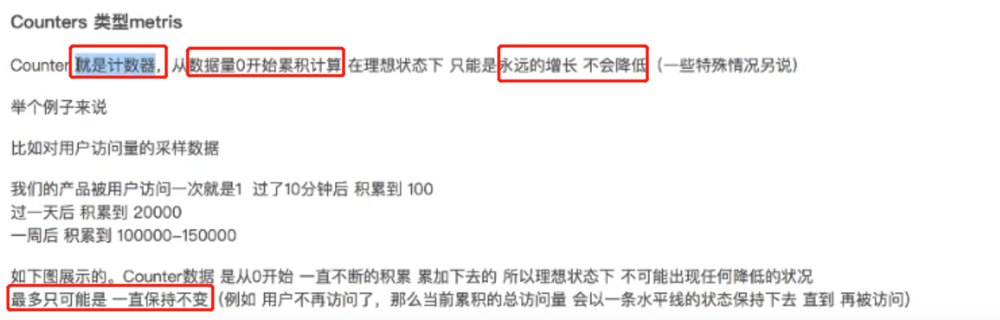
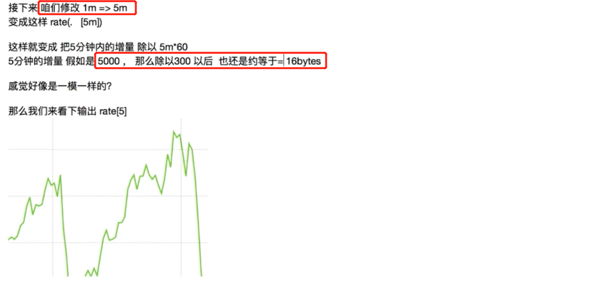
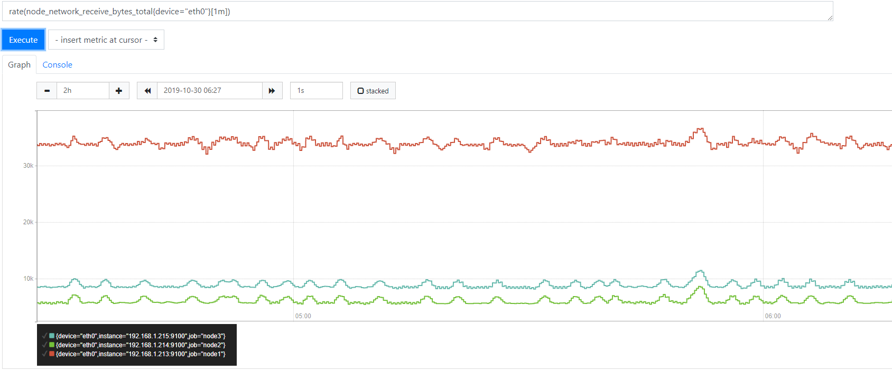
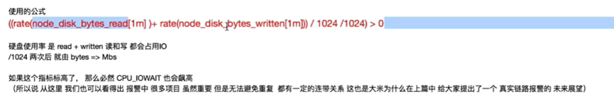
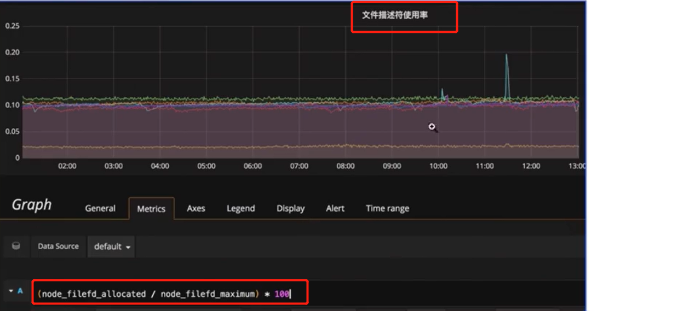
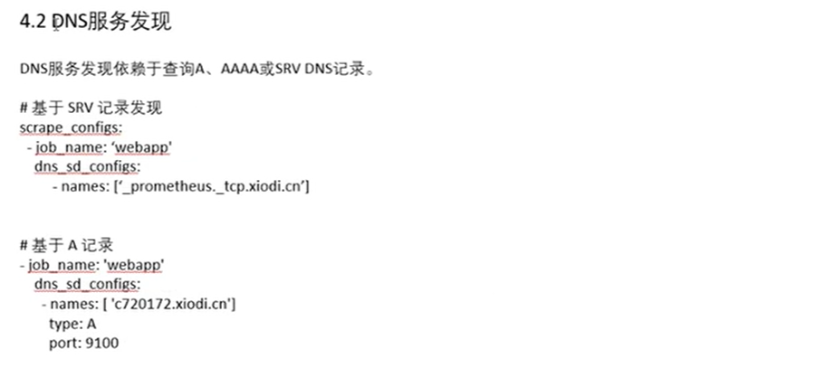
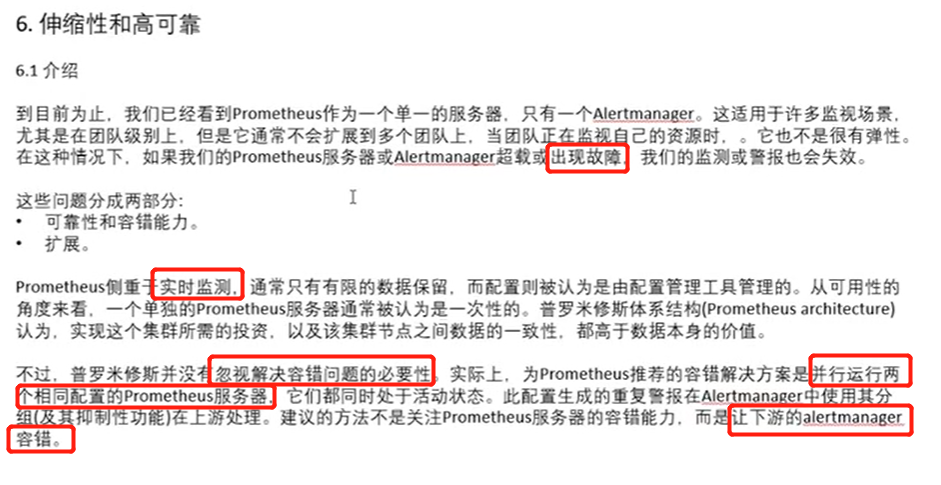
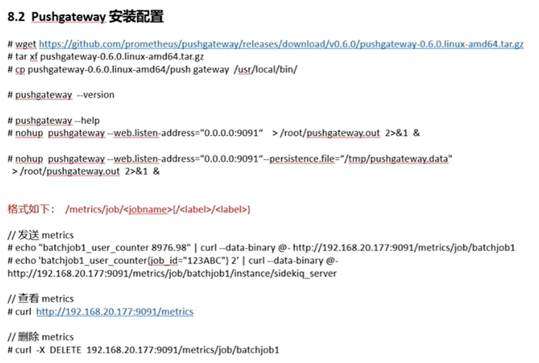

## Prometheus开源监控系统技术全剖析

### prometheus 序章

#### prometheus 架构


#### 商用的报警系统pagerduty


#### prometheus的特点


### 第一讲 企业级运维监控理论基础


#### 完善的运维体系架构


#### 监控系统的设计（运维架构师进行）


#### 监控系统的搭建


#### 数据采集的编写


#### 监控数据分析和算法


#### 监控稳定性测试


#### 监控自动化


#### 监控图形化


### 第二讲 企业监控通用技术

#### 


```
499 连接超时，客户端主动的放弃链接。
```


### 第三讲 prometheus 监控入门


```
官网：https://prometheus.io
```


#### prometheus命令行


```
计算1min的CPU使用率
```


```
默认的prometheus 配置文件	
```


```
Targets显示prometheus的监控的节点
```


### 第四讲 prometheus运行框架介绍


#### prometheus Server


##### prometheus Storage


#### prometheus 服务发现配置


#### prometheus的采集客户端


### prometheus 监控数据格式


#### metrics 数据的类型

**Gauge metric类型**


**Counter metric类型**




**Histogram metric类型**


#### prometheus k/v数据格式


```
exporter会实时的抓取服务的数据，执行curl 之后的返回数据
# 用于对下面才几点额数据进行说明，并说明了采集的数据的 metric的类型
```


### 第六讲 prometheus 初探和配置

#### Prometheus 的启动和配置

**同步系统时间**

```
[root@localhost ~]# timedatectl set-timezone Asia/Shanghai
[root@localhost ~]# ntpdate -u cn.pool.ntp.org
25 Oct 17:03:49 ntpdate[2369]: adjust time server 119.28.206.193 offset 0.237453 sec
```

**官网下载安装包**

```
wget https://github.com/prometheus/prometheus/releases/download/v2.13.1/prometheus-2.13.1.linux-amd64.tar.gz
```

**解压安装包**

```
[root@localhost src]# tar -xf prometheus-2.13.1.linux-amd64.tar.gz 
[root@localhost local]# ln -s prometheus-2.13.1.linux-amd64/ prometheus
```

**启动prometheus**

```
[root@localhost prometheus]# ./prometheus 
level=info ts=2019-10-25T09:24:53.507Z caller=main.go:296 msg="no time or size retention was set so using the default time retention" duration=15d
level=info ts=2019-10-25T09:24:53.507Z caller=main.go:332 msg="Starting Prometheus" version="(version=2.13.1, branch=HEAD, revision=6f92ce56053866194ae5937012c1bec40f1dd1d9)"
level=info ts=2019-10-25T09:24:53.507Z caller=main.go:333 build_context="(go=go1.13.1, user=root@88e419aa1676, date=20191017-13:15:01)"
level=info ts=2019-10-25T09:24:53.507Z caller=main.go:334 host_details="(Linux 3.10.0-123.el7.x86_64 #1 SMP Mon Jun 30 12:09:22 UTC 2014 x86_64 localhost.localdomain (none))"
level=info ts=2019-10-25T09:24:53.507Z caller=main.go:335 fd_limits="(soft=655350, hard=655350)"
level=info ts=2019-10-25T09:24:53.507Z caller=main.go:336 vm_limits="(soft=unlimited, hard=unlimited)"
level=info ts=2019-10-25T09:24:53.508Z caller=main.go:657 msg="Starting TSDB ..."
level=info ts=2019-10-25T09:24:53.526Z caller=web.go:450 component=web msg="Start listening for connections" address=0.0.0.0:9090
level=info ts=2019-10-25T09:24:53.527Z caller=head.go:514 component=tsdb msg="replaying WAL, this may take awhile"
level=info ts=2019-10-25T09:24:53.540Z caller=head.go:562 component=tsdb msg="WAL segment loaded" segment=0 maxSegment=0
level=info ts=2019-10-25T09:24:53.541Z caller=main.go:672 fs_type=XFS_SUPER_MAGIC
level=info ts=2019-10-25T09:24:53.541Z caller=main.go:673 msg="TSDB started"
level=info ts=2019-10-25T09:24:53.541Z caller=main.go:743 msg="Loading configuration file" filename=prometheus.yml
level=info ts=2019-10-25T09:24:53.545Z caller=main.go:771 msg="Completed loading of configuration file" filename=prometheus.yml
level=info ts=2019-10-25T09:24:53.545Z caller=main.go:626 msg="Server is ready to receive web requests."
```

```
访问9090端口可以看到默认的prometheus 界面
```


**Prometheus 配置文件**

```

# my global config
global:
  scrape_interval:     15s # Set the scrape interval to every 15 seconds. Default is every 1 minute.
  evaluation_interval: 15s # Evaluate rules every 15 seconds. The default is every 1 minute.
  # scrape_timeout is set to the global default (10s).

# Alertmanager configuration
alerting:
  alertmanagers:
  - static_configs:
    - targets:
      # - alertmanager:9093

# Load rules once and periodically evaluate them according to the global 'evaluation_interval'.
rule_files:
  # - "first_rules.yml"
  # - "second_rules.yml"

# A scrape configuration containing exactly one endpoint to scrape:
# Here it's Prometheus itself.
scrape_configs:
  # The job name is added as a label `job=<job_name>` to any timeseries scraped from this config.
  - job_name: 'prometheus'

    # metrics_path defaults to '/metrics'
    # scheme defaults to 'http'.

    static_configs:
    - targets: ['localhost:9090']
```


```
# A scrape configuration containing exactly one endpoint to scrape:
# Here it's Prometheus itself.
scrape_configs:
  # The job name is added as a label `job=<job_name>` to any timeseries scraped from this config.
  - job_name: 'prometheus'
  	## 定义了一个监控的名称

    # metrics_path defaults to '/metrics'
    # scheme defaults to 'http'.

    static_configs:
    - targets: ['localhost:9090']
    	## 定义监控的机器服务目标
```


#### Prometheus 监控CPU使用率实例


```
安装node_exporter 之后收集到的 CPU的时间片的信息
```


```
idle 状态的CPU的使用时间总和，用 1 减去，得到不是idle状态的CPU使用时间
再使用node_cpu 的所有mode状态总和时间，求得的比率

(1 - sum(increase(node_cpu_seconds_total{mode="idle"}[1m])) by (instance) / sum(increase(node_cpu_seconds_total[1m])) by (instance)) * 100
```


```
使用irate() 函数计算
```

#### 监控CPU load 饱和度


```
CPU load 是否大于CPU核心
```

#### 监控内存


#### 硬盘监控


```
predict_linear 根据最近1个小时的增长情况，预计4个小时后是否会爆满（当放回为负值时爆满）
```

#### 监控服务状态


```
== 1 返回所有值为1（服务当前状态） 的docker.service 的服务指标
```

#### up metrics


```
监控节点及服务的up状态
```

#### Metadata metric (从文本获取)


#### Vector matches(向量匹配)


### 第七讲 Prometheus 数学理论基础学习


**CPU使用率的计算公式的拆分**


```
mode 指定CPU耗时的类型，mode实际上为一个标签
node_cpu 没有过滤条件(标签)，实际上是全部的CPU时间
```


### 第八讲 Prometheus命令行使用扩展

#### **采集的数据使用lable 进行过滤**


#### counter类型数据每秒平均数

##### rate函数


```
示例 展示了 过去5min 平均每秒的数据请求数
```




```
上面的两个图的 rate值都是为 16bytes/s, 但是图的平滑性却存在差异
如下的实际示例：
```


##### increase 函数





```
可以发现 increase函数的图形和 rate函数的图形的形状 是一致的
但是纵坐标的 数值显示不一样，还可以发现使用rate的值 * 60s(1min) 可以得到increase的数值的显示
```

##### rate函数和increase函数使用的选择


```
主要是根据采集数据的频率来进行选择，因为 如果采集的数据采样周期较长，比如5min，在使用rate() 函数去计算每秒的数据，比较不精确，还可能会造成数据的断链。
rate() 函数比较适合采集变化敏感的数据，如CPU，内存，磁盘IO，网络流量等
```

##### sum 函数


```
sum() 会把所有的数据进行加合
```


```
三台机器的网络每秒增加量 加合
```

##### topk() 函数


### 第九讲 企业级监控数据采集方法

#### Prometheus 的启动配置

```
[root@node1 prometheus]# ./prometheus --help
usage: prometheus [<flags>]

The Prometheus monitoring server

Flags:
  -h, --help                     Show context-sensitive help (also try --help-long and --help-man).
      --version                  Show application version.
      --config.file="prometheus.yml"  
                                 Prometheus configuration file path.
      --web.listen-address="0.0.0.0:9090"  
                                 Address to listen on for UI, API, and telemetry.
      --web.read-timeout=5m      Maximum duration before timing out read of the request, and closing idle connections.
      --web.max-connections=512  Maximum number of simultaneous connections.
      --web.external-url=<URL>   The URL under which Prometheus is externally reachable (for example, if Prometheus is served via a reverse proxy). Used for generating
                                 relative and absolute links back to Prometheus itself. If the URL has a path portion, it will be used to prefix all HTTP endpoints served
                                 by Prometheus. If omitted, relevant URL components will be derived automatically.
      --web.route-prefix=<path>  Prefix for the internal routes of web endpoints. Defaults to path of --web.external-url.
      --web.user-assets=<path>   Path to static asset directory, available at /user.
      --web.enable-lifecycle     Enable shutdown and reload via HTTP request.
      --web.enable-admin-api     Enable API endpoints for admin control actions.
      --web.console.templates="consoles"  
                                 Path to the console template directory, available at /consoles.
      --web.console.libraries="console_libraries"  
                                 Path to the console library directory.
      --web.page-title="Prometheus Time Series Collection and Processing Server"  
                                 Document title of Prometheus instance.
      --web.cors.origin=".*"     Regex for CORS origin. It is fully anchored. Example: 'https?://(domain1|domain2)\.com'
      --storage.tsdb.path="data/"  
                                 Base path for metrics storage.
      --storage.tsdb.retention=STORAGE.TSDB.RETENTION  
                                 [DEPRECATED] How long to retain samples in storage. This flag has been deprecated, use "storage.tsdb.retention.time" instead.
      --storage.tsdb.retention.time=STORAGE.TSDB.RETENTION.TIME  
                                 How long to retain samples in storage. When this flag is set it overrides "storage.tsdb.retention". If neither this flag nor
                                 "storage.tsdb.retention" nor "storage.tsdb.retention.size" is set, the retention time defaults to 15d.
      --storage.tsdb.retention.size=STORAGE.TSDB.RETENTION.SIZE  
                                 [EXPERIMENTAL] Maximum number of bytes that can be stored for blocks. Units supported: KB, MB, GB, TB, PB. This flag is experimental and
                                 can be changed in future releases.
      --storage.tsdb.no-lockfile  
                                 Do not create lockfile in data directory.
      --storage.tsdb.allow-overlapping-blocks  
                                 [EXPERIMENTAL] Allow overlapping blocks, which in turn enables vertical compaction and vertical query merge.
      --storage.tsdb.wal-compression  
                                 Compress the tsdb WAL.
      --storage.remote.flush-deadline=<duration>  
                                 How long to wait flushing sample on shutdown or config reload.
      --storage.remote.read-sample-limit=5e7  
                                 Maximum overall number of samples to return via the remote read interface, in a single query. 0 means no limit. This limit is ignored for
                                 streamed response types.
      --storage.remote.read-concurrent-limit=10  
                                 Maximum number of concurrent remote read calls. 0 means no limit.
      --storage.remote.read-max-bytes-in-frame=1048576  
                                 Maximum number of bytes in a single frame for streaming remote read response types before marshalling. Note that client might have limit
                                 on frame size as well. 1MB as recommended by protobuf by default.
      --rules.alert.for-outage-tolerance=1h  
                                 Max time to tolerate prometheus outage for restoring "for" state of alert.
      --rules.alert.for-grace-period=10m  
                                 Minimum duration between alert and restored "for" state. This is maintained only for alerts with configured "for" time greater than grace
                                 period.
      --rules.alert.resend-delay=1m  
                                 Minimum amount of time to wait before resending an alert to Alertmanager.
      --alertmanager.notification-queue-capacity=10000  
                                 The capacity of the queue for pending Alertmanager notifications.
      --alertmanager.timeout=10s  
                                 Timeout for sending alerts to Alertmanager.
      --query.lookback-delta=5m  The maximum lookback duration for retrieving metrics during expression evaluations.
      --query.timeout=2m         Maximum time a query may take before being aborted.
      --query.max-concurrency=20  
                                 Maximum number of queries executed concurrently.
      --query.max-samples=50000000  
                                 Maximum number of samples a single query can load into memory. Note that queries will fail if they try to load more samples than this
                                 into memory, so this also limits the number of samples a query can return.
      --log.level=info           Only log messages with the given severity or above. One of: [debug, info, warn, error]
      --log.format=logfmt        Output format of log messages. One of: [logfmt, json]
```


#### 使用supervisor 守护prometheus

```
[root@node1 supervisord.d]# cat prometheus.ini 
[program:prometheus]
user=root
command=/usr/local/prometheus/prometheus --config.file=/usr/local/prometheus/prometheus.yml
stdout_logfile=/var/log/supervisor/prometheus.log
redirect_stderr=true
stopasgroup=true
killasgroup=true

priority=1
exitcodes=0
stopwaitsecs=3
startsecs=5
autostart = true
autorestart=true
numprocs=1
```

```
[root@node1 supervisord.d]# cat node_exporter.ini 
[program:node_exporter]
user=root
command=/usr/local/node_exporter/node_exporter
stdout_logfile=/var/log/supervisor/node_exporter.log
redirect_stderr=true
stopasgroup=true
killasgroup=true

priority=1
exitcodes=0
stopwaitsecs=3
startsecs=5
autostart = true
autorestart=true
numprocs=1
```


**开启node_exporter 不收集的参数**


### 第十讲 企业监控数据采集脚本开发


#### 安装配置pushgateway


```
scrape_configs:
  # The job name is added as a label `job=<job_name>` to any timeseries scraped from this config.
  - job_name: 'prometheus'

    # metrics_path defaults to '/metrics'
    # scheme defaults to 'http'.

    static_configs:
    - targets: ['localhost:9090']

  - job_name: 'node1'
    static_configs:
    - targets: ['192.168.1.213:9100']
  - job_name: 'node2'
    static_configs:
    - targets: ['192.168.1.214:9100']
  - job_name: 'node3'
    static_configs:
    - targets: ['192.168.1.215:9100']
  - job_name: 'pushgateway'
    static_configs:
    - targets: ['192.168.1.214:9100','192.168.1.215:9100']   
```

#### 自定义pushgateway脚本


### 第十一讲 Prometheus 之 exporter模块源码示例

#### 编写exporter的流程


```
还有一点就是通过调用http返回的数据必须是 以时间序列的 kv 数据，values 必须为 int、float 类型，不能为string类型，不然prometheus不能识别，则会使nil
```

#### exporter 源码示例


```
import 所使用到的包
```


```
const namespace 定义了一个命名空间
定义监控 metrics 的变量
```


```
Exporter的成员函数，在prometheus 进行抓取的时候提供数据给prometheus的
```


```
示例话Exporter的时候，构造Exporter的数据结构体
```


### 第十二讲 grafana 超实用企业监控绘图工具结合


```
报警配置
```

### 第十三讲 Prometheus企业级实际使用（一）


```
iowait 
```


```
内存可用量
```


```
磁盘使用量
```


```
predict_linear() 函数 对曲线的变化率进行计算
```



```
硬盘IO
```


```
网络传输
```

### 第十三讲 Prometheus企业级实际使用（二）


```
tcp wait数量
```



```
文件描述符的使用率
```


```
[root@elk-logstash conf.d]# ping -q -A -s 500 -W 1000 -c 100 172.17.122.21
PING 172.17.122.21 (172.17.122.21) 500(528) bytes of data.

--- 172.17.122.21 ping statistics ---
100 packets transmitted, 100 received, 0% packet loss, time 0ms
rtt min/avg/max/mdev = 0.002/0.002/0.017/0.002 ms, ipg/ewma 0.006/0.002 ms
```


```
smokeping 
```

### 通过记录规则持久查询


```
使用表达式 生成一个新的 metric instance:node_cpu:avg_rate5m  可以直接查询
```


### 服务发现


```
定义要发现的 监控配置 的服务文件
```

#### 基于DNS的服务的目标的发现



```
_prometheus 为服务名称
_tcp 为协议名称
xiodi.cn 为域名
```

### 告警和告警管理


#### 配置告警规则


```
使用 cpuburn 工具进行CPU的压测出发报警
```


### ALertmanager 路由


```
根据不同的报警级别发送到不同的人
```


### ALertmanager 控制静默


```
当服务处于维护状态的时候，使用静默 抑制报警行为
```


### Prometheus的伸缩性和高可用性




### Alertmanager 集群配置


### Prometheus 集群


### 探测 （black_exporter）


```
下面的relabel 对 获取的探测 目标的 __address__ 重新打标为instance，__address__ 打上black_exporter 的地址
```


```
探测的目标的配置文件
```

### Pushgataway





### Prometheus在k8s安装环境的介绍


```
安装之前先把代理设置好
```


```
node_exporter 创建为daemonset 在各个节点都创建
```


```
部署node_exporter 的 service访问
```


```
创建 账号 访问k8s 的资源
```


```
ClusterRole 设定这个角色的 访问集群的权限
ServiceAccount 配置访问集群的账户
ClusterRoleBinding 把一个ClusterRole 分配给ServiceAccount 就拥有了相应的权限
```


```
部署kube-state-metrics
```


