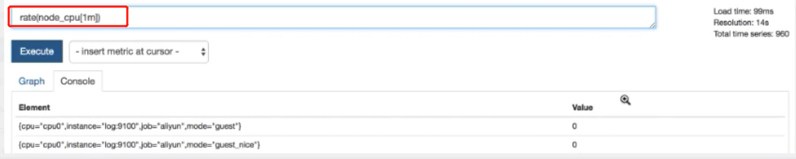
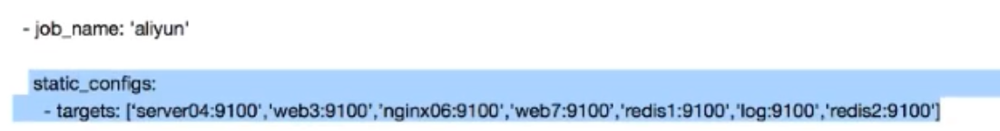
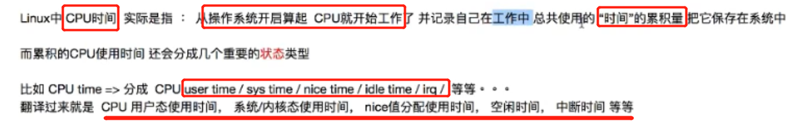

## Prometheus开源监控系统技术全剖析

### prometheus 序章

#### prometheus 架构


#### 商用的报警系统pagerduty


#### prometheus的特点


### 第一讲 企业级运维监控理论基础


#### 完善的运维体系架构


#### 监控系统的设计（运维架构师进行）


#### 监控系统的搭建


#### 数据采集的编写


#### 监控数据分析和算法


#### 监控稳定性测试


#### 监控自动化


#### 监控图形化


### 第二讲 企业监控通用技术

#### 


```
499 连接超时，客户端主动的放弃链接。
```


### 第三讲 prometheus 监控入门


```
官网：https://prometheus.io
```


#### prometheus命令行




```
计算1min的CPU使用率
```


```
默认的prometheus 配置文件	
```


```
Targets显示prometheus的监控的节点
```


### 第四讲 prometheus运行框架介绍


#### prometheus Server


##### prometheus Storage


#### prometheus 服务发现配置


#### prometheus的采集客户端


### prometheus 监控数据格式


#### metrics 数据的类型

**Gauge metric类型**


**Counter metric类型**


**Histogram metric类型**


#### prometheus k/v数据格式


```
exporter会实时的抓取服务的数据，执行curl 之后的返回数据
# 用于对下面才几点额数据进行说明，并说明了采集的数据的 metric的类型
```


### 第六讲 prometheus 初探和配置

#### Prometheus 的启动和配置

**同步系统时间**

```
[root@localhost ~]# timedatectl set-timezone Asia/Shanghai
[root@localhost ~]# ntpdate -u cn.pool.ntp.org
25 Oct 17:03:49 ntpdate[2369]: adjust time server 119.28.206.193 offset 0.237453 sec
```

**官网下载安装包**

```
wget https://github.com/prometheus/prometheus/releases/download/v2.13.1/prometheus-2.13.1.linux-amd64.tar.gz
```

**解压安装包**

```
[root@localhost src]# tar -xf prometheus-2.13.1.linux-amd64.tar.gz 
[root@localhost local]# ln -s prometheus-2.13.1.linux-amd64/ prometheus
```

**启动prometheus**

```
[root@localhost prometheus]# ./prometheus 
level=info ts=2019-10-25T09:24:53.507Z caller=main.go:296 msg="no time or size retention was set so using the default time retention" duration=15d
level=info ts=2019-10-25T09:24:53.507Z caller=main.go:332 msg="Starting Prometheus" version="(version=2.13.1, branch=HEAD, revision=6f92ce56053866194ae5937012c1bec40f1dd1d9)"
level=info ts=2019-10-25T09:24:53.507Z caller=main.go:333 build_context="(go=go1.13.1, user=root@88e419aa1676, date=20191017-13:15:01)"
level=info ts=2019-10-25T09:24:53.507Z caller=main.go:334 host_details="(Linux 3.10.0-123.el7.x86_64 #1 SMP Mon Jun 30 12:09:22 UTC 2014 x86_64 localhost.localdomain (none))"
level=info ts=2019-10-25T09:24:53.507Z caller=main.go:335 fd_limits="(soft=655350, hard=655350)"
level=info ts=2019-10-25T09:24:53.507Z caller=main.go:336 vm_limits="(soft=unlimited, hard=unlimited)"
level=info ts=2019-10-25T09:24:53.508Z caller=main.go:657 msg="Starting TSDB ..."
level=info ts=2019-10-25T09:24:53.526Z caller=web.go:450 component=web msg="Start listening for connections" address=0.0.0.0:9090
level=info ts=2019-10-25T09:24:53.527Z caller=head.go:514 component=tsdb msg="replaying WAL, this may take awhile"
level=info ts=2019-10-25T09:24:53.540Z caller=head.go:562 component=tsdb msg="WAL segment loaded" segment=0 maxSegment=0
level=info ts=2019-10-25T09:24:53.541Z caller=main.go:672 fs_type=XFS_SUPER_MAGIC
level=info ts=2019-10-25T09:24:53.541Z caller=main.go:673 msg="TSDB started"
level=info ts=2019-10-25T09:24:53.541Z caller=main.go:743 msg="Loading configuration file" filename=prometheus.yml
level=info ts=2019-10-25T09:24:53.545Z caller=main.go:771 msg="Completed loading of configuration file" filename=prometheus.yml
level=info ts=2019-10-25T09:24:53.545Z caller=main.go:626 msg="Server is ready to receive web requests."
```

```
访问9090端口可以看到默认的prometheus 界面
```


**Prometheus 配置文件**

```

# my global config
global:
  scrape_interval:     15s # Set the scrape interval to every 15 seconds. Default is every 1 minute.
  evaluation_interval: 15s # Evaluate rules every 15 seconds. The default is every 1 minute.
  # scrape_timeout is set to the global default (10s).

# Alertmanager configuration
alerting:
  alertmanagers:
  - static_configs:
    - targets:
      # - alertmanager:9093

# Load rules once and periodically evaluate them according to the global 'evaluation_interval'.
rule_files:
  # - "first_rules.yml"
  # - "second_rules.yml"

# A scrape configuration containing exactly one endpoint to scrape:
# Here it's Prometheus itself.
scrape_configs:
  # The job name is added as a label `job=<job_name>` to any timeseries scraped from this config.
  - job_name: 'prometheus'

    # metrics_path defaults to '/metrics'
    # scheme defaults to 'http'.

    static_configs:
    - targets: ['localhost:9090']
```


```
# A scrape configuration containing exactly one endpoint to scrape:
# Here it's Prometheus itself.
scrape_configs:
  # The job name is added as a label `job=<job_name>` to any timeseries scraped from this config.
  - job_name: 'prometheus'
  	## 定义了一个监控的名称

    # metrics_path defaults to '/metrics'
    # scheme defaults to 'http'.

    static_configs:
    - targets: ['localhost:9090']
    	## 定义监控的机器服务目标
```




#### Prometheus 监控CPU使用率实例


```
安装node_exporter 之后收集到的 CPU的时间片的信息
```





```
idle 状态的CPU的使用时间总和，用 1 减去，得到不是idle状态的CPU使用时间
再使用node_cpu 的所有mode状态总和时间，求得的比率

(1 - sum(increase(node_cpu_seconds_total{mode="idle"}[1m])) by (instance) / sum(increase(node_cpu_seconds_total[1m])) by (instance)) * 100
```


### 第七讲 Prometheus 数学理论基础学习


**CPU使用率的计算公式的拆分**


```
mode 指定CPU耗时的类型，mode实际上为一个标签
node_cpu 没有过滤条件(标签)，实际上是全部的CPU时间
```


### 第八讲 Prometheus命令行使用扩展

#### **采集的数据使用lable 进行过滤**


#### counter类型数据每秒平均数

##### rate函数

