## Prometheus开源监控系统技术全剖析

### Promethues 序章

#### Promethues 架构

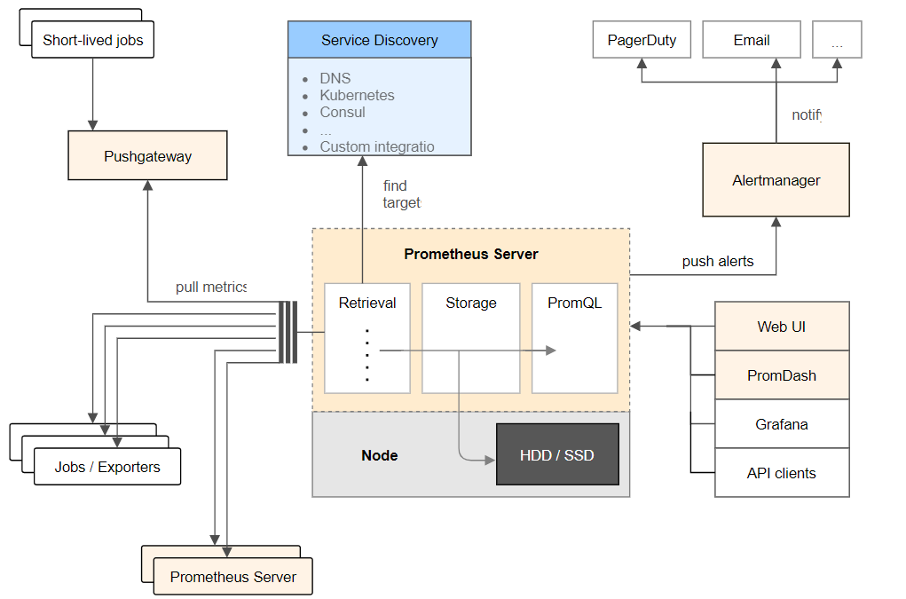

#### 商用的报警系统pagerduty

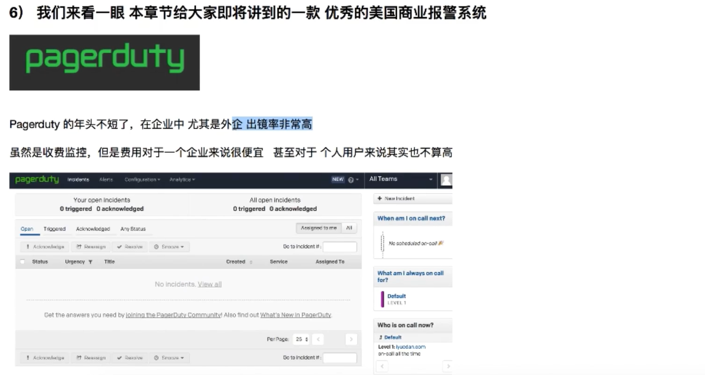

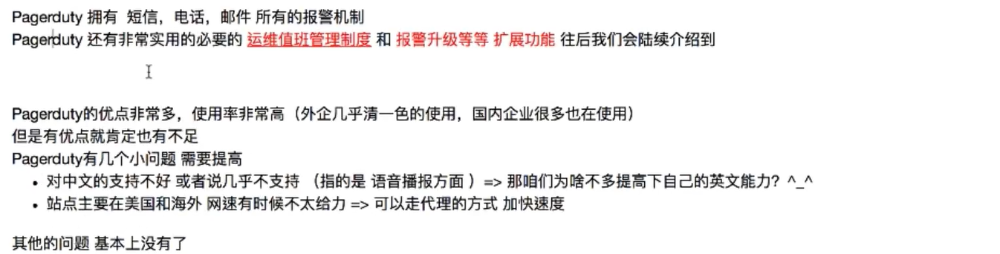

#### Promethues的特点

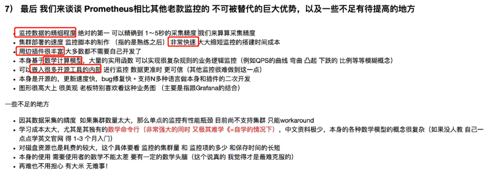

### 第一讲 企业级运维监控理论基础

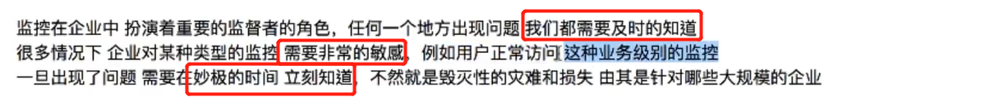

#### 完善的运维体系架构

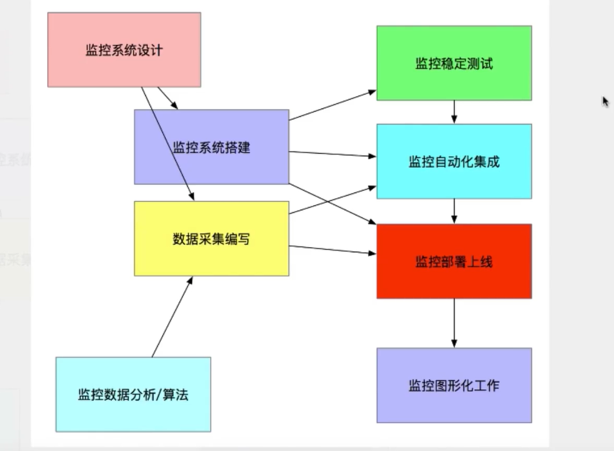

#### 监控系统的设计（运维架构师进行）

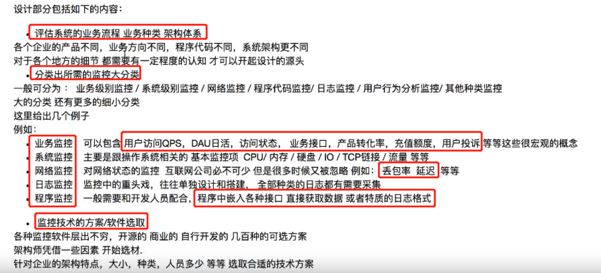

#### 监控系统的搭建

#### 数据采集的编写

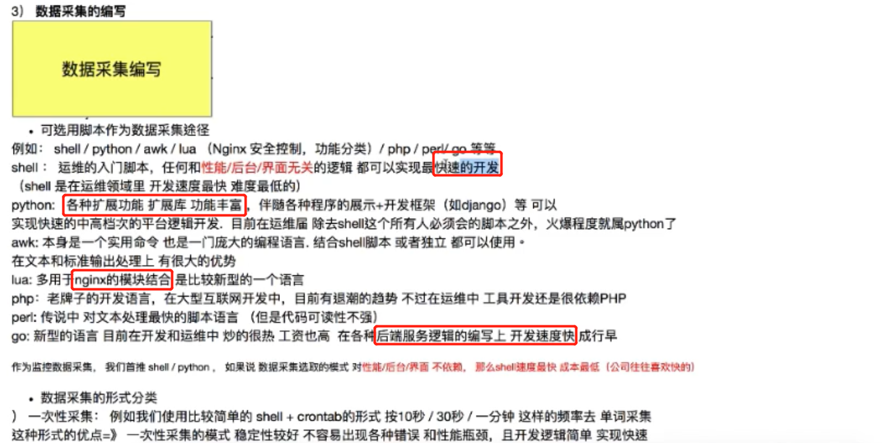

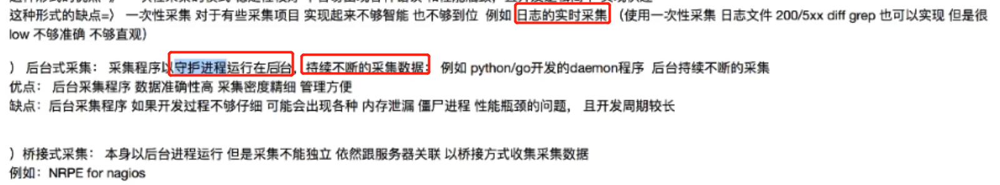

#### 监控数据分析和算法

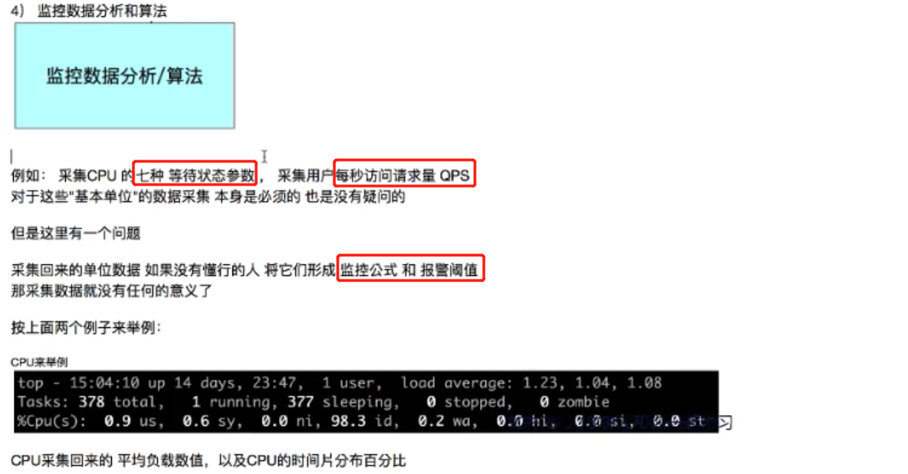

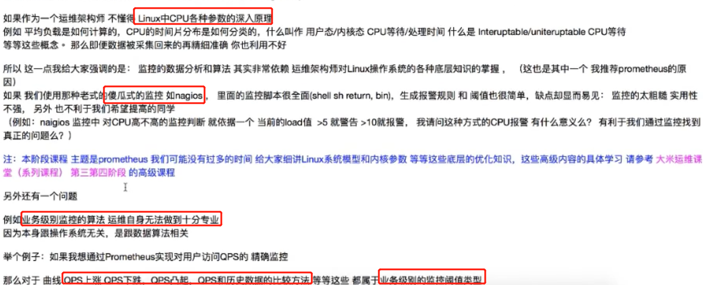

#### 监控稳定性测试

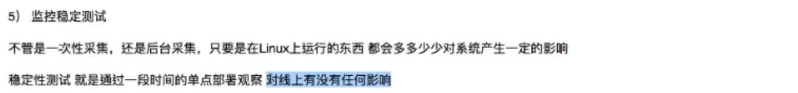

#### 监控自动化

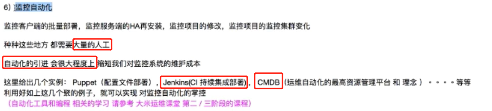

#### 监控图形化

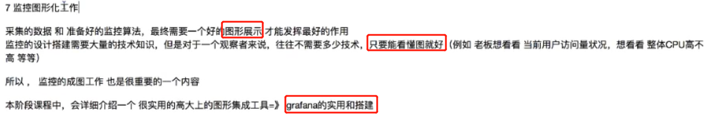

### 第二讲 企业监控通用技术

