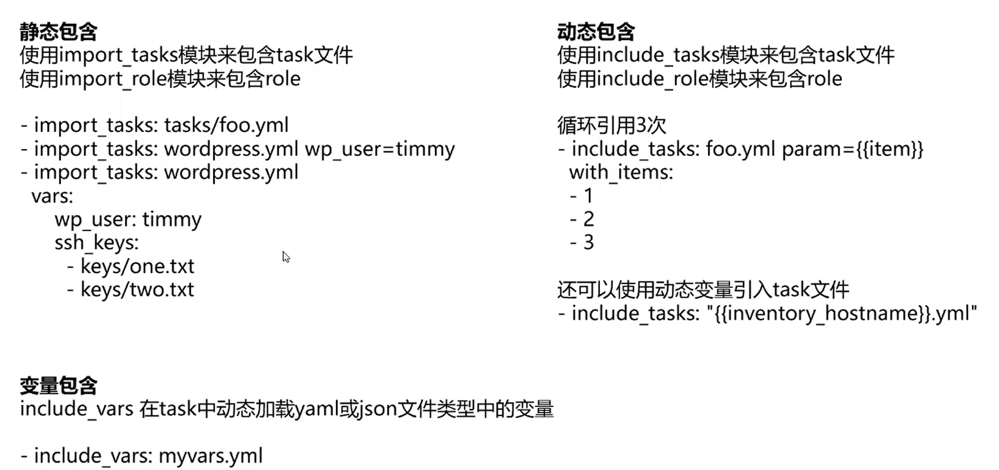
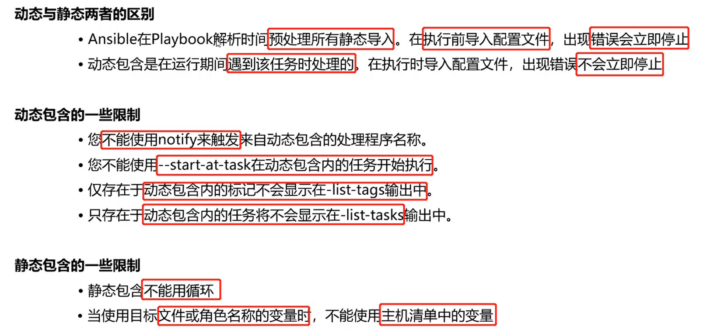
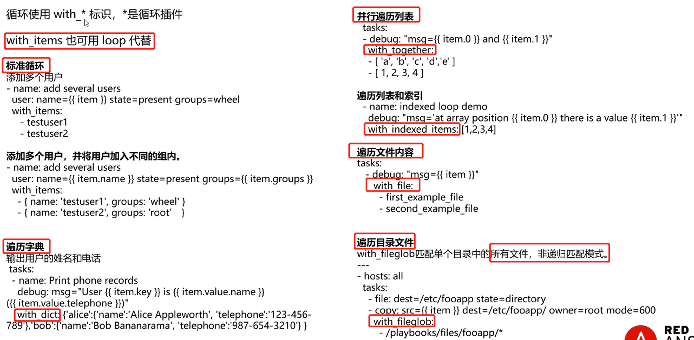

## Ansible 学习实践

### Ansible 基础知识

#### Ansible 是如何工作的


#### Ansible与其他配置管理工具的对比


#### Ansible 资源


#### Ansible的安装

```
yum 源安装:
yum -y install ansible

pip 安装:
yum -y install python-setuptools
easy_install pip
pip install ansible
或 yum -y install python-pip && pip install ansible

python3 环境安装:
yum -y install python36 python36-tools
wget https://bootstrap.pypa.io/get-pip.py
python36 get-pip.py
pip3.6 install ansible
```

### Ansible 配置


```
注意：ansible从上到下依次检测，检查到哪个就使用哪个
```

#### 配置文件解析

```
vim ansible.cfg
[defaults]

# some basic default values...

#inventory      = /etc/ansible/hosts
## 主机清单的配置 
#library        = /usr/share/my_modules/
## 模块的目录
#module_utils   = /usr/share/my_module_utils/
## 模块的共用部分的目录
#remote_tmp     = ~/.ansible/tmp
## 远端主机的临时目录，用于存放临时的文件
#local_tmp      = ~/.ansible/tmp
## 本机的临时文件的目录
#plugin_filters_cfg = /etc/ansible/plugin_filters.yml
## 过滤不使用的插件的配置
#forks          = 5
## ansible 执行的时候使用多少个进程并行的执行
#poll_interval  = 15
## ansible 异步执行的轮询时间
#sudo_user      = root
## 执行执行命令的使用的sudo用户
#ask_sudo_pass = True
## 是否提醒用户输入 sudo 时用于提权的密码 
#ask_pass      = True
## 提醒用户输入密码
#transport      = smart
## 传输方式 智能的使用 scp/sftp 的方式进行传输
#remote_port    = 22
## 默认的远端的连接端口
#module_lang    = C
## 末端执行时用于模块的语言区域设置
#module_set_locale = False
## 控制 #module_lang    = C 的开关
```

```
# plays will gather facts by default, which contain information about
# the remote system.
#
# smart - gather by default, but don't regather if already gathered
# implicit - gather by default, turn off with gather_facts: False
# explicit - do not gather by default, must say gather_facts: True
#gathering = implicit
## 是否开启收集 facts 的信息

# This only affects the gathering done by a play's gather_facts directive,
# by default gathering retrieves all facts subsets
# all - gather all subsets
# network - gather min and network facts
# hardware - gather hardware facts (longest facts to retrieve)
# virtual - gather min and virtual facts
# facter - import facts from facter
# ohai - import facts from ohai
# You can combine them using comma (ex: network,virtual)
# You can negate them using ! (ex: !hardware,!facter,!ohai)
# A minimal set of facts is always gathered.
#gather_subset = all
## 开启收集那部分的 facts的信息，可以是硬件，网络等

# some hardware related facts are collected
# with a maximum timeout of 10 seconds. This
# option lets you increase or decrease that
# timeout to something more suitable for the
# environment.
# gather_timeout = 10
## 收集facts 的超时时间
```

```
# additional paths to search for roles in, colon separated
#roles_path    = /etc/ansible/roles
## 指定 role的目录
```

```
# uncomment this to disable SSH key host checking
host_key_checking = False
## ansible ssh 连接主机的时候是否进行密钥检查（第一次连接的时候要验证know_hosts）
```

```
# change the default callback, you can only have one 'stdout' type  enabled at a time.
#stdout_callback = skippy
## ansible 执行完成后回调输出到控制台的信息的插件
```

```
## Ansible ships with some plugins that require whitelisting,
## this is done to avoid running all of a type by default.
## These setting lists those that you want enabled for your system.
## Custom plugins should not need this unless plugin author specifies it.

# enable callback plugins, they can output to stdout but cannot be 'stdout' type.
#callback_whitelist = timer, mail
## 需要把自己定义的callback 插件写入到白名单中，否则看不到
```

```
# Determine whether includes in tasks and handlers are "static" by
# default. As of 2.0, includes are dynamic by default. Setting these
# values to True will make includes behave more like they did in the
# 1.x versions.
#task_includes_static = True
#handler_includes_static = True
## task 的静态和动态包含
```

```
# Controls if a missing handler for a notification event is an error or a warning
#error_on_missing_handler = True

# change this for alternative sudo implementations
#sudo_exe = sudo
## 执行sudo的可执行文件

# What flags to pass to sudo
# WARNING: leaving out the defaults might create unexpected behaviours
#sudo_flags = -H -S -n
## sudo 的参数信息
```

```
# SSH timeout
#timeout = 10
## SSH的超时时间

# default user to use for playbooks if user is not specified
# (/usr/bin/ansible will use current user as default)
#remote_user = root
## 远端的执行用户

# logging is off by default unless this path is defined
# if so defined, consider logrotate
#log_path = /var/log/ansible.log
## 日志的存放位置
```

```
# default module name for /usr/bin/ansible
#module_name = command
## 当使用 ansible 命令行执行命令的时候 没有使用  -m 执行所使用的模块，则默认的使用command模块
```

```
# use this shell for commands executed under sudo
# you may need to change this to bin/bash in rare instances
# if sudo is constrained
#executable = /bin/sh
## 远端执行的解释器为 /bin/sh 进行的
```

```
# if inventory variables overlap, does the higher precedence one win
# or are hash values merged together?  The default is 'replace' but
# this can also be set to 'merge'.
#hash_behaviour = replace
## 控制变量 的不同优先级 传输，是进行合并还是进行替换，默认 replace 最后不要改变
```

```
# by default, variables from roles will be visible in the global variable
# scope. To prevent this, the following option can be enabled, and only
# tasks and handlers within the role will see the variables there
#private_role_vars = yes
## 设置 引用了role之后是否可以使用这个 role的私有变量，默认为 false是可以使用的
```

```
# list any Jinja2 extensions to enable here:
#jinja2_extensions = jinja2.ext.do,jinja2.ext.i18n
## 使用jinjia2 的扩展模块，可以在此处进行定义
```

```
# if set, always use this private key file for authentication, same as
# if passing --private-key to ansible or ansible-playbook
#private_key_file = /path/to/file
## 私有key 的路径位置

# If set, configures the path to the Vault password file as an alternative to
# specifying --vault-password-file on the command line.
#vault_password_file = /path/to/vault_password_file
## 加密的密码文件
```

```
# format of string {{ ansible_managed }} available within Jinja2
# templates indicates to users editing templates files will be replaced.
# replacing {file}, {host} and {uid} and strftime codes with proper values.
#ansible_managed = Ansible managed: {file} modified on %Y-%m-%d %H:%M:%S by {uid} on {host}
## 在模板中使用 ansible_managed 变量的时候，输出后面定义的信息

# {file}, {host}, {uid}, and the timestamp can all interfere with idempotence
# in some situations so the default is a static string:
#ansible_managed = Ansible managed

```

```
# by default, ansible-playbook will display "Skipping [host]" if it determines a task
# should not be run on a host.  Set this to "False" if you don't want to see these "Skipping"
# messages. NOTE: the task header will still be shown regardless of whether or not the
# task is skipped.
#display_skipped_hosts = True
## 默认 配置了 skip 的主机 会显示Skipping 的信息的
```

```
# by default, if a task in a playbook does not include a name: field then
# ansible-playbook will construct a header that includes the task's action but
# not the task's args.  This is a security feature because ansible cannot know
# if the *module* considers an argument to be no_log at the time that the
# header is printed.  If your environment doesn't have a problem securing
# stdout from ansible-playbook (or you have manually specified no_log in your
# playbook on all of the tasks where you have secret information) then you can
# safely set this to True to get more informative messages.
#display_args_to_stdout = False
## 是否显示每个任务的参数，默认是不显示的
```

```
# by default (as of 1.3), Ansible will raise errors when attempting to dereference
# Jinja2 variables that are not set in templates or action lines. Uncomment this line
# to revert the behavior to pre-1.3.
#error_on_undefined_vars = False
## 是否在jinjia2 模板变量 没有设置的时候显示错误，默认会终止任务，取消注释会不会终止
```

```
# by default (as of 1.6), Ansible may display warnings based on the configuration of the
# system running ansible itself. This may include warnings about 3rd party packages or
# other conditions that should be resolved if possible.
# to disable these warnings, set the following value to False:
#system_warnings = True
## 系统的警告信息是否需要显示出来，默认是 Ture
```

```
# by default (as of 1.4), Ansible may display deprecation warnings for language
# features that should no longer be used and will be removed in future versions.
# to disable these warnings, set the following value to False:
#deprecation_warnings = True
## 模块被弃用的信息是否要显示出来，默认为Ture
```

```
# (as of 1.8), Ansible can optionally warn when usage of the shell and
# command module appear to be simplified by using a default Ansible module
# instead.  These warnings can be silenced by adjusting the following
# setting or adding warn=yes or warn=no to the end of the command line
# parameter string.  This will for example suggest using the git module
# instead of shelling out to the git command.
# command_warnings = False
## 在使用shell命令 比如 useadd, ansible 本身可能存在这样的模块，会进行警告信息，是否使用ansible紫荆的模块会更好一些
```

```
#### ansible自定义的一些插件的位置
# set plugin path directories here, separate with colons
#action_plugins     = /usr/share/ansible/plugins/action
## 动作插件
#cache_plugins      = /usr/share/ansible/plugins/cache
## 缓存插件
#callback_plugins   = /usr/share/ansible/plugins/callback
## callback 的插件，比如 执行的结果信息，发送Email， 记录结果到数据库等
#connection_plugins = /usr/share/ansible/plugins/connection
## 连接插件
#lookup_plugins     = /usr/share/ansible/plugins/lookup
## 循环的插件
#inventory_plugins  = /usr/share/ansible/plugins/inventory
## 主机清单的插件
#vars_plugins       = /usr/share/ansible/plugins/vars
## 变量的插件
#filter_plugins     = /usr/share/ansible/plugins/filter
## 过滤插件
#test_plugins       = /usr/share/ansible/plugins/test
## 测试插件
#terminal_plugins   = /usr/share/ansible/plugins/terminal
## 终端插件
#strategy_plugins   = /usr/share/ansible/plugins/strategy
## 策略插件
```

```
# by default, ansible will use the 'linear' strategy but you may want to try
# another one
#strategy = free
## 执行的策略，默认的为 linear，主机任务一个一个的进行执行，free 是 谁先执行完就执行下一个，尽可能快的把任务执行完成
```

```
# by default callbacks are not loaded for /bin/ansible, enable this if you
# want, for example, a notification or logging callback to also apply to
# /bin/ansible runs
#bin_ansible_callbacks = False
## 控制ansible 运行时是否加载callback 插件，默认为false不进行加载
```

```
# don't like cows?  that's unfortunate.
# set to 1 if you don't want cowsay support or export ANSIBLE_NOCOWS=1
#nocows = 1
## 
# set which cowsay stencil you'd like to use by default. When set to 'random',
# a random stencil will be selected for each task. The selection will be filtered
# against the `cow_whitelist` option below.
#cow_selection = default
#cow_selection = random

# when using the 'random' option for cowsay, stencils will be restricted to this list.
# it should be formatted as a comma-separated list with no spaces between names.
# NOTE: line continuations here are for formatting purposes only, as the INI parser
#       in python does not support them.
#cow_whitelist=bud-frogs,bunny,cheese,daemon,default,dragon,elephant-in-snake,elephant,eyes,\
#              hellokitty,kitty,luke-koala,meow,milk,moofasa,moose,ren,sheep,small,stegosaurus,\
#              stimpy,supermilker,three-eyes,turkey,turtle,tux,udder,vader-koala,vader,www
```

```
# don't like colors either?
# set to 1 if you don't want colors, or export ANSIBLE_NOCOLOR=1
#nocolor = 1
## ansible 执行的时候是否有颜色显示出来
```

```
# if set to a persistent type (not 'memory', for example 'redis') fact values
# from previous runs in Ansible will be stored.  This may be useful when
# wanting to use, for example, IP information from one group of servers
# without having to talk to them in the same playbook run to get their
# current IP information.
#fact_caching = memory
## 缓存主机清单的方式，默认为 memory，也可以使用redis 或文件存储
```

```
# retry files
# When a playbook fails by default a .retry file will be created in ~/
# You can disable this feature by setting retry_files_enabled to False
# and you can change the location of the files by setting retry_files_save_path

#retry_files_enabled = False
#retry_files_save_path = ~/.ansible-retry
## 使用ansible执行命令失败之后，是否要保存重试的文件，哪些主机失败了
```

```
# squash actions
# Ansible can optimise actions that call modules with list parameters
# when looping. Instead of calling the module once per with_ item, the
# module is called once with all items at once. Currently this only works
# under limited circumstances, and only with parameters named 'name'.
#squash_actions = apk,apt,dnf,homebrew,pacman,pkgng,yum,zypper
## 在使用with 循环的时候默认的情况下是 一次一次的执行，但是将执行的动作 执行在这个地方后，一次并发的进行执行

例如：
---
- hosts: localhost
  tasks:
    - debug: "msg: {{ item }}"
      with_items:
        - one 
        - two 
        - three 
        - four 
#squash_actions = apk,apt,dnf,homebrew,pacman,pkgng,yum,zypper,debug
```

```
# prevents logging of task data, off by default
#no_log = False
## 是否记录task的日志信息，默认是不记录的

 # prevents logging of tasks, but only on the targets, data is still logged on the master/controller
#no_target_syslog = False
## 默认是记录到 系统的 syslog中去的
```

```
# controls whether Ansible will raise an error or warning if a task has no
# choice but to create world readable temporary files to execute a module on
# the remote machine.  This option is False by default for security.  Users may
# turn this on to have behaviour more like Ansible prior to 2.1.x.  See
# https://docs.ansible.com/ansible/become.html#becoming-an-unprivileged-user
# for more secure ways to fix this than enabling this option.
#allow_world_readable_tmpfiles = False
## 在目标机器创建临时的文件目录的时候，是显示warning 还是立马失败，默认是立马失败的
```

```
# controls the compression level of variables sent to
# worker processes. At the default of 0, no compression
# is used. This value must be an integer from 0 to 9.
#var_compression_level = 9
## 变量的压缩等级，默认是 0 ，不压缩
```

```
# controls what compression method is used for new-style ansible modules when
# they are sent to the remote system.  The compression types depend on having
# support compiled into both the controller's python and the client's python.
# The names should match with the python Zipfile compression types:
# * ZIP_STORED (no compression. available everywhere)
# * ZIP_DEFLATED (uses zlib, the default)
# These values may be set per host via the ansible_module_compression inventory
# variable
#module_compression = 'ZIP_DEFLATED'
## 模块的压缩方式，ansible在执行命令的时候会把这个模块的Python文件压缩zip 发送到 执行的节点，执行这个模块脚本 
```

```
# This controls the cutoff point (in bytes) on --diff for files
# set to 0 for unlimited (RAM may suffer!).
#max_diff_size = 1048576
## 进行diff 比对的最大的文件的大小
```

```
# This controls how ansible handles multiple --tags and --skip-tags arguments
# on the CLI.  If this is True then multiple arguments are merged together.  If
# it is False, then the last specified argument is used and the others are ignored.
# This option will be removed in 2.8.
#merge_multiple_cli_flags = True
## 是否合并 多个 相同的 参数设置，例如 --tags web --tags dev ,如果不合并则只有一项配置生效
```

```
# Controls showing custom stats at the end, off by default
#show_custom_stats = True
## 是否显示自定义的 统计信息进行输出
## 使用set_stats 设定的自定义统计信息
```

```
# Controls which files to ignore when using a directory as inventory with
# possibly multiple sources (both static and dynamic)
#inventory_ignore_extensions = ~, .orig, .bak, .ini, .cfg, .retry, .pyc, .pyo
## 使用一个目录作为 主机清点的时候，忽略哪些文件
```

```
# This family of modules use an alternative execution path optimized for network appliances
# only update this setting if you know how this works, otherwise it can break module execution
#network_group_modules=['eos', 'nxos', 'ios', 'iosxr', 'junos', 'vyos']
## 网络的模块
```

```
# When enabled, this option allows lookups (via variables like {{lookup('foo')}} or when used as
# a loop with `with_foo`) to return data that is not marked "unsafe". This means the data may contain
# jinja2 templating language which will be run through the templating engine.
# ENABLING THIS COULD BE A SECURITY RISK
#allow_unsafe_lookups = False
## 是否允许使用 不安全的 查询
```

```
# set default errors for all plays
#any_errors_fatal = False
## 在执行不能失败的任务的时候使用，设置为true的时候，一旦存在失败就立马停止
```

```
[inventory]
# enable inventory plugins, default: 'host_list', 'script', 'yaml', 'ini'
#enable_plugins = host_list, virtualbox, yaml, constructed
## 启用插件的顺序

# ignore these extensions when parsing a directory as inventory source
#ignore_extensions = .pyc, .pyo, .swp, .bak, ~, .rpm, .md, .txt, ~, .orig, .ini, .cfg, .retry
## 目录作为主机清单的时候忽略的文件

# ignore files matching these patterns when parsing a directory as inventory source
#ignore_patterns=
## 忽略的正则匹配

# If 'true' unparsed inventory sources become fatal errors, they are warnings otherwise.
#unparsed_is_failed=False
## 设置为 true 则未分组的主机会报错
```

```
[privilege_escalation]
#become=True
## 是否开启提权
#become_method=sudo
## 提权的方式
#become_user=root
## 提权的用户
#become_ask_pass=False
## 是否告知提权的密码
```

```
[paramiko_connection]

# uncomment this line to cause the paramiko connection plugin to not record new host
# keys encountered.  Increases performance on new host additions.  Setting works independently of the
# host key checking setting above.
#record_host_keys=False
## 是否记录连接主机使用的key

# by default, Ansible requests a pseudo-terminal for commands executed under sudo. Uncomment this
# line to disable this behaviour.
#pty=False
## 是否使用pty

# paramiko will default to looking for SSH keys initially when trying to
# authenticate to remote devices.  This is a problem for some network devices
# that close the connection after a key failure.  Uncomment this line to
# disable the Paramiko look for keys function
#look_for_keys = False
## patamiko 在尝试向远程主机连接时默认查询的主机的密钥

# When using persistent connections with Paramiko, the connection runs in a
# background process.  If the host doesn't already have a valid SSH key, by
# default Ansible will prompt to add the host key.  This will cause connections
# running in background processes to fail.  Uncomment this line to have
# Paramiko automatically add host keys.
#host_key_auto_add = True
## host key没有的话是否自动的添加key
```

```
[ssh_connection]

# ssh arguments to use
# Leaving off ControlPersist will result in poor performance, so use
# paramiko on older platforms rather than removing it, -C controls compression use
#ssh_args = -C -o ControlMaster=auto -o ControlPersist=60s
## ssh 的连接参数，如果通过跳板机进行连接主机的话，需要把连接参数添加到这个地方 

# The base directory for the ControlPath sockets. 
# This is the "%(directory)s" in the control_path option
# 
# Example: 
# control_path_dir = /tmp/.ansible/cp
#control_path_dir = ~/.ansible/cp
## ssh ControlPath的路径
 
# The path to use for the ControlPath sockets. This defaults to a hashed string of the hostname, 
# port and username (empty string in the config). The hash mitigates a common problem users 
# found with long hostames and the conventional %(directory)s/ansible-ssh-%%h-%%p-%%r format. 
# In those cases, a "too long for Unix domain socket" ssh error would occur.
#
# Example:
# control_path = %(directory)s/%%h-%%r
#control_path =
## ssh ControlPath sockets 的存储路径

# Enabling pipelining reduces the number of SSH operations required to
# execute a module on the remote server. This can result in a significant
# performance improvement when enabled, however when using "sudo:" you must
# first disable 'requiretty' in /etc/sudoers
#
# By default, this option is disabled to preserve compatibility with
# sudoers configurations that have requiretty (the default on many distros).
#
#pipelining = False
## 是否开启ssh的管道，管道开启的好处是，ssh的连接不会中断，之后的任务都通过这个管道进行执行，不会重新建立ssh 的连接，可以节省大量的时间

# Control the mechanism for transferring files (old)
#   * smart = try sftp and then try scp [default]
#   * True = use scp only
#   * False = use sftp only
#scp_if_ssh = smart

# Control the mechanism for transferring files (new)
# If set, this will override the scp_if_ssh option
#   * sftp  = use sftp to transfer files
#   * scp   = use scp to transfer files
#   * piped = use 'dd' over SSH to transfer files
#   * smart = try sftp, scp, and piped, in that order [default]
#transfer_method = smart

# if False, sftp will not use batch mode to transfer files. This may cause some
# types of file transfer failures impossible to catch however, and should
# only be disabled if your sftp version has problems with batch mode
#sftp_batch_mode = False
## sftp 是否使用批处理模式处理文件
```

```
[persistent_connection]

# Configures the persistent connection timeout value in seconds.  This value is
# how long the persistent connection will remain idle before it is destroyed.  
# If the connection doesn't receive a request before the timeout value 
# expires, the connection is shutdown. The default value is 30 seconds.
#connect_timeout = 30
## 控制连接保持空闲状态的时间

# Configures the persistent connection retry timeout.  This value configures the
# the retry timeout that ansible-connection will wait to connect
# to the local domain socket. This value must be larger than the
# ssh timeout (timeout) and less than persistent connection idle timeout (connect_timeout).
# The default value is 15 seconds.
#connect_retry_timeout = 15
## 重试的超时时间

# The command timeout value defines the amount of time to wait for a command
# or RPC call before timing out. The value for the command timeout must
# be less than the value of the persistent connection idle timeout (connect_timeout)
# The default value is 10 second.
#command_timeout = 10
## 命令的超时时间
```

```
[accelerate]
## 加速配置
#accelerate_port = 5099
#accelerate_timeout = 30
#accelerate_connect_timeout = 5.0

# The daemon timeout is measured in minutes. This time is measured
# from the last activity to the accelerate daemon.
#accelerate_daemon_timeout = 30

# If set to yes, accelerate_multi_key will allow multiple
# private keys to be uploaded to it, though each user must
# have access to the system via SSH to add a new key. The default
# is "no".
#accelerate_multi_key = yes
## 允许多个key
```

```
[selinux]
# file systems that require special treatment when dealing with security context
# the default behaviour that copies the existing context or uses the user default
# needs to be changed to use the file system dependent context.
#special_context_filesystems=nfs,vboxsf,fuse,ramfs,9p

# Set this to yes to allow libvirt_lxc connections to work without SELinux.
#libvirt_lxc_noseclabel = yes
```

```
[colors]
## 输出到终端的输出信息
#highlight = white
#verbose = blue
#warn = bright purple
#error = red
#debug = dark gray
#deprecate = purple
#skip = cyan
#unreachable = red
#ok = green
#changed = yellow
#diff_add = green
#diff_remove = red
#diff_lines = cyan
```

```
[diff]
# Always print diff when running ( same as always running with -D/--diff )
# always = no
## 比对修改之前的文件信息，是否每次都必须都要

# Set how many context lines to show in diff
# context = 3
## 显示某一行差异的上下分 三行信息
```

#### Ansible 所有的变量信息

```
[root@localhost ansible]# ansible-config dump 
ACTION_WARNINGS(default) = True
AGNOSTIC_BECOME_PROMPT(default) = True
ALLOW_WORLD_READABLE_TMPFILES(default) = False
ANSIBLE_CONNECTION_PATH(default) = None
ANSIBLE_COW_PATH(default) = None
ANSIBLE_COW_SELECTION(default) = default
ANSIBLE_COW_WHITELIST(default) = ['bud-frogs', 'bunny', 'cheese', 'daemon', 'default', 'dragon', 'elephant-in-snake', 'elephant', 'eye
ANSIBLE_FORCE_COLOR(default) = False
ANSIBLE_NOCOLOR(default) = False
ANSIBLE_NOCOWS(default) = False
ANSIBLE_PIPELINING(default) = False
ANSIBLE_SSH_ARGS(default) = -C -o ControlMaster=auto -o ControlPersist=60s
ANSIBLE_SSH_CONTROL_PATH(default) = None
ANSIBLE_SSH_CONTROL_PATH_DIR(default) = ~/.ansible/cp
ANSIBLE_SSH_EXECUTABLE(default) = ssh
ANSIBLE_SSH_RETRIES(default) = 0
ANY_ERRORS_FATAL(default) = False
BECOME_ALLOW_SAME_USER(default) = False
BECOME_PLUGIN_PATH(default) = [u'/root/.ansible/plugins/become', u'/usr/share/ansible/plugins/become']
CACHE_PLUGIN(default) = memory
CACHE_PLUGIN_CONNECTION(default) = None
CACHE_PLUGIN_PREFIX(default) = ansible_facts
CACHE_PLUGIN_TIMEOUT(default) = 86400
COLLECTIONS_PATHS(default) = [u'/root/.ansible/collections', u'/usr/share/ansible/collections']
COLOR_CHANGED(default) = yellow
COLOR_CONSOLE_PROMPT(default) = white
COLOR_DEBUG(default) = dark gray
COLOR_DEPRECATE(default) = purple
COLOR_DIFF_ADD(default) = green
COLOR_DIFF_LINES(default) = cyan
COLOR_DIFF_REMOVE(default) = red
COLOR_ERROR(default) = red
:
```

### Ansible 主机清单


```
ansible_connection=local  指定本地连接不通过 ssh连接
Python的模块不一定需要使用Python进行编写，可以使用任何的语言进行
```


```
yaml格式进行主机清单的定义
```


```
[test]
localhost ansible_connection=local

[node1]
192.168.133.129 test=129
```

```
[root@localhost ansible]# ansible test -a "ip a"
localhost | CHANGED | rc=0 >>
1: lo: <LOOPBACK,UP,LOWER_UP> mtu 65536 qdisc noqueue state UNKNOWN 
    link/loopback 00:00:00:00:00:00 brd 00:00:00:00:00:00
    inet 127.0.0.1/8 scope host lo
       valid_lft forever preferred_lft forever
    inet6 ::1/128 scope host 
       valid_lft forever preferred_lft forever
2: eno16777736: <BROADCAST,MULTICAST,UP,LOWER_UP> mtu 1500 qdisc pfifo_fast state UP qlen 1000
    link/ether 00:0c:29:8c:ba:4e brd ff:ff:ff:ff:ff:ff
    inet 192.168.133.128/24 brd 192.168.133.255 scope global dynamic eno16777736
       valid_lft 1685sec preferred_lft 1685sec
    inet6 fe80::20c:29ff:fe8c:ba4e/64 scope link 
       valid_lft forever preferred_lft forever
```

```
[root@localhost ansible]# ansible node1 -a "ip a"
192.168.133.129 | UNREACHABLE! => {
    "changed": false, 
    "msg": "Failed to connect to the host via ssh: Warning: Permanently added '192.168.133.129' (ECDSA) to the list of known hosts.\r\nPermission denied (publickey,password).", 
    "unreachable": true
}

[root@localhost ansible]# ansible node1 -a "ip a" -K   ## 大写k 输入sudo 的用户密码
BECOME password: 
192.168.133.129 | UNREACHABLE! => {
    "changed": false, 
    "msg": "Failed to connect to the host via ssh: Permission denied (publickey,password).", 
    "unreachable": true
}
[root@localhost ansible]# ansible node1 -a "ip a" -k	## 小写k 输入 ssh密码
SSH password: 
192.168.133.129 | CHANGED | rc=0 >>
1: lo: <LOOPBACK,UP,LOWER_UP> mtu 65536 qdisc noqueue state UNKNOWN 
    link/loopback 00:00:00:00:00:00 brd 00:00:00:00:00:00
    inet 127.0.0.1/8 scope host lo
       valid_lft forever preferred_lft forever
    inet6 ::1/128 scope host 
       valid_lft forever preferred_lft forever
2: eno16777736: <BROADCAST,MULTICAST,UP,LOWER_UP> mtu 1500 qdisc pfifo_fast state UP qlen 1000
    link/ether 00:0c:29:49:d8:37 brd ff:ff:ff:ff:ff:ff
    inet 192.168.133.129/24 brd 192.168.133.255 scope global dynamic eno16777736
       valid_lft 1397sec preferred_lft 1397sec
    inet6 fe80::20c:29ff:fe49:d837/64 scope link 
       valid_lft forever preferred_lft forever
```

```
[root@localhost ansible]# cat hosts
[test]
localhost ansible_connection=local

[node1]
192.168.133.129 test=129 ansible_ssh_pass=hixyba

[root@localhost ansible]# ansible node1 -a "ip a" 
192.168.133.129 | CHANGED | rc=0 >>
1: lo: <LOOPBACK,UP,LOWER_UP> mtu 65536 qdisc noqueue state UNKNOWN 
    link/loopback 00:00:00:00:00:00 brd 00:00:00:00:00:00
    inet 127.0.0.1/8 scope host lo
       valid_lft forever preferred_lft forever
    inet6 ::1/128 scope host 
       valid_lft forever preferred_lft forever
2: eno16777736: <BROADCAST,MULTICAST,UP,LOWER_UP> mtu 1500 qdisc pfifo_fast state UP qlen 1000
    link/ether 00:0c:29:49:d8:37 brd ff:ff:ff:ff:ff:ff
    inet 192.168.133.129/24 brd 192.168.133.255 scope global dynamic eno16777736
       valid_lft 1284sec preferred_lft 1284sec
    inet6 fe80::20c:29ff:fe49:d837/64 scope link 
       valid_lft forever preferred_lft forever
```

```
[root@localhost ansible]# ansible node1 -m debug -a "msg={{test}}"
192.168.133.129 | SUCCESS => {
    "msg": 129
}
## 引用 hosts 里面定义的test的变量值
```

```
[root@localhost ansible]# cat hosts
[test]
localhost ansible_connection=local

[node1]
192.168.133.129 test=129 ansible_ssh_pass=hixyba

[test2:children]	## test2 组包含两个主机
test
node1

[test2:vars]		## 定义test2 组的变量
test2=TEST2

[root@localhost ansible]# ansible test2 -m debug -a "msg={{test2}}"
localhost | SUCCESS => {
    "msg": "TEST2"
}
192.168.133.129 | SUCCESS => {
    "msg": "TEST2"
}
```

```
[root@localhost ansible]# 
[root@localhost ansible]# ansible test2 -m debug -a "msg={{test3}}"
localhost | FAILED! => {
    "msg": "The task includes an option with an undefined variable. The error was: 'test3' is undefined"
}
192.168.133.129 | FAILED! => {
    "msg": "The task includes an option with an undefined variable. The error was: 'test3' is undefined"
}

[root@localhost ansible]# vim hosts
[test]
localhost ansible_connection=local

[node1]
192.168.133.129 test=129 ansible_ssh_pass=hixyba

[test2:children]
test
node1

[test2:vars]
test2=TEST2

[all:vars]		## 定义全局的变量test3
test3=ALL_TEST3

[root@localhost ansible]# ansible test2 -m debug -a "msg={{test3}}" ## 引用全局变量test3
localhost | SUCCESS => {
    "msg": "ALL_TEST3"
}
192.168.133.129 | SUCCESS => {
    "msg": "ALL_TEST3"
}
```

```
[test]
localhost ansible_connection=local

[node1]
192.168.133.129 test=129 ansible_ssh_pass=hixyba

[test2:children]
test
node1

[test2:vars]
test2=TEST2
test3=test2_TEST3

[all:vars]
test3=ALL_TEST3

[root@localhost ansible]# ansible test2 -m debug -a "msg={{test3}}"
localhost | SUCCESS => {
    "msg": "test2_TEST3"
}
192.168.133.129 | SUCCESS => {
    "msg": "test2_TEST3"
}
```

#### Inventory 变量参数列表


#### 脚本动态的获取主机的清单


### Ansible的命令行命令

#### ansible 命令

```
执行ansible Ad-Hoc 的命令，单个命令使用Ad-Hoc 执行，多重的复杂命令使用playbook执行
usage: ansible [-h] [--version] [-v] [-b] [--become-method BECOME_METHOD]
               [--become-user BECOME_USER] [-K] [-i INVENTORY] [--list-hosts]
               [-l SUBSET] [-P POLL_INTERVAL] [-B SECONDS] [-o] [-t TREE] [-k]
               [--private-key PRIVATE_KEY_FILE] [-u REMOTE_USER]
               [-c CONNECTION] [-T TIMEOUT]
               [--ssh-common-args SSH_COMMON_ARGS]
               [--sftp-extra-args SFTP_EXTRA_ARGS]
               [--scp-extra-args SCP_EXTRA_ARGS]
               [--ssh-extra-args SSH_EXTRA_ARGS] [-C] [--syntax-check] [-D]
               [-e EXTRA_VARS] [--vault-id VAULT_IDS]
               [--ask-vault-pass | --vault-password-file VAULT_PASSWORD_FILES]
               [-f FORKS] [-M MODULE_PATH] [--playbook-dir BASEDIR]
               [-a MODULE_ARGS] [-m MODULE_NAME]
               pattern


Define and run a single task 'playbook' against a set of hosts

positional arguments:
  pattern               host pattern

optional arguments:
  --ask-vault-pass      ask for vault password 
  	## 如数vault的密码
  --list-hosts          outputs a list of matching hosts; does not execute
                        anything else
                        ## 这次执行的host主机有哪些
  --playbook-dir BASEDIR
                        Since this tool does not use playbooks, use this as a
                        substitute playbook directory.This sets the relative
                        path for many features including roles/ group_vars/
                        etc.
                        ## 指定playbook的路径的信息
  --syntax-check        perform a syntax check on the playbook, but do not
                        execute it
                        ## playbook的语法检查
  --vault-id VAULT_IDS  the vault identity to use
  --vault-password-file VAULT_PASSWORD_FILES
                        vault password file
  --version             show program's version number, config file location,
                        configured module search path, module location,
                        executable location and exit
  -B SECONDS, --background SECONDS
                        run asynchronously, failing after X seconds
                        (default=N/A)
                        ## 异步执行的超时时间
  -C, --check           don't make any changes; instead, try to predict some
                        of the changes that may occur
                        ## 只是做检查 不进行变更
  -D, --diff            when changing (small) files and templates, show the
                        differences in those files; works great with --check
                        ## 进行文件的比对，一般和--check 配合使用
  -M MODULE_PATH, --module-path MODULE_PATH
                        prepend colon-separated path(s) to module library (def
                        ault=~/.ansible/plugins/modules:/usr/share/ansible/plu
                        gins/modules)
  -P POLL_INTERVAL, --poll POLL_INTERVAL
                        set the poll interval if using -B (default=15)
                        ## 异步执行的时候的轮询时间
  -a MODULE_ARGS, --args MODULE_ARGS
                        module arguments
                        ## -a  执行模块的参数
  -e EXTRA_VARS, --extra-vars EXTRA_VARS
                        set additional variables as key=value or YAML/JSON, if
                        filename prepend with @
                        ## 添加变量，这个变量的优先级最高
  -f FORKS, --forks FORKS
                        specify number of parallel processes to use
                        (default=5)
                        ## 运行ansible的fork数
  -h, --help            show this help message and exit
  -i INVENTORY, --inventory INVENTORY, --inventory-file INVENTORY
                        specify inventory host path or comma separated host
                        list. --inventory-file is deprecated
                        ## 指定主机清单
  -l SUBSET, --limit SUBSET
                        further limit selected hosts to an additional pattern
                        ## limit 允许运行的主机 通配符过滤的vuji
  -m MODULE_NAME, --module-name MODULE_NAME
                        module name to execute (default=command)
                        ## 指定运行的模块的名称，默认为command模块
  -o, --one-line        condense output
  						## 输出在一行进行显示
  -t TREE, --tree TREE  log output to this directory
  						## 指定日志输出目录
  -v, --verbose         verbose mode (-vvv for more, -vvvv to enable
                        connection debugging)

Privilege Escalation Options:
  control how and which user you become as on target hosts

  --become-method BECOME_METHOD
                        privilege escalation method to use (default=sudo), use
                        `ansible-doc -t become -l` to list valid choices.
  --become-user BECOME_USER
                        run operations as this user (default=root)
  -K, --ask-become-pass
                        ask for privilege escalation password
                        ## sudo 的用户的密码
  -b, --become          run operations with become (does not imply password
                        prompting)

Connection Options:
  control as whom and how to connect to hosts

  --private-key PRIVATE_KEY_FILE, --key-file PRIVATE_KEY_FILE
                        use this file to authenticate the connection
  --scp-extra-args SCP_EXTRA_ARGS
                        specify extra arguments to pass to scp only (e.g. -l)
  --sftp-extra-args SFTP_EXTRA_ARGS
                        specify extra arguments to pass to sftp only (e.g. -f,
                        -l)
  --ssh-common-args SSH_COMMON_ARGS
                        specify common arguments to pass to sftp/scp/ssh (e.g.
                        ProxyCommand)
  --ssh-extra-args SSH_EXTRA_ARGS
                        specify extra arguments to pass to ssh only (e.g. -R)
  -T TIMEOUT, --timeout TIMEOUT
                        override the connection timeout in seconds
                        (default=10)
                        ## 连接超时时间
  -c CONNECTION, --connection CONNECTION
                        connection type to use (default=smart)
  -k, --ask-pass        ask for connection password	
  						## ssh 的连接密码
  -u REMOTE_USER, --user REMOTE_USER
                        connect as this user (default=None)
                        ## 远程的连接用户
```


```
使用 -vvvv 查看详细的执行信息，不指定modules的时候，可以看到使用的command 模块
```

#### ansible-console命令

```
## ansible-console 是交互式的执行ansible的命令
[root@localhost ansible]# ansible-console 
Welcome to the ansible console.
Type help or ? to list commands.

root@all (2)[f:5]$ help		## 输出帮助信息


root@all (2)[f:5]$ ip a		## 执行命令
localhost | CHANGED | rc=0 >>
1: lo: <LOOPBACK,UP,LOWER_UP> mtu 65536 qdisc noqueue state UNKNOWN 
    link/loopback 00:00:00:00:00:00 brd 00:00:00:00:00:00
    inet 127.0.0.1/8 scope host lo
       valid_lft forever preferred_lft forever
    inet6 ::1/128 scope host 
       valid_lft forever preferred_lft forever
2: eno16777736: <BROADCAST,MULTICAST,UP,LOWER_UP> mtu 1500 qdisc pfifo_fast state UP qlen 1000
    link/ether 00:0c:29:8c:ba:4e brd ff:ff:ff:ff:ff:ff
    inet 192.168.133.128/24 brd 192.168.133.255 scope global dynamic eno16777736
       valid_lft 1108sec preferred_lft 1108sec
    inet6 fe80::20c:29ff:fe8c:ba4e/64 scope link 
       valid_lft forever preferred_lft forever

192.168.133.129 | CHANGED | rc=0 >>
1: lo: <LOOPBACK,UP,LOWER_UP> mtu 65536 qdisc noqueue state UNKNOWN 
    link/loopback 00:00:00:00:00:00 brd 00:00:00:00:00:00
    inet 127.0.0.1/8 scope host lo
       valid_lft forever preferred_lft forever
    inet6 ::1/128 scope host 
       valid_lft forever preferred_lft forever
2: eno16777736: <BROADCAST,MULTICAST,UP,LOWER_UP> mtu 1500 qdisc pfifo_fast state UP qlen 1000
    link/ether 00:0c:29:49:d8:37 brd ff:ff:ff:ff:ff:ff
    inet 192.168.133.129/24 brd 192.168.133.255 scope global dynamic eno16777736
       valid_lft 1485sec preferred_lft 1485sec
    inet6 fe80::20c:29ff:fe49:d837/64 scope link 
       valid_lft forever preferred_lft forever
root@all (2)[f:5]$ w
localhost | CHANGED | rc=0 >>
 20:15:24 up 10:29,  2 users,  load average: 0.13, 0.07, 0.06
USER     TTY        LOGIN@   IDLE   JCPU   PCPU WHAT
root     tty1      12:22    7:53m  0.02s  0.02s -bash
root     pts/0     09:46    4.00s  1.62s  0.09s w

192.168.133.129 | CHANGED | rc=0 >>
 03:16:25 up  7:52,  3 users,  load average: 0.00, 0.01, 0.05
USER     TTY        LOGIN@   IDLE   JCPU   PCPU WHAT
root     tty1      19:24    7:52m  0.04s  0.04s -bash
root     pts/0     19:24    7:51m  0.03s  0.03s -bash
root     pts/1     03:16    0.00s  0.10s  0.04s w
```

```
#### ansible-console 的帮助信息和ansible Ad-hoc 的方式一致 
[root@localhost ansible]# ansible-console --help
usage: ansible-console [-h] [--version] [-v] [-b]
                       [--become-method BECOME_METHOD]
                       [--become-user BECOME_USER] [-K] [-i INVENTORY]
                       [--list-hosts] [-l SUBSET] [-k]
                       [--private-key PRIVATE_KEY_FILE] [-u REMOTE_USER]
                       [-c CONNECTION] [-T TIMEOUT]
                       [--ssh-common-args SSH_COMMON_ARGS]
                       [--sftp-extra-args SFTP_EXTRA_ARGS]
                       [--scp-extra-args SCP_EXTRA_ARGS]
                       [--ssh-extra-args SSH_EXTRA_ARGS] [-C] [--syntax-check]
                       [-D] [--vault-id VAULT_IDS]
                       [--ask-vault-pass | --vault-password-file VAULT_PASSWORD_FILES]
                       [-f FORKS] [-M MODULE_PATH] [--playbook-dir BASEDIR]
                       [--step]
                       [pattern]

REPL console for executing Ansible tasks.

positional arguments:
  pattern               host pattern

optional arguments:
  --ask-vault-pass      ask for vault password
  --list-hosts          outputs a list of matching hosts; does not execute
                        anything else
  --playbook-dir BASEDIR
                        Since this tool does not use playbooks, use this as a
                        substitute playbook directory.This sets the relative
                        path for many features including roles/ group_vars/
                        etc.
  --step                one-step-at-a-time: confirm each task before running
  --syntax-check        perform a syntax check on the playbook, but do not
                        execute it
  --vault-id VAULT_IDS  the vault identity to use
  --vault-password-file VAULT_PASSWORD_FILES
                        vault password file
  --version             show program's version number, config file location,
                        configured module search path, module location,
                        executable location and exit
  -C, --check           don't make any changes; instead, try to predict some
                        of the changes that may occur
  -D, --diff            when changing (small) files and templates, show the
                        differences in those files; works great with --check
  -M MODULE_PATH, --module-path MODULE_PATH
                        prepend colon-separated path(s) to module library (def
                        ault=~/.ansible/plugins/modules:/usr/share/ansible/plu
                        gins/modules)
  -f FORKS, --forks FORKS
                        specify number of parallel processes to use
                        (default=5)
  -h, --help            show this help message and exit
  -i INVENTORY, --inventory INVENTORY, --inventory-file INVENTORY
                        specify inventory host path or comma separated host
                        list. --inventory-file is deprecated
  -l SUBSET, --limit SUBSET
                        further limit selected hosts to an additional pattern
  -v, --verbose         verbose mode (-vvv for more, -vvvv to enable
                        connection debugging)

Privilege Escalation Options:
  control how and which user you become as on target hosts

  --become-method BECOME_METHOD
                        privilege escalation method to use (default=sudo), use
                        `ansible-doc -t become -l` to list valid choices.
  --become-user BECOME_USER
                        run operations as this user (default=root)
  -K, --ask-become-pass
                        ask for privilege escalation password
  -b, --become          run operations with become (does not imply password
                        prompting)

Connection Options:
  control as whom and how to connect to hosts

  --private-key PRIVATE_KEY_FILE, --key-file PRIVATE_KEY_FILE
                        use this file to authenticate the connection
  --scp-extra-args SCP_EXTRA_ARGS
                        specify extra arguments to pass to scp only (e.g. -l)
  --sftp-extra-args SFTP_EXTRA_ARGS
                        specify extra arguments to pass to sftp only (e.g. -f,
                        -l)
  --ssh-common-args SSH_COMMON_ARGS
                        specify common arguments to pass to sftp/scp/ssh (e.g.
                        ProxyCommand)
  --ssh-extra-args SSH_EXTRA_ARGS
                        specify extra arguments to pass to ssh only (e.g. -R)
  -T TIMEOUT, --timeout TIMEOUT
                        override the connection timeout in seconds
                        (default=10)
  -c CONNECTION, --connection CONNECTION
                        connection type to use (default=smart)
  -k, --ask-pass        ask for connection password
  -u REMOTE_USER, --user REMOTE_USER
                        connect as this user (default=None)
```

```
[root@localhost ansible]# ansible-console all --step
## --step 是一步步的执行，每次进行询问
Welcome to the ansible console.
Type help or ? to list commands.

root@all (2)[f:5]$ w
Perform task: TASK: shell (N)o/(y)es/(c)ontinue: y

Perform task: TASK: shell (N)o/(y)es/(c)ontinue: *************************************************************************************
localhost | CHANGED | rc=0 >>
 20:18:43 up 10:32,  2 users,  load average: 0.00, 0.04, 0.05
USER     TTY        LOGIN@   IDLE   JCPU   PCPU WHAT
root     tty1      12:22    7:56m  0.02s  0.02s -bash
root     pts/0     09:46    3.00s  1.79s  0.05s w

192.168.133.129 | CHANGED | rc=0 >>
 03:19:45 up  7:56,  3 users,  load average: 0.00, 0.01, 0.05
USER     TTY        LOGIN@   IDLE   JCPU   PCPU WHAT
root     tty1      19:24    7:55m  0.04s  0.04s -bash
root     pts/0     19:24    7:55m  0.03s  0.03s -bash
root     pts/1     03:19    0.00s  0.10s  0.03s w
```

#### ansible-doc 命令

```
#### 查看模块的帮助信息 
[root@localhost ansible]# ansible-doc -h
usage: ansible-doc [-h] [--version] [-v] [-M MODULE_PATH]
                   [--playbook-dir BASEDIR]
                   [-t {become,cache,callback,cliconf,connection,httpapi,inventory,lookup,shell,module,strategy,vars}]
                   [-j] [-F | -l | -s | --metadata-dump]
                   [plugin [plugin ...]]

plugin documentation tool

positional arguments:
  plugin                Plugin

optional arguments:
  --metadata-dump       **For internal testing only** Dump json metadata for
                        all plugins.
  --playbook-dir BASEDIR
                        Since this tool does not use playbooks, use this as a
                        substitute playbook directory.This sets the relative
                        path for many features including roles/ group_vars/
                        etc.
  --version             show program's version number, config file location,
                        configured module search path, module location,
                        executable location and exit
  -F, --list_files      Show plugin names and their source files without
                        summaries (implies --list)
                        ## 显示插件的名字和源文件的位置
  -M MODULE_PATH, --module-path MODULE_PATH
                        prepend colon-separated path(s) to module library (def
                        ault=~/.ansible/plugins/modules:/usr/share/ansible/plu
                        gins/modules)
                        ## 执行查找module的路径
  -h, --help            show this help message and exit
  -j, --json            Change output into json format.
  -l, --list            List available plugins
  						## 显示可用的插件
  -s, --snippet         Show playbook snippet for specified plugin(s)
  						## 显示playbook的片段（代码）内容
  -t {become,cache,callback,cliconf,connection,httpapi,inventory,lookup,shell,module,strategy,vars}, --type {become,cache,callback,cliconf,connection,httpapi,inventory,lookup,shell,module,strategy,vars}
                        Choose which plugin type (defaults to "module").
                        Available plugin types are : ('become', 'cache',
                        'callback', 'cliconf', 'connection', 'httpapi',
                        'inventory', 'lookup', 'shell', 'module', 'strategy',
                        'vars')
  -v, --verbose         verbose mode (-vvv for more, -vvvv to enable
                        connection debugging)
```

```
## 查看shell模块的帮助
[root@localhost ansible]# ansible-doc shell 
> SHELL    (/usr/lib/python2.7/site-packages/ansible/modules/commands/shell.py)

        The `shell' module takes the command name followed by a list of space-delimited arguments. Either a
        free form command or `cmd' parameter is required, see the examples. It is almost exactly like the
        [command] module but runs the command through a shell (`/bin/sh') on the remote node. For Windows
        targets, use the [win_shell] module instead.

  * This module is maintained by The Ansible Core Team
  * note: This module has a corresponding action plugin.

OPTIONS (= is mandatory):

- chdir
        Change into this directory before running the command.
        [Default: (null)]
        type: path
        version_added: 0.6

- cmd
        The command to run followed by optional arguments.
        [Default: (null)]
        type: str

- creates
        A filename, when it already exists, this step will *not* be run.
        [Default: (null)]
        type: path

- executable
        Change the shell used to execute the command.
        This expects an absolute path to the executable.
        [Default: (null)]
:
```

```
### 指定类型查看帮助，支持在哪使用 lookup
[root@localhost ansible]# ansible-doc -t lookup -l
aws_secret            Look up secrets stored in AWS Secrets Manager                                                              
manifold              get credentials from Manifold.co                                                                           
vars                  Lookup templated value of variables                                                                        
sequence              generate a list based on a number sequence                                                                 
first_found           return first file found from list                                                                          
keyring               grab secrets from the OS keyring                                                                           
nested                composes a list with nested elements of other lists                                                        
cpm_metering          Get Power and Current data from WTI OOB/Combo and PDU devices                                              
list                  simply returns what it is given                                                                            
avi                   Look up ``Avi`` objects                                                                                    
file                  read file contents                                                                                         
conjur_variable       Fetch credentials from CyberArk Conjur                                                                     
dnstxt                query a domain(s)'s DNS txt fields                                                                         
k8s                   Query the K8s API                                                                                          
template              retrieve contents of file after templating with Jinja2                                                     
cpm_status            Get status and parameters from WTI OOB and PDU devices                                                     
cartesian             returns the cartesian product of lists                                                                     
nios                  Query Infoblox NIOS objects                                                                                
varnames              Lookup matching variable names                                                                             
inventory_hostnames   list of inventory hosts matching a host pattern                                                            
passwordstore         manage passwords with passwordstore.org's pass utility                                                     
redis                 fetch data from Redis                                 


[root@localhost ansible]# ansible-doc -t shell -l
powershell Windows PowerShell                                                                                                    
fish       fish shell (/bin/fish)                                                                                                
cmd        Windows Command Prompt                                                                                                
csh        C shell (/bin/csh)                                                                                                    
sh         POSIX shell (/bin/sh
```

```
[root@localhost ansible]# ansible-doc shell -s
- name: Execute shell commands on targets
  shell:
      chdir:                 # Change into this directory before running the command.
      cmd:                   # The command to run followed by optional arguments.
      creates:               # A filename, when it already exists, this step will *not* be run.
      executable:            # Change the shell used to execute the command. This expects an absolute path to the executable.
      free_form:             # The shell module takes a free form command to run, as a string. There is no actual parameter named
                               'free form'. See the examples on how to use this module.
      removes:               # A filename, when it does not exist, this step will *not* be run.
      stdin:                 # Set the stdin of the command directly to the specified value.
      stdin_add_newline:     # Whether to append a newline to stdin data.
      warn:                  # Whether to enable task warnings.
[root@localhost ansible]# ansible-doc yum -s
- name: Manages packages with the `yum' package manager
  yum:
      allow_downgrade:       # Specify if the named package and version is allowed to downgrade a maybe already installed higher
                               version of that package. Note that setting allow_downgrade=True can
                               make this module behave in a non-idempotent way. The task could end up
                               with a set of packages that does not match the complete list of
                               specified packages to install (because dependencies between the
                               downgraded package and others can cause changes to the packages which
                               were in the earlier transaction).
      autoremove:            # If `yes', removes all "leaf" packages from the system that were originally installed as dependencies
                               of user-installed packages but which are no longer required by any such
                               package. Should be used alone or when state is `absent' NOTE: This
                               feature requires yum >= 3.4.3 (RHEL/CentOS 7+)
      bugfix:                # If set to `yes', and `state=latest' then only installs updates that have been marked bugfix related.
      conf_file:             # The remote yum configuration file to use for the transaction.
      disable_excludes:      # Disable the excludes defined in YUM config files. If set to `all', disables all excludes. If set to
                               `main', disable excludes defined in [main] in yum.conf. If set to
                               `repoid', disable excludes defined for given repo id.
      disable_gpg_check:     # Whether to disable the GPG checking of signatures of packages being installed. Has an effect only if
                               state is `present' or `latest'.
      disable_plugin:        # `Plugin' name to disable for the install/update operation. The disabled plugins will not persist
                               beyond the transaction.
      disablerepo:           # `Repoid' of repositories to disable for the install/update operation. These repos will not persist
                               beyond the transaction. When specifying multiple repos, separate them
                               with a `","'. As of Ansible 2.7, this can alternatively be a list
                               instead of `","' separated string
      download_dir:          # Specifies an alternate directory to store packages. Has an effect only if `download_only' is
                               specified.
      download_only:         # Only download the packages, do not install them.
      enable_plugin:         # `Plugin' name to enable for the install/update operation. The enabled plugin will not persist beyond
                               the transaction.
      enablerepo:            # `Repoid' of repositories to enable for the install/update operation. These repos will not persist
```

#### ansible-galaxy 命令

```
### 搜索共享资源
[root@localhost ansible]# ansible-galaxy -h
usage: ansible-galaxy [-h] [--version] [-v] TYPE ...

Perform various Role and Collection related operations.

positional arguments:
  TYPE
    collection   Manage an Ansible Galaxy collection.
    role         Manage an Ansible Galaxy role.

optional arguments:
  --version      show program's version number, config file location,
                 configured module search path, module location, executable
                 location and exit
  -h, --help     show this help message and exit
  -v, --verbose  verbose mode (-vvv for more, -vvvv to enable connection
                 debugging)
```


```
查询tomcat的资源
```


```
将查询到的别人写的playbook 安装到本地
```


```
安装的路径和文件
```


```
描述信息
```

##### 脚手架创建playbook模板


```
[root@localhost ansible]# ansible-galaxy init ops
- Role ops was created successfully
[root@localhost ansible]# cd ops/
[root@localhost ops]# ls
defaults  files  handlers  meta  README.md  tasks  templates  tests  vars
[root@localhost ops]# ll
total 4
drwxr-xr-x 2 root root   21 Dec  7 20:44 defaults
drwxr-xr-x 2 root root    6 Dec  7 20:44 files
drwxr-xr-x 2 root root   21 Dec  7 20:44 handlers
drwxr-xr-x 2 root root   21 Dec  7 20:44 meta
-rw-r--r-- 1 root root 1328 Dec  7 20:44 README.md
drwxr-xr-x 2 root root   21 Dec  7 20:44 tasks
drwxr-xr-x 2 root root    6 Dec  7 20:44 templates
drwxr-xr-x 2 root root   37 Dec  7 20:44 tests
drwxr-xr-x 2 root root   21 Dec  7 20:44 vars
```


#### ansible-playbook的帮助

```
usage: ansible-playbook [-h] [--version] [-v] [-k]
                        [--private-key PRIVATE_KEY_FILE] [-u REMOTE_USER]
                        [-c CONNECTION] [-T TIMEOUT]
                        [--ssh-common-args SSH_COMMON_ARGS]
                        [--sftp-extra-args SFTP_EXTRA_ARGS]
                        [--scp-extra-args SCP_EXTRA_ARGS]
                        [--ssh-extra-args SSH_EXTRA_ARGS] [--force-handlers]
                        [--flush-cache] [-b] [--become-method BECOME_METHOD]
                        [--become-user BECOME_USER] [-K] [-t TAGS]
                        [--skip-tags SKIP_TAGS] [-C] [--syntax-check] [-D]
                        [-i INVENTORY] [--list-hosts] [-l SUBSET]
                        [-e EXTRA_VARS] [--vault-id VAULT_IDS]
                        [--ask-vault-pass | --vault-password-file VAULT_PASSWORD_FILES]
                        [-f FORKS] [-M MODULE_PATH] [--list-tasks]
                        [--list-tags] [--step] [--start-at-task START_AT_TASK]
                        playbook [playbook ...]

Runs Ansible playbooks, executing the defined tasks on the targeted hosts.

positional arguments:
  playbook              Playbook(s)

optional arguments:
  --ask-vault-pass      ask for vault password
  --flush-cache         clear the fact cache for every host in inventory
  						## 每一个主机执行的过程中都会刷新缓存
  --force-handlers      run handlers even if a task fails
  						## 即使任务失败 handlers 里的东西也可以执行
  --list-hosts          outputs a list of matching hosts; does not execute
                        anything else
  --list-tags           list all available tags
  --list-tasks          list all tasks that would be executed
  						## 显示要执行的任务
  --skip-tags SKIP_TAGS
                        only run plays and tasks whose tags do not match these
                        values
  --start-at-task START_AT_TASK
                        start the playbook at the task matching this name
  --step                one-step-at-a-time: confirm each task before running
  						## 每步任务执行确认
  --syntax-check        perform a syntax check on the playbook, but do not
                        execute it
                        ## 执行语法检查
  --vault-id VAULT_IDS  the vault identity to use
  --vault-password-file VAULT_PASSWORD_FILES
                        vault password file
  --version             show program's version number, config file location,
                        configured module search path, module location,
                        executable location and exit
  -C, --check           don't make any changes; instead, try to predict some
                        of the changes that may occur
                        ## 不执行真正的变更
  -D, --diff            when changing (small) files and templates, show the
                        differences in those files; works great with --check
  -M MODULE_PATH, --module-path MODULE_PATH
                        prepend colon-separated path(s) to module library (def
                        ault=~/.ansible/plugins/modules:/usr/share/ansible/plu
                        gins/modules)
  -e EXTRA_VARS, --extra-vars EXTRA_VARS
                        set additional variables as key=value or YAML/JSON, if
                        filename prepend with @
  -f FORKS, --forks FORKS
                        specify number of parallel processes to use
                        (default=5)
  -h, --help            show this help message and exit
  -i INVENTORY, --inventory INVENTORY, --inventory-file INVENTORY
                        specify inventory host path or comma separated host
                        list. --inventory-file is deprecated
  -l SUBSET, --limit SUBSET
                        further limit selected hosts to an additional pattern
  -t TAGS, --tags TAGS  only run plays and tasks tagged with these values
  -v, --verbose         verbose mode (-vvv for more, -vvvv to enable
                        connection debugging)

Connection Options:
  control as whom and how to connect to hosts

  --private-key PRIVATE_KEY_FILE, --key-file PRIVATE_KEY_FILE
                        use this file to authenticate the connection
  --scp-extra-args SCP_EXTRA_ARGS
                        specify extra arguments to pass to scp only (e.g. -l)
  --sftp-extra-args SFTP_EXTRA_ARGS
                        specify extra arguments to pass to sftp only (e.g. -f,
                        -l)
  --ssh-common-args SSH_COMMON_ARGS
                        specify common arguments to pass to sftp/scp/ssh (e.g.
                        ProxyCommand)
  --ssh-extra-args SSH_EXTRA_ARGS
                        specify extra arguments to pass to ssh only (e.g. -R)
  -T TIMEOUT, --timeout TIMEOUT
                        override the connection timeout in seconds
                        (default=10)
  -c CONNECTION, --connection CONNECTION
                        connection type to use (default=smart)
  -k, --ask-pass        ask for connection password
  -u REMOTE_USER, --user REMOTE_USER
                        connect as this user (default=None)

Privilege Escalation Options:
  control how and which user you become as on target hosts

  --become-method BECOME_METHOD
                        privilege escalation method to use (default=sudo), use
                        `ansible-doc -t become -l` to list valid choices.
  --become-user BECOME_USER
                        run operations as this user (default=root)
  -K, --ask-become-pass
                        ask for privilege escalation password
  -b, --become          run operations with become (does not imply password
                        prompting)
```


```
使用 -e 指定外置变量，失败的时候 可以初拥 --limit @file.retry 进行重新执行失败的主机
```

#### ansible-pull 命令

```
#### playbook 放在 远端的git中，需要把其拉取之后再进行执行
[root@localhost ops]# ansible-pull --help
usage: ansible-pull [-h] [--version] [-v] [-k]
                    [--private-key PRIVATE_KEY_FILE] [-u REMOTE_USER]
                    [-c CONNECTION] [-T TIMEOUT]
                    [--ssh-common-args SSH_COMMON_ARGS]
                    [--sftp-extra-args SFTP_EXTRA_ARGS]
                    [--scp-extra-args SCP_EXTRA_ARGS]
                    [--ssh-extra-args SSH_EXTRA_ARGS] [--vault-id VAULT_IDS]
                    [--ask-vault-pass | --vault-password-file VAULT_PASSWORD_FILES]
                    [-e EXTRA_VARS] [-t TAGS] [--skip-tags SKIP_TAGS]
                    [-i INVENTORY] [--list-hosts] [-l SUBSET] [-M MODULE_PATH]
                    [-K] [--purge] [-o] [-s SLEEP] [-f] [-d DEST] [-U URL]
                    [--full] [-C CHECKOUT] [--accept-host-key]
                    [-m MODULE_NAME] [--verify-commit] [--clean]
                    [--track-subs] [--check] [--diff]
                    [playbook.yml [playbook.yml ...]]

pulls playbooks from a VCS repo and executes them for the local host

positional arguments:
  playbook.yml          Playbook(s)

optional arguments:
  --accept-host-key     adds the hostkey for the repo url if not already added
  						## 添加host key 远端仓库，如果没有添加
  --ask-vault-pass      ask for vault password
  --check               don't make any changes; instead, try to predict some
                        of the changes that may occur
  --clean               modified files in the working repository will be
                        discarded
                        ## 清除修改的文件 
  --diff                when changing (small) files and templates, show the
                        differences in those files; works great with --check
  --full                Do a full clone, instead of a shallow one.
  						## 完整的clone，不是浅clone把所有的分支都clone下来
  --list-hosts          outputs a list of matching hosts; does not execute
                        anything else
  --purge               purge checkout after playbook run
  --skip-tags SKIP_TAGS
                        only run plays and tasks whose tags do not match these
                        values
  --track-subs          submodules will track the latest changes. This is
                        equivalent to specifying the --remote flag to git
                        submodule update
  --vault-id VAULT_IDS  the vault identity to use
  --vault-password-file VAULT_PASSWORD_FILES
                        vault password file
  --verify-commit       verify GPG signature of checked out commit, if it
                        fails abort running the playbook. This needs the
                        corresponding VCS module to support such an operation
  --version             show program's version number, config file location,
                        configured module search path, module location,
                        executable location and exit
  -C CHECKOUT, --checkout CHECKOUT
                        branch/tag/commit to checkout. Defaults to behavior of
                        repository module.
                        ## 拉取哪个分支
  -M MODULE_PATH, --module-path MODULE_PATH
                        prepend colon-separated path(s) to module library (def
                        ault=~/.ansible/plugins/modules:/usr/share/ansible/plu
                        gins/modules)
  -U URL, --url URL     URL of the playbook repository
  						## 存放playbook的地址
  -d DEST, --directory DEST
                        directory to checkout repository to
                        ## 指定拉取的文件放在什么位置
  -e EXTRA_VARS, --extra-vars EXTRA_VARS
                        set additional variables as key=value or YAML/JSON, if
                        filename prepend with @
                        ## 添加外置变量，如果是文件的话使用@
  -f, --force           run the playbook even if the repository could not be
                        updated
                        ## 运行playbook 即使存储库无法被更新
  -h, --help            show this help message and exit
  -i INVENTORY, --inventory INVENTORY, --inventory-file INVENTORY
                        specify inventory host path or comma separated host
                        list. --inventory-file is deprecated
                        ## 指定主机清单的文件
  -l SUBSET, --limit SUBSET
                        further limit selected hosts to an additional pattern
  -m MODULE_NAME, --module-name MODULE_NAME
                        Repository module name, which ansible will use to
                        check out the repo. Choices are ('git', 'subversion',
                        'hg', 'bzr'). Default is git.
  -o, --only-if-changed
                        only run the playbook if the repository has been
                        updated
  -s SLEEP, --sleep SLEEP
                        sleep for random interval (between 0 and n number of
                        seconds) before starting. This is a useful way to
                        disperse git requests
  -t TAGS, --tags TAGS  only run plays and tasks tagged with these values
  -v, --verbose         verbose mode (-vvv for more, -vvvv to enable
                        connection debugging)

Connection Options:
  control as whom and how to connect to hosts

  --private-key PRIVATE_KEY_FILE, --key-file PRIVATE_KEY_FILE
                        use this file to authenticate the connection
  --scp-extra-args SCP_EXTRA_ARGS
                        specify extra arguments to pass to scp only (e.g. -l)
  --sftp-extra-args SFTP_EXTRA_ARGS
                        specify extra arguments to pass to sftp only (e.g. -f,
                        -l)
  --ssh-common-args SSH_COMMON_ARGS
                        specify common arguments to pass to sftp/scp/ssh (e.g.
                        ProxyCommand)
  --ssh-extra-args SSH_EXTRA_ARGS
                        specify extra arguments to pass to ssh only (e.g. -R)
  -T TIMEOUT, --timeout TIMEOUT
                        override the connection timeout in seconds
                        (default=10)
  -c CONNECTION, --connection CONNECTION
                        connection type to use (default=smart)
  -k, --ask-pass        ask for connection password
  -u REMOTE_USER, --user REMOTE_USER
                        connect as this user (default=None)

Privilege Escalation Options:
  control how and which user you become as on target hosts

  -K, --ask-become-pass
                        ask for privilege escalation password
```


```
需要安装git 的客户端
```


#### ansible-config 命令

```
管理ansible的配置
```

```
[root@localhost ops]# ansible-config --help
usage: ansible-config [-h] [--version] [-v] {list,dump,view} ...

View ansible configuration.

positional arguments:
  {list,dump,view}
    list            Print all config options
    dump            Dump configuration
    view            View configuration file

optional arguments:
  --version         show program's version number, config file location,
                    configured module search path, module location, executable
                    location and exit
  -h, --help        show this help message and exit
  -v, --verbose     verbose mode (-vvv for more, -vvvv to enable connection
                    debugging)
```

```
## view 查看配置文件
[root@localhost ops]# ansible-config view 
# config file for ansible -- https://ansible.com/
# ===============================================

# nearly all parameters can be overridden in ansible-playbook
# or with command line flags. ansible will read ANSIBLE_CONFIG,
# ansible.cfg in the current working directory, .ansible.cfg in
# the home directory or /etc/ansible/ansible.cfg, whichever it
# finds first

[defaults]

# some basic default values...

#inventory      = /etc/ansible/hosts
#library        = /usr/share/my_modules/
#module_utils   = /usr/share/my_module_utils/
#remote_tmp     = ~/.ansible/tmp
#local_tmp      = ~/.ansible/tmp
#forks          = 5
#poll_interval  = 15
#sudo_user      = root
#ask_sudo_pass = True
#ask_pass      = True
#transport      = smart
#remote_port    = 22
#module_lang    = C
#module_set_locale = False
```

```
#### dump 查看所有的变量信息
[root@localhost ops]# ansible-config dump
ACTION_WARNINGS(default) = True
AGNOSTIC_BECOME_PROMPT(default) = True
ALLOW_WORLD_READABLE_TMPFILES(default) = False
ANSIBLE_CONNECTION_PATH(default) = None
ANSIBLE_COW_PATH(default) = None
ANSIBLE_COW_SELECTION(default) = default
ANSIBLE_COW_WHITELIST(default) = ['bud-frogs', 'bunny', 'cheese', 'daemon', 'default', 'dragon', 'elephant-in-snake', 'elephant', 'eye
ANSIBLE_FORCE_COLOR(default) = False
ANSIBLE_NOCOLOR(default) = False
```

```
## 查看所有的描述信息帮助信息
[root@localhost ops]# ansible-config list
ACTION_WARNINGS:
  default: true
  description: [By default Ansible will issue a warning when received from a task
      action (module or action plugin), These warnings can be silenced by adjusting
      this setting to False.]
  env:
  - {name: ANSIBLE_ACTION_WARNINGS}
  ini:
  - {key: action_warnings, section: defaults}
  name: Toggle action warnings
  type: boolean
  version_added: '2.5'
AGNOSTIC_BECOME_PROMPT:
  default: true
  description: Display an agnostic become prompt instead of displaying a prompt containing
    the command line supplied become method
  env:
  - {name: ANSIBLE_AGNOSTIC_BECOME_PROMPT}
  ini:
  - {key: agnostic_become_prompt, section: privilege_escalation}
  name: Display an agnostic become prompt
  type: boolean
  version_added: '2.5'
  yaml: {key: privilege_escalation.agnostic_become_prompt}
ALLOW_WORLD_READABLE_TMPFILES:
  default: false
  description: [This makes the temporary files created on the machine to be world
      readable and will issue a warning instead of failing the task., It is useful
      when becoming an unprivileged user.]
  env: []
  ini:
  - {key: allow_world_readable_tmpfiles, section: defaults}
:
```

#### ansible-inventory命令

```
[root@localhost ops]# ansible-inventory --help
usage: ansible-inventory [-h] [--version] [-v] [-i INVENTORY]
                         [--vault-id VAULT_IDS]
                         [--ask-vault-pass | --vault-password-file VAULT_PASSWORD_FILES]
                         [--playbook-dir BASEDIR] [--list] [--host HOST]
                         [--graph] [-y] [--toml] [--vars] [--export]
                         [--output OUTPUT_FILE]
                         [host|group]

positional arguments:
  host|group

optional arguments:
  --ask-vault-pass      ask for vault password
  --export              When doing an --list, represent in a way that is
                        optimized for export,not as an accurate representation
                        of how Ansible has processed it
  --output OUTPUT_FILE  When doing --list, send the inventory to a file
                        instead of to the screen
  --playbook-dir BASEDIR
                        Since this tool does not use playbooks, use this as a
                        substitute playbook directory.This sets the relative
                        path for many features including roles/ group_vars/
                        etc.
  --toml                Use TOML format instead of default JSON, ignored for
                        --graph
  --vars                Add vars to graph display, ignored unless used with
                        --graph
  --vault-id VAULT_IDS  the vault identity to use
  --vault-password-file VAULT_PASSWORD_FILES
                        vault password file
  --version             show program's version number, config file location,
                        configured module search path, module location,
                        executable location and exit
  -h, --help            show this help message and exit
  -i INVENTORY, --inventory INVENTORY, --inventory-file INVENTORY
                        specify inventory host path or comma separated host
                        list. --inventory-file is deprecated
  -v, --verbose         verbose mode (-vvv for more, -vvvv to enable
                        connection debugging)
  -y, --yaml            Use YAML format instead of default JSON, ignored for
                        --graph

Actions:
  One of following must be used on invocation, ONLY ONE!

  --graph               create inventory graph, if supplying pattern it must
                        be a valid group name
  --host HOST           Output specific host info, works as inventory script
  --list                Output all hosts info, works as inventory script
```

```
## 可是导出主机的信息
[root@localhost ops]# ansible-inventory --export --list 
{
    "_meta": {
        "hostvars": {
            "192.168.133.129": {
                "ansible_ssh_pass": "hixyba", 
                "test": 129
            }, 
            "localhost": {
                "ansible_connection": "local"
            }
        }
    }, 
    "all": {
        "children": [
            "test2", 
            "ungrouped"
        ], 
        "vars": {
            "test3": "ALL_TEST3"
        }
    }, 
    "node1": {
        "hosts": [
            "192.168.133.129"
        ]
    }, 
    "test": {
        "hosts": [
            "localhost"
        ]
    }, 
    "test2": {
        "children": [
            "node1", 
            "test"
        ], 
        "vars": {
            "test2": "TEST2", 
            "test3": "test2_TEST3"
        }
    }
}
```

```
[root@localhost ops]# ansible-inventory --export --graph 
@all:
  |--@test2:
  |  |--@node1:
  |  |  |--192.168.133.129
  |  |--@test:
  |  |  |--localhost
  |--@ungrouped:
```


#### ansible-vault 命令

```
[root@localhost ops]# ansible-vault -h
usage: ansible-vault [-h] [--version] [-v]
                     {create,decrypt,edit,view,encrypt,encrypt_string,rekey}
                     ...

encryption/decryption utility for Ansible data files

positional arguments:
  {create,decrypt,edit,view,encrypt,encrypt_string,rekey}
    create              Create new vault encrypted file
    decrypt             Decrypt vault encrypted file
    edit                Edit vault encrypted file
    view                View vault encrypted file
    encrypt             Encrypt YAML file
    encrypt_string      Encrypt a string
    rekey               Re-key a vault encrypted file

optional arguments:
  --version             show program's version number, config file location,
                        configured module search path, module location,
                        executable location and exit
  -h, --help            show this help message and exit
  -v, --verbose         verbose mode (-vvv for more, -vvvv to enable
                        connection debugging)
```

```
[root@localhost ops]# ansible-vault create /tmp/123	## 创建一个加密的文件
New Vault password: 			## 输入加密的密码
Confirm New Vault password: 	## 确认加密的密码

hello vault				## 打开了vim，输入加密文件的内容

[root@localhost ops]# cat /tmp/123		## 查看加密文件的内容
$ANSIBLE_VAULT;1.1;AES256
37323732336435626330636232326537383938303237313666323064366261363037616665323865
3730613836363166643338363536633834383736633232370a653061393635636532383933313934
61326666623762653432333537373032353830643630393636396536376362646665346434346461
3939636165313334660a623630626366353537333161373431376131653130613166643336633733
3734

## 查看文件内容需要输入密码
[root@localhost ops]# ansible-vault view /tmp/123
Vault password: 
hello vault
```


```
解密再次加密
```

### ansible patterns 匹配


```
[0:25] 主机 0 到主机 24 
ansible all -i 1.1.1.1,  需要加逗号（元祖）
```


```
使用 * 的匹配时 需要添加 "" 引号
```


```
node1 OR test2
```


```
node1 AND test2  没有
```


```
192开头的通配符匹配
```


```
~.*  表示正则的所有匹配
```

### ansible ad-hoc 命令


```
ad-hoc 只执行一步操作，而playbook可以执行多步的操作
```


```
常用的模块

command 的限制比较多，没有完整的 Linux bash shell 的能力
shell 有完整的shell的能力
script 是把本地的shell脚本放到节点上执行，而 command 和shell是直接使用Python进行命令的调用
raw 一般节点没有Python的模块，使用raw 进行安装

stat 获取文件的信息
find 在目录中查找文件
file 可以创建文件或目录
lineinfile 在文件中添加一行
blockinfile 在文件中加入一个块信息
template 使用jinjia2 的模板
replace 替换文件中的内容

package 比较智能的识别系统，自动的选用包管理方式
rpm_key 导入rpm的源的key

fetch 从节点拉取文件到控制端
copy 从控制点复制文件到节点
unarchive 把压缩包解压到节点上去
get_url 从远端的url下载文件到节点上去

mysql_db 创建数据库
mysql_user 创建MySQL user
mysql_replication 获取主从信息

service centos6 之前的进程管理工具
systemd contos7 的进程管理工具
supervisorctl supervisor 的管理

uri 检查http状态，一般安装了http服务后，使用uri 检查服务是否启动
wait_for 等待文件是否创建，等待端口是否启用

debug 打印调试信息
fail 用于前期的检查，比如有些内存不满足就直接失败
set_fact 是在任务执行的过程中创建赋值变量
sysctl 设置系统的参数
authorized_key 设置ssh 的key
```

### Ansible-playbook的介绍


```
设定主机的执行顺序，默认按主机清单的顺序执行
gather_facts 是否获取主机的信息，关闭后可以加快执行速度
```

```
[root@localhost ansible]# cat order.yml
--- 
- hosts: all
  order: sorted
  gather_facts: false
  tasks:
  - debug: var=inventory_hostname
```

```
[root@localhost ansible]# ansible-playbook order.yml  

PLAY [all] ***************************************************************************************************************************

TASK [debug] *************************************************************************************************************************
ok: [192.168.133.129] => {
    "inventory_hostname": "192.168.133.129"
}
ok: [localhost] => {
    "inventory_hostname": "localhost"
}

PLAY RECAP ***************************************************************************************************************************
192.168.133.129            : ok=1    changed=0    unreachable=0    failed=0    skipped=0    rescued=0    ignored=0   
localhost                  : ok=1    changed=0    unreachable=0    failed=0    skipped=0    rescued=0    ignored=0  
```


```
playbook 的执行顺序
1. 加载所有的变量
2. 获取主机的信息
3. pre_task 在执行task的前期 预先执行的步骤
4. pre_task 里面的handlers 的执行结果
5. 执行role
6. 执行task playbook定义的task
7.  role 或task 引用的handler事件
8. post_task
9. post_task 的handlers
```


```
编写role文件 
```


```
设置 changed_when = true 因为 默认的debug 是不改变的，让其改变，因为notify handler 必须任务改变的时候才会执行

roles 直接调用上面写的test 的role

tests 在playbook文件中的位置不影响其执行顺序

handler 定义 notify 触发之后执行的操作
```

### Yaml 语法


```
str: 'labor''s day'  单引号使用 两个 单引号转义
!!str 123 强制类型转换123 为字符型

str: 这是一段
  多行
  字符创
## 进行换行，前面空两格
| 保留换行符的多行
> 不保留换行符
|+ 保留文字块末尾换行
|- 不保留文字块末尾换行
```


```
var 表示显示对象的值
```


```
前两 加了 - 表示这是 列表的一个元素，没有加 - 表示此项和上面的为同一级（name 和job同一级的）
```


```
使用 & 打了一个锚点test
使用 *test 引用这个锚点
```


```
| 保留所有的换行符了
|+ 保留了文字块 foo 后面的换行符
|- 不保留文字块foo的换行符
> 不保留中间段多行的换行符
```


### jinjia2 模板语法

####  过滤器


```
with_items 的前两个没有设置mode, 可以省略也不报错，使用默认的mode进行设置，
存在mode的配置的话，使用配置的mode 0444 进行文件的创建
```

```
[root@localhost ansible]# ansible localhost -m debug -a "msg={{ [1, 2, 3] | to_json}}"
localhost | SUCCESS => {
    "msg": "[1, 2, 3]"
}
## 从json对象到 json 字符串
[root@localhost ansible]# ansible localhost -m debug -a "msg={{ [1, 2, 3] | to_nice_json}}"
localhost | SUCCESS => {
    "msg": "[\n    1,\n    2,\n    3\n]"
}
```

```
[root@localhost ansible]# cat jinjia2.yml 
---

- hosts: localhost
  gather_facts: false
  tasks:
  - debug: "msg={{ [1, 2, 3] | to_json }}"
## 必须要是变量 msg

[root@localhost ansible]# ansible-playbook jinjia2.yml 

PLAY [localhost] ****************************************************************************************

TASK [debug] *****************************************************************************************
ok: [localhost] => {
    "msg": "[1, 2, 3]"
}

PLAY RECAP *****************************************************************************************
localhost                  : ok=1    changed=0    unreachable=0    failed=0    skipped=0    rescued=0    ignored=0  
```


```
也可以定义为 jinjia2.j2 的模板文件
```

```
[root@localhost ansible]# ansible localhost -m debug -a "msg={{ '[1, 2, 3]' | from_json }}"
localhost | SUCCESS => {
    "msg": [
        1, 
        2, 
        3
    ]
}
## 从json 字符 转换为对象
```


```
mandatory 强制的
```


 

```
[root@localhost ansible]# ansible localhost -m debug -a "msg={{ [1, 2, [3, 4]] | min }}"
localhost | SUCCESS => {
    "msg": "1"
}
[root@localhost ansible]# ansible localhost -m debug -a "msg={{ [1, 2, [3, 4]] | max }}"
localhost | SUCCESS => {
    "msg": [
        3, 
        4
    ]
}
[root@localhost ansible]# ansible localhost -m debug -a "msg={{ [1, 2, [3, 4]] | max | min  }}"
localhost | SUCCESS => {
    "msg": "3"
}
[root@localhost ansible]# ansible localhost -m debug -a "msg={{ [1, 2, [1, 3, 4]] | flatten  }}"
localhost | SUCCESS => {
    "msg": [
        1, 
        2, 
        1, 
        3, 
        4
    ]
}## 嵌套的列表展平到一个列表中
[root@localhost ansible]# ansible localhost -m debug -a "msg={{ [1, 2, [1, 3, 4]] | flatten | unique }}"
localhost | SUCCESS => {
    "msg": [
        1, 
        2, 
        3, 
        4
    ]
}
## 去除重复的数据

[root@localhost ansible]# ansible localhost -m debug -a "msg={{ [1, 2] | union([3,4]) }}"
localhost | SUCCESS => {
    "msg": [
        1, 
        2, 
        3, 
        4
    ]
}

[root@localhost ansible]# ansible localhost -m debug -a "msg={{ [1, 2, [1, 3, 4]] | random }}"
localhost | SUCCESS => {
    "msg": "1"
}
[root@localhost ansible]# ansible localhost -m debug -a "msg={{ [1, 2, [1, 3, 4]] | random }}"
localhost | SUCCESS => {
    "msg": "1"
}
[root@localhost ansible]# ansible localhost -m debug -a "msg={{ [1, 2, [1, 3, 4]] | random }}"
localhost | SUCCESS => {
    "msg": [
        1, 
        3, 
        4
    ]
}
## random 随机

[root@localhost ansible]# ansible localhost -m debug -a "msg={{ [1, 2,  3, 4] | shuffle }}"
localhost | SUCCESS => {
    "msg": [
        4, 
        3, 
        1, 
        2
    ]
}
[root@localhost ansible]# ansible localhost -m debug -a "msg={{ [1, 2,  3, 4] | shuffle }}"
localhost | SUCCESS => {
    "msg": [
        1, 
        4, 
        3, 
        2
    ]
}
[root@localhost ansible]# ansible localhost -m debug -a "msg={{ [1, 2,  3, 4] | shuffle }}"
localhost | SUCCESS => {
    "msg": [
        1, 
        2, 
        3, 
        4
    ]
}
## shuffle 洗牌 列表顺序
```


```
[root@localhost ansible]# ansible localhost -m debug -a "msg={{ '192.168.133.128' | ipaddr }}"
localhost | FAILED! => {
    "msg": "The ipaddr filter requires python's netaddr be installed on the ansible controller"
}

## 需要安装 python-netaddr
[root@localhost ansible]# yum -y install python-netaddr

[root@localhost ansible]# ansible localhost -m debug -a "msg={{ '192.168.133.128' | ipaddr }}"
localhost | SUCCESS => {
    "msg": "192.168.133.128"
}
```

```
[root@localhost ansible]# cat jinjia2.yml
---

- hosts: localhost
  gather_facts: false
  vars:
  - domain:
      cluster:
        - name: xyb
        - name: xyb1

  tasks:
  - name: "display name"
    debug:
      msg: "{{ item }}"
    loop: "{{ domain | json_query('cluster[*].name') }}"

  - name: "display domain"
    debug:
      msg: "{{ domain }}"
      
TASK [display name] ******************************************************************************************************************
ok: [localhost] => (item=xyb) => {
    "msg": "xyb"
}
ok: [localhost] => (item=xyb1) => {
    "msg": "xyb1"
}
```


```
[root@localhost ansible]# ansible localhost -m debug -a "msg={{ '192.168.133.128' | hash('sha1') }}"
localhost | SUCCESS => {
    "msg": "55743ad88c9d79a975d570a71f005014f69e0f4c"
}
You have mail in /var/spool/mail/root
[root@localhost ansible]# ansible localhost -m debug -a "msg={{ '192.168.133.128' | hash('md5') }}"
localhost | SUCCESS => {
    "msg": "2acb04bc6e80e8e3111c26e101891d19"
}
[root@localhost ansible]# ansible localhost -m debug -a "msg={{ '192.168.133.128' | password_hash('sha512') }}"
localhost | SUCCESS => {
    "msg": "$6$Rmcwa9SzuzSfzn8h$fTZJL8p0Oq5gA2DBFuhPOpN98QGVbQzWgd4VVyNPR2TpKnPrvKWQq4aWSv0PjYtXFyOt9RX6hAiF5IRBjNtjj1"
}
```


```
[root@localhost ansible]# ansible localhost -m debug -a "msg={{ {'a':1, 'b':2} | combine({'b':3}) }}"
localhost | SUCCESS => {
    "msg": {
        "a": 1, 
        "b": 3
    }
}
## 字典的合并
```

```
[root@localhost ansible]# ansible localhost -m debug -a "msg={{ groups['all'] | map('extract',hostvars,'inventory_hostname') }}"
localhost | SUCCESS => {
    "msg": "<generator object do_map at 0x20fafa0>"
}
You have mail in /var/spool/mail/root
[root@localhost ansible]# ansible localhost -m debug -a "msg={{ groups['all'] | map('extract',hostvars,'inventory_hostname')|list }}"
localhost | SUCCESS => {
    "msg": [
        "localhost", 
        "192.168.133.129"
    ]
}
```

```
## 注释风格
[root@localhost ansible]# ansible localhost -m debug -a "msg={{ 'C style' | comment('c') }}"
localhost | SUCCESS => {
    "msg": "//\n// C style\n//"
}
[root@localhost ansible]# 
[root@localhost ansible]# ansible localhost -m debug -a "msg={{ 'C style' | comment('xml') }}"
localhost | SUCCESS => {
    "msg": "<!--\n -\n - C style\n -\n-->"
}
```

```
## 正则
[root@localhost ansible]# ansible localhost -m debug -a "msg={{ 'ansible' | regex_search('sss') }}"
localhost | SUCCESS => {
    "msg": ""
}
You have mail in /var/spool/mail/root
[root@localhost ansible]# ansible localhost -m debug -a "msg={{ 'ansible' | regex_search('an') }}"
localhost | SUCCESS => {
    "msg": "an"
}
[root@localhost ansible]# ansible localhost -m debug -a "msg={{ 'ansible' | regex_replace('an','---') }}"
localhost | SUCCESS => {
    "msg": "---sible"
}
## 转义字符
[root@localhost ansible]# ansible localhost -m debug -a "msg={{ '>?|' | regex_escape() }}"
localhost | SUCCESS => {
    "msg": "\\>\\?\\|"
}
```


```
{{ ('name' === 'John') | ternary('Mr','Ms') }}  ## 三元操作符，true了返回 mr,flase 返回Ms
```

#### 测试表达式


```
包含测试

mypath is directory  ## 不在是dir
```

#### 变量


``` 
大段落的转义   ...  
```

#### 控制结构


#### 条件表达式


#### 字面量


#### 算术


#### Python中的对象方法


### Ansible-playbook 包含和角色

#### 包含其他的task或角色



```
静态包含: 直接导入需要执行的task文件或角色
动态包含: 当使用到的时候在导入task或角色
```



```
动态包含不检查 包含的task 的文件的内容的
```


```
include_tasks 可以使用 with_items 传递item变量
而 import_tasks 不行
```

#### role


```
使用role之后，就可以把自己写的流程规范供其他人使用

site.yml webwervers.yml 这是playbook的文件
roles 定义的role的目录
	defaults 默认的一些变量的定义，级别最低
	files copy 等模块使用的一些文件
	handlers notify 引用的一些事件
	meta 是一些元数据，坐着的信息，依赖，描述信息啊
	tasks playbook执行的一些任务
	templates 模板存放的一些信息
	vars 定义角色的一些其他的变量
		main.yml是入口文件，没有这个文件是不执行的
host_vars 定义一些主机的一些变量
host.ini 主机 inventory 的文件
group_vars 主机组的一些变量配置
library 自定义的一些库文件
filter_plugins 过滤插件的位置
```


```
引用定义好的角色

dir: '/opt/a' 是定义一些角色的变量
when 指定当是什么的条件的时候，才执行这个角色
tags 对这个角色进行打标签
```


```
重复的role 是跳过的不执行的 ，设置 meta里的 allow_duplicates: true 则是会执行的
```


```
这种的情况不认为是 相同的，会执行的，因为有不同的变量进来
```


#### 实践安装docker-ce 的role


```
## 生成模板文件
[root@localhost roles]# ansible-galaxy init docker
- docker was created successfully
[root@localhost roles]# ls
docker  ops
[root@localhost roles]# cd docker/
[root@localhost docker]# ls
defaults  files  handlers  meta  README.md  tasks  templates  tests  vars
```

```
## 创建task 的yaml 文件
[root@localhost tasks]# touch clean.yml
[root@localhost tasks]# touch install_repo.yml
[root@localhost tasks]# touch configue.yml
[root@localhost tasks]# touch install_docker.yml
[root@localhost tasks]# touch service.yml
```

```
## 在main.yml 中引用 上面创建的yml文件
[root@localhost tasks]# cat main.yml
---
# tasks file for docker

- include_tasks: clean.yml
- include_tasks: install_repo.yml
- include_tasks: configue.yml
- include_tasks: install_docker.yml
- name: Manager service
  include_tasks: service.yml
```

```
[root@localhost tasks]# cat clean.yml 
---
# Date: 2019/12/07
# Author: xyb

- name: Ensure docker history package are removed
  yum: "name={{ item }} state=removed"
  with_items:
    - docker
    - docker-common
    - docker-selinux
    - docker-engine
```

```
[root@localhost tasks]# cat install_repo.yml 
---
# Date: 2019/12/07
# Author: xyb

- name: Ensure docker dependedntion packages are installed
  yum: "name={{ item }} state=installed update_cache=true" 
  with_items:
   - lvm2
   - yum-utils
   - device-mapper-persistent-data

- name: Install docker repo.
  shell: "yum-config-manager --add-repo http://mirrors.ustc.edu.cn/docker-ce/linux/centos/docker-ce.repo"


- name: Modify the docker software source for ustc.edu
  replace:
    path: /etc/yum.repos.d/docker-ce.repo
    regexp: 'download\.docker\.com'
    replace: 'mirrors.ustc.edu.cn/docker-ce/'
```

```
[root@localhost tasks]# cat install_docker.yml
---
# Date: 2019/12/07
# Author: xyb

- name: Ensure docker-ce are installed
  yum:
    name: docker-ce
    state: installed
    update_cache: true
    enablerepo: docker-ce-stable   ## 使用哪个yum 仓库
```

```
[root@localhost tasks]# cat configue.yml 
---
# Date: 2019/12/07
# Author: xyb

- name: Create Docker config directory
  file: path=/etc/docker state=directory

- name: Configure docker startup parameters.
  template:
    src: daemon.json.j2
    dest: /etc/docker/daemon.json
```

```
[root@localhost tasks]# cat service.yml 
---
# Date: 2019/12/07
# Author: xyb

- name: Ensure docker is started and enabled at boot.
  systemd: "name=docker state=started enabled=true"
```

```
[root@localhost templates]# cat daemon.json.j2
{
  "data-root": "/var/lib/docker",
  "registry-mirrors": ["https://docker.mirrors.ustc.edu.cn/"]
}

## 设置变量
[root@localhost defaults]# pwd
/etc/ansible/roles/docker/defaults
[root@localhost defaults]# cat main.yml 
---
# defaults file for docker

docker_data_root: "/var/lib/docker"
docker_registry_mirrors: "https://docker.mirrors.ustc.edu.cn/"

[root@localhost docker]# cat templates/daemon.json.j2
{
  "data-root": "{{ docker_data_root }}",
  "registry-mirror": {{ docker_registry_mirror | to_json }}
}
```

```
## 编写playbook
[root@localhost docker]# cat docker.yml
---

- hosts: localhost
  roles: 
    - docker
```

```
[root@localhost docker]# ansible-playbook docker.yml --syntax-check 
 [WARNING]: Could not match supplied host pattern, ignoring: all

 [WARNING]: provided hosts list is empty, only localhost is available


playbook: docker.yml
## 进行语法检查
```


```
中途执行错误可以 执行任务的名称重新执行
```


### Ansible 变量


```
交互式的输入变量
```

```
[root@localhost ansible]# cat test_var.yml 
---
- hosts: localhost
  tasks:
  - shell: "w"
    register: result

  - name: show w
    debug: var=result
## 注册变量


[root@localhost ansible]# ansible-playbook test_var.yml

PLAY [localhost] *****************************************************************************************

TASK [Gathering Facts] *****************************************************************************************
ok: [localhost]

TASK [command] *****************************************************************************************
changed: [localhost]

TASK [show w] *****************************************************************************************
ok: [localhost] => {
    "result": {
        "changed": true, 
        "cmd": "w", 	## 执行的命令
        "delta": "0:00:00.099149",   ##执行时间
        "end": "2019-12-07 12:21:15.155160", 
        "failed": false, 
        "rc": 0, 
        "start": "2019-12-07 12:21:15.056011", 
        "stderr": "", 
        "stderr_lines": [], 
        "stdout": " 12:21:15 up 16:57,  2 users,  load average: 0.16, 0.05, 0.06\nUSER     TTY        LOGIN@   IDLE   JCPU   PCPU WHAT\nroot     tty1      Fri19   16:56m  0.04s  0.04s -bash\nroot     pts/0     Fri19   11.00s  2.26s  0.08s w",  ## 输出的信息
        "stdout_lines": [	## 一行行的显示
            " 12:21:15 up 16:57,  2 users,  load average: 0.16, 0.05, 0.06", 
            "USER     TTY        LOGIN@   IDLE   JCPU   PCPU WHAT", 
            "root     tty1      Fri19   16:56m  0.04s  0.04s -bash", 
            "root     pts/0     Fri19   11.00s  2.26s  0.08s w"
        ]
    }
}

PLAY RECAP *****************************************************************************************
localhost                  : ok=3    changed=1    unreachable=0    failed=0   
```


```
在运行中设置变量的值
```


```
hostvars 包含所有的运行或不运行的所有的主机的信息
```


```
最高的优先级为命令行中传入的变量参数
```


```
可以通过设置全局的环境变量 保存在远端执行的 临时文件的
```

### Ansible Facts


### Ansible Playbook的条件判断和循环


```
failed_when  条件成立使这个任务失败
changed_when 条件成立使这个任务是更改状态
```


```
满足条件，是任务失败
```


```
当条件为true的时候，执行fail，条件为假的时候 不执行fail 模块，skipped
```




```
字母4个元素，数字5个元素，所以最后一个item.0 是空的
```


```
改变默认的循环变量 item为 oitem

pause 每次执行一项循环的等待事件
```

### Ansible playbook Block分组


```
block rescue always 是进行错误处理的
block 里面的命令执行错误，就会执行 resue 里面的命令，而always 里面的命令会一直执行
```


```
when的条件为 false的时候，block rescue always 都跳过不执行
```

### Ansible 高级教程

#### 权限升级


#### 异步操作


```
diff 会对比更改前后 输出到 终端
```

#### debug 功能


```
strategy 在2.5 版本删除
```

#### strategy ansible命令执行策略


#### 滚动执行


#### 最大的失败次数


#### 存在错误立即中断


#### delegate_to 委托执行


```
比如 hosts 配置的主机是 A，但是使用 delegate_to 之后，委托B主机执行
```

#### run_once 只执行一次


```
两台主机这个任务只有一个执行就可以了
```

#### 本地执行 playbook


#### 设置环境变量


#### 即使任务失败handler 也执行


#### ignore_errors 忽略错误并执行


```
出现错误之后，忽略并继续执行
```

#### vars_prompt 运行时提示输入


```
运行时，提示输入的内容
```

#### vault加密


```
加密一些信息
```

#### 使用 tags 给任务打标签


#### wait_for


```
等待端口可用才执行任务
```

#### 从指定任务开始执行


#### lookup插件


### Ansible playbook 关键字

#### palybook上使用的关键字


#### role上使用的关键字


#### block分组使用的关键字


#### 在task上使用的关键字


