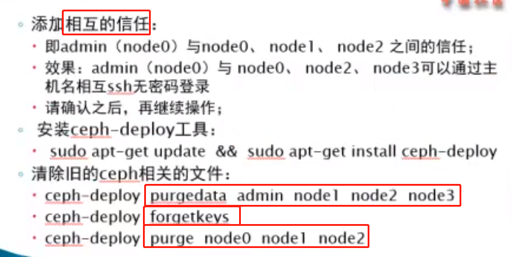
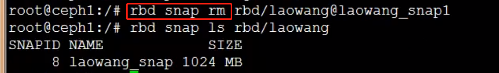
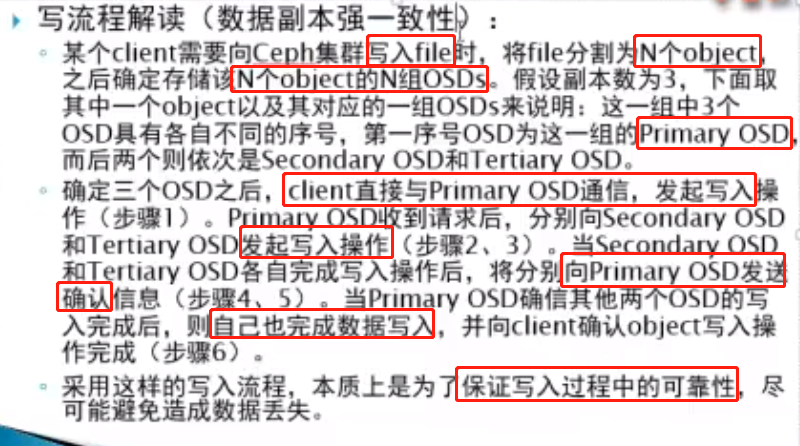
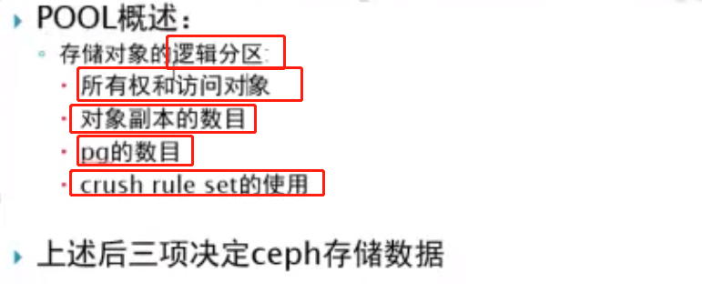
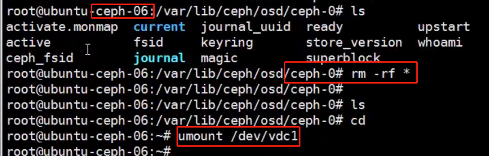
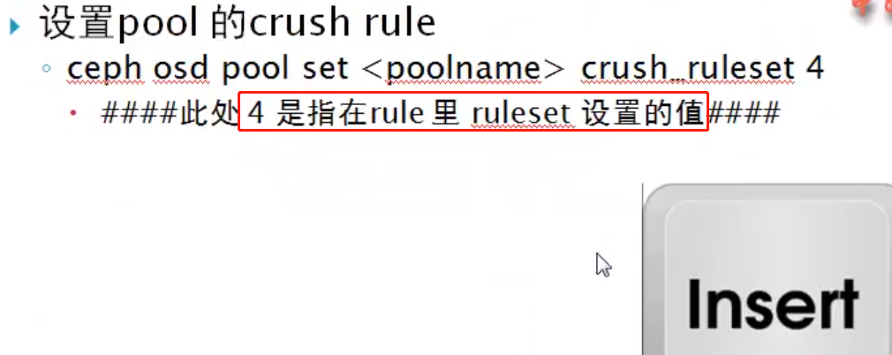
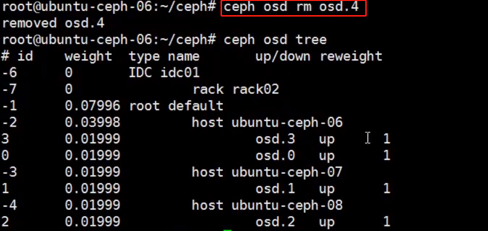
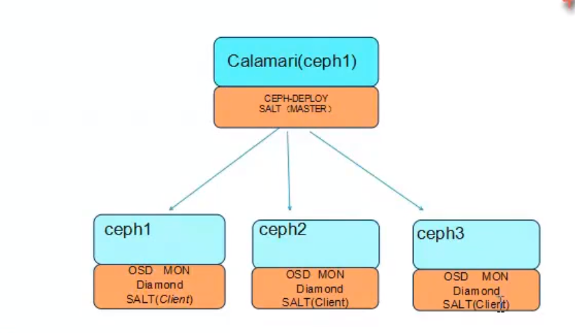
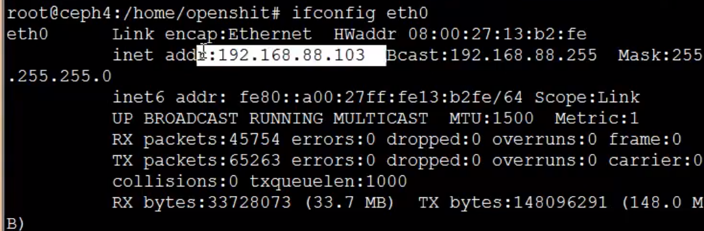
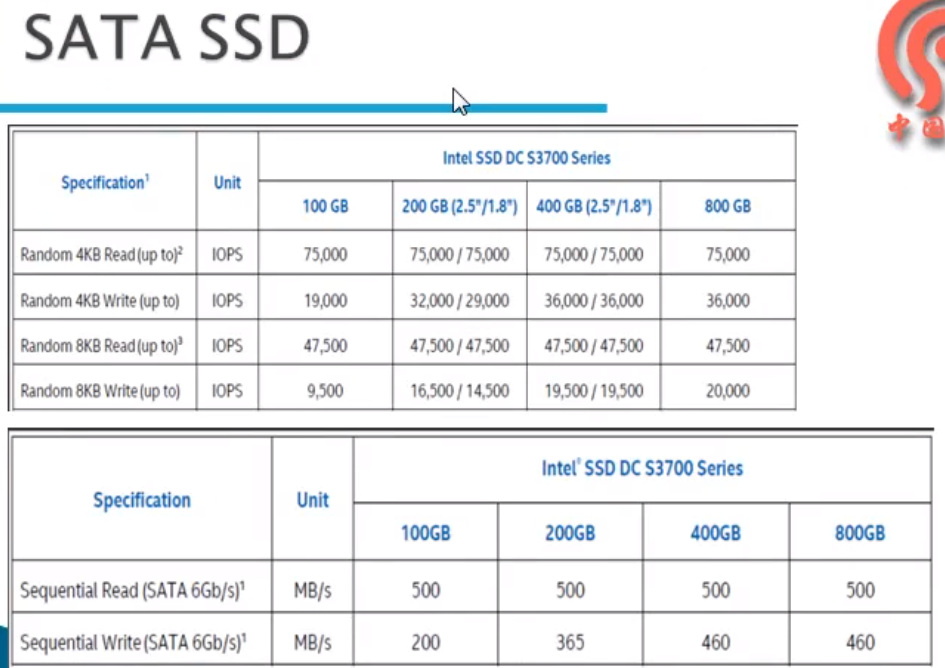

## ceph 学习笔记

### Ceph概况


### Ceph 集群安装





### Ceph 存储提供


```
对象存储：使用 Object Gateway（例如 Rados Gateway）
块存储：Rados Block Device（RBD）
文件存储： Ceph Filesystem （ceph-fs）
```


```
精简配置：意思是我创建了1T的存储空间，我不会立即把这个存储空间分配给你，而是分配给你需要的空间的大小
动态扩容：支持动态的扩容和缩容块设备
```


### Ceph 存储与传统的存储的对比


```
DAS：服务器的本地硬盘存储，磁盘利用率低，不易扩容
SAN：存储区域网络，需要光纤交换机的支持，不是简单的 TCP/IP 协议，成本高
NAS：网络附加存储，直接通过 以太网 进行连接，入 NFS
```

### Ceph块设备监理


```
id=admin  这里是最高的权限，可以设置不同的用户拥有 不同的访问ceph块的权限，避免用户删除不属于自己的块设备
```


### 快照和克隆


```
利用之前创建的快照进行回滚的时候，需要先将快照的 块文件的目录进行 umount
```


```
列出image 下面的 快照
```



```
删除快照
```


```
purge 是清楚 image 下面的所有的快照
```


```
保护快照就是不允许对快照进行删除
```


```
保护快照必须使用 format为2格式的块设备
```


```
只能对 保护的快照进行clone
```


```
protect 的目的是保护快照不被删除
```


### 安装RADOS Gateway


```
使用 ceph auth list 查看授权的密钥环
```


```
上面的配置是因为 使用的key都是 ceph3主机的 密钥环
```


### 创建S3和Swift用户


```
使用 radosgw-admin user info 查看用户的 信息，access_key 等信息
```

### 测试S3接口


```
使用 s3cmd --configure 进行配置的保存的配置文件的位置
```


```
列出的 bucket 的目录
```


### Ceph架构及组件


```
librados: 应用直接通过ceph 提供的 lib库进行 ceph rados 的访问
radosgw: 通过REST 的api进行访问（对象存储）
RBD：提供块设备的存储
Cephfs: 使用 posix 的文件系统接口进行访问
```


### Ceph RADOS 的设计及原理


```
File 在存入到 ceph中的时候，首先对文件进行 切分限定块大小的 一个个的 对象Object，生成对应的 oid；
通过 对oid 进行hash计算，得到这个 object 分配到哪组PG（每个PG有多个 映射的OSD，两个就是两个副本）；
CRUSH(pgid) 会得到一组的PG
```


### 数据的写入流程




### 数据的读取流程


### Ceph 的 Crush算法


### POOL的概述




```
有的PG 含有两个OSD，有的含有三个的OSD
pool 是相当于OSD 上存储数据的 隔离 
```

### CrushMap的概述


```
导出crushmap
```


### OSD的Journal


```
最下面的官方提供的 吞吐量太小了
```


### Ceph集群的容灾


### Ceph的集群监控和故障排除


```
up ：一个节点上添加磁盘
out： 添加新的节点
```


```
查看OSD所有的配置参数
```


```
查看 mon 的配置
```

### 添加MON节点


### 删除OSD


```
osd.4是在 ceph-06 的机器上的
```


```
OSD 的认证信息
```


### 删除MON


### 升级集群


### 更换硬盘


```
不手动 osd out ，集群在300s之后也会自动的进行 out
第三步 是： ceph osd crush remove osd.x 从 crush map 中删除信息
```





### Ceph数据写入流程


```
数据primary 选择存储到 ssd的磁盘上，其他的副本 选择默认的 default的存储树
```


```
bucket 层级类型及关系
```


```
default 只有 host类型的
```


```
root 包含 host
```


```
自定义的 idc01 的crush规则
```




```
查看定义的两个 crush rule 规则
```


```
查看 ceph 的pool
```


```
设置 ceph 的规则
```


```
删除 bucket 使用 ceph osd crush remove rack01
```


```
删除bucket
```


```
移动 bucket 到其他的 bucket 下面
```


```
移动 osd.4 到ubuntu-ceph-06 下面
```




### Ceph集群的监控


```
正常的情况下 上面的两个的命令显示的内容是一样的，只有集群出现故障的时候，detail 才会出现更详细的信息
```


```
222 pgs degraded: 222 个pgs 是降级了
221 pgs stuck unclean： 221 pgs stuck 卡住了，没有清理
recovery 37/258： 需要恢复258 个对象 恢复了 37个，恢复的比例
1/4 in osds are down: 4个 osd 中1个是down 的
```


```
osd.0 is down since epoch 251: 在 版本号为251 的时候 osd.0 是down 的
```

### 监视集群的事件


 


```
%USED： 显示的是占用整个集群空间的百分比
```


```
cluster： 后面的为集群的唯一的表示id， fsid
monmap e3: e3为集群的版本号
	quorum 0 ubuntu-ceph-06 投票数为0的
osdmap e166: osd的版本号
pgmap v5936: pgmap 的版本号
```

### MON的功能


```
MON 还可以对客户端进行权限的认证
```

**添加MON节点**


```
存在配置文件的话 使用--overwrite-conf 进行覆盖
```


```
这个id 为主机名
```


```
停止了一个MON后，只剩一个的 法定票数
```


```
这个报错 是 MON出现了问题
```


```
MON 的Leader漂移到了其他的节点 
```


```
epoch 13: monmap 版本号
last_changed: 上次的版本号变更的时间
0： 1： 2： MON 的唯一标识
```


### 监控OSD


```
一个OSD相当于一个硬盘+osd的守护进程
```


```
reweight: 进行osd 的权重的 reweight，比如 整体集群的使用率为 80%，但是 osd.1的使用率已经达到了 90 %，可以%80/90% 来进行 osd.1 的权重的调整
```


```
设置不想使 OSD 进程结束
```


```
unset 标志
```


```
集群中所有的pool的信息
```


```
up_from: 启动osd的时候版本为 324
down_from： down 的时候版本为321
```

### 监控PG


```
pool 承载的 PG的数据
一个pool 的PG 是对应所有的 osd的

三台主机对应的PG数是 均匀分布的，都是464个PG
```


### Ceph Debug


```
使用 Django 开发
```





### Ceph内部原理以及Crush设计


```
描述数据的数据为 元数据
```


### Ceph的一致性hash


```
普通的hash算法(Hash(x) % N) 解决不了，新节点加入和离开的数据重新分布迁移的问题, 因为N的变化，之前通过hash(x)计算得到的 数据存储位置，需要重新的计算

一致性hash： 虚拟了一个hash环，N0节点存储的数据分区在[N0, N1] 之间，当如果N0 节点down之后， 数据分布[N1, N2] 分区的数据不会发生改变，而 N2负责的数据 改变为[N2,N0], 发生分区的合并，避免过多的数据迁移

一致性hash的问题，节点的数据可能不太均匀
```


**hash算法**


**一致性hash**


```
虚拟出来了个hash环， 首先将节点 通过hash计算 映射到 hash环上
存储数据的时候，使用相同的hash算法，进行计算出 数据在 hash环上的位置，然后再顺时针查找到的第一个节点就是 这个文件存储的节点，
当添加新的节点D的时候，C->D 之间的数据原本存储在A机器，现在 的计算结果应该存储在D上，由此导致缓存失效，而D->C 这部分区域的数据存储是可以正确的找到相应的存储位置的
```

**一致性hash的 hash倾斜问题**


```
解决hash倾斜的问题，通过添加更多的节点就可以是 数据尽可能的分布；
解决的办法就是 每一个物理节点，虚拟出一批的虚拟节点，把这些虚拟节点也映射到 hash环上，从而使节点的数量增加；
数据的存储的过程，映射到虚拟节点的数据，存储到相应的物理节点上
```

### CRUSH算法


```
PG 可以看做是 一致性hash的虚拟节点的功能，但是这个 虚拟节点是固定不变的，避免数据分布不均的问题
```


```
磁盘的容量不同，则映射到 PG的权重相应的也不一样
```


### PG(Placement Groups)


```
cp 是osd pool的名字
```

**PG和PGP的区别**

- PG是指定存储池存储对象的目录有多少个，PGP是存储池PG的OSD分布组合个数

- PG的增加会引起PG内的数据进行分裂，分裂到相同的OSD上新生成的PG当中

- PGP的增加会引起部分PG的分布进行变化，但是不会引起PG内对象的变动

  参考博文：https://www.cnblogs.com/wangmo/p/11393544.html

  


```
PG 在 同 pool下只增不减，目的是 避免PG的减少，数据乱掉，映射规则变化
```


```
[1,2,0] 是osd的活跃组
```


```
cp  是 osd pool
```


### filejournal的意义


### Ceph与OpenStack的基础


**setting.conf 文件配置**




```
走的ceph 的网络，方便与侧胖进行集成
```


```
走的外网，连接互联网
```


### 命令行创建虚拟机实例


```
虚拟机的规格
使用 --flavor 1 指定虚拟机的规格的编号
```

### Ceph与OpenStack的集成


```
512 是设定的 PG数量
```


```
cinder 快存储
```


### Ceph性能的优化

#### 硬件选型优化


```
IDRAC/ILO 远程隔离卡
```


```
新的存储架构 IB
传统的架构所有的IO 都是通过 PCI 总线进行的
```


```
减少数据在 用户空间和内核空间的来回拷贝，节省CPU的性能
```


```
这个库 主要来实现 对底层的 RDMA的功能
```





#### 系统优化


```
lscpu 查看NUMA
```


```
两个node  都有自己的内存区域， 16核心的CPU 访问不同的 node 区域内存
cpu 跨区访问内存会影响性能
```


```
关闭的 NUMA ，CPU访问都在一个node上
```


```
引导系统的 grub.cfg 的引导参数配置中，设定 numa=off 进行关闭
```


```
把 进程 绑定到 某个CPU运行
```


```
virtio scsi：虚拟磁盘的多队列支持
```


#### Ceph的参数的优化


```
使用 ceph daemon osd.0 config show 查看ceph系统的配置参数
```


```
RAID 0 是典型的条带（stripe）设计
```


```
HDD+Flashcache： 通过 Flashcache 把SSD的硬盘指定给HDD，作为其缓存
RBD+Flashcache: 通过 Flashcache 把SSD的硬盘指定给RBD，作为其缓存
SSD+Journal: ceph的日志使用 SSD存储
HDD+SSD: 可以通过 crushmap 设置策略进行混合使用

```


```
通过设置 Primary-Affinity 来设置SSD成为PG的 primary
```


### 性能测试


```
-b: 指定 块的大小， 不指定的话 默认每个块为4M
60 为测试时间 60s
-t 32: 并发线程数 32
--no-cleanup：写的测试数据是否会被清除
```


```
对ceph集群做写入的测试
```


```
查看写入的数据
```


```
seq: 进行数据的顺序读取的测试
```


```
rand： 进行数据的随机的读的测试
```


```
删除测试的数据，指定前缀的信息
```


## 老男孩Ceph

### Ceph概述


```
OpenStack 的虚拟机的创建过程：
	nova 通过调用libvirtd, 调用 qemu（qemu 主要虚拟 虚拟机的硬件设备，而kvm主要是虚拟cpu和内存相关的）创建完成虚拟机，qemu 调用librbd(librados)进而访问ceph的存储

云盘的创建：
	OpenStack的 cinder 调用存储后端（volume backend）到 ceph 创建出云盘，qemu创建的虚拟机挂在云盘进行使用
```

### Ceph逻辑结构


```
每一块磁盘对应一个的 osd daemon，一个PG管理多个osd

acting set: 在ceph中就是osd一个列表，这个列表存放的是 三个osd的编号，排在第一位的就是 组长（primary osd），组长负责数据的读以及数据的写
```


```
一个Object 只能对应一个PG
一个PG 可以对应多个的Object
```


```
ceph中的 存储池，就相当于 LVM中的 VG的概念（PV的集合）

客户端想要使用ceph的存储的空间，需要手动的建立一个存储池
	ceph osd pool create volume_poll_name 128 (128 指定存储池里面包含的pg树)
```


```
客户端 VM 使用块设备，相当于在 创建的存储池划分一个区域，这个区域就是 image
这个pool 可以动态的进行扩容，缩容
```


```
pool id & object id --两次hash--> pg id ----crushmap--> osd ---> disk
客户端在使用 librbd 进行数据的存储的时候：
	需要知道 pool id和 object id
		首先对 object id做了一次的hash然后对总的pg数做取模计算 得到一个值，然后再针对pool ID做一个hash 得到另一个值，最后得到的一个值 比如：4.12 则为 pg 的id
	通过 crush算法根据 pg id 做 pg 到osd的映射
```

### Ceph 网络架构


```
集群网络（北向网络）最好使用 万兆网络：
	1. mon集群的通信
	2. osd汇报状态给mon
	3. 连接所有的ceph 节点，和客户端进行通信

复制网络（东西网络） 万兆网络:
	osd 节点的数据复制的操作，PG内有一个osd down了之后，拷贝数据初拥的网络
```

### PG的状态

```
ceph -s 能够非常直观看到pg的状态，pg是数据存储的重要单位，在使用ceph的时候，pg会经常发生状态的变化，参考下面例子。` `1. 当创建 pool 的时候，将会创建相应的 pg，那么可以看到pg creating状态。``2. 当部分 pg 创建成功后，将会发现 pg 会进入到 peering 状态。``3. 当所有 pg peering 完成后，将可见到状态变成 active+clean。
```

常见的PG状态：

```
常见的pg状态：
 <strong>creating ：创建中</strong>
 down ：PG处于失效状态，PG处于离线状态
 
 repair （修复）：PG正在被检查，被发现的任何不一致都将尽可能的被修复。
 
 peering（等待互联）：
1. 当ceph peering pg, ceph 将会把 pg 副本协定导入 osd, 当 ceph 完成 peering, 意味着 osd 同意当前 PG 状态, 并允许写入
2. PG处于 peering 过程中, peering 由主 osd 发起的使存放 PG 副本的所有 OSD 就 PG 的所有对象和元素数据的状态达成一致的过程,  peering 过程完成后, 主 OSD 就可以接受客户端写请求.
 
 active：
1. 当 ceph 完成 peering 过程, pg 将会变成 active, active 状态意味着 pg 中的数据变得可用, 主 pg 将可执行读写操作
2. PG 是活动的, 意味着 PG 中的数据可以被读写, 对该 PG 的操作请求都讲会被处理.
 
 clean: 干净态。PG当前不存在待修复的对象， Acting Set和Up Set内容一致，并且大小等于存储池的副本数
 
 
 replay（重做）：某OSD崩溃后，PG正在等待客户端重新发起操作。
 
degraded（降级）：
1. 当客户端写对象到主 osd, 主 OSD 会把数据写复制到对应复制 OSD, 在主 OSD 把对象写入存储后, PG 会显示为 degraded 状态, 直到主 osd 从复制 OSD 中接收到创建副本对象完成信息
2. PG 处于 active+degraded 原因是因为 OSD 是处于活跃, 但并没有完成所有的对象副本写入, 假如 OSD DOWN, CEPH 标记每个 PG 分配到这个相关 OSD 的
状态为 degraded, 当 OSD 重新上线, OSD 将会重新恢复,
3. 假如 OSD DOWN 并且 degraded 状态持续, CEPH 会标记 DOWN OSD, 并会对集群迁移相关 OSD 的数据, 对应时间由 mon osd down out interval 参数决定
4. PG 可以被北极为 degraded, 因为 ceph 在对应 PG 中无法找到一个或者多个相关的对象, 你不可以读写 unfound 对象, 你仍然可以访问标记为 degraded PG 的其他数据
5. PG 中部分对象的副本数量未达到规定的数量
 
inconsistent（不一致）：PG副本出现不一致, 对象大小不正确或者恢复借宿后某个副本出现对象丢失现象
 
recoverying（恢复中）：
ceph 设备故障容忍在一定范围的软件与硬件问题, 当 OSD 变 DOWN, 那么包含该 OSD 的 PG 副本都会有问题, 当 OSD 恢复, OSD 对应的 PG 将会更新
并反映出当前状态, 在一段时间周期后, OSD 将会恢复 recoverying 状态
recovery 并非永远都有效, 因为硬件故障可能会导致多个 OSD 故障, 例如, 网络交换机故障, 可以导致集群中的多个主机及主机包含的 OSD 故障
当网络恢复之后, 每个 OSD 都必须执行恢复
 
 
back filling（回填）：
当新 OSD 加入集群, CRUSH 将会为集群新添加的 OSD 重新分配 PG, 强制新的 OSD 接受重新分配的 PG 并把一定数量的负载转移到新 OSD 中,back filling OSD 会在后台处理, 当 backfilling 完成, 新的 OSD 完成后, 将开始对请求进行服务
 
在 backfill 操作期间, 你可以看到多种状态,
backfill_wait 表示 backfill 操作挂起, 但 backfill 操作还没有开始 ( PG 正在等待开始回填操作 )
backfill 表示 backfill 操作正在执行
backfill_too_full 表示在请求 backfill 操作, 由于存储能力问题, 但不可以完成,
ceph 提供设定管理装载重新分配 PG 关联到新的 OSD
osd_max_backfills 设定最大数量并发 backfills 到一个 OSD, 默认 10
osd backfill full ratio  当 osd 达到负载, 允许 OSD 拒绝 backfill 请求, 默认 85%,
假如 OSD 拒绝 backfill 请求,  osd backfill retry interval 将会生效, 默认 10 秒后重试
osd backfill scan min ,  osd backfill scan max 管理检测时间间隔
一个新 OSD 加入集群后, CRUSH 会把集群先有的一部分 PG 分配给他, 该过程称为回填, 回填进程完成后, 新 OSD 准备好了就可以对外提供服务。
 
remapped（重映射）：
当 pg 改变, 数据从旧的 osd 迁移到新的 osd, 新的主 osd 应该请求将会花费一段时间, 在这段时间内, 将会继续向旧主 osd 请求服务, 直到
PG 迁移完成, 当数据迁移完成,  mapping 将会使用新的 OSD 响应主 OSD 服务
 
当 PG 的 action set 变化后, 数据将会从旧 acting set 迁移到新 action set, 新主 OSD 需要过一段时间后才能提供服务, 因此它会让老的主 OSD 继续提供服务, 知道 PG 迁移完成, 数据迁移完成后, PG map 将会使用新 acting set 中的主 OSD
 
例如：
[root@ ~]# ceph osd map volumes rbd_id.volume-1421625f-a9a2-41d0-8023-4cec54b33a57
osdmap e5276 pool 'volumes' (1) object 'rbd_id.volume-1421625f-a9a2-41d0-8023-4cec54b33a57' -> pg 1.2cdd8028 (1.28) -> up ([32,26,41], p32) acting ([32,26,41], p32)
 
stale（旧）：
当 ceph 使用 heartbeat 确认主机与进程是否运行,  ceph osd daemon 可能由于网络临时故障, 获得一个卡住状态 (stuck state) 没有得到心跳回应
默认, osd daemon 会每 0.5 秒报告 PG, up 状态, 启动与故障分析,
假如 PG 中主 OSD 因为故障没有回应 monitor 或者其他 OSD 报告 主 osd down, 那么 monitor 将会标记 PG stale,
当你重启集群, 通常会看到 stale 状态, 直到 peering 处理完成,
在集群运行一段时候, 看到 stale 状态, 表示主 osd PG DOWN 或者没有主 osd 没有报告 PG 信息到 monitor 中
PG 处于未知状态, monitors 在 PG map 改变后还没有收到过 PG 的更新, 启用一个集群后, 常常会看到主 peering 过程结束前 PG 处于该状态。
 
scrubbing（清理中）：
PG 在做不一至性校验
```

```
有问题的PG：``inactive ：PG 很长时间没有显示为 acitve 状态, (不可执行读写请求), PG 不可以执行读写, 因为等待 OSD 更新数据到最新的备份状态` `unclean：PG 很长时间都不是 clean 状态 (不可以完成之前恢复的操作), PG 包含对象没有完成相应的复制副本数量, 通常都要执行恢复操作。` `stale：PG 状态很长时间没有被 ceph-osd 更新过, 标识存储在该 GP 中的节点显示为 DOWN, PG 处于 unknown 状态, 因为 OSD 没有报告 monitor 由 mon osd report timeout 定义超时时间
```

ceph pg 常见问题处理：

案例1:

```
1. 检查集群状态发现有pg  inconsistent
通过ceph health detail查看具体的PG id。
 
$ ceph health detail
HEALTH_ERR 1 scrub errors; Possible data damage: 1 pg inconsistent
OSD_SCRUB_ERRORS 1 scrub errors
PG_DAMAGED Possible data damage: 1 pg inconsistent
    pg 3.0 is active+clean+inconsistent, acting [34,23,1]
 
通过上面输出可以看到当前PG3.0处于inconsistent，并且它的三副本分别在osd.34,osd.23,osd.1。
 
2. 修复PG 3.0
$ ceph pg repair 3.0
instructing pg 3.0 on osd.34 to repair
 
#查看集群监控状态
$ ceph health detail
HEALTH_ERR 1 scrub errors; Possible data damage: 1 pg inconsistent, 1 pg repair
OSD_SCRUB_ERRORS 1 scrub errors
PG_DAMAGED Possible data damage: 1 pg inconsistent, 1 pg repair
    pg 3.0 is active+clean+scrubbing+deep+inconsistent+repair, acting [34,23,1]
 
#集群监控状态已恢复正常
$ ceph health detail
HEALTH_OK
 
3. 根据以往经验，pg出现inconsistent很有可能是对应的osd磁盘上有逻辑坏道，可以去查看osd [34,23,1]的磁盘，查看对应节点上的dmesg日志。
dimes -T |grep -I err
```

案例2: osd挂了

```
当osd短暂挂掉的时候，因为集群内还存在着两个副本，是可以正常写入的，但是 osd.34 内的数据并没有得到更新，过了一会osd.34上线了，这个时候osd.34的数据是陈旧的，就通过其他的OSD 向 osd.34 进行数据的恢复，使其数据为最新的，而这个恢复的过程中，PG的状态会从inconsistent ->recover -> clean,最终恢复正常。
这是集群故障自愈一种场景。
```

### Ceph逻辑概念


```
backfilling: 新的osd加入到ceph中，在做一个全量的数据拷贝
recovery： osd之前故障后，又恢复过来，做增量的数据拷贝
```


```
osd daemon 默认 没2s 汇报自己的状态给mon（同时监控组内的其他的osd的状态）
如果osd在300s之内都没有汇报自己的状态，则ceph会把这个osd剔除集群OUT状态
```

### Ceph的缓存机制


```
客户端的缓存机制
```

