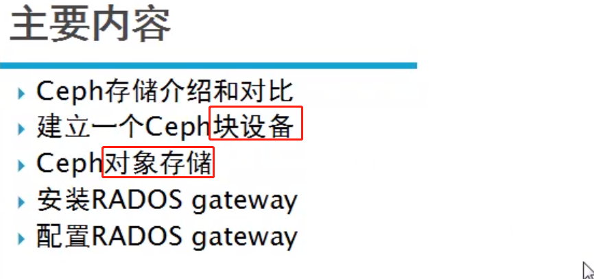
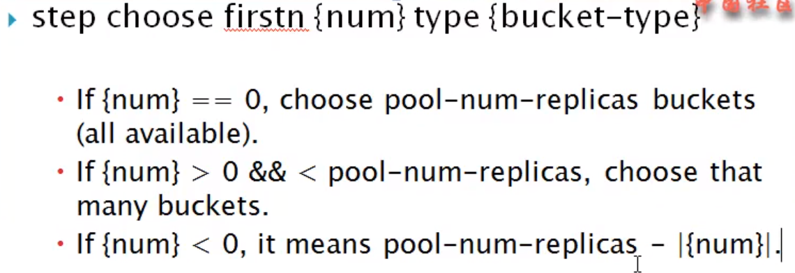
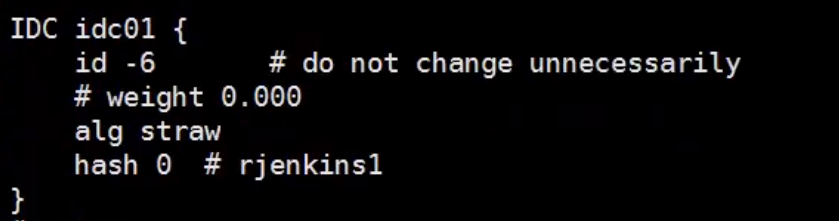
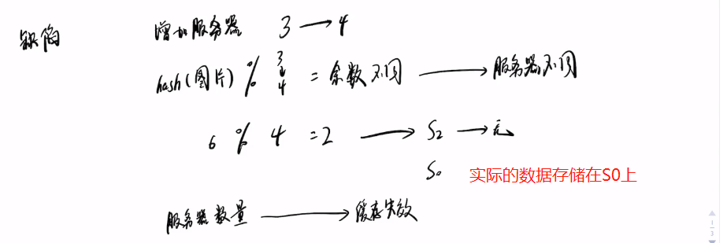
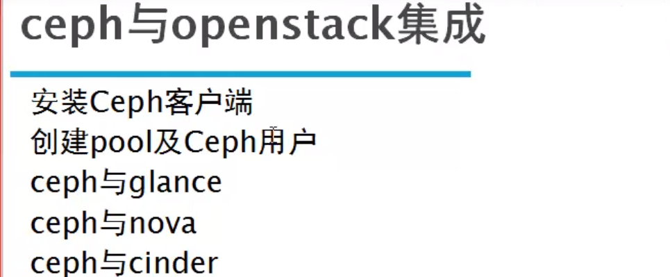
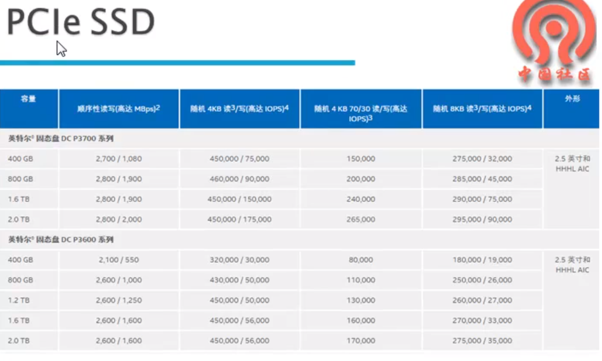
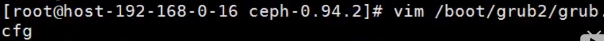

## ceph 学习笔记

### Ceph概况


### Ceph 集群安装


### Ceph 存储提供




```
对象存储：使用 Object Gateway（例如 Rados Gateway）
块存储：Rados Block Device（RBD）
文件存储： Ceph Filesystem （ceph-fs）
```


```
精简配置：意思是我创建了1T的存储空间，我不会立即把这个存储空间分配给你，而是分配给你需要的空间的大小
动态扩容：支持动态的扩容和缩容块设备
```


### Ceph 存储与传统的存储的对比


```
DAS：服务器的本地硬盘存储，磁盘利用率低，不易扩容
SAN：存储区域网络，需要光纤交换机的支持，不是简单的 TCP/IP 协议，成本高
NAS：网络附加存储，直接通过 以太网 进行连接，入 NFS
```

### Ceph块设备监理


```
id=admin  这里是最高的权限，可以设置不同的用户拥有 不同的访问ceph块的权限，避免用户删除不属于自己的块设备
```


### 快照和克隆


```
利用之前创建的快照进行回滚的时候，需要先将快照的 块文件的目录进行 umount
```


```
列出image 下面的 快照
```


```
删除快照
```


```
purge 是清楚 image 下面的所有的快照
```


```
保护快照就是不允许对快照进行删除
```


```
保护快照必须使用 format为2格式的块设备
```


```
只能对 保护的快照进行clone
```


```
protect 的目的是保护快照不被删除
```


### 安装RADOS Gateway


```
使用 ceph auth list 查看授权的密钥环
```


```
上面的配置是因为 使用的key都是 ceph3主机的 密钥环
```


### 创建S3和Swift用户


```
使用 radosgw-admin user info 查看用户的 信息，access_key 等信息
```

### 测试S3接口


```
使用 s3cmd --configure 进行配置的保存的配置文件的位置
```


```
列出的 bucket 的目录
```


### Ceph架构及组件


```
librados: 应用直接通过ceph 提供的 lib库进行 ceph rados 的访问
radosgw: 通过REST 的api进行访问（对象存储）
RBD：提供块设备的存储
Cephfs: 使用 posix 的文件系统接口进行访问
```


### Ceph RADOS 的设计及原理


```
File 在存入到 ceph中的时候，首先对文件进行 切分限定块大小的 一个个的 对象Object，生成对应的 oid；
通过 对oid 进行hash计算，得到这个 object 分配到哪组PG（每个PG有多个 映射的OSD，两个就是两个副本）；
CRUSH(pgid) 会得到一组的PG
```


### 数据的写入流程


### 数据的读取流程


### Ceph 的 Crush算法


### POOL的概述


```
有的PG 含有两个OSD，有的含有三个的OSD
pool 是相当于OSD 上存储数据的 隔离 
```

### CrushMap的概述


```
导出crushmap
```


### OSD的Journal


```
最下面的官方提供的 吞吐量太小了
```


### Ceph集群的容灾


### Ceph的集群监控和故障排除


```
up ：一个节点上添加磁盘
out： 添加新的节点
```


```
查看OSD所有的配置参数
```


```
查看 mon 的配置
```

### 添加MON节点


### 删除OSD


```
osd.4是在 ceph-06 的机器上的
```


```
OSD 的认证信息
```


### 删除MON


### 升级集群


### 更换硬盘


```
不手动 osd out ，集群在300s之后也会自动的进行 out
第三步 是： ceph osd crush remove osd.x 从 crush map 中删除信息
```


### Ceph数据写入流程





```
数据primary 选择存储到 ssd的磁盘上，其他的副本 选择默认的 default的存储树
```


```
bucket 层级类型及关系
```


```
default 只有 host类型的
```


```
root 包含 host
```




```
自定义的 idc01 的crush规则
```


```
查看定义的两个 crush rule 规则
```


```
查看 ceph 的pool
```


```
设置 ceph 的规则
```


```
删除 bucket 使用 ceph osd crush remove rack01
```


```
删除bucket
```


```
移动 bucket 到其他的 bucket 下面
```


```
移动 osd.4 到ubuntu-ceph-06 下面
```


### Ceph集群的监控


```
正常的情况下 上面的两个的命令显示的内容是一样的，只有集群出现故障的时候，detail 才会出现更详细的信息
```


```
222 pgs degraded: 222 个pgs 是降级了
221 pgs stuck unclean： 221 pgs stuck 卡住了，没有清理
recovery 37/258： 需要恢复258 个对象 恢复了 37个，恢复的比例
1/4 in osds are down: 4个 osd 中1个是down 的
```


```
osd.0 is down since epoch 251: 在 版本号为251 的时候 osd.0 是down 的
```

### 监视集群的事件


 


```
%USED： 显示的是占用整个集群空间的百分比
```


```
cluster： 后面的为集群的唯一的表示id， fsid
monmap e3: e3为集群的版本号
	quorum 0 ubuntu-ceph-06 投票数为0的
osdmap e166: osd的版本号
pgmap v5936: pgmap 的版本号
```

### MON的功能


```
MON 还可以对客户端进行权限的认证
```

**添加MON节点**


```
存在配置文件的话 使用--overwrite-conf 进行覆盖
```


```
这个id 为主机名
```


```
停止了一个MON后，只剩一个的 法定票数
```


```
这个报错 是 MON出现了问题
```


```
MON 的Leader漂移到了其他的节点 
```


```
epoch 13: monmap 版本号
last_changed: 上次的版本号变更的时间
0： 1： 2： MON 的唯一标识
```


### 监控OSD


```
一个OSD相当于一个硬盘+osd的守护进程
```


```
reweight: 进行osd 的权重的 reweight，比如 整体集群的使用率为 80%，但是 osd.1的使用率已经达到了 90 %，可以%80/90% 来进行 osd.1 的权重的调整
```


```
设置不想使 OSD 进程结束
```


```
unset 标志
```


```
集群中所有的pool的信息
```


```
up_from: 启动osd的时候版本为 324
down_from： down 的时候版本为321
```

### 监控PG


```
pool 承载的 PG的数据
一个pool 的PG 是对应所有的 osd的

三台主机对应的PG数是 均匀分布的，都是464个PG
```


### Ceph Debug


```
使用 Django 开发
```


### Ceph内部原理以及Crush设计


```
描述数据的数据为 元数据
```


### Ceph的一致性hash


```
普通的hash算法(Hash(x) % N) 解决不了，新节点加入和离开的数据重新分布迁移的问题, 因为N的变化，之前通过hash(x)计算得到的 数据存储位置，需要重新的计算

一致性hash： 虚拟了一个hash环，N0节点存储的数据分区在[N0, N1] 之间，当如果N0 节点down之后， 数据分布[N1, N2] 分区的数据不会发生改变，而 N2负责的数据 改变为[N2,N0], 发生分区的合并，避免过多的数据迁移

一致性hash的问题，节点的数据可能不太均匀
```


**hash算法**




**一致性hash**


```
虚拟出来了个hash环， 首先将节点 通过hash计算 映射到 hash环上
存储数据的时候，使用相同的hash算法，进行计算出 数据在 hash环上的位置，然后再顺时针查找到的第一个节点就是 这个文件存储的节点，
当添加新的节点D的时候，C->D 之间的数据原本存储在A机器，现在 的计算结果应该存储在D上，由此导致缓存失效，而D->C 这部分区域的数据存储是可以正确的找到相应的存储位置的
```

**一致性hash的 hash倾斜问题**


```
解决hash倾斜的问题，通过添加更多的节点就可以是 数据尽可能的分布；
解决的办法就是 每一个物理节点，虚拟出一批的虚拟节点，把这些虚拟节点也映射到 hash环上，从而使节点的数量增加；
数据的存储的过程，映射到虚拟节点的数据，存储到相应的物理节点上
```

### CRUSH算法


```
PG 可以看做是 一致性hash的虚拟节点的功能，但是这个 虚拟节点是固定不变的，避免数据分布不均的问题
```


```
磁盘的容量不同，则映射到 PG的权重相应的也不一样
```


### PG(Placement Groups)


```
cp 是osd pool的名字
```

**PG和PGP的区别**

- PG是指定存储池存储对象的目录有多少个，PGP是存储池PG的OSD分布组合个数

- PG的增加会引起PG内的数据进行分裂，分裂到相同的OSD上新生成的PG当中

- PGP的增加会引起部分PG的分布进行变化，但是不会引起PG内对象的变动

  参考博文：https://www.cnblogs.com/wangmo/p/11393544.html

  


```
PG 在 同 pool下只增不减，目的是 避免PG的减少，数据乱掉，映射规则变化
```


```
[1,2,0] 是osd的活跃组
```


```
cp  是 osd pool
```


### filejournal的意义


### Ceph与OpenStack的基础


**setting.conf 文件配置**


```
走的ceph 的网络，方便与侧胖进行集成
```


```
走的外网，连接互联网
```


### 命令行创建虚拟机实例


```
虚拟机的规格
使用 --flavor 1 指定虚拟机的规格的编号
```

### Ceph与OpenStack的集成




```
512 是设定的 PG数量
```


```
cinder 快存储
```


### Ceph性能的优化

#### 硬件选型优化


```
IDRAC/ILO 远程隔离卡
```


```
新的存储架构 IB
传统的架构所有的IO 都是通过 PCI 总线进行的
```


```
减少数据在 用户空间和内核空间的来回拷贝，节省CPU的性能
```


```
这个库 主要来实现 对底层的 RDMA的功能
```





#### 系统优化


```
lscpu 查看NUMA
```


```
两个node  都有自己的内存区域， 16核心的CPU 访问不同的 node 区域内存
cpu 跨区访问内存会影响性能
```


```
关闭的 NUMA ，CPU访问都在一个node上
```




```
引导系统的 grub.cfg 的引导参数配置中，设定 numa=off 进行关闭
```


```
把 进程 绑定到 某个CPU运行
```


```
virtio scsi：虚拟磁盘的多队列支持
```


#### Ceph的参数的优化


```
使用 ceph daemon osd.0 config show 查看ceph系统的配置参数
```


```
RAID 0 是典型的条带（stripe）设计
```


```
HDD+Flashcache： 通过 Flashcache 把SSD的硬盘指定给HDD，作为其缓存
RBD+Flashcache: 通过 Flashcache 把SSD的硬盘指定给RBD，作为其缓存
SSD+Journal: ceph的日志使用 SSD存储
HDD+SSD: 可以通过 crushmap 设置策略进行混合使用

```


```
通过设置 Primary-Affinity 来设置SSD成为PG的 primary
```


### 性能测试


```
-b: 指定 块的大小， 不指定的话 默认每个块为4M
60 为测试时间 60s
-t 32: 并发线程数 32
--no-cleanup：写的测试数据是否会被清除
```


```
对ceph集群做写入的测试
```


```
查看写入的数据
```


```
seq: 进行数据的顺序读取的测试
```


```
rand： 进行数据的随机的读的测试
```


```
删除测试的数据，指定前缀的信息
```


