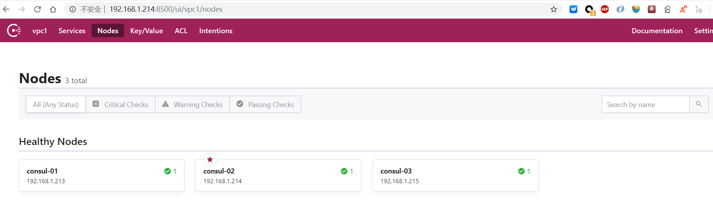
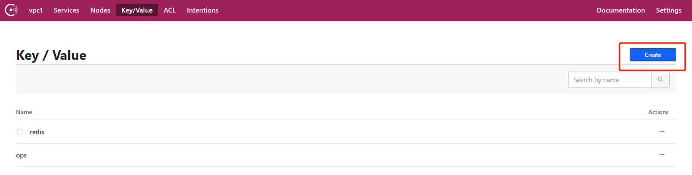
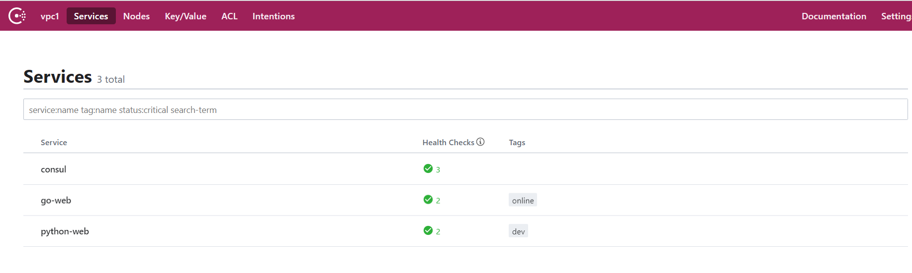

## consul + consul-template + nginx 实践

### consul 集群安装

#### 下载consul

```
wget https://releases.hashicorp.com/consul/1.6.2/consul_1.6.2_linux_amd64.zip
```

#### 创建相应目录

```
cd /usr/local
mkdir -p consul/{bin,data,logs,consul.d}
```

#### 配置consul 服务端配置文件

```
example:
{
    "datacenter":"dc1",
    "primary_datacenter":"dc1",
    "data_dir":"/opt/consul/data/",
    "enable_script_checks":false,
    "bind_addr":"127.0.0.1",
    "node_name":"consul-dev",
    "enable_local_script_checks":true,
    "log_file":"/opt/consul/log/",
    "log_level":"info",
    "log_rotate_bytes":100000000,
    "log_rotate_duration":"24h",
    "encrypt":"krCysDJnrQ8dtA7AbJav8g==",
    "acl":{
        "enabled":true,
        "default_policy":"deny",
        "enable_token_persistence":true,
        "tokens":{
            "master":"cd76a0f7-5535-40cc-8696-073462acc6c7"      
            }
    }
}
```

```
{
    "datacenter": "vpc1",
    "data_dir": "/usr/local/consul/data/",
    "node_name": "consul-01",
    "server": true,
    "ui": true,
    "enable_local_script_checks":true,
    "bind_addr": "192.168.1.213",
    "client_addr": "0.0.0.0",
    "retry_join": ["192.168.1.214","192.168.1.215"],
    "retry_interval": "3s",
    "raft_protocol": 3,
    "enable_debug": false,
    "rejoin_after_leave": true,
    "log_level": "INFO",
    "log_file": "/usr/local/consul/logs/",
    "log_rotate_duration": "24h",
    "enable_syslog": false
}
```

#### 配置consul 为systemd 管理

```
cat /etc/systemd/system/consul.service
[Unit]
Description=Consul
Documentation=https://www.consul.io/

[Service]
#User=huohe
#Group=huohe
ExecStart=/usr/local/consul/bin/consul agent -config-dir=/usr/local/consul/consul.d
ExecReload=/bin/kill -HUP $MAINPID
PrivateTmp=true
Restart=always 
RestartSec=2
LimitNOFILE=65536

[Install]
WantedBy=multi-user.target


systemctl daemon-reload 
systemctl enable consul.service 
```

#### 配置consul为 supervisor 管理

```
[program:consul]
user=huohe
command=/usr/local/consul/bin/consul agent -config-dir=/opt/consul/consul.d
stdout_logfile=/var/log/supervisor/consul.log
redirect_stderr=true
stopasgroup=true
killasgroup=true

priority=1
exitcodes=0
stopwaitsecs=3
startsecs=5
autostart = true
autorestart=true
numprocs=1
```

#### 给consul 配置syslog日志

```
$ mkdir -p /var/log/consul/
$ chown -R syslog.syslog /var/log/consul/
```

```
# 创建日志配置文件
$ cat >/etc/rsyslog.d/consul.conf <<EOF
local0.* /var/log/consul/consul.log
EOF

# 修改默认配置文件中的以下内容
$ vim /etc/rsyslog.d/50-default.conf

# 变更前
*.*;auth,authpriv.none          -/var/log/syslog

# 变更后
*.*;auth,authpriv.none,local0.none          -/var/log/syslog

# 重启rsyslog让配置生效。
$ systemctl restart rsyslog

# 创建日志轮循规则
$ cat >/etc/logrotate.d/consul <<EOF
/var/log/consul/*log {
missingok
compress
notifempty
daily
rotate 5
create 0600 root root
}
EOF
```

```
#[root@node1 consul]# ./bin/consul members -http-addr 192.168.1.213:8500
#client_addr 设置为192.168.1.213 时使用此方式访问
[root@node1 consul]# ./bin/consul members
Node       Address             Status  Type    Build  Protocol  DC    Segment
consul-01  192.168.1.213:8301  alive   server  1.6.2  2         vpc1  <all>
consul-02  192.168.1.214:8301  alive   server  1.6.2  2         vpc1  <all>
consul-03  192.168.1.215:8301  alive   server  1.6.2  2         vpc1  <all>
```

#### 向consul添加KV对

```
[root@node1 consul]# ./bin/consul kv put redis/config/connections 5
Success! Data written to: redis/config/connections
[root@node1 consul]# ./bin/consul kv get redis/config/connections
5

## 查看key 的详细信息
[root@node1 consul]# ./bin/consul kv get -detailed redis/config/connections
CreateIndex      785
Flags            0
Key              redis/config/connections
LockIndex        0
ModifyIndex      785
Session          -
Value            5

## 删除key
[root@node1 consul]# ./bin/consul kv delete redis/config/connections
Success! Deleted key: redis/config/connections
[root@node1 consul]# ./bin/consul kv get redis/config/connections
Error! No key exists at: redis/config/connections
```

#### 查看consul的web界面



```
查看集群节点信息
```


```
刚刚创建的 redis/config/connections key
```



```
通过web UI 界面创建KV
```


#### 向consul 注册服务

##### **启动python-web 服务:**

```
[root@mha-master consul]# nohup python -m SimpleHTTPServer 80 &

[root@mha-master consul]# ps -ef |grep python 
root      1071   950  0 10:55 pts/0    00:00:00 python -m SimpleHTTPServer 80
[root@mha-master consul]# ss -lnpt | grep python
LISTEN     0      5            *:80                       *:*                   users:(("python",pid=1071,fd=3))
[root@mha-master ~]# curl 192.168.1.12 -I
HTTP/1.0 200 OK
Server: SimpleHTTP/0.6 Python/2.7.5
Date: Thu, 28 Nov 2019 03:08:24 GMT
Content-type: text/html; charset=UTF-8
Content-Length: 246
```

##### **启动go-web 服务:**

```
[root@localhost code]# cat myweb.go 
package main

import (
	"fmt"
	"log"
	"net/http"
)

func healthCheck(w http.ResponseWriter, r *http.Request) {
	fmt.Fprintf(w, "Check OK!")
}
func main() {
	http.HandleFunc("/health", healthCheck)
	err := http.ListenAndServe(":8080", nil)
	if err != nil {
		log.Fatal("ListenAndServe: ", err)
	}
}

[root@mha-master myweb]# nohup ./myweb &
[root@mha-master myweb]# ps -ef | grep myweb
root      1052   950  0 10:54 pts/0    00:00:00 ./myweb
root      1386   950  0 11:11 pts/0    00:00:00 grep --color=auto myweb
[root@mha-master myweb]# ss -lnpt | grep 8080
LISTEN     0      128         :::8080                    :::*                   users:(("myweb",pid=1052,fd=3))
```

##### **配置 consul client端配置**

```
## 去掉 "server": true 的配置，即为以client 端的模式启动
[root@mha-master consul.d]# cat consul.json 
{
    "datacenter": "VPC1",
    "data_dir": "/usr/local/consul/data/",
    "node_name": "web-01",		// 节点名称
    "enable_local_script_checks":true,
    "bind_addr": "192.168.1.12",
    "client_addr": "0.0.0.0",
    "retry_join": ["192.168.1.213","192.168.1.214","192.168.1.215"],
    "retry_interval": "3s",
    "raft_protocol": 3,
    "enable_debug": false,
    "rejoin_after_leave": true,
    "log_level": "INFO",
    "log_file": "/usr/local/consul/logs/",
    "log_rotate_duration": "24h",
    "enable_syslog": false
}
```

##### **配置service 配置文件**

```
Python-web:
[root@mha-master consul.d]# cat python-web.json 
{
  "service": {
    "name": "python-web",
    "tags": ["dev"],
    "address": "192.168.1.12",
    "port": 80,
    "checks": [		// 健康检查配置
      {
        "http": "http://192.168.1.12",
        "interval": "5s"
      }
    ]
  }
}
```

```
go-web:
[root@mha-master consul.d]# cat go-web.json 
{
  "service": {
    "name": "go-web",
    "tags": ["online"],
    "address": "192.168.1.12",
    "port": 8080,
    "checks": [		// 健康检查配置
      {
        "http": "http://192.168.1.12:8080/health",
        "interval": "5s"
      }
    ]
  }
}
```

##### **启动consul client的服务**

```
[root@mha-master consul.d]# systemctl start  consul.service
[root@mha-master consul]# ./bin/consul members
Node       Address             Status  Type    Build  Protocol  DC    Segment
consul-01  192.168.1.213:8301  alive   server  1.6.2  2         vpc1  <all>
consul-02  192.168.1.214:8301  alive   server  1.6.2  2         vpc1  <all>
consul-03  192.168.1.215:8301  alive   server  1.6.2  2         vpc1  <all>
web-01     192.168.1.12:8301   alive   client  1.6.2  2         vpc1  <default>

## web-01 节点已经添加成功
```

##### **命令行注册服务**

```
./consul services register -name=web

$ cat web.json
{
  "Service": {
    "Name": "web"
  }
}

$  ./consul services register web.json

## 注销服务
$ ./consul services deregister web.json
$ ./consul services deregister -id web
```

##### **调用API注册服务**

```
## 直接调用/v1/agent/service/register接口注册即可，需要注意的是：http method为PUT提交方式

curl -X PUT -d '{"id": "jetty","name": "jetty","address": "192.168.1.200","port": 8080,"tags": ["dev"],"checks": [{"http": "http://192.168.1.104:9020/health","interval": "5s"}]}' http://192.168.1.100:8500/v1/agent/service/register
```

##### **其他类型的健康检测**

**使用TCP进行服务的检测**

```
[root@mha-master consul.d]# cat mongo.json 
{
  "service": {
    "name": "mongodb",
    "tags": ["online"],
    "address": "192.168.1.12",
    "port": 7080,
    "checks": [
      {
        "id": "mongodb",
        "name": "mongodb port check on 7080",
        "tcp": "192.168.1.12:7080",
        "interval": "5s",
        "timeout": "3s"
      }
    ]
  }
}
```


**使用scripts进行服务检测**

```
{
  "service": {
    "name": "xxx",
    "tags": ["xxx"],
    "address": "xxx",
    "port": xxx,
    "checks": [
       {  
            "id": "mem-util",  
            "name": "Memory utilization",  
            "script": "/usr/local/bin/check_mem.sh",    // script 已经禁用
            "interval": "10s",  
            "timeout": "1s"  
  		}
    ]
  }
}


{
  "service": {
    "name": "usp-ops",
    "tags": ["online"],
    "address": "42.96.133.66",
    "port": 8010,
    "checks": [
      {
         "args": ["/bin/bash", "-c", "/usr/local/consul/scripts/usp-ops.sh"],
         "interval": "5s",
         "timeout": "3s"
      }
    ]
  }
}
```

**使用ttl 进行检测**

```
## 需要服务支持，主动向consul发送自己的健康状况
{
  "service": {
    "name": "xxx",
    "tags": ["xxx"],
    "address": "xxx",
    "port": xxx,
    "checks": [
        {  
          "check": {  
            "id": "web-app",  
            "name": "Web App Status",  
            "notes": "Web app does a curl internally every 10 seconds",  
            "ttl": "30s"  
          }  
        } 
    ]
  }
}
```

#### webUI 查看服务及节点信息





**停止 Python-web 查看服务**

```
[root@mha-master consul]# ps -ef | grep python 
root       885     1  0 May26 ?        00:33:03 /usr/bin/python -Es /usr/sbin/tuned -l -P
root      1517   950  0 11:29 pts/0    00:00:00 python -m SimpleHTTPServer 80
root      1526   950  0 11:32 pts/0    00:00:00 grep --color=auto python
[root@mha-master consul]# kill -9 1517
```


#### consul服务发现

##### 调用API进行服务发现

 https://blog.csdn.net/u010246789/article/details/51871051/ 

```
/v1/catalog/register : Registers a new node, service, or check
/v1/catalog/deregister : Deregisters a node, service, or check
/v1/catalog/datacenters : Lists known datacenters
/v1/catalog/nodes : Lists nodes in a given DC
/v1/catalog/services : Lists services in a given DC
/v1/catalog/service/<service> : Lists the nodes in a given service
/v1/catalog/node/<node> : Lists the services provided by a node
```

```
[root@node1 consul]# curl 192.168.1.213:8500/v1/catalog/datacenters
["vpc1"]

[root@node1 consul]# curl -s 192.168.1.213:8500/v1/catalog/nodes | jq .
[
  {
    "ID": "14539fe6-7ba7-238c-c7cd-7d7da97cf455",
    "Node": "consul-01",
    "Address": "192.168.1.213",
    "Datacenter": "vpc1",
    "TaggedAddresses": {
      "lan": "192.168.1.213",
      "wan": "192.168.1.213"
    },
    "Meta": {
      "consul-network-segment": ""
    },
    "CreateIndex": 6,
    "ModifyIndex": 14
  },
  {
    "ID": "cfd8bd45-d530-0e78-8351-c638ae2016b9",
    "Node": "consul-02",
    "Address": "192.168.1.214",
    "Datacenter": "vpc1",
    "TaggedAddresses": {
      "lan": "192.168.1.214",
      "wan": "192.168.1.214"
    },
    "Meta": {
      "consul-network-segment": ""
    },
    "CreateIndex": 10,
    "ModifyIndex": 37
  },
  {
    "ID": "7f84b303-eb0f-d4ce-1193-05275e4503fd",
    "Node": "consul-03",
    "Address": "192.168.1.215",
    "Datacenter": "vpc1",
    "TaggedAddresses": {
      "lan": "192.168.1.215",
      "wan": "192.168.1.215"
    },
    "Meta": {
      "consul-network-segment": ""
    },
    "CreateIndex": 369,
    "ModifyIndex": 370
  },
  {
    "ID": "2d43ac83-e66f-07c3-66ca-f7adba6606dd",
    "Node": "web-01",
    "Address": "192.168.1.12",
    "Datacenter": "vpc1",
    "TaggedAddresses": {
      "lan": "192.168.1.12",
      "wan": "192.168.1.12"
    },
    "Meta": {
      "consul-network-segment": ""
    },
    "CreateIndex": 8602,
    "ModifyIndex": 8603
  }
]

[root@node1 consul]# curl -s 192.168.1.213:8500/v1/catalog/services | jq .
{
  "consul": [],
  "go-web": [
    "online"
  ],
  "mongodb": [
    "online"
  ],
  "python-web": [
    "dev"
  ]
}

[root@node1 consul]# curl -s 192.168.1.213:8500/v1/catalog/service/mongodb | jq .
[
  {
    "ID": "2d43ac83-e66f-07c3-66ca-f7adba6606dd",
    "Node": "web-01",
    "Address": "192.168.1.12",
    "Datacenter": "vpc1",
    "TaggedAddresses": {
      "lan": "192.168.1.12",
      "wan": "192.168.1.12"
    },
    "NodeMeta": {
      "consul-network-segment": ""
    },
    "ServiceKind": "",
    "ServiceID": "mongodb",
    "ServiceName": "mongodb",
    "ServiceTags": [
      "online"
    ],
    "ServiceAddress": "192.168.1.12",
    "ServiceWeights": {
      "Passing": 1,
      "Warning": 1
    },
    "ServiceMeta": {},
    "ServicePort": 7080,
    "ServiceEnableTagOverride": false,
    "ServiceProxy": {
      "MeshGateway": {},
      "Expose": {}
    },
    "ServiceConnect": {},
    "CreateIndex": 8604,
    "ModifyIndex": 8604
  }
]
```

##### 使用consul内置的DNS服务进行服务发现

```
[root@node1 consul]# dig @192.168.1.213 -p 8600 SRV

; <<>> DiG 9.9.4-RedHat-9.9.4-74.el7_6.1 <<>> @192.168.1.213 -p 8600 SRV
; (1 server found)
;; global options: +cmd
;; Got answer:
;; ->>HEADER<<- opcode: QUERY, status: NOERROR, id: 48678
;; flags: qr aa rd; QUERY: 1, ANSWER: 3, AUTHORITY: 0, ADDITIONAL: 4
;; WARNING: recursion requested but not available

;; OPT PSEUDOSECTION:
; EDNS: version: 0, flags:; udp: 4096
;; QUESTION SECTION:
;.				IN	NS

;; ANSWER SECTION:
consul.			0	IN	NS	consul-02.node.vpc1.consul.
consul.			0	IN	NS	consul-03.node.vpc1.consul.
consul.			0	IN	NS	consul-01.node.vpc1.consul.

;; ADDITIONAL SECTION:
consul-02.node.vpc1.consul. 0	IN	A	192.168.1.214
consul-03.node.vpc1.consul. 0	IN	A	192.168.1.215
consul-01.node.vpc1.consul. 0	IN	A	192.168.1.213

;; Query time: 2 msec
;; SERVER: 192.168.1.213#8600(192.168.1.213)
;; WHEN: Wed Nov 27 17:59:12 CST 2019
;; MSG SIZE  rcvd: 164
```

```
[root@node1 consul]# dig @192.168.1.213 -p 8600 go-web.service.consul

; <<>> DiG 9.9.4-RedHat-9.9.4-74.el7_6.1 <<>> @192.168.1.213 -p 8600 go-web.service.consul
; (1 server found)
;; global options: +cmd
;; Got answer:
;; ->>HEADER<<- opcode: QUERY, status: NOERROR, id: 11971
;; flags: qr aa rd; QUERY: 1, ANSWER: 1, AUTHORITY: 0, ADDITIONAL: 2
;; WARNING: recursion requested but not available

;; OPT PSEUDOSECTION:
; EDNS: version: 0, flags:; udp: 4096
;; QUESTION SECTION:
;go-web.service.consul.		IN	A

;; ANSWER SECTION:
go-web.service.consul.	0	IN	A	192.168.1.12	
### 解析地址 192.168.1.12

;; ADDITIONAL SECTION:
go-web.service.consul.	0	IN	TXT	"consul-network-segment="

;; Query time: 1 msec
;; SERVER: 192.168.1.213#8600(192.168.1.213)
;; WHEN: Thu Nov 28 12:57:43 CST 2019
;; MSG SIZE  rcvd: 102

[root@node1 consul]# dig @192.168.1.213 -p 8600 go-web.service.consul SRV

; <<>> DiG 9.9.4-RedHat-9.9.4-74.el7_6.1 <<>> @192.168.1.213 -p 8600 go-web.service.consul SRV
; (1 server found)
;; global options: +cmd
;; Got answer:
;; ->>HEADER<<- opcode: QUERY, status: NOERROR, id: 22922
;; flags: qr aa rd; QUERY: 1, ANSWER: 1, AUTHORITY: 0, ADDITIONAL: 3
;; WARNING: recursion requested but not available

;; OPT PSEUDOSECTION:
; EDNS: version: 0, flags:; udp: 4096
;; QUESTION SECTION:
;go-web.service.consul.		IN	SRV

;; ANSWER SECTION:
go-web.service.consul.	0	IN	SRV	1 1 8080 web-01.node.vpc1.consul.
### go-web 解析在 web-01 节点的8080 端口

;; ADDITIONAL SECTION:
web-01.node.vpc1.consul. 0	IN	A	192.168.1.12
web-01.node.vpc1.consul. 0	IN	TXT	"consul-network-segment="

;; Query time: 1 msec
;; SERVER: 192.168.1.213#8600(192.168.1.213)
;; WHEN: Thu Nov 28 12:57:58 CST 2019
;; MSG SIZE  rcvd: 145
```

#### 线上使用consul DNS 做服务域名的解析

我们看到consul的域名跳转来，如何在线上使用呢， 有三个方案：

```html
1. 原内网DNS服务器, 做域名转发，consul后缀的，都转到consul server上
2. DNS全部跳到consul DNS服务器上，非 consul后缀的,使用 recursors 属性跳转到原DNS服务器上
3. dnsmaq 转： server=/consul/10.16.X.X#8600 解析consul后缀的
```

**构建bind域名解析：**

```html
[root@master src]# yum install bind -y
```

**配置name服务做解析：**

```html
[root@master src]# cat /etc/named.conf 
options {
  listen-on port 53 { 192.168.113.174; };   ## 自建DNS 地址
  listen-on-v6 port 53 { ::1; };
  directory       "/var/named";
  dump-file       "/var/named/data/cache_dump.db";
  statistics-file "/var/named/data/named_stats.txt";
  memstatistics-file "/var/named/data/named_mem_stats.txt";
  allow-query     { any; };
  recursion yes;
  dnssec-enable no;
  dnssec-validation no;
  /* Path to ISC DLV key */
  bindkeys-file "/etc/named.iscdlv.key";
  managed-keys-directory "/var/named/dynamic";
};
include "/etc/named/consul.conf";


[root@master src]# cat /etc/named/consul.conf    
zone "consul" IN {
  type forward;
  forward only;
  forwarders { 192.168.113.174 port 8600; };  ## consul 域的转发到 consul 的DNS
};
```

**再次测试一下consul DNS解析：**

```html
[root@slave confd_data]# dig @192.168.113.174 -p 8600 web.service.consul A
; <<>> DiG 9.9.4-RedHat-9.9.4-61.el7 <<>> @192.168.113.174 -p 8600 web.service.consul A
; (1 server found)
;; global options: +cmd
;; Got answer:
;; ->>HEADER<<- opcode: QUERY, status: NOERROR, id: 57750
;; flags: qr aa rd; QUERY: 1, ANSWER: 3, AUTHORITY: 0, ADDITIONAL: 1
;; WARNING: recursion requested but not available
;; OPT PSEUDOSECTION:
; EDNS: version: 0, flags:; udp: 4096
;; QUESTION SECTION:
;web.service.consul.            IN      A
;; ANSWER SECTION:
web.service.consul.     0       IN      A       192.168.113.177
web.service.consul.     0       IN      A       192.168.113.176
web.service.consul.     0       IN      A       192.168.113.175
```

**测试一下bind域名转发：**

```html
## 使用自建DNS进行解析
[root@master confdata]# dig @192.168.113.174 -p 53 web.service.consul A
; <<>> DiG 9.9.4-RedHat-9.9.4-61.el7 <<>> @192.168.113.174 -p 53 web.service.consul A
; (1 server found)
;; global options: +cmd
;; Got answer:
;; ->>HEADER<<- opcode: QUERY, status: NOERROR, id: 6024
;; flags: qr rd ra; QUERY: 1, ANSWER: 3, AUTHORITY: 0, ADDITIONAL: 1
;; OPT PSEUDOSECTION:
; EDNS: version: 0, flags:; udp: 4096
;; QUESTION SECTION:
;web.service.consul.            IN      A
;; ANSWER SECTION:
web.service.consul.     0       IN      A       192.168.113.177
web.service.consul.     0       IN      A       192.168.113.176
web.service.consul.     0       IN      A       192.168.113.175
```

**配置应用主机 DNS到自建DNS地址**

```html
[root@master confdata]# cat /etc/resolv.conf 
# Generated by NetworkManager
nameserver 192.168.113.174
```

#### consul 开启token ACL验证

 https://blog.csdn.net/YellowStar5/article/details/90966308 


### consul-template 动态重载Nginx配置

#### 安装配置consul-template

**下载consul-template**

```
wget https://releases.hashicorp.com/consul-template/0.23.0/consul-template_0.23.0_linux_amd64.tgz
```

**创建目录**

```
mkdir -p consul-template/{bin,conf,template}
```

**配置systemd 服务**

```
[root@mha-master system]# cat consul-template.service 
[Unit]
Description=Consul
Documentation=https://www.consul.io/

[Service]
#User=huohe
#Group=huohe
ExecStart=/usr/local/consul-template/bin/consul-template -config "/usr/local/consul-template/conf/"
ExecReload=/bin/kill -HUP $MAINPID
ExecStop=/bin/kill -SIGKILL $MAINPID
PrivateTmp=true
Restart=always 
RestartSec=2
LimitNOFILE=65536

[Install]
WantedBy=multi-user.target
```

#### 注册需要检测的服务

```
### 使用prometheus 的node_exporter 作为 nginx的后端, 192.168.1.21[3-5] 三台都进行配置
{
  "service": {
    "name": "node_exporter",
    "tags": ["online"],
    "address": "192.168.1.215",
    "port": 9100,
    "checks": [
      {
        "http": "http://192.168.1.215:9100",
        "interval": "5s"
      }
    ]
  }
}
```


#### go template模板语法

 https://www.hi-linux.com/posts/36431.html 

**示例：**

```
$ vim nginx.conf.ctmpl

{{range services}} {{$name := .Name}} {{$service := service .Name}}
upstream {{$name}} {
  zone upstream-{{$name}} 64k;
  {{range $service}}server {{.Address}}:{{.Port}} max_fails=3 fail_timeout=60 weight=1;
  {{else}}server 127.0.0.1:65535; # force a 502{{end}}
} {{end}}

server {
  listen 80 default_server;

  location / {
    root /usr/share/nginx/html/;
    index index.html;
  }

  location /stub_status {
    stub_status;
  }

{{range services}} {{$name := .Name}}
  location /{{$name}} {
    proxy_pass http://{{$name}};
  }
{{end}}
}

$ consul-template  -consul-addr 192.168.2.210:8500 -template="nginx.conf.ctmpl:default.conf" -once

# 渲染后的Nginx配置文件
$ cat default.conf

upstream consul {
  zone upstream-consul 64k;
  server 192.168.2.210:8300 max_fails=3 fail_timeout=60 weight=1;
  server 192.168.2.211:8300 max_fails=3 fail_timeout=60 weight=1;
  server 192.168.2.212:8300 max_fails=3 fail_timeout=60 weight=1;

}
upstream hi-linux {
  zone upstream-hi-linux 64k;
  server 192.168.2.210:8080 max_fails=3 fail_timeout=60 weight=1;

}
upstream web {
  zone upstream-web 64k;
  server 192.168.2.210:8080 max_fails=3 fail_timeout=60 weight=1;

}

server {
  listen 80 default_server;

  location / {
    root /usr/share/nginx/html/;
    index index.html;
  }

  location /stub_status {
    stub_status;
  }

  location /consul {
    proxy_pass http://consul;
  }

  location /hi-linux {
    proxy_pass http://hi-linux;
  }

}
```

#### node_exporter Nginx模板

```
[root@mha-master template]# cat node_exporter.tpl
upstream node_exporter {
{{range service "node_exporter"}}
    server {{.Address}}:{{.Port}} max_fails=3 fail_timeout=5;
{{end}}
}

server {
    listen 9100;
    server_name 192.168.1.12;
    location / {
        proxy_pass http://node_exporter/;
    }
}
```

#### 渲染模板

```
[root@mha-master consul-template]# ./bin/consul-template -consul-addr 192.168.1.215:8500 -template="./template/node_exporter.tpl:test.conf" -once 

[root@mha-master consul-template]# ls
bin  conf  logs  template  test.conf
[root@mha-master consul-template]# cat test.conf 
upstream node_exporter {

    server 192.168.1.213:9100 max_fails=3 fail_timeout=5;

    server 192.168.1.214:9100 max_fails=3 fail_timeout=5;

    server 192.168.1.215:9100 max_fails=3 fail_timeout=5;

}

server {
    listen 9100;
    server_name 192.168.1.12;
    location / {
        proxy_pass http://node_exporter/;
    }
}
```

**配置权重值**

```
[root@node3 conf]# ../bin/consul kv put ops 10
Success! Data written to: ops
[root@node3 conf]# ../bin/consul kv get ops
10
```

```
root@mha-master consul-template]# cat template/node_exporter.tpl 
upstream node_exporter {
{{range service "node_exporter"}}
    server {{.Address}}:{{.Port}} max_fails=3 fail_timeout=5 weight={{key "ops"}};
    	### 添加 获取ops的key
{{end}}
}

server {
    listen 9100;
    server_name 192.168.1.12;
    location / {
        proxy_pass http://node_exporter/;
    }
}
```

**测试渲染的配置文件**

```
[root@mha-master consul-template]# ./bin/consul-template -consul-addr 192.168.1.215:8500 -template="./template/node_exporter.tpl:test.conf" -once 
[root@mha-master consul-template]# cat test.conf 
upstream node_exporter {

    server 192.168.1.213:9100 max_fails=3 fail_timeout=5 weight=10;

    server 192.168.1.214:9100 max_fails=3 fail_timeout=5 weight=10;

    server 192.168.1.215:9100 max_fails=3 fail_timeout=5 weight=10;

}

server {
    listen 9100;
    server_name 192.168.1.12;
    location / {
        proxy_pass http://node_exporter/;
    }
}
```

#### consul-template 配置文件参数

 https://blog.csdn.net/weixin_33895695/article/details/92132432 

```
[root@mha-master consul-template]# ./bin/consul-template -consul-addr 192.168.1.215:8500 -template="./template/node_exporter.tpl:/etc/nginx/consul/vhost.conf:/usr/sbin/nginx -s reload" -once 
```

上面的代码参数这里做简单的解释

- --consul-addr：指定 Consul 代理服务器的地址，默认 127.0.0.1:8500
- --template ：指定模板，这里有3个值，每个值以冒号（：）进行分隔，首先是利用 node_exporter.tpl 生成 /etc/nginx/consul/vhost.conf 配置文件，然后马上执行命令 /usr/sbin/nginx -s reload 重新加载 nginx 配置
- --log-level：日志输出级别

**示例**

```
consul {

  auth {
    enabled  = true
    username = "test"
    password = "test"
  }

  address = "192.168.2.210:8500"
  token = "abcd1234"

  retry {
    enabled = true
    attempts = 5
    backoff = "250ms"
  }

  ssl {

    enabled = true
    verify = false
    cert = "/path/to/client/cert"
    key = "/path/to/client/key"
    ca_cert = "/path/to/ca"
    ca_path = "path/to/certs/"
    server_name = "my-server.com"
  }
}

reload_signal = "SIGHUP"
dump_signal = "SIGQUIT"
kill_signal = "SIGINT"
max_stale = "10m"
log_level = "warn"
pid_file = "/path/to/pid"


wait {
  min = "5s"
  max = "10s"
}

vault {
  address = "https://vault.service.consul:8200"
  token = "abcd1234"
  unwrap_token = true
  renew_token = true
  retry {
    # ...
  }

  ssl {
    # ...
  }
}


syslog {
  enabled = true
  facility = "LOCAL5"
}


deduplicate {
  enabled = true
  prefix = "consul-template/dedup/"
}


exec {
  command = "/usr/bin/app"
  splay = "5s"
  env {

    pristine = false
    custom = ["PATH=$PATH:/etc/myapp/bin"]
    whitelist = ["CONSUL_*"]
    blacklist = ["VAULT_*"]
  }

  reload_signal = ""
  kill_signal = "SIGINT"
  kill_timeout = "2s"
}

template {

  source = "/path/on/disk/to/template.ctmpl"
  destination = "/path/on/disk/where/template/will/render.txt"
  contents = "{{ keyOrDefault \"service/redis/maxconns@east-aws\" \"5\" }}"
  command = "restart service foo"
  command_timeout = "60s"
  perms = 0600
  backup = true
  left_delimiter  = "{{"
  right_delimiter = "}}"

  wait {
    min = "2s"
    max = "10s"
  }
}
```

**可用配置**

```
wait {
    min = "3s"
    max = "10s"
}

syslog {
    enabled = true
    facility = "LOCAL5"
}

consul {
    address = "192.168.1.213:8500"
	address = "192.168.1.214:8500"
    address = "192.168.1.215:8500"
}

reload_signal = "SIGHUP"
kill_signal = "SIGINT"
max_stale = "10m"
log_level = "info"

#template {
#    source = "/usr/local/consul-template/template/node_exporter.tpl"
#    destination = "/etc/nginx/conf.d/node_exporter.conf"
#    command = "systemctl reload nginx"
#}
#
#template {
#    source = "/usr/local/consul-template/template/go-web.tpl"
#    destination = "/etc/nginx/conf.d/go-web.conf"
#    command = "systemctl reload nginx"
#}
template {
    source = "/usr/local/consul-template/template/all.tpl"
    destination = "/etc/nginx/conf.d/all.conf"
    command = "systemctl reload nginx"
}
```

#### **以加载配置文件形式启动 consul-template**

```
[root@mha-master consul-template]# ./bin/consul-template -config "conf/consul-templ.hcl" 
2019/11/28 15:42:19 [DEBUG] (logging) enabling syslog on LOCAL5

```

**查看nginx的配置**

```
## 生成nginx的配置
[root@mha-master consul.d]# ls /etc/nginx/conf.d/
go-web.conf  node_exporter.conf
```

**添加新的服务myweb**

```
## 原有nginx的go-web 配置
[root@mha-master consul.d]# cat /etc/nginx/conf.d/go-web.conf 
upstream go-web {

    server 192.168.1.12:8080 max_fails=3 fail_timeout=5 weight=10;

}

server {
    listen 8080;
    server_name 192.168.1.12;
    location / {
        proxy_pass http://go-web/;
    }
}
```

```
## 启动myweb服务
[root@node3 myweb]# nohup ./myweb &
## 注册服务
[root@node3 consul]# cat conf/go-web.json 
{
  "service": {
    "name": "go-web",
    "tags": ["online"],
    "address": "192.168.1.215",
    "port": 8080,
    "checks": [
      {
        "http": "http://192.168.1.215:8080/health",
        "interval": "5s"
      }
    ]
  }
}

## 重载consul
[root@node3 consul]# ./bin/consul reload 
Configuration reload triggered
```

```
[root@mha-master consul.d]# cat /etc/nginx/conf.d/go-web.conf 
upstream go-web {

    server 192.168.1.215:8080 max_fails=3 fail_timeout=5 weight=10;

    server 192.168.1.12:8080 max_fails=3 fail_timeout=5 weight=10;

}

server {
    listen 8080;
    server_name 192.168.1.12;
    location / {
        proxy_pass http://go-web/;
    }
}
```

#### **两个服务配置合并一个文件**

```
[root@mha-master template]# cat all.tpl 
upstream node_exporter {
{{range service "node_exporter"}}
    server {{.Address}}:{{.Port}} max_fails=3 fail_timeout=5 weight={{key "ops"}};
{{end}}
}

upstream go-web {
{{range service "go-web"}}
    server {{.Address}}:{{.Port}} max_fails=3 fail_timeout=5 weight={{key "ops"}};
{{end}}
}

server {
    listen 80;
    server_name 192.168.1.12;
    location ~ /node_exporter/(.*)$ {
        proxy_pass http://node_exporter/$1;
    }

    location ~ /go-web/(.*)$ {
        proxy_pass http://go-web/$1;
    }
}
```

```
[root@mha-master conf.d]# cat all.conf 
upstream node_exporter {

    server 192.168.1.213:9100 max_fails=3 fail_timeout=5 weight=10;

    server 192.168.1.214:9100 max_fails=3 fail_timeout=5 weight=10;

    server 192.168.1.215:9100 max_fails=3 fail_timeout=5 weight=10;

}

upstream go-web {

    server 192.168.1.215:8080 max_fails=3 fail_timeout=5 weight=10;

    server 192.168.1.12:8080 max_fails=3 fail_timeout=5 weight=10;

}

server {
    listen 80;
    server_name 192.168.1.12;
    location ~ /node_exporter/(.*)$ {
        proxy_pass http://node_exporter/$1;
    }

    location ~ /go-web/(.*)$ {
        proxy_pass http://go-web/$1;
    }
}
```

**测试通过nginx访问服务**

```
[root@mha-master conf.d]# curl -s 192.168.1.12/node_exporter/metrics | head 
# HELP go_gc_duration_seconds A summary of the GC invocation durations.
# TYPE go_gc_duration_seconds summary
go_gc_duration_seconds{quantile="0"} 1.2211e-05
go_gc_duration_seconds{quantile="0.25"} 1.8539e-05
go_gc_duration_seconds{quantile="0.5"} 2.8064e-05
go_gc_duration_seconds{quantile="0.75"} 4.5703e-05
go_gc_duration_seconds{quantile="1"} 0.000247137
go_gc_duration_seconds_sum 7.275596537
go_gc_duration_seconds_count 187933
# HELP go_goroutines Number of goroutines that currently exist.


[root@mha-master conf.d]# curl -s 192.168.1.12/go-web/health
Check OK!
```

#### **测试服务下线**
##### 使用maint设置节点维护，使服务下线

```
## 设置节点maintenance
[root@node3 consul]# ./bin/consul maint -enable
Node maintenance is now enabled
```


```
## 215节点的nginx配置移除
[root@mha-master consul]# cat /etc/nginx/conf.d/all.conf 
upstream node_exporter {

    server 192.168.1.213:9100 max_fails=3 fail_timeout=5 weight=10;

    server 192.168.1.214:9100 max_fails=3 fail_timeout=5 weight=10;

}

upstream go-web {

    server 192.168.1.12:8080 max_fails=3 fail_timeout=5 weight=10;

}

server {
    listen 80;
    server_name 192.168.1.12;
    location ~ /node_exporter/(.*)$ {
        proxy_pass http://node_exporter/$1;
    }

    location ~ /go-web/(.*)$ {
        proxy_pass http://go-web/$1;
    }
}
```

```
## 取消节点的维护
[root@node3 consul]# ./bin/consul maint -disable
Node maintenance is now disabled
```

```
## 设置单个service进行下线，需要相应节点存在指定的service
[root@node3 consul]# ./bin/consul maint -enable -service=go-web
Service maintenance is now enabled for "go-web"

[root@mha-master consul]# cat /etc/nginx/conf.d/all.conf 
upstream node_exporter {

    server 192.168.1.213:9100 max_fails=3 fail_timeout=5 weight=10;

    server 192.168.1.214:9100 max_fails=3 fail_timeout=5 weight=10;

    server 192.168.1.215:9100 max_fails=3 fail_timeout=5 weight=10;

}

upstream go-web {
	## 215 的go-web服务已经下线
    server 192.168.1.12:8080 max_fails=3 fail_timeout=5 weight=10;

}

server {
    listen 80;
    server_name 192.168.1.12;
    location ~ /node_exporter/(.*)$ {
        proxy_pass http://node_exporter/$1;
    }

    location ~ /go-web/(.*)$ {
        proxy_pass http://go-web/$1;
    }
}

## disable 掉service维护状态
[root@node3 consul]# ./bin/consul maint -disable -service=go-web
Service maintenance is now disabled for "go-web"
```

##### **主动的取消服务注册**

```
[root@node3 conf]# mv go-web.json go-web.json.bak
[root@node3 conf]# systemctl reload consul.service 
```


```
2019/11/28 09:17:42.786931 [INFO] (runner) rendered "/usr/local/consul-template/template/all.tpl" => "/etc/nginx/conf.d/all.conf"
2019/11/28 09:17:42.787115 [INFO] (runner) executing command "systemctl reload nginx" from "/usr/local/consul-template/template/all.tpl" => "/etc/nginx/conf.d/all.conf"
2019/11/28 09:17:42.787213 [INFO] (child) spawning: systemctl reload nginx
```

```
[root@mha-master conf.d]# cat all.conf 
upstream node_exporter {

    server 192.168.1.213:9100 max_fails=3 fail_timeout=5 weight=10;

    server 192.168.1.214:9100 max_fails=3 fail_timeout=5 weight=10;

    server 192.168.1.215:9100 max_fails=3 fail_timeout=5 weight=10;

}

upstream go-web {
	## 取消了215 主机的go-web服务
    server 192.168.1.12:8080 max_fails=3 fail_timeout=5 weight=10;

}

server {
    listen 80;
    server_name 192.168.1.12;
    location ~ /node_exporter/(.*)$ {
        proxy_pass http://node_exporter/$1;
    }

    location ~ /go-web/(.*)$ {
        proxy_pass http://go-web/$1;
    }
}
```


##### 测试服务 node_exporter 宕机

```
[root@node3 conf]# supervisorctl status 
node_exporter                    RUNNING   pid 10304, uptime 29 days, 0:42:07
pushgateway                      RUNNING   pid 10433, uptime 28 days, 23:56:51
[root@node3 conf]# supervisorctl stop node_exporter 
node_exporter: stopped
```

```
[root@mha-master conf.d]# cat all.conf 
upstream node_exporter {
	## 取消了215 主机的node_exporter服务
    server 192.168.1.213:9100 max_fails=3 fail_timeout=5 weight=10;

    server 192.168.1.214:9100 max_fails=3 fail_timeout=5 weight=10;

}

upstream go-web {

    server 192.168.1.215:8080 max_fails=3 fail_timeout=5 weight=10;

    server 192.168.1.12:8080 max_fails=3 fail_timeout=5 weight=10;

}

server {
    listen 80;
    server_name 192.168.1.12;
    location ~ /node_exporter/(.*)$ {
        proxy_pass http://node_exporter/$1;
    }

    location ~ /go-web/(.*)$ {
        proxy_pass http://go-web/$1;
    }
}
```

#### OPS 服务注册实践

