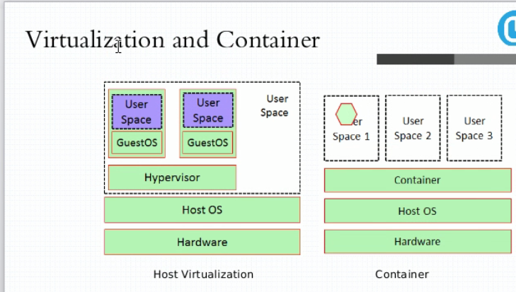
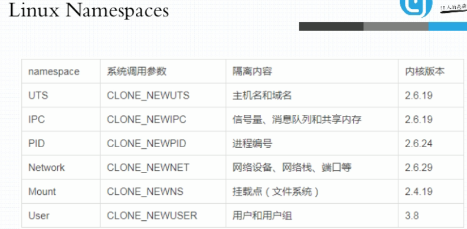
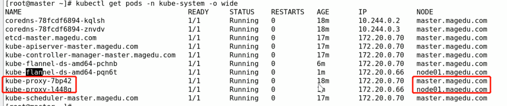
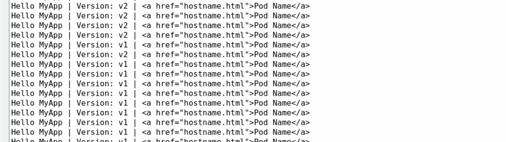
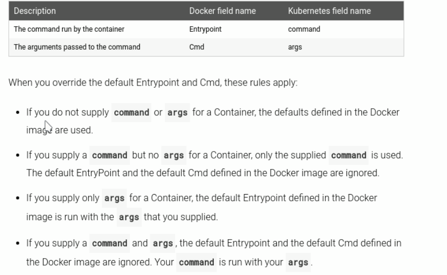
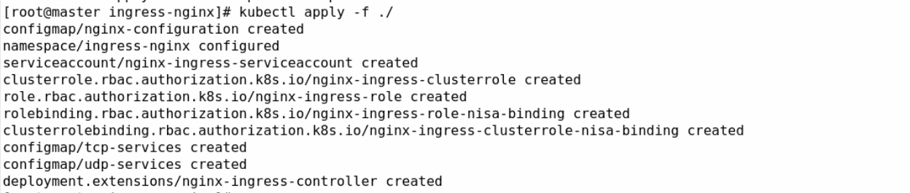

## 马哥docker 学习笔记

### 容器的概念

#### 虚拟化&容器化



##### 虚拟化实现的技术形式

1. 主机级的虚拟化

   - type-I: 
     - 直接在硬件平台上安装虚拟机管理器（Hypervisor) 不用安装 HOST OS，在Hypervisor 之上安装虚拟机
   - type-II:  VMware/workstation/virtualbox
     - 首先有宿主机（物理机），在物理机上安装宿主机操作系统HOST OS，在宿主机上安装 VMM（virtual machine manage），在VMM 的基础上创建使用虚拟机。
   - 其他：KVM/ZEN

   ```
   VMM给用户虚拟出来的是一个独立的硬件平台，用户需要使用虚拟机，需要部署完整意义的操作系统。
   但是运行内核不是我们的主要的目的，内核的主要的目的在于资源分配和任务管理，真正在用户空间的 应用进程才是能产生生产力的，而不是出于通用目的而产生的资源管理平台（内核）。
   但是内核又不得不存在，因为现在的软件都是针对于内核的系统调用和库调用，并且多个应用进程的协调也需要内核进行统一管理。
   一个在虚拟机中的进程想要运行则需要二级调度，自己虚拟机的内存虚拟化，CPU调度以及IO调度，真正的虚拟机进程又是被宿主机管理的进程或抽象层。
   ```

2. 容器级的虚拟化

   ```
   为了提高虚拟机虚拟化的效率，抽除掉虚拟机的内核层，直接进行用户进程之间的隔离。通过在宿主机上通过 一个用户空间的管理器 隔离不同的用户进程，用户进程运行在隔离起来的用户空间中，用户进程看到的是用户空间的边界，这就是容器技术的本质。
   
   容器技术最早出现在freeBSD 中，名字叫jail（监狱），最初出现jail 的目的是安全，程序运行在沙盒之中，进行隔离，避免程序出现安全漏洞而引起整个系统出现问题。
   后来吸收jail的理念，Linux 平台的 vserver(chroot)来实现容器技术。
   
   一个进程的运行无非就两棵树，进程树和文件系统树。
   
   容器的隔离需要进行：
   UTS（主机名和域名）
   Mount（文件系统挂载树）
   IPC（进程间通信）
   PID（进程号）每个隔离的用户空间必须要有一个 伪装成类似于init 的进程
   Uers（用户）对于在用户空间内行为可能类似于root，但在系统级别只是一个普通的用户
   Network（网络）每一个用户空间有自己专有的TCP/IP 协议栈
   ```

   

   


​	

​			

```
Control Groups(CGroups)：把系统级的资源分为多个组，把每一个的组内的资源的量指派分配到特定的用户空间的进程中去。
划分为不同的组之后，进行系统资源的分配。一个组内还可以进行细化为子组，把一个资源分配给一个组之后，这个组内的子组自动的拥有使用资源的权限。
如果把一个用户空间当做一个组，把资源分配给这个组，就可以限制这个用户空间的资源使用。
把一个资源分配一个用户空间，这个用户空间就自动的拥有了使用这个资源的能力。
```

容器技术由 Chroot，namespaces , CGroups 三种技术作为支撑的。

#### LXC（LinuX Container）

```
LXC 是最早把完整的容器技术，用一组简易使用的工具和模板来极大的简化容器使用的方案。
```


## 马哥 k8s 学习笔记

### DevOPS 核心要点及架构概述

```
Ansible:
	应用编排的工具，安装配置服务启动，甚至按照所定义的playbook 对多种的应用程序在有依赖关系的时候进行编排处理，把运维手动的处理运维任务 进行流程化，可编程化。

Docker:
	以往手工管理的对象是直接部署在操作系统上的应用程序，但是有了docker 之后，应用程序的容器化，各种的应用程序都封装在容器中运行，当在使用ansible这类的编排工具发现对象已经发生了变化，不能再像操作应用程序一样操作docker，所以docker 时代就需要面向容器化的编排的工具
	docker-compose: 更适合于单机的容器编排，只能面向一个docker host进行操作。
	docker-swarm: 可以将多个dockerhost 上运行的docker 容器，进行在同一平台的调度 编排。
	docker-machine: 将一个主机处理为加入docker swarm 集群的预处理工具。
	
	mesos: 是一个IDC的操作系统，能将一个IDC提供的硬件资源统一的调度与分配，他所面向的不是容器的接口，而是资源的分配工具。所以在此基础上需要一个面向容器的可编排的框架 marathon
	
	kubernetes:

DevOps:
	通过利用一些CI/CD（delivery, deployment） 工具，将开发，构建，测试，代码交付，运维部署的 过程自动化的完成，降低开发测试运维沟通成本，打通了开发和运维的边界，就是devops 的理念。
	容器技术的出现，使devops 完全成为了可能。devops 不是一种技术，是一种文化，一种运动。
	
	面对成千上万的容器，想要传统一样去管理监控处理存在故障的容器，基本不可能。所以需要容器编排的工具去进行管理。
```

**kubernetes简介**

```
kubernetes: 舵手
	kubernetes 的开发 深受Google 内部的 Borg系统的影响，Borg 是谷歌内部久负盛名的 容器管理工具。
	官方介绍的特性：
		1. 自动装箱，基于资源依赖及其约束能自动的完成容器的部署，不影响其可用性。
		2. 自我修复，由于容器非常轻量的特点，可以在1s内启动，有了k8s 这样的平台，运维更多的是关注的平台而非个体，一个个体的故障，会被重新销毁，重新分配。
		3. 水平扩展，一个容器不够，在启动多个
		4. 服务的发现和服务的负载均衡。
		5. 自动的实现发布和回滚
		6. 密钥和配置管理(之前的容器实现是 在容器	启动的时候 传入配置的环境变量值，获取一些配置)，k8s 会有配置对象，启动时候像从配置中心一样加载配置
		7. 存储编排
		8. 批量处理执行
	
	Redhat 的 openshift 可以看做为 kubernetes 的发行版，kubernetes 做的东西比较的底层。openshift 继承了 PAAS 平台以及devops 的环境。
```

**kubenetes 的环境架构和术语**

```
kubernetes 是一个集群，统一整合多个主机的资源，形成一个大的资源池，并对外提供计算存储能力的集群。

kubernetes 是一个 master/nodes(workers) 的架构的应用
	master 有一个或一组节点为主节点，一般为三个。彼此之间为了做高可用。
		API server：接受用户的请求
		scheduler：调度容器创建端请求
		controller-manager：确保控制器健康，而 controller 优势确保容器的健康。
	nodes 每一个都是为了贡献计算和存储资源，是运行容器的结点。
		kubelet: 创建删除管理pod
		docker engine：提供容器的运行基础环境
		kube-proxy: 时刻监听API server 的相关事件，一旦发现 某一个service关联的pod 的地址发生改变，对应的有kube-porxy 在本地的反应在 iptables或ipvs 上，service的管理需要 kube-proxy 来进行
	kubernetes进群所有信息的存储：
		etcd
	kubernetes 域名服务：
		core-dns
	
	用户如何在集群中运行容器：
		客户端的请求先发送给master ，由 api server 处理，分析用户请求的资源后，通过schedule 进行资源的分析调度到响应的结点，node 上的kubelet 在收到scheduler 的调度后，通过本机的容器引擎 启动容器，检查本机是否有响应的容器，没有的话 向docker registry 请求镜像。
		
		scheduler 提供了两级调度的算法，首先评估下 所有节点几个服务容器的运行需求，再从选出的节点优选出最佳（取决于调度算法的优选算法）。
		node  节点安装的kubelet 会对节点上的容器做 健康的检测
		controller 负责去监控管理的每个容器是否是健康的，一旦发现不健康，控制器向API server 发送请求，进行容器在其他节点的重建（scheduler调度进行）。控制器在本地不停的loop，持续性的探测管理的容器是否健康。一旦不符合用户定义的目标，使实际的结果不断的 吻合到用户定义资源的状态。
		master 上的 controller-manager 管理监控所有的控制器的健康。controller-manager 在master 做了高可用
	
	kubernetes 并不直接的调度容器，而是调度pod，pod是容器的集合抽象层（逻辑组件），pod内的容器有相同的网络命名空间（nets，UTS， IPC共享，user，MNT，PID藿香隔离）和存储卷。
	
在创建pod 的时候，会给pod 添加一些 metadata 数据，如：label，方便进行pod 的筛选和归类管理，这些标签是一些 kv 对，k8s 会通过 selector 标签选择管理器，进行pod 的操作。

```

### kubernetes 基本概念

```
Pod:
	1. 自主式pod，自我管理的pod，调用api server，由 scheduler 进行调度到节点，kubelet 创建容器，如果容器故障，kubelet 重新再节点创建，如果节点故障，容器则会消失。无法实现全局的调度
	2. 控制器管理的pod
		ReplicationController: 当pod 的数量不满足预期定义的个数的时候，由此控制器进行控制pod 的创建或销毁多余的副本
		ReplicaSet：此控制器不直接使用，需要 ReplicationController为基础
		Deployment: 声明式更新的控制器，只能管理无状态的应用
		StatefulSet: 有状态的控制器
		DaemonSet：没一个节点上只能运行一个副本，不能随意的运行
		Job：运行作业，不需要一直处于运行状态
		CrondJob: 周期性的计划作业
		HPA（HorizontalPodAutoscaler）：自动的根据pod的负载，资源使用情况进行pod 的创建或减小
```


```
service 的作用：
	由于pod的创建 销毁可能随时的进行，所以不能采用传统的访问pod IP的方式去直接访问pod内容器的应用，抽离出一个service 层，相当于一个VIP的作用，这个VIP在serveice 创建后不在进行变化，后端的pod 新增或销毁不影响服务的访问，只是添加新的iptables/ipvs 规则就行了，service是通过集群内部的DNS动态的添加解析到service ip，实现访问的。
	
kubernetes的三种网络：
	1. 节点网络，物理主机的网络
	2. service 网络，由iptables/ipvs 产生的虚拟的网络
	3. pod 的网络

kubernetes 中容器间的三种通信：
	1. 同一pod内的多个容器之间的通信: lo (网络名称空间相同)
	2. 各pod网络之间的通信（跨主机的话 使用overlay network 叠加网络）
	3. pod 与service 之间的通信（pod的网关配置为 本机的 docker0 的地址，网络包到达docker0后，由相应的iptables/ipvs进行转发，而集群中所有的iptables/ipvs的管理则由kube-proxy进行）
	
kubernetes 通过 CNI（容器网络接口）来接入第三方的网络插件，为kubernetes 集群提供网络支持。
	1. funnel：只支持网络的配置，是pod之间，pod和service 之间进行通信，不支持网络的策略的配置，纯粹的叠加网络实现
	2. calico: 即支持网络配置，又支持网络策略（使用BGP协议实现了直接路由通信），是一个三层的隧道网络
	3. canel: 结合 funnel 和calico
```


### kubeadm 初始化kubernetes集群


```
service 网络有kube-proxy 管理
pod 网络 由 flannel 管理（10.244.0.0/16 flannel 默认的）
```


**配置kubernetes 阿里云源**


**安装基础的软件**


**导入gpg密钥**


**配置docker镜像代理服务**


**确认桥接的 iptables 配置是否允许**


**配置当开启 swap 的时候要不要报错**


**pause容器的作用**


```
pause 是为了构建基础架构容器使用的，pause容器不启用，其他容器构建的时候加入复制这个容器网络和存储卷等提供功能。
pod 之所以能启动起来，是其他容器在pod内拥有相同的网络和存储，就是因为pod底层使用的是 pause 这个基础架构容器
```


```
配置kubelet 连接kubernetes 集群的认证证书，以及向kubernetes 添加节点
```

**获取集群的组件状态信息**


**查看节点的状态**


```
之所以节点没有 ready ，因为集群的网络addon 没有安装好
```

**flannel 安装**


**查看系统的k8s的镜像需要制定 kube-system 的名称空间**


**查看集群的各组件的信息**



### kubernetes应用快速入门


**创建pod**


```
dry-run 不会真正的执行
```


```
deployment 展示的是用户期望的资源设定情况
```


```
查看pod 的信息，及节点信息
```


```
node02 上的pod都是 flannel cni0 网卡的 10.244.2 的网络ip
```


```
访问nginx的pod 地址，只能在kubernetes 集群的内部访问pod 的
```


```
将原本在 node2 上的pod 删除了之后，由于nginx的pod 是由deployment 进行管理的，所以会在进行重新穿件，调度到了node01上了，此时的pod IP 变更为 10.244.1 了
```


```
kubectl run 指定的 --port 是 pod 的port
kubectl expose 创建服务的时候，--port 指定的是service的port
```


```
创建的service 的三种类型：
	ClusterIP：集群内部可以被访问
	NodePort: 会在每一个物理结点上创建映射端口，供集群外访问
	LoadBalancer:
```


```
expose 暴露哪个 deployment的服务
```


```
查看创建的service，为 10.96 的网络，类型为 ClusterIP，service 视为pod 提供 固定访问的端点的（endpoints）, ClusterIP 只能在集群内部的进行访问。
```


```
创建新的pod 的时候，他的DNS 自动的指向 coreDNS 的地址
```


```
service关联的后端的节点为 10.244.1.3:80 
selector: 的标签为 run=nginx-deploy
```


```
10.244.1.3 这个pod 拥有 run=nginx-deploy 的标签，service通过这个标签来选择 nginx，通过这个标签来管理pod，监控pod的状态
```


```
-w  watch ，一直监控着状态的变化
```


**创建myapp service**


```
可以看到 两个副本，轮询访问
```

**持续进行pod 的访问**


**扩展deployment 到5个**


**升级容器镜像的版本**


```
先通过 kubectl describe pods  container_name   查看容器的名字
```


```
升级镜像到 v2
```


```
查看myapp 的升级的过程
```


**回滚deployment 的更新**




**edit myapp 的service **


### kubernetes 资源清单定义入门

#### kubernetes 常用的资源

```
资源实例化后为一个对象。
1. 工作负载型的资源对象（workload）: Pod, ReplicaSet, Deployment, StatefulSet, DaemonSet, Job, Cronjob
2. 服务发现及均衡：Service， Ingress
3. 配置与存储：Volume，CSI接口
	ConfigMap: 当做配置中心使用的资源
	Secret： 敏感数据的配置
	DownwardAPI： 外部的信息输出给容器
4. 集群级的资源：
	NameSpace，Node，Role，ClusterRole，RoleBinding，ClusterRoleBinding
5. 元数据型的资源
	HPA：水平pod收缩
	PodTemplate: 用于让控制器使用的模板
	LimiRange: 定义使用的资源的限制
```

#### **pod 的资源配置清单**


```
apiVersion 的命名为 group/version, 当group 省略的时候，说明是core组的
kind 指定资源的类型
metadata 元数据
spec 资源的规格定义，定义自己创建的资源对象应该具有什么样的特性（目标期望状态）
```


```
容忍度，容忍哪些污点
```


```
status 显示当前资源的当前的状态
k8s 就是确保每一个资源定义完成后，从当前状态无限的向目标状态靠近，从而满足用户期望。
```

#### **创建资源的方法**

```
api server： 仅接受Json 格式的资源的定义，当使用 kubectl run 创建deployment的时候，会自动的把命令行的命令转换为json 的格式发送给 api server 进行资源的创建
yaml格式的配置清单，api server 可以自动的将其转换为json 格式，而后再提交执行。

大部分核心资源的配置清单组成：
	apiVersion: 指定创建的资源属于哪个api 组
	kind: 资源的类别（一般为内建的，但也支持自定义）
	metadata：元数据
		name: 同一类别中的name 必须唯一的，（实例化具体的对象了）
		namespace：这个对象属于哪个名称空间, 这个是kubernetes级别的概念，不是操作系统的namespace
		labels: 标签，每种类型的数据都可以有标签，键值数据
		annotations: 资源注解
	spec: 用户期望的状态，desired state 
	status: 当前的资源状态，current state，右kubernetes集群维护，用户不能自定义
		
清单定义的是声明式的api调用；
kubectl run 定义的是 命令式的api调用。
```

**k8s 的api 组**


```
pod 属于最核心的资源，所以属于 core/v1 群组
controller，deployment，RealicaSet 属于 apps/ 群组  （alpha 内测版本，beta 公测版本）
```

**K8S 中资源的引用**


```
每个资源的引用的PATH
	/api/GROUP/VERSION/namespaces/NAMESPACE/KIND/NAME
```

#### **查看pods 资源的定义方式**


```
其中 为Object 的 可以在进行字段的嵌套
```

**查看metadata 定义方式**


```
map 是 KV组成的json数组
[]Object 定义为一个 对象数组
```


```
一级级的查看资源的定义方式
```

#### **定义资源清单的yaml文件**


```
labels 需要的是一个字典，（json的数组），可以使用上面的红框中的{} 进行定义，也可以使用app,tier 并行的方式进行定义（这里是映射的kv值）。注意: 这里app 前面没有 - ，加了 - 的为一个数组（列表）中的相同的类型的元素，所有的map 的可以使用 {} 进行定义，所有的 列表的可以使用 [] 进行定义。
```


```
containers; 字段定义为一个列表，使用 - 打头，
command 后面跟的也为 列表，也可以使用两种方式进行定义
```

#### **最终的定义的demo 的资源清单**


```
会创建两个容器在同一个pod内
```

#### **demo pod 的创建**


#### **查看pod 的日志**


```
启动的busybox 容器报错
```

#### **进入到容器中**


#### **根据清单删除pod**


### kubernetes Pod 控制器应用进阶


```
当拉取得镜像为 lastest 的时候，默认的拉取策略是always，可以设定为IfNotPresent 本地没有的话才进行拉取
```


```
args: 如果没有定义args，则默认使用docker镜像中 CMD 后面的参数，如果使用变量 引用 方式为 $(var_name) 或 逃逸转义 使用 $$(var_name)

command: 如果没有提供这个选项，则使用docker 自己的entrypoint， 这个参数不会提供 shell 环境，需要在shell 中运行 将 "/bin/sh" 作为command 的列表传入

如果只定义了command 则docker中的 entrypoint 和 CMD 都不会生效
```




#### pod 标签过滤


```
-l 指定标签选择器，过滤pod
-L 根据指定的标签，显示出其含有的 值
```


#### 给pod 打标签


```
标签已经存在 使用 --overwrite
```

#### 复杂的标签选择

```
kubernetes的标签选择器有两类：
	1. 基于等值关系的标签选择器
		==，= 表示相等
		!= 表示不相等
	2. 基于集合的标签选择器
		KEY in (VALUE1, VALUE2, VALUE3...)
		KEY notin (VALUE1, VALUE2, VALUE3...)
		KEY 存在此键
		!KEy 不存在此键
		
	3. 许多的资源支持内置字段定义其使用的标签选择器
		matchLables: 直接给定键值对
		matchExpressions: 
			基于给定的表达式来定义使用标签选择器，
			{key: "KEY", operator: "OPERATOR", values: [VAL1, VAL2, ...]}
			operator有：In, NotIn, Exists, NotExists
```

#### **等值类的选择**


#### **集合类的选择**


#### 任何资源都可以使用标签


```
nodes 节点的标签
```

#### **给node打标签**


```
nodeSelector <map[string][string]>
	节点标签选择器
nodeName <string>
	运行在指定的节点上
```

#### **使用标签选择器**


```
nodeSelector 是pod 的属性，所以与containers 属性为同一级别，这样这个pod就只会运行在 disktype=ssd的结点上了
```


```
运行在node1 节点上了
```

#### 资源注解annotations

```
annotations：
	与labels不同的地方在于，不能用于挑选资源对象，仅仅提供对象的元数据，它对字符串的长度（键长度和值长度限制）没有限制
```

**查看资源的注解**


#### 添加注解


#### Pod 的生命周期

```
pod 的状态：
	pending：已经创建但是没有适合它运行的节点，调度尚未完成
	running：正常运行的状态
	failed: 失败
	succeeded: 成功
	unknown：未知状态，api server 获知的 pod 的状态信息是kubelet 提供的，如果 kubelet故障，则无法获取状态
```


```
init container: 初始化的容器，可以存在多个，之间线性的执行
main container: 主容器，在init container 启动后执行，主容器可以做post start 启动后的钩子，和停止前的钩子，还可以在运行过程中做容器的健康性的检测（liveness probe, readiness probe）
	健康性探测：
		liveness probe: 存活性探测主要探测主容器是否存活
		readiness probe: 就绪性探测主要探测主容器是否准备就绪，并可以对外提供服务
	无论哪种probe 可以有三种探测行为：
		1. 执行自定义的命令 
		2. 向指定的tcp套接字发送请求 
		3. 向指定的http服务发送请求）

pod 生命周期的重要的行为：
	1. 初始化容器
	2. 容器探测
	3. post start/pre stop 钩子

lifecycle: 这个containers的下属配置项，定义生命周期定义启动前和启动后的钩子
```

#### Pod容器的重启策略

```
restartPolicy:
	1. Always   一旦挂了就重启（default）
	2. OnFailure  只有容器的状态为错误是才重启，正常停止的不重启
	3. Never   从不重启
第一次重启，终止后就立即重启，再出现错误，就会延时进行重启，终止后等10s再重启，第三次 等20s，第四次，等40s..., 300s 为最长的等待时间，之后都是等300s 进行重启

一旦一个pod 调度到某个节点之后，只要这个节点存活，发生错误时，这个pod就不会重新进行调度，只会进行重启，除非这个pod删除重新创建或节点挂了
```

#### Pod 的创建过程

```
创建pod:
	用户创建pod 的时候，请求交由api server，api server 保存定义的pod 期望状态的清单到etcd 中，api server之后会请求scheduler 进行调度，调度后的结果（调度到哪个节点，ip 等等信息）更新到etcd 中；此时相应的节点的 kubelet 通过api server获得到有pod创建的请求时，从etcd拿到创建的期望的清单，进行pod 的创建。再把创建的结果无论成功与失败发送给api server ,api server 再存储到etcd中。
```

#### Pod内的容器终止逻辑

```
pod一旦发成故障的时候应该进行平滑的迁移，侧能确保数据不会丢失
kubernetes 在提交删除pod 的操作时，不会直接kill掉 整个pod的容器，而是想pod内的每个容器发送 term(15) 的终止信号，让pod内的容器正常的进行终止，这个终止有个默认的宽限期（比如30s），如果宽限期内还没有终止，会重新发送kill信号
```

#### 主容器probe的配置

```
探针针对的是容器之上，是containers 的下属配置项
探针有三种的类型：
	ExecAction:
	TCPSocketAction:
	HTTPGetAction:


```


```
exec 探测命令执行的返回码 为0 则成功
```

**定义的探测示例**


```
initalDelaySeconds 在容器启动多少秒之后再进行探测
periodSeconds 探测的周期
```


**http get 探测**


**删除主页文件**


**可用性探测**


```
一旦就绪 READY 会变化
```


#### lifecycle 钩子


```
postStart 和preStop 同样也有三种的执行行为
```

**示例清单**


```
lifecycle 在容器启动之后执行创建 httpd home 文件index.html
command 指定容器启动后执行的 httpd 服务
args 执行 httpd 启动的一些参数，-f 前台运行，-h 执行家目录位置
```


```
上面的图片的配置是无法创建成功的，因为 容器的command 命令运行 httpd 服务的时候需要 /data/web/html 而此时 这个文件还没有创建，所以一直报错
```

#### Pod 控制器

```
RealicationController: 
ReplicaSet:	新一代的 RealicationController
	是用户创建的pod副本一直满足于用户的期望数量，支持扩缩容机制
Deployment： 
	工作在 ReplicaSet 之上，通过控制 ReplicaSet 控制pod, 比ReaplicaSet 有更多的功能，额外支持滚动更新，回滚
DaemonSet: 
	用于确保集群中的每一个的节点运行一个副本，比如日志收集的filebeat agnet 类的服务，通常为 系统级的后台任务，只要新增节点都会添加相应的DaemonSet 定义的pod
	只适用于无状态的应用, 
Job：
	只适用于只执行一次作用
CronJob:
	定时的执行任务
StatefulSet:
	有状态的，有数据的，不能随意启动一个副本替代的

TPR: Third Party Resources, 1.2+ - 1.7	第三方资源
CDR: Custom Defined Resources, 1.8+  用户自定义资源

Operator: 把运维技能灌输进来
```

**RC 与 RS**


#### ReplicaSet 清单的创建


```
ReplicaSet 通过 selector 去管理pod，查看pod 的数量，监控
template 下面定义的是 pod 的一些信息，其中 metadata 的labels 必须含有 RS 中 selector 的标签，要不然 RS 发现，没有相应的标签会一直进行创建。
```


```
pod 的命名方式为 控制器 RS的名称，加上一个随机的字符串
```


**直接编辑RS的资源**


```
把replicas更改为5个
```

**更改容器的版本为v2**


```
此时的pod 的依然为v1， 只有在重建是才为 v2
```


```
此时就可以人为的 手动的删除响应的pod，自动创建后为新版白的，进行金丝雀（灰度）的发布。

蓝绿部署：新建另一个RS部署完成后，再把service导入到部署完成后的服务
```

**deployment 实现的滚动发布**


```
在v2 版本的所有pod 创建完成后 RS v1 并不会删除，便于回滚
```


```
一个Deployment 可以管理多个的 RS，只有一个RS 处于活跃的状态，默认保留10个 RS版本
Deployment 还可以控制更新的节奏和更新逻辑
```

#### Deployment 更新策略


```
rollingUpdate: 
	maxSurge: 更新过程中，最多超出目标副本数几个，可以使用数量个 百分比
	maxUnavailable: 最多可以有多少个不可用
```

#### Deployment 清单配置


```
apply 是一种 声明式更新，既可以创建，也可以更新，可以执行多次，不像create 创建一次，在创建会报错
```


```
deployment 的名称是在 配置清单中定义的
rs 由 deployment 创建，它的名字由 deployment的名字，加上 模板（template）清单的哈希值 进行定义
pods 的名字则由 rs 的名字，后面跟上随机的字符串
```


```
更改副本为3个，可以看到 RS的名字的hash 值没有变化，因为 deployment中的 template 定义没有变化
```


```
annotations 在每次的更新之后，会记录版本的变化
默认的更新策略为 RollingUpdate
```

#### **更改配置文件为v2**


```
重新apply 改动，进行更新
```


```
创建新的 pod 进入到 pending 状态，可以看到RS的名字 改变了，因为 模板（template）进行了变动，hash值改变
```


```
老版本的 RS 仍然还在，方便回滚
```

#### **查看Deployment myapp-deploy 的历史版本**


#### 通过 patch 的方式更新


#### 使用pause 在更新一个后暂停更新


```
可以看到 在更新一个后，暂停更新，模拟了金丝雀发布。
```


```
使用 rollout status 也可以查看 更新的状态
```

#### 使用 resume 更新其余的


```
看到 所有的都更新到了 v3 版本
```

#### rollout undo 进行版本的回滚


```
回滚到第一版之后，在回滚则回滚到上一版则是 第三版本
```


#### DaemonSet的清单配置


```
kind 的类型为 DaemonSet 
使用的镜像为 filebeat，这个镜像需要存在环境变量 REDIS_HOST 和 REDIS_LOG_LEVEL
```


```
可以看到创建了分割的 ds 的pod，因为 worker节点有两个，master节点允许创建pod
```

#### 多个相关联的pod 定义在一个资源清单文件中


```
使用 --- 进行隔开
```

#### 对DaemonSet 资源进行更新


### k8s 中的Service 资源

```
为了个客户端提供固定的访问端点，在客户端和服务pod 之间添加了固定的中间层，这个中间层为 service，这个service 严重的依赖于在k8s 集群上安装的 coreDNS 服务。
service的 名称解析强依赖与 coreDNS。

kubernetes 要想向客户端提供网络功能，需要依赖于第三方的网络方案，这个第三方的方案可通过CNI 容器网络插件提供的标准接口，接入遵循这种接口标准的第三方网络方案。

kubernetes 中的三种网络：
	1. node network
	2. pod network
	3. cluster network(service network)
	前两种都是实实在在的配置在 网卡接口上（无论是物理网卡还是虚拟网卡），而service 网络是 virtual ip，由iptables 或 ipvs 实现数据包的转发路由。
```


```
在节点上安装的 kube-proxy 时刻的watch master结点的 api servver 关于 service 资源的变化，如果存在变化，则会在节点进行 iptables 或 ipvs 的规则的创建。
```

#### service 实现的三种方式

```
service的实现模式：
	1. userspace 在用户空间依靠kube-proxy 进程代为转发，当然也依赖于iptables 规则，过于低效。1.1版本之前
	2. iptables  从用户空间转向内核空间，1.10版本之前
	3. ipvs 1.11 版本后默认使用ipvs
```

1. **userspace 方式**

   

   ```
   client的请求到达 service 后，service 转发到本地节点 kube-proxy 监听的套接字，然后再由kube-proxy 转发请求到service，service 在代理到 服务pod 的kube-proxy 再由其转发到相应的节点。
   这种方式的效率很低，因为先要到内核空间，再到用户空间，再要到内核空间，用户空间和内核空间之间相互转换。
   ```

2. **iptables 方式**

   

   ```
   client 的请求直接请求service ip，被本地的内核中的 iptables 的规则所截取，进而直接调度给 service 后端相应的 pod。
   这种方式 直接工作在 内核空间，由iptables 规则进行调度。
   ```

3. **ipvs**

   

   ```
   使用 ipvs 替换了iptables 的进行 报文的转发。	
   ```

```
如果某个服务后面的pod资源发生了改变，比如 service 的抱歉选择器适用的版本有多了一个pod，这个pod 的适用的信息会立即反馈到 api server上，kube-proxy 一定会watch 到这种变化，并立即转换为结点的 iptables/ipvs 规则。
```

#### 创建service 资源


```
ndoePort 节点的端口
port	向外暴露的端口
targetPort  容器的端口
```

**service 的配置清单**


```
type: 指定service 的类型，默认就位 ClusterIP
clusterIP 最好不要指定，让集群自动分配
```


```
selector 通过标签的匹配，得出到 后端的 endpoints 为 10.244.1.32::6379

实际上 service 不是直接到 pod 资源的，中间还有个 endpoint 资源（就是 ip:port）,实际上可以手动的创建 endpoint 资源。
```

#### DNS的资源记录格式

```
资源记录：
	SVC_NAME.NS_NAME.DOMAIN.LTD
	
	kubernetes 默认的域名后缀：svc.cluster.local.
	redis 在 default 的名称空间中的：
		redis.default.svc.cluster.local.
```

#### 创建NodePort 类型


```
指定 type为 NodePort 
nodePort 最好不要指定，会进行动态分配
selector 指定 标签 app=myapp,release=canary  就可以选择所有的 myapp 的pod
```


```
集群外进行访问，可以看到 myapp 的进行负载均衡
```

#### LoadBalancer 


```
LoadBalancer 是比如在 阿里云 购买了 VPS 主机部署了 kubernetes 集群，这个 kubernetes 集群可以与底层的 公有云IAAS进行交互，调用底层的IAAS的底层的云计算的API，请求创建一个 外置的 负载均衡器（LBAAS服务提供），在创建 SLB的过程中 提供 后的的NodePort 的ip和端口，自动映射到相应的后端服务。 
```

#### ExternalName 


```
ExternalName 一定要能被 DNS 服务所解析
```


```
extrtnalName 是一个CNAME
```

#### 开启 sessionAffinity


```
改动之后，相同的IP之后请求到同一个后端服务，默认置为 None
```


#### headless service 

```
service 的地址不在是 clusterIP, 而是直接到后端的 PodIP 
```


```
地拽 clusterIP 为 None 的时候，则为 headless service
```

**headless 清单配置**


```
service 的名字更改为 myapp-svc, clusterIP 置为 None
```


**查看myapp-svc service 的解析地址**


**CoreDNS 记录着集群的DNS的解析**


### kubernetes ingress 及 ingress controller

#### **开启ipvs 负载**


```
service的四种类型：
	1. ClusterIP ：只能在集群的内部进行访问
	2. NodePort: 
		client -> NodeIP:NodePort -> ClusterIP:ServicePort -> PodIP:containerPort
		这种方式需要将流量接入到 集群的所有的NodeIP 上分散请求压力。在NodeIP 和NodePort 之前添加 负责局衡器。
	3. LoadBalancer: 只有在公有云上才能使用，并支持LBAAS, k8s 就可以调用IAAS底层的 api来创建负载均衡
	4. ExternalName： 把集群外部的服务映射进集群内部，当pod 需要访问集群外部的服务的时候
		FQDN 的名称：主机名或域名，通常是别名记录
			CNAME 记录 -> 真正的FQDN
			内部定义个内部的名称，经CoreDNS 解析后CNAME到 真正的外部服务的地址

No ClusterIP : Headless Service 
	会把servername 直接解析到 PodIP ,本来应该解析到，serviceIP（clusterIP） 的。
```

#### kubernetes 中的七层代理实现

```
可以看到 service 是四层的调度，无论是iptables 还是 ipvs 都是在四层进行调度，工作在TCP/IP 协议栈，如果用户访问的是http请求，那么service 就很难进行负载。
```

```
进行这样的假设: 服务经过LVS进行负载，后端是http 的服务，那么配置https 服务的时候，就必须把 ssl 的证书配置在 后端的服务上，因为LVS 是四层的调度，无法对七层的数据包进行解析。

客户端建立连接是与LVS进行的，而ssl 的会话却要与后端的服务进行，所以证书的域名解析 到底是配置在 LVS的 VIP还是后端的主机服务，就会出现问题。
由于调度器LVS 无法解析ssl会话，客户端必须要与后端的服务建立ssl会话，但是当下次请求到下一台的机器的时候，之前建立的ssl会话将失效。

所以使用 七层的负载均衡器 替代 LVS，由七层的负载均衡器作为卸载器解出ssl 会话，然后后端进行http 的连接
```

**实现方案一**


```
客户带访问 外部的 LB，调度到kubernetes 的节点后（service 实现的nodePort类型，负载 代理的pod），每个节点存在一个 pod 专门负责七层的代理，负责代理到后端的pod服务上
```

**实现方案二**

```
让七层代理的pod 共享Node节点的网络名称空间（namespace），就可以省掉 service的 代理层，边界流量直接就可以进入到 七层代理的pod。
容器共享宿主机的网络名称空间之后，容器内的进程，监听的socket 就是宿主机的socket
```


```
这样就要求 七层代理的pod 在每一个的节点上都运行，这个时候 DaemonSet 控制器就可以有用武之地了，在kubernetes 中的每个节点都运行 七层代理pod，如果集群的集群 比较多，可以给特定的节点打上污点，指定运行的代理pod 的节点，别的pod 不能运行在有这些污点的机器上。
```

**最终方案**


```
这个代理http流量的pod 被称为 ingress controller
ingress controller 是独立运行的一组 pod资源，通常就是一组应用程序，拥有七层调度代理能力的应用。
ingress 服务，有三种选择：
	1. nginx
	2. traefik
	3. envoy(微服务倾向使用envoy)
```

#### ingress 实现


```
ingress 和 ingress controller 是不同的两个概念，我们在定义ingress 的时候回定义我们期望的ingress controller 是如何给我们建立一个前端（可能是虚拟主机或基于URL的映射），又会定义一个后端（upstream server）, 后端pod 的服务资源。后端的upstream server 有多少个主机，是由定义的 后端 pod 的service知道的，这个service没有流量调度的功能，只是为了通过标签确定 后端upstream server 的个数和ip.

ingress 的作用是：一旦ingress 通过service 发现后端的pod 的资源发生了变化，这个改变会及时的反应到ingress 上，ingress 会及时的注入到 upstream 的配置文件中。
如果是nginx 配置文件注入后需要进行重载，而 traefik 和envoy 天生为微服务而生则不需要重载，可以自己监控配置文件变化进行重载。
```

```
要想在kubernetes使用七层的代理：
	1. 部署ingress controller
	2. 根据自己的需要，是使用虚拟主机的方式还是 URL映射的方式配置前端，再根据service 收集到的后端的pod 的IP 定义成upstream反应在ingress中，由ingress 动态的注入到ingress controller 中
```


```
其中的<service> ingress-nginx 负责外部的流量导入到ingress controller，可以去除，使用DaemonSet 资源去运行 代理的pod，pod资源的网络设置为 host network的方式
ingress 通过 <service> site1 和 <service> site2 获取后端 site1 和 site2 的后端资源，注入到 ingress controller 进行流量的调度。

<service> site1 和 <service> site2 不会再调度的时候使用，只会去根据标签确定后端pod 的ip
```


```
rules 定义 ingress controller 的调度规则
```


```
rules 定义 host 和http，及使用虚拟主机 或 URL的映射方式进行调度
```


```
backend 是定义后端 关联的 service 资源，由此知道后端的所有的pod资源
```

#### 配置ingress controller

**下载需要的文件**


##### kubernetes 创建名称空间

**命令行创建名称空间示例**


##### **直接apply 下载的清单 文件**




**或者直接执行 mandatory 文件**

```
apiVersion: v1
kind: Namespace
metadata:
  name: ingress-nginx
  labels:
    app.kubernetes.io/name: ingress-nginx
    app.kubernetes.io/part-of: ingress-nginx

---

kind: ConfigMap
apiVersion: v1
metadata:
  name: nginx-configuration
  namespace: ingress-nginx
  labels:
    app.kubernetes.io/name: ingress-nginx
    app.kubernetes.io/part-of: ingress-nginx

---
kind: ConfigMap
apiVersion: v1
metadata:
  name: tcp-services
  namespace: ingress-nginx
  labels:
    app.kubernetes.io/name: ingress-nginx
    app.kubernetes.io/part-of: ingress-nginx

---
kind: ConfigMap
apiVersion: v1
metadata:
  name: udp-services
  namespace: ingress-nginx
  labels:
    app.kubernetes.io/name: ingress-nginx
    app.kubernetes.io/part-of: ingress-nginx

---
apiVersion: v1
kind: ServiceAccount
metadata:
  name: nginx-ingress-serviceaccount
  namespace: ingress-nginx
  labels:
    app.kubernetes.io/name: ingress-nginx
    app.kubernetes.io/part-of: ingress-nginx

---
apiVersion: rbac.authorization.k8s.io/v1beta1
kind: ClusterRole
metadata:
  name: nginx-ingress-clusterrole
  labels:
    app.kubernetes.io/name: ingress-nginx
    app.kubernetes.io/part-of: ingress-nginx
rules:
  - apiGroups:
      - ""
    resources:
      - configmaps
      - endpoints
      - nodes
      - pods
      - secrets
    verbs:
      - list
      - watch
  - apiGroups:
      - ""
    resources:
      - nodes
    verbs:
      - get
  - apiGroups:
      - ""
    resources:
      - services
    verbs:
      - get
      - list
      - watch
  - apiGroups:
      - ""
    resources:
      - events
    verbs:
      - create
      - patch
  - apiGroups:
      - "extensions"
      - "networking.k8s.io"
    resources:
      - ingresses
    verbs:
      - get
      - list
      - watch
  - apiGroups:
      - "extensions"
      - "networking.k8s.io"
    resources:
      - ingresses/status
    verbs:
      - update

---
apiVersion: rbac.authorization.k8s.io/v1beta1
kind: Role
metadata:
  name: nginx-ingress-role
  namespace: ingress-nginx
  labels:
    app.kubernetes.io/name: ingress-nginx
    app.kubernetes.io/part-of: ingress-nginx
rules:
  - apiGroups:
      - ""
    resources:
      - configmaps
      - pods
      - secrets
      - namespaces
    verbs:
      - get
  - apiGroups:
      - ""
    resources:
      - configmaps
    resourceNames:
      # Defaults to "<election-id>-<ingress-class>"
      # Here: "<ingress-controller-leader>-<nginx>"
      # This has to be adapted if you change either parameter
      # when launching the nginx-ingress-controller.
      - "ingress-controller-leader-nginx"
    verbs:
      - get
      - update
  - apiGroups:
      - ""
    resources:
      - configmaps
    verbs:
      - create
  - apiGroups:
      - ""
    resources:
      - endpoints
    verbs:
      - get

---
apiVersion: rbac.authorization.k8s.io/v1beta1
kind: RoleBinding
metadata:
  name: nginx-ingress-role-nisa-binding
  namespace: ingress-nginx
  labels:
    app.kubernetes.io/name: ingress-nginx
    app.kubernetes.io/part-of: ingress-nginx
roleRef:
  apiGroup: rbac.authorization.k8s.io
  kind: Role
  name: nginx-ingress-role
subjects:
  - kind: ServiceAccount
    name: nginx-ingress-serviceaccount
    namespace: ingress-nginx

---
apiVersion: rbac.authorization.k8s.io/v1beta1
kind: ClusterRoleBinding
metadata:
  name: nginx-ingress-clusterrole-nisa-binding
  labels:
    app.kubernetes.io/name: ingress-nginx
    app.kubernetes.io/part-of: ingress-nginx
roleRef:
  apiGroup: rbac.authorization.k8s.io
  kind: ClusterRole
  name: nginx-ingress-clusterrole
subjects:
  - kind: ServiceAccount
    name: nginx-ingress-serviceaccount
    namespace: ingress-nginx

---

apiVersion: apps/v1
kind: Deployment
metadata:
  name: nginx-ingress-controller
  namespace: ingress-nginx
  labels:
    app.kubernetes.io/name: ingress-nginx
    app.kubernetes.io/part-of: ingress-nginx
spec:
  replicas: 1
  selector:
    matchLabels:
      app.kubernetes.io/name: ingress-nginx
      app.kubernetes.io/part-of: ingress-nginx
  template:
    metadata:
      labels:
        app.kubernetes.io/name: ingress-nginx
        app.kubernetes.io/part-of: ingress-nginx
      annotations:
        prometheus.io/port: "10254"
        prometheus.io/scrape: "true"
    spec:
      serviceAccountName: nginx-ingress-serviceaccount
      containers:
        - name: nginx-ingress-controller
          image: quay.io/kubernetes-ingress-controller/nginx-ingress-controller:0.25.0
          args:
            - /nginx-ingress-controller
            - --configmap=$(POD_NAMESPACE)/nginx-configuration
            - --tcp-services-configmap=$(POD_NAMESPACE)/tcp-services
            - --udp-services-configmap=$(POD_NAMESPACE)/udp-services
            - --publish-service=$(POD_NAMESPACE)/ingress-nginx
            - --annotations-prefix=nginx.ingress.kubernetes.io
          securityContext:
            allowPrivilegeEscalation: true
            capabilities:
              drop:
                - ALL
              add:
                - NET_BIND_SERVICE
            # www-data -> 33
            runAsUser: 33
          env:
            - name: POD_NAME
              valueFrom:
                fieldRef:
                  fieldPath: metadata.name
            - name: POD_NAMESPACE
              valueFrom:
                fieldRef:
                  fieldPath: metadata.namespace
          ports:
            - name: http
              containerPort: 80
            - name: https
              containerPort: 443
          livenessProbe:
            failureThreshold: 3
            httpGet:
              path: /healthz
              port: 10254
              scheme: HTTP
            initialDelaySeconds: 10
            periodSeconds: 10
            successThreshold: 1
            timeoutSeconds: 10
          readinessProbe:
            failureThreshold: 3
            httpGet:
              path: /healthz
              port: 10254
              scheme: HTTP
            periodSeconds: 10
            successThreshold: 1
            timeoutSeconds: 10

---
```

```
https://github.com/kubernetes/ingress-nginx/blob/master/docs/deploy/index.md

kubectl apply -f https://raw.githubusercontent.com/kubernetes/ingress-nginx/master/deploy/static/mandatory.yaml
```

**查看创建的ingress 的pod** 


##### 准备部署后端pod 服务 和service


```
下面图片的service 的配置 少了 port: 80
```


**部署后的服务**


##### 定义导入外部流量到 ingress 的service


```
这个service 的selector 为 ingres-nginx 的标签的pod 服务
```


**集群外部访问 这个 为 ingress 导入流量的service**


```
此时 ingress-nginx 的pod 并没有与后的的pod 的服务建立起连接
```

#### 把myapp的代码通过ingress 发布出去

**ingres-myapp ingress配置清单**


```
kind: 为ingress
名称空间需要和 后端的pod服务（deployment）和pod 的负载的service 所在的名称空间一样
annotations: 指定ingress 的实现的方式 nginx，traefik，envoy等，键名必须是 kubernetes.io/ingress。class
rules: 指定请求的转发规则
path: 指定访问的路径，空 默认访问 / 根路径
backend: 
	serviceName : 指定后端pod 关联的service 名称
	servicePort: 创建 service的时候，指定的service 的负载端口
通过 service name 的 myapp 与相应的myapp的pod 服务相关联
```


**如果定义的是虚拟主机而不是URL映射**


```
直接在 rules.host 这一层及进行定义
```

##### 查看创建的ingress 的信息


##### ingress 一旦应用自动注入后端的服务

**进入到七层代理的ingress-nginx 的pod 查看nginx的配置**


**nginx的配置文件**


```
自动生成的 后端myapp 的 upstream配置到 nginx
```

**添加本机的 myapp.magedu.com 解析到 ingress的外部流量导入的service（NodePort类型） **


#### 使用ingress 部署 Tomcat服务

**部署Tomcat 的 deployment 资源和service 资源**


**ingress 的Tomcat 的配置**


```
定义的host 为 tomcat.magedu.com 默认的 为80 端口，注入ingress pod 的时候，把nginx 的80 转发到后端的8080 服务
```

**查看创建的ingress 资源**


```
ingress 注入rules的规则到 ingress-nginx-controller 的代理pod
通过 外部的导入流量到 ingress-nginx 的service 进行访问，所以还是访问的 30080端口，前面定义的ingress-nginx 的service 的暴露的NodePort 的端口
```


##### 配置https 访问Tomcat

**制作ssl证书**

- **生成私钥**

  

- **自签证书**

  

**kubernetes 创建secret 资源**


```
tls : secret 的类型为tls
tomcat-ingress-secret: secret 资源的名字
--cert 证书的位置
--key 私钥的位置
```

**配置证书的方式**


```
在tls.secretName 指定生成的secret的名字
```

**Tomcat TLS 的配置清单**


**查看 ingress controller 的nginx pod 的配置**


**Tomcat 已经可以https访问**


