## 马哥docker 学习笔记

### 容器的概念

#### 虚拟化&容器化


##### 虚拟化实现的技术形式

1. 主机级的虚拟化

   - type-I: 
     - 直接在硬件平台上安装虚拟机管理器（Hypervisor) 不用安装 HOST OS，在Hypervisor 之上安装虚拟机
   - type-II:  VMware/workstation/virtualbox
     - 首先有宿主机（物理机），在物理机上安装宿主机操作系统HOST OS，在宿主机上安装 VMM（virtual machine manage），在VMM 的基础上创建使用虚拟机。
   - 其他：KVM/ZEN

   ```
   VMM给用户虚拟出来的是一个独立的硬件平台，用户需要使用虚拟机，需要部署完整意义的操作系统。
   但是运行内核不是我们的主要的目的，内核的主要的目的在于资源分配和任务管理，真正在用户空间的 应用进程才是能产生生产力的，而不是出于通用目的而产生的资源管理平台（内核）。
   但是内核又不得不存在，因为现在的软件都是针对于内核的系统调用和库调用，并且多个应用进程的协调也需要内核进行统一管理。
   一个在虚拟机中的进程想要运行则需要二级调度，自己虚拟机的内存虚拟化，CPU调度以及IO调度，真正的虚拟机进程又是被宿主机管理的进程或抽象层。
   ```

2. 容器级的虚拟化

   ```
   为了提高虚拟机虚拟化的效率，抽除掉虚拟机的内核层，直接进行用户进程之间的隔离。通过在宿主机上通过 一个用户空间的管理器 隔离不同的用户进程，用户进程运行在隔离起来的用户空间中，用户进程看到的是用户空间的边界，这就是容器技术的本质。
   
   容器技术最早出现在freeBSD 中，名字叫jail（监狱），最初出现jail 的目的是安全，程序运行在沙盒之中，进行隔离，避免程序出现安全漏洞而引起整个系统出现问题。
   后来吸收jail的理念，Linux 平台的 vserver(chroot)来实现容器技术。
   
   一个进程的运行无非就两棵树，进程树和文件系统树。
   
   容器的隔离需要进行：
   UTS（主机名和域名）
   Mount（文件系统挂载树）
   IPC（进程间通信）
   PID（进程号）每个隔离的用户空间必须要有一个 伪装成类似于init 的进程
   Uers（用户）对于在用户空间内行为可能类似于root，但在系统级别只是一个普通的用户
   Network（网络）每一个用户空间有自己专有的TCP/IP 协议栈
   ```

   

   

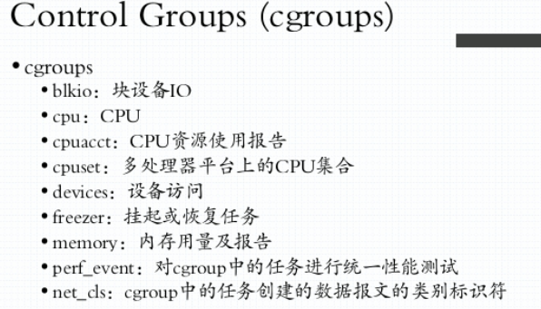

​	

​			

```
Control Groups(CGroups)：把系统级的资源分为多个组，把每一个的组内的资源的量指派分配到特定的用户空间的进程中去。
划分为不同的组之后，进行系统资源的分配。一个组内还可以进行细化为子组，把一个资源分配给一个组之后，这个组内的子组自动的拥有使用资源的权限。
如果把一个用户空间当做一个组，把资源分配给这个组，就可以限制这个用户空间的资源使用。
把一个资源分配一个用户空间，这个用户空间就自动的拥有了使用这个资源的能力。
```

容器技术由 Chroot，namespaces , CGroups 三种技术作为支撑的。

#### LXC（LinuX Container）

```
LXC 是最早把完整的容器技术，用一组简易使用的工具和模板来极大的简化容器使用的方案。
```


## 马哥 k8s 学习笔记

### DevOPS 核心要点及架构概述

```
Ansible:
	应用编排的工具，安装配置服务启动，甚至按照所定义的playbook 对多种的应用程序在有依赖关系的时候进行编排处理，把运维手动的处理运维任务 进行流程化，可编程化。

Docker:
	以往手工管理的对象是直接部署在操作系统上的应用程序，但是有了docker 之后，应用程序的容器化，各种的应用程序都封装在容器中运行，当在使用ansible这类的编排工具发现对象已经发生了变化，不能再像操作应用程序一样操作docker，所以docker 时代就需要面向容器化的编排的工具
	docker-compose: 更适合于单机的容器编排，只能面向一个docker host进行操作。
	docker-swarm: 可以将多个dockerhost 上运行的docker 容器，进行在同一平台的调度 编排。
	docker-machine: 将一个主机处理为加入docker swarm 集群的预处理工具。
	
	mesos: 是一个IDC的操作系统，能将一个IDC提供的硬件资源统一的调度与分配，他所面向的不是容器的接口，而是资源的分配工具。所以在此基础上需要一个面向容器的可编排的框架 marathon
	
	kubernetes:

DevOps:
	通过利用一些CI/CD（delivery, deployment） 工具，将开发，构建，测试，代码交付，运维部署的 过程自动化的完成，降低开发测试运维沟通成本，打通了开发和运维的边界，就是devops 的理念。
	容器技术的出现，使devops 完全成为了可能。devops 不是一种技术，是一种文化，一种运动。
	
	面对成千上万的容器，想要传统一样去管理监控处理存在故障的容器，基本不可能。所以需要容器编排的工具去进行管理。
```

**kubernetes简介**

```
kubernetes: 舵手
	kubernetes 的开发 深受Google 内部的 Borg系统的影响，Borg 是谷歌内部久负盛名的 容器管理工具。
	官方介绍的特性：
		1. 自动装箱，基于资源依赖及其约束能自动的完成容器的部署，不影响其可用性。
		2. 自我修复，由于容器非常轻量的特点，可以在1s内启动，有了k8s 这样的平台，运维更多的是关注的平台而非个体，一个个体的故障，会被重新销毁，重新分配。
		3. 水平扩展，一个容器不够，在启动多个
		4. 服务的发现和服务的负载均衡。
		5. 自动的实现发布和回滚
		6. 密钥和配置管理(之前的容器实现是 在容器	启动的时候 传入配置的环境变量值，获取一些配置)，k8s 会有配置对象，启动时候像从配置中心一样加载配置
		7. 存储编排
		8. 批量处理执行
	
	Redhat 的 openshift 可以看做为 kubernetes 的发行版，kubernetes 做的东西比较的底层。openshift 继承了 PAAS 平台以及devops 的环境。
```

**kubenetes 的环境架构和术语**

```
kubernetes 是一个集群，统一整合多个主机的资源，形成一个大的资源池，并对外提供计算存储能力的集群。

kubernetes 是一个 master/nodes(workers) 的架构的应用
	master 有一个或一组节点为主节点，一般为三个。彼此之间为了做高可用。
		API server：接受用户的请求
		scheduler：调度容器创建端请求
		controller-manager：确保控制器健康，而 controller 优势确保容器的健康。
	nodes 每一个都是为了贡献计算和存储资源，是运行容器的结点。
		kubelet: 创建删除管理pod
		docker engine：提供容器的运行基础环境
		kube-proxy: 时刻监听API server 的相关事件，一旦发现 某一个service关联的pod 的地址发生改变，对应的有kube-porxy 在本地的反应在 iptables或ipvs 上，service的管理需要 kube-proxy 来进行
	kubernetes进群所有信息的存储：
		etcd
	kubernetes 域名服务：
		core-dns
	
	用户如何在集群中运行容器：
		客户端的请求先发送给master ，由 api server 处理，分析用户请求的资源后，通过schedule 进行资源的分析调度到响应的结点，node 上的kubelet 在收到scheduler 的调度后，通过本机的容器引擎 启动容器，检查本机是否有响应的容器，没有的话 向docker registry 请求镜像。
		
		scheduler 提供了两级调度的算法，首先评估下 所有节点几个服务容器的运行需求，再从选出的节点优选出最佳（取决于调度算法的优选算法）。
		node  节点安装的kubelet 会对节点上的容器做 健康的检测
		controller 负责去监控管理的每个容器是否是健康的，一旦发现不健康，控制器向API server 发送请求，进行容器在其他节点的重建（scheduler调度进行）。控制器在本地不停的loop，持续性的探测管理的容器是否健康。一旦不符合用户定义的目标，使实际的结果不断的 吻合到用户定义资源的状态。
		master 上的 controller-manager 管理监控所有的控制器的健康。controller-manager 在master 做了高可用
	
	kubernetes 并不直接的调度容器，而是调度pod，pod是容器的集合抽象层（逻辑组件），pod内的容器有相同的网络命名空间（nets，UTS， IPC共享，user，MNT，PID藿香隔离）和存储卷。
	
在创建pod 的时候，会给pod 添加一些 metadata 数据，如：label，方便进行pod 的筛选和归类管理，这些标签是一些 kv 对，k8s 会通过 selector 标签选择管理器，进行pod 的操作。

```

### kubernetes 基本概念

```
Pod:
	1. 自主式pod，自我管理的pod，调用api server，由 scheduler 进行调度到节点，kubelet 创建容器，如果容器故障，kubelet 重新再节点创建，如果节点故障，容器则会消失。无法实现全局的调度
	2. 控制器管理的pod
		ReplicationController: 当pod 的数量不满足预期定义的个数的时候，由此控制器进行控制pod 的创建或销毁多余的副本
		ReplicaSet：此控制器不直接使用，需要 ReplicationController为基础
		Deployment: 声明式更新的控制器，只能管理无状态的应用
		StatefulSet: 有状态的控制器
		DaemonSet：没一个节点上只能运行一个副本，不能随意的运行
		Job：运行作业，不需要一直处于运行状态
		CrondJob: 周期性的计划作业
		HPA（HorizontalPodAutoscaler）：自动的根据pod的负载，资源使用情况进行pod 的创建或减小
```


```
service 的作用：
	由于pod的创建 销毁可能随时的进行，所以不能采用传统的访问pod IP的方式去直接访问pod内容器的应用，抽离出一个service 层，相当于一个VIP的作用，这个VIP在serveice 创建后不在进行变化，后端的pod 新增或销毁不影响服务的访问，只是添加新的iptables/ipvs 规则就行了，service是通过集群内部的DNS动态的添加解析到service ip，实现访问的。
	
kubernetes的三种网络：
	1. 节点网络，物理主机的网络
	2. service 网络，由iptables/ipvs 产生的虚拟的网络
	3. pod 的网络

kubernetes 中容器间的三种通信：
	1. 同一pod内的多个容器之间的通信: lo (网络名称空间相同)
	2. 各pod网络之间的通信（跨主机的话 使用overlay network 叠加网络）
	3. pod 与service 之间的通信（pod的网关配置为 本机的 docker0 的地址，网络包到达docker0后，由相应的iptables/ipvs进行转发，而集群中所有的iptables/ipvs的管理则由kube-proxy进行）
	
kubernetes 通过 CNI（容器网络接口）来接入第三方的网络插件，为kubernetes 集群提供网络支持。
	1. funnel：只支持网络的配置，是pod之间，pod和service 之间进行通信，不支持网络的策略的配置，纯粹的叠加网络实现
	2. calico: 即支持网络配置，又支持网络策略（使用BGP协议实现了直接路由通信），是一个三层的隧道网络
	3. canel: 结合 funnel 和calico
```

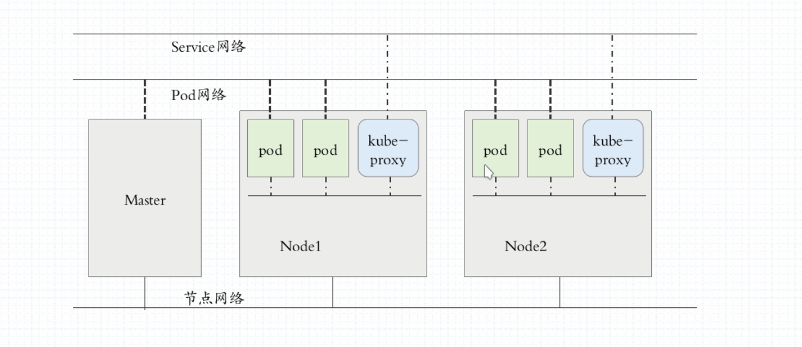

### kubernetes 架构图

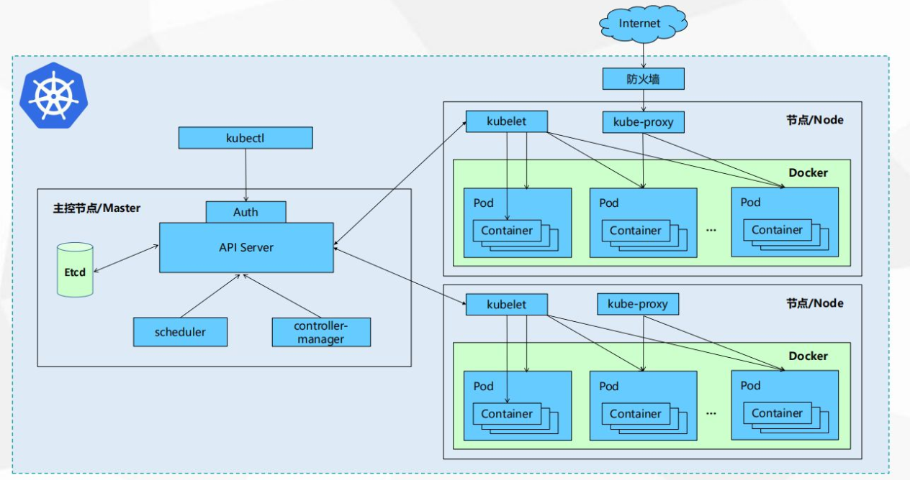

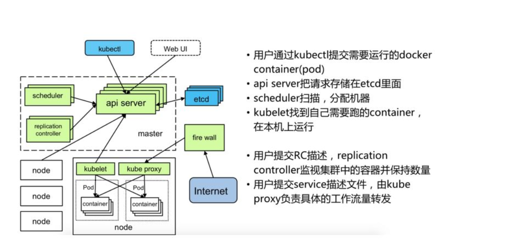

### kubeadm 初始化kubernetes集群


```
service 网络有kube-proxy 管理
pod 网络 由 flannel 管理（10.244.0.0/16 flannel 默认的）
```

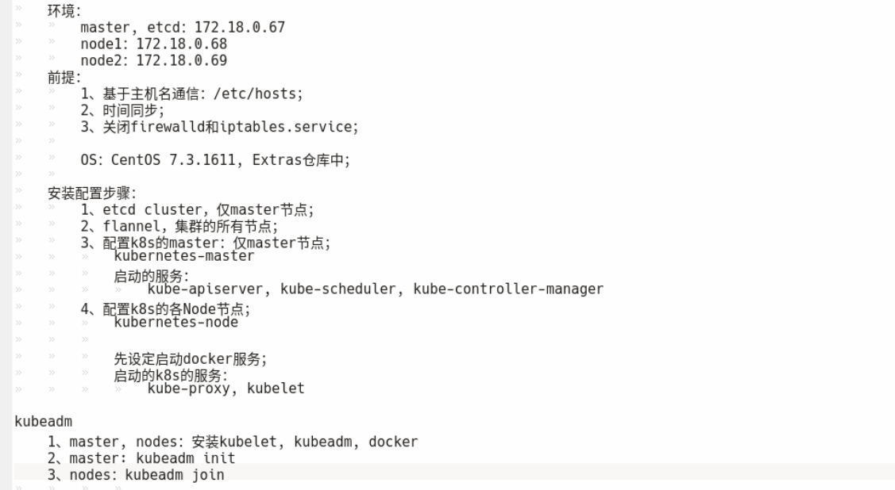

**配置kubernetes 阿里云源**

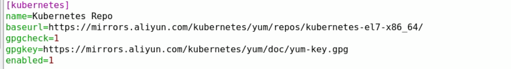

**安装基础的软件**


**导入gpg密钥**


**配置docker镜像代理服务**


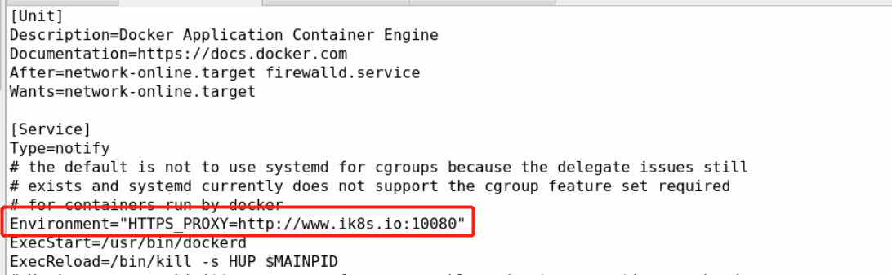


**确认桥接的 iptables 配置是否允许**

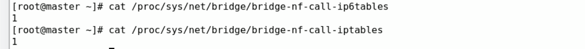

**配置当开启 swap 的时候要不要报错**


**pause容器的作用**


```
pause 是为了构建基础架构容器使用的，pause容器不启用，其他容器构建的时候加入复制这个容器网络和存储卷等提供功能。
pod 之所以能启动起来，是其他容器在pod内拥有相同的网络和存储，就是因为pod底层使用的是 pause 这个基础架构容器
```

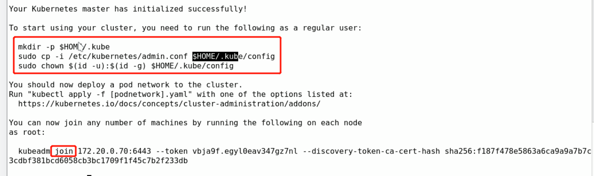

```
配置kubelet 连接kubernetes 集群的认证证书，以及向kubernetes 添加节点
```

**获取集群的组件状态信息**


**查看节点的状态**


```
之所以节点没有 ready ，因为集群的网络addon 没有安装好
```

**flannel 安装**

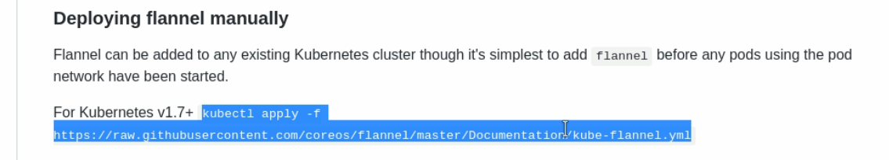

**查看系统的k8s的镜像需要制定 kube-system 的名称空间**

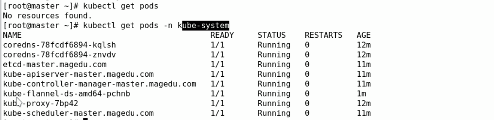

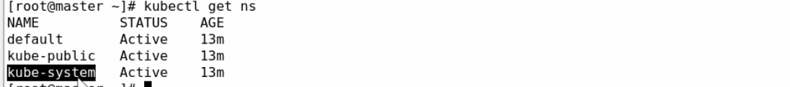

**查看集群的各组件的信息**


### kubernetes应用快速入门

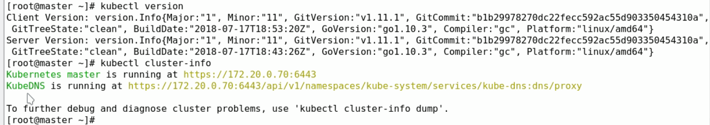

**创建pod**

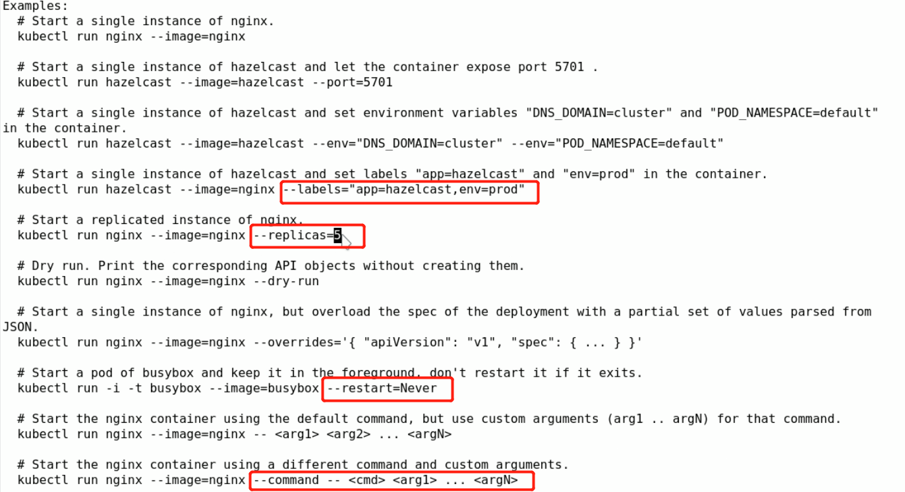


```
dry-run 不会真正的执行
```

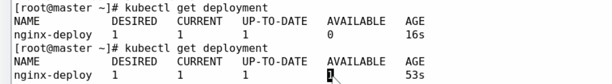

```
deployment 展示的是用户期望的资源设定情况
```


```
查看pod 的信息，及节点信息
```

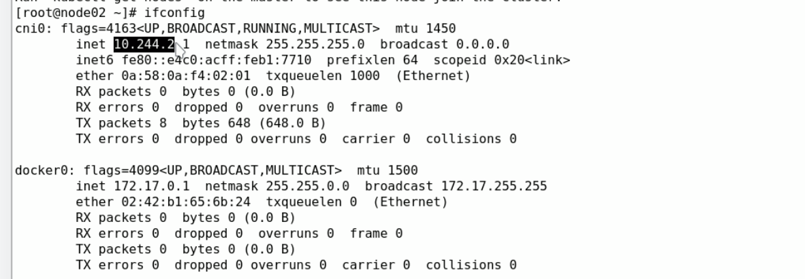

```
node02 上的pod都是 flannel cni0 网卡的 10.244.2 的网络ip
```

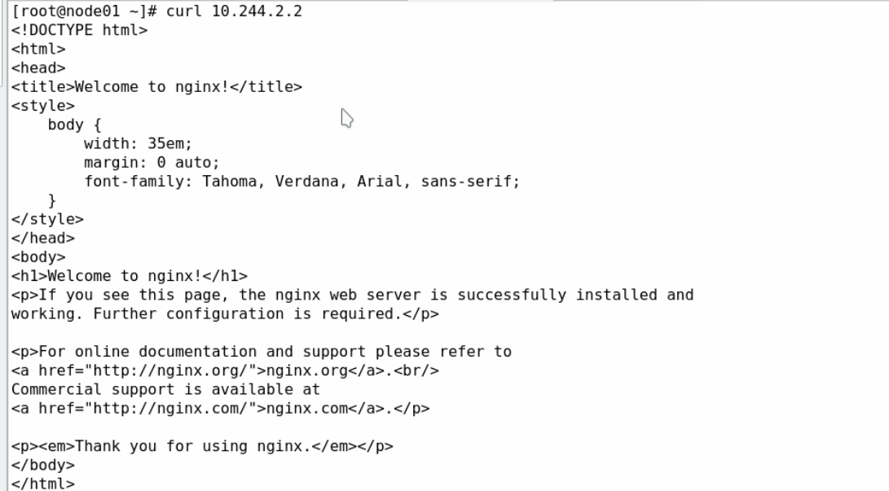

```
访问nginx的pod 地址，只能在kubernetes 集群的内部访问pod 的
```

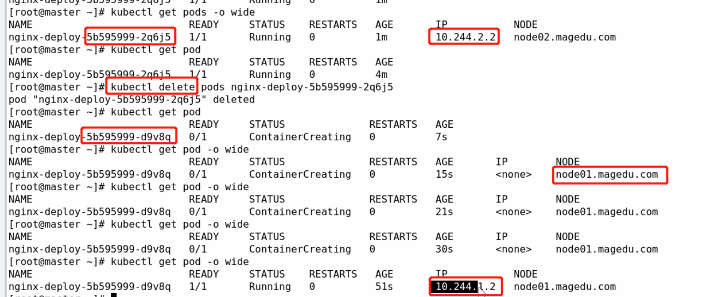

```
将原本在 node2 上的pod 删除了之后，由于nginx的pod 是由deployment 进行管理的，所以会在进行重新穿件，调度到了node01上了，此时的pod IP 变更为 10.244.1 了
```


```
kubectl run 指定的 --port 是 pod 的port
kubectl expose 创建服务的时候，--port 指定的是service的port
```


```
创建的service 的三种类型：
	ClusterIP：集群内部可以被访问
	NodePort: 会在每一个物理结点上创建映射端口，供集群外访问
	LoadBalancer:
```


```
expose 暴露哪个 deployment的服务
```


```
查看创建的service，为 10.96 的网络，类型为 ClusterIP，service 视为pod 提供 固定访问的端点的（endpoints）, ClusterIP 只能在集群内部的进行访问。
```


```
创建新的pod 的时候，他的DNS 自动的指向 coreDNS 的地址
```

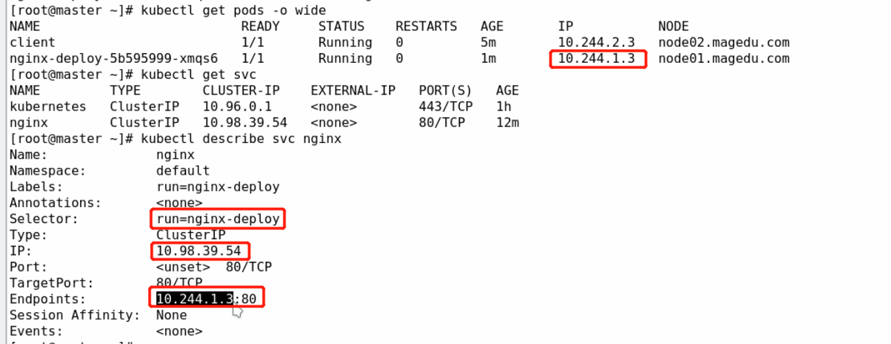

```
service关联的后端的节点为 10.244.1.3:80 
selector: 的标签为 run=nginx-deploy
```


```
10.244.1.3 这个pod 拥有 run=nginx-deploy 的标签，service通过这个标签来选择 nginx，通过这个标签来管理pod，监控pod的状态
```


```
-w  watch ，一直监控着状态的变化
```

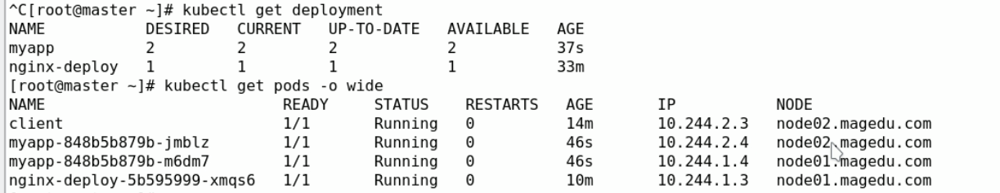

**创建myapp service**


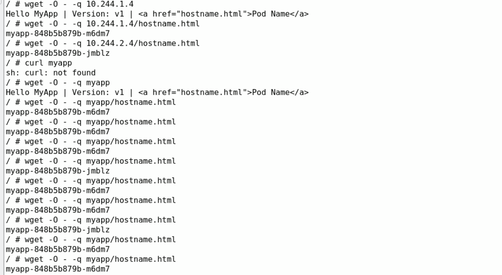

```
可以看到 两个副本，轮询访问
```

**持续进行pod 的访问**

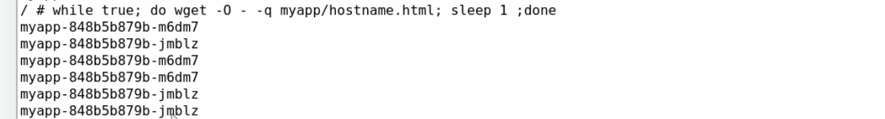

**扩展deployment 到5个**

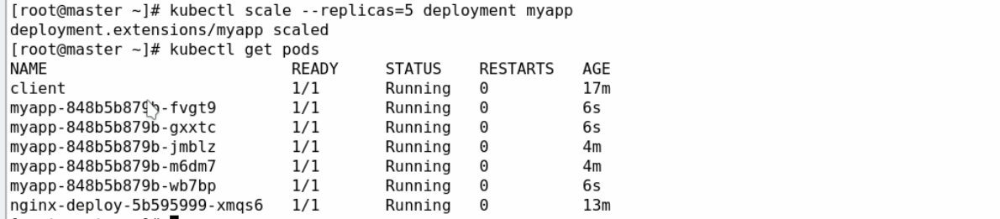

**升级容器镜像的版本**


```
先通过 kubectl describe pods  container_name   查看容器的名字
```


```
升级镜像到 v2
```

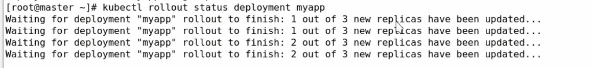

```
查看myapp 的升级的过程
```


**回滚deployment 的更新**

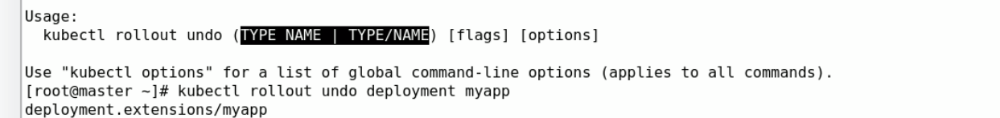


**edit myapp 的service **


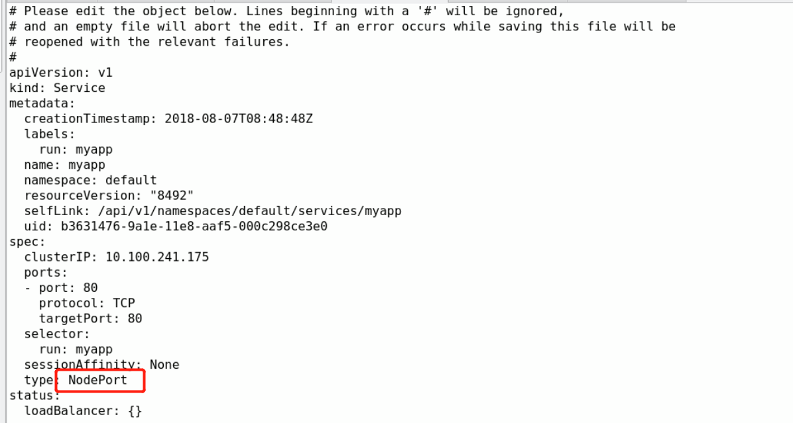

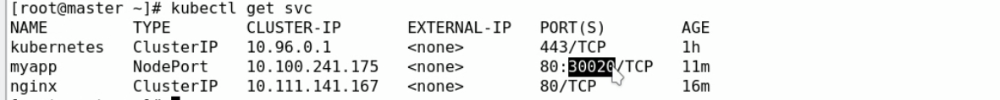


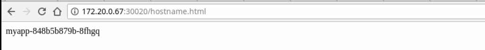

### kubernetes 资源清单定义入门

#### kubernetes 常用的资源

```
资源实例化后为一个对象。
1. 工作负载型的资源对象（workload）: Pod, ReplicaSet, Deployment, StatefulSet, DaemonSet, Job, Cronjob
2. 服务发现及均衡：Service， Ingress
3. 配置与存储：Volume，CSI接口
	ConfigMap: 当做配置中心使用的资源
	Secret： 敏感数据的配置
	DownwardAPI： 外部的信息输出给容器
4. 集群级的资源：
	NameSpace，Node，Role，ClusterRole，RoleBinding，ClusterRoleBinding
5. 元数据型的资源
	HPA：水平pod收缩
	PodTemplate: 用于让控制器使用的模板
	LimiRange: 定义使用的资源的限制
```

#### **pod 的资源配置清单**


```
apiVersion 的命名为 group/version, 当group 省略的时候，说明是core组的
kind 指定资源的类型
metadata 元数据
spec 资源的规格定义，定义自己创建的资源对象应该具有什么样的特性（目标期望状态）
```


```
容忍度，容忍哪些污点
```


```
status 显示当前资源的当前的状态
k8s 就是确保每一个资源定义完成后，从当前状态无限的向目标状态靠近，从而满足用户期望。
```

#### **创建资源的方法**

```
api server： 仅接受Json 格式的资源的定义，当使用 kubectl run 创建deployment的时候，会自动的把命令行的命令转换为json 的格式发送给 api server 进行资源的创建
yaml格式的配置清单，api server 可以自动的将其转换为json 格式，而后再提交执行。

大部分核心资源的配置清单组成：
	apiVersion: 指定创建的资源属于哪个api 组
	kind: 资源的类别（一般为内建的，但也支持自定义）
	metadata：元数据
		name: 同一类别中的name 必须唯一的，（实例化具体的对象了）
		namespace：这个对象属于哪个名称空间, 这个是kubernetes级别的概念，不是操作系统的namespace
		labels: 标签，每种类型的数据都可以有标签，键值数据
		annotations: 资源注解
	spec: 用户期望的状态，desired state 
	status: 当前的资源状态，current state，右kubernetes集群维护，用户不能自定义
		
清单定义的是声明式的api调用；
kubectl run 定义的是 命令式的api调用。
```

**k8s 的api 组**


```
pod 属于最核心的资源，所以属于 core/v1 群组
controller，deployment，RealicaSet 属于 apps/ 群组  （alpha 内测版本，beta 公测版本）
```

**K8S 中资源的引用**

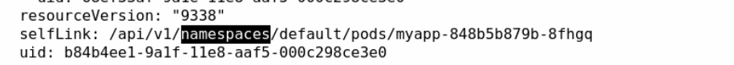

```
每个资源的引用的PATH
	/api/GROUP/VERSION/namespaces/NAMESPACE/KIND/NAME
```

#### **查看pods 资源的定义方式**


```
其中 为Object 的 可以在进行字段的嵌套
```

**查看metadata 定义方式**


```
map 是 KV组成的json数组
[]Object 定义为一个 对象数组
```


```
一级级的查看资源的定义方式
```

#### **定义资源清单的yaml文件**


```
labels 需要的是一个字典，（json的数组），可以使用上面的红框中的{} 进行定义，也可以使用app,tier 并行的方式进行定义（这里是映射的kv值）。注意: 这里app 前面没有 - ，加了 - 的为一个数组（列表）中的相同的类型的元素，所有的map 的可以使用 {} 进行定义，所有的 列表的可以使用 [] 进行定义。
```


```
containers; 字段定义为一个列表，使用 - 打头，
command 后面跟的也为 列表，也可以使用两种方式进行定义
```

#### **最终的定义的demo 的资源清单**


```
会创建两个容器在同一个pod内
```

#### **demo pod 的创建**


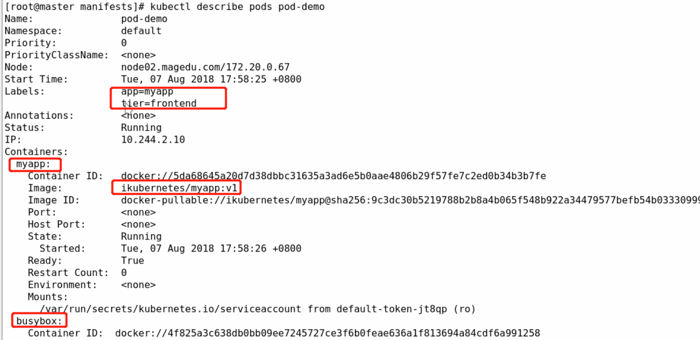

#### **查看pod 的日志**

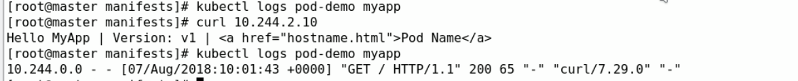


```
启动的busybox 容器报错
```

#### **进入到容器中**

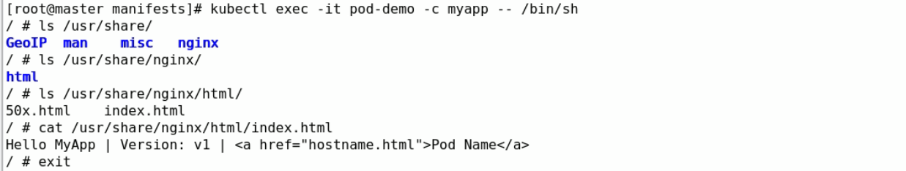

#### **根据清单删除pod**


### kubernetes Pod 控制器应用进阶

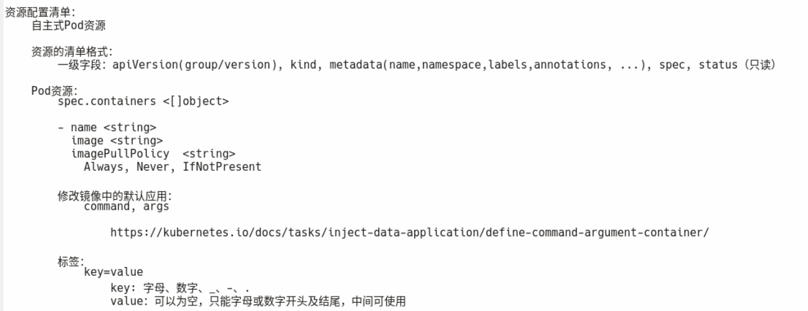


```
当拉取得镜像为 lastest 的时候，默认的拉取策略是always，可以设定为IfNotPresent 本地没有的话才进行拉取
```


```
args: 如果没有定义args，则默认使用docker镜像中 CMD 后面的参数，如果使用变量 引用 方式为 $(var_name) 或 逃逸转义 使用 $$(var_name)

command: 如果没有提供这个选项，则使用docker 自己的entrypoint， 这个参数不会提供 shell 环境，需要在shell 中运行 将 "/bin/sh" 作为command 的列表传入

如果只定义了command 则docker中的 entrypoint 和 CMD 都不会生效
```


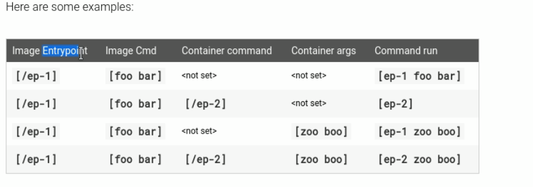

#### pod 标签过滤


```
-l 指定标签选择器，过滤pod
-L 根据指定的标签，显示出其含有的 值
```

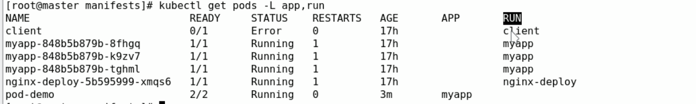

#### 给pod 打标签


```
标签已经存在 使用 --overwrite
```

#### 复杂的标签选择

```
kubernetes的标签选择器有两类：
	1. 基于等值关系的标签选择器
		==，= 表示相等
		!= 表示不相等
	2. 基于集合的标签选择器
		KEY in (VALUE1, VALUE2, VALUE3...)
		KEY notin (VALUE1, VALUE2, VALUE3...)
		KEY 存在此键
		!KEy 不存在此键
		
	3. 许多的资源支持内置字段定义其使用的标签选择器
		matchLables: 直接给定键值对
		matchExpressions: 
			基于给定的表达式来定义使用标签选择器，
			{key: "KEY", operator: "OPERATOR", values: [VAL1, VAL2, ...]}
			operator有：In, NotIn, Exists, NotExists
```

#### **等值类的选择**

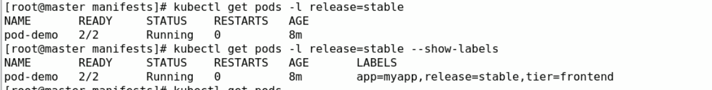

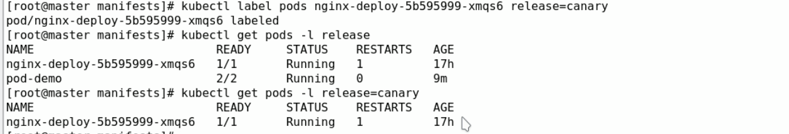


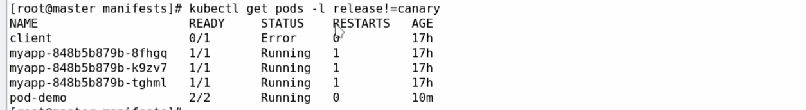

#### **集合类的选择**

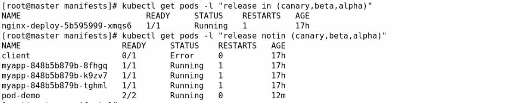

#### 任何资源都可以使用标签


```
nodes 节点的标签
```

#### **给node打标签**


```
nodeSelector <map[string][string]>
	节点标签选择器
nodeName <string>
	运行在指定的节点上
```

#### **使用标签选择器**


```
nodeSelector 是pod 的属性，所以与containers 属性为同一级别，这样这个pod就只会运行在 disktype=ssd的结点上了
```


```
运行在node1 节点上了
```

#### 资源注解annotations

```
annotations：
	与labels不同的地方在于，不能用于挑选资源对象，仅仅提供对象的元数据，它对字符串的长度（键长度和值长度限制）没有限制
```

**查看资源的注解**


#### 添加注解


#### Pod 的生命周期

```
pod 的状态：
	pending：已经创建但是没有适合它运行的节点，调度尚未完成
	running：正常运行的状态
	failed: 失败
	succeeded: 成功
	unknown：未知状态，api server 获知的 pod 的状态信息是kubelet 提供的，如果 kubelet故障，则无法获取状态
```


```
init container: 初始化的容器，可以存在多个，之间线性的执行
main container: 主容器，在init container 启动后执行，主容器可以做post start 启动后的钩子，和停止前的钩子，还可以在运行过程中做容器的健康性的检测（liveness probe, readiness probe）
	健康性探测：
		liveness probe: 存活性探测主要探测主容器是否存活
		readiness probe: 就绪性探测主要探测主容器是否准备就绪，并可以对外提供服务
	无论哪种probe 可以有三种探测行为：
		1. 执行自定义的命令 
		2. 向指定的tcp套接字发送请求 
		3. 向指定的http服务发送请求）

pod 生命周期的重要的行为：
	1. 初始化容器
	2. 容器探测
	3. post start/pre stop 钩子

lifecycle: 这个containers的下属配置项，定义生命周期定义启动前和启动后的钩子
```

#### Pod容器的重启策略

```
restartPolicy:
	1. Always   一旦挂了就重启（default）
	2. OnFailure  只有容器的状态为错误是才重启，正常停止的不重启
	3. Never   从不重启
第一次重启，终止后就立即重启，再出现错误，就会延时进行重启，终止后等10s再重启，第三次 等20s，第四次，等40s..., 300s 为最长的等待时间，之后都是等300s 进行重启

一旦一个pod 调度到某个节点之后，只要这个节点存活，发生错误时，这个pod就不会重新进行调度，只会进行重启，除非这个pod删除重新创建或节点挂了
```

#### Pod 的创建过程

```
创建pod:
	用户创建pod 的时候，请求交由api server，api server 保存定义的pod 期望状态的清单到etcd 中，api server之后会请求scheduler 进行调度，调度后的结果（调度到哪个节点，ip 等等信息）更新到etcd 中；此时相应的节点的 kubelet 通过api server获得到有pod创建的请求时，从etcd拿到创建的期望的清单，进行pod 的创建。再把创建的结果无论成功与失败发送给api server ,api server 再存储到etcd中。
```

#### Pod内的容器终止逻辑

```
pod一旦发成故障的时候应该进行平滑的迁移，侧能确保数据不会丢失
kubernetes 在提交删除pod 的操作时，不会直接kill掉 整个pod的容器，而是想pod内的每个容器发送 term(15) 的终止信号，让pod内的容器正常的进行终止，这个终止有个默认的宽限期（比如30s），如果宽限期内还没有终止，会重新发送kill信号
```

#### 主容器probe的配置

```
探针针对的是容器之上，是containers 的下属配置项
探针有三种的类型：
	ExecAction:
	TCPSocketAction:
	HTTPGetAction:


```


```
exec 探测命令执行的返回码 为0 则成功
```

**定义的探测示例**

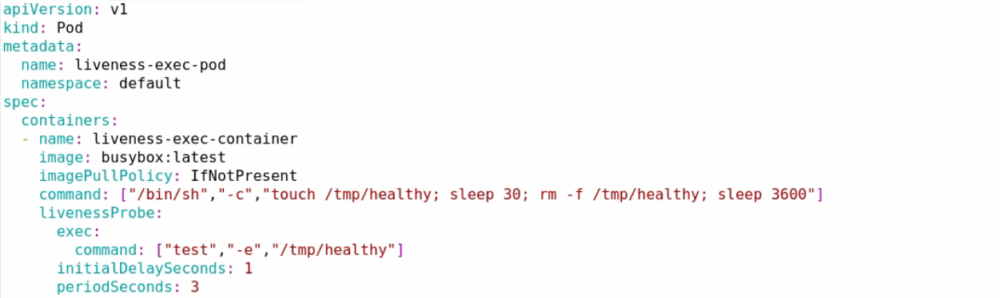

```
initalDelaySeconds 在容器启动多少秒之后再进行探测
periodSeconds 探测的周期
```

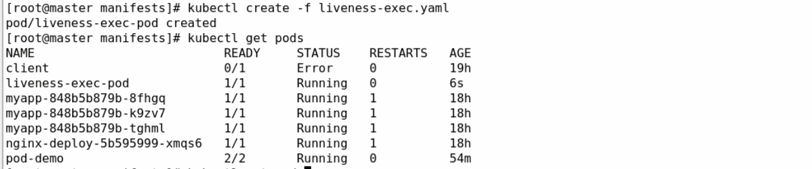

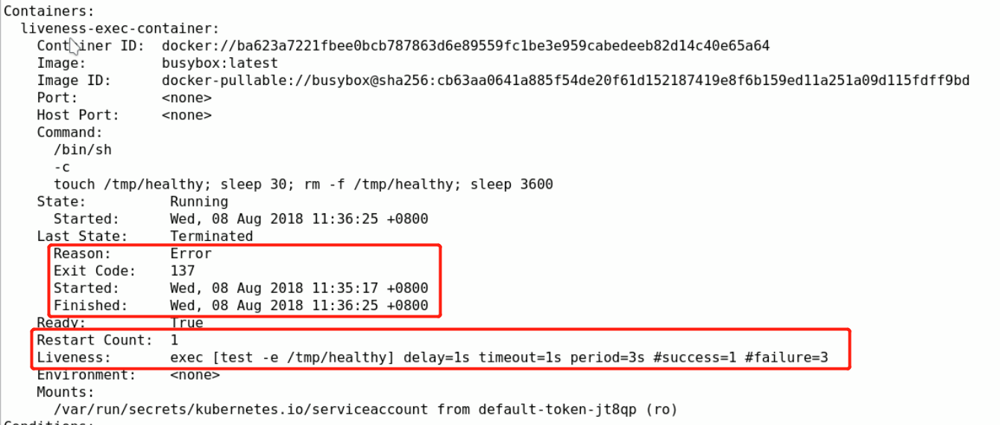


**http get 探测**


**删除主页文件**


**可用性探测**


```
一旦就绪 READY 会变化
```


#### lifecycle 钩子


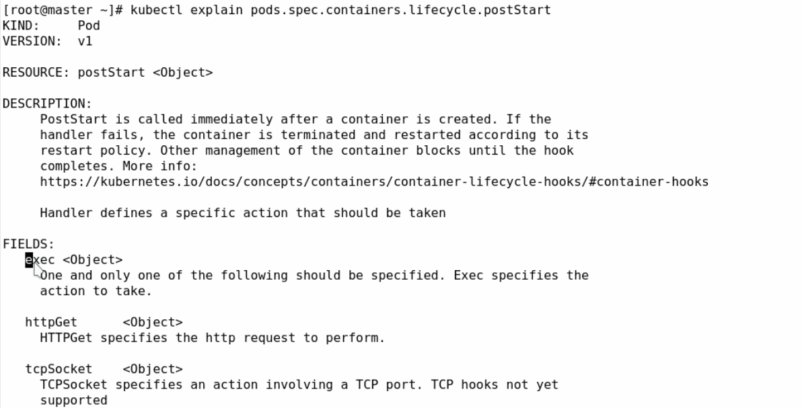


```
postStart 和preStop 同样也有三种的执行行为
```

**示例清单**


```
lifecycle 在容器启动之后执行创建 httpd home 文件index.html
command 指定容器启动后执行的 httpd 服务
args 执行 httpd 启动的一些参数，-f 前台运行，-h 执行家目录位置
```


```
上面的图片的配置是无法创建成功的，因为 容器的command 命令运行 httpd 服务的时候需要 /data/web/html 而此时 这个文件还没有创建，所以一直报错
```

#### Pod 控制器

```
RealicationController: 
ReplicaSet:	新一代的 RealicationController
	是用户创建的pod副本一直满足于用户的期望数量，支持扩缩容机制
Deployment： 
	工作在 ReplicaSet 之上，通过控制 ReplicaSet 控制pod, 比ReaplicaSet 有更多的功能，额外支持滚动更新，回滚
DaemonSet: 
	用于确保集群中的每一个的节点运行一个副本，比如日志收集的filebeat agnet 类的服务，通常为 系统级的后台任务，只要新增节点都会添加相应的DaemonSet 定义的pod
	只适用于无状态的应用, 
Job：
	只适用于只执行一次作用
CronJob:
	定时的执行任务
StatefulSet:
	有状态的，有数据的，不能随意启动一个副本替代的

TPR: Third Party Resources, 1.2+ - 1.7	第三方资源
CDR: Custom Defined Resources, 1.8+  用户自定义资源

Operator: 把运维技能灌输进来
```

**RC 与 RS**


#### ReplicaSet 清单的创建

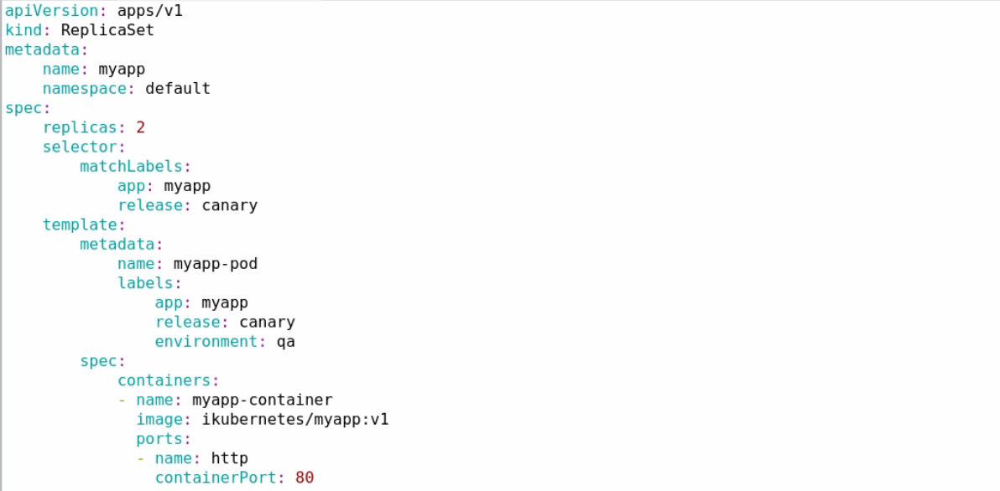

```
ReplicaSet 通过 selector 去管理pod，查看pod 的数量，监控
template 下面定义的是 pod 的一些信息，其中 metadata 的labels 必须含有 RS 中 selector 的标签，要不然 RS 发现，没有相应的标签会一直进行创建。
```


```
pod 的命名方式为 控制器 RS的名称，加上一个随机的字符串
```

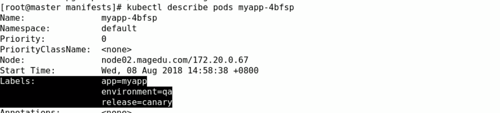

**直接编辑RS的资源**

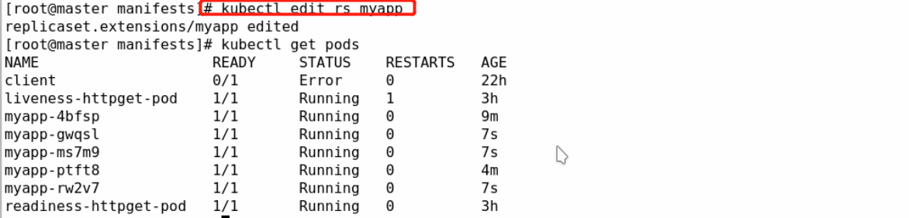

```
把replicas更改为5个
```

**更改容器的版本为v2**

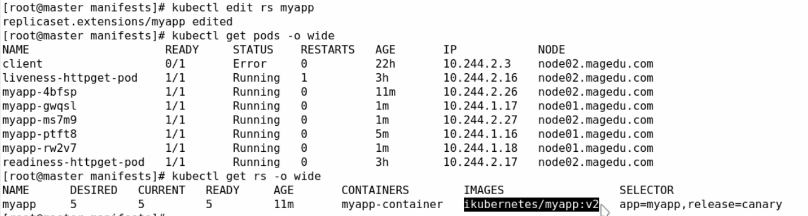


```
此时的pod 的依然为v1， 只有在重建是才为 v2
```

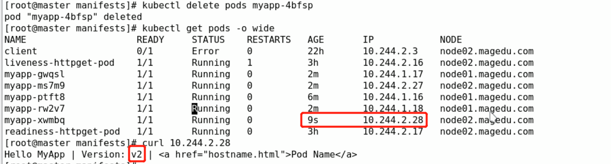

```
此时就可以人为的 手动的删除响应的pod，自动创建后为新版白的，进行金丝雀（灰度）的发布。

蓝绿部署：新建另一个RS部署完成后，再把service导入到部署完成后的服务
```

**deployment 实现的滚动发布**


```
在v2 版本的所有pod 创建完成后 RS v1 并不会删除，便于回滚
```


```
一个Deployment 可以管理多个的 RS，只有一个RS 处于活跃的状态，默认保留10个 RS版本
Deployment 还可以控制更新的节奏和更新逻辑
```

#### Deployment 更新策略


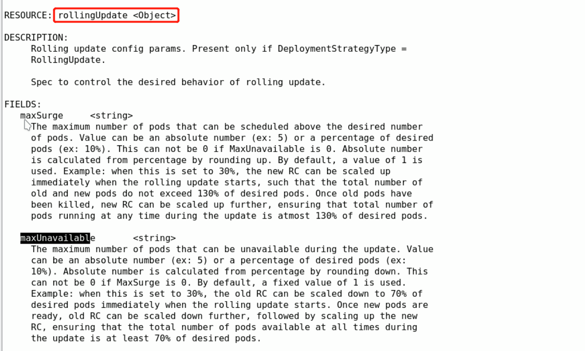

```
rollingUpdate: 
	maxSurge: 更新过程中，最多超出目标副本数几个，可以使用数量个 百分比
	maxUnavailable: 最多可以有多少个不可用
```

#### Deployment 清单配置

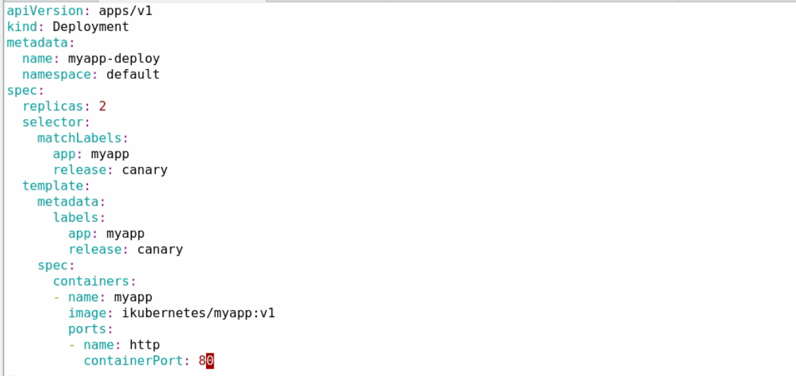


```
apply 是一种 声明式更新，既可以创建，也可以更新，可以执行多次，不像create 创建一次，在创建会报错
```


```
deployment 的名称是在 配置清单中定义的
rs 由 deployment 创建，它的名字由 deployment的名字，加上 模板（template）清单的哈希值 进行定义
pods 的名字则由 rs 的名字，后面跟上随机的字符串
```


```
更改副本为3个，可以看到 RS的名字的hash 值没有变化，因为 deployment中的 template 定义没有变化
```


```
annotations 在每次的更新之后，会记录版本的变化
默认的更新策略为 RollingUpdate
```

#### **更改配置文件为v2**


```
重新apply 改动，进行更新
```


```
创建新的 pod 进入到 pending 状态，可以看到RS的名字 改变了，因为 模板（template）进行了变动，hash值改变
```


```
老版本的 RS 仍然还在，方便回滚
```

#### **查看Deployment myapp-deploy 的历史版本**


#### 通过 patch 的方式更新


#### 使用pause 在更新一个后暂停更新


```
可以看到 在更新一个后，暂停更新，模拟了金丝雀发布。
```


```
使用 rollout status 也可以查看 更新的状态
```

#### 使用 resume 更新其余的


```
看到 所有的都更新到了 v3 版本
```

#### rollout undo 进行版本的回滚


```
回滚到第一版之后，在回滚则回滚到上一版则是 第三版本
```


#### DaemonSet的清单配置


```
kind 的类型为 DaemonSet 
使用的镜像为 filebeat，这个镜像需要存在环境变量 REDIS_HOST 和 REDIS_LOG_LEVEL
```


```
可以看到创建了分割的 ds 的pod，因为 worker节点有两个，master节点允许创建pod
```

#### 多个相关联的pod 定义在一个资源清单文件中


```
使用 --- 进行隔开
```

#### 对DaemonSet 资源进行更新


### k8s 中的Service 资源

```
为了个客户端提供固定的访问端点，在客户端和服务pod 之间添加了固定的中间层，这个中间层为 service，这个service 严重的依赖于在k8s 集群上安装的 coreDNS 服务。
service的 名称解析强依赖与 coreDNS。

kubernetes 要想向客户端提供网络功能，需要依赖于第三方的网络方案，这个第三方的方案可通过CNI 容器网络插件提供的标准接口，接入遵循这种接口标准的第三方网络方案。

kubernetes 中的三种网络：
	1. node network
	2. pod network
	3. cluster network(service network)
	前两种都是实实在在的配置在 网卡接口上（无论是物理网卡还是虚拟网卡），而service 网络是 virtual ip，由iptables 或 ipvs 实现数据包的转发路由。
```


```
在节点上安装的 kube-proxy 时刻的watch master结点的 api servver 关于 service 资源的变化，如果存在变化，则会在节点进行 iptables 或 ipvs 的规则的创建。
```

#### service 实现的三种方式

```
service的实现模式：
	1. userspace 在用户空间依靠kube-proxy 进程代为转发，当然也依赖于iptables 规则，过于低效。1.1版本之前
	2. iptables  从用户空间转向内核空间，1.10版本之前
	3. ipvs 1.11 版本后默认使用ipvs
```

1. **userspace 方式**

   

   ```
   client的请求到达 service 后，service 转发到本地节点 kube-proxy 监听的套接字，然后再由kube-proxy 转发请求到service，service 在代理到 服务pod 的kube-proxy 再由其转发到相应的节点。
   这种方式的效率很低，因为先要到内核空间，再到用户空间，再要到内核空间，用户空间和内核空间之间相互转换。
   ```

2. **iptables 方式**

   

   ```
   client 的请求直接请求service ip，被本地的内核中的 iptables 的规则所截取，进而直接调度给 service 后端相应的 pod。
   这种方式 直接工作在 内核空间，由iptables 规则进行调度。
   ```

3. **ipvs**

   

   ```
   使用 ipvs 替换了iptables 的进行 报文的转发。	
   ```

```
如果某个服务后面的pod资源发生了改变，比如 service 的抱歉选择器适用的版本有多了一个pod，这个pod 的适用的信息会立即反馈到 api server上，kube-proxy 一定会watch 到这种变化，并立即转换为结点的 iptables/ipvs 规则。
```

#### 创建service 资源


```
ndoePort 节点的端口
port	向外暴露的端口
targetPort  容器的端口
```

**service 的配置清单**


```
type: 指定service 的类型，默认就位 ClusterIP
clusterIP 最好不要指定，让集群自动分配
```


```
selector 通过标签的匹配，得出到 后端的 endpoints 为 10.244.1.32::6379

实际上 service 不是直接到 pod 资源的，中间还有个 endpoint 资源（就是 ip:port）,实际上可以手动的创建 endpoint 资源。
```

#### DNS的资源记录格式

```
资源记录：
	SVC_NAME.NS_NAME.DOMAIN.LTD
	
	kubernetes 默认的域名后缀：svc.cluster.local.
	redis 在 default 的名称空间中的：
		redis.default.svc.cluster.local.
```

#### 创建NodePort 类型


```
指定 type为 NodePort 
nodePort 最好不要指定，会进行动态分配
selector 指定 标签 app=myapp,release=canary  就可以选择所有的 myapp 的pod
```


```
集群外进行访问，可以看到 myapp 的进行负载均衡
```

#### LoadBalancer 


```
LoadBalancer 是比如在 阿里云 购买了 VPS 主机部署了 kubernetes 集群，这个 kubernetes 集群可以与底层的 公有云IAAS进行交互，调用底层的IAAS的底层的云计算的API，请求创建一个 外置的 负载均衡器（LBAAS服务提供），在创建 SLB的过程中 提供 后的的NodePort 的ip和端口，自动映射到相应的后端服务。 
```

#### ExternalName 


```
ExternalName 一定要能被 DNS 服务所解析
```


```
extrtnalName 是一个CNAME
```

#### 开启 sessionAffinity


```
改动之后，相同的IP之后请求到同一个后端服务，默认置为 None
```


#### headless service 

```
service 的地址不在是 clusterIP, 而是直接到后端的 PodIP 
```


```
地拽 clusterIP 为 None 的时候，则为 headless service
```

**headless 清单配置**


```
service 的名字更改为 myapp-svc, clusterIP 置为 None
```


**查看myapp-svc service 的解析地址**


**CoreDNS 记录着集群的DNS的解析**


### kubernetes ingress 及 ingress controller

#### **开启ipvs 负载**


```
service的四种类型：
	1. ClusterIP ：只能在集群的内部进行访问
	2. NodePort: 
		client -> NodeIP:NodePort -> ClusterIP:ServicePort -> PodIP:containerPort
		这种方式需要将流量接入到 集群的所有的NodeIP 上分散请求压力。在NodeIP 和NodePort 之前添加 负责局衡器。
	3. LoadBalancer: 只有在公有云上才能使用，并支持LBAAS, k8s 就可以调用IAAS底层的 api来创建负载均衡
	4. ExternalName： 把集群外部的服务映射进集群内部，当pod 需要访问集群外部的服务的时候
		FQDN 的名称：主机名或域名，通常是别名记录
			CNAME 记录 -> 真正的FQDN
			内部定义个内部的名称，经CoreDNS 解析后CNAME到 真正的外部服务的地址

No ClusterIP : Headless Service 
	会把servername 直接解析到 PodIP ,本来应该解析到，serviceIP（clusterIP） 的。
```

#### kubernetes 中的七层代理实现

```
可以看到 service 是四层的调度，无论是iptables 还是 ipvs 都是在四层进行调度，工作在TCP/IP 协议栈，如果用户访问的是http请求，那么service 就很难进行负载。
```

```
进行这样的假设: 服务经过LVS进行负载，后端是http 的服务，那么配置https 服务的时候，就必须把 ssl 的证书配置在 后端的服务上，因为LVS 是四层的调度，无法对七层的数据包进行解析。

客户端建立连接是与LVS进行的，而ssl 的会话却要与后端的服务进行，所以证书的域名解析 到底是配置在 LVS的 VIP还是后端的主机服务，就会出现问题。
由于调度器LVS 无法解析ssl会话，客户端必须要与后端的服务建立ssl会话，但是当下次请求到下一台的机器的时候，之前建立的ssl会话将失效。

所以使用 七层的负载均衡器 替代 LVS，由七层的负载均衡器作为卸载器解出ssl 会话，然后后端进行http 的连接
```

**实现方案一**


```
客户带访问 外部的 LB，调度到kubernetes 的节点后（service 实现的nodePort类型，负载 代理的pod），每个节点存在一个 pod 专门负责七层的代理，负责代理到后端的pod服务上
```

**实现方案二**

```
让七层代理的pod 共享Node节点的网络名称空间（namespace），就可以省掉 service的 代理层，边界流量直接就可以进入到 七层代理的pod。
容器共享宿主机的网络名称空间之后，容器内的进程，监听的socket 就是宿主机的socket
```


```
这样就要求 七层代理的pod 在每一个的节点上都运行，这个时候 DaemonSet 控制器就可以有用武之地了，在kubernetes 中的每个节点都运行 七层代理pod，如果集群的集群 比较多，可以给特定的节点打上污点，指定运行的代理pod 的节点，别的pod 不能运行在有这些污点的机器上。
```

**最终方案**


```
这个代理http流量的pod 被称为 ingress controller
ingress controller 是独立运行的一组 pod资源，通常就是一组应用程序，拥有七层调度代理能力的应用。
ingress 服务，有三种选择：
	1. nginx
	2. traefik
	3. envoy(微服务倾向使用envoy)
```

#### ingress 实现


```
ingress 和 ingress controller 是不同的两个概念，我们在定义ingress 的时候回定义我们期望的ingress controller 是如何给我们建立一个前端（可能是虚拟主机或基于URL的映射），又会定义一个后端（upstream server）, 后端pod 的服务资源。后端的upstream server 有多少个主机，是由定义的 后端 pod 的service知道的，这个service没有流量调度的功能，只是为了通过标签确定 后端upstream server 的个数和ip.

ingress 的作用是：一旦ingress 通过service 发现后端的pod 的资源发生了变化，这个改变会及时的反应到ingress 上，ingress 会及时的注入到 upstream 的配置文件中。
如果是nginx 配置文件注入后需要进行重载，而 traefik 和envoy 天生为微服务而生则不需要重载，可以自己监控配置文件变化进行重载。
```

```
要想在kubernetes使用七层的代理：
	1. 部署ingress controller
	2. 根据自己的需要，是使用虚拟主机的方式还是 URL映射的方式配置前端，再根据service 收集到的后端的pod 的IP 定义成upstream反应在ingress中，由ingress 动态的注入到ingress controller 中
```


```
其中的<service> ingress-nginx 负责外部的流量导入到ingress controller，可以去除，使用DaemonSet 资源去运行 代理的pod，pod资源的网络设置为 host network的方式
ingress 通过 <service> site1 和 <service> site2 获取后端 site1 和 site2 的后端资源，注入到 ingress controller 进行流量的调度。

<service> site1 和 <service> site2 不会再调度的时候使用，只会去根据标签确定后端pod 的ip
```


```
rules 定义 ingress controller 的调度规则
```


```
rules 定义 host 和http，及使用虚拟主机 或 URL的映射方式进行调度
```


```
backend 是定义后端 关联的 service 资源，由此知道后端的所有的pod资源
```

#### 配置ingress controller

**下载需要的文件**


##### kubernetes 创建名称空间

**命令行创建名称空间示例**


##### **直接apply 下载的清单 文件**


**或者直接执行 mandatory 文件**

```
apiVersion: v1
kind: Namespace
metadata:
  name: ingress-nginx
  labels:
    app.kubernetes.io/name: ingress-nginx
    app.kubernetes.io/part-of: ingress-nginx

---

kind: ConfigMap
apiVersion: v1
metadata:
  name: nginx-configuration
  namespace: ingress-nginx
  labels:
    app.kubernetes.io/name: ingress-nginx
    app.kubernetes.io/part-of: ingress-nginx

---
kind: ConfigMap
apiVersion: v1
metadata:
  name: tcp-services
  namespace: ingress-nginx
  labels:
    app.kubernetes.io/name: ingress-nginx
    app.kubernetes.io/part-of: ingress-nginx

---
kind: ConfigMap
apiVersion: v1
metadata:
  name: udp-services
  namespace: ingress-nginx
  labels:
    app.kubernetes.io/name: ingress-nginx
    app.kubernetes.io/part-of: ingress-nginx

---
apiVersion: v1
kind: ServiceAccount
metadata:
  name: nginx-ingress-serviceaccount
  namespace: ingress-nginx
  labels:
    app.kubernetes.io/name: ingress-nginx
    app.kubernetes.io/part-of: ingress-nginx

---
apiVersion: rbac.authorization.k8s.io/v1beta1
kind: ClusterRole
metadata:
  name: nginx-ingress-clusterrole
  labels:
    app.kubernetes.io/name: ingress-nginx
    app.kubernetes.io/part-of: ingress-nginx
rules:
  - apiGroups:
      - ""
    resources:
      - configmaps
      - endpoints
      - nodes
      - pods
      - secrets
    verbs:
      - list
      - watch
  - apiGroups:
      - ""
    resources:
      - nodes
    verbs:
      - get
  - apiGroups:
      - ""
    resources:
      - services
    verbs:
      - get
      - list
      - watch
  - apiGroups:
      - ""
    resources:
      - events
    verbs:
      - create
      - patch
  - apiGroups:
      - "extensions"
      - "networking.k8s.io"
    resources:
      - ingresses
    verbs:
      - get
      - list
      - watch
  - apiGroups:
      - "extensions"
      - "networking.k8s.io"
    resources:
      - ingresses/status
    verbs:
      - update

---
apiVersion: rbac.authorization.k8s.io/v1beta1
kind: Role
metadata:
  name: nginx-ingress-role
  namespace: ingress-nginx
  labels:
    app.kubernetes.io/name: ingress-nginx
    app.kubernetes.io/part-of: ingress-nginx
rules:
  - apiGroups:
      - ""
    resources:
      - configmaps
      - pods
      - secrets
      - namespaces
    verbs:
      - get
  - apiGroups:
      - ""
    resources:
      - configmaps
    resourceNames:
      # Defaults to "<election-id>-<ingress-class>"
      # Here: "<ingress-controller-leader>-<nginx>"
      # This has to be adapted if you change either parameter
      # when launching the nginx-ingress-controller.
      - "ingress-controller-leader-nginx"
    verbs:
      - get
      - update
  - apiGroups:
      - ""
    resources:
      - configmaps
    verbs:
      - create
  - apiGroups:
      - ""
    resources:
      - endpoints
    verbs:
      - get

---
apiVersion: rbac.authorization.k8s.io/v1beta1
kind: RoleBinding
metadata:
  name: nginx-ingress-role-nisa-binding
  namespace: ingress-nginx
  labels:
    app.kubernetes.io/name: ingress-nginx
    app.kubernetes.io/part-of: ingress-nginx
roleRef:
  apiGroup: rbac.authorization.k8s.io
  kind: Role
  name: nginx-ingress-role
subjects:
  - kind: ServiceAccount
    name: nginx-ingress-serviceaccount
    namespace: ingress-nginx

---
apiVersion: rbac.authorization.k8s.io/v1beta1
kind: ClusterRoleBinding
metadata:
  name: nginx-ingress-clusterrole-nisa-binding
  labels:
    app.kubernetes.io/name: ingress-nginx
    app.kubernetes.io/part-of: ingress-nginx
roleRef:
  apiGroup: rbac.authorization.k8s.io
  kind: ClusterRole
  name: nginx-ingress-clusterrole
subjects:
  - kind: ServiceAccount
    name: nginx-ingress-serviceaccount
    namespace: ingress-nginx

---

apiVersion: apps/v1
kind: Deployment
metadata:
  name: nginx-ingress-controller
  namespace: ingress-nginx
  labels:
    app.kubernetes.io/name: ingress-nginx
    app.kubernetes.io/part-of: ingress-nginx
spec:
  replicas: 1
  selector:
    matchLabels:
      app.kubernetes.io/name: ingress-nginx
      app.kubernetes.io/part-of: ingress-nginx
  template:
    metadata:
      labels:
        app.kubernetes.io/name: ingress-nginx
        app.kubernetes.io/part-of: ingress-nginx
      annotations:
        prometheus.io/port: "10254"
        prometheus.io/scrape: "true"
    spec:
      serviceAccountName: nginx-ingress-serviceaccount
      containers:
        - name: nginx-ingress-controller
          image: quay.io/kubernetes-ingress-controller/nginx-ingress-controller:0.25.0
          args:
            - /nginx-ingress-controller
            - --configmap=$(POD_NAMESPACE)/nginx-configuration
            - --tcp-services-configmap=$(POD_NAMESPACE)/tcp-services
            - --udp-services-configmap=$(POD_NAMESPACE)/udp-services
            - --publish-service=$(POD_NAMESPACE)/ingress-nginx
            - --annotations-prefix=nginx.ingress.kubernetes.io
          securityContext:
            allowPrivilegeEscalation: true
            capabilities:
              drop:
                - ALL
              add:
                - NET_BIND_SERVICE
            # www-data -> 33
            runAsUser: 33
          env:
            - name: POD_NAME
              valueFrom:
                fieldRef:
                  fieldPath: metadata.name
            - name: POD_NAMESPACE
              valueFrom:
                fieldRef:
                  fieldPath: metadata.namespace
          ports:
            - name: http
              containerPort: 80
            - name: https
              containerPort: 443
          livenessProbe:
            failureThreshold: 3
            httpGet:
              path: /healthz
              port: 10254
              scheme: HTTP
            initialDelaySeconds: 10
            periodSeconds: 10
            successThreshold: 1
            timeoutSeconds: 10
          readinessProbe:
            failureThreshold: 3
            httpGet:
              path: /healthz
              port: 10254
              scheme: HTTP
            periodSeconds: 10
            successThreshold: 1
            timeoutSeconds: 10

---
```

```
https://github.com/kubernetes/ingress-nginx/blob/master/docs/deploy/index.md

kubectl apply -f https://raw.githubusercontent.com/kubernetes/ingress-nginx/master/deploy/static/mandatory.yaml
```

**查看创建的ingress 的pod** 


##### 准备部署后端pod 服务 和service


```
下面图片的service 的配置 少了 port: 80
```


**部署后的服务**


##### 定义导入外部流量到 ingress 的service


```
这个service 的selector 为 ingres-nginx 的标签的pod 服务
```


**集群外部访问 这个 为 ingress 导入流量的service**


```
此时 ingress-nginx 的pod 并没有与后的的pod 的服务建立起连接
```

#### 把myapp的代码通过ingress 发布出去

**ingres-myapp ingress配置清单**


```
kind: 为ingress
名称空间需要和 后端的pod服务（deployment）和pod 的负载的service 所在的名称空间一样
annotations: 指定ingress 的实现的方式 nginx，traefik，envoy等，键名必须是 kubernetes.io/ingress。class
rules: 指定请求的转发规则
path: 指定访问的路径，空 默认访问 / 根路径
backend: 
	serviceName : 指定后端pod 关联的service 名称
	servicePort: 创建 service的时候，指定的service 的负载端口
通过 service name 的 myapp 与相应的myapp的pod 服务相关联
```


**如果定义的是虚拟主机而不是URL映射**


```
直接在 rules.host 这一层及进行定义
```

##### 查看创建的ingress 的信息


##### ingress 一旦应用自动注入后端的服务

**进入到七层代理的ingress-nginx 的pod 查看nginx的配置**


**nginx的配置文件**


```
自动生成的 后端myapp 的 upstream配置到 nginx
```

**添加本机的 myapp.magedu.com 解析到 ingress的外部流量导入的service（NodePort类型） **


#### 使用ingress 部署 Tomcat服务

**部署Tomcat 的 deployment 资源和service 资源**


**ingress 的Tomcat 的配置**


```
定义的host 为 tomcat.magedu.com 默认的 为80 端口，注入ingress pod 的时候，把nginx 的80 转发到后端的8080 服务
```

**查看创建的ingress 资源**


```
ingress 注入rules的规则到 ingress-nginx-controller 的代理pod
通过 外部的导入流量到 ingress-nginx 的service 进行访问，所以还是访问的 30080端口，前面定义的ingress-nginx 的service 的暴露的NodePort 的端口
```


##### 配置https 访问Tomcat

**制作ssl证书**

- **生成私钥**

  

- **自签证书**

  

**kubernetes 创建secret 资源**


```
tls : secret 的类型为tls
tomcat-ingress-secret: secret 资源的名字
--cert 证书的位置
--key 私钥的位置
```

**配置证书的方式**


```
在tls.secretName 指定生成的secret的名字
```

**Tomcat TLS 的配置清单**


**查看 ingress controller 的nginx pod 的配置**


**Tomcat 已经可以https访问**


### kubernetes 存储卷


```
pod 中有一个基础镜像，pause（基础架构容器），所有的pod 包括网络名称空间的分配都是分配给这个pod的，在pod中运行的一组容器都是共享这个pod 的名称空间的。pod内的容器挂在存储卷实际上是复制这个 pause 的pod 的存储卷的。这就是同一pod 中的所有的pod 共享同一IP地址，和TCP/IP 协议栈，（IPC,NET,UTS 是共享的）
```


```
kubernetes 中存储卷不属于容器而是属于pod的。
所以container 使用的存储是使用的 pod 的存储，pod 的存储需要映射到主机节点的目录才能保证这个pod在本机重建时，数据不会丢失，而将宿主机的挂在目录 换成分布式的存储，才能保障 pod 被k8s 调度到其他节点时，存储不丢失。
```

#### kubernetes中存储卷的类型

```
emptyDir:
	存储卷随着pod 的销毁而在主机节点上的存储也进行销毁，只是作为临时目录使用 或 缓存使用，emptyDir 可以是宿主机的目录或**宿主机的内存**。
hostPath:
	直接映射到宿主机上的一个目录，与容器进行关联。
网络连接的存储：
	1. 传统意义的存储设备
        1) SAN（存储区域网络，Storage Area Network）：iSCSI
        2) NAS(网络附加存储，Network Attached Storage)：NFS, cifs
	2. 分布式存储：
		1) glusterfs
		2) ceph(rbd)
		3) cephfs
	3. 云存储
		1) EBS(aws)
		2) Azure Disk
		3) ....
```

**kubernetes支持的存储**


```
flexVolume 以及 flocker 是提供抽象的存储服务，提供统一的restful 接口使其使用更加方便. 抽象的高级的建构在存储系统上的管理软件
```


```
persistentVolumeClaim: 持久存储卷申请，简称PVC。
从某种意义上不是一个存储卷，PVC 的存在是为了降低在k8s 中使用存储的门槛，我使用存储的时候，不必再关注 各种的分布式存储的配置参数（glusterfs, ceph 等），通过PVC进行解耦，用户只需要 提出PVC 申请即可。存储则由专门的存储服务或存储工程师提供。
```


#### PVC与PV的使用


```
上面的是使用rbd的存储需要了解的一些配置。需要了解rbd 的一些原理概念，配置参数。需要知道使用的是什么存储服务，存储服务的地址，存储服务的认证信息，提供的存储空间名称等等。使用PVC就是为了pod创建于底层的存储解耦。
```


```
1. 当pod调度到某个节点上之后，需要在pod定义的时候定义 一个PVC存储类型，这个PVC需要关联到当前pod所在的迷宫空间中的 真正的PVC 资源存在。（pod 定义类存储为PVC，需要在这个名称空间中创建PVC 类型的资源申请）
2. 而真正要想拥有存储空间，则PVC 需要关联到PV的资源
3. PV 关联到真正存储资源空间服务。

此时，PV与存储资源的关联由专业的存储工程师进行，但这也引入了另一个问题，不知道用户何时需要使用存储资源，做出相应的PV的创建。这样必须要在用户使用的时候提出需求，后端的管理员创建好资源之后，供用户使用。
```

#### PV的动态供给概念


```
把所有的存储空间抽象出存储类，当用户创建PVC需要用到PV时，PVC能够向存储类申请PV资源，存储类创建刚好服务用户需要的PV资源，并建立关联。
这种的PV由用户的出发而动态的生成，叫做PV的动态供给。
```


```
按照存储系统各种或某些指标的关注，而对存储系统所做的分类。
```

#### 使用存储的步骤

```
使用存储卷的步骤：
	1. 在pod上需要定义volumes , 这个volumes 需要指明关联到哪个存储设备上去
	2. 容器中需要使用 volumeMount挂在存储卷
```

#### kubernetes使用存储实践


```
volumes: 定义的是在 pod 的层级，定义存储的名字为 name，类型为 emptyDir 的类型，{} 表示使用默认的配置项
```


```
上面的第一个容器，使用这个配置替换，否则pod不能启动，第一个容器存在问题。
```


```
这个pod中 myapp 为主容器，提供http 的服务，而 busybox 容器作用是 sidecar, 写入index.html 做展示。
```

#### gitRepo 存储类型


```
gitRepo 是建立在emptyDir 类型基础之上的
当pod创建的时候，会自动拉取远端的仓库的地址的内容到本地，pod的存储内容改变，或远端的仓库的改变都不会进行同步。
```

#### hostPath 存储类型

```
hostPath 的数据在pod销毁后不会删除，当pod销毁后又被调度到相同的结点，则数据不会丢失。
hostPath 映射的是主机的目录到pod中进行使用。
```


```
path: 指定宿主机上的存储路径
type: 
	DirectoryOrCreate: path 指定的在宿主机上为 目录，如果不存在，则创建
	Directory: 宿主机上必须存在这个目录，如果不存在则报错
	FileOrCreate: 宿主机上是一个文件，没有则创建
	File: 在宿主机上必须存在这个文件
	Socket: 宿主机必须存在这个UNIX socket文件
	CharDevice: 必须为一个字符设备类型文件
	BlockDevice: 块类型设备文件
```

**hostPath 配置清单**


#### 配置NFS网络存储


```
配置NFS服务器
```


```
挂载NFS服务，stor01 添加域名解析在hosts中。 
```

**nfs 配置选项**


**pod 使用NFS存储**


```
pod 的名字更改为了pod-vol-nfs
```


#### PVC/PV/storage 关系


```
storage admin 将分布式的存储划分为一个个的存储空间
Cluster admin(k8s 管理人员) 划分PV 建立 PV 与 存储空间的映射
Users and Devlopers 在创建pod 的时候 指定PVC的 申请，kubernetes 通过PVC 查找哪个PV最为合适，进行binding。

PVC和PV是一一对应的关系，而一个PVC 可以被多个的POD进行使用。

PV资源是属于整个的k8s 集群的，而PVC是属于名称空间级别的。
```

#### 创建多个NFS目录存储

**配置存储设备**


```
创建5个目录进行测试
```

**定义PV**


```
和pod中定义volume大概相同
```


```
accessModes 支持的访问的模式，需要注意有的存储类型不支持所有的三种的存储类型。
	ReadWriteOnce: 单路读写
	ReadWriteMany：多路读写
定义PV资源的yaml清单
```


```
RECLIAM POLICY: 重新申请的策略，当一个PVC释放之后，PV所存储的数据如何处理
Retain 表示保留
Recycle 表示数据会删除进行空间的回收
Delete PVC不存在了则PV也删除
```

**创建PVC**


```
accessModes：指定访问的模式，这个模式必须是已定义的PV的自己才能绑定
resources 请求的资源的大小，必须大于请求的值的PV才可能被绑定

POD 在指定存储的类型的时候，为 persistentVolumeClaim, 指定claimName ,上面定义的PVC的名字
```


```
看到 mypvc 被bound 到了 pv004 的存储上了
```

#### PV 的动态供给

```
PV 的动态而供给需要后端提供restful 的接口，pod在创建的时候有PVC的存储请求，则自动的创建请求后端的存储创建响应的PV，进行绑定。
```

#### 容器化应用服务配置的方式

```
1. 自动以命令行参数传递参数
2. 把配置文件直接拷贝进镜像
3. 环境变量传递
	1）cloud native的应用程序一般可以通过环境变量的方式进行加载配置；
	2）通过entrypoint脚本预处理配置文件中的配置信息
4. 存储卷
```


```
直接从命令行创建configMap
```


```
键不指定的话，使用文件名作为键，文件内容作为值
```

#### pod注入定义的configMap的key


```
使用 printenv 打印容器内的ENV的环境变量的值
```


```
使用环境变量注入的变量值，只是在pod启动的时候生效，注入之后，改动configMap 的值，不会再之前使用的key进行更改。
```

#### 使用存储卷获取配置


```
定义 configMap 的存储卷的类型，容器再石笋volumeMounts 进行 configMap的挂载
```


**更改configMap 的配置，查看容器中的配置是否更改**


```
更改nginx_port 为8088
```


```
configMap 的链接到不同的版本
```

**存储卷配置挂载的文件**


```
nginx-www 的configMap 是配置的为一个文件的内容
直接将这个文件挂载到 /etc/nginx/conf.d/ 目录下
```


```
可以看到 www.conf 的文件已经被链接到了 容器中去
```

**更改configMap nginx-www 的内容**


```
在container 中查看 配置已经更新，此时nginx并不能自动的reload
```


```
items 可以获取configMap中的一部分的key的值，而不是全部的kv值
path 指定的时候不能以 .. 开头，因为 .. 有特殊的作用
```

#### secret存储类型的使用

```
secret的三种类型
	1. docker-reginstry: 保存docker registry的 认证的信息
		当本地的没有所定义的镜像的时候，kubelet回去镜像仓库拉取镜像，当仓库是一个私有的镜像仓库的时候，就需要配置认证信息, 而这种配置需要是secret的格式
	2. generic: 一般的用户名密码
	3. tls: 保存私钥和证书的信息
```


```
定义pod 的时候有 imagePullSecrets 的配置，这个是在连接私有镜像仓库的时候需要配置的 secret的配置（连接私有仓库的账号密码）
```


```
创建secret的类型数据
```


```
查看创建的secret的数据
```


```
使用的是base64 进行加密的
```

#### 使用secret注入到容器的ENV


### kubernetes statefulset 控制器

```
StatefulSet需要管理一下特征的服务：
	1. 稳定，且需要唯一的网络标识符
	2. 稳定且拥有持久的存储
	3. 有序、平滑地部署和扩展
	4. 有序、平滑的终止和删除
	5. 有序的滚动更新（例如redis的主从版本更新，需要先更新从节点的版本，这样高版本兼容低版本，不会因为redis 的master更新为高版本后，从节点数据无法兼容）
	
StatefulSet 的三个组件：
	1. headless service（确保解析的名称直达后端的pod 的IP）
	2. StatefulSet 控制器
	3. volumeClaimTemplate(存储卷申请模板)
		网页的http服务，的后端存储可以共享的存储。而想redis集群中的各个节点的数据存储是不同的，不能使用共享存储去存储不同的节点角色的数据。
		每一个集群节点角色的pod，都需要有专用的数据存储，所以使用volumeClaimTemplate 自动的进行PVC的创建以及PV的创建。
```

#### StatefulSet 配置

**准备好PV存储**


**配置清单**


```
clusterIP : None 定义为 无头的服务
存储使用 volumeClaimTemplates 进行申请 PVC, 但是PV的创建需要首先创建完成，或者动态的供给。

上面 template中定义的 pod的标签为 app: myapp-pod
replicas 通过选择myapp-pod 控制副本为3个
headless 通过选择myapp-pod 映射相应的服务
```


```
StatefulSet 简称sts		
```


```
replicas 定义pod 的副本数
selector 哪些pod属于StatefulSet 管理
serviceName 必须关联到某个无头的服务
tempate 配置pod 的模板，其中对应的 存储卷（PVC类型） 需要下面的volumeClaimTemplates 定义创建生成PVC
```


```
可以看到创建了 service后的myapp ,以及StatefulSet，还有自动创建的PVC，每一个pod对应一个
PVC 的名字隐含了pod的名字 myapp-0
```


```
kubernetes中的域名解析：
	pod_name.service_name.ns_name.svc.cluster.local
	
```

#### StatefulSet 的扩缩容

**扩容**


```
先扩展3 在扩展4，按顺序进行扩展，缩容的话则按照逆序进行。
```


```
满足5G的要求，因为5G的PV用完了，则分配10G的PV
```

****

**缩容**


#### 滚动更新


```
更新策略：
	使用partition 去定位哪些pod需要更新，默认从第0 个更新到最后，如果定义为4，则只会更新4之后的pod
```

**设置partition位置**


```
使用 set image 去设置容器的镜像版本为v2
```

**查看更新的pod使用的镜像**


### kubernetes认证及service account

#### k8s 的账户类型

```
k8s 集群中的存在两类的账号：
1. user account：
	提供给用户（人）进行访问集群的账号
2. service account：
	提供给pod 访问api server 的登录控制
```

#### **创建k8s 资源清单的几种方式**

1. 凡是可以使用 create 进行创建的资源，可以使用dry-run 的方式创建模板

   

2. 使用已经存在的pod进行导出资源模板

   

#### **获取系统中的serviceaccount（sa）**


**创建serviceaccount**


**查看创建的account 的信息**


```
可以看到secret 生成了admin 的信息

这些只是k8s 的认证信息，认证只是代表可以连接登录到 K8s 但不是代表你可以进行资源的操作权限
```


```
在default 的空间中创建的admin的账号，使用自定义的 serviceaccount 进行pod 的创建
```

#### **查看新创建的pod 的使用的账户信息**


```
使用的volume 是admin 的secret的信息

在创建pod 的时候，可以指定imagePullSecrets 指定是使用的 secret的信息
也可以使用 serviceAccountName 去指定SA的 账户信息，自动的吧secret 的信息挂载到pod 中
```

#### **查看kubectl 访问集群的账户配置**


```
cluster: 指定集群的认证和地址，集群名字信息
context: 指定访问哪个集群使用哪个账户
users: 所有的用户列表的信息，用户的名称，以及用户的私钥及证书信息等
```

#### **kubectl config --help 的帮助信息**


```
1. set-cluster 设定集群
2. set-credentials 设定证书信息
3. set-context 设定上下文
4. use-context 设定当前使用的上下文
```

#### 自己签署证书进行登录验证

**生成自己的私钥**


**生成证书签署请求**


```
/CN 指定 名称，Common Name
```

**使用k8s 的ca 证书进行签署证书**


```
-CA 指定签发机构的根证书（用于签发用户请求）
-CAkey 用于签发的机构的私钥
-days 证书的有效期
```

**查看生成的证书的信息**


```
签发者和使用者的信息
```

**设置用户访问集群的证书信息**


**查看config 的配置**


```
magedu 用户被配置
```

**设置magedu 访问集群**


**切换使用magedu 访问集群**


```
magedu 没有管理员的权限
```

**设置集群的方式**


```
设置配置文件到其他的路径
```


### kubernetes RBAC 授权

#### k8s 的授权插件

```
1. Node
	节点的认证
2. ABAC（Attribute-Based Access Control）
	基于属性的访问控制
3. RBAC（Role-Based Access Control）
	基于角色的访问控制
4. WebHook
	基于Http的回调机制实现
```

#### k8s 新role 的配置


```
metadata:
	name: 创建的role 的角色
	namespace: 名称空间，默认为default
apiGroup: 针对那些的api 组设置资源的权限
resource: 可访问的资源
verbs: 针对资源可以执行的动作
```


```
限制资源时可以有三种方式：
	1. 资源类别（resource），针对某一类的资源都可以操作
	2. 资源名称（Resource Names）针对某一资源类别下的 某个（name选取）资源操作
	3. Non-Resource URLs 不能定义为资源对象的操作
```

#### 绑定用户到某个role


```
查看default 名称空间下的pods资源
```

#### 创建Cluster Role


#### 使用cluster role binding 进行clusterRole的绑定


#### 可以读取不同名称空间的pod


```
一般情况下，使用 rolebinding 去绑定role，role拥有的是指定的名称空间的权限；
使用clusterRoleBinding 去绑定 ClusterRole，拥有所有的名称空间的权限；
使用rolebinding 去绑定ClusterRole的权限，则拥有rolebinding 所在名称空间的权限。
```

#### 使用 rolebinding 去绑定clusterRole


```
使用 rolebinding 去绑定clusterRole 后，则clusterRole 降级为RoleBinding 所在的名称空间
```


#### 进行权限测试


```
可以访问default 名称空间下的资源，不能访问ingress-nginx 名称空间
```

### kubernetes dashboard认证及分组授权

#### k8s dashboard 安装


#### 将服务映射到node节点


#### 浏览器访问


```
提供两种方式的登录验证
	kubeconfig 
	token 令牌
此处的dashboard 在kubernetes集群中运行为一个pod，所以它应该使用 service account的账户类型进行认证，不能使用user account 账户登录
```

#### 使用token进行登录

##### 创建一个service account类型的账户


```
创建的了service account 的账户 dashboard-admin
```

##### 进行绑定（管理整个集群，使用clusterRoleBinding ）


##### 查看 service account的认账token


##### 使用token进行登录


#### 使用kubeconfig 进行验证登录

##### ~~签署一个专门用于dashboard 的证书（无用）~~


##### ~~创建secret（无用）~~


##### 创建service account


##### 使用roleBinding 进行 service account的绑定


```
可以查看这个secret的token 信息进行登录，使用kube get describe secret SECRET_NAME 查看
```

##### 创建def-ns-admin 的service account的配置文件


```
设置集群的信息
```

##### 对token进行解码


##### 设置 credentials 


##### 设置 context 


##### 生成的kubeconfig 文件


```
一定要user-context 一下
```

##### 进行登录


#### 总结


#### kubernetes 集群的管理方式


### kubernetes的网络插件flannel

#### docker的四种网络模型

- bridge （桥接网络）自有网络名称空间
- joined （联盟式网络）与另外的一个容器共享网络名称空间
- open （开放式网络）容器直接使用宿主机的网络名称空间
- none  不使用任何的网络名称空间

```
以上无论哪种方式，如果跨节点进行容器之间的通信时，需要使用NAT机制进行实现。
任何的一个pod 在访问出主机之前，因为自己使用的是私有的网络地址，离开本机的时候，必须要做源地址(SNAT)的转换，确保拿到物理机的网络地址出去；每一个pod想要被别的容器访问到，就需要在pod所在的主机进行 目标地址的转换（DNAT），将自己的私有地址暴露出去。
```


#### kubernetes 的网络通信模型

1. 容器间通信：同一个pod内的多个容器间的通信，lo

2. pod 通信：pod ip <--> pod ip 之间直接进行通信，即pod双方所见的地址就是pod 的通信的地址

3. pod 与service通信：pod ip <--> cluster ip （通过 ipvs 进行）

   

   ```
   通过设置 kube-proxy 的configmap 中的mode 的配置，给为 ipvs，可以开启ipvs的负载。
   ipvs 只能替代 iptables 做负载均衡，NAT转换无法做。
   ```

   

4. service 与集群外部客户端通信

```
kubernetes 的网络实现需要 CNI 网络接口插件实现。
实现方式：
	flannel
	calico
	canel
	kube-router
	...	
这些插件的解决方案无非这几种：
	1. 虚拟网桥: bridge，虚拟网卡连接到网桥上。
	2. 多路复用: MacVLAN, 基于mac 的方式创建VLAN，为每一个虚拟机配置独立的Mac地址，使一个屋里网卡承载多个容器去使用。直接使用物理网卡，并基于物理网卡的MacVLAN 机制进行跨节点通信。
	3. 硬件交换: SR-IOV ( Single Root I/O Virtualization) 支持SR-IOV的物理网卡虚拟出来的实例，以一个独立网卡的形式呈现，每个VF有独立的PCI配置区域，并可以与其它VF共享同一个物理资源（共用同一个物理网口）
```

#### 网络插件的安装方式


```
直接将插件的配置文件放到 /etc/cni/net.d/ 的目录下即可进行加载插件
```

#### flannel 的实现方式

```
默认使用VxLan （Virtual eXtensible LAN）的方式进行后端的网络传输方式。
flannel 后的实现的多种方式：
	1. VxLAN
		1) 原生的vxlan 叠加网络
		2) Directrouting(直接路由)，host-gw和叠加网络结合
	2. host-gw: Host Gateway
	3. UDP 使用普通的UDP转发，而不是VxLan专用的UDP，性能较差
```

**VxLAN 的方式**


```
用于overlay 网络的虚拟网卡，flannel.0 或 flannel.1 这个用于建立叠加网络的隧道，他的mtu 的大小为 1450 留出了一部分进行 叠加包的封装。

cni0: 作为在flannel.1 的隧道协议之上的用于本地通信的网卡，和flannel.1 在同一网段，同样 mtu大小为 1450，这个借口只有在创建pod之后有容器的时候，这个借口才会出现。
```


```
通过 flannel.0 和 flannel.1 这两个虚拟网卡 建立两个节点的隧道，通过VxLAN 技术叠加的报文通过这个隧道进行传输
```


```
在原始的数据帧上叠加了 VxLAN header,UDP Header, Outer IP Header ,所以相对于直接传输原始数据的话传输的性能相对来说比较低。
```

**Host-GW**


```
当跨主机的pod 进行通信的时候，数据包在不知道数据包发送到何处的时候，发送的本机的 虚拟网卡的GW，网关查询所有主机的路由表后，直接通过本机的物理网卡进行数据包的发送到目标主机。

这种方式的局限就是，所有的主机节点要在同一个二层的网络之下，也就节点不能跨路由器进行传输。
```

**结合host-gw 和叠加网络隧道的 VxLAN 优化**


```
VxLAN 支持在同一二层的网络下，直接使用host-gw 进行包传输，而当包进行跨路由器进行传输的时候，则使用VxLAN 叠加网络 隧道传输。
```

#### 网络插件应该部署在哪？

```
部署方式：
	1. 使用传统的以系统的daemon 的进程存在于节点
	2. 以daemonSet 运行在结点上的pod
部署原则：
	但凡有kubelet的结点上都应该部署 flannel，因为 kubelet存在是为了运行pod，pod 的运行需要网络，而网络是kubelet调用flannel等网络插件而创建。
```


```
kube-flannel-cfg 配置flannel的网络参数
```

#### flannel 网络配置参数


```
Network: 位置flannel 创建pod 的时候使用的网络地址段
SubnetLen: Network 的子网掩码
SubnetMin: 配置网络的起始网段
SubnetMax: 配置网络的最后的网段
Backend: 配置后端的网络的实现方式
```

#### 跨节点pod 通信抓包

**创建跨节点的pod**


**连接到node02 的pod**


**连接到node01 的pod**


```
node01 上ping node02 的ip
```

**在node02 和node01 的节点抓取物理网卡的包是没有icmp包的**


```
因为到ens32 的时候他们之间的包已经为UDP的报了，真正的通信的包是先经过cni0 的虚拟网卡，之后再经由flannel.1 网卡建立对应节点的隧道进行过物理网卡转发，在进入flannel.1 之前的包应是icmp 的包。

包的转发流程：
	cni0 -> flannel.1 -> ens32
cni0 是本机上的pod 的桥接网卡
flannel.1 到达flannel.1 的时候包被封装为 vxlan 的包
```

**pod 的veth 网络有一半是桥接在 cni0 之上的**


**对cni0 进行抓包可以看到icmp的包**


**对flannel.1 进行抓包**


**对ens32 进行抓包**


#### 更改flannel 的网络配置为Directrouting

**默认配置的路由**


```
Directrouting 的vxlan 的方式，同一的二层网络下，使用host-gw 直接传输，路由也为主机的物理地址。
跨路由器则使用vxlan 的overlay网络传输.	
```

**在配置flannel网络的yaml配置文件中直接修改**


**直接修改配置文件**


**删除网络插件**


**重新apply flannel的网络**


**重新创建pod**


**查看主机路由**


```
可以看到主机的pod 的网络的默认路由为 ens32 的物理网卡了
```

**进入pod内做ping包测试**


**此时直接抓取物理网卡的包**


```
可以看到icmp 的通信包，这种方式类似于直接桥接到物理网卡之上。
```

### kubernetes 网络插件calico 配置网络策略

#### 安装calico


```
整合flannel 和calico 进行安装，flannel 提供pod及节点之间的网络；而calico 提供网络的控制策略。
calico的部署需要存储 etcd的支持，可以单独部署etcd，也可以共用kubernetes的etcd 通过调用kubernetes的 api server 的方式写入到 kubernetes的etcd中（推荐）
```

**安装使用etcd的存储etcd**


```
如果集群启用RBAC的情况下，配置calico的roles 配置
然后再安装 calico
```


```
canel 使用了很多的自定义的资源
```


```
部署完成后的canel，canel使用了三个容器，部署在三个节点上。
```

#### calico的网络控制方式


```
Egress 为出站流量，出站访问的服务的地址和服务的端口是一定的；
Ingress 为入站流量，入站则可以控制访问我的哪个端口，来源的客户端的IP等限制；
podSelector pod选择器，可以控制这个 Ingres或Egress 生效的哪些pod。
```

**k8s 的networkpolicy的清单定义**


**spec 的可定义字段**


```
egress 出站规则
ingress 入站规则
podSelector 决定出站或入站应用在哪些pod上
policyTypes 侧咯类型，加入我再当前的策略中，即定义了egress 又定义了ingress，谁生效呢？定义为egress 只有egress生效，定义为ingress 只有ingress生效，定义为 ingress，egress 则两者同时生效；
	如果没有定义这个字段，则存在ingress 则ingress生效，存在egress 则egress 生效。
	如果我定义了Ingress 的规则，policyTypes: Ingress,Egress，则Ingress 的规则和Egress的默认规则生效。Ingress的默认规则是所有的来源都拒绝，Egress 的默认规则是所有的出站也都拒绝。
```

**egress 可定义字段**


```
ports 目标端口，为一个列表，可以多个
	port 定义端口名
	protocol 端口协议
to 目标地址
	podSelector 目标地址为另一组的pod，控制两组pod之间的通信
	ipBlock 目标地址为一个IP地址块
	namespaceSelector 名称空间选择器，控制这组源pod如何访问目标名称空间内的所有的pod
```

**ingress 的可定义字段**


#### 定义网络策略的清单文件


**修改后的清单**


```
namespace: dev 针对dev名称空间的规则
podSelector: {} 表示对dev名称空间下的所有pod都生效
policyTypes: Ingress 指定Ingress的规则生效，但是没有定义Ingress 的规则，则Ingress 的默认规则生效，即所有的来源的入站报文都拒绝。

apiVersion: networking.k8s.io/v1
```

**先定义名称空间**


**创建网络规则**


```
创建的时候指定名称空间，是哪个名称空间生效的规则。
```


#### **定义测试的pod清单**


```
创建在dev名称空间的pod
```

**访问pod的地址**


```
可以看到不能连通
```

**在prod创建pod**


**访问prod空间的pod**


#### 定义明确的Ingress的规则


```
此时定义的Ingress的规则为 {}, 则表示所有的入站规则都允许。
```


#### podSelector 选择可访问的pod


```
给pod打标签
```


```
Ingress的清单文件：允许来自 10.244.0.0/16 排除 10.244.1.2/32 这个IP的的网段，访问拥有myapp 标签的pod，访问80端口是允许的。
```


```
80 可以访问，443 访问的时候卡住了，是被策略阻止了。
```

#### Egress 的出站规则


```
应用pod的Egress 的出站策略
```

**进入刚创建的pod**


```
所有的出站流量都禁止了。
```

**更改所有的出站流量都允许**


```
设置egress的规则 {} 即所有的出站流量都允许。
```


```
再次进行ping 可以看到网络连通 
```

#### 网络策略总结

```
名称空间：
	1. 拒绝pod的所有入站和出站流量
	2. 放行所有的出站为本名称空间内的所有的pod
```

### kubernetes的调度策器、预选策略及优选函数

#### pod的创建过程


```
1. 用户使用kubectl 工具调用api server 想要创建一个pod 的时候，api server检查权限认证都没有问题的话，将这个请求交由scheduler；
2. 由scheduler 从众多的结点中选择出可以运行的结点（scheduler 是一个守护进程，内部有很多的调度算法，默认为defaultScheduler算法，由此算法选取出最适合的节点运行此pod）
3. scheduler 将选择的结果返回给api server，api server 将选择的结果记录到etcd中，因为这个选择的结果在一定的时间内为一个持久的状态，如果节点不发生故障或pod不因资源的紧缺而OOM驱逐，这个pod资源将一直在这个节点
4. 选中的结点的kubelet watch 到 api server 中当前结点的事件的相关资源变动后，kubelet知道分配给自己有新的pod运行，kubelet获取api server 的pod 的配置清单，根据配置清单中的配置，获取镜像，配置存储等
```

#### scheduler 的决策的过程

```
scheduler 从一批节点中找出符合pod运行的最佳的节点，scheduler如何评判谁为最佳？

defaultScheduler算法在默认使用调度决策的时候，默认使用三个步骤来进行决策：
	1. 预选节点（Predicate），排除完全不符合此pod运行的节点。
		pod中运行的容器可以定义两个维度的资源限制，1）资源需求（下限），节点必须满足pod的最低的资源需求，才能运行pod，2）资源限额（上限），最多使用多少的资源限制。
		再比如：pod共享了宿主机的网络名称空间，需要使用宿主机的80端口，那么就需要排除80端口已经被占用节点
	2. 优选策略（priority），根据预选的节点，根据优选算法策略，计算各个节点的得分，按逆序排序后遴选出得分最高的最优的节点
	3. 选定（Select），根据优选的结果把需要创建的pod绑定到所选择的结点上。如果有多个节点的得分一样，那么就随机选择一个。
```

```
1. 节点亲和性调度（node affinity）,使用nodeSelector 进行调度
2. pod亲和性调度（pod affinity），希望某些和多个pod运行在同一个或相邻的节点上，使通信带宽更大，延时更小。pod unaffinity pod的反亲和性调度，pod与那些pod不相容
3. 污点（taints）和污点容忍度（tolerations）调度，给一些节点打上一些污点，一个pod能否在其上运行取决于pod是否能容忍这些污点，tolerations 定义在pod上的，taints定义在节点上的。
```

#### scheduler的预选算法


```
const (
	// MatchInterPodAffinityPred defines the name of predicate MatchInterPodAffinity.
	MatchInterPodAffinityPred = "MatchInterPodAffinity"
	// CheckVolumeBindingPred defines the name of predicate CheckVolumeBinding.
	CheckVolumeBindingPred = "CheckVolumeBinding"
	// CheckNodeConditionPred defines the name of predicate CheckNodeCondition.
	CheckNodeConditionPred = "CheckNodeCondition"
	// GeneralPred defines the name of predicate GeneralPredicates.
	GeneralPred = "GeneralPredicates"
	// HostNamePred defines the name of predicate HostName.
	HostNamePred = "HostName"
	// PodFitsHostPortsPred defines the name of predicate PodFitsHostPorts.
	PodFitsHostPortsPred = "PodFitsHostPorts"
	// MatchNodeSelectorPred defines the name of predicate MatchNodeSelector.
	MatchNodeSelectorPred = "MatchNodeSelector"
	// PodFitsResourcesPred defines the name of predicate PodFitsResources.
	PodFitsResourcesPred = "PodFitsResources"
	// NoDiskConflictPred defines the name of predicate NoDiskConflict.
	NoDiskConflictPred = "NoDiskConflict"
	// PodToleratesNodeTaintsPred defines the name of predicate PodToleratesNodeTaints.
	PodToleratesNodeTaintsPred = "PodToleratesNodeTaints"
	// CheckNodeUnschedulablePred defines the name of predicate CheckNodeUnschedulablePredicate.
	CheckNodeUnschedulablePred = "CheckNodeUnschedulable"
	// PodToleratesNodeNoExecuteTaintsPred defines the name of predicate PodToleratesNodeNoExecuteTaints.
	PodToleratesNodeNoExecuteTaintsPred = "PodToleratesNodeNoExecuteTaints"
	// CheckNodeLabelPresencePred defines the name of predicate CheckNodeLabelPresence.
	CheckNodeLabelPresencePred = "CheckNodeLabelPresence"
	// CheckServiceAffinityPred defines the name of predicate checkServiceAffinity.
	CheckServiceAffinityPred = "CheckServiceAffinity"
	// MaxEBSVolumeCountPred defines the name of predicate MaxEBSVolumeCount.
	// DEPRECATED
	// All cloudprovider specific predicates are deprecated in favour of MaxCSIVolumeCountPred.
	MaxEBSVolumeCountPred = "MaxEBSVolumeCount"
	// MaxGCEPDVolumeCountPred defines the name of predicate MaxGCEPDVolumeCount.
	// DEPRECATED
	// All cloudprovider specific predicates are deprecated in favour of MaxCSIVolumeCountPred.
	MaxGCEPDVolumeCountPred = "MaxGCEPDVolumeCount"
	// MaxAzureDiskVolumeCountPred defines the name of predicate MaxAzureDiskVolumeCount.
	// DEPRECATED
	// All cloudprovider specific predicates are deprecated in favour of MaxCSIVolumeCountPred.
	MaxAzureDiskVolumeCountPred = "MaxAzureDiskVolumeCount"
	// MaxCinderVolumeCountPred defines the name of predicate MaxCinderDiskVolumeCount.
	// DEPRECATED
	// All cloudprovider specific predicates are deprecated in favour of MaxCSIVolumeCountPred.
	MaxCinderVolumeCountPred = "MaxCinderVolumeCount"
	// MaxCSIVolumeCountPred defines the predicate that decides how many CSI volumes should be attached
	MaxCSIVolumeCountPred = "MaxCSIVolumeCountPred"
	// NoVolumeZoneConflictPred defines the name of predicate NoVolumeZoneConflict.
	NoVolumeZoneConflictPred = "NoVolumeZoneConflict"
	// CheckNodeMemoryPressurePred defines the name of predicate CheckNodeMemoryPressure.
	CheckNodeMemoryPressurePred = "CheckNodeMemoryPressure"
	// CheckNodeDiskPressurePred defines the name of predicate CheckNodeDiskPressure.
	CheckNodeDiskPressurePred = "CheckNodeDiskPressure"
	// CheckNodePIDPressurePred defines the name of predicate CheckNodePIDPressure.
	CheckNodePIDPressurePred = "CheckNodePIDPressure"
	// EvenPodsSpreadPred defines the name of predicate EvenPodsSpread
	EvenPodsSpreadPred = "EvenPodsSpread"

	// DefaultMaxGCEPDVolumes defines the maximum number of PD Volumes for GCE
	// GCE instances can have up to 16 PD volumes attached.
	DefaultMaxGCEPDVolumes = 16
	// DefaultMaxAzureDiskVolumes defines the maximum number of PD Volumes for Azure
	// Larger Azure VMs can actually have much more disks attached.
	// TODO We should determine the max based on VM size
	DefaultMaxAzureDiskVolumes = 16

	// KubeMaxPDVols defines the maximum number of PD Volumes per kubelet
	KubeMaxPDVols = "KUBE_MAX_PD_VOLS"

	// EBSVolumeFilterType defines the filter name for EBSVolumeFilter.
	EBSVolumeFilterType = "EBS"
	// GCEPDVolumeFilterType defines the filter name for GCEPDVolumeFilter.
	GCEPDVolumeFilterType = "GCE"
	// AzureDiskVolumeFilterType defines the filter name for AzureDiskVolumeFilter.
	AzureDiskVolumeFilterType = "AzureDisk"
	// CinderVolumeFilterType defines the filter name for CinderVolumeFilter.
	CinderVolumeFilterType = "Cinder"
)
```

```
预选策略：
	CheckNodeCondition：检查节点本身是否正常，网络，磁盘，主机是否故障等
	GeneralPredicates：General 包含了多个的预选策略
		HostName：如果定义了HostName属性，则检查pod的hostname（pods.spec.hostname）在所调度的结点上pod的名字是否使用。因为有些pod的名字是固定的，不是随机生成的。
		PodFitsHostPorts：pod是否适应节点的port，如果pod中的container定义了hostPort属性(pods.spec.container.ports.hostPort),要绑定到节点的port上, 如果节点的port被占用了，则不能调度到相应的节点。
		MatchNodeSelector：pod中定义了的nodeSelector属性（pods.spec.nodeSelector），就查看节点的标签是否适配这个pod的nodeSelector上。
		PodFitsResources：检查节点是否有足够的资源支持pod的运行，可以使用 kubectl describe nodes node01.magedu.com 进行资源的查看
	NoDiskConflict： 检查pod所申请的存储卷在节点是否可以使用
	PodToleratesNodeTaints：检查pod中定义的tolerations属性是否能容忍节点的taints（taints是否是tolerations的子集）
	PodToleratesNodeNoExecuteTaints：当节点中添加了pod不能容忍的污点，之前在上面运行的pod默认是不会进行驱离，如果配置了此项（pod则会不能容忍新添加的污点），则会进行驱逐。
	CheckNodeLabelPresence：检查node的label的存在性
	CheckServiceAffinity: 同一个service含有多个的pod，在创建pod的时候，如果这个pod属于已创建的service，则pod的创建尽可能在有同一个service 的pod的节点上创建。
	
	CheckVolumeBinding：检查已绑定和未绑定的pvc是否能满足pod的存储卷需求
	NoVolumeZoneConflict：在存储卷区域限制的前提下，每一个节点过来了，它的存储卷是否与pod的需求有冲突
	CheckNodeMemoryPressure：检查节点的内存是否处于压力较大的状态
	CheckNodePIDPressure: 检查PID压力
	CheckNodeDiskPressure：检查disk IO是否压力过大
	MatchInterPodAffinity: pod 与pod之间的亲和性检查
```

```
预选策略使用一票否决的方式，只要一个不满足，就淘汰。
```

#### scheduler的优选算法

**leastRequested**

```
// The unused capacity is calculated on a scale of 0-10
// 0 being the lowest priority and 10 being the highest.
// The more unused resources the higher the score is.
func leastRequestedScore(requested, capacity int64) int64 {
	if capacity == 0 {
		return 0
	}
	if requested > capacity {
		return 0
	}

	return ((capacity - requested) * int64(schedulerapi.MaxPriority)) / capacity
}
```

**BalancedResourceAllocation**

```
CPU 和内存的使用相近的胜出
```

**NodePreferAvoidPods**

```
// CalculateNodePreferAvoidPodsPriorityMap priorities nodes according to the node annotation
// "scheduler.alpha.kubernetes.io/preferAvoidPods".
func CalculateNodePreferAvoidPodsPriorityMap(pod *v1.Pod, meta interface{}, nodeInfo *schedulernodeinfo.NodeInfo) (schedulerapi.HostPriority, error) {
	node := nodeInfo.Node()
	if node == nil {
		return schedulerapi.HostPriority{}, fmt.Errorf("node not found")
	}
	var controllerRef *metav1.OwnerReference
	if priorityMeta, ok := meta.(*priorityMetadata); ok {
		controllerRef = priorityMeta.controllerRef
	} else {
		// We couldn't parse metadata - fallback to the podspec.
		controllerRef = metav1.GetControllerOf(pod)
	}

	if controllerRef != nil {
		// Ignore pods that are owned by other controller than ReplicationController
		// or ReplicaSet.
		if controllerRef.Kind != "ReplicationController" && controllerRef.Kind != "ReplicaSet" {
			controllerRef = nil
		}
	}
	if controllerRef == nil {
		// controllerRef为 nil (ReplicationController 和 ReplicaSet 控制器除外的其他控制器都置为了nil)的类型则返回 schedulerapi.MaxPriority(10得分)
		return schedulerapi.HostPriority{Host: node.Name, Score: schedulerapi.MaxPriority}, nil
	}

	avoids, err := v1helper.GetAvoidPodsFromNodeAnnotations(node.Annotations)
	if err != nil {
		// If we cannot get annotation, assume it's schedulable there.
		// 没有获得 “scheduler.alpha.kubernets.io/preferAvoidPods” 的注解，返回schedulerapi.MaxPriority(10得分)
		return schedulerapi.HostPriority{Host: node.Name, Score: schedulerapi.MaxPriority}, nil
	}
	for i := range avoids.PreferAvoidPods {
		avoid := &avoids.PreferAvoidPods[i]
		if avoid.PodSignature.PodController.Kind == controllerRef.Kind && avoid.PodSignature.PodController.UID == controllerRef.UID {
			// ReplicationController 和 ReplicaSet 控制器 的得分为0，则不会被调度到有注解的节点
			return schedulerapi.HostPriority{Host: node.Name, Score: 0}, nil
		}
	}
	return schedulerapi.HostPriority{Host: node.Name, Score: schedulerapi.MaxPriority}, nil
}
```

```
如果节点不存在注解信息 “scheduler.alpha.kubernets.io/preferAvoidPods” 得分为10，权重为10000，说明适合运行pod的。
存在注解，但是ReplicationController 和 ReplicaSet 控制器管控的pod对象 的得分为0，则不会被调度到有注解的节点。
```

**TaintToleration**

```
将pod的spec.tolerations列表项与节点的taints列表项进行匹配度检查，匹配条目越多，得分越低。
```

**SelectorSpreading**

```
例如，同一标签选择器的pod在5个节点中的其中三个，另外的两个pod没有相应标签的pod，再新创建pod的时候，则剩余的两个没有运行此类标签的pod的得分较高，目的是尽可能使pod扩散到最多的结点上去。
```

**InterPodAffinity**

```
遍历pod对象的亲和性条目，并将能够匹配对给定结点的条目相加，值越大的得分越高。
```

**MostRequested**

```
资源使用越多的胜出，尽可能的把一个结点的资源使用完。
```

**NodeLabel**

```
看节点是否存在某些标签，只关注是否存在标签，而不关注标签的值。
```

**ImageLocality**

```
得分取决于这个节点是否拥有pod运行的镜像，是根据所需的镜像的体积大小来计算，比如pod的运行需要三个镜像，第一个节点有一个镜像，大小100M, 而第二个节点有其余两个镜像20M, 则第一个结点的得分高。
```

**NodeAffinity**

```
越亲和得分越高，根据pod中的nodeSelector 进行检查，能匹配的越多，得分越高
```

### kubernetes的高级调度方式

#### nodeSelector 决定pod创建


```
nodeSelector 选择含有disktype: ssd 的标签的节点
```


```
可以看到pod-demo 调度到了node01 上去了
```

**更改disktype **


```
更改类型为harddisk，集群node没有一个包含有 harddisk 
```


```
此时pod apply之后，会一直处于pending 状态

nodeSelector 是一个强约束，如果nodeSelector 没有相应的符合节点，预选节点就不能通过。
```


```
查看describe 的pod描述，没有可用的pod match
```


```
给node02 打上 harddisk 的标签
```

#### affinity 决定创建pod


```
节点亲和性，pod亲和性和pod反亲和性
```

##### node亲和性


```
preferred: 尽量的满足节点的条件，节点即使不完全匹配，也可以容忍（软亲和性）
required: 必须要完全的满足条件，不然不进行调度（硬亲和性）
```

**使用required 进行node亲和性调度**


```
选择key为 zone，values 为 foo或bar 的节点
```


```
此时没有一个节点拥有 foo或bar，所以pod 的创建在pending的状态
```

**使用preferred 进行node亲和性调度**


```
此时虽然没有一个节点拥有foo 或bar，但是pod运行成功
```

##### pod亲和性


```
topologykey: 位置拓扑键，使用node标识的哪个键去判定 机器节点是否在同一位置
lableSelector: 选择和哪个pod进行亲和
namespaces: 是指的是labelSelector 选择的pod 的所属的名称空间是哪个名称空间，如果没有指定，则默认为当前的锁创建的pod所在的名称空间
```


**配置pod亲和性清单**


```
第一个pod打了标签 app=myapp
第二个pod在定义的时候，亲和性将亲和app=myapp 的pod，必须（requiredDuringSchedulingIgnoredDuringExecution）和这类标签的pod在一起，而选择（topology）的标准是根据 node节点的 kubernetes.io/hostname 的这个lable
```


```
节点的默认的标签
```


```
两个pod被调度到了同一个的节点上
```

**配置pod的反亲和性清单**


```
只是把podAffinity 更改为podAntiAffinity 则这两个pod就反亲和，则根据topology 分散到不同的节点上。
```


**更改topologyKey 为不同的key**


```
给集群中的两个节点 打上新的标签 zone=foo  则这两个节点为同一区域，亲和性的pod会优先在这两个节点创建，而反亲和性，则只能有一个pod在zone=foo标签的节点上创建，另一个要在zone不为foo的结点创建（zone没有值也不能创建）
```


```
第一个pod运行库，第二个pod pending
```

```
pod的亲和性，是pod选择节点进行调度；而污点选择，是node打上相应的污点，节点选择那些的pod可以运行在我上面。
taints: 定义在node节点上，定义污点
tolerations: 定义在pod上，定义污点容忍度
```

##### 污点与容忍度调度

```
taints 的effect定义对Pod的排斥效果：
	NoSchedule: 仅影响新生成的pod 的调度的过程（不容忍一定不调度），对现存的pod对象不产生影响；
	NoExecut: 即影响调度的过程，也影响现在的Pod对象，不容忍的pod对象被驱逐；
	PreferNoSchedule: 仅影响新生成的pod 的调度的过程（不容忍一定不调度，但是实在没有别的地方运行，也可以调度）
```


```
master 节点的污点
```

**打污点的方式**


```
对node01 打上了污点 node-type:production:NoSchedule
```


```
deploy 创建 pod
```


```
创建pod发现都被调度到了 node02 上了，因为在定义的过程中，没有定义容忍(tolerations) node01上 node-type:production:NoSchedule的污点
```


```
在node02 上定义污点 node-type=dev:NoExecute 
在其上面运行的pod 如果不能容忍 污点 dev，则pod会被驱逐，变为 Pending，两个worker 节点存在污点是pod不能容忍的，所有不能进行创建
```

**为pod定义容忍度**


```
配置的pod的容忍度为 node-type=production:NoExecute ;而node01 定义的为 node-type=production:NoSchedule 并没有完全的匹配
```


```
更改 effect 为 NoSchedule，完全匹配node01 的污点 node-type=production:NoSchedule
```


```
此时deploy 在node01 上创建成功
```


```
operator 定义为 Exists，只要有对应的 键值存在，并且effect 也匹配，则进行调度
```


```
这样改 则会在 node02 上进行pod的创建
```


### kubernetes 容器资源需求、资源限制及HeapSter

####  **定义pod的资源需求**


```
requests: 定义需要使用的cpu， 200m 表示0.2 个CPU
limits: 限制最多使用的资源限制
```

#### pod 的QoS Class(服务质量类别)

```
容器限制了资源之后，默认的分配了 QoS Class
	1. Guranteed: 确保的
		pod 里的每一个容器设置了CPU和内存的requests和limits, 并且 cpu.requests=cpu.limits ,memory.requests=memory.limits
		此时被归类为 Guranteed, 此类的pod的优先级最高，当pod的资源不够的时候，这类pod有限保证运行
	2. Burstable: 不稳定的
		pod中至少一个容器设置了CPU或memory的requests 属性，中等优先级
	3. BestEffort: 
		pod中没有任何一个容器设置了requests或limits属性，最低优先级别

当node的节点资源不够用的时候，会有限 终止 BestEffort 类别的pod，保证其他类别的pod运行。

如果资源紧张了，而只剩下 Burstable 类别的pod，如何 终止pod释放资源呢？
	pod 实际使用的资源与pod 中定义的资源使用限制（无论是requests 或 limits）的比，占用比值较大的首先被终止。
	例如：定义 一个pod requests 定义 memory: 512Mi 实际使用 500Mi
		另一个pod requests 定义 memory: 1024Mi 实际使用 700Mi
	则，第一个pod 首先被终止
```


#### kubectl top 查看pod资源

```
使用 kubectl top 命令查看pod资源，需要 Heapster 收集各个pod的数据，而默认kubernetes 集群没有安装
```


```
各个节点的kubelet 内嵌了插件（cAdvisor），较早版本的k8s CAdvisor是独立的组件，后来整合进kubelet中。
cAdvisor 将收集到的pod的数据和节点的数据，由Heapster 进行汇总，使用kubectl top 查看的时候，可以查看 到 cAdvisor 中的缓存的数据。
也可以将数据写入到 influxdb中，由grafana同一展示
```

##### 安装influxdb

```
https://github.com/kubernetes-retired/heapster/blob/master/deploy/kube-config/influxdb/influxdb.yaml

## 已经退役 heapster

# apiVersion: extensions/v1beta1
apiVersion: apps/v1
kind: Deployment
metadata:
  name: monitoring-influxdb
  namespace: kube-system
selector:	## 需要添加的，如果 apiversion: apps/v1
  matchlables:
   task: monitoring
   k8s-app: influxdb
spec:
  replicas: 1
  template:
    metadata:
      labels:
        task: monitoring
        k8s-app: influxdb
    spec:
      containers:
      - name: influxdb
        image: k8s.gcr.io/heapster-influxdb-amd64:v1.5.2
        volumeMounts:
        - mountPath: /data
          name: influxdb-storage
      volumes:
      - name: influxdb-storage
        emptyDir: {}
---
apiVersion: v1
kind: Service
metadata:
  labels:
    task: monitoring
    # For use as a Cluster add-on (https://github.com/kubernetes/kubernetes/tree/master/cluster/addons)
    # If you are NOT using this as an addon, you should comment out this line.
    kubernetes.io/cluster-service: 'true'
    kubernetes.io/name: monitoring-influxdb
  name: monitoring-influxdb
  namespace: kube-system
spec:
  ports:
  - port: 8086
    targetPort: 8086
  selector:
    k8s-app: influxdb
```


##### 配置RBAC

```
## rbac 配置

kind: ClusterRoleBinding
apiVersion: rbac.authorization.k8s.io/v1beta1
metadata:
  name: heapster
roleRef:
  apiGroup: rbac.authorization.k8s.io
  kind: ClusterRole
  name: system:heapster
subjects:
- kind: ServiceAccount
  name: heapster
  namespace: kube-system
```


##### 安装heapster

```
apiVersion: v1
kind: ServiceAccount
metadata:
  name: heapster
  namespace: kube-system
---
# apiVersion: extensions/v1beta1
apiVersion: apps/v1
kind: Deployment
metadata:
  name: heapster
  namespace: kube-system
spec:
  replicas: 1
  selector:	## 需要添加的，如果 apiversion: apps/v1
    matchlables:
     task: monitoring
     k8s-app: influxdb
  template:
    metadata:
      labels:
        task: monitoring
        k8s-app: heapster
    spec:
      serviceAccountName: heapster
      containers:
      - name: heapster
        image: k8s.gcr.io/heapster-amd64:v1.5.4
        imagePullPolicy: IfNotPresent
        command:
        - /heapster
        - --source=kubernetes:https://kubernetes.default
        - --sink=influxdb:http://monitoring-influxdb.kube-system.svc:8086
---
apiVersion: v1
kind: Service
metadata:
  labels:
    task: monitoring
    # For use as a Cluster add-on (https://github.com/kubernetes/kubernetes/tree/master/cluster/addons)
    # If you are NOT using this as an addon, you should comment out this line.
    kubernetes.io/cluster-service: 'true'
    kubernetes.io/name: Heapster
  name: heapster
  namespace: kube-system
spec:
  ports:
  - port: 80
    targetPort: 8082
  type: NodePort		## 添加此项在集群外部访问
  selector:
    k8s-app: heapster
```


##### 安装grafana

```
# apiVersion: extensions/v1beta1
apiVersion: apps/v1
kind: Deployment
metadata:
  name: monitoring-grafana
  namespace: kube-system
spec:
  replicas: 1
  selector:	## 需要添加的，如果 apiversion: apps/v1
    matchlables:
     task: monitoring
     k8s-app: grafana
  template:
    metadata:
      labels:
        task: monitoring
        k8s-app: grafana
    spec:
      containers:
      - name: grafana
        image: k8s.gcr.io/heapster-grafana-amd64:v5.0.4
        ports:
        - containerPort: 3000
          protocol: TCP
        volumeMounts:
        - mountPath: /etc/ssl/certs
          name: ca-certificates
          readOnly: true
        - mountPath: /var
          name: grafana-storage
        env:
        - name: INFLUXDB_HOST
          value: monitoring-influxdb
        - name: GF_SERVER_HTTP_PORT
          value: "3000"
          # The following env variables are required to make Grafana accessible via
          # the kubernetes api-server proxy. On production clusters, we recommend
          # removing these env variables, setup auth for grafana, and expose the grafana
          # service using a LoadBalancer or a public IP.
        - name: GF_AUTH_BASIC_ENABLED
          value: "false"
        - name: GF_AUTH_ANONYMOUS_ENABLED
          value: "true"
        - name: GF_AUTH_ANONYMOUS_ORG_ROLE
          value: Admin
        - name: GF_SERVER_ROOT_URL
          # If you're only using the API Server proxy, set this value instead:
          # value: /api/v1/namespaces/kube-system/services/monitoring-grafana/proxy
          value: /
      volumes:
      - name: ca-certificates
        hostPath:
          path: /etc/ssl/certs
      - name: grafana-storage
        emptyDir: {}
---
apiVersion: v1
kind: Service
metadata:
  labels:
    # For use as a Cluster add-on (https://github.com/kubernetes/kubernetes/tree/master/cluster/addons)
    # If you are NOT using this as an addon, you should comment out this line.
    kubernetes.io/cluster-service: 'true'
    kubernetes.io/name: monitoring-grafana
  name: monitoring-grafana
  namespace: kube-system
spec:
  # In a production setup, we recommend accessing Grafana through an external Loadbalancer
  # or through a public IP.
  # type: LoadBalancer
  # You could also use NodePort to expose the service at a randomly-generated port
  # type: NodePort
  ports:
  - port: 80
    targetPort: 3000
  type: NodePort		## 映射到主机节点
  selector:
    k8s-app: grafana
```


```
默认的influxdb 数据源
```

##### 注意

```
kubernetes 1.11 开始逐步的弃用 Heapster 而迁移到metric-server ，1.12 后将彻底弃用
```

### 资源指标API及自定义指标API

```
资源指标：metric-server
自定义指标: promethus, k8s-promethues-adapter

新一代的架构：
	核心指标流水线：
		由kubelet、metric-server以及API Server提供的api组成
		收集CPU累计使用率、内存实时使用率、Pod的资源使用率及容器的资源使用率
	监控流水线：
		用于从系统收集各种的指标数据并提供终端用户使用以及HPA使用它包含核心指标及许多的非核心指标。
		非核心指标本身不能被k8s 所解析（例如 kubelet top 查看不了）
```

**kubernetes 默认的api分组（没有metrics 相关的api）**


```
metrics-server 的api 组是 /apis/metrics.k8s.io/v1beta1

kube-aggregator 的作用是 将 metrics-server 的/apis/metrics.k8s.io/v1beta1 API 组与原生的API分组聚合起来，一同展示给用户使用
```

#### metric-server安装

**metrics-apiservice.yaml 配置清单**

```
---
apiVersion: apiregistration.k8s.io/v1beta1
kind: APIService		## 类型为APIService
metadata:
  name: v1beta1.metrics.k8s.io
spec:
  service:
    name: metrics-server
    namespace: kube-system
  group: metrics.k8s.io		## API组名
  version: v1beta1
  insecureSkipTLSVerify: true
  groupPriorityMinimum: 100
  versionPriority: 100
```

**metrics-server-deployment.yaml 配置清单**

```
---
apiVersion: v1
kind: ServiceAccount
metadata:
  name: metrics-server		## 定义了ServiceAccount
  namespace: kube-system
---
apiVersion: apps/v1
kind: Deployment
metadata:
  name: metrics-server
  namespace: kube-system
  labels:
    k8s-app: metrics-server
spec:
  selector:
    matchLabels:
      k8s-app: metrics-server
  template:
    metadata:
      name: metrics-server
      labels:
        k8s-app: metrics-server
    spec:
      serviceAccountName: metrics-server
      volumes:
      # mount in tmp so we can safely use from-scratch images and/or read-only containers
      - name: tmp-dir
        emptyDir: {}
      containers:
      - name: metrics-server
        image: k8s.gcr.io/metrics-server-amd64:v0.3.5
        imagePullPolicy: Always
        volumeMounts:
        - name: tmp-dir
          mountPath: /tmp
```

**rbac 资源控制**

```
---
apiVersion: rbac.authorization.k8s.io/v1
kind: ClusterRole
metadata:
  name: system:metrics-server
rules:
- apiGroups:
  - ""
  resources:
  - pods
  - nodes
  - nodes/stats
  - namespaces
  verbs:
  - get
  - list
  - watch
---
apiVersion: rbac.authorization.k8s.io/v1
kind: ClusterRoleBinding
metadata:
  name: system:metrics-server
roleRef:
  apiGroup: rbac.authorization.k8s.io
  kind: ClusterRole
  name: system:metrics-server
subjects:
- kind: ServiceAccount
  name: metrics-server		## 绑定的 ServiceAccount 账户
  namespace: kube-system
```


```
部署所有的文件
```


```
如果使用kubernetes-incubator/metrics-server 不能部署成功, 使用kubernetes 下面的addons 进行部署
```


**此时可以查看到metrics-server的api**


```
metrics-server的api   metrics.k8s.io/v1beta1 聚合进了API组
```

#### **使用反代 监听本地的端口，查看部署metrics数据**


```
可以访问到 metrics 的api
可以查看的指标有 nodes 和pods
```


```
node的数据
```


```
pod 的数据，还没有
```


```
当一个pod中含有多个容器的时候，可以使用-c 指定容器的名称，去查看相应容器的日志
```


```
可以看到收集到的node的数据
```

#### 使用kubectl top 查看集群数据


#### 部署使用promethues 监控集群

**promethues 架构**


```
Prometheus Server 通过部署在node节点上的 node_exporter（或pod内各种服务的exporter） 的代理服务暴露出来的 metrics url 获取监控数据，进行存储。
PromQL 功能强大的查询语句，对promethues存储的时序数据进行查询。
k8s-prometheus-adpater 与PromQL 之间有（k8s-state-metrics）通过使用PromQL 查询的数据转换为k8s api 可以解析的数据格式
custom Metrics API 通过 kube-aggregator 方式添加自定义的api到 k8s 的api中
```

- prometheus目录：部署Promethues Metrics API Server所需要的各资源配置清单。
- k8s-prometheus-adapter目录：部署基于prometheus的自定义指标API服务器所需要的各资源配置清单。
- podinfo目录：测试使用的podinfo相关的deployment和service对象的资源配置清单。
- node_exporter目录：于kubernetes集群各节点部署node_exporter。
- kube-state-metrics：聚合kubernetes资源对象，提供指标数据。

**部署promethues**

```
github: https://github.com/iKubernetes/k8s-prom
```


1. 创建名称空间 prom

   ```
   ---
   apiVersion: v1
   kind: Namespace
   metadata:
     name: prom
   ```

2. 部署node_exporter

   ```
   ## node-exporter-ds.yaml
   ## DaemonSet 在集群中的每一个节点中部署一份
   apiVersion: apps/v1
   kind: DaemonSet
   metadata:
     name: prometheus-node-exporter
     namespace: prom
     labels:
       app: prometheus
       component: node-exporter
   spec:
     selector:
       matchLabels:
         app: prometheus
         component: node-exporter
     template:
       metadata:
         name: prometheus-node-exporter
         labels:
           app: prometheus
           component: node-exporter
       spec:
         tolerations:
         - effect: NoSchedule	## 能容忍主机污点
           key: node-role.kubernetes.io/master
         containers:
         - image: prom/node-exporter:v0.15.2
           name: prometheus-node-exporter
           ports:
           - name: prom-node-exp
             containerPort: 9100
             hostPort: 9100
         hostNetwork: true
         hostPID: true
   ```

   ```
   ## node-exporter-svc.yaml
   apiVersion: v1
   kind: Service
   metadata:
     annotations:
       prometheus.io/scrape: 'true'
     name: prometheus-node-exporter
     namespace: prom
     labels:
       app: prometheus
       component: node-exporter
   spec:
     clusterIP: None
     ports:
       - name: prometheus-node-exporter
         port: 9100
         protocol: TCP
     selector:
       app: prometheus
       component: node-exporter
     type: ClusterIP
   ```

3. 部署promethues目录下

   ```
   ## prometheus-cfg.yaml
   ## 定义promethues 的配置文件
   ---
   kind: ConfigMap
   apiVersion: v1
   metadata:
     labels:
       app: prometheus
     name: prometheus-config
     namespace: prom
   data:
     prometheus.yml: |
       # A scrape configuration for running Prometheus on a Kubernetes cluster.
       # This uses separate scrape configs for cluster components (i.e. API server, node)
       # and services to allow each to use different authentication configs.
       #
       # Kubernetes labels will be added as Prometheus labels on metrics via the
       # `labelmap` relabeling action.
       #
       # If you are using Kubernetes 1.7.2 or earlier, please take note of the comments
       # for the kubernetes-cadvisor job; you will need to edit or remove this job.
       # Scrape config for API servers.
       #
       # Kubernetes exposes API servers as endpoints to the default/kubernetes
       # service so this uses `endpoints` role and uses relabelling to only keep
       # the endpoints associated with the default/kubernetes service using the
       # default named port `https`. This works for single API server deployments as
       # well as HA API server deployments.
       global:
         scrape_interval: 15s
         scrape_timeout: 10s
         evaluation_interval: 1m
       scrape_configs:
       - job_name: 'kubernetes-apiservers'
         kubernetes_sd_configs:
         - role: endpoints
         # Default to scraping over https. If required, just disable this or change to
         # `http`.
         scheme: https
         # This TLS & bearer token file config is used to connect to the actual scrape
         # endpoints for cluster components. This is separate to discovery auth
         # configuration because discovery & scraping are two separate concerns in
         # Prometheus. The discovery auth config is automatic if Prometheus runs inside
         # the cluster. Otherwise, more config options have to be provided within the
         # <kubernetes_sd_config>.
         tls_config:
           ca_file: /var/run/secrets/kubernetes.io/serviceaccount/ca.crt
           # If your node certificates are self-signed or use a different CA to the
           # master CA, then disable certificate verification below. Note that
           # certificate verification is an integral part of a secure infrastructure
           # so this should only be disabled in a controlled environment. You can
           # disable certificate verification by uncommenting the line below.
           #
           # insecure_skip_verify: true
         bearer_token_file: /var/run/secrets/kubernetes.io/serviceaccount/token
         # Keep only the default/kubernetes service endpoints for the https port. This
         # will add targets for each API server which Kubernetes adds an endpoint to
         # the default/kubernetes service.
         relabel_configs:
         - source_labels: [__meta_kubernetes_namespace, __meta_kubernetes_service_name, __meta_kubernetes_endpoint_port_name]
           action: keep
           regex: default;kubernetes;https
       # Scrape config for nodes (kubelet).
       #
       # Rather than connecting directly to the node, the scrape is proxied though the
       # Kubernetes apiserver.  This means it will work if Prometheus is running out of
       # cluster, or can't connect to nodes for some other reason (e.g. because of
       # firewalling).
       - job_name: 'kubernetes-nodes'
         # Default to scraping over https. If required, just disable this or change to
         # `http`.
         scheme: https
         # This TLS & bearer token file config is used to connect to the actual scrape
         # endpoints for cluster components. This is separate to discovery auth
         # configuration because discovery & scraping are two separate concerns in
         # Prometheus. The discovery auth config is automatic if Prometheus runs inside
         # the cluster. Otherwise, more config options have to be provided within the
         # <kubernetes_sd_config>.
         tls_config:
           ca_file: /var/run/secrets/kubernetes.io/serviceaccount/ca.crt
         bearer_token_file: /var/run/secrets/kubernetes.io/serviceaccount/token
         kubernetes_sd_configs:
         - role: node
         relabel_configs:
         - action: labelmap
           regex: __meta_kubernetes_node_label_(.+)
         - target_label: __address__
           replacement: kubernetes.default.svc:443
         - source_labels: [__meta_kubernetes_node_name]
           regex: (.+)
           target_label: __metrics_path__
           replacement: /api/v1/nodes/${1}/proxy/metrics
       # Scrape config for Kubelet cAdvisor.
       #
       # This is required for Kubernetes 1.7.3 and later, where cAdvisor metrics
       # (those whose names begin with 'container_') have been removed from the
       # Kubelet metrics endpoint.  This job scrapes the cAdvisor endpoint to
       # retrieve those metrics.
       #
       # In Kubernetes 1.7.0-1.7.2, these metrics are only exposed on the cAdvisor
       # HTTP endpoint; use "replacement: /api/v1/nodes/${1}:4194/proxy/metrics"
       # in that case (and ensure cAdvisor's HTTP server hasn't been disabled with
       # the --cadvisor-port=0 Kubelet flag).
       #
       # This job is not necessary and should be removed in Kubernetes 1.6 and
       # earlier versions, or it will cause the metrics to be scraped twice.
       - job_name: 'kubernetes-cadvisor'
         # Default to scraping over https. If required, just disable this or change to
         # `http`.
         scheme: https
         # This TLS & bearer token file config is used to connect to the actual scrape
         # endpoints for cluster components. This is separate to discovery auth
         # configuration because discovery & scraping are two separate concerns in
         # Prometheus. The discovery auth config is automatic if Prometheus runs inside
         # the cluster. Otherwise, more config options have to be provided within the
         # <kubernetes_sd_config>.
         tls_config:
           ca_file: /var/run/secrets/kubernetes.io/serviceaccount/ca.crt
         bearer_token_file: /var/run/secrets/kubernetes.io/serviceaccount/token
         kubernetes_sd_configs:
         - role: node
         relabel_configs:
         - action: labelmap
           regex: __meta_kubernetes_node_label_(.+)
         - target_label: __address__
           replacement: kubernetes.default.svc:443
         - source_labels: [__meta_kubernetes_node_name]
           regex: (.+)
           target_label: __metrics_path__
           replacement: /api/v1/nodes/${1}/proxy/metrics/cadvisor
       # Scrape config for service endpoints.
       #
       # The relabeling allows the actual service scrape endpoint to be configured
       # via the following annotations:
       #
       # * `prometheus.io/scrape`: Only scrape services that have a value of `true`
       # * `prometheus.io/scheme`: If the metrics endpoint is secured then you will need
       # to set this to `https` & most likely set the `tls_config` of the scrape config.
       # * `prometheus.io/path`: If the metrics path is not `/metrics` override this.
       # * `prometheus.io/port`: If the metrics are exposed on a different port to the
       # service then set this appropriately.
       - job_name: 'kubernetes-service-endpoints'
         kubernetes_sd_configs:
         - role: endpoints
         relabel_configs:
         - source_labels: [__meta_kubernetes_service_annotation_prometheus_io_scrape]
           action: keep
           regex: true
         - source_labels: [__meta_kubernetes_service_annotation_prometheus_io_scheme]
           action: replace
           target_label: __scheme__
           regex: (https?)
         - source_labels: [__meta_kubernetes_service_annotation_prometheus_io_path]
           action: replace
           target_label: __metrics_path__
           regex: (.+)
         - source_labels: [__address__, __meta_kubernetes_service_annotation_prometheus_io_port]
           action: replace
           target_label: __address__
           regex: ([^:]+)(?::\d+)?;(\d+)
           replacement: $1:$2
         - action: labelmap
           regex: __meta_kubernetes_service_label_(.+)
         - source_labels: [__meta_kubernetes_namespace]
           action: replace
           target_label: kubernetes_namespace
         - source_labels: [__meta_kubernetes_service_name]
           action: replace
           target_label: kubernetes_name
       # Example scrape config for pods
       #
       # The relabeling allows the actual pod scrape endpoint to be configured via the
       # following annotations:
       #
       # * `prometheus.io/scrape`: Only scrape pods that have a value of `true`
       # * `prometheus.io/path`: If the metrics path is not `/metrics` override this.
       # * `prometheus.io/port`: Scrape the pod on the indicated port instead of the
       # pod's declared ports (default is a port-free target if none are declared).
       - job_name: 'kubernetes-pods'
         # if you want to use metrics on jobs, set the below field to
         # true to prevent Prometheus from setting the `job` label
         # automatically.
         honor_labels: false
         kubernetes_sd_configs:
         - role: pod
         # skip verification so you can do HTTPS to pods
         tls_config:
           insecure_skip_verify: true
         # make sure your labels are in order
         relabel_configs:
         # these labels tell Prometheus to automatically attach source
         # pod and namespace information to each collected sample, so
         # that they'll be exposed in the custom metrics API automatically.
         - source_labels: [__meta_kubernetes_namespace]
           action: replace
           target_label: namespace
         - source_labels: [__meta_kubernetes_pod_name]
           action: replace
           target_label: pod
         # these labels tell Prometheus to look for
         # prometheus.io/{scrape,path,port} annotations to configure
         # how to scrape
         - source_labels: [__meta_kubernetes_pod_annotation_prometheus_io_scrape]
           action: keep
           regex: true
         - source_labels: [__meta_kubernetes_pod_annotation_prometheus_io_path]
           action: replace
           target_label: __metrics_path__
           regex: (.+)
         - source_labels: [__address__, __meta_kubernetes_pod_annotation_prometheus_io_port]
           action: replace
           regex: ([^:]+)(?::\d+)?;(\d+)
           replacement: $1:$2
           target_label: __address__
         - source_labels: [__meta_kubernetes_pod_annotation_prometheus_io_scheme]
           action: replace
           target_label: __scheme__
           regex: (.+)
   ```

   ```
   ## prometheus-deploy.yaml
   ## Deployment
   ---
   apiVersion: apps/v1
   kind: Deployment
   metadata:
     name: prometheus-server
     namespace: prom
     labels:
       app: prometheus
   spec:
     replicas: 1
     selector:
       matchLabels:
         app: prometheus
         component: server
       #matchExpressions:
       #- {key: app, operator: In, values: [prometheus]}
       #- {key: component, operator: In, values: [server]}
     template:
       metadata:
         labels:
           app: prometheus
           component: server
         annotations:
           prometheus.io/scrape: 'false'
       spec:
         serviceAccountName: prometheus
         containers:
         - name: prometheus
           image: prom/prometheus:v2.2.1
           imagePullPolicy: Always
           command:
             - prometheus
             - --config.file=/etc/prometheus/prometheus.yml
             - --storage.tsdb.path=/prometheus
             - --storage.tsdb.retention=720h
           ports:
           - containerPort: 9090
             protocol: TCP
           resources:
             limits:
               memory: 2Gi
           volumeMounts:
           - mountPath: /etc/prometheus/prometheus.yml
             name: prometheus-config
             subPath: prometheus.yml
           - mountPath: /prometheus/
             name: prometheus-storage-volume
         volumes:
           - name: prometheus-config
             configMap:
               name: prometheus-config
               items:
                 - key: prometheus.yml
                   path: prometheus.yml
                   mode: 0644
           - name: prometheus-storage-volume
             emptyDir: {}
   ```

   ```
   ## prometheus-rbac.yaml
   ## 定义角色 和账户以及进行绑定
   ---
   apiVersion: rbac.authorization.k8s.io/v1beta1
   kind: ClusterRole
   metadata:
     name: prometheus
   rules:
   - apiGroups: [""]
     resources:
     - nodes
     - nodes/proxy
     - services
     - endpoints
     - pods
     verbs: ["get", "list", "watch"]
   - apiGroups:
     - extensions
     resources:
     - ingresses
     verbs: ["get", "list", "watch"]
   - nonResourceURLs: ["/metrics"]
     verbs: ["get"]
   ---
   apiVersion: v1
   kind: ServiceAccount
   metadata:
     name: prometheus
     namespace: prom
   ---
   apiVersion: rbac.authorization.k8s.io/v1beta1
   kind: ClusterRoleBinding
   metadata:
     name: prometheus
   roleRef:
     apiGroup: rbac.authorization.k8s.io
     kind: ClusterRole
     name: prometheus
   subjects:
   - kind: ServiceAccount
     name: prometheus
     namespace: prom
   ```

   ```
   ## prometheus-svc.yaml
   ## 定义service 进行访问
   ---
   apiVersion: v1
   kind: Service
   metadata:
     name: prometheus
     namespace: prom
     labels:
       app: prometheus
   spec:
     type: NodePort
     ports:
       - port: 9090
         targetPort: 9090
         nodePort: 30090
         protocol: TCP
     selector:
       app: prometheus
       component: server
   ```

   

4. 部署 **kube-state-metrics**

   

   ```
   实际是由 kube-state-metrics 对promethues 中存储的数据进行格式的转换
   ```

   ```
   ## kube-state-metrics-deploy.yaml
   ## 
   apiVersion: apps/v1
   kind: Deployment
   metadata:
     name: kube-state-metrics
     namespace: prom
   spec:
     replicas: 1
     selector:
       matchLabels:
         app: kube-state-metrics
     template:
       metadata:
         labels:
           app: kube-state-metrics
       spec:
         serviceAccountName: kube-state-metrics
         containers:
         - name: kube-state-metrics
           image: gcr.io/google_containers/kube-state-metrics-amd64:v1.3.1
           ports:
           - containerPort: 8080
   ```

   ```
   ## kube-state-metrics-rbac.yaml
   ---
   apiVersion: v1
   kind: ServiceAccount
   metadata:
     name: kube-state-metrics
     namespace: prom
   ---
   apiVersion: rbac.authorization.k8s.io/v1
   kind: ClusterRole
   metadata:
     name: kube-state-metrics
   rules:
   - apiGroups: [""]
     resources: ["nodes", "pods", "services", "resourcequotas", "replicationcontrollers", "limitranges", "persistentvolumeclaims", "persistentvolumes", "namespaces", "endpoints"]
     verbs: ["list", "watch"]
   - apiGroups: ["extensions"]
     resources: ["daemonsets", "deployments", "replicasets"]
     verbs: ["list", "watch"]
   - apiGroups: ["apps"]
     resources: ["statefulsets"]
     verbs: ["list", "watch"]
   - apiGroups: ["batch"]
     resources: ["cronjobs", "jobs"]
     verbs: ["list", "watch"]
   - apiGroups: ["autoscaling"]
     resources: ["horizontalpodautoscalers"]
     verbs: ["list", "watch"]
   ---
   apiVersion: rbac.authorization.k8s.io/v1
   kind: ClusterRoleBinding
   metadata:
     name: kube-state-metrics
   roleRef:
     apiGroup: rbac.authorization.k8s.io
     kind: ClusterRole
     name: kube-state-metrics
   subjects:
   - kind: ServiceAccount
     name: kube-state-metrics
     namespace: prom
   ```

   ```
   ## kube-state-metrics-svc.yaml
   apiVersion: v1
   kind: Service
   metadata:
     annotations:
       prometheus.io/scrape: 'true'
     name: kube-state-metrics
     namespace: prom
     labels:
       app: kube-state-metrics
   spec:
     ports:
     - name: kube-state-metrics
       port: 8080
       protocol: TCP
     selector:
       app: kube-state-metrics
   ```

5.  部署k8s-promethues-adapter

   ```
   adapter的运行需要使用https 进行，所以首先需要自制证书
   ```

   **创建证书**

   

   **创建secret**

   

   ```
   创建secret 的名字为 cm-adapter-serving-certs 是因为 custom-metrics-apiserver-deployment.yaml 文件使用这个secret进行连接认证
   ```

   ```
   参考 https://github.com/stefanprodan/k8s-prom-hpa 进行部署（更改名称空间为prom即可）
   ```

**部署完成后会出现 新的自定义的API**


```
获取的指标数据
```

#### 安装grafana（promethues数据展示）

```
# apiVersion: extensions/v1beta1
apiVersion: apps/v1
kind: Deployment
metadata:
  name: monitoring-grafana
  namespace: prom		## 更改为 prom
spec:
  replicas: 1
  selector:	## 需要添加的，如果 apiversion: apps/v1
    matchlables:
     task: monitoring
     k8s-app: grafana
  template:
    metadata:
      labels:
        task: monitoring
        k8s-app: grafana
    spec:
      containers:
      - name: grafana
        image: k8s.gcr.io/heapster-grafana-amd64:v5.0.4
        ports:
        - containerPort: 3000
          protocol: TCP
        volumeMounts:
        - mountPath: /etc/ssl/certs
          name: ca-certificates
          readOnly: true
        - mountPath: /var
          name: grafana-storage
        env:
        #- name: INFLUXDB_HOST		## 取出使用influxdb
        #  value: monitoring-influxdb
        - name: GF_SERVER_HTTP_PORT
          value: "3000"
          # The following env variables are required to make Grafana accessible via
          # the kubernetes api-server proxy. On production clusters, we recommend
          # removing these env variables, setup auth for grafana, and expose the grafana
          # service using a LoadBalancer or a public IP.
        - name: GF_AUTH_BASIC_ENABLED
          value: "false"
        - name: GF_AUTH_ANONYMOUS_ENABLED
          value: "true"
        - name: GF_AUTH_ANONYMOUS_ORG_ROLE
          value: Admin
        - name: GF_SERVER_ROOT_URL
          # If you're only using the API Server proxy, set this value instead:
          # value: /api/v1/namespaces/kube-system/services/monitoring-grafana/proxy
          value: /
      volumes:
      - name: ca-certificates
        hostPath:
          path: /etc/ssl/certs
      - name: grafana-storage
        emptyDir: {}
---
apiVersion: v1
kind: Service
metadata:
  labels:
    # For use as a Cluster add-on (https://github.com/kubernetes/kubernetes/tree/master/cluster/addons)
    # If you are NOT using this as an addon, you should comment out this line.
    kubernetes.io/cluster-service: 'true'
    kubernetes.io/name: monitoring-grafana
  name: monitoring-grafana
  namespace: prom		## 更改名称空间为 prom
spec:
  # In a production setup, we recommend accessing Grafana through an external Loadbalancer
  # or through a public IP.
  # type: LoadBalancer
  # You could also use NodePort to expose the service at a randomly-generated port
  # type: NodePort
  ports:
  - port: 80
    targetPort: 3000
  type: NodePort		## 映射到主机节点
  selector:
    k8s-app: grafana
```


```
promethues svc的信息
```


```
配置 URL的时候 promethues 为 svc 的名字 prom 为名称空间 svc 为 默认的 svc 乐行的后缀
```


```
导入默认的promethues 的模板
```


```
下载定义好的 grafana 的模板
```


```
导入dashboard
```


#### 使用HPA自动进行资源伸缩扩展

##### 命令行创建HPA


```
创建deployment 的测试pod
```


```
命令行创建的HPA
```


```
导出端口进行测试
```


```
使用ab进行压力测试
```


```
现在已经进行扩展到了2个pod
```

##### 资源清单创建HPA


##### 通过prom自定义的指标进行HPA


```
http_requests 为自己写的exporter 输出的监控指标到promethues
通过这个指标（http 的连接数）进行扩展pod的数量
```

### Helm入门


```
Chart： 是资源配置文件的集合，以及一些模板文件和值文件提供自定义功能（可配置的发布）
helm 将远端的仓库的 Chart 资源下载到本地，调用部署在集群中的Tiller(与k8s API server 进行交互部署Chart的资源，Tiller 在helm v3版本中已经去除，不需要安装)，已经发布的Chart为 release，用于历史记录，回滚等。
```

#### Helm的核心术语

```
Chart：一个helm的程序要，包括k8s 的各种的资源定义的文件
Repository：Charts 的仓库，http的服务器，应用程序集中放置的位置
Release：特定的Chart 部署在目标集群中的一个实例

Chart -> config(值文件、模板文件) -> Release
```

#### Helm的程序架构

```
helm：客户端，管理本地的Chart的仓库，下载远端的Chart的资源，与Tiller的服务进行交互，发送Chart用于安装查询卸载的操作
Tiller：服务端，接受helm发送来的Chart 与config 合并部署生成release
```

#### 安装helm客户端


```
helm 第一次init 的时候需要连接到 API server，由API server控制进行tiller的pod安装。
helm需要使用 kubectl 的config 文件进行鉴权验证去连接到api server
```

#### 设置helm 的RBAC账户

`rbac-config.yaml`:

```
apiVersion: v1
kind: ServiceAccount
metadata:
  name: tiller
  namespace: kube-system
---
apiVersion: rbac.authorization.k8s.io/v1
kind: ClusterRoleBinding
metadata:
  name: tiller
roleRef:
  apiGroup: rbac.authorization.k8s.io
  kind: ClusterRole
  name: cluster-admin
subjects:
  - kind: ServiceAccount
    name: tiller
    namespace: kube-system
```


#### helm 命令行基本使用


```
更新仓库
官方的仓库为：https://hub.kubeapps.com/
```


```
可用的仓库的列表
```


```
查看仓库的所有的 Charts
```


```
搜索特定的Chart
```


```
查看 jenkins的详细的信息
```


#### helm 安装应用


```
安装memcached 所使用的k8s 的资源
```


```
删除安装的 release，并查看安装列表
```

### 创建自定义Chart

#### Chart的文档目录


```
Chart.yaml: 当前Chart的源数据信息，Chart的版本，名称，维护者，内部的应用程序版本
requirements.yaml: Chart 的依赖信息
templates: 下为Chart 使用的所有的资源清单的模板文件
	NOTES.txt 文件是安装成功之后，提示给用户的安装提示信息
values.yaml: 模板中使用的变量的值，自定义的值

charts/: 目录，包含当前chart 所依赖的其他的Chart的打包格式的文件（tgz）,只要放在charts 目录下的tgz格式的文件都应该被依赖，不论是否在requirements.yaml 是否存在

helm 有命令可以生成基础的Chart 的目录结构，只需进行适当的修改就可以使用
```

#### THE CHART.YAML FILE

The `Chart.yaml` file is required for a chart. It contains the following fields:

```yaml
apiVersion: The chart API version, always "v1" (required)
name: The name of the chart (required)
	## 要与Chart的目录名保持一致
version: A SemVer 2 version (required)
	## 版本格式定义规范
kubeVersion: A SemVer range of compatible Kubernetes versions (optional)
	## 限定 适用的kubernetes 版本
description: A single-sentence description of this project (optional)
keywords:
  - A list of keywords about this project (optional)
home: The URL of this project's home page (optional)
sources:
  - A list of URLs to source code for this project (optional)
  	## 这个Chart如果基于别人的开发，Chart的来源
maintainers: # (optional)
	## 现有的维护者的信息
  - name: The maintainer's name (required for each maintainer)
    email: The maintainer's email (optional for each maintainer)
    url: A URL for the maintainer (optional for each maintainer)
    	## 个人主页
engine: gotpl # The name of the template engine (optional, defaults to gotpl)
icon: A URL to an SVG or PNG image to be used as an icon (optional).
appVersion: The version of the app that this contains (optional). This needn't be SemVer.
deprecated: Whether this chart is deprecated (optional, boolean)
tillerVersion: The version of Tiller that this chart requires. This should be expressed as a SemVer range: ">2.0.0" (optional)
```

#### Managing Dependencies with `requirements.yaml`

A `requirements.yaml` file is a simple file for listing your dependencies.

```
dependencies 下面的对象为一个列表，每一个列表都是一个被依赖的Chart
```

```yaml
dependencies:
  - name: apache
    version: 1.2.3
    repository: http://example.com/charts
  - name: mysql
    version: 3.2.1
    repository: http://another.example.com/charts
```

- The `name` field is the name of the chart you want.
- The `version` field is the version of the chart you want.
- The `repository` field is the full URL to the chart repository. Note that you must also use `helm repo add` to add that repo locally.

```
$ helm dep up foochart	(helm dependency update)
	## 使用dep 命令进行分析，下载相应的Chart 到charts目录中
Hang tight while we grab the latest from your chart repositories...
...Successfully got an update from the "local" chart repository
...Successfully got an update from the "stable" chart repository
...Successfully got an update from the "example" chart repository
...Successfully got an update from the "another" chart repository
Update Complete.
Saving 2 charts
Downloading apache from repo http://example.com/charts
Downloading mysql from repo http://another.example.com/charts
```

#### Template Files

Template files follow the standard conventions for writing Go templates (see [the text/template Go package documentation](https://golang.org/pkg/text/template/) for details). An example template file might look something like this:

```
template 文件使用的是Go的模板语法
```

```yaml
apiVersion: v1
kind: ReplicationController
metadata:
  name: deis-database
  namespace: deis
  labels:
    app.kubernetes.io/managed-by: deis
spec:
  replicas: 1
  selector:
    app.kubernetes.io/name: deis-database
  template:
    metadata:
      labels:
        app.kubernetes.io/name: deis-database
    spec:
      serviceAccount: deis-database
      containers:
        - name: deis-database
          image: {{.Values.imageRegistry}}/postgres:{{.Values.dockerTag}}
          imagePullPolicy: {{.Values.pullPolicy}}
          	## 以 .Values 开头则 值来自于values.yaml文件顶级字段
          ports:
            - containerPort: 5432
          env:
            - name: DATABASE_STORAGE
              value: {{default "minio" .Values.storage}}
              	## 对应的key不存在的时候，可以使用default 设置默认值
```

The above example, based loosely on https://github.com/deis/charts, is a template for a Kubernetes replication controller. It can use the following four template values (usually defined in a `values.yaml` file):

- `imageRegistry`: The source registry for the Docker image.
- `dockerTag`: The tag for the docker image.
- `pullPolicy`: The Kubernetes pull policy.
- `storage`: The storage backend, whose default is set to `"minio"`

#### Predefined Values（内置的变量）

Values that are supplied via a `values.yaml` file (or via the `--set` flag) are accessible from the `.Values` object in a template. But there are other pre-defined pieces of data you can access in your templates.

The following values are pre-defined, are available to every template, and cannot be overridden. As with all values, the names are *case sensitive*.

- `Release.Name`: The name of the release (not the chart)
- `Release.Time`: The time the chart release was last updated. This will match the `Last Released` time on a Release object.
- `Release.Namespace`: The namespace the chart was released to.
- `Release.Service`: The service that conducted the release. Usually this is `Tiller`.
- `Release.IsUpgrade`: This is set to true if the current operation is an upgrade or rollback.
- `Release.IsInstall`: This is set to true if the current operation is an install.
- `Release.Revision`: The revision number. It begins at 1, and increments with each `helm upgrade`.
- `Chart`: The contents of the `Chart.yaml`. Thus, the chart version is obtainable as `Chart.Version` and the maintainers are in `Chart.Maintainers`.
- `Files`: A map-like object containing all non-special files in the chart. This will not give you access to templates, but will give you access to additional files that are present (unless they are excluded using `.helmignore`). Files can be accessed using `{{index .Files "file.name"}}` or using the `{{.Files.Get name}}` or `{{.Files.GetString name}}` functions. You can also access the contents of the file as `[]byte` using `{{.Files.GetBytes}}`
- `Capabilities`: A map-like object that contains information about the versions of Kubernetes (`{{.Capabilities.KubeVersion}}`, Tiller (`{{.Capabilities.TillerVersion}}`, and the supported Kubernetes API versions (`{{.Capabilities.APIVersions.Has "batch/v1"`)

#### Values files

Considering the template in the previous section, a `values.yaml` file that supplies the necessary values would look like this:

```yaml
imageRegistry: "quay.io/deis"
dockerTag: "latest"
pullPolicy: "Always"
storage: "s3"
```

A values file is formatted in YAML. A chart may include a default `values.yaml` file. The Helm install command allows a user to override values by supplying additional YAML values:

```console
$ helm install --values=myvals.yaml wordpress
```

#### 创建自己的Chart


```
Chart.yaml 文件
```


```
deployment.yaml 文件
template 引用的是当前的模板的信息
```


```
service.yaml 配置service资源的配置
```


```
ingress.yaml 配置ingress的资源配置
```


```
values.yaml 模板的值文件配置
```


```
使用 helm lint myapp 来检查Chart的配置是否错误
```


```
对Chart进行打包
```


```
启动 helm 内置的http服务，用于仓库服务
```


```
此时使用 helm search myapp 则可以查看到本地仓库的myapp
```

#### 使用Chart创建服务


```
查看部署的状态
```


```
使用purge 清除myapp
```


```
添加新的仓库
```

#### 使用helm部署EFK日志系统

**部署Elasticsearch**


```
fetch elasticsearch Chart
```


```
更改 values.yaml 文件，符合当前的集群资源要求，这里不适用持久存储，使用本地存储。
```


```
安装 更改后的 elasticsearch，使用更改后的values文件
```


```
安装之后的提示信息
以及，es 集群的访问端点
```


```
所有的节点准备完成
```


```
使用cirror 镜像进行域名的解析测试
ES的集群已经可以正常连接
ES集群的node的节点信息
```

**部署fluentd-elasticsearch**


```
下载fluentd-elasticseach Charts
```


```
更改values.yaml 的值
添加annotations 使可以使用prometheus 进行监控
添加 tolerations 可以监控master节点上的日志
service 暴露服务
```


```
部署fluentd-elasticsearch
```


```
可以看到有logstash的索引生成了，证明部署成功。
```

**部署kibana**


```
更改ES的地址
更改service的类型为 NodePort
```


```
安装kibana
```


### 基于kubernetes的Paas概述

