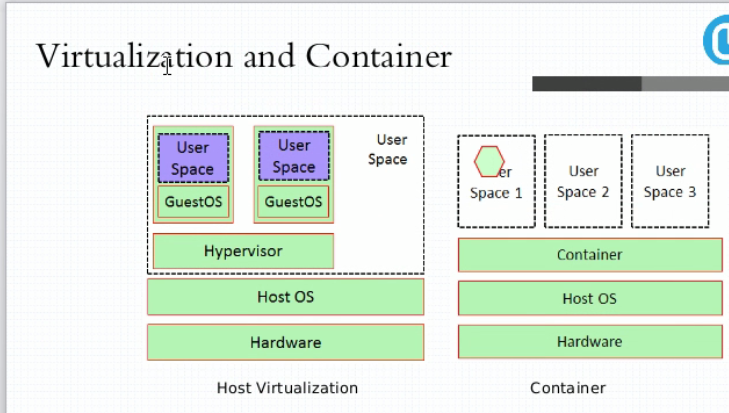
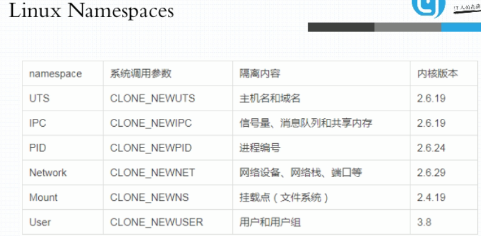
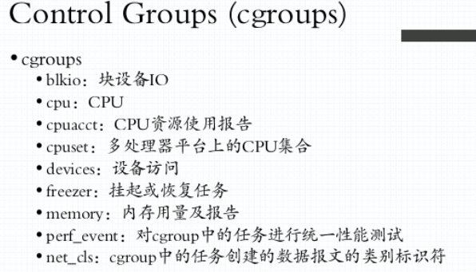

## 马哥docker 学习笔记

### 容器的概念

#### 虚拟化&容器化



##### 虚拟化实现的技术形式

1. 主机级的虚拟化

   - type-I: 
     - 直接在硬件平台上安装虚拟机管理器（Hypervisor) 不用安装 HOST OS，在Hypervisor 之上安装虚拟机
   - type-II:  VMware/workstation/virtualbox
     - 首先有宿主机（物理机），在物理机上安装宿主机操作系统HOST OS，在宿主机上安装 VMM（virtual machine manage），在VMM 的基础上创建使用虚拟机。
   - 其他：KVM/ZEN

   ```
   VMM给用户虚拟出来的是一个独立的硬件平台，用户需要使用虚拟机，需要部署完整意义的操作系统。
   但是运行内核不是我们的主要的目的，内核的主要的目的在于资源分配和任务管理，真正在用户空间的 应用进程才是能产生生产力的，而不是出于通用目的而产生的资源管理平台（内核）。
   但是内核又不得不存在，因为现在的软件都是针对于内核的系统调用和库调用，并且多个应用进程的协调也需要内核进行统一管理。
   一个在虚拟机中的进程想要运行则需要二级调度，自己虚拟机的内存虚拟化，CPU调度以及IO调度，真正的虚拟机进程又是被宿主机管理的进程或抽象层。
   ```

2. 容器级的虚拟化

   ```
   为了提高虚拟机虚拟化的效率，抽除掉虚拟机的内核层，直接进行用户进程之间的隔离。通过在宿主机上通过 一个用户空间的管理器 隔离不同的用户进程，用户进程运行在隔离起来的用户空间中，用户进程看到的是用户空间的边界，这就是容器技术的本质。
   
   容器技术最早出现在freeBSD 中，名字叫jail（监狱），最初出现jail 的目的是安全，程序运行在沙盒之中，进行隔离，避免程序出现安全漏洞而引起整个系统出现问题。
   后来吸收jail的理念，Linux 平台的 vserver(chroot)来实现容器技术。
   
   一个进程的运行无非就两棵树，进程树和文件系统树。
   
   容器的隔离需要进行：
   UTS（主机名和域名）
   Mount（文件系统挂载树）
   IPC（进程间通信）
   PID（进程号）每个隔离的用户空间必须要有一个 伪装成类似于init 的进程
   Uers（用户）对于在用户空间内行为可能类似于root，但在系统级别只是一个普通的用户
   Network（网络）每一个用户空间有自己专有的TCP/IP 协议栈
   ```

   

   



​	

​			

```
Control Groups(CGroups)：把系统级的资源分为多个组，把每一个的组内的资源的量指派分配到特定的用户空间的进程中去。
划分为不同的组之后，进行系统资源的分配。一个组内还可以进行细化为子组，把一个资源分配给一个组之后，这个组内的子组自动的拥有使用资源的权限。
如果把一个用户空间当做一个组，把资源分配给这个组，就可以限制这个用户空间的资源使用。
把一个资源分配一个用户空间，这个用户空间就自动的拥有了使用这个资源的能力。
```

容器技术由 Chroot，namespaces , CGroups 三种技术作为支撑的。

#### LXC（LinuX Container）

```
LXC 是最早把完整的容器技术，用一组简易使用的工具和模板来极大的简化容器使用的方案。
```

