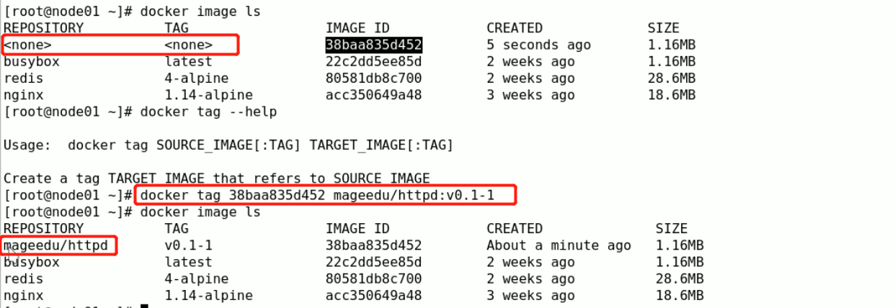
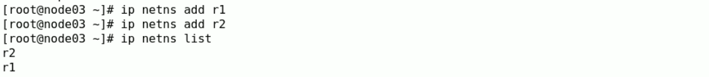
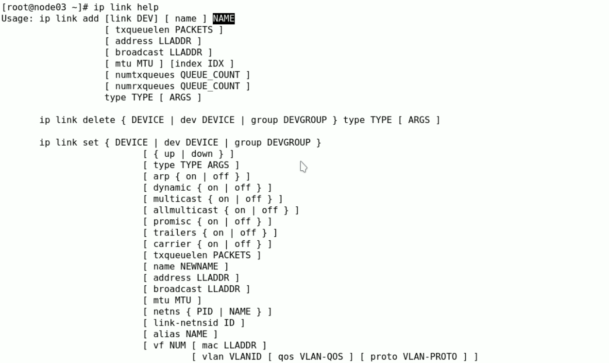
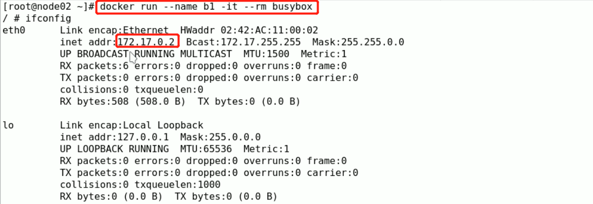
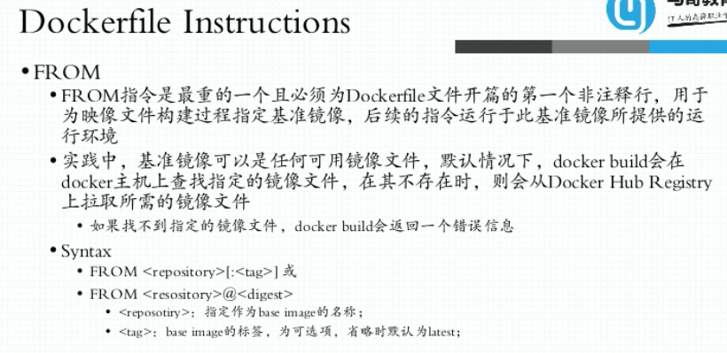
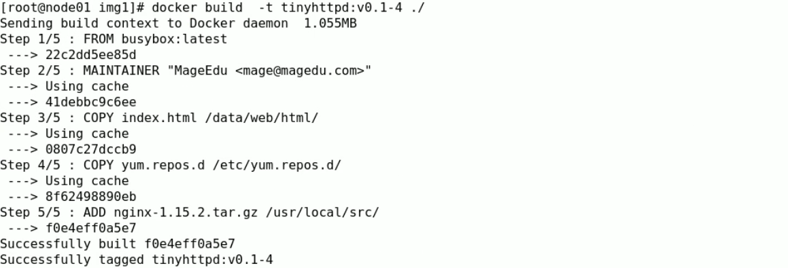
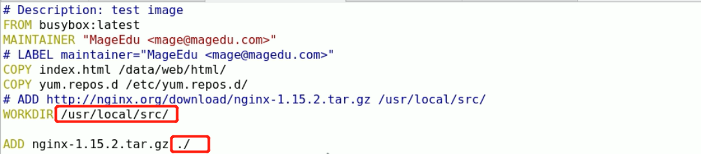
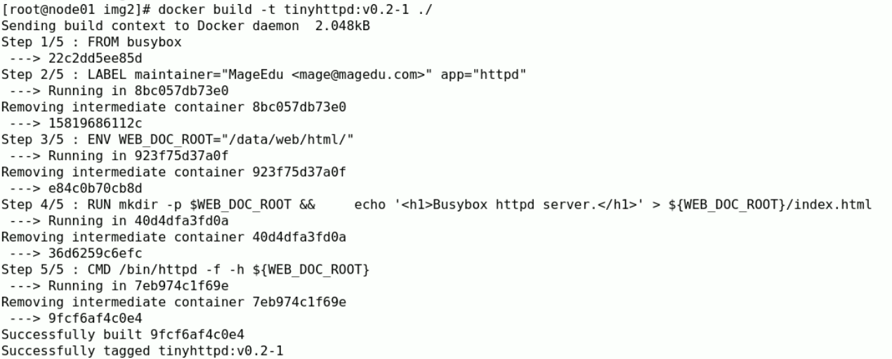
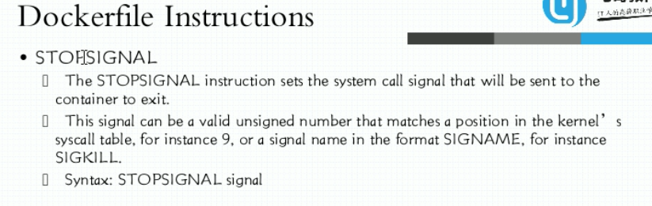

## 马哥Docker 学习笔记

### 容器的概念

#### 虚拟化&容器化


##### 虚拟化实现的技术形式

1. 主机级的虚拟化

   - type-I: 
     - 直接在硬件平台上安装虚拟机管理器（Hypervisor) 不用安装 HOST OS，在Hypervisor 之上安装虚拟机
   - type-II:  VMware/workstation/virtualbox
     - 首先有宿主机（物理机），在物理机上安装宿主机操作系统HOST OS，在宿主机上安装 VMM（virtual machine manage），在VMM 的基础上创建使用虚拟机。
   - 其他：KVM/ZEN

   ```
   VMM给用户虚拟出来的是一个独立的硬件平台，用户需要使用虚拟机，需要部署完整意义的操作系统。
   但是运行内核不是我们的主要的目的，内核的主要的目的在于资源分配和任务管理，真正在用户空间的 应用进程才是能产生生产力的，而不是出于通用目的而产生的资源管理平台（内核）。
   但是内核又不得不存在，因为现在的软件都是针对于内核的系统调用和库调用，并且多个应用进程的协调也需要内核进行统一管理。
   一个在虚拟机中的进程想要运行则需要二级调度，自己虚拟机的内存虚拟化，CPU调度以及IO调度，真正的虚拟机进程又是被宿主机管理的进程或抽象层。
   ```

2. 容器级的虚拟化

   ```
   为了提高虚拟机虚拟化的效率，抽除掉虚拟机的内核层，直接进行用户进程之间的隔离。通过在宿主机上通过 一个用户空间的管理器 隔离不同的用户进程，用户进程运行在隔离起来的用户空间中，用户进程看到的是用户空间的边界，这就是容器技术的本质。
   
   容器技术最早出现在freeBSD 中，名字叫jail（监狱），最初出现jail 的目的是安全，程序运行在沙盒之中，进行隔离，避免程序出现安全漏洞而引起整个系统出现问题。
   后来吸收jail的理念，Linux 平台的 vserver(chroot)来实现容器技术。
   
   一个进程的运行无非就两棵树，进程树和文件系统树。
   
   容器的隔离需要进行：
   UTS（主机名和域名）
   Mount（文件系统挂载树）
   IPC（进程间通信）
   PID（进程号）每个隔离的用户空间必须要有一个 伪装成类似于init 的进程
   Uers（用户）对于在用户空间内行为可能类似于root，但在系统级别只是一个普通的用户
   Network（网络）每一个用户空间有自己专有的TCP/IP 协议栈
   ```

   

   


​	

​			

```
Control Groups(CGroups)：把系统级的资源分为多个组，把每一个的组内的资源的量指派分配到特定的用户空间的进程中去。
划分为不同的组之后，进行系统资源的分配。一个组内还可以进行细化为子组，把一个资源分配给一个组之后，这个组内的子组自动的拥有使用资源的权限。
如果把一个用户空间当做一个组，把资源分配给这个组，就可以限制这个用户空间的资源使用。
把一个资源分配一个用户空间，这个用户空间就自动的拥有了使用这个资源的能力。
```

容器技术由 Chroot，namespaces , CGroups 三种技术作为支撑的。

#### LXC（LinuX Container）

```
LXC 是最早把完整的容器技术，用一组简易使用的工具和模板来极大的简化容器使用的方案。
```

#### Docker

```
docker 早期实现实际是在 LXC技术的一层封装。
docker 革命性的技术就是 使用了镜像技术，把应用进行了标准化的打包。大大降低了容器技术的使用门槛。
```

### Docker的基础用法


 	

```
OCI 定义了 运行时标准和镜像格式标准
```


```
OCF 开放容器格式
runC 是最新版的容器引擎运行时
```

#### docker的架构


```
docker registry 提供了用户的认证、索引、镜像的存储等。
registry 是镜像仓库的集合，如 nginx 是仓库的名字，仓库里面存储的为 nginx的各个版本(tag)的镜像，只有使用 repo+tag的方式才能定位到唯一的镜像。
```


```
镜像：是静态的，环境的打包文件
容器：是动态额，存在生命周期的
```

#### docker 对象


```
docker info 查看docker的信息
```


```
显示完整的 image ID
```


```
查看运行的容器
```


```
查看docker 网络
```


```
在后台启动 容器
```


```
查看docker 容器的日志，默认的日志是直接输出在控制台终端的
```

#### docker event state


### Docker的镜像管理基础

#### docker 镜像的原理


```
bootfs: bootloader和kernel 只是用于引导上层的文件系统
传统的模式中，系统启动的时候，在自建的时候，会把rootfs 首先挂载为 只读 的模式，完成自建后才重新挂载为 读写模式。
docker中，rootfs 为底层的只读 文件层，通过联合挂载，在最上层挂载为一个 读写层，与底层的 rootfs没有影响。
```


```
docker 镜像的 分层结构
bootfs 在引导完成后进行了卸载（从内存中移除），
Base Image 添加为 Debian的操作系统层，在此基础上又分别添加了 emacs层 和Apache层
最上面的为 可读写的 容器层。
```


```
联合挂载文件系统 Aufs，早期docker使用的 文件系统
```

#### docker registry


```
docker registry
```


```
Automated Builds: 一般开发人员将dockerfile连同代码一起进行提交，dockerhub配置监听github仓库的变化，发生变动的话，自动的出发docker image 的构建，保存镜像到dockerhub
webhooks 是配置 出发构建的Automated Builds特性的实现
```

#### docker镜像制作


```
-p 在制作镜像的时候 pause 容器，避免制作的过程中生成新的文件
```



```
给commit的镜像打上标签，账户为mageedu, 名称为httpd, 标签为 v0.1-1
```


```
给已有的标签重新打上新的标签
```


```
保存了自己创建的镜像
```

**更改源镜像默认的启动命令**

```
docker commit的时候可以直接给 docker指定 仓库和标签名
```


```
-c 指定改变的CMD 的内容
-p 制作镜像的时候暂停容器
mageedu/httpd:v0.2 指定了镜像的标签
```


```
启动刚制作的镜像，默认不是使用 /bin/sh 
```


```
可以看到 容器的启动的命令已经改变了
```

#### 推送镜像到dockerhub


```
本地的标签一定要和dockerhub的仓库和标签一致才能推得上去
```


```
登录dockerhub账户
```


```
推送镜像到远程的仓库
```

#### 配置docker加速器


#### 推送镜像到阿里云


```
也可以选择 github、bitbucket，gitlab等进行自动化的构建，本地仓库使用的使用命令行进行推送。
```


```
给镜像重新打上标签，加上阿里云的 区域信息
```


#### 镜像的导入导出


```
docker save 打包多个镜像到一个文件
```


```
拷贝到其他的主机
```


```
node02 的镜像的打包文件
```


```
docker load 载入打包的镜像 
```

### 容器虚拟化网络概述

#### 容器网络可用实现

```
1. 全部使用虚拟交换机（桥接网络）
	同主机上的两个容器之间通信，直接使用桥接网络，两个容器直接连接到虚拟交换机上，则两个容器之间可以进行通信；
2. 使用NAT地址转换实现
	不同主机上的容器进行通信，则容器的报文在出其所在的主机是SNAT转换器源地址为本机地址，发送到其他主机时则由DNAT进行转换到相应的容器的地址
3. Overlay Network 叠加网络
	首先，所有的物理节点由隧道进行相互打通，若不同主机上的容器进行通信的时候，如果容器的软交换机无法在本机进行转送到本机的其他容器，则通过隧道进行转发到其他的物理节点。
	转发的过程，会把 本机的报文重新打上 头部信息，把之前的容器通信的报文作为此报文的数据部分，到达其他的物理节点后，拆除隧道网络叠加的外部头部，得到里面的原始的容器网络报文，交由 转发到的物理节点的 虚拟交换机进行拆包处理。
```

#### docker的网络实现


```
docker在运行dockerd 的结点上创建了 虚拟交换机 docker0, 同时可以扮演二层的 交换设备和网卡设备
```


```
使用 brctl show 可以看到docker0 开了 四个端口
使用 ip link show 可以查看到这四个接口的对等网口为 if8/if10/if12/if16(这四个为容器内部的网络eth0)
```


```
docker0 默认的为 NAT桥
可以看到 POSTROUTING的规则：任何的接口进来in(*) 只要不是从 docker0 出的包，来源于127.17.0.0/16地址，目的地址为 0.0.0.0/0（任何地址）的数据包，SNAT 自动进行（MASQUERADE）
```

#### docker的四种网络模型


```
1. closed container  只有lo网络接口
	可能执行一些批处理任务的，不需要与其他的容器进行通信。
2. bridged container 桥接网络
	Docker bridge (docker0) 容器内private interface 与docker0 进行连接
3. 联盟式的网络
	Joined container A 与Joined container B 共用有 相同的名称空间（Net，UTS，IPC），而User、Mount，PID，不进行共享。
4. open container （host 网络）
	host网络直接共享物理机的网络名称空间。
```

#### 创建docker时指定网络


```
default 网络默认为docker0, 桥接网络
```


```
可以看到 Driver 为default
name 为docker0
```


```
web1 容器的网络信息
```

#### ip 命令操作名称空间


```
ip 命令
```

##### ip netns 命令


```
list 列出当前的名称空间
add 添加一个名称空间
set 设置名称空间的Id
exec 在名称空间中执行命令

在使用ip管理网络名称空间时，只有网络名称空间时隔离的，其他的名称空间是共享的。
```



```
创建add 名称空间
此时，r1 和 r2 应该默认单独只有一个lo的网卡（在没有指定其他的网卡的时候）
```


```
在网络名称空间中执行命令 ifconfig （显示不出是因为没有被激活）
```

##### ip link 命令




```
ip link add name NAME 添加网络设备 
type 指定设备的类型（veth 为虚拟的以太网）
```


```
ip link add name veth1.1 type veth peer name veth1.2
    添加名称为 veth1.1 类型为 veth的虚拟网卡，并且对等的虚拟网卡为veth1.2
    此时这两个网卡都属于当前的名称空间中
ip link sh[ow] 显示所有网卡
```


```
ip link set dev veth1.2 netns r1
	把设备veth1.2 移动到名称空间 r1 中
ip netns exec r1 ifconfig -a
	可以看到 在名称空间r1 中，veth1.2 在其中，因为网络设备只能显示在一个名称空间中
```


```
为r1 名称空间中的网络设备 veth1.2 名称更改为 eth0
```


```
为宿主机上的veth1.1 配置ip地址，并激活
```


```
将移动到r2 中的网卡设备veth1.2（eth0） 配置ip地址，并激活	
```


```
宿主机的名称空间 ping r1 的名称空间，可以进行通信
```


```
将veth1.1 防止到名称空间r2中
```


```
配置 r2 的ip地址，并激活
```


```
在r2 名称空间中执行ping命令
```

#### docker创建不同类型网络


```
--rm  docker运行完成之后进行删除
默认不指定---network 时，为桥接类型
```


```
显式的指定--network选项 为bridge
```


```
none 类型网络，只有lo网卡
```


```
容器的hostname显示的为容器的id号
```


```
-h，--hostname 执行容器的hostname
```


```
容器内的使用的为宿主机 正常的外部的服务器
```


```
--dns 指定容器使用的dns服务
--dns-search 当给定的不为FQDN 格式的域名的时候，后缀为 ilinux.io 
```


```
--add-host 容器启动的时候注入 host解析
```

#### docker 开放入站通信


```
1. -p containerPort 暴露的为 30000 - 32767之间的随机端口
```


```
可以看到 PREROUTING 链 有一个 target DOCKER，所有的包会定向到 DOCKER这条链上
DOCKER 链查看被映射的端口，所有的访问 32769 端口的流量，DNAT到 容器 172.17.0.2的80端口
```


```
也可以使用docker port 进行映射规则的查看
将容器的80/tcp 端口，映射宿主机所有的32770 端口
```


```
指定宿主机ip地址进行映射
```


```
把容器的80 映射到宿主任何ip
```


```
把容器80映射到宿主机172.20.0.76:8080 
```

#### 联盟式网络创建



```
启动第一个容器
```


```
创建b2容器，使用driver为 container，与b1容器共享网络名称空间
```

####  更改docker0桥的地址


```
只需指定bip即可
```

#### 外部访问主机的dockerd


```
新添加 tcp://0.0.0.0:2375 用于访问
```


```
连接其他主机的docker daemon
```

#### 创建自定义的docker桥


```
使用自定义的docker桥 mybr0 创建容器
```


```
docker0 的NAME为 bridge
```

### Docker存储卷

#### docker存储卷的使用


```
写入到 / 的数据还是在容器的可写层，而写入到/data 的数据写入到可持久存储的共享卷
```


```
两种类型的存储卷类型
	1. 用户自己绑定的数据存储卷，自己指定绑定的目录
	2. docker daemon自己创建管理的，由容器引擎自己管理与宿主机目录的绑定关系
```


```
映射 /data 目录
```


```
可以看到在宿主机上的目录来源
```


```
宿主机上建立的文件在 容器中可以查看到，反过来亦之
```


```
创建容器 b2，将/data/volumes/b2 映射到容器的 /data 目录
```


```
b3 共享使用b2 的存储卷
```


```
共享存储：
	1. 两个容器使用宿主机的同一个目录
	2. 指定存储卷来源于其他的容器
```


```
首先创建了基础架构设施支撑 容器 infracon, 使用nginx镜像创建容器的时候，使用 --volumes-from 引用infracon使用的存储卷
```


```
nginx使用了infracon的存储卷
```

#### 使用Go模板语法查看容器的信息


### Dockerfile使用

#### dockerfile 说明


```
dockerfile 是一系列的指令，用于构建docker 镜像
```


```
${variable:-word} variable 变量不存在或为空的时候，给默认值word
${variable:+word} variable 变量存在，使用值word替换；不存在，则使用variable
```

#### FROM指令




```
FROM 指令用于指定build的基础镜像
```

#### MAINTANIER指令


```
MAINTANIER 已经废弃的指令
使用LABLE 进行代替，提供了更宽泛的kv信息，当然包括坐着信息
```

#### LABLE指令


```
LABLE 为docker镜像 添加元数据信息
```

#### COPY指令


```
dest 是正在创建的image 的文件系统的路径，建议使用绝对路径，否则COPY 会以WORKDIR指定的路径为其实路径
COPY a b  相当于 cp a/* b ,不会把a目录复制到b下
```

#### ADD指令


```
ADD 指令可以添加下载远程的URL地址的资源
```





```
ADD 在添加压缩包的时候，添加进镜像里会 自动的进行解压
```




```
WORKDIR 可以指定当前的工作目录，在使用ADD 的时候，可以使用相对路径
```

#### VOLUME指令


```
可以看到 /dev/mapper/centos-root 挂载到 /data/mysql 上
```


```
使用docker inspect 查看卷的信息
只要镜像中定义了存储卷，启动容器的时候会自动的拥有响应的存储卷
```

#### EXPOSE指令


```
ESPOSE 只能指定暴露哪个端口出去，而相应的需要映射到宿主机上的哪个端口，是没有办法指定的
映射只有在docker run 指定 -P 选项的时候，自动的将宿主机上的端口动态的映射到 EXPOSE 指定的端口
如果不显式的指定 -P 则不会进行暴露
```


```
不指定 -P
```


```
此时直接访问 容器的IP地址，可以访问，是因为宿主机和所启动的容器在同一个网桥上
此时使用docker port 查看没有暴露80 到宿主机上
```


```
使用 -P 启动容器
```


```
访问宿主机IP的 32768 端口
```

#### ENV指令


```
ENV 定义需要的环境变量
多个变量的时候，建议采用第二种，可以在同一层中完成，避免构建的镜像层数过多 
\ 可以用于转义，也可以用于续行
```


```
dockerfile定义的变量在启动容器是 为默认的变量值，可以在docker run的过程中 使用 -e 或 --env 指定变量进行覆盖镜像中定义的默认值
```

#### RUN指令


```
1. 第一种 通常为一个shell 的命令，使用 “/bin/sh -c” 来运行此进程，是由shell 创建需要运行的命令，接收不到docker stop 收到的信号
2. 是直接运行指定的 executable 的命令，不是有shell进行创建，所以不能使用shell的 通配符

json 数组中需要使用双引号
```

#### CMD指令


```
1. 第一种，自动运行为shell的子进程，容器中运行的PID不为1，无法接收 docker stop 的信号停止容器内的进程
2. 是直接运行指定的 executable 的命令，不是有shell进行创建，所以不能使用shell的 通配符，此种方式启动executable 为PID为1 的进程，可以使用docker stop 发送信号进行管理
3. 为 ENTRYPOINT 的参数列表

json 数组中需要使用双引号
```





```
查看docker image inspect tinyhttpd:v0.2-1 自动的加上了 /bin/sh -c 进行启动
```


```
使用 -it 启动容器时，并没有进入交互的界面，原因是 1号进程为httpd, 不是shell
因为在使用 此种方式启动的时候 /bin/sh 默认的会执行exec命令的替换，httpd代替sh 为1号进程
```


```
使用 docker exec 指定 /bin/sh 进入容器中查看 1号进程为 httpd
```


```
docker image inspect 查看镜像的CMD 命令，没有/bin/sh 
```


```
启动的时候报错了，shell的变量无法解析
```


```
手动指定 /bin/sh -c
```

#### ENTRYPOINT指令


```
使用刚构建的镜像启动httpd服务
json 数组中需要使用双引号
```


```
在启动 容器的时候 指定命令 ls /data/web/html, 此时的ls 命令并不能执行，因为ENTRYPOINT 指定的命令不能修改
并且 指定的 ls /data/web/html 会作为ENTRYPOINT的参数运行httpd命令，
/bin/httpd -f -h /data/web/html ls /data/web/html
```


```
此种方式 CMD会以参数的方式在ENTRYPOINT会面
如果 ENTRYPOINT /bin/sh -c 这种方式配置的话，则 inspect的时候会显示 /bin/sh -c "/bin/sh -c", 这是因为不适用列表的方式启动的话，会默认使用/bin/sh -c 进行启动指定的命令 “/bin/sh -c”
```


```
配置 entrpoint.sh 脚本的时候，配合 Dockerfile 执行的命令为 /bin/entrypoint.sh /usr/sbin/nginx -g "daemon off;"
使用 exec "$@" 执行/usr/sbin/nginx -g "daemon off;" 并剥离出shell
```

#### USER指令


```
root为内核级的用户，及时容器中/etc/passwd 这不存在也可以
如果想要容器中运行的主进程的用户不为root，可以使用USER进行指定
```

#### HEALTHCHECK指令


```
HEALTHCHECK CMD 执行检测的命令
HEALTHCHECK NONE 禁用继承base镜像的检测
```


```
--start-period 指定镜像启动多久的话进行检测，排除主进程没有完全启动成功的情况
```


```
可以看到 健康检测已经进行
```

#### SHELL指令


```
更改默认的 /bin/sh -c 命令
```

#### STOPSIGNAL指令



```
更改默认的 15 信号的操作
```

#### ARG指令


```
ARG 只是在 build的时候使用，可以通过 --build-tag 进行传递
docker build的过程 不能通过命令行进行 传递变量，定义了 ARG 可以使用 --build-tag 进行传递
```

#### ONBUILD指令


```
当别人拿 存在ONBUILD指令的镜像作为基础镜像进行构建的时候， 基础镜像的ONBUILD指令会触发执行 在本次构建。
```


```
build的时候 ONBUILD 并没有去下载 rpm包
```


```
定义了一个新的dockerfile文件，基于刚刚构建的镜像myweb:v0.3-11
```


```
此时的ONBUILD进行了执行
```

