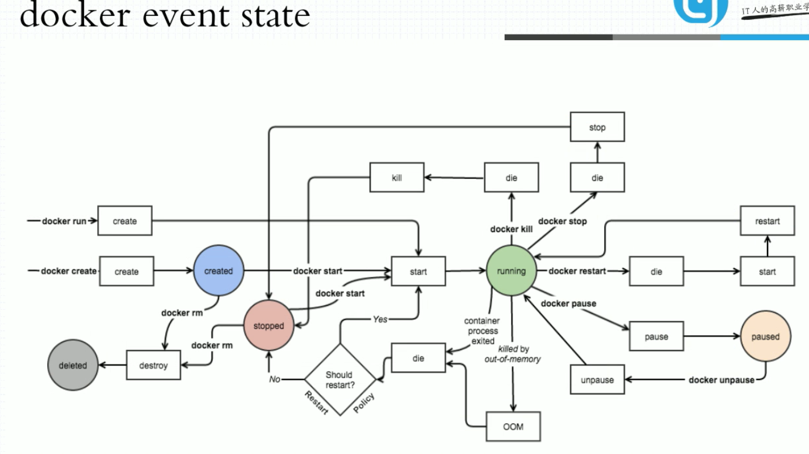

## 马哥docker 学习笔记

### 容器的概念

#### 虚拟化&容器化


##### 虚拟化实现的技术形式

1. 主机级的虚拟化

   - type-I: 
     - 直接在硬件平台上安装虚拟机管理器（Hypervisor) 不用安装 HOST OS，在Hypervisor 之上安装虚拟机
   - type-II:  VMware/workstation/virtualbox
     - 首先有宿主机（物理机），在物理机上安装宿主机操作系统HOST OS，在宿主机上安装 VMM（virtual machine manage），在VMM 的基础上创建使用虚拟机。
   - 其他：KVM/ZEN

   ```
   VMM给用户虚拟出来的是一个独立的硬件平台，用户需要使用虚拟机，需要部署完整意义的操作系统。
   但是运行内核不是我们的主要的目的，内核的主要的目的在于资源分配和任务管理，真正在用户空间的 应用进程才是能产生生产力的，而不是出于通用目的而产生的资源管理平台（内核）。
   但是内核又不得不存在，因为现在的软件都是针对于内核的系统调用和库调用，并且多个应用进程的协调也需要内核进行统一管理。
   一个在虚拟机中的进程想要运行则需要二级调度，自己虚拟机的内存虚拟化，CPU调度以及IO调度，真正的虚拟机进程又是被宿主机管理的进程或抽象层。
   ```

2. 容器级的虚拟化

   ```
   为了提高虚拟机虚拟化的效率，抽除掉虚拟机的内核层，直接进行用户进程之间的隔离。通过在宿主机上通过 一个用户空间的管理器 隔离不同的用户进程，用户进程运行在隔离起来的用户空间中，用户进程看到的是用户空间的边界，这就是容器技术的本质。
   
   容器技术最早出现在freeBSD 中，名字叫jail（监狱），最初出现jail 的目的是安全，程序运行在沙盒之中，进行隔离，避免程序出现安全漏洞而引起整个系统出现问题。
   后来吸收jail的理念，Linux 平台的 vserver(chroot)来实现容器技术。
   
   一个进程的运行无非就两棵树，进程树和文件系统树。
   
   容器的隔离需要进行：
   UTS（主机名和域名）
   Mount（文件系统挂载树）
   IPC（进程间通信）
   PID（进程号）每个隔离的用户空间必须要有一个 伪装成类似于init 的进程
   Uers（用户）对于在用户空间内行为可能类似于root，但在系统级别只是一个普通的用户
   Network（网络）每一个用户空间有自己专有的TCP/IP 协议栈
   ```

   

   


​	

​			

```
Control Groups(CGroups)：把系统级的资源分为多个组，把每一个的组内的资源的量指派分配到特定的用户空间的进程中去。
划分为不同的组之后，进行系统资源的分配。一个组内还可以进行细化为子组，把一个资源分配给一个组之后，这个组内的子组自动的拥有使用资源的权限。
如果把一个用户空间当做一个组，把资源分配给这个组，就可以限制这个用户空间的资源使用。
把一个资源分配一个用户空间，这个用户空间就自动的拥有了使用这个资源的能力。
```

容器技术由 Chroot，namespaces , CGroups 三种技术作为支撑的。

#### LXC（LinuX Container）

```
LXC 是最早把完整的容器技术，用一组简易使用的工具和模板来极大的简化容器使用的方案。
```

#### Docker

```
docker 早期实现实际是在 LXC技术的一层封装。
docker 革命性的技术就是 使用了镜像技术，把应用进行了标准化的打包。大大降低了容器技术的使用门槛。
```

### Docker的基础用法


 	

```
OCI 定义了 运行时标准和镜像格式标准
```


```
OCF 开放容器格式
runC 是最新版的容器引擎运行时
```

#### docker的架构


```
docker registry 提供了用户的认证、索引、镜像的存储等。
registry 是镜像仓库的集合，如 nginx 是仓库的名字，仓库里面存储的为 nginx的各个版本(tag)的镜像，只有使用 repo+tag的方式才能定位到唯一的镜像。
```


```
镜像：是静态的，环境的打包文件
容器：是动态额，存在生命周期的
```

#### docker 对象


```
docker info 查看docker的信息
```


```
显示完整的 image ID
```


```
查看运行的容器
```


```
查看docker 网络
```


```
在后台启动 容器
```


```
查看docker 容器的日志，默认的日志是直接输出在控制台终端的
```

#### docker event state



### docker的镜像管理基础

#### docker 镜像的原理


```
bootfs: bootloader和kernel 只是用于引导上层的文件系统
传统的模式中，系统启动的时候，在自建的时候，会把rootfs 首先挂载为 只读 的模式，完成自建后才重新挂载为 读写模式。
docker中，rootfs 为底层的只读 文件层，通过联合挂载，在最上层挂载为一个 读写层，与底层的 rootfs没有影响。
```


```
docker 镜像的 分层结构
bootfs 在引导完成后进行了卸载（从内存中移除），
Base Image 添加为 Debian的操作系统层，在此基础上又分别添加了 emacs层 和Apache层
最上面的为 可读写的 容器层。
```


```
联合挂载文件系统 Aufs，早期docker使用的 文件系统
```

#### docker registry


```
docker registry
```


```
Automated Builds: 一般开发人员将dockerfile连同代码一起进行提交，dockerhub配置监听github仓库的变化，发生变动的话，自动的出发docker image 的构建，保存镜像到dockerhub
webhooks 是配置 出发构建的Automated Builds特性的实现
```

#### docker镜像制作


```
-p 在制作镜像的时候 pause 容器，避免制作的过程中生成新的文件
```


```
给commit的镜像打上标签，账户为mageedu, 名称为httpd, 标签为 v0.1-1
```


```
给已有的标签重新打上新的标签
```


```
保存了自己创建的镜像
```

**更改源镜像默认的启动命令**

```
docker commit的时候可以直接给 docker指定 仓库和标签名
```


```
-c 指定改变的CMD 的内容
-p 制作镜像的时候暂停容器
mageedu/httpd:v0.2 指定了镜像的标签
```


```
启动刚制作的镜像，默认不是使用 /bin/sh 
```


```
可以看到 容器的启动的命令已经改变了
```

#### 推送镜像到dockerhub


```
本地的标签一定要和dockerhub的仓库和标签一致才能推得上去
```


```
登录dockerhub账户
```


```
推送镜像到远程的仓库
```

#### 配置docker加速器


#### 推送镜像到阿里云


```
也可以选择 github、bitbucket，gitlab等进行自动化的构建，本地仓库使用的使用命令行进行推送。
```


```
给镜像重新打上标签，加上阿里云的 区域信息
```


#### 镜像的导入导出


```
docker save 打包多个镜像到一个文件
```


```
拷贝到其他的主机
```


```
node02 的镜像的打包文件
```


```
docker load 载入打包的镜像 
```

### 容器虚拟化网络概述

#### 容器网络可用实现

```
1. 全部使用虚拟交换机（桥接网络）
	同主机上的两个容器之间通信，直接使用桥接网络，两个容器直接连接到虚拟交换机上，则两个容器之间可以进行通信；
2. 使用NAT地址转换实现
	不同主机上的容器进行通信，则容器的报文在出其所在的主机是SNAT转换器源地址为本机地址，发送到其他主机时则由DNAT进行转换到相应的容器的地址
3. Overlay Network 叠加网络
	首先，所有的物理节点由隧道进行相互打通，若不同主机上的容器进行通信的时候，如果容器的软交换机无法在本机进行转送到本机的其他容器，则通过隧道进行转发到其他的物理节点。
	转发的过程，会把 本机的报文重新打上 头部信息，把之前的容器通信的报文作为此报文的数据部分，到达其他的物理节点后，拆除隧道网络叠加的外部头部，得到里面的原始的容器网络报文，交由 转发到的物理节点的 虚拟交换机进行拆包处理。
```

#### docker的网络实现


```
docker在运行dockerd 的结点上创建了 虚拟交换机 docker0, 同时可以扮演二层的 交换设备和网卡设备
```


```
使用 brctl show 可以看到docker0 开了 四个端口
使用 ip link show 可以查看到这四个接口的对等网口为 if8/if10/if12/if16(这四个为容器内部的网络eth0)
```


```
docker0 默认的为 NAT桥
可以看到 POSTROUTING的规则：任何的接口进来in(*) 只要不是从 docker0 出的包，来源于127.17.0.0/16地址，目的地址为 0.0.0.0/0（任何地址）的数据包，SNAT 自动进行（MASQUERADE）
```

#### docker的四种网络模型


```
1. closed container  只有lo网络接口
	可能执行一些批处理任务的，不需要与其他的容器进行通信。
2. bridged container 桥接网络
	Docker bridge (docker0) 容器内private interface 与docker0 进行连接
3. 联盟式的网络
	Joined container A 与Joined container B 共用有 相同的名称空间（Net，UTS，IPC），而User、Mount，PID，不进行共享。
4. open container （host 网络）
	host网络直接共享物理机的网络名称空间。
```

#### 创建docker时指定网络


```
default 网络默认为docker0, 桥接网络
```


```
可以看到 Driver 为default
name 为docker0
```


```
web1 容器的网络信息
```

