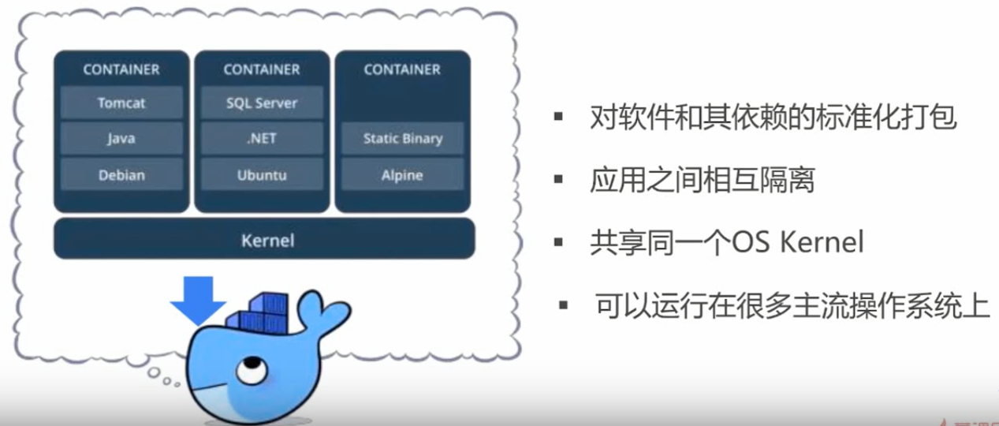
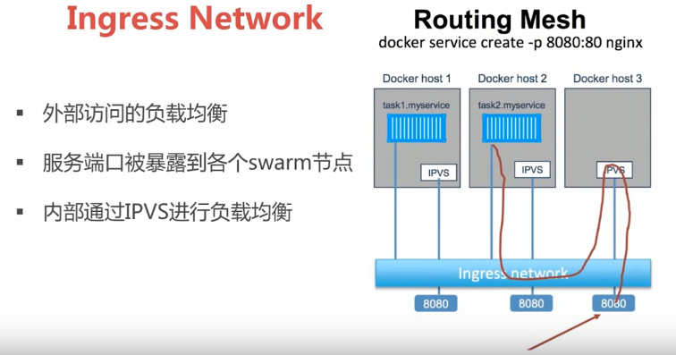
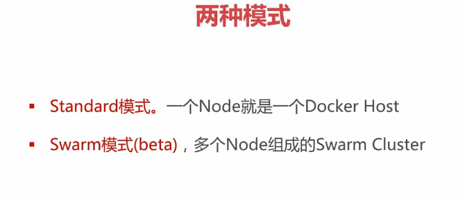
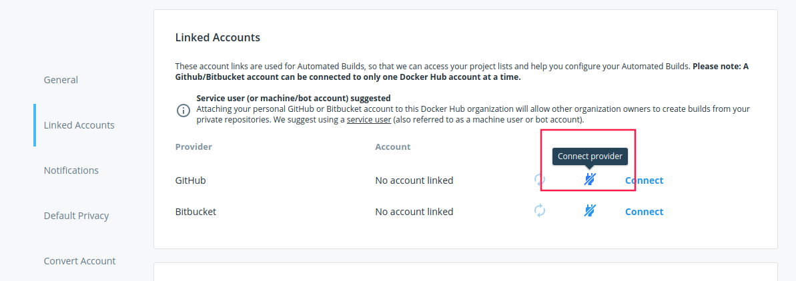
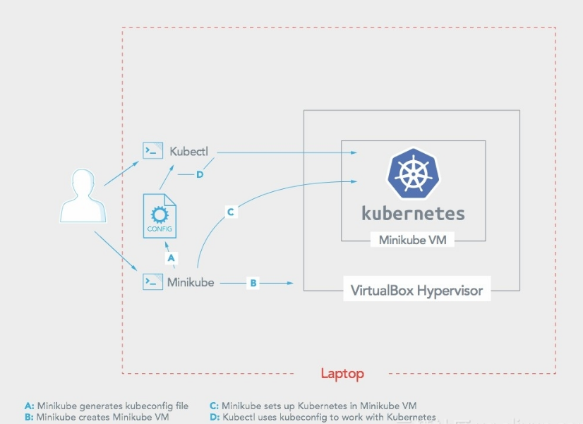

# Dcoker& K8s Study 

## 1. docker 概述与安装

### 什么是docker？


##### docker 与虚拟机的主要区别？


```
虚拟机： 是在物理服务器利用CPU 的虚拟化技术(VT-X或VT-D, linux 下通过 cat /proc/cpuinfo | grep -E 'vmx|svm'查看)，在物理操作系统系统上构建一个虚拟层Hypervisor, 进行虚拟cpu, 内存等设备的模拟，并再次之上需要重新安装 客户操作系统，从而实现一台物理机上多台虚拟操作系统，是真真实实的操作系统。
docker: 在物理操作系统上，封装了一层docker engine，并利用 Linux 内核的 cgroup, namspaece 以及union file system 进行应用的独立的隔离的运行环境。docker 本质上是一台操作一同上的一个 隔离的应用进程。

容器技术并不需要 虚拟化层，以及用户的操作系统。
```

```
容器与虚拟化技术的结合：
```


##### docker 能干什么？


```
容器 可以实现将应用的运行环境和配置打包到一个镜像中，简化了服务应用的配置和环境的构建，保证了不同环境的一致性。
```

##### 容器世界的”双城记“，docker 和kubernetes


```
kubernetes 是容器的编排工具，对成千上万的容器构成的集群，多节点的服务，进行服务的发现，部署，回滚，高可用（副本），存储，监控，日志收集，服务调度的功能。
```

##### DevOps 是什么？


```
DevOps 包括的 不只是 docker 还包括 版本控制，监控，持续集成(CI)，持续发布(CD) 等。
```

### 容器技术概述

##### Long Long  Time Ago


```
部署非常慢：需要物理机，安装操作系统，安装APP（安装各种依赖关系的软件包）
成本非常高：需要购买一台服务器，即使一台消耗资源非常小的晕死
资源浪费：服务器对应用来说太多了
难于迁移与扩展：迁移APP 到另外的一台服务器，需要重新重复安装操作系统，部署各种以来的循环；
可能被硬件厂商限定：不同的操作系统的应用，不能相互兼容
```

##### 虚拟化技术出现之后

```
虚拟化技术的实现：
	虚拟化是在原先的物理的服务器的操作系统上通过一层Hypervisor 层，进行物理资源的虚拟化（CPU，硬盘，内存），在虚拟出来的资源之上，安装操作系统（虚拟机）

虚拟化技术的优点：
	虚拟化有一个资源池的概念，一个物理机的资源分配到了不同的虚拟机里面
	很容易扩展，通过加虚拟机或者是加物理机进行扩展
	很容易云化，aws, 阿里云，不用考虑底层的物理机资源
		
虚拟化技术的缺点：
	每一个虚拟机都是一个完整的操作系统，要给其分配资源，虚拟机过多时，会给操作系统本身消耗过多的资源
```

##### 开发和运维面临的挑战


```
开发和运维面临着组件模块使用众多，不同环境难于保持一致。
```

##### 容器解决了什么问题？


```
容器解决的问题：是运维和开发之间的沟通问题，解决了开发和运维之间的矛盾，在开发和运维之间建立起了一个标准话的桥梁，这个桥梁是实现DevOps 的最佳的方案。
通过容器定义的标准，进行应用的打包，是这个容器可以在不同的环境下无差别运行，不论你这个容器 是通过卡车，轮船，马车运输。做到了与环境不相关。
```

##### 再回到 什么是容器？



```
容器是对软件核心以来的标准化的打包，能够实现应用之间的相互之间的隔离，不同的 容器之间共享同一个的 OS Kernel，可以运行在主流的操作一同之上。
```

### vagrant 的使用

##### vagrant 是什么？

```
vagrant 是一种管理虚拟机的工具，可以进行虚拟机的额创建管理，虚拟机的打包，软件的安装等功能。使用的ruby 编写的工具，通过调用 virtualbox 等虚拟机管理软件的接口，在命令行通过配置文件 Vagrantfile， 进行虚拟机的 镜像，网络，资源的配置。
```

##### vagrant 的使用

```
# 将images/CentOS-7-x86_64-Vagrant-1811_02.VirtualBox.box 的镜像 添加到 本地的box list 中
vagrant box add centos/7  ./images/CentOS-7-x86_64-Vagrant-1811_02.VirtualBox.box

# 使用 centos/7 这个box 镜像进行Vagrantfile 文件的初始化
vagrant init centos/7 
	# 汇总本地生成 Vagrantfile
	Vagrant.configure("2") do |config|
  		config.vm.box = "centos/7"
	end
	
# 创建启动虚拟机
在 Vagrantfile的目录下执行：
vagrant up
# 连接进入虚拟机
vagrant ssh
# 重启虚拟机
vagrant reload
# 关闭虚拟机
vagrant halt
# 销毁虚拟机
vagrant destroy
# 查看虚拟机的状态
vagrant status
# 打包虚拟机
vagrant package --output centos7-base.box --base centos7
	--output  输出的镜像的名字
	--base   当前虚拟机的名字
```

```
使用示例：
	启动虚拟机后自动进行安装docker-ce
	
Vagrantfile 的配置：
    Vagrant.configure("2") do |config|
      config.vm.box = "centos/7"
      config.vm.provision "shell", inline: <<-SHELL
        sudo yum remove docker \
                      docker-client \
                      docker-client-latest \
                      docker-common \
                      docker-latest \
                      docker-latest-logrotate \
                      docker-logrotate \
                      docker-selinux \
                      docker-engine-selinux \
                      docker-engine
        sudo yum install -y yum-utils \
                      device-mapper-persistent-data \
                      lvm2
        sudo yum-config-manager \
                      --add-repo \
                      http://mirrors.aliyun.com/docker-ce/linux/centos/docker-ce.repo
        sudo yum -y install docker-ce
        sudo systemctl enable docker.service
        sudo systemctl start docker
      SHELL
    end
    
# 使用 vagrant up  使用次配置文件进行启动，则会进行docker-ce 的安装
```

### docker-machine 的使用

```
docker-machine 和vagrant 非常相似，可以进行虚拟机的创建启动管理。搭建和管理多个的docker 主机，搭建swarm 集群。
Docker Machine简化了部署的复杂度，无论是在本机的虚拟机上还是在公有云平台，只需要一条命令便可搭建好Docker主机
Docker Machine提供了多平台多Docker主机的集中管理
Docker Machine 使应用由本地迁移到云端变得简单，只需要修改一下环境变量即可和任意Docker主机通信部署应用
```

##### docker-machine 的安装

```
$ base=https://github.com/docker/machine/releases/download/v0.16.0 &&
  curl -L $base/docker-machine-$(uname -s)-$(uname -m) >/usr/local/bin/docker-machine &&
  chmod +x /usr/local/bin/docker-machine
```

##### 使用docker-machine 创建虚拟机

```
## 启动一个名字为demo 的虚拟机
dcoker-machine create demo		
	## 会去拉去Boot2Docker.iso 的镜像
    Running pre-create checks...
    (demo) Default Boot2Docker ISO is out-of-date, downloading the latest release...
    (demo) Latest release for github.com/boot2docker/boot2docker is v18.09.0
    (demo) Downloading /home/xyb/.docker/machine/cache/boot2docker.iso from https://github.com/boot2docker/boot2docker/releases/download/v18.09.0/boot2docker.iso...
    (demo) 0%....10%....20%....30%....40%....50%....60%....70%....80%....90%....100%
    Creating machine...
    (demo) Unable to get the local Boot2Docker ISO version:  Did not find prefix "-v" in version string
    (demo) Default Boot2Docker ISO is out-of-date, downloading the latest release...
    (demo) Latest release for github.com/boot2docker/boot2docker is v18.09.0
    (demo) Downloading /home/xyb/.docker/machine/cache/boot2docker.iso from https://github.com/boot2docker/boot2docker/releases/download/v18.09.0/boot2docker.iso...
    (demo) 0%....10%....20%....30%....40%....50%....60%....70%....80%....90%....100%
    (demo) Copying /home/xyb/.docker/machine/cache/boot2docker.iso to /home/xyb/.docker/machine/machines/demo/boot2docker.iso...
    (demo) Creating VirtualBox VM...
    (demo) Creating SSH key...
    (demo) Starting the VM...
    (demo) Check network to re-create if needed...
    (demo) Found a new host-only adapter: "vboxnet2"
    (demo) Waiting for an IP...
    Waiting for machine to be running, this may take a few minutes...
    Detecting operating system of created instance...
    Waiting for SSH to be available...
    Detecting the provisioner...
    Provisioning with boot2docker...
    Copying certs to the local machine directory...
    Copying certs to the remote machine...
    Setting Docker configuration on the remote daemon...
    Checking connection to Docker...
    Docker is up and running!
    To see how to connect your Docker Client to the Docker Engine running on this virtual machine, run: docker-machine env demo
```

##### 查看启动的虚拟机

```
# docker-machine ls
NAME   ACTIVE   DRIVER       STATE     URL                         SWARM   DOCKER     ERRORS
demo   -        virtualbox   Running   tcp://192.168.99.100:2376           v18.09.0 
```

##### 进入 demo 的主机

```
xyb@Fsociety  ~  docker-machine ssh demo
   ( '>')
  /) TC (\   Core is distributed with ABSOLUTELY NO WARRANTY.
 (/-_--_-\)           www.tinycorelinux.net

docker@demo:~$ ps -ef | grep docker 
root      2221     1  0 10:43 ?        00:00:00 /sbin/udhcpc -b -i eth1 -x hostname:boot2docker -p /var/run/udhcpc.eth1.pid
root      2226     1  0 10:43 ?        00:00:00 /sbin/udhcpc -b -i eth0 -x hostname:boot2docker -p /var/run/udhcpc.eth0.pid
root      2233     1  0 10:43 ?        00:00:00 crond -L /var/lib/boot2docker/log/crond.log
docker    2383  2377  0 10:43 tty1     00:00:00 -bash
root      2615     1  0 10:43 ?        00:00:00 dockerd --data-root /var/lib/docker -H unix:// --label provider=virtualbox -H tcp://0.0.0.0:2376 --tlsverify --tlscacert=/var/lib/boot2docker/ca.pem --tlskey=/var/lib/boot2docker/server-key.pem --tlscert=/var/lib/boot2docker/server.pem --storage-driver overlay2 --pidfile /var/run/docker.pid
root      2625  2615  0 10:43 ?        00:00:00 containerd --config /var/run/docker/containerd/containerd.toml --log-level info
```

##### 设置本机docker命令使用 远程demo 主机的环境变量

```
 xyb@Fsociety  ~/devops/virtualMac/docker_demo  docker-machine env demo
export DOCKER_TLS_VERIFY="1"
export DOCKER_HOST="tcp://192.168.99.101:2376"
export DOCKER_CERT_PATH="/home/xyb/.docker/machine/machines/demo"
export DOCKER_MACHINE_NAME="demo"
# Run this command to configure your shell: 
# eval $(docker-machine env demo)

# 执行 eval $(docker-machine env demo) 配置 demo 的环境变量为本地变量
此时在执行 docker version 的命令时就是 连接的docker 的环境

# 远程docker 的环境变量的unset
eval $(docker-machine env --unset)
```

##### docker-machine 在阿里云上创建虚拟机

```
1. 下载 阿里云的 docker-machine 的driver
	go get github.com/AliyunContainerService/docker-machine-driver-aliyunecs
	# 下载之后 拷贝到 /usr/local/bin 目录下
2. 验证是否安装成功
	docker-machine create -d aliyunecs --help  # 成功了则会打印出帮助信息
3. 有登录阿里云平台的账号，进入管理控制台，在访问控制里，创建用户的accessKey，此时会生成access-key-secret(只生成一次，注意记录)
4. 命令行生成机器
	--aliyunecs-io-optimized=optimized  ## io 优化的实力类型
	--aliyunecs-instance-type=ecs.c5.large  ## 示例的配置
	--aliyunecs-access-key-id   ## 执行创建的access-key的id
	--aliyunecs-access-key-secret  ## access-key 的密钥
	--aliyunecs-region=cn-qingdao  ## 可用区
```


##### docker playgroud 的使用

```
1. 创建 docker id
	进入 https://hub.docker.com/ 进行注册后，获取 docker id 可以登录 docker hub 
2. 使用 docker id 登录
	https://labs.play-with-docker.com/  ## 选择使用 docker 进行登录
3. 在界面进行 虚拟机的创建
```


## 2. docker 架构与底层技术

### docker 技术架构概述


```
宏观上看，docker 在底层的 物理服务器或虚拟服务器上面 通过 docker engine 讲application 与底层操作系统进行隔离。
```


```
docker 的后台进程 dcokerd  提供了 REST API 和命令行的接口给 命令行或其他的服务进行调用，dcokerd 用来进行 network，container，volumes 以及 images 的管理。
```


```
client 是安装 docker client的机器，可以在命令行里执行各种的命令。
docker host 是安装了dockerd 的服务的机器，上面存在这docker 的images 以及 创建的container。
registry 是存储docker 镜像的公共服务。
```


```
命名空间是一种封装的概念，封装实现的是一种代码的隔离；那么在操作系统中命名空间提供的是一种系统资源的隔离，这些系统资源包括了进程，网络，文件系统等等。Linux 实现内核空间的目的就是实现Linux 内核的轻量级的虚拟化服务（即，容器），在同一个命名空间下的进程可以感知彼此的变化，而对其他的命名空间中的进程一无所知，使容器中的进程产生一个错觉，仿佛自己一个独立的系统的环境中，以此达到独立和隔离的作用。
```


```
docker 使用到的namespace 的五种命名空间。
```


```
control groups 一种Linux内核提供的可以限制，记录，隔离进程组所使用的物理资源的机制，有Google 的工程师提出，在2007 年整合进Linux 内核。

control groups 的作用：
	资源限制：比如 mem 子系统可以为进程组设定一个使用内存的使用上限，一旦进程组使用的内存达到上限，在申请内存，就OOM。
	优先级设定：可以设定那些进程组使用更大的cpu, 磁盘io，或网络io 的资源。
	资源计量：可以计算进程组使用了多少的资源，在计费系统中比较重要。
	资源控制：可以将进程组挂起和恢复。
```


```
namespace 和 CGroups 带给docker的能力
```


### docker images 概述

#### 什么是image


```
image 是文件和metadata 的数据的集合，文件指的是rootfs，Linux 系统分为内核空间和用户空间，内核空间为Linux kernel（bootfs）, 用户空间是在bootfs 上做的各种的Linux 发行版，即加了不同的rootfs。
```


```
镜像是docker 容器的基石。容器基于镜像启动和运行，镜像就好比容器的源代码，保存了用于启动容器的各种的条件。
docker的镜像是一个层叠的文件系统，他的最底端是一个引导文件系统，即bootfs, 这很像典型的Linux 引导文件系统，docker 的用户将永远不会与引导文件系统存在交互，当容器启动之后，将会被移动到内存中，bootfs 将会被卸载。
docker 文件的第二层是一个rootfs，位于引导文件系统之上，rootfs 可以是一种或多种的操作系统，在传统的操作系统中，root 文件系统会最先以只读的方式加载，引导结束并完成完整性检查后，才会被切换为读写模式，但在docker 文件系统中，rootfs 永远只能为只读状态。并且docker 利用联合加载技术又会在rootfs 之上加载更多的只读文件系统。
联合加载指的是一次加载多个的文件系统，在外面看来，只能看到一个文件系统，联合加载会将各层的文明系统叠加到一起，让最终的文件系统包含底层的文件和目录，docker 将这样的文件系统叫做镜像，一个镜像可以放到另一个镜像的底部，位于下一层的镜像为父镜像，依次类推知道镜像栈的最底部。最底部镜像诚挚为基础镜像
```


```
镜像是docker 生命周期中的构建和打包阶段，容器则是docker的启动和执行的阶段。
容器是怎样通过镜像来启动呢？
	当一个容器启动的时候，docker 会在 这个镜像的最顶部加载一个读写层，docker 中运行的程序，就是在这个层中运行的，docker 第一次启动一个容器的时候，初始的读写层是空的，当文件系统发生变化的时候，这些变化都会应用到这一层，比如当修改一个文件的时候，该文件会从镜像的只读层复制到读写层，该文件的只读版本依然存在，只不过会被读写层的副本所隐藏(写时复制)
```


#### docker iamges 的获取

##### docker hub registry 获取

```
[root@docker-host ~]# docker search redis   ## 搜索redis 的docker 镜像
NAME                 DESCRIPTION                                     STARS               OFFICIAL            AUTOMATED
redis               Redis is an open source key-value store that…   6299              [OK]   
bitnami/redis                     Bitnami Redis Docker Image                      99                                      [OK]
sameersbn/redis                                                                   75                                      [OK]
grokzen/redis-cluster             Redis cluster 3.0, 3.2, 4.0 & 5.0               39  

## 拉去docker hub 上的image 镜像到本地
[root@docker-host ~]# docker pull redis 
Using default tag: latest
latest: Pulling from library/redis
a5a6f2f73cd8: Downloading [===========>                                       ]  5.291MB/22.49MB
a6d0f7688756: Download complete 
53e16f6135a5: Download complete 
f52b0cc4e76a: Downloading [============>                                      ]  2.964MB/11.77MB
e841feee049e: Download complete 
ccf45e5191d0: Waiting 

## 查看本地的docker image
[root@docker-host ~]# docker image ls
REPOSITORY          TAG                 IMAGE ID            CREATED             SIZE
redis               latest              ce25c7293564        5 days ago          95MB
[root@docker-host ~]# docker images
REPOSITORY          TAG                 IMAGE ID            CREATED             SIZE
redis               latest              ce25c7293564        5 days ago          95MB
```

##### dockerfile 本地构建 image

```
1. 创建 dockerfile
    [vagrant@docker-host cmd_vs_entrypoint]$ cat Dockerfile 
    FROM centos		## base image
    ENV name Docker		## 设置docker 镜像的环境变量
    CMD echo "hello $name"		## 执行的命令
    ## 添加 vagrant 用户到 docker 组，避免使用docker 命令的时候使用sudo
    [vagrant@docker-host cmd_vs_entrypoint]$ sudo gpasswd -a vagrant docker 
2. 构建image
	[vagrant@docker-host cmd_vs_entrypoint]$ docker build -t igbugs/hello-world .
	## -t 格式为 前面的为 registry 的id（dockerhub或私有的registry地址）
	##  . 表示在当前的目录下查找docker file
    Sending build context to Docker daemon  2.048kB
    Step 1/3 : FROM centos
    latest: Pulling from library/centos
    a02a4930cb5d: Downloading [=>                                        ]  1.604MB/75.17MB
3. 查看构建的image
    [vagrant@docker-host cmd_vs_entrypoint]$ docker images
    REPOSITORY           TAG                 IMAGE ID            CREATED             SIZE
    igbugs/hello-world   latest              94c4eb2bfcd1        35 seconds ago      202MB
    redis                latest              ce25c7293564        5 days ago          95MB
    centos               latest              1e1148e4cc2c        13 days ago         202MB
4. 使用构建的image 创建container
    [vagrant@docker-host cmd_vs_entrypoint]$ docker run igbugs/hello-world
    hello Docker


# 查看docker image 的分层
    [vagrant@docker-host cmd_vs_entrypoint]$ docker history igbugs/hello-world
    IMAGE               CREATED             CREATED BY                                      SIZE                COMMENT
    94c4eb2bfcd1        2 minutes ago       /bin/sh -c #(nop)  CMD ["/bin/sh" "-c" "echo…   0B                  
    033ac274df48        2 minutes ago       /bin/sh -c #(nop)  ENV name=Docker              0B                  
    1e1148e4cc2c        13 days ago         /bin/sh -c #(nop)  CMD ["/bin/bash"]            0B  
```

### 什么是container？


```
image layer 只是一个只读层，container 会在只读层之上加入了一个 container层（可读可写）。
image 相当于一个类， 而 container 相当于一个示例。
image负责APP存储与分发，container 负责APP 的运行。
```

##### 查看本地运行的容器

```
[vagrant@docker-host ~]$ docker container ls  ## 查看运行的容器
CONTAINER ID        IMAGE               COMMAND             CREATED             STATUS              PORTS               NAMES
[vagrant@docker-host ~]$ docker container ls -a	 ## 查看所有的容器运行的和已经停止运行的容器
CONTAINER ID        IMAGE                COMMAND                   CREATED             STATUS                    PORTS               NAMES
6fe34183fb0c        igbugs/hello-world   "/bin/sh -c 'echo \"h…"   16 hours ago        Exited (0) 16 hours ago                       nifty_swirles

# docker ps  进行container 的查看
[vagrant@docker-host ~]$ docker ps 
CONTAINER ID        IMAGE               COMMAND             CREATED             STATUS              PORTS               NAMES
[vagrant@docker-host ~]$ docker ps -a
CONTAINER ID        IMAGE                COMMAND                   CREATED             STATUS                    PORTS               NAMES
6fe34183fb0c        igbugs/hello-world   "/bin/sh -c 'echo \"h…"   16 hours ago        Exited (0) 16 hours ago                       nifty_swirles
```

##### 交互式的运行容器

```
[vagrant@docker-host ~]$ docker run -it centos
[root@11eeb2bb9722 /]# 
[root@11eeb2bb9722 /]# ls
anaconda-post.log  bin  dev  etc  home  lib  lib64  media  mnt  opt  proc  root  run  sbin  srv  sys  tmp  usr  var
```

##### 容器的常用命令

```
# 启动 容器
	docker run -it -d centos # 运行容器到后台
# 停止运行的容器
	docker stop centos
# 启动停止的容器
	docker start centos
# 删除一个运行的容器
	docker rm centos
# 进入一个运行的容器,分配 一个shell， /bin/bash
	docker exec -it centos /bin/bash	
# 查看当前 所有的image
	docker image ls
	docker images
# 删除一个镜像
	docker images rm <image id>
	docker rmi <image id>
# 查看所有的container
[vagrant@docker-host ~]$ docker container ls -a
CONTAINER ID        IMAGE                COMMAND                   CREATED             STATUS                      PORTS               NAMES
11eeb2bb9722        centos               "/bin/bash"               About an hour ago   Exited (0) 24 minutes ago                       flamboyant_blackburn
6fe34183fb0c        igbugs/hello-world   "/bin/sh -c 'echo \"h…"   21 hours ago        Exited (0) 21 hours ago                         nifty_swirles
[vagrant@docker-host ~]$ docker container ls -aq	## 只显示container 的id
11eeb2bb9722
6fe34183fb0c
[vagrant@docker-host ~]$ docker ps -aq
11eeb2bb9722
6fe34183fb0c

# 起立停止的container
[vagrant@docker-host ~]$ docker rm $(docker ps -aq)
11eeb2bb9722
6fe34183fb0c
[vagrant@docker-host ~]$ docker ps -a 
CONTAINER ID        IMAGE               COMMAND             CREATED             STATUS              PORTS               NAMES

# 指定过滤条件（-f）
[vagrant@docker-host ~]$ docker container ls -f "status=exited" 
CONTAINER ID        IMAGE                COMMAND                   CREATED              STATUS                          PORTS               NAMES
a7537dadc956        igbugs/hello-world   "/bin/sh -c 'echo \"h…"   About a minute ago   Exited (0) About a minute ago                       heuristic_stonebraker
6baf18693b8b        igbugs/hello-world   "/bin/sh -c 'echo \"h…"   About a minute ago   Exited (0) About a minute ago                       zen_einstein
459c879a2fbc        igbugs/hello-world   "/bin/sh -c 'echo \"h…"   About a minute ago   Exited (0) About a minute ago                       tender_ptolemy
272637e0c0ba        igbugs/hello-world   "/bin/sh -c 'echo \"h…"   About a minute ago   Exited (0) About a minute ago                       priceless_banach
[vagrant@docker-host ~]$ docker container ls -f "status=exited" -q
a7537dadc956
6baf18693b8b
459c879a2fbc
272637e0c0ba
[vagrant@docker-host ~]$ docker rm $(docker ps -f "status=exited" -aq) 
a7537dadc956
6baf18693b8b
459c879a2fbc
272637e0c0ba
```

##### 构建自己的docker images

- docker container commit    

  简写为 docker commit

  ```
  Usage:  docker container commit [OPTIONS] CONTAINER [REPOSITORY[:TAG]]
  
  [vagrant@docker-host ~]$ docker run -it centos
  [root@564109b760fc /]# 
  [root@564109b760fc /]# 
  [root@564109b760fc /]# vim 
  bash: vim: command not found
  [root@564109b760fc /]# yum -y install vim 
  [root@564109b760fc /]# exit
  
  [vagrant@docker-host ~]$ docker ps -a
  CONTAINER ID        IMAGE               COMMAND             CREATED             STATUS                     PORTS               NAMES
  564109b760fc        centos              "/bin/bash"         13 minutes ago      Exited (0) 4 minutes ago                       lucid_villani
  ## 进行container 的commit
  [vagrant@docker-host ~]$ docker commit 564109b760fc igbugs/centos7-vim
  sha256:63c784500020f84de8fa886fe0b821bf63168c69d1bfa0a755c21dc342e25b78
  [vagrant@docker-host ~]$ docker images 	## 查看当前的images
  REPOSITORY           TAG                 IMAGE ID            CREATED             SIZE
  igbugs/centos7-vim   latest              63c784500020        9 seconds ago       327MB
  igbugs/hello-world   latest              94c4eb2bfcd1        22 hours ago        202MB
  redis                latest              ce25c7293564        6 days ago          95MB
  centos               latest              1e1148e4cc2c        2 weeks ago         202MB
  
  
  ## 查看 新的images 的分层
  [vagrant@docker-host ~]$ docker history igbugs/centos7-vim:latest 
  IMAGE               CREATED             CREATED BY                                      SIZE                COMMENT
  63c784500020        3 minutes ago       /bin/bash                                       126MB      ## 这层是安装vim 产生的新的层         
  1e1148e4cc2c        2 weeks ago         /bin/sh -c #(nop)  CMD ["/bin/bash"]            0B                  
  <missing>           2 weeks ago         /bin/sh -c #(nop)  LABEL org.label-schema.sc…   0B                  
  <missing>           2 weeks ago         /bin/sh -c #(nop) ADD file:6f877549795f4798a…   202MB               
  [vagrant@docker-host ~]$ 
  [vagrant@docker-host ~]$ docker history centos:latest 
  IMAGE               CREATED             CREATED BY                                      SIZE                COMMENT
  1e1148e4cc2c        2 weeks ago         /bin/sh -c #(nop)  CMD ["/bin/bash"]            0B                  
  <missing>           2 weeks ago         /bin/sh -c #(nop)  LABEL org.label-schema.sc…   0B                  
  <missing>           2 weeks ago         /bin/sh -c #(nop) ADD file:6f877549795f4798a…   202MB               
  
  ```

- docker image build

  简写为 docker build

  ```
  Usage:  docker image build [OPTIONS] PATH | URL | -
  Build an image from a Dockerfile
  
  # 编写dockerfile
  [vagrant@docker-host docker-centos-vim]$ cat Dockerfile 
      FROM centos				## 构建此镜像的基础镜像
      RUN yum install -y vim		## 在次镜像里安装vim
  # build dockerfile image
  [vagrant@docker-host docker-centos-vim]$ docker build -t igbugs/centos7-vim .
  Sending build context to Docker daemon  2.048kB
  Step 1/2 : FROM centos		## 拉取centos 的镜像
   ---> 1e1148e4cc2c
  Step 2/2 : RUN yum install -y vim  ## 安装vim
  
  # 查看build 好的images
  [vagrant@docker-host docker-centos-vim]$ docker images 
  REPOSITORY           TAG                 IMAGE ID            CREATED             SIZE
  igbugs/centos7-vim   latest              b647d011a218        5 minutes ago       327MB
  
  ```

##### dockerfile 语法梳理及最佳实践

- FROM


```
FROM scratch   ## 只是一个空的image，go 应用多以此为基础进行构建
FROM 最佳实践是使用管方的image
```


```
LABEL 添加docker image 的metadata，添加一些镜像的描述信息，有点像注释。
```


```
RUN 每执行一次，就会生成一个新的一层，避免无用的分层，合并多条命令为一行。
```


```
相当于工作目录的切换，尽量使用 WORKDIR 不要使用 RUN cd, 尽量使用绝对目录，避免出错。
```


```
ADD hello /    ## 添加 hello 文件到容器的 / 目录下
ADD hello/ /    ## 添加 hello 目录下的文件到容器的 / 目录下
ADD 不只是可以添加文件，还可以添加并解压缩文件，甚或者是添加 URL 的远程资源
COPY 功能比ADD 简单，没有 copy URL 的功能
```


```
ENV 添加image 的环境变量，尽量多使用 ENV 可以增加dockerfile 的可维护性。
```

##### docker 镜像的发布

```
1. 镜像打包的时候 需要 以  dockerhubid/imagename  的形式
	如: igbugs/centos7-vim
2. 在本机使用 docker login 登录
	[vagrant@docker-host docker-centos-vim]$ docker login 
    Login with your Docker ID to push and pull images from Docker Hub. If you don't have a Docker ID, head over to https://hub.docker.com to create one.
    Username: igbugs		## 输入用户名密码
    Password: 
    WARNING! Your password will be stored unencrypted in /home/vagrant/.docker/config.json.
    Configure a credential helper to remove this warning. See
    https://docs.docker.com/engine/reference/commandline/login/#credentials-store

    Login Succeeded
3. 进行docker image 的push
    [vagrant@docker-host docker-centos-vim]$ docker push igbugs/hello-world:latest
    The push refers to repository [docker.io/igbugs/hello-world]
    071d8bd76517: Preparing 
4. 登录 hub.docker.com 查看推送的image镜像
```


- 最佳实践

  ```
  在docker hub 上关联 github 的dockerfile 的仓库，在github 上有新的dockerfile 变更时，dockerhub
  自动的触发构建，产生新的image，在安全上有很大的保证。
  ```

##### docker 镜像私有仓库

```
[vagrant@docker-host docker-centos-vim]$ docker search registry 
NAME                                    DESCRIPTION                                     STARS               OFFICIAL            AUTOMATED
registry                                The Docker Registry 2.0 implementation for s…   2367                [OK]                
[vagrant@docker-host docker-centos-vim]$ docker pull registry 

## 启动docker registry
[vagrant@docker-host docker-centos-vim]$ docker run -d -p 5000:5000  --restart always --name registry registry
940b49fb548ada4444fa123bdc72ffd27c018ef56a6e49eaa92d000e2ccd210e

## 重新构建image
[vagrant@docker-host docker-centos-vim]$ docker build -t 192.168.205.10:5000/centos7-vim .
## 需要把账户名更换为 192.168.205.10:5000 私有仓库的地址

## 查看新构建的images
[vagrant@docker-host docker-centos-vim]$ docker images
REPOSITORY                        TAG                 IMAGE ID            CREATED              SIZE
192.168.205.10:5000/centos7-vim   latest              a9734290935c        About a minute ago   327MB

## 推送构建的image到私有仓库，为了避免push时报错，需要对私有的仓库添加可信任配置
[vagrant@docker-host docker-centos-vim]$ cat /etc/docker/daemon.json
{ "insecure-registries": ["192.168.205.10:5000"] }
## 更改docker 的system service file，加载daemon.json 的配置
[vagrant@docker-host docker-centos-vim]$ sudo vim /lib/systemd/system/docker.service 
	添加：EnviromentFile=~/etc/docker/daemon.json
[vagrant@docker-host docker-centos-vim]$ sudo systemctl daemon-reload
[vagrant@docker-host docker-centos-vim]$ sudo systemctl restart docker.service 

## 查看私有仓库里的docker image
[vagrant@docker-host docker-centos-vim]$ curl 192.168.205.10:5000/v2/_catalog
{"repositories":[]}

## docker push image
[vagrant@docker-host docker-centos-vim]$ docker push 192.168.205.10:5000/centos7-vim
The push refers to repository [192.168.205.10:5000/centos7-vim]
b3941ad57a23: Pushed 
071d8bd76517: Pushed 
latest: digest: sha256:d20c680a3115fd49207901eba82e9ffd6a9a2b129de2e31f166a13b1de841b85 size: 741

## 查看下载的image
[vagrant@docker-host docker-centos-vim]$ curl 192.168.205.10:5000/v2/_catalog | jq .
{
  "repositories": [
    "centos7-vim"
  ]
}
```

### dockerfile 实战

#### python 应用的构建

```
1. docker file
    [vagrant@docker-host flask-hello-world]$ cat Dockerfile 
    FROM python:2.7
    LABEL maintainer="Peng Xiao<xiaoquwl@gmail.com>"
    RUN pip install flask
    COPY app.py /app/
    WORKDIR /app
    EXPOSE 5000
    CMD ["python", "app.py"]
2. 更改docker 镜像源为国内镜像源
    [vagrant@docker-host ~]$ cat  /etc/docker/daemon.json 
    {
      "insecure-registries": [
        "192.168.205.10:5000"
      ],
      "registry-mirrors": [
         "https://kfwkfulq.mirror.aliyuncs.com",
         "https://2lqq34jg.mirror.aliyuncs.com",
         "https://pee6w651.mirror.aliyuncs.com",
         "https://registry.docker-cn.com",
         "http://hub-mirror.c.163.com",
         "https://www.daocloud.io/"
      ]
    }
3. build docker 镜像
	[vagrant@docker-host flask-hello-world]$ docker build -t igbugs/flask-hello-world .
4. 后台运行docker
	[vagrant@docker-host flask-hello-world]$ docker run -d -p 5001:5000 igbugs/flask-hello-world 
5. 访问 localhost:5001
	## 已经可以访问
    [vagrant@docker-host flask-hello-world]$ curl 127.0.0.1:5001
    hello docker
6. 进入容器内部
    [vagrant@docker-host flask-hello-world]$ docker exec -it 856 /bin/bash 
    root@8567692f495d:/app# ps -ef 
    UID        PID  PPID  C STIME TTY          TIME CMD
    root         1     0  0 01:25 ?        00:00:00 python app.py
    root         8     0  1 01:28 pts/0    00:00:00 /bin/bash
    root        12     8  0 01:28 pts/0    00:00:00 ps -ef
	## 可以看到 docker 的 1 号进程是 python app.py (docker 的理念是一个容器运行一个的进程，这个进程退出则进程就退出了)
```

- 查看container 的内容

  ```
  [vagrant@docker-host flask-hello-world]$ docker inspect 856
  [
      {
          "Id": "8567692f495d7e6b55ca9b33fc08c98afb13da8bfe5525a75112ee8ca3271a3a",
          "Created": "2018-12-21T01:25:33.608797374Z",
          "Path": "python",
          "Args": [
              "app.py"
          ],
  …………
        "HostConfig": {
              "Binds": null,
              "ContainerIDFile": "",
              "LogConfig": {
                  "Type": "json-file",
                  "Config": {}
              },
              "NetworkMode": "default",
              "PortBindings": {
                  "5000/tcp": [
                      {
                          "HostIp": "",
                          "HostPort": "5001"
                      }
                  ]
              },
              "RestartPolicy": {
                  "Name": "no",
                  "MaximumRetryCount": 0
              },
  …………
             "Networks": {
                  "bridge": {
                      "IPAMConfig": null,
                      "Links": null,
                      "Aliases": null,
                      "NetworkID": "d4b776edbd16cb4d0feb8b20d048bc576638421ef5b980646b0b2ed3ff2624f9",
                      "EndpointID": "68587c4f90902089154254f0becfea2567e4e8fc6436291339f4d4272c802e6a",
                      "Gateway": "172.17.0.1",
                      "IPAddress": "172.17.0.3",
                      "IPPrefixLen": 16,
                      "IPv6Gateway": "",
                      "GlobalIPv6Address": "",
                      "GlobalIPv6PrefixLen": 0,
                      "MacAddress": "02:42:ac:11:00:03",
                      "DriverOpts": null
                  }
  ```

- docker logs  查看

  ```
  [vagrant@docker-host flask-hello-world]$ docker logs 856
   * Serving Flask app "app" (lazy loading)
   * Environment: production
     WARNING: Do not use the development server in a production environment.
     Use a production WSGI server instead.
   * Debug mode: off
   * Running on http://0.0.0.0:5000/ (Press CTRL+C to quit)
  172.17.0.1 - - [21/Dec/2018 01:25:51] "GET / HTTP/1.1" 200 -
  
  # 所有的docker 容器内的应用都是运行在前台的，因为只要一个在容器内的程序运行完成后，容器就会退出，所以日志的信息会被输出到输出终端上，使用docker logs 直接查看容器内的输出信息
  ```

#### stress 压力测试工具镜像

```
1. 编写 stress 压力测试工具的dockerfile
    [vagrant@docker-host ubuntu-stress]$ cat Dockerfile 
    FROM ubuntu
    RUN apt-get update && apt-get install -y stress
    ENTRYPOINT ["/usr/bin/stress"]		## ENTRYPOINT 运行docker 执行的命令
    CMD []								## CMD 后面跟上 执行命令后面的参数，可以 CMD ["--verbose"], 在执行命令时自动输出详细的信息
2. build image
    [vagrant@docker-host ubuntu-stress]$ docker build -t igbugs/ubuntu-stress .
    Sending build context to Docker daemon  2.048kB
    Step 1/4 : FROM ubuntu
	…………
3. 运行docker 容器，会和 命令行执行  stress 没有加额外的参数的效果一样
    [vagrant@docker-host ubuntu-stress]$ docker run igbugs/ubuntu-stress
    `stress' imposes certain types of compute stress on your system

    Usage: stress [OPTION [ARG]] ...
     -?, --help         show this help statement
         --version      show version statement
     -v, --verbose      be verbose
     -q, --quiet        be quiet
     -n, --dry-run      show what would have been done
     -t, --timeout N    timeout after N seconds
         --backoff N    wait factor of N microseconds before work starts
     -c, --cpu N        spawn N workers spinning on sqrt()
     -i, --io N         spawn N workers spinning on sync()
     -m, --vm N         spawn N workers spinning on malloc()/free()
         --vm-bytes B   malloc B bytes per vm worker (default is 256MB)
         --vm-stride B  touch a byte every B bytes (default is 4096)
         --vm-hang N    sleep N secs before free (default none, 0 is inf)
         --vm-keep      redirty memory instead of freeing and reallocating
     -d, --hdd N        spawn N workers spinning on write()/unlink()
         --hdd-bytes B  write B bytes per hdd worker (default is 1GB)

    Example: stress --cpu 8 --io 4 --vm 2 --vm-bytes 128M --timeout 10s

    Note: Numbers may be suffixed with s,m,h,d,y (time) or B,K,M,G (size).
4. 运行容器 添加参数，会被容器内的stress 命令接收
    [vagrant@docker-host ubuntu-stress]$ docker run -it igbugs/ubuntu-stress --vm 1 --verbose 
    stress: info: [1] dispatching hogs: 0 cpu, 0 io, 1 vm, 0 hdd
    stress: dbug: [1] using backoff sleep of 3000us
    stress: dbug: [1] --> hogvm worker 1 [6] forked
    stress: dbug: [6] allocating 268435456 bytes ...
    stress: dbug: [6] touching bytes in strides of 4096 bytes ...
    stress: dbug: [6] freed 268435456 bytes
    stress: dbug: [6] allocating 268435456 bytes ...
    stress: dbug: [6] touching bytes in strides of 4096 bytes ...
```

### 容器的资源控制

#### 容器使用的memory 的限制

```
docker run --help	## 默认的情况下memory 的限制和 memory-swap 的限制大小是一样的，如 memory 限制为200M，则 memory-swap  的大小也为200m，总共有400M 的可使用内存
  -m, --memory bytes                   Memory limit		
      --memory-swap bytes              Swap limit equal to memory plus swap: '-1' to enable unlimited swap

## 限制docker 使用的内存为200m 加上 swap 内存，总共400m 的内存，stress 分配 500m之后容器退出
[vagrant@docker-host ubuntu-stress]$ docker run --memory=200M igbugs/ubuntu-stress --vm 1 --verbose --vm-bytes 500M 
stress: info: [1] dispatching hogs: 0 cpu, 0 io, 1 vm, 0 hdd
stress: dbug: [1] using backoff sleep of 3000us
stress: dbug: [1] --> hogvm worker 1 [6] forked
stress: dbug: [6] allocating 524288000 bytes ...
stress: dbug: [6] touching bytes in strides of 4096 bytes ...
stress: FAIL: [1] (415) <-- worker 6 got signal 9
stress: WARN: [1] (417) now reaping child worker processes
stress: FAIL: [1] (421) kill error: No such process
stress: FAIL: [1] (451) failed run completed in 1s
```

#### 限制容器使用的CPU 资源

```
 -c, --cpu-shares int                 CPU shares (relative weight)
      --cpus decimal                   Number of CPUs
      --cpuset-cpus string             CPUs in which to allow execution (0-3, 0,1)
      --cpuset-mems string             MEMs in which to allow execution (0-3, 0,1)

1. 设置第一个容器的cpu 使用权重为5
	[vagrant@docker-host ubuntu-stress]$ docker run --cpu-shares=5 igbugs/ubuntu-stress --cpu 1 
	stress: info: [1] dispatching hogs: 1 cpu, 0 io, 0 vm, 0 hdd
2. 设置第二个的容器的cpu使用的权重为10
    [vagrant@docker-host ~]$ docker run --cpu-shares=10 igbugs/ubuntu-stress --cpu 1 
    stress: info: [1] dispatching hogs: 1 cpu, 0 io, 0 vm, 0 hdd
3. top查看cpu的使用情况
	 # 可以看到cpu的顺遂的比率为 1：2
     PID USER      PR  NI    VIRT    RES    SHR S %CPU %MEM     TIME+ COMMAND                   
     4026 root      20   0    8228    100      0 R 66.6  0.0   1:47.81 stress                 
     3915 root      20   0    8228     96      0 R 33.1  0.0   1:41.87 stress  
```


## 3. docker 网络与存储

### docker 网络


#### 创建实验环境

```
## 创建两台vbox虚拟机
xyb@Fsociety  ~/devops/virtualMac/docker-k8s-devops-master/chapter4$ cat Vagrantfile 
# -*- mode: ruby -*-
# vi: set ft=ruby :

Vagrant.require_version ">= 1.6.0"

boxes = [
    {
        :name => "docker-node1",
        :eth1 => "192.168.205.10",
        :mem => "1024",
        :cpu => "1"
    },
    {
        :name => "docker-node2",
        :eth1 => "192.168.205.11",
        :mem => "1024",
        :cpu => "1"
    }
]

Vagrant.configure(2) do |config|

  config.vm.box = "centos/7"

  boxes.each do |opts|
      config.vm.define opts[:name] do |config|
        config.vm.hostname = opts[:name]
        config.vm.provider "vmware_fusion" do |v|
          v.vmx["memsize"] = opts[:mem]
          v.vmx["numvcpus"] = opts[:cpu]
        end

        config.vm.provider "virtualbox" do |v|
          v.customize ["modifyvm", :id, "--memory", opts[:mem]]
          v.customize ["modifyvm", :id, "--cpus", opts[:cpu]]
        end

        config.vm.network :private_network, ip: opts[:eth1]
      end
  end

  #config.vm.synced_folder "./labs", "/home/vagrant/labs"
  config.vm.provision "shell", privileged: true, path: "./setup.sh"
end

## setup.sh 脚本的内容
#/bin/sh

# install some tools
#sudo yum install -y git vim gcc glibc-static telnet bridge-utils
sudo yum install -y wget vim telnet bridge-utils

# change aliyun yum source
sudo mv /etc/yum.repos.d/CentOS-Base.repo /etc/yum.repos.d/CentOS-Base.repo.backup
sudo wget -O /etc/yum.repos.d/CentOS-Base.repo http://mirrors.aliyun.com/repo/Centos-7.repo
sudo yum clean all
sudo yum makecache

# install docker
sudo yum remove docker \
              docker-client \
              docker-client-latest \
              docker-common \
              docker-latest \
              docker-latest-logrotate \
              docker-logrotate \
              docker-selinux \
              docker-engine-selinux \
              docker-engine
sudo yum install -y yum-utils \
              device-mapper-persistent-data \
              lvm2
sudo yum-config-manager \
              --add-repo \
              http://mirrors.aliyun.com/docker-ce/linux/centos/docker-ce.repo
sudo yum -y install docker-ce

# change docker images source
sudo cat >> /etc/docker/daemon.json << EOF
{
  "registry-mirrors": [
     "https://kfwkfulq.mirror.aliyuncs.com",
     "https://2lqq34jg.mirror.aliyuncs.com",
     "https://pee6w651.mirror.aliyuncs.com",
     "https://registry.docker-cn.com",
     "http://hub-mirror.c.163.com",
     "https://www.daocloud.io/"
  ]
}
EOF

# start docker service
sudo groupadd docker
sudo usermod -aG docker vagrant
sudo systemctl enable docker
sudo systemctl start docker
```

#### 网络基础回顾


```
网络是基于数据包的形式进行网络之间的通信的。
```


```
物理层：传输介质，网线、光纤之类的
数据链路层：网络接口的一些协议
网络层：包含IP地址相关的
传输层：只要是两个协议，TCP和UDP 协议
应用层：实际的要传输的数据的一些协议的实现
```


#### Linux 网络命名空间

```
# 启动test1 容器
[vagrant@docker-host ~]$ docker run -d --name test1 busybox /bin/sh -c "while true; do sleep 3600; done"
9019f5a5117c57acae95f822e2604be9a27d3c7191e4f6be40f198e4bc15312d

# 查看启动的容器id
[vagrant@docker-host ~]$ docker ps   
CONTAINER ID        IMAGE                      COMMAND                  CREATED             STATUS              PORTS                    NAMES
9019f5a5117c        busybox                    "/bin/sh -c 'while t…"   9 seconds ago       Up 9 seconds                                 test1

# 查看 容器的 网络
[vagrant@docker-host ~]$ docker exec 9019f5a5117c ip a
1: lo: <LOOPBACK,UP,LOWER_UP> mtu 65536 qdisc noqueue qlen 1000
    link/loopback 00:00:00:00:00:00 brd 00:00:00:00:00:00
    inet 127.0.0.1/8 scope host lo
       valid_lft forever preferred_lft forever
61: eth0@if62: <BROADCAST,MULTICAST,UP,LOWER_UP,M-DOWN> mtu 1500 qdisc noqueue 
    link/ether 02:42:ac:11:00:04 brd ff:ff:ff:ff:ff:ff
    inet 172.17.0.4/16 brd 172.17.255.255 scope global eth0
       valid_lft forever preferred_lft forever

# 启动test2 的容器
[vagrant@docker-host ~]$ docker exec 49929aa2e97f ip a
1: lo: <LOOPBACK,UP,LOWER_UP> mtu 65536 qdisc noqueue qlen 1000
    link/loopback 00:00:00:00:00:00 brd 00:00:00:00:00:00
    inet 127.0.0.1/8 scope host lo
       valid_lft forever preferred_lft forever
63: eth0@if64: <BROADCAST,MULTICAST,UP,LOWER_UP,M-DOWN> mtu 1500 qdisc noqueue 
    link/ether 02:42:ac:11:00:05 brd ff:ff:ff:ff:ff:ff
    inet 172.17.0.5/16 brd 172.17.255.255 scope global eth0
       valid_lft forever preferred_lft forever

## 可以看到 test1 和test2 是两个不同的ip，分属不同的命名空间
## test2 可以ping 通test1 的ip
[vagrant@docker-host ~]$ docker exec 49929aa2e97f ping 172.17.0.4
PING 172.17.0.4 (172.17.0.4): 56 data bytes
64 bytes from 172.17.0.4: seq=0 ttl=64 time=0.135 ms
64 bytes from 172.17.0.4: seq=1 ttl=64 time=0.135 ms
64 bytes from 172.17.0.4: seq=2 ttl=64 time=0.108 ms
```

#### 命令行创建network namespace

- 创建namespace test1 与 test2

  ```
  [vagrant@docker-host ~]$ sudo ip netns list 
  [vagrant@docker-host ~]$ sudo ip netns add test1 	## 创建namespace test1
  [vagrant@docker-host ~]$ sudo ip netns list 		## 查看namespace 列表
  test1
  [vagrant@docker-host ~]$ sudo ip netns add test2
  [vagrant@docker-host ~]$ sudo ip netns list 
  test2
  test1
  ```

- 在network namespace test1的ip 执行相关的操作

  ```
  ## 到 网络命名空间中查看ip
  [root@docker-host vagrant]# ip netns exec test1 ip a 
  1: lo: <LOOPBACK> mtu 65536 qdisc noop state DOWN group default qlen 1000
  link/loopback 00:00:00:00:00:00 brd 00:00:00:00:00:00
  
  ## 使用ip link（只能查看链路层的信息，看不到ip） 网卡信息，可以看到回环网卡lo 状态是 DOWN 的
  [root@docker-host vagrant]# ip netns exec test1 ip link
  1: lo: <LOOPBACK> mtu 65536 qdisc noop state DOWN mode DEFAULT group default qlen 1000
  link/loopback 00:00:00:00:00:00 brd 00:00:00:00:00:00
  
  ## 尝试启动网卡 lo
  [root@docker-host vagrant]# ip netns exec test1 ip link set dev lo up
  # 此时的网卡 lo 的状态变为了 UNKOWN
  [root@docker-host vagrant]# ip netns exec test1 ip link
  1: lo: <LOOPBACK,UP,LOWER_UP> mtu 65536 qdisc noqueue state UNKNOWN mode DEFAULT group default qlen 1000
  link/loopback 00:00:00:00:00:00 brd 00:00:00:00:00:00
  ```

- Linux network namespace 

  

  ```
  通过创建一对的veth，其中的一端链接到 test1 的network namespace中，另一端连接到 test2 的namespace中，从而使两个网络的命名空间相通
  ```

- 命令行创建 veth 实现 两个namespace 相通

  ```
  1. 添加 veth 对等网络接口
  	[root@docker-host vagrant]# ip link add veth-test1 type veth peer name veth-test2
  	## 添加 veth类型的接口 veth-test1 其对等的接口为 veth-test2
  	
  	# 查看创建的接口
  	[root@docker-host vagrant]# ip link		## 本机 docker-host （网络命名空间）查看网络接口
     …………
      69: veth-test2@veth-test1: <BROADCAST,MULTICAST,M-DOWN> mtu 1500 qdisc noop state DOWN mode DEFAULT group default qlen 1000
          link/ether ca:3a:0c:ef:d6:c5 brd ff:ff:ff:ff:ff:ff
      70: veth-test1@veth-test2: <BROADCAST,MULTICAST,M-DOWN> mtu 1500 qdisc noop state DOWN mode DEFAULT group default qlen 1000
          link/ether 76:94:3c:1d:28:37 brd ff:ff:ff:ff:ff:ff
  2. 添加veth-test1 接口到 网络命名空间 test1 中
      [root@docker-host vagrant]# ip link set veth-test1 netns test1
      # 进入到 test1 的网络命名空间中查看 网络的接口设备
      [root@docker-host vagrant]# ip netns exec test1 ip link 
      1: lo: <LOOPBACK,UP,LOWER_UP> mtu 65536 qdisc noqueue state UNKNOWN mode DEFAULT group default qlen 1000
          link/loopback 00:00:00:00:00:00 brd 00:00:00:00:00:00
      70: veth-test1@if69: <BROADCAST,MULTICAST> mtu 1500 qdisc noop state DOWN mode DEFAULT group default qlen 1000
          link/ether 76:94:3c:1d:28:37 brd ff:ff:ff:ff:ff:ff link-netnsid 0
  3. 添加 veth-test2 接口到 网络命名空间 test2 中
      [root@docker-host vagrant]# ip link set veth-test2 netns test2 
      [root@docker-host vagrant]# ip netns exec test2 ip link 
      1: lo: <LOOPBACK> mtu 65536 qdisc noop state DOWN mode DEFAULT group default qlen 1000
          link/loopback 00:00:00:00:00:00 brd 00:00:00:00:00:00
      69: veth-test2@if70: <BROADCAST,MULTICAST> mtu 1500 qdisc noop state DOWN mode DEFAULT group default qlen 1000
          link/ether ca:3a:0c:ef:d6:c5 brd ff:ff:ff:ff:ff:ff link-netnsid 0
  4. UP 起 veth-test1 与veth-test2 
      [root@docker-host vagrant]# ip netns exec test1 ip link set dev veth-test1 up 
      [root@docker-host vagrant]# ip netns exec test2 ip link set dev veth-test2 up 
  5. 分别为 test1 和test2 的命名空间 的 veth-test1 和 veth-test2 添加 ip地址
      [root@docker-host vagrant]# ip netns exec test1 ip addr add 192.168.0.1/24 dev veth-test1
      [root@docker-host vagrant]# ip netns exec test2 ip addr add 192.168.0.2/24 dev veth-test2
  6. 查看命名空间 test1 与 test2 的ip地址
      [root@docker-host vagrant]# ip netns exec test1 ip a
      1: lo: <LOOPBACK,UP,LOWER_UP> mtu 65536 qdisc noqueue state UNKNOWN group default qlen 1000
          link/loopback 00:00:00:00:00:00 brd 00:00:00:00:00:00
          inet 127.0.0.1/8 scope host lo
             valid_lft forever preferred_lft forever
          inet6 ::1/128 scope host 
             valid_lft forever preferred_lft forever
      70: veth-test1@if69: <BROADCAST,MULTICAST,UP,LOWER_UP> mtu 1500 qdisc noqueue state UP group default qlen 1000
          link/ether 76:94:3c:1d:28:37 brd ff:ff:ff:ff:ff:ff link-netnsid 1
          inet 192.168.0.1/24 scope global veth-test1
             valid_lft forever preferred_lft forever
          inet6 fe80::7494:3cff:fe1d:2837/64 scope link 
             valid_lft forever preferred_lft forever
      [root@docker-host vagrant]# ip netns exec test2 ip a
      1: lo: <LOOPBACK> mtu 65536 qdisc noop state DOWN group default qlen 1000
          link/loopback 00:00:00:00:00:00 brd 00:00:00:00:00:00
      69: veth-test2@if70: <BROADCAST,MULTICAST,UP,LOWER_UP> mtu 1500 qdisc noqueue state UP group default qlen 1000
          link/ether ca:3a:0c:ef:d6:c5 brd ff:ff:ff:ff:ff:ff link-netnsid 0
          inet 192.168.0.2/24 scope global veth-test2
             valid_lft forever preferred_lft forever
          inet6 fe80::c83a:cff:feef:d6c5/64 scope link 
             valid_lft forever preferred_lft forever
  7. 检测两个命名空间是否相通
      [root@docker-host vagrant]# ip netns exec test1 ping 192.168.0.2 
      PING 192.168.0.2 (192.168.0.2) 56(84) bytes of data.
      64 bytes from 192.168.0.2: icmp_seq=1 ttl=64 time=0.055 ms
      64 bytes from 192.168.0.2: icmp_seq=2 ttl=64 time=0.196 ms
      [root@docker-host vagrant]# ip netns exec test2 ping 192.168.0.1
      PING 192.168.0.1 (192.168.0.1) 56(84) bytes of data.
      64 bytes from 192.168.0.1: icmp_seq=1 ttl=64 time=0.083 ms
      64 bytes from 192.168.0.1: icmp_seq=2 ttl=64 time=0.079 ms
      
  ## 总结
  1. 创建对等网络veth-pair
  2. 包对等网络的两端分别添加到两个独立的命名空间中去
  3. 分别进入相应的命名空间为veth 网络接口添加 ip 
  4. 相应的veth 网卡接口
  ```

#### docker 的bridge  网络 docker0

```
# 查看docker 的网络
[root@docker-host ~]# docker network ls
NETWORK ID          NAME                DRIVER              SCOPE
c9b8da205d46        bridge              bridge              local
831979907bc8        host                host                local
44accfe1bb7f        none                null                local

# 查看使用 bridge 网络的 容器
[root@docker-host ~]# docker network inspect c9b8da205d46
## 可以看到 test1 和test2 都使用了bridge的网络
…………
        "Containers": {
            "49929aa2e97f9929fd0411122ccfc8ec811e7e502d062e0ea2e4fd92ea7aa247": {
                "Name": "test2",
                "EndpointID": "28e271c6707f306ddcac5fe9804b6c76ade395d494976a533260af086cf7c547",
                "MacAddress": "02:42:ac:11:00:04",
                "IPv4Address": "172.17.0.4/16",
                "IPv6Address": ""
            },
            "9019f5a5117c57acae95f822e2604be9a27d3c7191e4f6be40f198e4bc15312d": {
                "Name": "test1",
                "EndpointID": "4d88f8f0ceb899f091ec4ebd47a441ae62c2d3db184dd4253738128af80298ee",
                "MacAddress": "02:42:ac:11:00:03",
                "IPv4Address": "172.17.0.3/16",
                "IPv6Address": ""
            }
        },
…………


## 查看docker0 桥接网卡 链接的网卡
[root@docker-host ~]# ip a
………………
4: docker0: <BROADCAST,MULTICAST,UP,LOWER_UP> mtu 1500 qdisc noqueue state UP group default 
    link/ether 02:42:a5:84:9d:bd brd ff:ff:ff:ff:ff:ff
    inet 172.17.0.1/16 brd 172.17.255.255 scope global docker0
       valid_lft forever preferred_lft forever
    inet6 fe80::42:a5ff:fe84:9dbd/64 scope link 
       valid_lft forever preferred_lft forever
6: veth49f151b@if5: <BROADCAST,MULTICAST,UP,LOWER_UP> mtu 1500 qdisc noqueue master docker0 state UP group default 
    link/ether a2:2d:dd:94:8e:b0 brd ff:ff:ff:ff:ff:ff link-netnsid 0
    inet6 fe80::a02d:ddff:fe94:8eb0/64 scope link 
       valid_lft forever preferred_lft forever
8: veth84c2387@if7: <BROADCAST,MULTICAST,UP,LOWER_UP> mtu 1500 qdisc noqueue master docker0 state UP group default 
    link/ether be:0a:53:e6:d5:20 brd ff:ff:ff:ff:ff:ff link-netnsid 1
    inet6 fe80::bc0a:53ff:fee6:d520/64 scope link 
       valid_lft forever preferred_lft forever
10: veth3b1d676@if9: <BROADCAST,MULTICAST,UP,LOWER_UP> mtu 1500 qdisc noqueue master docker0 state UP group default 
    link/ether 8e:28:66:63:f9:ba brd ff:ff:ff:ff:ff:ff link-netnsid 2
    inet6 fe80::8c28:66ff:fe63:f9ba/64 scope link 
       valid_lft forever preferred_lft forever
[root@docker-host ~]# brctl show 
bridge name	bridge id		STP enabled	interfaces
docker0		8000.0242a5849dbd	no		veth3b1d676
										veth49f151b
										veth84c2387

## 可以看到每启动一个docker 容器，则会有一个新的网卡桥接到 docker0 的网卡上
```


```
两个容器之间的通信：
    container test1 与 test2 两个命名空间分别在两个命名空间中，docker0 在默认的命名空间中，test1 与 test2 两个命名空间的veth 网口与docker0 进行连接
容器与外网进行通信：
	通过 NAT 的网络地址转换（具体的实现是使用IPTABLES实现），将docker0 网段的ip 转换为eth0 的网段后与外网的Internet 连接。
```

#### 容器之间的link

```
## 删除test2 容器 重新进行创建
[root@docker-host ~]# docker ps -a
CONTAINER ID        IMAGE               COMMAND                  CREATED             STATUS              PORTS                    NAMES
9019f5a5117c        busybox             "/bin/sh -c 'while t…"   3 days ago          Up About an hour                             test1
940b49fb548a        registry            "/entrypoint.sh /etc…"   4 days ago          Up About an hour    0.0.0.0:5000->5000/tcp   registry

## 在创建test2 的过程中连接到test1 容器
[root@docker-host ~]# docker run -d --name test2 --link test1 busybox /bin/sh -c "while true;do sleep 3600;done"
99f2ab67545de9f91950f2f3c66d2efeb4bf467ad73683b5b595a689a72021a3

## 进入新创建的test2 
/ # [root@docker-host ~]# docker exec -it test2 /bin/sh 
/ # ip a
1: lo: <LOOPBACK,UP,LOWER_UP> mtu 65536 qdisc noqueue qlen 1000
    link/loopback 00:00:00:00:00:00 brd 00:00:00:00:00:00
    inet 127.0.0.1/8 scope host lo
       valid_lft forever preferred_lft forever
11: eth0@if12: <BROADCAST,MULTICAST,UP,LOWER_UP,M-DOWN> mtu 1500 qdisc noqueue 
    link/ether 02:42:ac:11:00:04 brd ff:ff:ff:ff:ff:ff
    inet 172.17.0.4/16 brd 172.17.255.255 scope global eth0
       valid_lft forever preferred_lft forever
/ # ping 172.17.0.3		## ping test1 容器的ip
PING 172.17.0.3 (172.17.0.3): 56 data bytes
64 bytes from 172.17.0.3: seq=0 ttl=64 time=0.403 ms
64 bytes from 172.17.0.3: seq=1 ttl=64 time=0.223 ms
/ # ping test1		## 直接ping test1 容器的名字，这是因为在使用--link 创建容器的时候，会进行DNS的添加
PING test1 (172.17.0.3): 56 data bytes
64 bytes from 172.17.0.3: seq=0 ttl=64 time=0.280 ms
64 bytes from 172.17.0.3: seq=1 ttl=64 time=0.251 ms

## 直接在test1 ping test2 是不通的因为--link 是存在方向的，我们只是吧 test2 link到test1，所以在test2 可以ping 通 test1
# [root@docker-host ~]# docker exec -it test1 /bin/sh 
/ # ping 172.17.0.4
PING 172.17.0.4 (172.17.0.4): 56 data bytes
64 bytes from 172.17.0.4: seq=0 ttl=64 time=0.286 ms
^C
--- 172.17.0.4 ping statistics ---
1 packets transmitted, 1 packets received, 0% packet loss
round-trip min/avg/max = 0.286/0.286/0.286 ms
/ # ping test2
ping: bad address 'test2'
```

#### 自己新建docker 的网络 bridge

- 创建一个bridge 网络 my-bridge

```
[root@docker-host ~]# docker network create -d bridge my-bridge
40fc55c6596fd0c90360f1fb603e76a1923f65b39c18193cca8ba11fe0ba5277
[root@docker-host ~]# docker network ls
NETWORK ID          NAME                DRIVER              SCOPE
c9b8da205d46        bridge              bridge              local
831979907bc8        host                host                local
40fc55c6596f        my-bridge           bridge              local
44accfe1bb7f        none                null                local
[root@docker-host ~]# brctl show			## 本地查看bridge
bridge name	bridge id		STP 		enabled	interfaces
br-40fc55c6596f		8000.02428b349063	no		
docker0				8000.0242a5849dbd	no		veth49f151b
												veth84c2387
												vethbe037e2
```

- 创建新的container, 指定连接到新的bridge

  ```
  [root@docker-host ~]# docker run -d --name test3 --network my-bridge busybox /bin/sh -c "while true;do sleep 3600;done"
  e171d217ed1d577786685443dd5b3f84beae29810d5c6a03cc54208051925eb3
  [root@docker-host ~]# brctl show	## 可以看到新的bridge 有网络接口连接
  bridge name	bridge id		STP enabled	interfaces
  br-40fc55c6596f		8000.02428b349063	no		veth18da545
  docker0		8000.0242a5849dbd	no		veth49f151b
  							veth84c2387
  							vethbe037e2
  
  ## 查看自定义的网络 my-bridge 的情况
  [root@docker-host ~]# docker network inspect 40fc55c6596f
  "Containers": {
              "e171d217ed1d577786685443dd5b3f84beae29810d5c6a03cc54208051925eb3": {
                  "Name": "test3",
                  "EndpointID": "f4ef17111439c6a1e260a8d036653e28e2429901c9c251a8bb67486316142f34",
                  "MacAddress": "02:42:ac:12:00:02",
                  "IPv4Address": "172.18.0.2/16",
                  "IPv6Address": ""
              }
          },
  ```

- 使已创建的容器连接到my-bridge 上

  ```
  [root@docker-host ~]# docker network inspect 40fc55c6596f
  ## 可以看到test2 连接到了 my-bridge 的网卡上
  …………
          "Containers": {
              "3a81b9b2b90241ff1b892e1cd267b35d86e14c08dd4bff11b5cea13b8cb9d0a0": {
                  "Name": "test2",
                  "EndpointID": "e30d5c60a39680b58a8276fab9ec49644e3589767a314f40240918b0b35ddc5a",
                  "MacAddress": "02:42:ac:12:00:03",
                  "IPv4Address": "172.18.0.3/16",
                  "IPv6Address": ""
              },
              "e171d217ed1d577786685443dd5b3f84beae29810d5c6a03cc54208051925eb3": {
                  "Name": "test3",
                  "EndpointID": "f4ef17111439c6a1e260a8d036653e28e2429901c9c251a8bb67486316142f34",
                  "MacAddress": "02:42:ac:12:00:02",
                  "IPv4Address": "172.18.0.2/16",
                  "IPv6Address": ""
              }
          },
  …………
  
  ## docker 默认网络
  [root@docker-host ~]# docker network inspect c9b8da205d46
  ## 默认的桥接网络 test2 也连接在上面
  …………
    "Containers": {
              "3a81b9b2b90241ff1b892e1cd267b35d86e14c08dd4bff11b5cea13b8cb9d0a0": {
                  "Name": "test2",
                  "EndpointID": "ed875233261583038349f0012ec0653684ee3e6b5b2bdc49a162d4329e78069a",
                  "MacAddress": "02:42:ac:11:00:04",
                  "IPv4Address": "172.17.0.4/16",
                  "IPv6Address": ""
              },
              "9019f5a5117c57acae95f822e2604be9a27d3c7191e4f6be40f198e4bc15312d": {
                  "Name": "test1",
                  "EndpointID": "4d88f8f0ceb899f091ec4ebd47a441ae62c2d3db184dd4253738128af80298ee",
                  "MacAddress": "02:42:ac:11:00:03",
                  "IPv4Address": "172.17.0.3/16",
                  "IPv6Address": ""
              },
  …………
  ```

- 进入到test3 的容器查看网络连接

  ```
  [root@docker-host ~]# docker exec -it test3 /bin/sh
  / # ip a
  1: lo: <LOOPBACK,UP,LOWER_UP> mtu 65536 qdisc noqueue qlen 1000
      link/loopback 00:00:00:00:00:00 brd 00:00:00:00:00:00
      inet 127.0.0.1/8 scope host lo
         valid_lft forever preferred_lft forever
  14: eth0@if15: <BROADCAST,MULTICAST,UP,LOWER_UP,M-DOWN> mtu 1500 qdisc noqueue 
      link/ether 02:42:ac:12:00:02 brd ff:ff:ff:ff:ff:ff
      inet 172.18.0.2/16 brd 172.18.255.255 scope global eth0
         valid_lft forever preferred_lft forever
  / # ping  172.18.0.2
  PING 172.18.0.2 (172.18.0.2): 56 data bytes
  64 bytes from 172.18.0.2: seq=1 ttl=64 time=0.208 ms
  / # ping test2			## 创建的时候没有进行 --link 的操作可以进行ping通
  PING test2 (172.18.0.3): 56 data bytes
  64 bytes from 172.18.0.3: seq=0 ttl=64 time=0.167 ms
  
  ### 这是因为 如果两个容器连接到了用户自定义的桥接网络上，而不是默认的docker0 的话，则这两个容器之间默认是 link 好的，可以想不ping 通
  ```

- 进入到test2 查看网络连接

  ```
  [root@docker-host ~]# docker exec -it test2 /bin/sh
  / # ip a
  1: lo: <LOOPBACK,UP,LOWER_UP> mtu 65536 qdisc noqueue qlen 1000
      link/loopback 00:00:00:00:00:00 brd 00:00:00:00:00:00
      inet 127.0.0.1/8 scope host lo
         valid_lft forever preferred_lft forever
  16: eth0@if17: <BROADCAST,MULTICAST,UP,LOWER_UP,M-DOWN> mtu 1500 qdisc noqueue 
      link/ether 02:42:ac:11:00:04 brd ff:ff:ff:ff:ff:ff
      inet 172.17.0.4/16 brd 172.17.255.255 scope global eth0
         valid_lft forever preferred_lft forever
  18: eth1@if19: <BROADCAST,MULTICAST,UP,LOWER_UP,M-DOWN> mtu 1500 qdisc noqueue 
      link/ether 02:42:ac:12:00:03 brd ff:ff:ff:ff:ff:ff
      inet 172.18.0.3/16 brd 172.18.255.255 scope global eth1
         valid_lft forever preferred_lft forever
  / # ping test3
  PING test3 (172.18.0.2): 56 data bytes
  64 bytes from 172.18.0.2: seq=0 ttl=64 time=0.103 ms
  / # ping test1		## test1 没有在 my-bridge 的网桥上，不能ping通
  ping: bad address 'test1'
  
  ## 将test1 也连接到my-bridge 上
  [root@docker-host ~]# docker exec -it test2 /bin/sh 
  / # ip a
  1: lo: <LOOPBACK,UP,LOWER_UP> mtu 65536 qdisc noqueue qlen 1000
      link/loopback 00:00:00:00:00:00 brd 00:00:00:00:00:00
      inet 127.0.0.1/8 scope host lo
         valid_lft forever preferred_lft forever
  16: eth0@if17: <BROADCAST,MULTICAST,UP,LOWER_UP,M-DOWN> mtu 1500 qdisc noqueue 
      link/ether 02:42:ac:11:00:04 brd ff:ff:ff:ff:ff:ff
      inet 172.17.0.4/16 brd 172.17.255.255 scope global eth0
         valid_lft forever preferred_lft forever
  18: eth1@if19: <BROADCAST,MULTICAST,UP,LOWER_UP,M-DOWN> mtu 1500 qdisc noqueue 
      link/ether 02:42:ac:12:00:03 brd ff:ff:ff:ff:ff:ff
      inet 172.18.0.3/16 brd 172.18.255.255 scope global eth1
         valid_lft forever preferred_lft forever
  / # ping test1			## 可以ping 通
  PING test1 (172.18.0.4): 56 data bytes
  64 bytes from 172.18.0.4: seq=0 ttl=64 time=0.229 ms
  / # ping test3
  PING test3 (172.18.0.2): 56 data bytes
  64 bytes from 172.18.0.2: seq=1 ttl=64 time=0.234 ms
  ```

#### docker 网络 host 与none

- docker 的none 网络

  ```
  [root@docker-host ~]# docker run -d --name test1 --network none busybox /bin/sh -c "while true;do sleep 3600;done"
  98a36ceabceb96b81bc2f10e3740973856eae44915771d99d3812ba362f58ad2
  [root@docker-host ~]# docker exec -it test1 /bin/sh 
  / # ip a
  1: lo: <LOOPBACK,UP,LOWER_UP> mtu 65536 qdisc noqueue qlen 1000
      link/loopback 00:00:00:00:00:00 brd 00:00:00:00:00:00
      inet 127.0.0.1/8 scope host lo
         valid_lft forever preferred_lft forever
  
  ## 使用 none 网络创建出来的容器是一个孤立的存在，不能与外界相通
  ```

- docker 的host 网络

  ```
  [root@docker-host ~]# docker run -d --name test1 --network host busybox /bin/sh -c "while true;do sleep 3600;done"
  37f14782cd6384825aa4d8e44131f6967e66402afb018cdf3c927a38cf499875
  [root@docker-host ~]# docker exec -it test1 /bin/sh 
  / # ip a
  1: lo: <LOOPBACK,UP,LOWER_UP> mtu 65536 qdisc noqueue qlen 1000
      link/loopback 00:00:00:00:00:00 brd 00:00:00:00:00:00
      inet 127.0.0.1/8 scope host lo
         valid_lft forever preferred_lft forever
      inet6 ::1/128 scope host 
         valid_lft forever preferred_lft forever
  2: eth0: <BROADCAST,MULTICAST,UP,LOWER_UP> mtu 1500 qdisc pfifo_fast qlen 1000
      link/ether 52:54:00:84:81:d5 brd ff:ff:ff:ff:ff:ff
      inet 10.0.2.15/24 brd 10.0.2.255 scope global dynamic eth0
         valid_lft 76507sec preferred_lft 76507sec
      inet6 fe80::5054:ff:fe84:81d5/64 scope link 
         valid_lft forever preferred_lft forever
  3: eth1: <BROADCAST,MULTICAST,UP,LOWER_UP> mtu 1500 qdisc pfifo_fast qlen 1000
      link/ether 08:00:27:67:23:6b brd ff:ff:ff:ff:ff:ff
      inet 192.168.205.10/24 brd 192.168.205.255 scope global eth1
         valid_lft forever preferred_lft forever
      inet6 fe80::a00:27ff:fe67:236b/64 scope link 
         valid_lft forever preferred_lft forever
  4: docker0: <BROADCAST,MULTICAST,UP,LOWER_UP> mtu 1500 qdisc noqueue 
      link/ether 02:42:a5:84:9d:bd brd ff:ff:ff:ff:ff:ff
      inet 172.17.0.1/16 brd 172.17.255.255 scope global docker0
         valid_lft forever preferred_lft forever
      inet6 fe80::42:a5ff:fe84:9dbd/64 scope link 
         valid_lft forever preferred_lft forever
  6: veth49f151b@if5: <BROADCAST,MULTICAST,UP,LOWER_UP,M-DOWN> mtu 1500 qdisc noqueue master docker0 
      link/ether a2:2d:dd:94:8e:b0 brd ff:ff:ff:ff:ff:ff
      inet6 fe80::a02d:ddff:fe94:8eb0/64 scope link 
         valid_lft forever preferred_lft forever
  13: br-40fc55c6596f: <BROADCAST,MULTICAST,UP,LOWER_UP> mtu 1500 qdisc noqueue 
      link/ether 02:42:8b:34:90:63 brd ff:ff:ff:ff:ff:ff
      inet 172.18.0.1/16 brd 172.18.255.255 scope global br-40fc55c6596f
         valid_lft forever preferred_lft forever
      inet6 fe80::42:8bff:fe34:9063/64 scope link 
         valid_lft forever preferred_lft forever
  15: veth18da545@if14: <BROADCAST,MULTICAST,UP,LOWER_UP,M-DOWN> mtu 1500 qdisc noqueue master br-40fc55c6596f 
      link/ether fa:a3:19:52:7e:7a brd ff:ff:ff:ff:ff:ff
      inet6 fe80::f8a3:19ff:fe52:7e7a/64 scope link 
         valid_lft forever preferred_lft forever
  17: veth5603978@if16: <BROADCAST,MULTICAST,UP,LOWER_UP,M-DOWN> mtu 1500 qdisc noqueue master docker0 
      link/ether 96:cd:d2:ca:e0:65 brd ff:ff:ff:ff:ff:ff
      inet6 fe80::94cd:d2ff:feca:e065/64 scope link 
         valid_lft forever preferred_lft forever
  19: vethe0acc52@if18: <BROADCAST,MULTICAST,UP,LOWER_UP,M-DOWN> mtu 1500 qdisc noqueue master br-40fc55c6596f 
      link/ether 32:da:18:e8:7e:1d brd ff:ff:ff:ff:ff:ff
      inet6 fe80::30da:18ff:fee8:7e1d/64 scope link 
         valid_lft forever preferred_lft forever
  
  ## 使用 host 的网络创建的容器，与主机网络共用相同的网络命名空间
  ```

#### 多容器复杂应用的部署

- 启动一个redis 的容器

  ```
  [vagrant@docker-node1 flask-redis]$ docker run -d --name redis redis 
  Unable to find image 'redis:latest' locally
  latest: Pulling from library/redis
  a5a6f2f73cd8: Pull complete 
  a6d0f7688756: Pull complete 
  53e16f6135a5: Pull complete 
  f52b0cc4e76a: Pull complete 
  e841feee049e: Pull complete 
  ccf45e5191d0: Pull complete 
  Digest: sha256:bf65ecee69c43e52d0e065d094fbdfe4df6e408d47a96e56c7a29caaf31d3c35
  Status: Downloaded newer image for redis:latest
  31eb2d5481b548952aa00dd5b9dabef158d68d12dccd1955d426a1afdcd1ca85
  [vagrant@docker-node1 flask-redis]$ docker ps -a
  CONTAINER ID        IMAGE               COMMAND                  CREATED             STATUS              PORTS               NAMES
  31eb2d5481b5        redis               "docker-entrypoint.s…"   5 seconds ago       Up 4 seconds        6379/tcp            redis
  ```

- flask-redis Dockerfile

  ```
  [vagrant@docker-node1 flask-redis]$ cat Dockerfile 
  FROM python:2.7
  LABEL maintaner="Peng Xiao xiaoquwl@gmail.com"
  COPY . /app
  WORKDIR /app
  RUN pip install flask redis
  EXPOSE 5000
  CMD [ "python", "app.py" ]
  ```

- 构建flask-redis 镜像

  ```
  [root@docker-node1 flask-redis]# docker build -t igbugs/flask-redis .
  Sending build context to Docker daemon  9.728kB
  Step 1/7 : FROM python:2.7
  2.7: Pulling from library/python
  54f7e8ac135a: Pull complete 
  d6341e30912f: Pull complete 
  087a57faf949: Pull complete 
  5d71636fb824: Pull complete 
  0c1db9598990: Downloading [===========>                                       ]  49.87MB/213.2MB
  220bd9a491ba: Download complete 
  97b15521fe5d: Download complete 
  1b44c1054690: Download complete 
  6b8b382a68d7: Download complete 
  [root@docker-node1 flask-redis]# docker images 
  REPOSITORY           TAG                 IMAGE ID            CREATED             SIZE
  igbugs/flask-redis   latest              260bcd5728c9        12 hours ago        913MB
  ```

- flask-redis 的源码

  ```
  [vagrant@docker-node1 flask-redis]$ cat app.py 
  from flask import Flask
  from redis import Redis
  import os
  import socket
  
  app = Flask(__name__)
  ## 此处有 REDIS_HOST 变量指定redis的地址
  redis = Redis(host=os.environ.get('REDIS_HOST', '127.0.0.1'), port=6379)
  
  @app.route('/')
  def hello():
      redis.incr('hits')
      return 'Hello Container World! I have been seen %s times and my hostname is %s.\n' % (redis.get('hits'),socket.gethostname())
  
  if __name__ == "__main__":
      app.run(host="0.0.0.0", port=5000, debug=True)
  ```

- 启动 flask-redis 

  ```
  [root@docker-node1 flask-redis]# docker ps -a
  CONTAINER ID        IMAGE               COMMAND                  CREATED             STATUS              PORTS               NAMES
  31eb2d5481b5        redis               "docker-entrypoint.s…"   13 hours ago        Up 13 hours         6379/tcp            redis
  [root@docker-node1 flask-redis]# docker run -d -p 5000:5000 --link redis --name flask-redis -e REDIS_HOST=redis igbugs/flask-redis
  53b960c45514c7bc97bb1005190dada0e4240644207474086865bc6238e6ee35
  
  ## 设置 REDIS_HOST 为redis 则python 代码可以通过去连接 redis（由于有 --link 的存在）,可以访问redis
  [root@docker-node1 flask-redis]# docker exec -it flask-redis /bin/bash 
  ## 进入flask-redis 的容器可以 通过redis 这个 容器的名字直接ping通
  root@53b960c45514:/app# ls
  Dockerfile  app.py  multi-host-network.md
  root@53b960c45514:/app# ping redis
  PING redis (172.17.0.2) 56(84) bytes of data.
  64 bytes from redis (172.17.0.2): icmp_seq=1 ttl=64 time=0.156 ms
  
  root@53b960c45514:/app# env
  …………
  REDIS_HOST=redis	## 环境变量 REDIS_HOST 
  PWD=/app
  HOME=/root
  REDIS_PORT_6379_TCP_PORT=6379
  …………
  ```

- 访问flask-redis 查看 python 的应用的输出

  ```
  [root@docker-node1 flask-redis]# docker ps -a
  CONTAINER ID        IMAGE                COMMAND                  CREATED             STATUS              PORTS                    NAMES
  13fe9dabaa62        igbugs/flask-redis   "python app.py"          14 seconds ago      Up 13 seconds       0.0.0.0:5000->5000/tcp   flask-redis
  31eb2d5481b5        redis                "docker-entrypoint.s…"   13 hours ago        Up 13 hours         6379/tcp                 redis
  [root@docker-node1 flask-redis]# curl 127.0.0.1:5000
  Hello Container World! I have been seen 1 times and my hostname is 13fe9dabaa62.
  [root@docker-node1 flask-redis]# curl 127.0.0.1:5000
  Hello Container World! I have been seen 2 times and my hostname is 13fe9dabaa62.
  [root@docker-node1 flask-redis]# curl 127.0.0.1:5000
  Hello Container World! I have been seen 3 times and my hostname is 13fe9dabaa62.
  [root@docker-node1 flask-redis]# curl 127.0.0.1:5000
  Hello Container World! I have been seen 4 times and my hostname is 13fe9dabaa62.
  ```

#### docker 多机网络、多机部署

- 多机网络架构


```
两台机器 之间192.168.205.10 与 192.168.205.11 两个IP 之间是互通的。

在物理主机层面数据包的传输，192.168.205.10 主机在向192.168.205.11 发包的过程会在IP层（网络层），写入包的源地址(src)与目标地址(dst), 这样的数据包到达 192.168.205.11是没有问题的。
要想使 两个跨机器容器之间的ip 进行连通，从容器发出的数据包携带的IP层的信息是（src:172.17.0.2, dst:172.17.0.3）的数据包，无法直接发送到另一台机器的容器内。
做法就是将容器的数据包整个打包放入主机数据包的 应用层(既然可以放入http 的数据包，也可以放一个完整的tcp数据包)中，再通过主机的网络192.168 段进行传输。到达192.168.205.11 之后，解包出来后把应用层的数据包 容器打的包，找到172.17.0.3 这个容器的地址，再进行解包后接收。
这种方式我们称之为 tunnel隧道的方式，具体的实现的方式为 vxlan。
```


- VXLAN 数据包的分层结构

  

  ```
  在 VXLAN 标签之下的三层 为 underlay，是基础数据包；
  在VXLAN 标签之上的为 overlay，是在基础数据包之上的。
  ```

- docker overlay 网络与etcd 实现多机容器通信

  ```
  使用分布式存储etcd 的目的是，比如我在一台机器上创建了容器的ip地址为172.17.0.2, 为了保证在其他机器上 172.17.0.2 的ip 不会被创建。
  ```

  - 构建etcd 集群

    ```
    在docker-node1 上启动etcd节点：
    nohup ./etcd --name docker-node1 --initial-advertise-peer-urls http://192.168.205.10:2380 \
    --listen-peer-urls http://192.168.205.10:2380 \
    --listen-client-urls http://192.168.205.10:2379,http://127.0.0.1:2379 \
    --advertise-client-urls http://192.168.205.10:2379 \
    --initial-cluster-token etcd-cluster \
    --initial-cluster docker-node1=http://192.168.205.10:2380,docker-node2=http://192.168.205.11:2380 \
    --initial-cluster-state new &
    
    在docker-node2 上启动etcd 节点：
    nohup ./etcd --name docker-node2 --initial-advertise-peer-urls http://192.168.205.11:2380 \
    --listen-peer-urls http://192.168.205.11:2380 \
    --listen-client-urls http://192.168.205.11:2379,http://127.0.0.1:2379 \
    --advertise-client-urls http://192.168.205.11:2379 \
    --initial-cluster-token etcd-cluster \
    --initial-cluster docker-node1=http://192.168.205.10:2380,docker-node2=http://192.168.205.11:2380 \
    --initial-cluster-state new &
    
    ## 查看集群的状态
    [vagrant@docker-node1 etcd-v3.0.12-linux-amd64]$ ./etcdctl cluster-health
    member 21eca106efe4caee is healthy: got healthy result from http://192.168.205.10:2379
    member 8614974c83d1cc6d is healthy: got healthy result from http://192.168.205.11:2379
    cluster is healthy
    
    [vagrant@docker-node2 etcd-v3.0.12-linux-amd64]$ ./etcdctl cluster-health
    member 21eca106efe4caee is healthy: got healthy result from http://192.168.205.10:2379
    member 8614974c83d1cc6d is healthy: got healthy result from http://192.168.205.11:2379
    cluster is healthy
    ```

  - 重启dockerd 服务

    ```
    ## docker-node1 上
    $ sudo service docker stop
    $ sudo /usr/bin/dockerd -H tcp://0.0.0.0:2375 -H unix:///var/run/docker.sock --cluster-store=etcd://192.168.205.10:2379 --cluster-advertise=192.168.205.10:2375&
    
    ## docker-node2 上
    $ sudo service docker stop
    $ sudo /usr/bin/dockerd -H tcp://0.0.0.0:2375 -H unix:///var/run/docker.sock --cluster-store=etcd://192.168.205.11:2379 --cluster-advertise=192.168.205.11:2375&
    ```

  - 在docker-node1 上创建overlay 网络

    ```
    [vagrant@docker-node1 etcd-v3.0.12-linux-amd64]$ docker network create -d overlay demo
    f534d5342428bec7a2c5d7dacc873f52e15eb80e5f03815126ca687ec455472c
    [vagrant@docker-node1 etcd-v3.0.12-linux-amd64]$ docker network ls
    NETWORK ID          NAME                DRIVER              SCOPE
    88a8420860e7        bridge              bridge              local
    f534d5342428        demo                overlay             global
    792104d03909        host                host                local
    39dfa23fbe01        none                null                local
    
    ## 在docker-node2 上查看网络，可以发现出现了刚创建的overlay 网络
    [vagrant@docker-node2 etcd-v3.0.12-linux-amd64]$ docker network ls
    NETWORK ID          NAME                DRIVER              SCOPE
    f7ebca350d2f        bridge              bridge              local
    f534d5342428        demo                overlay             global
    4bfbf24c0dd1        host                host                local
    1d974a77792c        none                null                local
    
    ## 查看新建的docker 网络的详细信息
    [vagrant@docker-node1 etcd-v3.0.12-linux-amd64]$ docker network inspect demo
    [
        {
            "Name": "demo",
            "Id": "f534d5342428bec7a2c5d7dacc873f52e15eb80e5f03815126ca687ec455472c",
            "Created": "2018-12-25T05:29:54.058734254Z",
            "Scope": "global",
            "Driver": "overlay",
            "EnableIPv6": false,
            "IPAM": {
                "Driver": "default",
                "Options": {},
                "Config": [
                    {
                        "Subnet": "10.0.0.0/24",
                        "Gateway": "10.0.0.1"
                    }
                ]
            },
            "Internal": false,
            "Attachable": false,
            "Ingress": false,
            "ConfigFrom": {
                "Network": ""
            },
            "ConfigOnly": false,
            "Containers": {},
            "Options": {},
            "Labels": {}
        }
    ]
    ```

  - 查看etcd 的存储

    ```
    [vagrant@docker-node1 etcd-v3.0.12-linux-amd64]$ ./etcdctl ls
    /docker
    [vagrant@docker-node1 etcd-v3.0.12-linux-amd64]$ ./etcdctl ls /docker/
    /docker/network
    /docker/nodes
    [vagrant@docker-node1 etcd-v3.0.12-linux-amd64]$ ./etcdctl ls /docker/network
    /docker/network/v1.0
    [vagrant@docker-node1 etcd-v3.0.12-linux-amd64]$ ./etcdctl ls /docker/nodes
    /docker/nodes/192.168.205.10:2375
    /docker/nodes/192.168.205.11:2375
    [vagrant@docker-node1 etcd-v3.0.12-linux-amd64]$ ./etcdctl ls /docker/network/v1.0/
    /docker/network/v1.0/overlay
    /docker/network/v1.0/network
    /docker/network/v1.0/endpoint_count
    /docker/network/v1.0/endpoint
    /docker/network/v1.0/ipam
    /docker/network/v1.0/idm
    [vagrant@docker-node1 etcd-v3.0.12-linux-amd64]$ ./etcdctl ls /docker/network/v1.0/network  ## f534d53424 就是overlay 网络的id
    /docker/network/v1.0/network/f534d5342428bec7a2c5d7dacc873f52e15eb80e5f03815126ca687ec455472c
    ```

  - 在主机上创建容器

    ```
    ## docker-node1 上创建test1 容器
    [vagrant@docker-node1 etcd-v3.0.12-linux-amd64]$ docker run -d --name test1 --net demo busybox /bin/sh -c "while true;do sleep 3600;done"
    70e4ebd0f2ddf723c51a065786b055d3465b59267a997984d757ca135fdcf7e3
    ## 在docker-node2 上尝试创建同样的test1 容器
    [vagrant@docker-node2 etcd-v3.0.12-linux-amd64]$ docker run -d --name test1 --net demo busybox /bin/sh -c "while true;do sleep 3600;done"
    e4ed25f83b78cb45bd6ef8c9eee45a88d088a26ae1f5699d15c9de074304de87
    docker: Error response from daemon: endpoint with name test1 already exists in network demo.
    ## 这个时候会报错，因为docker-node1 上创建的test1 的容器的信息已经写入了etcd中，在docker-node2上不能创建相同名字的容器
    ```

  - 查看demo 的网络

    ```
    [vagrant@docker-node1 etcd-v3.0.12-linux-amd64]$ docker network inspect demo 
    ## 可以看到demo 中有两个容器已经加入到 此网络中
    …………
            "Containers": {
                "70e4ebd0f2ddf723c51a065786b055d3465b59267a997984d757ca135fdcf7e3": {
                    "Name": "test1",
                    "EndpointID": "7eef9d13d898129ce9a2e558eec45edc8b30add85314f5d232b1d37c0b5910e3",
                    "MacAddress": "02:42:0a:00:00:02",
                    "IPv4Address": "10.0.0.2/24",
                    "IPv6Address": ""
                },
                "ep-23e52c724a164b1f3c402e3acfdb98941c5262a26a356f46ebefb727e21178cd": {
                    "Name": "test2",
                    "EndpointID": "23e52c724a164b1f3c402e3acfdb98941c5262a26a356f46ebefb727e21178cd",
                    "MacAddress": "02:42:0a:00:00:03",
                    "IPv4Address": "10.0.0.3/24",
                    "IPv6Address": ""
                }
            },
    …………
    
    ## node1 上进行对node2 主机进行 ping测试
    [vagrant@docker-node1 etcd-v3.0.12-linux-amd64]$ docker exec test1 ping test2
    PING test2 (10.0.0.3): 56 data bytes
    64 bytes from 10.0.0.3: seq=0 ttl=64 time=0.596 ms
    64 bytes from 10.0.0.3: seq=1 ttl=64 time=1.409 ms
    [vagrant@docker-node1 etcd-v3.0.12-linux-amd64]$ docker exec test1 ping 10.0.0.3
    PING 10.0.0.3 (10.0.0.3): 56 data bytes
    64 bytes from 10.0.0.3: seq=0 ttl=64 time=7.461 ms
    64 bytes from 10.0.0.3: seq=1 ttl=64 time=0.592 ms
    
    ## node2 上进行node1 主机进行ping测试
    [vagrant@docker-node2 etcd-v3.0.12-linux-amd64]$ docker exec test2 ping test1
    PING test1 (10.0.0.2): 56 data bytes
    64 bytes from 10.0.0.2: seq=0 ttl=64 time=12.596 ms
    64 bytes from 10.0.0.2: seq=1 ttl=64 time=1.878 ms
    [vagrant@docker-node2 etcd-v3.0.12-linux-amd64]$ docker exec test2 ping 10.0.0.2
    PING 10.0.0.2 (10.0.0.2): 56 data bytes
    64 bytes from 10.0.0.2: seq=0 ttl=64 time=4.692 ms
    64 bytes from 10.0.0.2: seq=1 ttl=64 time=1.135 ms
    
    ```

  - 创建的docker 的容器的网络

    ```
    ## 查看test1 的容器的网络，发现存在10.0.0.2 的网络和172.18.0.2 的网络
    [vagrant@docker-node1 etcd-v3.0.12-linux-amd64]$ docker exec test1 ip a         
    1: lo: <LOOPBACK,UP,LOWER_UP> mtu 65536 qdisc noqueue qlen 1000
        link/loopback 00:00:00:00:00:00 brd 00:00:00:00:00:00
        inet 127.0.0.1/8 scope host lo
           valid_lft forever preferred_lft forever
    21: eth0@if22: <BROADCAST,MULTICAST,UP,LOWER_UP,M-DOWN> mtu 1450 qdisc noqueue 
        link/ether 02:42:0a:00:00:02 brd ff:ff:ff:ff:ff:ff
        inet 10.0.0.2/24 brd 10.0.0.255 scope global eth0
           valid_lft forever preferred_lft forever
    23: eth1@if24: <BROADCAST,MULTICAST,UP,LOWER_UP,M-DOWN> mtu 1500 qdisc noqueue 
        link/ether 02:42:ac:12:00:02 brd ff:ff:ff:ff:ff:ff
        inet 172.18.0.2/16 brd 172.18.255.255 scope global eth1
           valid_lft forever preferred_lft forever
    ```

    

    

    ```
    overlay 的10.0.0.0/24 网段的是容器的之间连通的网络（进行数据包的打包（overlay网络），真正的容器的数据包）。而 172.18.0.0/16 的网段是容器出外网的网络（underlay网络，进行不同主机之间的通信）。
    ```

### Docker 的持久化存储与数据共享


```
容器在运行时会创建一个container 的读写层，当容器销毁之后，所写入的数据都将不在存在。
做法是将写入的重要的数据，mount 到容器外的主机或分布式存储之上进行存储。
```


```
第一种是通过在启动容器的时候执行 -v 参数，将容器中的一个目录挂载到主机的一个目录上。
	Volume 的类型有两种：
		1. 受管理的data volume，有docker 后台进行创建，加不加 -v 的参数后台都会进行创建，位置是固定的名字是通过随机的字符串进行命名。
		2. 绑定挂在的volume，通过参数由用户指定容器中的目录挂载主机的哪个目录上。
```

#### 数据持久化：Data Volume 的方式

```
## 启动mysql 的容器
[vagrant@docker-node1 etcd-v3.0.12-linux-amd64]$ docker run -d --name mysql1 -e MYSQL_ALLOW_EMPTY_PASSWORD=true mysql
833d3fb4ce70e84b2652c681d93989a318b7d58888111ee9d631c506ec49d611
[vagrant@docker-node1 etcd-v3.0.12-linux-amd64]$ docker volume ls
## 启动之后会在本地创建volume 
DRIVER              VOLUME NAME
local               c6781d8b26f19175ff80970788d69f358ae7964c3a583613d2c23117b7c362d5
[vagrant@docker-node1 etcd-v3.0.12-linux-amd64]$ docker volume inspect c6781d8b26f19175ff80970788d69f358ae7964c3a583613d2c23117b7c362d5 
[
    {
        "CreatedAt": "2018-12-25T07:52:33Z",
        "Driver": "local",
        "Labels": null,
        "Mountpoint": "/var/lib/docker/volumes/c6781d8b26f19175ff80970788d69f358ae7964c3a583613d2c23117b7c362d5/_data",
        "Name": "c6781d8b26f19175ff80970788d69f358ae7964c3a583613d2c23117b7c362d5",
        "Options": null,
        "Scope": "local"
    }
]
## 容器的数据存储目录存在与主机的 /var/lib/docker/volumes/c6781d8b26f19175ff80970788d69f358ae7964c3a583613d2c23117b7c362d5/_data

## 删除mysql 的容器之后，本地的volume不会进行删除
[vagrant@docker-node1 ~]$ docker stop mysql1
mysql1
[vagrant@docker-node1 ~]$ docker rm mysql1
mysql1
[vagrant@docker-node1 ~]$ docker volume ls		## 此时的volume 还存在与本地
DRIVER              VOLUME NAME
local               c6781d8b26f19175ff80970788d69f358ae7964c3a583613d2c23117b7c362d5

## 使用 -v 的形式命名volume 别名
[vagrant@docker-node1 ~]$ docker run -d --name mysql1 -v mysql:/var/lib/mysql -e MYSQL_ALLOW_EMPTY_PASSWORD=true mysql
4d6e46d573102adf68241e814675155990202f887ecf3bddaf566618b3933bcc
[vagrant@docker-node1 ~]$ docker volume ls 
DRIVER              VOLUME NAME
local               mysql

## 进入mysql1 创建docker的表
[vagrant@docker-node1 ~]$ docker exec -it mysql1 /bin/bash 
root@8bea08f83dbc:/# mysql -u root 
mysql> show databases;
+--------------------+
| Database           |
+--------------------+
| information_schema |
| mysql              |
| performance_schema |
| sys                |
+--------------------+
4 rows in set (0.03 sec)

mysql> create database docker;
Query OK, 1 row affected (0.02 sec)

mysql> show databases;
+--------------------+
| Database           |
+--------------------+
| docker             |
| information_schema |
| mysql              |
| performance_schema |
| sys                |
+--------------------+
5 rows in set (0.00 sec)


## 退出容器 mysql1 后删除容器
[vagrant@docker-node1 ~]$ docker rm -f mysql1
mysql1
## 重新创建新的容器mysql2 使用之前的存储 mysql
[vagrant@docker-node1 ~]$ docker run -d --name mysql2 -v mysql:/var/lib/mysql -e MYSQL_ALLOW_EMPTY_PASSWORD=true mysql
6e0eafa48173ae57d1c9c0495829e4bfb03318ff3530376109b04a10f7df8179
[vagrant@docker-node1 ~]$ 
[vagrant@docker-node1 ~]$ docker exec -it mysql2 /bin/bash 
## 可以看到docker 表依然存在
mysql> show databases;
+--------------------+
| Database           |
+--------------------+
| docker             |
| information_schema |
| mysql              |
| performance_schema |
| sys                |
+--------------------+
5 rows in set (0.00 sec)
```

```
数据持久化：Data Volume的总结
1. 在docker file 的定义的过程中执行 volume
	如： VOLUME ["/var/lib/mysql"]
2. 使用 -v 的参数将容器的volume 命名为一个比较容器记忆的名字
	如：docker run -v mysql:/var/lib/mysql
```

#### 数据持久化：Binding Mouting

```
Data Volume 与 Binding Mouting 的区别是：data volume 方式，需要在dockerfile里面定义VOLUME 字段，而 Binding Mounting 的方式不需要。

如：docker run -v /home/aaa:/root/aaa   ## 直接将本地的一个文件mount 都容器中区，本地的文件做出了修改，则容器中的文件也会进行相应的修改
```

```
## 使用下面的dockerfile 进行镜像的build
[vagrant@docker-node1 docker-nginx]$ cat Dockerfile  
FROM nginx:latest
WORKDIR /usr/share/nginx/html
COPY index.html index.html

[vagrant@docker-node1 docker-nginx]$ docker build -t igbugs/my-nginx .
Sending build context to Docker daemon  3.072kB
Step 1/3 : FROM nginx:latest

## 以my-nginx 容器启动容器
[vagrant@docker-node1 docker-nginx]$ docker run -d -p 80:80 -v $(pwd):/usr/share/nginx/html --name web igbugs/my-nginx 
23176f40d60cf3f853e886aa08775cb341df4d17c92e9b16aa227a0b57947d28
[vagrant@docker-node1 docker-nginx]$ docker ps -a
CONTAINER ID        IMAGE               COMMAND                  CREATED             STATUS              PORTS                 NAMES
23176f40d60c        igbugs/my-nginx     "nginx -g 'daemon of…"   6 seconds ago       Up 4 seconds        0.0.0.0:80->80/tcp    web
6e0eafa48173        mysql               "docker-entrypoint.s…"   31 minutes ago      Up 31 minutes       3306/tcp, 33060/tcp   mysql2
[vagrant@docker-node1 docker-nginx]$ curl 127.0.0.1:80
<!doctype html>
<html lang="en">
<head>
  <meta charset="utf-8">
  <title>hello</title>
</head>
<body>
  <h1>Hello Docker! </h1>
</body>
</html>
```


```
## 进入web 的容器中 touch一个新的文件
[vagrant@docker-node1 docker-nginx]$ docker exec -it web /bin/bash 
root@23176f40d60c:/usr/share/nginx/html# ls
Dockerfile  index.html
root@23176f40d60c:/usr/share/nginx/html# touch test.txt
root@23176f40d60c:/usr/share/nginx/html# exit
[vagrant@docker-node1 docker-nginx]$ ls		## 退出之后发现test.txt 存在，说明两个目录之间是同步的
Dockerfile  index.html  test.txt
```

#### binding mounting 实战

```
## flask-skeleton 项目
[vagrant@docker-node1 flask-skeleton]$ ls
CONTRIBUTING.md  Dockerfile  LICENSE  README.md  doc  manage.py  migrations  requirements.txt  scripts  skeleton  test-requirements.txt  tests  tox.ini
[vagrant@docker-node1 flask-skeleton]$ cat Dockerfile 
FROM python:2.7
LABEL maintainer="Peng Xiao<xiaoquwl@gmail.com>"

COPY . /skeleton
WORKDIR /skeleton
RUN pip install -r requirements.txt
EXPOSE 5000
ENTRYPOINT ["scripts/dev.sh"]

## build 镜像
[vagrant@docker-node1 flask-skeleton]$ docker build -t igbugs/flask-skeleton .
Sending build context to Docker daemon  115.2kB
Step 1/7 : FROM python:2.7
 ---> f67e752245d6

## 启动容器 
[vagrant@docker-node1 flask-skeleton]$ docker run -d --name flask-skeleton -p 80:5000 -v $(pwd):/skeleton igbugs/flask-skeleton
57ff446408918444e33330c60bb5b24bf86c5638304256ec56ce227063e46016

## 如何实践呢？？
1. 首先，通过vagrant 将本机的实际的代码目录与虚拟机docker-node1 的 flask-skeleton 目录进行同步
2. 通过，docker 的 -v 绑定，docker-node1 的 flask-skeleton 项目目录到 容器中的 ./skeleton 目录
3. 这样的话 在本机的IDE中编写的代码，实时的改动就会同步到容器中去，实时的看到效果
```

## 4. docker compose

### 通过容器部署一个WordPress

- 传统的方式进行部署

```
## 创建mysql 容器
## 指定 --default-authentication-plugin=mysql_native_password 密码的加密方式，避免连接报错（MySQL Connection Error: (2054) The server requested authentication method unknown to the client）
[vagrant@docker-node1 wordpress]$ docker run -d --name mysql -v mysql-data:/var/lib/mysql -e MYSQL_ROOT_PASSWORD=root -e MYSQL_DATABASE=wordpress mysql --default-authentication-plugin=mysql_native_password
a6dd3956c372962c7faed1957b57a2e071c0d2b862f4cf394f85c2539811f718

## 创建WordPress 容器
## 将这个容器link 到 mysql 的容器中去
[vagrant@docker-node1 wordpress]$ docker run -d --name wordpress -e WORDPRESS_DB_HOST=mysql:3306 --link mysql -p 8080:80 wordpress
8628157495c0b0827084ce0f1f7fd82520dca6ffe18282646eed7ad8362fbd77
[vagrant@docker-node1 wordpress]$ docker ps
CONTAINER ID        IMAGE               COMMAND                  CREATED             STATUS              PORTS                  NAMES
8628157495c0        wordpress           "docker-entrypoint.s…"   7 seconds ago       Up 6 seconds        0.0.0.0:8080->80/tcp   wordpress
a6dd3956c372        mysql               "docker-entrypoint.s…"   4 minutes ago       Up 4 minutes        3306/tcp, 33060/tcp    mysql


## 如果出现WordPress 连接不上 mysql（Warning: mysqli::__construct(): The server requested authentication method unknown to the client [caching_sha2_password] in Standard input code on line 22）
进入mysql的容器执行 ALTER USER 'root'@'%' IDENTIFIED WITH mysql_native_password BY 'root';
```


- 使用docker compose 进行多容器的部署

  

  ```
  多容器的部署app十分的繁琐，要从dockerfile 构建image 或dockerhub拉去镜像，创建多个的container，管理这些container（启动，停止，删除），手动管理之间的依赖关系，数据存储网络等
  
  docker compose 就是通过文件描述多个docker容器应用的属性，依赖关系等，通过一条命令统一进行多个容器的管理。
  ```

  - docker-compose.yml 文件

    ```
    docker-compose 文件的版本差别：
    	version 2：只能部署所有的container 在同一台主机之上；
    	version 3：可以部署所有的container 到不同的主机之上，默认情况下部署在同一台主机之上。
    	
    三大概念：
    	Services：
    		一个的Service 代表一个的container， 这个container 可以是从dockerhub 拉取，或本地的dockerfile 构建。
    		Service 的启动类似与docker run，可以为其指定 network 和 volume
    	Network：
    		自定义网络
    	Volumes：
    		自定义的存储卷
    ```

    

    

    ```
    build 的这种方式使用build 关键字：执行的./worker 为dockerfile 的目录位置
    ```

    

    

  - docker-compose 进行部署

    ```
    1. docker-compose 的安装
    	sudo curl -L "https://github.com/docker/compose/releases/download/1.23.1/docker-compose-$(uname -s)-$(uname -m)" -o /usr/local/bin/docker-compose && sudo chmod +x docker-compose
    2. 编写docker-compose.yml 的文件
        [vagrant@docker-node1 wordpress]$ cat docker-compose.yml 
        version: '3'
        services:
          wordpress:
            image: wordpress
            ports:
              - 8080:80
            environment:
              WORDPRESS_DB_HOST: mysql
              WORDPRESS_DB_PASSWORD: root
            networks:
              - my-bridge
    
          mysql:
            image: mysql
            command: --default-authentication-plugin=mysql_native_password
            environment:
              MYSQL_ROOT_PASSWORD: root
              MYSQL_DATABASE: wordpress
            volumes:
              - mysql-data:/var/lib/mysql
            networks:
              - my-bridge
    
        volumes:
          mysql-data:
    
        networks:
          my-bridge:
            driver: bridge
    3. 使用docker-compose 命令进行容器的创建
    	docker-compose up 命令默认会启动当前的目录下的docker-compose.yml 的文件
    	也可以使用 docker-compose -f docker-compose.yml up 执行使用的compose 文件启动
    	
    	[vagrant@docker-node1 wordpress]$ docker-compose up
        Creating network "wordpress_my-bridge" with driver "bridge"
        Creating volume "wordpress_mysql-data" with default driver
        Creating wordpress_wordpress_1_2fc2bb33d363 ... done
        Creating wordpress_mysql_1_caf2d270ff32     ... done
        Attaching to wordpress_wordpress_1_bbc66f97075f, wordpress_mysql_1_3f045cd2f882
        wordpress_1_bbc66f97075f | WordPress not found in /var/www/html - copying now...
    
    	## 使用docker-compose up -d 进行后台的启动
    	[vagrant@docker-node1 wordpress]$ docker-compose up -d 
        Starting wordpress_mysql_1_3f045cd2f882     ... done
        Starting wordpress_wordpress_1_bbc66f97075f ... done
        [vagrant@docker-node1 wordpress]$ 
        [vagrant@docker-node1 wordpress]$ 
        [vagrant@docker-node1 wordpress]$ docker ps 
        CONTAINER ID        IMAGE               COMMAND                  CREATED             STATUS              PORTS                  NAMES
        3457304c0be1        mysql               "docker-entrypoint.s…"   9 minutes ago       Up 5 seconds        3306/tcp, 33060/tcp    wordpress_mysql_1_3f045cd2f882
        11af7e24a8b7        wordpress           "docker-entrypoint.s…"   9 minutes ago       Up 5 seconds        0.0.0.0:8080->80/tcp   wordpress_wordpress_1_bbc66f97075f
    ```

  - docker-compose 的操作命令

    ```
    ## 停止docker-compose 所管理的容器
    [vagrant@docker-node1 wordpress]$ docker-compose stop
    Stopping wordpress_mysql_1_3f045cd2f882     ... done
    Stopping wordpress_wordpress_1_bbc66f97075f ... done
    ## 启动 所管理的容器
    [vagrant@docker-node1 wordpress]$ docker-compose start 
    Starting wordpress ... done
    Starting mysql     ... done
    ## 查看启动的容器
    [vagrant@docker-node1 wordpress]$ docker-compose ps 
    Name                             Command               State          Ports        
    --------------------------------------------------------------------------------------------------
    wordpress_mysql_1_3f045cd2f882       docker-entrypoint.sh --def ...   Up      3306/tcp, 33060/tcp 
    wordpress_wordpress_1_bbc66f97075f   docker-entrypoint.sh apach ...   Up      0.0.0.0:8080->80/tcp
    
    ## down 会删除容器网络，不会删除数据存储
    [vagrant@docker-node1 wordpress]$ docker-compose down
    Stopping wordpress_mysql_1_3f045cd2f882     ... done
    Stopping wordpress_wordpress_1_bbc66f97075f ... done
    Removing wordpress_mysql_1_3f045cd2f882     ... done
    Removing wordpress_wordpress_1_bbc66f97075f ... done
    Removing network wordpress_my-bridge
    [vagrant@docker-node1 wordpress]$ docker volume ls
    DRIVER              VOLUME NAME
    local               f6e7eee2999c3a223a6f8308d43cf9571b7ab4e19c694bfa444c3a2120469bd7
    local               wordpress_mysql-data
    
    ## 查看docker-compose 所使用的image 和container 的名字
    [vagrant@docker-node1 wordpress]$ docker-compose images
    Container                Repository    Tag       Image Id      Size 
    --------------------------------------------------------------------------------
    wordpress_mysql_1_1bb6a89bc09b       mysql        latest   f991c20cb508   463 MB
    wordpress_wordpress_1_cfb8921754ab   wordpress    latest   7fa88e8ce356   403 MB
    
    ## 使用 docker-compose 进入到所管理的容器中去，这里指定的名字是 compose.yml 中指定的文件
    [vagrant@docker-node1 wordpress]$ docker-compose exec mysql /bin/bash 
    root@1270fa9300c1:/# 
    [vagrant@docker-node1 wordpress]$ docker-compose exec wordpress /bin/bash 
    root@df932381a9cf:/var/www/html# ls
    index.php    readme.html      wp-admin		  wp-comments-post.php	wp-config.php  wp-cron.php  wp-links-opml.php  wp-login.php  wp-settings.php  wp-trackback.php
    license.txt  wp-activate.php  wp-blog-header.php  wp-config-sample.php	wp-content     wp-includes  wp-load.php        wp-mail.php   wp-signup.php    xmlrpc.php
    
    ## dockerfile 改动后重新的build
    dcoker-compose build 	## 如果docker-compose.yml 文件存在需要使用build 去构建镜像，则可以提前进行构建，不用再在up 的时候进行构建。
    ```

  - 使用docker-compose 命令build 镜像启动容器

    ```
    ## docker-compose.yml 的文件
    [vagrant@docker-node1 flask-redis]$ cat docker-compose.yml 
    version: "3"
    services:
      redis:
        image: redis
      web:
        build:
          context: .
          dockerfile: Dockerfile
        ports:
          - 8080:5000
        environment:
          REDIS_HOST: redis
    
    ## Dockerfile
    [vagrant@docker-node1 flask-redis]$ cat Dockerfile 
    FROM python:2.7
    LABEL maintaner="Peng Xiao xiaoquwl@gmail.com"
    COPY . /app
    WORKDIR /app
    RUN pip install flask redis
    EXPOSE 5000
    CMD [ "python", "app.py" ]
    
    ## docker-compose 启动
    [vagrant@docker-node1 flask-redis]$ docker-compose up
    Creating network "flask-redis_default" with the default driver
    Building web		## 进行web app 的构建
    Step 1/7 : FROM python:2.7
     ---> f67e752245d6
    Step 2/7 : LABEL maintaner="Peng Xiao xiaoquwl@gmail.com"
     ---> Using cache
     ---> ffd55cba5638
    Step 3/7 : COPY . /app
     ---> b71f639358bb
    Step 4/7 : WORKDIR /app
     ---> Running in ad7982371d87
    Removing intermediate container ad7982371d87
     ---> c8d8de35120d
    Step 5/7 : RUN pip install flask redis
     ---> Running in efdc729864e5
    ```


### docker-compose 水平扩展和负载均衡

```
1. 修改 docker-compose 文件
[vagrant@docker-node1 flask-redis]$ cat docker-compose.yml 
version: "3"
services:
  redis:
    image: redis
  web:
    build:
      context: .
      dockerfile: Dockerfile
#    ports:					## 注释掉 端口的映射，应为会有多个的web 容器启动，不能使用同一端口8080
#      - 8080:5000
    environment:
      REDIS_HOST: redis
2. 启动服务
[vagrant@docker-node1 flask-redis]$ docker-compose up -d 
Creating network "flask-redis_default" with the default driver
Creating flask-redis_web_1_e70588eafb55   ... done
Creating flask-redis_redis_1_daec5363d355 ... done
[vagrant@docker-node1 flask-redis]$ docker-compose ps
              Name                            Command               State    Ports  
------------------------------------------------------------------------------------
flask-redis_redis_1_8d7b9d1c7db9   docker-entrypoint.sh redis ...   Up      6379/tcp
flask-redis_web_1_62a771113178     python app.py                    Up      5000/tcp
3. 伸缩服务到 三个web 节点
[vagrant@docker-node1 flask-redis]$ docker-compose up --scale web=3 -d
Starting flask-redis_web_1_62a771113178 ... done
flask-redis_redis_1_8d7b9d1c7db9 is up-to-date
Creating flask-redis_web_2_f0928b6b35da ... done
Creating flask-redis_web_3_ae0ef90c4b11 ... done
[vagrant@docker-node1 flask-redis]$ docker-compose ps
              Name                            Command               State    Ports  
------------------------------------------------------------------------------------
flask-redis_redis_1_8d7b9d1c7db9   docker-entrypoint.sh redis ...   Up      6379/tcp
flask-redis_web_1_62a771113178     python app.py                    Up      5000/tcp
flask-redis_web_2_c7b909f15381     python app.py                    Up      5000/tcp
flask-redis_web_3_2f17d5f5afc5     python app.py                    Up      5000/tcp
```


```
1. 更改app.py 文件
	[vagrant@docker-node1 lb-scale]$ cat app.py 
from flask import Flask
from redis import Redis
import os
import socket
app = Flask(__name__)
redis = Redis(host=os.environ.get('REDIS_HOST', '127.0.0.1'), port=6379)

@app.route('/')
def hello():
    redis.incr('hits')
    return 'Hello Container World! I have been seen %s times and my hostname is %s.\n' % (redis.get('hits'),socket.gethostname())

if __name__ == "__main__":
    app.run(host="0.0.0.0", port=80, debug=True)		## 更改监听为80
2. 更改dockerfile
[vagrant@docker-node1 lb-scale]$ cat Dockerfile 
FROM python:2.7
LABEL maintaner="Peng Xiao xiaoquwl@gmail.com"
COPY . /app
WORKDIR /app
RUN pip install flask redis
EXPOSE 80		## 将80 映射出去
CMD [ "python", "app.py" ]
3. docker-compose.yml 文件，添加HAproxy 的配置
[vagrant@docker-node1 lb-scale]$ cat docker-compose.yml 
version: "3"
services:
  redis:
    image: redis

  web:
    build:
      context: .
      dockerfile: Dockerfile
    environment:
      REDIS_HOST: redis

  lb:
    image: dockercloud/haproxy
    links:
      - web
    ports:
      - 8080:80		## 本地的8080 端口映射到HAproxy 的80 端口
    volumes:
      - /var/run/docker.sock:/var/run/docker.sock 

## 使用 docker-compose 进行启动
xyb@Fsociety  ~/devops/virtualMac/docker-k8s-devops-master/chapter6/labs/lb-scale   master ●  docker-compose up -d
Building web
Step 1/7 : FROM python:2.7
 ---> f67e752245d6
Step 2/7 : LABEL maintaner="Peng Xiao xiaoquwl@gmail.com"
 ---> Using cache
 ---> 616ab5cb31d9
Step 3/7 : COPY . /app
 ---> Using cache
 ---> 8d8295d8b2eb
Step 4/7 : WORKDIR /app
 ---> Using cache
 ---> 1b43859e7f96
Step 5/7 : RUN pip install flask redis

## 重看启动的 容器
xyb@Fsociety  ~/devops/virtualMac/docker-k8s-devops-master/chapter6/labs/lb-scale   master ●  docker-compose ps 
     Name                    Command               State                    Ports               
-----------------------------------------------------------------------------------------------
lbscale_lb_1      /sbin/tini -- dockercloud- ...   Up      1936/tcp, 443/tcp, 0.0.0.0:8080->80/tcp
lbscale_redis_1   docker-entrypoint.sh redis ...   Up      6379/tcp                             
lbscale_web_1     python app.py                    Up      80/tcp                                 
## 测试访问容器
xyb@Fsociety  ~/devops/virtualMac/docker-k8s-devops-master/chapter6/labs/lb-scale   master ●  curl 127.0.0.1:8080
Hello Container World! I have been seen 1 times and my hostname is 05a1c3ea89da.

## 进行容器的伸缩至 3 个
xyb@Fsociety  ~/devops/virtualMac/docker-k8s-devops-master/chapter6/labs/lb-scale   master ●  docker-compose up --scale web=3 -d
lbscale_redis_1 is up-to-date
Starting lbscale_web_1 ... done
Creating lbscale_web_2 ... 
Creating lbscale_web_3 ... 
Creating lbscale_web_2 ... done
Creating lbscale_web_3 ... done
lbscale_lb_1 is up-to-date
xyb@Fsociety  ~/devops/virtualMac/docker-k8s-devops-master/chapter6/labs/lb-scale   master ●  docker-compose ps                 
     Name                    Command               State                    Ports               
-----------------------------------------------------------------------------------------------
lbscale_lb_1      /sbin/tini -- dockercloud- ...   Up      1936/tcp, 443/tcp, 0.0.0.0:8080->80/tcp
lbscale_redis_1   docker-entrypoint.sh redis ...   Up      6379/tcp                             
lbscale_web_1     python app.py                    Up      80/tcp                               
lbscale_web_2     python app.py                    Up      80/tcp                               
lbscale_web_3     python app.py                    Up      80/tcp                               

## 测试访问可以看到 三个容器 轮询进行
xyb@Fsociety  ~/devops/virtualMac/docker-k8s-devops-master/chapter6/labs/lb-scale   master ●  curl 127.0.0.1:8080               
Hello Container World! I have been seen 2 times and my hostname is 05a1c3ea89da.
xyb@Fsociety  ~/devops/virtualMac/docker-k8s-devops-master/chapter6/labs/lb-scale   master ●  curl 127.0.0.1:8080
Hello Container World! I have been seen 3 times and my hostname is d7c85fc8b5d9.
xyb@Fsociety  ~/devops/virtualMac/docker-k8s-devops-master/chapter6/labs/lb-scale   master ●  curl 127.0.0.1:8080
Hello Container World! I have been seen 4 times and my hostname is 5d12d795ce40.
xyb@Fsociety  ~/devops/virtualMac/docker-k8s-devops-master/chapter6/labs/lb-scale   master ●  curl 127.0.0.1:8080
Hello Container World! I have been seen 5 times and my hostname is 05a1c3ea89da.
xyb@Fsociety  ~/devops/virtualMac/docker-k8s-devops-master/chapter6/labs/lb-scale   master ●  curl 127.0.0.1:8080
Hello Container World! I have been seen 6 times and my hostname is d7c85fc8b5d9.
xyb@Fsociety  ~/devops/virtualMac/docker-k8s-devops-master/chapter6/labs/lb-scale   master ●  curl 127.0.0.1:8080
Hello Container World! I have been seen 7 times and my hostname is 5d12d795ce40.


## 注意
经测出，在虚拟机内进行的测试没有成功，这个是在本机做出的测试，具体情况还不太清楚
```

```
## 伸缩到10个的后端web
xyb@Fsociety  ~/devops/virtualMac/docker-k8s-devops-master/chapter6/labs/lb-scale   master ●  docker-compose up --scale web=10 -d
lbscale_redis_1 is up-to-date
Starting lbscale_web_1 ... done
Creating lbscale_web_2  ... 
Creating lbscale_web_3  ... 
Creating lbscale_web_4  ... 
Creating lbscale_web_5  ... 
Creating lbscale_web_6  ... 
Creating lbscale_web_7  ... 
Creating lbscale_web_8  ... 
Creating lbscale_web_9  ... 
Creating lbscale_web_10 ... 
Creating lbscale_web_2  ... done
Creating lbscale_web_3  ... done
Creating lbscale_web_4  ... done
Creating lbscale_web_5  ... done
Creating lbscale_web_6  ... done
Creating lbscale_web_7  ... done
Creating lbscale_web_8  ... done
Creating lbscale_web_9  ... done
Creating lbscale_web_10 ... done
lbscale_lb_1 is up-to-date
xyb@Fsociety  ~/devops/virtualMac/docker-k8s-devops-master/chapter6/labs/lb-scale   master ●  docker-compose ps 
     Name                    Command               State                    Ports               
-----------------------------------------------------------------------------------------------
lbscale_lb_1      /sbin/tini -- dockercloud- ...   Up      1936/tcp, 443/tcp, 0.0.0.0:8080->80/tcp
lbscale_redis_1   docker-entrypoint.sh redis ...   Up      6379/tcp                             
lbscale_web_1     python app.py                    Up      80/tcp                               
lbscale_web_10    python app.py                    Up      80/tcp                               
lbscale_web_2     python app.py                    Up      80/tcp                               
lbscale_web_3     python app.py                    Up      80/tcp                               
lbscale_web_4     python app.py                    Up      80/tcp                               
lbscale_web_5     python app.py                    Up      80/tcp 
lbscale_web_6     python app.py                    Up      80/tcp                               
lbscale_web_7     python app.py                    Up      80/tcp                               
lbscale_web_8     python app.py                    Up      80/tcp                               
lbscale_web_9     python app.py                    Up      80/tcp                               
xyb@Fsociety  ~/devops/virtualMac/docker-k8s-devops-master/chapter6/labs/lb-scale   master ●  docker-compose up --scale web=5 -d 		## 从10个收缩到 5个web
lbscale_redis_1 is up-to-date
Stopping and removing lbscale_web_6  ... done
Stopping and removing lbscale_web_7  ... done
Stopping and removing lbscale_web_8  ... done
Stopping and removing lbscale_web_9  ... done
Stopping and removing lbscale_web_10 ... done
Starting lbscale_web_1 ... done
Starting lbscale_web_2 ... done
Starting lbscale_web_3 ... done
Starting lbscale_web_4 ... done
Starting lbscale_web_5 ... done
lbscale_lb_1 is up-to-date
```

### 部署一个复杂的投票系统


```
Voting APP： 有一个web 的界面是公布给大家投票使用的。
Results APP： 也是一个web的界面去实时显示得票人的得票情况。
Redis：将投票的结果先写入到缓存中。
Java worker：从redis 中取出结果，写入PG数据库。

## 代码地址
https://github.com/igbugs/docker-k8s-devops-master/tree/master/chapter6/labs/example-voting-app
```

#### voting-app

```
## Dockerfile
# Using official python runtime base image
FROM python:2.7

# Set the application directory
WORKDIR /app

# Install our requirements.txt
ADD requirements.txt /app/requirements.txt
RUN pip install -r requirements.txt

# Copy our code from the current folder to /app inside the container
ADD . /app

# Make port 5000 available for links and/or publish
EXPOSE 80 

# Define our command to be run when launching the container
CMD ["python", "app.py"]
```

#### results-app

```
## Dockerfile
FROM node:0.10

RUN mkdir /app
WORKDIR /app

ADD package.json /app/package.json
RUN npm install && npm ls
RUN mv /app/node_modules /node_modules

ADD . /app

ENV PORT 80
EXPOSE 80

CMD ["node", "server.js"]
```

#### worker

```
## Dockerfile
FROM java:7

RUN apt-get update -qq && apt-get install -y maven && apt-get clean

WORKDIR /code

ADD pom.xml /code/pom.xml
RUN ["mvn", "dependency:resolve"]
RUN ["mvn", "verify"]

# Adding source, compile and package into a fat jar
ADD src /code/src
RUN ["mvn", "package"]

CMD ["/usr/lib/jvm/java-7-openjdk-amd64/bin/java", "-jar", "target/worker-jar-with-dependencies.jar"]
```

#### docker-compose.yml 文件

```
[vagrant@docker-node2 example-voting-app]$ cat docker-compose.yml 
version: "3"

services:
  voting-app:
    build: ./voting-app/.
    volumes:
     - ./voting-app:/app
    ports:
      - "5000:80"
    links:
      - redis
    networks:
      - front-tier
      - back-tier

  result-app:
    build: ./result-app/.
    volumes:
      - ./result-app:/app
    ports:
      - "5001:80"
    links:
      - db
    networks:
      - front-tier
      - back-tier

  worker:
    build: ./worker
    links:
      - db
      - redis
    networks:
      - back-tier

  redis:
    image: redis
    ports: ["6379"]
    networks:
      - back-tier

  db:
    image: postgres:9.4
    volumes:
      - "db-data:/var/lib/postgresql/data"
    networks:
      - back-tier

volumes:
  db-data:

networks:
  front-tier:		## 没有指定driver，则是bridge driver
  back-tier:
```

#### docker-compose 应用

```
[vagrant@docker-node1 example-voting-app]$ docker-compose up
```


## 5. 容器编排 docker swarm


```
swarm 不是唯一的容器编排工具，但是swarm是集成在docker 内部的，只需要安装docker后，swarm 就可以使用了。
```


```
swarm 的架构：
	Manager：是整个swarm 集群的大脑，避免单点，需要至少需要有三个节点，manager节点状态变更的同步需要使用分布是的数据库（使用raft协议进行一致性同步）
	Worker：实际的容器的运行的节点，worker 节点的数据同步使用的是一个Gossip 的网络做信息的同步。
```


```
docker swarm中的Service 和docker compose 里面的Service 的意思是一致的，一个service 代表的是一个容器，replicas 是这个service 的具体的副本数，通过swarm Manager的调度系统调度到不同的worker 节点之上，
```


### 实验环境准备

```
## 使用 vagrant 创建实验虚拟机
xyb@Fsociety  ~/devops/virtualMac/docker-k8s-devops-master/chapter7   master ●  cat Vagrantfile 
# -*- mode: ruby -*-
# vi: set ft=ruby :

Vagrant.require_version ">= 1.6.0"

boxes = [
    {
        :name => "swarm-manager",
        :eth1 => "192.168.205.12",
        :mem => "1024",
        :cpu => "1"
    },
    {
        :name => "swarm-worker1",
        :eth1 => "192.168.205.13",
        :mem => "1024",
        :cpu => "1"
    },
    {
        :name => "swarm-worker2",
        :eth1 => "192.168.205.14",
        :mem => "1024",
        :cpu => "1"
    }
]

Vagrant.configure(2) do |config|

  config.vm.box = "centos/7"

  boxes.each do |opts|
      config.vm.define opts[:name] do |config|
        config.vm.hostname = opts[:name]
        config.vm.provider "vmware_fusion" do |v|
          v.vmx["memsize"] = opts[:mem]
          v.vmx["numvcpus"] = opts[:cpu]
        end

        config.vm.provider "virtualbox" do |v|
          v.customize ["modifyvm", :id, "--memory", opts[:mem]]
          v.customize ["modifyvm", :id, "--cpus", opts[:cpu]]
        end

        config.vm.network :private_network, ip: opts[:eth1]
      end
  end

  #config.vm.synced_folder "./labs", "/home/vagrant/labs"
  config.vm.provision "shell", privileged: true, path: "./setup.sh"
end

## 安装的setup.sh 脚本
 xyb@Fsociety  ~/devops/virtualMac/docker-k8s-devops-master/chapter7   master ●  cat setup.sh 
#/bin/sh

# install some tools
sudo yum install -y wget vim telnet bridge-utils

# change aliyun yum source
sudo mv /etc/yum.repos.d/CentOS-Base.repo /etc/yum.repos.d/CentOS-Base.repo.backup
sudo wget -O /etc/yum.repos.d/CentOS-Base.repo http://mirrors.aliyun.com/repo/Centos-7.repo
sudo yum clean all
sudo yum makecache

# install docker
sudo yum remove docker \
              docker-client \
              docker-client-latest \
              docker-common \
              docker-latest \
              docker-latest-logrotate \
              docker-logrotate \
              docker-selinux \
              docker-engine-selinux \
              docker-engine
sudo yum install -y yum-utils \
              device-mapper-persistent-data \
              lvm2
sudo yum-config-manager \
              --add-repo \
              http://mirrors.aliyun.com/docker-ce/linux/centos/docker-ce.repo
sudo yum -y install docker-ce

# change docker images source
sudo cat >> /etc/docker/daemon.json << EOF
{
  "registry-mirrors": [
     "https://kfwkfulq.mirror.aliyuncs.com",
     "https://2lqq34jg.mirror.aliyuncs.com",
     "https://pee6w651.mirror.aliyuncs.com",
     "https://registry.docker-cn.com",
     "http://hub-mirror.c.163.com",
     "https://www.daocloud.io/"
  ]
}
EOF
sudo sed -i '/ExecStart=/aEnviromentFile=~/etc/docker/daemon.json' /lib/systemd/system/docker.service
sudo systemctl daemon-reload

# start docker service
sudo groupadd docker
sudo usermod -aG docker vagrant
sudo systemctl enable docker
sudo systemctl start docker

## 创建虚拟机
 xyb@Fsociety  ~/devops/virtualMac/docker-k8s-devops-master/chapter7   master ●  vagrant up
 
xyb@Fsociety  ~/devops/virtualMac/docker-k8s-devops-master/chapter7   master ●  vagrant status 
Current machine states:

swarm-manager             running (virtualbox)
swarm-worker1             running (virtualbox)
swarm-worker2             running (virtualbox)

This environment represents multiple VMs. The VMs are all listed
above with their current state. For more information about a specific
VM, run `vagrant status NAME`.
```

#### swarm Manager 节点初始化集群

```
[vagrant@swarm-manager ~]$ docker swarm init --advertise-addr=192.168.205.12
Swarm initialized: current node (5plwjnk92dyfnthvdc9h48co0) is now a manager.

To add a worker to this swarm, run the following command:

    docker swarm join --token SWMTKN-1-1r0sia1no8w4p5allstqn65y2nsvjhlwh2r8n7xcnwtub7p0li-8wh0awvoucv79yuoi7rh01kha 192.168.205.12:2377
	## 使用这条命令在worker 执行添加节点
To add a manager to this swarm, run 'docker swarm join-token manager' and follow the instructions.
```

#### 添加swarm worker节点

```
[vagrant@swarm-worker1 ~]$ docker swarm join --token SWMTKN-1-1r0sia1no8w4p5allstqn65y2nsvjhlwh2r8n7xcnwtub7p0li-8wh0awvoucv79yuoi7rh01kha 192.168.205.12:2377
This node joined a swarm as a worker.
[vagrant@swarm-worker2 ~]$ docker swarm join --token SWMTKN-1-1r0sia1no8w4p5allstqn65y2nsvjhlwh2r8n7xcnwtub7p0li-8wh0awvoucv79yuoi7rh01kha 192.168.205.12:2377
This node joined a swarm as a worker.

## 在Manager 节点查看集群的状态，docker node ls 命令必须要在manager 节点运行
[vagrant@swarm-manager ~]$ docker node ls
ID                            HOSTNAME            STATUS              AVAILABILITY        MANAGER STATUS      ENGINE VERSION
5plwjnk92dyfnthvdc9h48co0 *   swarm-manager       Ready               Active              Leader              18.09.0
j68677v75891v2lbjtia8u5tv     swarm-worker1       Ready               Active                                  18.09.0
64jmv8yxi8i5lh99xysj4aodj     swarm-worker2       Ready               Active                                  18.09.0
```

### 创建swarm 集群中创建service 

```
## 在manager 上创建container
[vagrant@swarm-manager ~]$ docker service create --name demo busybox sh -c "while true;do sleep 3600;done"
lcwgtio418khv9hnb855vbu2w
overall progress: 1 out of 1 tasks 
1/1: running   [==================================================>] 
verify: Service converged

## 查看创建的service
## REPLICAS 显示的是容器的副本数
[vagrant@swarm-manager ~]$ docker service ls
ID                  NAME                MODE                REPLICAS            IMAGE               PORTS
lcwgtio418kh        demo                replicated          1/1                 busybox:latest      
## 查看service 调度到的节点为swarm-worker2
[vagrant@swarm-manager ~]$ docker service ps demo	
ID                  NAME                IMAGE               NODE                DESIRED STATE       CURRENT STATE                ERROR               PORTS
4s4ldys4d04l        demo.1              busybox:latest      swarm-worker2       Running             Running about a minute ago                       

## 到swarm-worker2 查看container 
[vagrant@swarm-worker2 ~]$ docker ps 
CONTAINER ID        IMAGE               COMMAND                  CREATED             STATUS              PORTS               NAMES
71f115bcaaf3        busybox:latest      "sh -c 'while true;d…"   2 minutes ago       Up 2 minutes                            demo.1.4s4ldys4d04le5qn8v6neq2fg
```

### service 的水平扩展

```
## 扩展demo 的service 到5个副本
[vagrant@swarm-manager ~]$ docker service scale demo=5
demo scaled to 5
overall progress: 5 out of 5 tasks 
1/5: running   [==================================================>] 
2/5: running   [==================================================>] 
3/5: running   [==================================================>] 
4/5: running   [==================================================>] 
5/5: running   [==================================================>] 
verify: Service converged 

## 查看REPLICAS 为5
[vagrant@swarm-manager ~]$ docker service ls
ID                  NAME                MODE                REPLICAS            IMAGE               PORTS
lcwgtio418kh        demo                replicated          5/5                 busybox:latest      

## 查看demo service 集群中调度到节点的情况
[vagrant@swarm-manager ~]$ docker service ps demo
ID                  NAME                IMAGE               NODE                DESIRED STATE       CURRENT STATE                ERROR               PORTS
4s4ldys4d04l        demo.1              busybox:latest      swarm-worker2       Running             Running 13 minutes ago                           
r4tzecfzhsfz        demo.2              busybox:latest      swarm-manager       Running             Running about a minute ago                       
dmp7cor9y688        demo.3              busybox:latest      swarm-worker2       Running             Running about a minute ago                       
ee3hg8dmmdsl        demo.4              busybox:latest      swarm-worker1       Running             Running about a minute ago                       
yf0wuvpjsf6i        demo.5              busybox:latest      swarm-manager       Running             Running about a minute ago                       

## 单个节点查看容器的运行
[vagrant@swarm-manager ~]$ docker ps
CONTAINER ID        IMAGE               COMMAND                  CREATED             STATUS              PORTS               NAMES
659de97e6991        busybox:latest      "sh -c 'while true;d…"   3 minutes ago       Up 3 minutes                            demo.2.r4tzecfzhsfzjh538mpaqlevu
94c67136a681        busybox:latest      "sh -c 'while true;d…"   3 minutes ago       Up 3 minutes                            demo.5.yf0wuvpjsf6ik1x5wulf08cjb

[vagrant@swarm-worker1 ~]$ docker ps
CONTAINER ID        IMAGE               COMMAND                  CREATED             STATUS              PORTS               NAMES
48ed97c22687        busybox:latest      "sh -c 'while true;d…"   3 minutes ago       Up 3 minutes                            demo.4.ee3hg8dmmdsl9qu2pccq5v7pw

[vagrant@swarm-worker2 ~]$ docker ps 
CONTAINER ID        IMAGE               COMMAND                  CREATED             STATUS              PORTS               NAMES
3be5ee5aa62a        busybox:latest      "sh -c 'while true;d…"   3 minutes ago       Up 3 minutes                            demo.3.dmp7cor9y688kc58mzuo9s1qj
71f115bcaaf3        busybox:latest      "sh -c 'while true;d…"   15 minutes ago      Up 15 minutes                           demo.1.4s4ldys4d04le5qn8v6neq2fg

## 强制删除一个container，模拟容器down
### 将swarm-worker2 上的一个container 删除之后，swarm 集群会在其他机器再去启动一个
[vagrant@swarm-worker2 ~]$ docker container rm -f 3be5ee5aa62a
3be5ee5aa62a

## 可以看到service 的REPLICAS 的READY数量变化
[vagrant@swarm-manager ~]$ docker service ls
ID                  NAME                MODE                REPLICAS            IMAGE               PORTS
lcwgtio418kh        demo                replicated          4/5                 busybox:latest      
[vagrant@swarm-manager ~]$ docker service ls
ID                  NAME                MODE                REPLICAS            IMAGE               PORTS
lcwgtio418kh        demo                replicated          5/5                 busybox:latest      
## 使用docker service ps demo 查看容器的分布，swarm-worker2 的退出之后，在swarm-worker1 上重新启动，维持在指定数目的容器的数量
[vagrant@swarm-manager ~]$ docker service ps demo
ID                  NAME                IMAGE               NODE                DESIRED STATE       CURRENT STATE            ERROR                         PORTS
4s4ldys4d04l        demo.1              busybox:latest      swarm-worker2       Running             Running 20 minutes ago                                 
r4tzecfzhsfz        demo.2              busybox:latest      swarm-manager       Running             Running 8 minutes ago                                  
6ynxsnqmst49        demo.3              busybox:latest      swarm-worker1       Running             Running 22 seconds ago                                 
dmp7cor9y688         \_ demo.3          busybox:latest      swarm-worker2       Shutdown            Failed 28 seconds ago    "task: non-zero exit (137)"   
ee3hg8dmmdsl        demo.4              busybox:latest      swarm-worker1       Running             Running 8 minutes ago                                  
yf0wuvpjsf6i        demo.5              busybox:latest      swarm-manager       Running             Running 8 minutes ago                                  
```

### 删除swarm service

```
[vagrant@swarm-manager ~]$ docker service rm demo
demo
[vagrant@swarm-manager ~]$ docker service ls
ID                  NAME                MODE                REPLICAS            IMAGE               PORTS

## 会存在一个问题，使用 docker service rm 删除一个service 时，各个节点的容器并不能立马删除，集群要查看容器数目以及分布的机器，会慢于manager 的展示。
```

### swarm 集群通过service 部署WordPress

#### Manager节点创建overlay 的网络

```
[vagrant@swarm-manager ~]$ docker network create -d overlay demo 
0yjgedgkm0oqakx4e145v5euh
[vagrant@swarm-manager ~]$ docker network ls
NETWORK ID          NAME                DRIVER              SCOPE
a1651917cfe1        bridge              bridge              local
0yjgedgkm0oq        demo                overlay             swarm
f465fb7ec4dc        docker_gwbridge     bridge              local
a5e125603140        host                host                local
dfwt2ao56kxu        ingress             overlay             swarm
c08117d894f1        none                null                local

## 此时worker1 与worker2 并没有demo 的网络
[vagrant@swarm-worker1 ~]$ docker network ls
NETWORK ID          NAME                DRIVER              SCOPE
85d9a7fd2c5d        bridge              bridge              local
b1eb2229ee09        docker_gwbridge     bridge              local
ba17be030df1        host                host                local
dfwt2ao56kxu        ingress             overlay             swarm
bcf9645fd5a3        none                null                local

[vagrant@swarm-worker2 ~]$ docker network ls
NETWORK ID          NAME                DRIVER              SCOPE
85d9a7fd2c5d        bridge              bridge              local
b1eb2229ee09        docker_gwbridge     bridge              local
ba17be030df1        host                host                local
dfwt2ao56kxu        ingress             overlay             swarm
bcf9645fd5a3        none                null                local
```

#### 创建mysql的service

```
## 创建mysql service
[vagrant@swarm-manager ~]$ docker service create --name mysql --env MYSQL_ROOT_PASSWORD=root --env MYSQL_DATABASE=wordpress --mount type=volume,source=mysql-data,destination=/var/lib/mysql --network demo mysql:5.6

## 创建WordPress service
[vagrant@swarm-manager ~]$ docker service create --name wordpress -p 80:80 --env WORDPRESS_DB_PASSWORD=root --env WORDPRESS_DB_HOST=mysql --network demo wordpress

## 查看创建好的服务
[vagrant@swarm-manager ~]$ docker service ls
ID                  NAME                MODE                REPLICAS            IMAGE               PORTS
ik3ncd5vea4d        mysql               replicated          1/1                 mysql:5.6           
kjphu8afq4i9        wordpress           replicated          1/1                 wordpress:latest    *:80->80/tcp

## mysql 在swarm manager 节点
[vagrant@swarm-manager ~]$ docker service ps mysql
ID                  NAME                IMAGE               NODE                DESIRED STATE       CURRENT STATE           ERROR               PORTS
dosenqjhp4sh        mysql.1             mysql:5.6           swarm-manager       Running             Running 6 minutes ago            

## wordpress 在swarm-worker2 节点
[vagrant@swarm-manager ~]$ docker service ps wordpress 
ID                  NAME                IMAGE               NODE                DESIRED STATE       CURRENT STATE            ERROR               PORTS
ykb1fwu6md94        wordpress.1         wordpress:latest    swarm-worker2       Running             Running 29 seconds ago    

## 访问 http://192.168.205.14 进行安装
安装完成后，发现 192.168.205.12 和 192.168.205.13 都可以访问到站点

## 查看 swarm-worker1 swarm-worker2 的网络
[vagrant@swarm-worker2 ~]$ docker ps 
CONTAINER ID        IMAGE               COMMAND                  CREATED             STATUS              PORTS               NAMES
d9573001d70a        wordpress:latest    "docker-entrypoint.s…"   8 minutes ago       Up 8 minutes        80/tcp              wordpress.1.ykb1fwu6md947ypupflvyopch

## 因为 worker2 有容器运行，则demo overlay的网络，进行同步到了这个节点
[vagrant@swarm-worker2 ~]$ docker network ls
NETWORK ID          NAME                DRIVER              SCOPE
d80ec923c0dc        bridge              bridge              local
0yjgedgkm0oq        demo                overlay             swarm
034dddac1cd1        docker_gwbridge     bridge              local
17790b134163        host                host                local
dfwt2ao56kxu        ingress             overlay             swarm
e7c6044799af        none                null                local
```

### 集群服务通信之RoutingMesh


```
通过docker-compose单机进行部署的容器，如果两个service 连到了同一个的网络之上，她们之间是可以通过service的名字进行通信的，底层是通过DNS的服务去实现的。

在swarm 中，通过docker service create 创建一个service的时候，如果它是连接到一个overlay的网络上，会为连接到这个overlay的网络上的所有的service 增加一个DNS的记录。

实际的情况是DNS的记录service的名字，对应的IP不是对应的容器的ip地址，而是一个虚拟的IP(VIP).
因为service 因为scale存在横向的扩展，不一定在那个的节点上，容器的ip地址容易变动，如果service的副本有很多，对应很多的ip地址，在DNS中每个容器进行去标识，这些易于变动的IP是很不稳定的。
通过给每一个的service分配一个虚拟VIP,一旦这个service 创建之后这个VIP是不会变动的，这个IP地址所指的实际的IP，通过LVS进行数据包的分发管理。
```

#### 创建demo 的overlay 的网络

```
[vagrant@swarm-manager ~]$ docker network create -d overlay demo 
[vagrant@swarm-manager ~]$ docker network ls
NETWORK ID          NAME                DRIVER              SCOPE
a1651917cfe1        bridge              bridge              local
0yjgedgkm0oq        demo                overlay             swarm
f465fb7ec4dc        docker_gwbridge     bridge              local
a5e125603140        host                host                local
dfwt2ao56kxu        ingress             overlay             swarm
c08117d894f1        none                null                local
```

#### 创建whoami 的service

```
## whoami 镜像访问之后会返回主机的hostname
[vagrant@swarm-manager ~]$ docker service create --name whoami -p 8000:8000 --network demo -d jwilder/whoami		## -d 是后台执行
p3f1m1ty2qe2jhvb7cw9iszne

## 查看创建好的service
[vagrant@swarm-manager ~]$ docker service ls
ID                  NAME                MODE                REPLICAS            IMAGE                   PORTS
p3f1m1ty2qe2        whoami              replicated          1/1                 jwilder/whoami:latest   *:8000->8000/tcp
[vagrant@swarm-manager ~]$ docker service ps whoami 
ID                  NAME                IMAGE                   NODE                DESIRED STATE       CURRENT STATE            ERROR               PORTS
pmwboq47tdps        whoami.1            jwilder/whoami:latest   swarm-manager       Running             Running 30 seconds ago                       

## 查看容器的信息		
[vagrant@swarm-manager ~]$ docker ps   
CONTAINER ID        IMAGE                   COMMAND             CREATED              STATUS              PORTS               NAMES
5c4fe77792b9        jwilder/whoami:latest   "/app/http"         About a minute ago   Up About a minute   8000/tcp            whoami.1.pmwboq47tdpsqf45qsyseoj6x
[vagrant@swarm-manager ~]$ curl 127.0.0.1:8000
I'm 5c4fe77792b9		## 打印出了容器的id
```

#### 创建busybox 的client service

```
[vagrant@swarm-manager ~]$ docker service create --name client --network demo -d busybox sh -c "while true;do sleep 3600;done"
wdtpofx5t2x2hvknhko1xsmie
[vagrant@swarm-manager ~]$ docker service ls
ID                  NAME                MODE                REPLICAS            IMAGE                   PORTS
wdtpofx5t2x2        client              replicated          1/1                 busybox:latest          
p3f1m1ty2qe2        whoami              replicated          1/1                 jwilder/whoami:latest   *:8000->8000/tcp
## 查看client service 运行节点	
[vagrant@swarm-manager ~]$ docker service ps client
ID                  NAME                IMAGE               NODE                DESIRED STATE       CURRENT STATE                ERROR               PORTS
ytc76nd0r2h6        client.1            busybox:latest      swarm-worker1       Running             Running about a minute ago                       
```

#### 测试 client 与 whoami 容器的连通（验证whoami 的VIP不变性）

```
## 在worker1 上执行
[vagrant@swarm-worker1 ~]$ docker ps 
CONTAINER ID        IMAGE               COMMAND                  CREATED             STATUS              PORTS               NAMES
33a709c43c9c        busybox:latest      "sh -c 'while true;d…"   4 minutes ago       Up 4 minutes                            client.1.ytc76nd0r2h698rhrtnm1427a
[vagrant@swarm-worker1 ~]$ docker exec -it 33a709c43c9c /bin/sh
/ # ping whoami
PING whoami (10.0.0.8): 56 data bytes
64 bytes from 10.0.0.8: seq=0 ttl=64 time=0.260 ms
64 bytes from 10.0.0.8: seq=1 ttl=64 time=0.565 ms

## 可以看到 ping whoami 可以通，并且 ip地址为 10.0.0.8 （此处即为whoami 的VIP）
```

- 调整 whoami 的容器的副本为2 个

  ```
  ## 在swarm manager 节点执行
  [vagrant@swarm-manager ~]$ docker service scale whoami=2 
  whoami scaled to 2
  overall progress: 2 out of 2 tasks 
  1/2: running   [==================================================>] 
  2/2: running   [==================================================>] 
  verify: Service converged 
  
  [vagrant@swarm-manager ~]$ docker service ps whoami 
  ID                  NAME                IMAGE                   NODE                DESIRED STATE       CURRENT STATE                ERROR               PORTS
  pmwboq47tdps        whoami.1            jwilder/whoami:latest   swarm-manager       Running             Running 16 minutes ago                           
  ohfkm55vjtx5        whoami.2            jwilder/whoami:latest   swarm-worker2       Running             Running about a minute ago                       
  ```

- 在worker1 上进入client 容器进行测试

  ```
  [vagrant@swarm-worker1 ~]$ docker exec -it 33a709c43c9c /bin/sh 
  / # ping whoami
  PING whoami (10.0.0.8): 56 data bytes
  64 bytes from 10.0.0.8: seq=0 ttl=64 time=0.095 ms
  64 bytes from 10.0.0.8: seq=1 ttl=64 time=0.307 ms
  ## ping 的结果依然是 10.0.0.8 的IP
  
  ## 使用 nslookup 进行域名的解析测试
  [vagrant@swarm-worker1 ~]$ docker exec -it 33a709c43c9c sh
  ### 进入到 client 不能进行解析，可能是镜像存在问题（可以ping通）
  / # nslookup whoami
  Server:		127.0.0.11
  Address:	127.0.0.11:53
  
  Non-authoritative answer:
  
  *** Can't find whoami: No answer
  
  ## 进入 whoami 的镜像中进行域名的解析测试
  [vagrant@swarm-manager ~]$ docker exec -it 5c4fe77792b9 /bin/sh
  /app # nslookup whoami
  nslookup: can't resolve '(null)': Name does not resolve
  
  Name:      whoami
  Address 1: 10.0.0.8		## whoami 的解析地址
  /app # nslookup tasks.whoami
  nslookup: can't resolve '(null)': Name does not resolve
  
  Name:      tasks.whoami		## tasks.whoami 的域名为实际的后端的容器的地址
  Address 1: 10.0.0.9 5c4fe77792b9
  Address 2: 10.0.0.14 whoami.2.ohfkm55vjtx5ctqh168lq9hms.demo
  /app # nslookup client
  nslookup: can't resolve '(null)': Name does not resolve
  
  Name:      client
  Address 1: 10.0.0.11
  /app # nslookup tasks.client
  nslookup: can't resolve '(null)': Name does not resolve
  
  Name:      tasks.client
  Address 1: 10.0.0.12 client.1.ytc76nd0r2h698rhrtnm1427a.demo
  ```

- 查看容器的ip

  ```
  [vagrant@swarm-manager ~]$ docker exec 5c4fe77792b9 ip a
  1: lo: <LOOPBACK,UP,LOWER_UP> mtu 65536 qdisc noqueue state UNKNOWN qlen 1000
      link/loopback 00:00:00:00:00:00 brd 00:00:00:00:00:00
      inet 127.0.0.1/8 scope host lo
         valid_lft forever preferred_lft forever
  26: eth1@if27: <BROADCAST,MULTICAST,UP,LOWER_UP,M-DOWN> mtu 1450 qdisc noqueue state UP 
      link/ether 02:42:0a:ff:00:08 brd ff:ff:ff:ff:ff:ff
      inet 10.255.0.8/16 brd 10.255.255.255 scope global eth1
         valid_lft forever preferred_lft forever
  28: eth2@if29: <BROADCAST,MULTICAST,UP,LOWER_UP,M-DOWN> mtu 1500 qdisc noqueue state UP 
      link/ether 02:42:ac:12:00:03 brd ff:ff:ff:ff:ff:ff
      inet 172.18.0.3/16 brd 172.18.255.255 scope global eth2
         valid_lft forever preferred_lft forever
  30: eth0@if31: <BROADCAST,MULTICAST,UP,LOWER_UP,M-DOWN> mtu 1450 qdisc noqueue state UP 
      link/ether 02:42:0a:00:00:09 brd ff:ff:ff:ff:ff:ff
      inet 10.0.0.9/24 brd 10.0.0.255 scope global eth0		## 转发的地址
         valid_lft forever preferred_lft forever
  
  [vagrant@swarm-worker2 ~]$ docker exec c6aef035442f ip a
  1: lo: <LOOPBACK,UP,LOWER_UP> mtu 65536 qdisc noqueue state UNKNOWN qlen 1000
      link/loopback 00:00:00:00:00:00 brd 00:00:00:00:00:00
      inet 127.0.0.1/8 scope host lo
         valid_lft forever preferred_lft forever
  28: eth0@if29: <BROADCAST,MULTICAST,UP,LOWER_UP,M-DOWN> mtu 1450 qdisc noqueue state UP 
      link/ether 02:42:0a:00:00:0e brd ff:ff:ff:ff:ff:ff
      inet 10.0.0.14/24 brd 10.0.0.255 scope global eth0		## 转发的地址
         valid_lft forever preferred_lft forever
  30: eth2@if31: <BROADCAST,MULTICAST,UP,LOWER_UP,M-DOWN> mtu 1500 qdisc noqueue state UP 
      link/ether 02:42:ac:12:00:03 brd ff:ff:ff:ff:ff:ff
      inet 172.18.0.3/16 brd 172.18.255.255 scope global eth2
         valid_lft forever preferred_lft forever
  32: eth1@if33: <BROADCAST,MULTICAST,UP,LOWER_UP,M-DOWN> mtu 1450 qdisc noqueue state UP 
      link/ether 02:42:0a:ff:00:09 brd ff:ff:ff:ff:ff:ff
      inet 10.255.0.9/16 brd 10.255.255.255 scope global eth1
         valid_lft forever preferred_lft forever
  ```

#### 总结


```
容器与容器之间的通信是overlay 的网络，通过vxlan tunnel 实现的。
```


  ```
  三个容器：client、web1、web2 
  同属于一个 overlay 的网络，client 的容器访问 whoami 的时候，访问的而是虚拟的VIP，VIP load balance 到多个的容器副本之上。
  ```


```
my-net: 自定以的overlay 的网络
1. client 发出请求之后，先通过DNS 解析相应的service name 到相应的VIP
2. iptables 的mangle 表打上相应的标签
3. 通过LVS 负载到其他的节点的相应容器的IP上
```

#### RoutingMesh之Ingress负载均衡 



```
具体的现象是:
	我们部署了一个WordPress的应用，在创建service的时候映射出了8080的端口出来，发现不论在集群中的任何的一个的swarm 节点访问8080 都可以访问到WordPress的页面，这个具体的实现就是ingress的网络进行实现的。
```

##### 验证集群所有节点都可以访问

```
[vagrant@swarm-manager ~]$ docker service ps whoami
ID                  NAME                IMAGE                   NODE                DESIRED STATE       CURRENT STATE         ERROR               PORTS
pmwboq47tdps        whoami.1            jwilder/whoami:latest   swarm-manager       Running             Running 2 hours ago                       
ohfkm55vjtx5        whoami.2            jwilder/whoami:latest   swarm-worker2       Running             Running 2 hours ago                       
[vagrant@swarm-manager ~]$ docker ps 
CONTAINER ID        IMAGE                   COMMAND             CREATED             STATUS              PORTS               NAMES
5c4fe77792b9        jwilder/whoami:latest   "/app/http"         2 hours ago         Up 2 hours          8000/tcp            whoami.1.pmwboq47tdpsqf45qsyseoj6x
[vagrant@swarm-manager ~]$ curl 127.0.0.1:8000
I'm c6aef035442f
[vagrant@swarm-manager ~]$ curl 127.0.0.1:8000
I'm 5c4fe77792b9
[vagrant@swarm-manager ~]$ curl 127.0.0.1:8000
I'm c6aef035442f
[vagrant@swarm-manager ~]$ curl 127.0.0.1:8000
I'm 5c4fe77792b9

## whoami 的服务分布在swarm-manager 和swarm-worker2 的节点上
## 在swarm-worker1 节点上进行测试，可以得到结果
[vagrant@swarm-worker1 ~]$ curl 127.0.0.1:8000
I'm c6aef035442f
[vagrant@swarm-worker1 ~]$ curl 127.0.0.1:8000
I'm 5c4fe77792b9
[vagrant@swarm-worker1 ~]$ curl 127.0.0.1:8000
I'm c6aef035442f
[vagrant@swarm-worker1 ~]$ curl 127.0.0.1:8000
I'm 5c4fe77792b9
```

##### 查看worker1 的iptables 的规则

```
[vagrant@swarm-worker1 ~]$ sudo iptables -nL -t nat
Chain PREROUTING (policy ACCEPT)
target     prot opt source               destination         
DOCKER-INGRESS  all  --  0.0.0.0/0            0.0.0.0/0            ADDRTYPE match dst-type LOCAL
DOCKER     all  --  0.0.0.0/0            0.0.0.0/0            ADDRTYPE match dst-type LOCAL

Chain INPUT (policy ACCEPT)
target     prot opt source               destination         

Chain OUTPUT (policy ACCEPT)
target     prot opt source               destination         
DOCKER-INGRESS  all  --  0.0.0.0/0            0.0.0.0/0            ADDRTYPE match dst-type LOCAL
DOCKER     all  --  0.0.0.0/0           !127.0.0.0/8          ADDRTYPE match dst-type LOCAL

Chain POSTROUTING (policy ACCEPT)
target     prot opt source               destination         
MASQUERADE  all  --  0.0.0.0/0            0.0.0.0/0            ADDRTYPE match src-type LOCAL
MASQUERADE  all  --  172.18.0.0/16        0.0.0.0/0           
MASQUERADE  all  --  172.17.0.0/16        0.0.0.0/0           

Chain DOCKER (2 references)
target     prot opt source               destination         
RETURN     all  --  0.0.0.0/0            0.0.0.0/0           
RETURN     all  --  0.0.0.0/0            0.0.0.0/0           

Chain DOCKER-INGRESS (2 references)
target     prot opt source               destination         
DNAT       tcp  --  0.0.0.0/0            0.0.0.0/0            tcp dpt:8000 to:172.18.0.2:8000		## 可以看到所有来源TCP的8000 端口的数据包都转发到 172.18.0.2:8000 上
RETURN     all  --  0.0.0.0/0            0.0.0.0/0           
```

##### 查看worker1 的ip

```
[vagrant@swarm-worker1 ~]$ ip a
…………
9: docker_gwbridge: <BROADCAST,MULTICAST,UP,LOWER_UP> mtu 1500 qdisc noqueue state UP group default 
    link/ether 02:42:25:44:fc:c8 brd ff:ff:ff:ff:ff:ff
    inet 172.18.0.1/16 brd 172.18.255.255 scope global docker_gwbridge
       valid_lft forever preferred_lft forever
    inet6 fe80::42:25ff:fe44:fcc8/64 scope link 
       valid_lft forever preferred_lft forever
…………

## docker_gwbridge 这个网络与172.18.0.2是同一网段的，为它的网关地址
```

##### 查看worker1 的网桥情况

```
[vagrant@swarm-worker1 ~]$ brctl show 
bridge name	bridge id		STP enabled	interfaces
docker0		8000.024273a2e086	no		
docker_gwbridge		8000.02422544fcc8	no		vethc7b6cae
												vetheec5878
## 有两个网络的接口连接到这个 docker_gwbridge 网桥上
```

##### 查看docker_gwbridge 网桥连接的namespace

```
[vagrant@swarm-worker1 ~]$ docker network inspect docker_gwbridge 
…………
		"Containers": {
            "33a709c43c9c6a213afed95e65018519863c0cf628c5935c61ff44771e533cee": {
                "Name": "gateway_738fa2c8b103",
                "EndpointID": "af4138f282cf9d8624b6f53e54d759f5180d6deb5f258151b231990cfee045ac",
                "MacAddress": "02:42:ac:12:00:03",
                "IPv4Address": "172.18.0.3/16",
                "IPv6Address": ""
            },
            "ingress-sbox": {
                "Name": "gateway_ingress-sbox",
                "EndpointID": "e1c33d7fbca2c6e5c170a15b78c0aa8b2422c8723640e59575b3a98ed491886b",
                "MacAddress": "02:42:ac:12:00:02",
                "IPv4Address": "172.18.0.2/16",		## iptables 转发的地址为这个地址
                "IPv6Address": ""
            }
        },
………………

## 访问8000 的数据包会折法到 ingress-sbox 这个network namespace 中去
```

##### 进入 ingress-sbox  的network namespace 中去

```
## 查看worker1 的network namespace 有哪些
[vagrant@swarm-worker1 ~]$ sudo ls /var/run/docker/netns
1-0yjgedgkm0  1-dfwt2ao56k  738fa2c8b103  ingress_sbox	lb_0yjgedgkm

## 进入到 ingress_sbox 这个network namespace中
[vagrant@swarm-worker1 ~]$ sudo nsenter --net=/var/run/docker/netns/ingress_sbox
[root@swarm-worker1 vagrant]# ip a
1: lo: <LOOPBACK,UP,LOWER_UP> mtu 65536 qdisc noqueue state UNKNOWN group default qlen 1000
    link/loopback 00:00:00:00:00:00 brd 00:00:00:00:00:00
    inet 127.0.0.1/8 scope host lo
       valid_lft forever preferred_lft forever
7: eth0@if8: <BROADCAST,MULTICAST,UP,LOWER_UP> mtu 1450 qdisc noqueue state UP group default 
    link/ether 02:42:0a:ff:00:03 brd ff:ff:ff:ff:ff:ff link-netnsid 0
    inet 10.255.0.3/16 brd 10.255.255.255 scope global eth0
       valid_lft forever preferred_lft forever
    inet 10.255.0.7/32 brd 10.255.0.7 scope global eth0
       valid_lft forever preferred_lft forever
10: eth1@if11: <BROADCAST,MULTICAST,UP,LOWER_UP> mtu 1500 qdisc noqueue state UP group default 
    link/ether 02:42:ac:12:00:02 brd ff:ff:ff:ff:ff:ff link-netnsid 1
    inet 172.18.0.2/16 brd 172.18.255.255 scope global eth1
       valid_lft forever preferred_lft forever

## 在 ingress_box network namespace 中 查看iptables 
[root@swarm-worker1 vagrant]# iptables -nL -t mangle
Chain PREROUTING (policy ACCEPT)
target     prot opt source               destination         
MARK       tcp  --  0.0.0.0/0            0.0.0.0/0            tcp dpt:8000 MARK set 0x102
## 发现去往8000 端口的数据包会被MARK 为 0x102 的标志（实际上是做负载均衡的	）
Chain INPUT (policy ACCEPT)
target     prot opt source               destination         
MARK       all  --  0.0.0.0/0            10.255.0.7           MARK set 0x102

Chain FORWARD (policy ACCEPT)
target     prot opt source               destination         

Chain OUTPUT (policy ACCEPT)
target     prot opt source               destination         

Chain POSTROUTING (policy ACCEPT)
target     prot opt source               destination         

```

##### 数据包的整体流程


```
## worker1 上安装ipvsadm 
[vagrant@swarm-worker1 ~]$ sudo yum -y install ipvsadm
[vagrant@swarm-worker1 ~]$ sudo nsenter --net=/var/run/docker/netns/ingress_sbox
[root@swarm-worker1 vagrant]# ipvsadm -l
IP Virtual Server version 1.2.1 (size=4096)
Prot LocalAddress:Port Scheduler Flags
  -> RemoteAddress:Port           Forward Weight ActiveConn InActConn
FWM  258 rr
  -> 10.255.0.8:0                 Masq    1      0          0         
  -> 10.255.0.9:0                 Masq    1      0          0         
```

```
[vagrant@swarm-manager ~]$ docker exec 5c4fe77792b9 ip a
1: lo: <LOOPBACK,UP,LOWER_UP> mtu 65536 qdisc noqueue state UNKNOWN qlen 1000
    link/loopback 00:00:00:00:00:00 brd 00:00:00:00:00:00
    inet 127.0.0.1/8 scope host lo
       valid_lft forever preferred_lft forever
26: eth1@if27: <BROADCAST,MULTICAST,UP,LOWER_UP,M-DOWN> mtu 1450 qdisc noqueue state UP 
    link/ether 02:42:0a:ff:00:08 brd ff:ff:ff:ff:ff:ff
    inet 10.255.0.8/16 brd 10.255.255.255 scope global eth1		## LVS的实际转发地址(与10.0.0.9同一容器)
       valid_lft forever preferred_lft forever
28: eth2@if29: <BROADCAST,MULTICAST,UP,LOWER_UP,M-DOWN> mtu 1500 qdisc noqueue state UP 
    link/ether 02:42:ac:12:00:03 brd ff:ff:ff:ff:ff:ff
    inet 172.18.0.3/16 brd 172.18.255.255 scope global eth2
       valid_lft forever preferred_lft forever
30: eth0@if31: <BROADCAST,MULTICAST,UP,LOWER_UP,M-DOWN> mtu 1450 qdisc noqueue state UP 
    link/ether 02:42:0a:00:00:09 brd ff:ff:ff:ff:ff:ff
    inet 10.0.0.9/24 brd 10.0.0.255 scope global eth0
       valid_lft forever preferred_lft forever

[vagrant@swarm-worker2 ~]$ docker exec c6aef035442f ip a
1: lo: <LOOPBACK,UP,LOWER_UP> mtu 65536 qdisc noqueue state UNKNOWN qlen 1000
    link/loopback 00:00:00:00:00:00 brd 00:00:00:00:00:00
    inet 127.0.0.1/8 scope host lo
       valid_lft forever preferred_lft forever
28: eth0@if29: <BROADCAST,MULTICAST,UP,LOWER_UP,M-DOWN> mtu 1450 qdisc noqueue state UP 
    link/ether 02:42:0a:00:00:0e brd ff:ff:ff:ff:ff:ff
    inet 10.0.0.14/24 brd 10.0.0.255 scope global eth0
       valid_lft forever preferred_lft forever
30: eth2@if31: <BROADCAST,MULTICAST,UP,LOWER_UP,M-DOWN> mtu 1500 qdisc noqueue state UP 
    link/ether 02:42:ac:12:00:03 brd ff:ff:ff:ff:ff:ff
    inet 172.18.0.3/16 brd 172.18.255.255 scope global eth2
       valid_lft forever preferred_lft forever
32: eth1@if33: <BROADCAST,MULTICAST,UP,LOWER_UP,M-DOWN> mtu 1450 qdisc noqueue state UP 
    link/ether 02:42:0a:ff:00:09 brd ff:ff:ff:ff:ff:ff
    inet 10.255.0.9/16 brd 10.255.255.255 scope global eth1  ## LVS的实际转发地址(与10.0.0.14同一容器)
       valid_lft forever preferred_lft forever
```

- 整体流程简介

  ```
  1. 访问主机的8000 端口，本机的iptables 通过NAT网络，将访问8000 端口的数据包都转发到 ingress_sbox 的network namespace 中去
  2. 进入 ingres_sbox 的命名空间后，再有 iptables 的mangle 表进行打标签和lVS 结合转发到相应的后端容器的节点
  3. 对数据包进行打包之后，经由 ingress_sbox 的vxlan tunnel 传输到其他节点，解包后进行数据包的处理返回。（swarm 所有的节点都有ingress 的overlay 网络）
  4. 查看swarm 的所有节点 ingress 的overlay 设备
  [vagrant@swarm-worker2 ~]$ docker network ls
  NETWORK ID          NAME                DRIVER              SCOPE
  d80ec923c0dc        bridge              bridge              local
  0yjgedgkm0oq        demo                overlay             swarm
  034dddac1cd1        docker_gwbridge     bridge              local
  17790b134163        host                host                local
  dfwt2ao56kxu        ingress             overlay             swarm		## ingress overlay
  e7c6044799af        none                null                local
  ```

### DockerStack 部署WordPress

#### docker compose v3 说明


```
## deloy 的时候可以执行service 的访问模式（默认使用的是vip）
endpoint_mode：
	vip ：service 向外面暴露的是一个虚拟的ip，底层通过LVS 实现，负载均衡为实际的service的ip地址。
	dnsrr：不适用 虚拟的vip ，直接使用service的ip地址进行dbs 的轮询访问
lables: 
	添加描述信息，kv形式的
	  labels:
        com.example.description: "Accounting webapp"
        com.example.department: "Finance"
        com.example.label-with-empty-value: ""
mode: 部署的模式
	deploy:
      mode: global
      ## mode 的值有两种，global （整个的cluster 只能有一个，不能横向的扩展）和 replicated（默认的值）
constraints：容器的部署约束
    deploy:
          placement:
            constraints:
              - node.role == manager		## 指定这个容器的创建只能在 管理节点上
resources：资源限制
	deploy:
          resources:
            limits:
              cpus: '0.001'		## 最多使用的CPU memory的资源
              memory: 50M
            reservations:
              cpus: '0.0001'	## 为容器优先保留的CPU 和memory 资源
              memory: 20M
## 容器故障的启动策略        
    deploy:
      restart_policy:
        condition: on-failure	## 只有在失败的时候重启
        delay: 5s				## 启动的时候最大的等待时间
        max_attempts: 3			## 最大的尝试次数
        window: 120s			## 多长时间去判断一个重启是否成功的等待时间 
        
## 更新 service 的配置的时候的策略
    deploy:
      replicas: 2		## 它的副本为2，parallelism 为2，则可以两个同事更新
      update_config:
        parallelism: 2		## 如果 parallelism 为1 ，则更新的时候两次更新之间的间隔时间为 10s
        delay: 10s
```

####   创建 docker stack 的ymal文件配置

```
[vagrant@swarm-manager wordpress]$ cat docker-compose.yml
version: '3'
services:
  web:
    image: wordpress
    ports:
      - 8080:80
    environment:
      WORDPRESS_DB_HOST: mysql
      WORDPRESS_DB_PASSWORD: root
    networks:
      - my-network
    depends_on:
      - mysql			## 需要在mysql 容器启动之后启动
    deploy:
      mode: replicated
      replicas: 3		## 创建三个容器的副本
      restart_policy:
        condition: on-failure
        delay: 5s
        max_attempts: 3		## 最大尝试次数
      update_config:
        parallelism: 1		## 每次更新部署的时候一个一个依次更新
        delay: 10s

  mysql:
    image: mysql:5.6
    environment:
      MYSQL_ROOT_PASSWORD: root
      MYSQL_DATABASE: wordpress
    volumes:
      - mysql-data:/var/lib/mysql
    networks:
      - my-network
    deploy:
      mode: global		## 不允许mysql 做replicated, 保证数据的唯一性
      placement:
        constraints:
          - node.role == manager		## 限制mysql 只能部署在 manager 的节点

volumes:
  mysql-data:

networks:
  my-network:
    driver: overlay		## 网络要使用 overlay的网络（本地使用的是bridge 网络），因为swarm集群会把容器分配到不同的节点，所以要使用overlay的网络
```

#### docker stack 命令使用说明

```
## 在swarm 中使用 compose 文件部署使用的命令为docker stack
[vagrant@swarm-manager wordpress]$ docker stack 
Usage:	docker stack [OPTIONS] COMMAND
Manage Docker stacks
Options:
     --orchestrator string   Orchestrator to use (swarm|kubernetes|all)
Commands:
  deploy      Deploy a new stack or update an existing stack
  ls          List stacks
  ps          List the tasks in the stack
  rm          Remove one or more stacks
  services    List the services in the stack	## 上面的文件定义了两个service
Run 'docker stack COMMAND --help' for more information on a command.

## deploy 一个新的stack 或 更新一个已存在的stack
[vagrant@swarm-manager wordpress]$ docker stack deploy --help
Usage:	docker stack deploy [OPTIONS] STACK
Deploy a new stack or update an existing stack
Aliases:
  deploy, up
Options:
      --bundle-file string     Path to a Distributed Application Bundle file
  -c, --compose-file strings   Path to a Compose file, or "-" to read from stdin	## 指定compose文件的位置
      --orchestrator string    Orchestrator to use (swarm|kubernetes|all)
      --prune                  Prune services that are no longer referenced
      --resolve-image string   Query the registry to resolve image digest and supported platforms ("always"|"changed"|"never") (default "always")
      --with-registry-auth     Send registry authentication details to Swarm agents
```

#### 部署一个stack

```
## deploy 一个stack
[vagrant@swarm-manager wordpress]$ docker stack deploy wordpress --compose-file docker-compose.yml 
Creating network wordpress_my-network
Creating service wordpress_web
Creating service wordpress_mysql

## 查看所有的stack，含有两个service，
[vagrant@swarm-manager wordpress]$ docker stack ls
NAME                SERVICES            ORCHESTRATOR
wordpress           2                   Swarm

## 可以看到 mysql 只运行在manager 的节点，启动了三个的web 的节点
[vagrant@swarm-manager wordpress]$ docker stack ps wordpress 
ID                  NAME                                        IMAGE               NODE                DESIRED STATE       CURRENT STATE                  ERROR               PORTS
9ps88smsuca7        wordpress_mysql.5plwjnk92dyfnthvdc9h48co0   mysql:5.6           swarm-manager       Running             Running about a minute ago                         
jqne02t06ri9        wordpress_web.1                             wordpress:latest    swarm-manager       Running             Preparing about a minute ago                       
rczm686bc6xt        wordpress_web.2                             wordpress:latest    swarm-worker2       Running             Running about an hour ago                          
feo6qhqxyo2t        wordpress_web.3                             wordpress:latest    swarm-worker1       Running             Preparing about an hour ago                        

## 查看stack 下的service的情况
[vagrant@swarm-manager wordpress]$ docker stack services wordpress 
ID                  NAME                MODE                REPLICAS            IMAGE               PORTS
dotr2kg4adqb        wordpress_mysql     global              1/1                 mysql:5.6           
khx16s1tv203        wordpress_web       replicated          1/3                 wordpress:latest    *:8080->80/tcp
```

#### 删除部署的stack

```
[vagrant@swarm-manager wordpress]$ docker stack rm wordpress 
Removing service wordpress_mysql
Removing service wordpress_web
Removing network wordpress_my-network
[vagrant@swarm-manager wordpress]$ docker stack ls
NAME                SERVICES            ORCHESTRATOR
```

### docker stack 部署投票系统

#### example-vote-app 的yaml 文件

```
[vagrant@swarm-manager example-vote-app]$ cat docker-compose.yml
version: "3"
services:
  redis:
    image: redis:alpine
    ports:
      - "6379"
    networks:
      - frontend
    deploy:
      replicas: 2
      update_config:
        parallelism: 2
        delay: 10s
      restart_policy:
        condition: on-failure

  db:
    image: postgres:9.4
    volumes:
      - db-data:/var/lib/postgresql/data
    networks:
      - backend
    deploy:
      placement:
        constraints: [node.role == manager]

  vote:
    image: dockersamples/examplevotingapp_vote:before	## 需要使用现成的镜像，不能使用build构建
    ports:
      - 5000:80
    networks:
      - frontend
    depends_on:
      - redis
    deploy:
      replicas: 2
      update_config:
        parallelism: 2
      restart_policy:
        condition: on-failure

  result:
    image: dockersamples/examplevotingapp_result:before
    ports:
      - 5001:80
    networks:
      - backend
    depends_on:
      - db
    deploy:
      replicas: 1
      update_config:
        parallelism: 2
        delay: 10s
      restart_policy:
        condition: on-failure

  worker:
    image: dockersamples/examplevotingapp_worker
    networks:
      - frontend
      - backend
    deploy:
      mode: replicated
      replicas: 1
      labels: [APP=VOTING]
      restart_policy:
        condition: on-failure
        delay: 10s
        max_attempts: 3
        window: 120s
      placement:
        constraints: [node.role == manager]

  visualizer:
    image: dockersamples/visualizer:stable
    ports:
      - "8080:8080"
    stop_grace_period: 1m30s
    volumes:
      - "/var/run/docker.sock:/var/run/docker.sock"		## 挂在 docker.sock 可以与docker daemon 进行通信（可以访问其api 管理容器，创建，查看容器的状态等信息）
    deploy:
      placement:
        constraints: [node.role == manager]

networks:
  frontend:			## 没有执行driver 默认的为overlay网络
  backend:

volumes:
  db-data:
```

#### 定义example-vote stack

```
[vagrant@swarm-manager example-vote-app]$ docker stack deploy example-vote --compose-file docker-compose.yml
Creating network example-vote_frontend
Creating network example-vote_backend
Creating network example-vote_default
Creating service example-vote_worker
Creating service example-vote_visualizer
Creating service example-vote_redis
Creating service example-vote_db
Creating service example-vote_vote
Creating service example-vote_result
[vagrant@swarm-manager example-vote-app]$ docker stack ls	## 这个stack 定义了6个service
NAME                SERVICES            ORCHESTRATOR
example-vote        6                   Swarm

[vagrant@swarm-manager example-vote-app]$ docker stack ps example-vote 
ID                  NAME                        IMAGE                                          NODE                DESIRED STATE       CURRENT STATE                 ERROR               PORTS
jdj9hi9ozun2        example-vote_result.1       dockersamples/examplevotingapp_result:before   swarm-worker1       Running             Preparing about an hour ago                       
u2smpuo4phug        example-vote_vote.1         dockersamples/examplevotingapp_vote:before     swarm-worker2       Running             Running about an hour ago                         
zqqri7lnzi64        example-vote_db.1           postgres:9.4                                   swarm-manager       Running             Preparing 2 minutes ago                           
iptyujk58b9x        example-vote_redis.1        redis:alpine                                   swarm-worker2       Running             Running about an hour ago                         
pfuszp91c5lc        example-vote_visualizer.1   dockersamples/visualizer:stable                swarm-manager       Running             Preparing 2 minutes ago                           
9su50vl9ehom        example-vote_worker.1       dockersamples/examplevotingapp_worker:latest   swarm-manager       Running             Preparing 2 minutes ago                           
2ijjlsqyepig        example-vote_vote.2         dockersamples/examplevotingapp_vote:before     swarm-worker1       Running             Running about an hour ago                         
qx0gydo0chzk        example-vote_redis.2        redis:alpine                                   swarm-worker1       Running             Running about an hour ago     

## 查看example-vote 的service的副本及ready状态
[vagrant@swarm-manager example-vote-app]$ docker stack services example-vote 
ID                  NAME                      MODE                REPLICAS            IMAGE                                          PORTS
aqwrzb2vu9pn        example-vote_worker       replicated          1/1                 dockersamples/examplevotingapp_worker:latest   
kfnvm0xau1f6        example-vote_db           replicated          1/1                 postgres:9.4                                   
nblg9v7ykjgd        example-vote_result       replicated          1/1                 dockersamples/examplevotingapp_result:before   *:5001->80/tcp
q26wkjbeg79p        example-vote_visualizer   replicated          1/1                 dockersamples/visualizer:stable                *:8080->8080/tcp
stqjznisipe6        example-vote_vote         replicated          2/2                 dockersamples/examplevotingapp_vote:before     *:5000->80/tcp
wublw7vtt1oy        example-vote_redis        replicated          2/2                 redis:alpine                                   *:30000->6379/tcp
```

#### 展示的效果


#### 查看vote 的service 收缩至3个

```
[vagrant@swarm-manager example-vote-app]$ docker service ls
ID                  NAME                      MODE                REPLICAS            IMAGE                                          PORTS
zbm0nbljuhp8        example-vote_db           replicated          1/1                 postgres:9.4                                   
k0437k8hwco1        example-vote_redis        replicated          2/2                 redis:alpine                                   *:30001->6379/tcp
rn2j9s28uecp        example-vote_result       replicated          1/1                 dockersamples/examplevotingapp_result:before   *:5001->80/tcp
r7izout6k8e4        example-vote_visualizer   replicated          1/1                 dockersamples/visualizer:stable                *:8080->8080/tcp
dfd4ws0kih6l        example-vote_vote         replicated          2/2                 dockersamples/examplevotingapp_vote:before     *:5000->80/tcp
lm1agthafyn4        example-vote_worker       replicated          1/1                 dockersamples/examplevotingapp_worker:latest   
[vagrant@swarm-manager example-vote-app]$ docker service scale example-vote_vote=3 
example-vote_vote scaled to 3
overall progress: 3 out of 3 tasks 
1/3: running   [==================================================>] 
2/3: running   [==================================================>] 
3/3: running   [==================================================>] 
verify: Service converged 
[vagrant@swarm-manager example-vote-app]$ docker stack services example-vote 
ID                  NAME                      MODE                REPLICAS            IMAGE                                          PORTS
dfd4ws0kih6l        example-vote_vote         replicated          3/3                 dockersamples/examplevotingapp_vote:before     *:5000->80/tcp
k0437k8hwco1        example-vote_redis        replicated          2/2                 redis:alpine                                   *:30001->6379/tcp
lm1agthafyn4        example-vote_worker       replicated          1/1                 dockersamples/examplevotingapp_worker:latest   
r7izout6k8e4        example-vote_visualizer   replicated          1/1                 dockersamples/visualizer:stable                *:8080->8080/tcp
rn2j9s28uecp        example-vote_result       replicated          1/1                 dockersamples/examplevotingapp_result:before   *:5001->80/tcp
zbm0nbljuhp8        example-vote_db           replicated          1/1                 postgres:9.4                                   
```

**查看vote 的容器为3个**


### Docker Secret 的管理和使用


```
解决的问题是数据库的一些密码之类的重要信息的存储问题。
```


```
swarm 集群分为两种角色：
	Manager和worker，manager 节点会有内置的分布式存储，这个分布式存储基于raft算法作強一致数据同步保证。存储在分布式存储的数据是加密之后存储在硬盘的。manager 与 worker 之间的通信是通过TLS 进行加密的（其使用的 private key都是加密之后存在内置的分布式数据库落盘的）。
	我们可以把secret的信息存储在manager 的节点内置的分布式存储中的，如果有service想要使用Secret的信息，我们可以assign 这个服务去访问这个Secret 的权限，就可以得到加密的信息了。
```


```
secret 的加密的一些特点。
```

#### docker secret 的创建

```
[vagrant@swarm-manager labs]$ docker secret create --help
Usage:	docker secret create [OPTIONS] SECRET [file|-]
Create a secret from a file or STDIN as content		## 创建有两种方式，从文件创建和标准输入创建
Options:
  -d, --driver string            Secret driver
  -l, --label list               Secret labels
      --template-driver string   Template driver

## 通过文件进行创建
[vagrant@swarm-manager labs]$ cat password
admin123456
[vagrant@swarm-manager labs]$ docker secret create my-pw ./password 
tweawu3yxk0oynvk1c6ddxw6x

## 通过标准输入来创建
[vagrant@swarm-manager labs]$ echo "adminadmin" | docker secret create my-pw2 -
9u68495wdlx4lyth7av3g0xm6
```

#### docker secret 的查看

```
[vagrant@swarm-manager labs]$ docker secret ls
ID                          NAME                DRIVER              CREATED              UPDATED
tweawu3yxk0oynvk1c6ddxw6x   my-pw                                   About a minute ago   About a minute ago
9u68495wdlx4lyth7av3g0xm6   my-pw2                                  11 seconds ago       11 seconds ago
```

#### docker secret 的删除

```
[vagrant@swarm-manager labs]$ docker secret rm my-pw2
my-pw2
[vagrant@swarm-manager labs]$ docker secret ls
ID                          NAME                DRIVER              CREATED             UPDATED
tweawu3yxk0oynvk1c6ddxw6x   my-pw                                   3 minutes ago       3 minutes ago
```

#### docker service 使用 secret

```
## 指定 --secret 指定的secret 的信息
[vagrant@swarm-manager labs]$ docker service create --name client --secret my-pw busybox sh -c "while true;do sleep 3600;done"
zpmu1bj44bw3hcjmgrzuf6ytg
overall progress: 1 out of 1 tasks 
1/1: running   [==================================================>] 
verify: Service converged 

## 查看service 列表
[vagrant@swarm-manager labs]$ docker service ls
ID                  NAME                MODE                REPLICAS            IMAGE               PORTS
zpmu1bj44bw3        client              replicated          1/1                 busybox:latest      
## 查看client 运行的节点
[vagrant@swarm-manager labs]$ docker service ps client 
ID                  NAME                IMAGE               NODE                DESIRED STATE       CURRENT STATE                ERROR               PORTS
p5ovlfhus0pg        client.1            busybox:latest      swarm-manager       Running             Running about a minute ago                       

## 查看容器的id
[vagrant@swarm-manager labs]$ docker ps 
CONTAINER ID        IMAGE               COMMAND                  CREATED             STATUS              PORTS               NAMES
9674f6768b15        busybox:latest      "sh -c 'while true;d…"   2 minutes ago       Up 2 minutes                            client.1.p5ovlfhus0pgubt1jgqxqtvwl

## 进入容器查看secret的信息
[vagrant@swarm-manager labs]$ docker exec -it 9674f6768b15 /bin/sh
/ # cd /run/secrets/
/run/secrets # ls
my-pw
/run/secrets # cat my-pw 
admin123456
/run/secrets # 
```

#### 使用 secret 的方式创建mysql

```
## 创建mysql的时候使用--secret 传入 创建的secret
## 使用 MYSQL_ROOT_PASSWORD_FILE=/run/secrets/my-pw 变量去读取mysql的密码配置
[vagrant@swarm-manager labs]$ docker service create --name mysql --secret my-pw -e MYSQL_ROOT_PASSWORD_FILE=/run/secrets/my-pw mysql:5.6
jytz1l2g9gloh8aar6r5p766m
overall progress: 1 out of 1 tasks 
1/1: running   [==================================================>] 
verify: Service converged 
[vagrant@swarm-manager labs]$ docker service ls
ID                  NAME                MODE                REPLICAS            IMAGE               PORTS
zpmu1bj44bw3        client              replicated          1/1                 busybox:latest      
jytz1l2g9glo        mysql               replicated          1/1                 mysql:5.6           
## mysql的运行节点
[vagrant@swarm-manager labs]$ docker service ps mysql 
ID                  NAME                IMAGE               NODE                DESIRED STATE       CURRENT STATE               ERROR               PORTS
h4d987oz1iz5        mysql.1             mysql:5.6           swarm-worker2       Running             Running about an hour ago                       

## 到worker2 节点验证数据库密码
[vagrant@swarm-worker2 ~]$ docker exec -it b1c7e5b2df2f /bin/bash 
root@b1c7e5b2df2f:/# 
root@b1c7e5b2df2f:/# ls /run/secrets/my-pw 
/run/secrets/my-pw
root@b1c7e5b2df2f:/# cat /run/secrets/my-pw
admin123456
root@b1c7e5b2df2f:/# mysql -u root -p                          
Enter password: 
Welcome to the MySQL monitor.  Commands end with ; or \g.
Your MySQL connection id is 2
Server version: 5.6.42 MySQL Community Server (GPL)

Copyright (c) 2000, 2018, Oracle and/or its affiliates. All rights reserved.

Oracle is a registered trademark of Oracle Corporation and/or its
affiliates. Other names may be trademarks of their respective
owners.

Type 'help;' or '\h' for help. Type '\c' to clear the current input statement.
mysql> show databases;
+--------------------+
| Database           |
+--------------------+
| information_schema |
| mysql              |
| performance_schema |
+--------------------+
3 rows in set (0.00 sec)

```

### docker service 的版本更新

```
对使用 docker service 创建的service 或者是通过 docker stack 创建的service 进行更新。
更新的要点：
	1. 在swarm 模式之下，service 都是在运行的，需要在service 运行的时候对起进行更新
	2. swarm 一般用于生产环境，需要考虑在更新的过程中不进行业务的中断。
```

#### docker manager 的节点创建overlay的网络

```
[vagrant@swarm-manager labs]$ docker network ls
NETWORK ID          NAME                DRIVER              SCOPE
f4f900c5f29c        bridge              bridge              local
0yjgedgkm0oq        demo                overlay             swarm	
f465fb7ec4dc        docker_gwbridge     bridge              local
a5e125603140        host                host                local
dfwt2ao56kxu        ingress             overlay             swarm
c08117d894f1        none                null                local

## demo 的overlay 网络
通过 docker network create -d overlay demo 进行创建
```

#### 创建测试用的service 

```
[vagrant@swarm-manager labs]$ docker service create --name web --publish 8080:5000 --network demo xiaopeng163/python-flask-demo:1.0
p7twtay2n37uikibdlxp9o7oy
overall progress: 1 out of 1 tasks 
1/1: running   [==================================================>] 
verify: Service converged 

## 扩展web service 到两个，来进行滚动更新的测试
[vagrant@swarm-manager labs]$ docker service scale web=2
web scaled to 2
overall progress: 2 out of 2 tasks 
1/2: running   [==================================================>] 
2/2: running   [==================================================>] 
verify: Service converged 

## 查看web service的节点分布
[vagrant@swarm-manager labs]$ docker service ps web 
ID                  NAME                IMAGE                               NODE                DESIRED STATE       CURRENT STATE            ERROR               PORTS
6yq0h0avy5jk        web.1               xiaopeng163/python-flask-demo:1.0   swarm-worker1       Running             Running 2 hours ago                          
vdpghju9dk1e        web.2               xiaopeng163/python-flask-demo:1.0   swarm-manager       Running             Running 14 minutes ago                       

## 1.0 版本
[vagrant@swarm-manager labs]$ curl 127.0.0.1:8080
hello docker, version 1.0


## 在worker2 的节点上 进行版本的curl 测试
[vagrant@swarm-worker2 ~]$  sh -c 'while true;do curl 127.0.0.1:8080; sleep 1;done'
hello docker, version 1.0
hello docker, version 1.0
hello docker, version 1.0
hello docker, version 1.0
```

#### docker service update 的参数使用

```
[vagrant@swarm-manager labs]$ docker service update --help
	  --image string                       Service image tag
      --publish-add port                   Add or update a published port
      --publish-rm port                    Remove a published port by its target port
      --rollback                           Rollback to previous specification
      --secret-add secret                  Add or update a secret on a service
      --secret-rm list                     Remove a secret
      --replicas uint                      Number of tasks
…………
```

#### service 的更新

```
[vagrant@swarm-manager labs]$ docker service update --image xiaopeng163/python-flask-demo:2.0 web
web
overall progress: 2 out of 2 tasks 
1/2: running   [==================================================>] 
2/2: running   [==================================================>] 
verify: Service converged 
hello docker, version 1.0
hello docker, version 1.0
hello docker, version 1.0
hello docker, version 1.0
hello docker, version 2.0
hello docker, version 2.0
hello docker, version 2.0
hello docker, version 2.0
```

#### service 的回滚

```
[vagrant@swarm-manager labs]$ docker service update --rollback web
web
rollback: manually requested rollback 
overall progress: rolling back update: 2 out of 2 tasks 
1/2: running   [>                                                  ] 
2/2: running   [>                                                  ] 
verify: Service converged 

[vagrant@swarm-worker2 ~]$  sh -c 'while true;do curl 127.0.0.1:8080; sleep 1;done'
hello docker, version 2.0
hello docker, version 2.0
hello docker, version 2.0
hello docker, version 2.0
hello docker, version 1.0
hello docker, version 1.0
hello docker, version 1.0
hello docker, version 1.0
```

#### 查看更新后的service

```
[vagrant@swarm-manager labs]$ docker service ls
ID                  NAME                MODE                REPLICAS            IMAGE                               PORTS
p7twtay2n37u        web                 replicated          2/2                 xiaopeng163/python-flask-demo:2.0   *:8080->5000/tcp

## 一次更新和回滚之后的service的运行情况
[vagrant@swarm-manager labs]$ docker service ps web
ID                  NAME                IMAGE                               NODE                DESIRED STATE       CURRENT STATE                ERROR               PORTS
r1qv4iiasi6n        web.1               xiaopeng163/python-flask-demo:2.0   swarm-worker1       Running             Running about an hour ago                        
dr3myiquh61g         \_ web.1           xiaopeng163/python-flask-demo:1.0   swarm-worker1       Shutdown            Shutdown about an hour ago                       
6yq0h0avy5jk         \_ web.1           xiaopeng163/python-flask-demo:1.0   swarm-worker1       Shutdown            Shutdown about an hour ago                       
ql1hnl41gl8k        web.2               xiaopeng163/python-flask-demo:2.0   swarm-manager       Running             Running 10 minutes ago                           
qep1qkudrugm         \_ web.2           xiaopeng163/python-flask-demo:1.0   swarm-manager       Shutdown            Shutdown 10 minutes ago                          
vdpghju9dk1e         \_ web.2           xiaopeng163/python-flask-demo:1.0   swarm-manager       Shutdown            Shutdown 16 minutes ago                          
```

#### 映射(publish)端口更新

```
[vagrant@swarm-manager labs]$ docker service update --publish-rm 8080:5000 --publish-add 8088:5000 web
web
overall progress: 2 out of 2 tasks 
1/2: running   [==================================================>] 
2/2: running   [==================================================>] 
verify: Service converged 

[vagrant@swarm-worker2 ~]$  sh -c 'while true;do curl 127.0.0.1:8080; sleep 1;done'
hello docker, version 2.0
hello docker, version 2.0
hello docker, version 2.0
hello docker, version 2.0
curl: (7) Failed connect to 127.0.0.1:8080; Connection refused
curl: (7) Failed connect to 127.0.0.1:8080; Connection refused
curl: (7) Failed connect to 127.0.0.1:8080; Connection refused
^C
[vagrant@swarm-worker2 ~]$  sh -c 'while true;do curl 127.0.0.1:8088; sleep 1;done'
hello docker, version 2.0
hello docker, version 2.0
hello docker, version 2.0
hello docker, version 2.0
hello docker, version 2.0
```

#### docker  stack 的service的更新方式

```
## 更改compose 文件重新发布即可
1. 更改docker stack的 compose 文件，比如更改镜像的版本，端口配置或这其他的一些配置等等。
2. 使用 docker stack deploy --compose-file docker-stack.yml example-vote
```

## 6. docker 企业版(略)

### docker cloud


```
docker cloud 提供容器的管理，编排，部署的托管服务。
```


```
docker cloud 提供的模块
```



```
docker cloud 支持的两种的模式
```


```
完整的DevOps 的流程
```

### Docker Cloud之自动build Docker image


```
登录cloud.docker.com ,点击账户名下拉箭头，选择Account Setting，选择Linked Accounts，链接docker hub 账户到 github。
```




```
感觉用不着，实验环境 需要有 github 仓库的代码，与 dockerhub 进行相关联，配置一些自动构建的策略，会在代码变更，或者tag 变更的时候，自动触发image 的build 放入dockerhub 中去
```

………………

### docker UCP 管理界面


```
就是通过web 的界面去管理image, 网络, service, stack, volume, Secret, monitor 等
```


```
DTR docker 企业版提供的镜像仓库的web 页面.
```

### 阿里云安装docker 企业版

```
登录阿里云后，进入云市场，搜索docker 企业版
```


```
## docker 企业班的安装手册
https://download.cs.aliyun.com/downloads/engine.htm?sourceSecret=246f2102-3a51-48ad-97cd-01c98d5927f3
```

#### 使用阿里云的 资源编排进行docker-ee 的安装

```
## 进入这个页面（如果没有开通需要先开通这个服务）
https://ros.console.aliyun.com/
```

- 进入模板样例中找到docker-ee 的模板

  

- 进入创建stack的层级

  

## 7. kubernetes 简介

```
2018 是kubernets 之年		
```

### kubernets 架构


```
kubernetes 的架构, 同样k8s 分为 master 节点和node 节点.	
```


```
master 节点的架构:
	API Server: 通过 CLI或UI与整个的集群进行交互.
	Scheduler: 调度的模块, 通过API 下达一个命令,部署一个应用,这个应用需要两个容器,那需要运行在那个节点上去,需要scheduler 通过调度算法进行调度.
	Controller: 控制器, 容器需要做一个负载均衡,做一个扩展replicated, 通过controller 控制容器的数目维持与配置一致.
	Etcd: 分布式的KV存储数据库,存储整个的k8s 集群的状态和配置.
```


```
node 节点的架构:
	pod: k8s 中容器调度的最小单位,所谓pod 是指的是具有相同的namespace 的container 的组合, 这个namespace 那包含所有的namespace. 主要是network namespace
    docker: 容器的运行时技术, 还有的有 coreOS 开源的Rocket 运行时.
    kubelet: 类似与一个代理, 负责在node 节点上创建container, network,volume以及管理的工作.
    kube-proxy: k8s 有一个service的概念, service 要暴露一些端口给外界访问,需要kube-proxy 做一些端口的代理和转发. 也可以做service的负载均衡以及service 的服务的发现.
    Fluentd: 做日志的采集存储.
    optional Add-ons: kube-dns(提供dns 的服务), UI(dashboard)
```


```
搭建k8s 集群的方式:
	1. minikube 本地搭建单节点的集群  
		https://github.com/kubernetes/minikube
	2. kubeadmin 本地搭建一个多节点的集群  
		https://github.com/kubernetes/kubeadm
	3. kops 可以在cloud 上面安装k8s 的集群, 需要配置云的一些访问方式  
		https://github.com/kubernetes/kops
	4. tectonic  coreOS 公司提供的enterprise的工具,如果节点数量少于10个,是免费的
		https://coreos.com/tectonic/
	5. play-with-k8s 在线的k8s 联系测试环境(会有 20个小时的使用时间)
		https://labs.play-with-k8s.com/
```


### minikube 本地快速搭建单节点集群

#### minikube 架构图



#### 安装minikube 工具

- 使用Google 提供的minikube 安装

  ```
  ## 直接在笔记本执行,因为minikube 需要使用virtualbox 之类的虚拟化工具创建节点,直接在云环境,无法创建虚拟机
  xyb@Fsociety  ~/devops/virtualMac/docker-k8s-devops-master/chapter7   master ●  curl -LO https://storage.googleapis.com/minikube/releases/latest/minikube-linux-amd64 \
    && sudo install minikube-linux-amd64 /usr/local/bin/minikube
    
  ## 查看minikube 版本
   xyb@Fsociety  ~/devops/virtualMac/docker-k8s-devops-master/chapter7   master ●  minikube version
  minikube version: v0.32.0
  ```

- 使用 阿里云提供的minikube 修改版安装(更改了拉取镜像的源改为 阿里云提供的镜像源)

  ```
   ## 拉取阿里云提供的minikube 的版本(Kubernetes 1.10+)
   ⚡ root@Fsociety  ~   curl -Lo minikube http://kubernetes.oss-cn-hangzhou.aliyuncs.com/minikube/releases/v0.30.0/minikube-linux-amd64 && chmod +x minikube && sudo mv minikube /usr/local/bin/
  
   ⚡ root@Fsociety  /usr/local/bin  minikube version
  minikube version: v0.30.0
  ```

#### 安装kubectl 工具

```
xyb@Fsociety  ~/devops/virtualMac/docker-k8s-devops-master/chapter7   master ●  curl -LO https://storage.googleapis.com/kubernetes-release/release/v1.13.0/bin/linux/amd64/kubectl

## 查看kubectl 版本
 xyb@Fsociety  ~  kubectl version
Client Version: version.Info{Major:"1", Minor:"13", GitVersion:"v1.13.0", GitCommit:"ddf47ac13c1a9483ea035a79cd7c10005ff21a6d", GitTreeState:"clean", BuildDate:"2018-12-03T21:04:45Z", GoVersion:"go1.11.2", Compiler:"gc", Platform:"linux/amd64"}

```

#### 安装virtualbox 虚拟化工具

```
sudo apt install virtualbox
```

#### 使用minikube 启动一个k8s 的集群

```
 xyb@Fsociety  ~  minikube start 
Starting local Kubernetes v1.12.4 cluster...
Starting VM...
Downloading Minikube ISO
 0 B / 178.88 MB [-----------------------------------------------------]   0.00%

## 可以支持 指定镜像仓库
 ✘ ⚡ root@Fsociety  /usr/local/bin  minikube start --registry-mirror=https://registry.docker-cn.com
Starting local Kubernetes v1.10.0 cluster...
Starting VM...
Downloading Minikube ISO
 16.05 MB / 170.78 MB [===>--------------------------------------]   9.40% 7m20s

## 可以支持不同的kubernets 的版本
# 安装Kubernetes v1.12.1
minikube start --registry-mirror=https://registry.docker-cn.com --kubernetes-version v1.12.1

# 安装Kubernetes v1.11.3
minikube start --registry-mirror=https://registry.docker-cn.com --kubernetes-version v1.11.3

## 启动集群集群的过程
 xyb@Fsociety  ~  minikube start --registry-mirror=https://registry.docker-cn.com --kubernetes-version v1.11.3
Starting local Kubernetes v1.11.3 cluster...
Starting VM...
Getting VM IP address...
Moving files into cluster...
Setting up certs...
Connecting to cluster...
Setting up kubeconfig...
Starting cluster components...
Kubectl is now configured to use the cluster.
Loading cached images from config file.
```

#### k8s 集群的kubectl  context信息

```
kubectl 是一个client 的CLI, 在去连接k8s 的api  server 的时候, 需要一些基本的配置信息, 如: api 的地址,端口,认证的信息.

## 查看k8s 的上下文信息
 ✘ xyb@Fsociety  ~  kubectl config view
apiVersion: v1
clusters:
- cluster:
    certificate-authority: /home/xyb/.minikube/ca.crt
    server: https://192.168.99.100:8443
  name: minikube
contexts:
- context:
    cluster: minikube
    user: minikube
  name: minikube		## context 的名字是 minikube
current-context: minikube
kind: Config
preferences: {}
users:
- name: minikube
  user:
    client-certificate: /home/xyb/.minikube/client.crt
    client-key: /home/xyb/.minikube/client.key

## 查看 所有的context 的信息
 xyb@Fsociety  ~  kubectl config get-contexts
CURRENT   NAME       CLUSTER    AUTHINFO   NAMESPACE
*         minikube   minikube   minikube   
```

#### 查看k8s 集群的状态信息

```
 ✘ xyb@Fsociety  ~  sudo kubectl cluster-info
Kubernetes master is running at https://192.168.99.100:8443
CoreDNS is running at https://192.168.99.100:8443/api/v1/namespaces/kube-system/services/kube-dns:dns/proxy

To further debug and diagnose cluster problems, use 'kubectl cluster-info dump'.
```

#### 进入minikube 创建的k8s 节点

```
 xyb@Fsociety  ~  minikube ssh
                         _             _            
            _         _ ( )           ( )           
  ___ ___  (_)  ___  (_)| |/')  _   _ | |_      __  
/' _ ` _ `\| |/' _ `\| || , <  ( ) ( )| '_`\  /'__`\
| ( ) ( ) || || ( ) || || |\`\ | (_) || |_) )(  ___/
(_) (_) (_)(_)(_) (_)(_)(_) (_)`\___/'(_,__/'`\____)

$ docker version
Client:
 Version:	17.12.1-ce
 API version:	1.35
 Go version:	go1.9.4
 Git commit:	7390fc6
 Built:	Tue Feb 27 22:13:43 2018
 OS/Arch:	linux/amd64

Server:
 Engine:
  Version:	17.12.1-ce
  API version:	1.35 (minimum version 1.12)
  Go version:	go1.9.4
  Git commit:	7390fc6
  Built:	Tue Feb 27 22:20:43 2018
  OS/Arch:	linux/amd64
  Experimental:	false
$ docker images 
REPOSITORY                                                                          TAG                 IMAGE ID            CREATED             SIZE
registry.cn-hangzhou.aliyuncs.com/google_containers/kube-proxy-amd64                v1.11.3             be5a6e1ecfa6        3 months ago        97.8MB
registry.cn-hangzhou.aliyuncs.com/google_containers/kube-scheduler-amd64            v1.11.3             ca1f38854f74        3 months ago        56.8MB
registry.cn-hangzhou.aliyuncs.com/google_containers/kube-controller-manager-amd64   v1.11.3             a710d6a92519        3 months ago        155MB
registry.cn-hangzhou.aliyuncs.com/google_containers/kube-apiserver-amd64            v1.11.3             3de571b6587b        3 months ago        187MB
registry.cn-hangzhou.aliyuncs.com/google_containers/coredns                         1.2.2               367cdc8433a4        4 months ago        39.2MB
registry.cn-hangzhou.aliyuncs.com/google_containers/kubernetes-dashboard-amd64      v1.10.0             0dab2435c100        4 months ago        122MB
registry.cn-hangzhou.aliyuncs.com/google_containers/coredns                         1.1.3               b3b94275d97c        7 months ago        45.6MB
registry.cn-hangzhou.aliyuncs.com/google_containers/etcd-amd64                      3.2.18              b8df3b177be2        8 months ago        219MB
registry.cn-hangzhou.aliyuncs.com/google_containers/kube-addon-manager              v8.6                9c16409588eb        10 months ago       78.4MB
k8s.gcr.io/k8s-dns-dnsmasq-nanny-amd64                                              1.14.8              c2ce1ffb51ed        12 months ago       41MB
registry.cn-hangzhou.aliyuncs.com/google_containers/k8s-dns-dnsmasq-nanny-amd64     1.14.8              c2ce1ffb51ed        12 months ago       41MB
k8s.gcr.io/k8s-dns-sidecar-amd64                                                    1.14.8              6f7f2dc7fab5        12 months ago       42.2MB
registry.cn-hangzhou.aliyuncs.com/google_containers/k8s-dns-sidecar-amd64           1.14.8              6f7f2dc7fab5        12 months ago       42.2MB
k8s.gcr.io/k8s-dns-kube-dns-amd64                                                   1.14.8              80cc5ea4b547        12 months ago       50.5MB
registry.cn-hangzhou.aliyuncs.com/google_containers/k8s-dns-kube-dns-amd64          1.14.8              80cc5ea4b547        12 months ago       50.5MB
k8s.gcr.io/pause-amd64                                                              3.1                 da86e6ba6ca1        12 months ago       742kB
k8s.gcr.io/pause                                                                    3.1                 da86e6ba6ca1        12 months ago       742kB
registry.cn-hangzhou.aliyuncs.com/google_containers/pause-amd64                     3.1                 da86e6ba6ca1        12 months ago       742kB
registry.cn-hangzhou.aliyuncs.com/google_containers/pause                           3.1                 da86e6ba6ca1        12 months ago       742kB
registry.cn-hangzhou.aliyuncs.com/google_containers/storage-provisioner             v1.8.1              4689081edb10        14 months ago       80.8MB
```

## 8. kubernets 中的概念

### k8s 的最小的调度单位Pod


```
pod 是 k8s 中调度的最小的单位, k8s 中不直接对容器做操作, 一个pod 可以包含一个或多个的container.
pod 的特性:
	共享一个namespace(用户, 网络, 存储等等) 如果一个pod 中起了两个container,那它们直接就可以通过 localhost 进行通信,相当于本机起了两个进程,两个进程之间进行通信.
```

#### kubectl 的命令的补全

```
 xyb@Fsociety  ~/devops/virtualMac/docker-k8s-devops-master   master ●  source <(kubectl completion zsh) 
  xyb@Fsociety  ~/devops/virtualMac/docker-k8s-devops-master/chapter7   master ●  echo "source <(kubectl completion zsh)" >> ~/.bashrc 
 xyb@Fsociety  ~/devops/virtualMac/docker-k8s-devops-master   master ●  kubectl c
certificate   cluster-info  completion    config        convert       cordon        cp            create      
```

#### 创建一个单container 的pod

```
## 创建 pod 的yaml 文件
 xyb@Fsociety  ~/devops/virtualMac/docker-k8s-devops-master/chapter9/labs/pod-basic   master ●  cat pod_nginx.yml 
apiVersion: v1		## k8s 的api 的版本
kind: Pod			## 创建的资源的类型
metadata:			## 资源的元数据
  name: nginx		## pod 的名字
  labels:
    app: nginx		## pod 的标签
spec:
  containers:		## 这个pod 中的container
  - name: nginx		## container 的名字
    image: nginx	## container 使用的镜像
    ports:
    - containerPort: 80  ## container 要暴露的端口

## kubectl 创建 pod 资源
### 查看是否可以连接到k8s 集群
 xyb@Fsociety  ~/devops/virtualMac/docker-k8s-devops-master/chapter9/labs/pod-basic   master ●  kubectl version
Client Version: version.Info{Major:"1", Minor:"13", GitVersion:"v1.13.0", GitCommit:"ddf47ac13c1a9483ea035a79cd7c10005ff21a6d", GitTreeState:"clean", BuildDate:"2018-12-03T21:04:45Z", GoVersion:"go1.11.2", Compiler:"gc", Platform:"linux/amd64"}
Server Version: version.Info{Major:"1", Minor:"11", GitVersion:"v1.11.3", GitCommit:"a4529464e4629c21224b3d52edfe0ea91b072862", GitTreeState:"clean", BuildDate:"2018-09-09T17:53:03Z", GoVersion:"go1.10.3", Compiler:"gc", Platform:"linux/amd64"}

## 创建 nginx 的pod 资源
 xyb@Fsociety  ~/devops/virtualMac/docker-k8s-devops-master/chapter9/labs/pod-basic   master ●  kubectl create -f pod_nginx.yml 	
pod/nginx created

## 查看当前集群中的pod
 xyb@Fsociety  ~/devops/virtualMac/docker-k8s-devops-master/chapter9/labs/pod-basic   master ●  kubectl get pods
NAME    READY   STATUS              RESTARTS   AGE
nginx   0/1     ContainerCreating   0          14s	##  pod 还没有 ready 正在拉去nginx 的镜像
 xyb@Fsociety  ~/devops/virtualMac/docker-k8s-devops-master/chapter9/labs/pod-basic   master ●  kubectl get pods
NAME    READY   STATUS    RESTARTS   AGE
nginx   1/1     Running   0          2m		## 镜像拉去完成

## 进入minikube 的VM 中查看docker 的镜像
$ docker images 
REPOSITORY                                                                          TAG                 IMAGE ID            CREATED             SIZE
nginx              ## 拉去的nginx 的镜像                                                                 latest              02256cfb0e4b        6 days ago          109MB
registry.cn-hangzhou.aliyuncs.com/google_containers/kube-proxy-amd64                v1.11.3             be5a6e1ecfa6        3 months ago        97.8MB
.......

```

#### 查看pod 的简要信息

```
 xyb@Fsociety  ~/devops/virtualMac/docker-k8s-devops-master/chapter9/labs/pod-basic   master ●  kubectl get pods -o wide
NAME    READY   STATUS    RESTARTS   AGE   IP           NODE       NOMINATED NODE
nginx   1/1     Running   0          6m    172.17.0.4   minikube   <none>
## 可以看到 容器是在 minikube 的节点上, 容器的ip 为172.17.0.4

## 进入到minikube 的VM 中,验证容器的ip 为 172.17.0.4 
$ docker network ls
NETWORK ID          NAME                DRIVER              SCOPE
c3096ff25619        bridge              bridge              local
8e617eeec7de        host                host                local
202159ecc2e4        none                null                local
$ docker network inspect c3096ff25619
[
    {
        "Name": "bridge",
        .....
        "Containers": {
            "35128866c38a32c6cf8a158ad74277cd30d318e1c6292f656ccfb5f0f5020272": {
                "Name": "k8s_POD_nginx_default_b4669e44-0e78-11e9-b0c9-080027688c1d_0",
                ## 启动的nginx 的容器的名称
                "EndpointID": "f83f93b81a06faa90ff877368ea0f45ff019068aa9e818b861162b521e5bd83a",
                "MacAddress": "02:42:ac:11:00:04",
                "IPv4Address": "172.17.0.4/16",
                "IPv6Address": ""
            },

```

#### 查看pod 的详细信息

```
## 使用 descibe 查看pod 的所有信息
 xyb@Fsociety  ~/devops/virtualMac/docker-k8s-devops-master/chapter9/labs/pod-basic   master ●  kubectl describe pods nginx 
Name:               nginx
Namespace:          default		## 默认的namespace
Priority:           0
PriorityClassName:  <none>
Node:               minikube/10.0.2.15		## 节点的ip
Start Time:         Wed, 02 Jan 2019 18:25:20 +0800
Labels:             app=nginx
Annotations:        <none>
Status:             Running
IP:                 172.17.0.4		## 所有的容器共用一个ip
Containers:
  nginx:
    Container ID:   docker://580b0989bf349a8bd97b5caacf3511b8ffad6a34a73779850cf28648fac3bbd0
    Image:          nginx
    Image ID:       docker-pullable://nginx@sha256:333a036f4f8cd2314bdf339a5c72440e011071831699abefe03b73442d9b0045
    Port:           80/TCP
    Host Port:      0/TCP
    State:          Running
      Started:      Wed, 02 Jan 2019 18:27:25 +0800
    Ready:          True
    Restart Count:  0
    Environment:    <none>
    Mounts:
      /var/run/secrets/kubernetes.io/serviceaccount from default-token-ph8dz (ro)
Conditions:
  Type              Status
  Initialized       True 
  Ready             True 
  ContainersReady   True 
  PodScheduled      True 
Volumes:
  default-token-ph8dz:
    Type:        Secret (a volume populated by a Secret)
    SecretName:  default-token-ph8dz
    Optional:    false
QoS Class:       BestEffort
Node-Selectors:  <none>
Tolerations:     node.kubernetes.io/not-ready:NoExecute for 300s
                 node.kubernetes.io/unreachable:NoExecute for 300s
Events:
  Type    Reason     Age   From               Message
  ----    ------     ----  ----               -------
  Normal  Scheduled  19m   default-scheduler  Successfully assigned default/nginx to minikube
  Normal  Pulling    19m   kubelet, minikube  pulling image "nginx"
  Normal  Pulled     17m   kubelet, minikube  Successfully pulled image "nginx"
  Normal  Created    17m   kubelet, minikube  Created container
  Normal  Started    17m   kubelet, minikube  Started container

```

#### 进入到pod 中的容器中

```
## kubectl exec 执行pod 的名称, 默认进入 pod 的第一个容器
xyb@Fsociety  ~/devops/virtualMac/docker-k8s-devops-master/chapter9/labs/pod-basic   master ●  kubectl exec -it nginx /bin/bash 
root@nginx:/# ls
bin   dev  home  lib64	mnt  proc  run	 srv  tmp  var
boot  etc  lib	 media	opt  root  sbin  sys  usr

## 如果pod 中存在多个的容器 使用 -c  指定container 的名字
  -c, --container='': Container name. If omitted, the first container in the pod will be chosen
```

#### 映射容器的端口到VM节点

```
## 这种的端口的映射需要 一直在终端挂起,取消后不能访问
 xyb@Fsociety  ~/devops/virtualMac/docker-k8s-devops-master/chapter9/labs/pod-basic   master ●  kubectl port-forward nginx 8080:80 
Forwarding from 127.0.0.1:8080 -> 80
Forwarding from [::1]:8080 -> 80
Handling connection for 8080
Handling connection for 8080
```

#### 删除一个pod

```
 xyb@Fsociety  ~/devops/virtualMac/docker-k8s-devops-master/chapter9/labs/pod-basic   master ●  kubectl delete -f pod_nginx.yml    
pod "nginx" deleted
 xyb@Fsociety  ~/devops/virtualMac/docker-k8s-devops-master/chapter9/labs/pod-basic   master ●  kubectl get pods 
No resources found.
```

### k8s 中的 ReplicaSet和ReplicationController

#### 定义 rc 的pod 的yaml 文件

```
 xyb@Fsociety  ~/devops/virtualMac/docker-k8s-devops-master/chapter9/labs/replicas-set   master ●  cat rc_nginx.yml 	
apiVersion: v1
kind: ReplicationController 		## v1 版本 只有 ReplicationController 没有 ReplicaSet
metadata:
  name: nginx
spec:
  replicas: 3			## 设置副本书为 3
  selector:
    app: nginx			## 选择控制器
  template:
    metadata:
      name: nginx		## 容器的名称
      labels:
        app: nginx		## 容器的标签
    spec:
      containers:
      - name: nginx
        image: nginx		
        ports:
        - containerPort: 80
```

#### 创建 rc 的资源

```
 xyb@Fsociety  ~/devops/virtualMac/docker-k8s-devops-master/chapter9/labs/replicas-set   master ●  kubectl create -f rc_nginx.yml 
replicationcontroller/nginx created

## 查看创建的rc 资源  DESIRED 是期望的值  CURRENT 是当前的值
 xyb@Fsociety  ~/devops/virtualMac/docker-k8s-devops-master/chapter9/labs/replicas-set   master ●  kubectl get rc
NAME    DESIRED   CURRENT   READY   AGE
nginx   3         3         3       48s

## 查看创建出的pod 的情况
 xyb@Fsociety  ~/devops/virtualMac/docker-k8s-devops-master/chapter9/labs/replicas-set   master ●  kubectl get pods
NAME          READY   STATUS    RESTARTS   AGE
nginx-bzwht   1/1     Running   0          1m
nginx-f76dl   1/1     Running   0          1m
nginx-xshdn   1/1     Running   0          1m

## 具体的pods 的信息
 xyb@Fsociety  ~/devops/virtualMac/docker-k8s-devops-master/chapter9/labs/replicas-set   master ●  kubectl get pods -o wide
NAME          READY   STATUS    RESTARTS   AGE   IP           NODE       NOMINATED NODE
nginx-bzwht   1/1     Running   0          1m    172.17.0.6   minikube   <none>
nginx-f76dl   1/1     Running   0          1m    172.17.0.4   minikube   <none>
nginx-xshdn   1/1     Running   0          1m    172.17.0.5   minikube   <none>
```

#### 删除一个pod 查看k8s 的高可用

```
## 删除一个pod
 xyb@Fsociety  ~/devops/virtualMac/docker-k8s-devops-master/chapter9/labs/replicas-set   master ●  kubectl delete pods nginx-bzwht 
pod "nginx-bzwht" deleted

 xyb@Fsociety  ~/devops/virtualMac/docker-k8s-devops-master/chapter9/labs/replicas-set   master ●  kubectl get pods                
NAME          READY   STATUS              RESTARTS   AGE
nginx-4stv7   0/1     ContainerCreating   0          12s		## pod 重新创建
nginx-f76dl   1/1     Running             0          10m
nginx-xshdn   1/1     Running             0          10m

## pod 重新创建完成
 xyb@Fsociety  ~/devops/virtualMac/docker-k8s-devops-master/chapter9/labs/replicas-set   master ●  kubectl get pods -o wide
NAME          READY   STATUS    RESTARTS   AGE   IP           NODE       NOMINATED NODE
nginx-4stv7   1/1     Running   0          42s   172.17.0.6   minikube   <none>
nginx-f76dl   1/1     Running   0          10m   172.17.0.4   minikube   <none>
nginx-xshdn   1/1     Running   0          10m   172.17.0.5   minikube   <none>
```

#### pod 的横向扩展

```
## 横向扩展nginx 到两个副本
 xyb@Fsociety  ~/devops/virtualMac/docker-k8s-devops-master/chapter9/labs/replicas-set   master ●  kubectl scale rc nginx --replicas=2
replicationcontroller/nginx scaled

## 其中的一个副本已经置为 Terminating
 xyb@Fsociety  ~/devops/virtualMac/docker-k8s-devops-master/chapter9/labs/replicas-set   master ●  kubectl get pods -o wide           
NAME          READY   STATUS        RESTARTS   AGE   IP           NODE       NOMINATED NODE
nginx-4stv7   0/1     Terminating   0          4m    172.17.0.6   minikube   <none>
nginx-f76dl   1/1     Running       0          14m   172.17.0.4   minikube   <none>
nginx-xshdn   1/1     Running       0          14m   172.17.0.5   minikube   <none>

## pod 已经调整为 2个了
 xyb@Fsociety  ~/devops/virtualMac/docker-k8s-devops-master/chapter9/labs/replicas-set   master ●  kubectl get pods -o wide
NAME          READY   STATUS    RESTARTS   AGE   IP           NODE       NOMINATED NODE
nginx-f76dl   1/1     Running   0          15m   172.17.0.4   minikube   <none>
nginx-xshdn   1/1     Running   0          15m   172.17.0.5   minikube   <none>

## 查看rc 的信息
 xyb@Fsociety  ~/devops/virtualMac/docker-k8s-devops-master/chapter9/labs/replicas-set   master ●  kubectl get rc -o wide  
NAME    DESIRED   CURRENT   READY   AGE   CONTAINERS   IMAGES   SELECTOR
nginx   2         2         2       15m   nginx        nginx    app=nginx

## 扩展pod 到 5个
 xyb@Fsociety  ~/devops/virtualMac/docker-k8s-devops-master/chapter9/labs/replicas-set   master ●  kubectl scale rc nginx --replicas=5
replicationcontroller/nginx scaled

## 可以看到 DESIRED 5个, CURRENT 5个, READY 的只有2个
 xyb@Fsociety  ~/devops/virtualMac/docker-k8s-devops-master/chapter9/labs/replicas-set   master ●  kubectl get rc -o wide             
NAME    DESIRED   CURRENT   READY   AGE   CONTAINERS   IMAGES   SELECTOR
nginx   5         5         2       19m   nginx        nginx    app=nginx

## 重新创建了 3个pod
 xyb@Fsociety  ~/devops/virtualMac/docker-k8s-devops-master/chapter9/labs/replicas-set   master ●  kubectl get pods -o wide           
NAME          READY   STATUS              RESTARTS   AGE   IP           NODE       NOMINATED NODE
nginx-f76dl   1/1     Running             0          19m   172.17.0.4   minikube   <none>
nginx-l5j2m   0/1     ContainerCreating   0          11s   <none>       minikube   <none>
nginx-l5pql   0/1     ContainerCreating   0          11s   <none>       minikube   <none>
nginx-r2pll   0/1     ContainerCreating   0          11s   <none>       minikube   <none>
nginx-xshdn   1/1     Running             0          19m   172.17.0.5   minikube   <none>

## 准备好的 nginx pod
 xyb@Fsociety  ~/devops/virtualMac/docker-k8s-devops-master/chapter9/labs/replicas-set   master ●  kubectl get pods -o wide
NAME          READY   STATUS    RESTARTS   AGE   IP           NODE       NOMINATED NODE
nginx-f76dl   1/1     Running   0          20m   172.17.0.4   minikube   <none>
nginx-l5j2m   1/1     Running   0          22s   172.17.0.6   minikube   <none>
nginx-l5pql   1/1     Running   0          22s   172.17.0.7   minikube   <none>
nginx-r2pll   1/1     Running   0          22s   172.17.0.8   minikube   <none>
nginx-xshdn   1/1     Running   0          20m   172.17.0.5   minikube   <none>
```

#### ReplicaSet ymal 的定义

```
ReplicaSet 是下一代的 Replication Controller
ReplicaSet 和  Replication Controller之间的唯一区别是对选择器的支持。ReplicaSet支持labels user guide中描述的set-based选择器要求， 而Replication Controller仅支持equality-based的选择器要求.
```

```
## ReplicaSet 的ymal 的定义
 xyb@Fsociety  ~/devops/virtualMac/docker-k8s-devops-master/chapter9/labs/replicas-set   master ●  cat rs_nginx.yml 
apiVersion: apps/v1
kind: ReplicaSet		## 指定 创建的类型为 ReplicaSet
metadata:
  name: nginx
  labels:
    tier: frontend		## 区别 是在 labels
spec:
  replicas: 3
  selector:
    matchLabels:		## 选择器指定labels
      tier: frontend
  template:
    metadata:
      name: nginx
      labels:
        tier: frontend
    spec:
      containers:
      - name: nginx
        image: nginx
        ports:
        - containerPort: 80
```

#### 创建 ReplicaSet 的nginx 

```
 xyb@Fsociety  ~/devops/virtualMac/docker-k8s-devops-master/chapter9/labs/replicas-set   master ●  kubectl create -f rs_nginx.yml 
replicaset.apps/nginx created

## 查看 ReplicaSet 的详细信息
 xyb@Fsociety  ~/devops/virtualMac/docker-k8s-devops-master/chapter9/labs/replicas-set   master ●  kubectl get rs -o wide
NAME    DESIRED   CURRENT   READY   AGE   CONTAINERS   IMAGES   SELECTOR
nginx   3         3         1       20s   nginx        nginx    tier=frontend

## 查看创建的pod
 xyb@Fsociety  ~/devops/virtualMac/docker-k8s-devops-master/chapter9/labs/replicas-set   master ●  kubectl get pods -o wide
NAME          READY   STATUS    RESTARTS   AGE   IP           NODE       NOMINATED NODE
nginx-292qh   1/1     Running   0          31s   172.17.0.6   minikube   <none>
nginx-qc2dh   1/1     Running   0          31s   172.17.0.4   minikube   <none>
nginx-x8mz5   1/1     Running   0          31s   172.17.0.5   minikube   <none>
```

#### ReplicaSet 的横向扩展

```
## 扩展 副本到2个
 xyb@Fsociety  ~/devops/virtualMac/docker-k8s-devops-master/chapter9/labs/replicas-set   master ●  kubectl scale rs nginx --replicas=2
replicaset.extensions/nginx scaled
 xyb@Fsociety  ~/devops/virtualMac/docker-k8s-devops-master/chapter9/labs/replicas-set   master ●  kubectl get rs
NAME    DESIRED   CURRENT   READY   AGE
nginx   2         2         2       5m
 xyb@Fsociety  ~/devops/virtualMac/docker-k8s-devops-master/chapter9/labs/replicas-set   master ●  kubectl get pods
NAME          READY   STATUS    RESTARTS   AGE
nginx-qc2dh   1/1     Running   0          5m
nginx-x8mz5   1/1     Running   0          5m

## 扩展副本为5个
 xyb@Fsociety  ~/devops/virtualMac/docker-k8s-devops-master/chapter9/labs/replicas-set   master ●  kubectl scale rs nginx --replicas=5
replicaset.extensions/nginx scaled
 xyb@Fsociety  ~/devops/virtualMac/docker-k8s-devops-master/chapter9/labs/replicas-set   master ●  kubectl get rs                     
NAME    DESIRED   CURRENT   READY   AGE
nginx   5         5         2       5m
 xyb@Fsociety  ~/devops/virtualMac/docker-k8s-devops-master/chapter9/labs/replicas-set   master ●  kubectl get pods
NAME          READY   STATUS    RESTARTS   AGE
nginx-6wqf7   1/1     Running   0          21s
nginx-jnw7h   1/1     Running   0          21s
nginx-jtk9v   1/1     Running   0          21s
nginx-qc2dh   1/1     Running   0          5m
nginx-x8mz5   1/1     Running   0          5m
```

### k8s 中的 Deployment

```
Deployment为Pod和Replica Set（升级版的 Replication Controller）提供声明式更新
你只需要在 Deployment 中描述您想要的目标状态是什么，Deployment controller 就会帮您将 Pod 和ReplicaSet 的实际状态改变到您的目标状态。您可以定义一个全新的 Deployment 来创建 ReplicaSet 或者删除已有的 Deployment 并创建一个新的来替换。

注意：您不该手动管理由 Deployment 创建的 Replica Set，否则您就篡越了 Deployment controller 的职责！
```

#### 定义nginx deployment 的ymal 文件

```
 xyb@Fsociety  ~/devops/virtualMac/docker-k8s-devops-master/chapter9/labs/deployment   master ●  cat deployment_nginx.yml
apiVersion: apps/v1
kind: Deployment			## 指定 创建的类型为 Deployment 的资源
metadata:
  name: nginx-deployment
  labels:
    app: nginx
spec:
  replicas: 3				## pods 的副本为 3个(ReplicaSet的副本配置)
  selector:
    matchLabels:
      app: nginx
  template:
    metadata:
      labels:
        app: nginx
    spec:
      containers:
      - name: nginx
        image: nginx:1.12.2		## 指定镜像的版本
        ports:
        - containerPort: 80
```

#### 创建Deployment 的资源

```
## 创建Deployment 资源
 xyb@Fsociety  ~/devops/virtualMac/docker-k8s-devops-master/chapter9/labs/deployment   master ●  kubectl create -f deployment_nginx.yml        
deployment.apps/nginx-deployment created

## 查看Deployment 资源的详细信息
 xyb@Fsociety  ~/devops/virtualMac/docker-k8s-devops-master/chapter9/labs/deployment   master ●  kubectl get deployment -o wide 
NAME               DESIRED   CURRENT   UP-TO-DATE   AVAILABLE   AGE   CONTAINERS   IMAGES         SELECTOR
nginx-deployment   3         3         3            3           23s   nginx        nginx:1.12.2   app=nginx

## 查看 rs 的信息
 xyb@Fsociety  ~/devops/virtualMac/docker-k8s-devops-master/chapter9/labs/deployment   master ●  kubectl get rs -o wide         
NAME                          DESIRED   CURRENT   READY   AGE   CONTAINERS   IMAGES         SELECTOR
nginx-deployment-6bfd5b66fc   3         3         3       29s   nginx        nginx:1.12.2   app=nginx,pod-template-hash=2698162297

## 查看所创建的pod 的信息
 xyb@Fsociety  ~/devops/virtualMac/docker-k8s-devops-master/chapter9/labs/deployment   master ●  kubectl get pods -o wide 
NAME                                READY   STATUS    RESTARTS   AGE   IP           NODE       NOMINATED NODE
nginx-deployment-6bfd5b66fc-5dtzf   1/1     Running   0          37s   172.17.0.5   minikube   <none>
nginx-deployment-6bfd5b66fc-82j89   1/1     Running   0          37s   172.17.0.4   minikube   <none>
nginx-deployment-6bfd5b66fc-x99d9   1/1     Running   0          37s   172.17.0.6   minikube   <none>

## 以上可以看出 Deployment 的名字是 nginx-deployment, rs 的名字在 Deployment 名字的基础上添加随机字符作为 rs 的名字, pod 的名字再在 rs 的基础之上 添加随机字符产生.
```

#### 使用 set image 进行 Deployment 的升级

```
## 设置nginx 的镜像升级至 1.13
 xyb@Fsociety  ~/devops/virtualMac/docker-k8s-devops-master/chapter9/labs/deployment   master ●  kubectl set image deployment nginx-deployment nginx=nginx:1.13 
deployment.extensions/nginx-deployment image updated

## 可以看到当前有 4个pod, 1 个准备去更新, 可以的有 3个
 xyb@Fsociety  ~/devops/virtualMac/docker-k8s-devops-master/chapter9/labs/deployment   master ●  kubectl get deployment -o wide                               
NAME               DESIRED   CURRENT   UP-TO-DATE   AVAILABLE   AGE   CONTAINERS   IMAGES       SELECTOR
nginx-deployment   3         4         1            3           29m   nginx        nginx:1.13   app=nginx

## 查看rs 的状态
 xyb@Fsociety  ~/devops/virtualMac/docker-k8s-devops-master/chapter9/labs/deployment   master ●  kubectl get rs -o wide                                       
NAME                          DESIRED   CURRENT   READY   AGE   CONTAINERS   IMAGES         SELECTOR
nginx-deployment-57b696c78d   1         1         0       12s   nginx        nginx:1.13     app=nginx,pod-template-hash=1362527348
nginx-deployment-6bfd5b66fc   3         3         3       29m   nginx        nginx:1.12.2   app=nginx,pod-template-hash=2698162297

## 查看pods 的状态
 xyb@Fsociety  ~/devops/virtualMac/docker-k8s-devops-master/chapter9/labs/deployment   master ●  kubectl get pods -o wide                                       
NAME                                READY   STATUS              RESTARTS   AGE   IP           NODE       NOMINATED NODE
nginx-deployment-57b696c78d-fzclh   0/1     ContainerCreating   0          18s   <none>       minikube   <none>
nginx-deployment-6bfd5b66fc-5dtzf   1/1     Running             0          29m   172.17.0.5   minikube   <none>
nginx-deployment-6bfd5b66fc-82j89   1/1     Running             0          29m   172.17.0.4   minikube   <none>
nginx-deployment-6bfd5b66fc-x99d9   1/1     Running             0          29m   172.17.0.6   minikube   <none>

## 之前的 rs 也存在 便于回退
 xyb@Fsociety  ~/devops/virtualMac/docker-k8s-devops-master/chapter9/labs/deployment   master ●  kubectl get rs -o wide
NAME                          DESIRED   CURRENT   READY   AGE   CONTAINERS   IMAGES         SELECTOR
nginx-deployment-57b696c78d   3         3         3       3m    nginx        nginx:1.13     app=nginx,pod-template-hash=1362527348
nginx-deployment-6bfd5b66fc   0         0         0       32m   nginx        nginx:1.12.2   app=nginx,pod-template-hash=2698162297

## 已经完全切换只 1.13 版本
 xyb@Fsociety  ~/devops/virtualMac/docker-k8s-devops-master/chapter9/labs/deployment   master ●  kubectl get pods -o wide
NAME                                READY   STATUS    RESTARTS   AGE   IP           NODE       NOMINATED NODE
nginx-deployment-57b696c78d-bjb86   1/1     Running   0          45s   172.17.0.5   minikube   <none>
nginx-deployment-57b696c78d-fzclh   1/1     Running   0          3m    172.17.0.7   minikube   <none>
nginx-deployment-57b696c78d-klz9q   1/1     Running   0          33s   172.17.0.6   minikube   <none>
```

#### 查看更新的历史

```
 xyb@Fsociety  ~/devops/virtualMac/docker-k8s-devops-master/chapter9/labs/deployment   master ●  kubectl rollout history deployment nginx-deployment 
deployment.extensions/nginx-deployment 
REVISION  CHANGE-CAUSE
1         <none>
2         <none>
```

#### 回退到上一个版本

```
 xyb@Fsociety  ~/devops/virtualMac/docker-k8s-devops-master/chapter9/labs/deployment   master ●  kubectl rollout undo deployment nginx-deployment 
deployment.extensions/nginx-deployment rolled back

## rs 的版本已经为 1.12.2 的版本
 xyb@Fsociety  ~/devops/virtualMac/docker-k8s-devops-master/chapter9/labs/deployment   master ●  kubectl get deployment -o wide                   
NAME               DESIRED   CURRENT   UP-TO-DATE   AVAILABLE   AGE   CONTAINERS   IMAGES         SELECTOR
nginx-deployment   3         4         2            3           40m   nginx        nginx:1.12.2   app=nginx

## 查看当前的历史版本记录情况(默认最大只记录两个版本)
 xyb@Fsociety  ~/devops/virtualMac/docker-k8s-devops-master/chapter9/labs/deployment   master ●  kubectl rollout history deployment nginx-deployment 
deployment.extensions/nginx-deployment 
REVISION  CHANGE-CAUSE
2         <none>
3         <none>
```

#### 暴露服务的端口到VM节点

```
## 查看kubernets 集群的节点
 xyb@Fsociety  ~/devops/virtualMac/docker-k8s-devops-master/chapter9/labs/deployment   master ●  kubectl get node -o wide 
NAME       STATUS   ROLES    AGE   VERSION   INTERNAL-IP   EXTERNAL-IP   OS-IMAGE            KERNEL-VERSION   CONTAINER-RUNTIME
minikube   Ready    master   1d    v1.11.3   10.0.2.15     <none>        Buildroot 2018.05   4.15.0           docker://17.12.1-ce

## 暴露 Deployment 中的容器的端口到 集群节点主机
 ✘ xyb@Fsociety  ~/devops/virtualMac/docker-k8s-devops-master/chapter9/labs/deployment   master ●  kubectl expose deployment nginx-deployment --type=NodePort 
service/nginx-deployment exposed

## 使用 expose 的命令实际上创建了一个service 使用 get svc 获取service 的情况
 xyb@Fsociety  ~/devops/virtualMac/docker-k8s-devops-master/chapter9/labs/deployment   master ●  kubectl get svc 
NAME               TYPE        CLUSTER-IP     EXTERNAL-IP   PORT(S)        AGE
kubernetes         ClusterIP   10.96.0.1      <none>        443/TCP        1d
nginx-deployment   NodePort    10.107.28.14   <none>        80:30926/TCP   8s

## 将容器内的80 映射到了主机的 30926 的端口
```

#### 访问k8s 中集群的 nginx


### Tectonic在本地搭建多节点K8S集群

#### 搭建多节点k8s环境

```
tectonic是企业级的收费的产品, 我们可以进行试用.
官方的网站: https://coreos.com/tectonic/docs/latest/tutorials/
https://coreos.com/tectonic/docs/latest/tutorials/sandbox/

下载官方提供的 Tectonic sandbox 进行集群的安装.
```

##### 下载后的目录结构

```
 xyb@Fsociety  ~/devops/virtualMac/docker-k8s-devops-master/chapter9/tectonic-sandbox-1.7.5-tectonic.1   master ●  ls
provisioning  README.md  Vagrantfile

xyb@Fsociety  ~/devops/virtualMac/docker-k8s-devops-master/chapter9/tectonic-sandbox-1.7.5-tectonic.1/provisioning   master ●  ls
config-controller-1.img   config-worker-1.img   controller.clc  controller.ign.merged  tectonic             templates   worker.ign
config-controller-1.vmdk  config-worker-1.vmdk  controller.ign  etc                    tectonic-startup.sh  worker.clc  worker.ign.merged
```

##### 使用 Vagrantfile 创建集群

```
 xyb@Fsociety  ~/devops/virtualMac/docker-k8s-devops-master/chapter9/tectonic-sandbox-1.7.5-tectonic.1   master ●  vagrant up
Installing plugins: vagrant-ignition
Installing the 'vagrant-ignition' plugin. This can take a few minutes...
Fetching: vagrant-ignition-0.0.3.gem (100%)
Installed the plugin 'vagrant-ignition (0.0.3)'!
Bringing machine 'w1' up with 'virtualbox' provider...
Bringing machine 'c1' up with 'virtualbox' provider...
==> w1: Box 'container-linux-v1465.3.0' could not be found. Attempting to find and install...
    w1: Box Provider: virtualbox
    w1: Box Version: >= 0
==> w1: Box file was not detected as metadata. Adding it directly...
==> w1: Adding box 'container-linux-v1465.3.0' (v0) for provider: virtualbox
    w1: Downloading: https://beta.release.core-os.net/amd64-usr/1465.3.0/coreos_production_vagrant_virtualbox.box
    w1: Progress: 31% (Rate: 68124/s, Estimated time remaining: 0:13:53)

## 下载官方的 box 文件 coreos_production_vagrant_virtualbox.box

## tectonic 由于创建需要拉去墙外镜像, 安装不能成功, 故使用 kubeadm 创建k8s 的多节点集群
```

### kubeadm 创建多节点的集群

#### 准备虚拟机

```
## vagrant 配置文件
 xyb@Fsociety  ~/devops/virtualMac/docker-k8s-devops-master/chapter7   master ●  cat Vagrantfile
# -*- mode: ruby -*-
# vi: set ft=ruby :

Vagrant.require_version ">= 1.6.0"

boxes = [
    {
        :name => "k8s-master",
        :eth1 => "192.168.200.12",
        :mem => "2048",
        :cpu => "2"
    },
    {
        :name => "k8s-node1",
        :eth1 => "192.168.200.13",
        :mem => "2048",
        :cpu => "2"
    },
    {
        :name => "k8s-node2",
        :eth1 => "192.168.200.14",
        :mem => "2048",
        :cpu => "2"
    }
]

Vagrant.configure(2) do |config|

  config.vm.box = "centos/7"

  boxes.each do |opts|
      config.vm.define opts[:name] do |config|
        config.vm.hostname = opts[:name]
        config.vm.provider "vmware_fusion" do |v|
          v.vmx["memsize"] = opts[:mem]
          v.vmx["numvcpus"] = opts[:cpu]
        end

        config.vm.provider "virtualbox" do |v|
          v.customize ["modifyvm", :id, "--memory", opts[:mem]]
          v.customize ["modifyvm", :id, "--cpus", opts[:cpu]]
        end

        config.vm.network :private_network, ip: opts[:eth1]
      end
  end

  #config.vm.synced_folder "./labs", "/home/vagrant/labs"
  config.vm.provision "shell", privileged: true, path: "./setup.sh"
end

## setup.sh 的脚本文件
 xyb@Fsociety  ~/devops/virtualMac/docker-k8s-devops-master/chapter7   master ●  cat setup.sh 
#/bin/sh

# install some tools
#sudo yum install -y git vim gcc glibc-static telnet bridge-utils
sudo yum install -y wget vim telnet bridge-utils ntpdate

# change aliyun yum source
sudo mv /etc/yum.repos.d/CentOS-Base.repo /etc/yum.repos.d/CentOS-Base.repo.backup
sudo wget -O /etc/yum.repos.d/CentOS-Base.repo http://mirrors.aliyun.com/repo/Centos-7.repo

# add kubernetes.repo
sudo cat <<EOF > /etc/yum.repos.d/kubernetes.repo
[kubernetes]
name=Kubernetes
baseurl=https://mirrors.aliyun.com/kubernetes/yum/repos/kubernetes-el7-x86_64/
enabled=1
gpgcheck=1
repo_gpgcheck=1
gpgkey=https://mirrors.aliyun.com/kubernetes/yum/doc/yum-key.gpg https://mirrors.aliyun.com/kubernetes/yum/doc/rpm-package-key.gpg
EOF

sudo yum clean all
sudo yum makecache

# install docker
sudo yum remove docker \
              docker-client \
              docker-client-latest \
              docker-common \
              docker-latest \
              docker-latest-logrotate \
              docker-logrotate \
              docker-selinux \
              docker-engine-selinux \
              docker-engine
sudo yum install -y yum-utils \
              device-mapper-persistent-data \
              lvm2
sudo yum-config-manager \
              --add-repo \
              http://mirrors.aliyun.com/docker-ce/linux/centos/docker-ce.repo
sudo yum -y install docker-ce

# change docker images source
sudo mkdir /etc/docker
sudo cat >> /etc/docker/daemon.json << EOF
{
  "registry-mirrors": [
     "https://kfwkfulq.mirror.aliyuncs.com",
     "https://2lqq34jg.mirror.aliyuncs.com",
     "https://pee6w651.mirror.aliyuncs.com",
     "https://registry.docker-cn.com",
     "http://hub-mirror.c.163.com",
     "https://www.daocloud.io/"
  ]
}
EOF
sudo sed -i '/ExecStart=/aEnviromentFile=~/etc/docker/daemon.json' /lib/systemd/system/docker.service
#sudo sed -i '/ExecStart=/aEnvironment="NO_PROXY=127.0.0.0/8,172.20.0.0/16"' /lib/systemd/system/docker.service
#sudo sed -i '/ExecStart=/aEnvironment="HTTPS_PROXY=https://www.ik8s.io:10080"' /lib/systemd/system/docker.service
#sudo sed -i '/ExecStart=/aEnvironment="HTTP_PROXY=http://www.ik8s.io:10080"' /lib/systemd/system/docker.service
sudo systemctl daemon-reload

# start docker service
#sudo groupadd docker
sudo usermod -aG docker vagrant
sudo systemctl enable docker
sudo systemctl start docker

# 设置时间
sudo timedatectl set-timezone Asia/Shanghai
sudo timedatectl set-ntp true
# date sync
sudo ntpdate ntp1.aliyun.com
sudo systemctl restart systemd-timedated.service

# set selinux
sudo setenforce  0
sudo sed -i "s/^SELINUX=enforcing/SELINUX=disabled/g" /etc/sysconfig/selinux

# diseable firewall
sudo systemctl stop firewalld
sudo systemctl disable firewalld

sudo iptables -t filter -P FORWARD ACCEPT

# off swap
sudo swapoff -a
sudo sed -i 's/.*swap.*/#&/' /etc/fstab

#开启转发的参数，根据实际报错情况开启，一般有如下三项
sudo modprobe br_netfilter
sudo cat <<EOF >  /etc/sysctl.d/k8s.conf
net.bridge.bridge-nf-call-ip6tables = 1
net.bridge.bridge-nf-call-iptables = 1
net.ipv4.ip_forward = 1
vm.swappiness=0
EOF

#加载内核配置
sysctl --system /etc/sysctl.d/k8s.conf

# 加载ipvs相关内核模块
# 如果重新开机，需要重新加载
sudo cat > /etc/sysconfig/modules/ipvs.modules <<EOF
#!/bin/bash
modprobe -- ip_vs
modprobe -- ip_vs_rr
modprobe -- ip_vs_wrr
modprobe -- ip_vs_sh
modprobe -- nf_conntrack_ipv4
EOF
sudo chmod 755 /etc/sysconfig/modules/ipvs.modules && bash /etc/sysconfig/modules/ipvs.modules && lsmod | grep -e ip_vs -e nf_conntrack_ipv4

sudo yum -y install ipvsadm ipset

sudo yum -y install kubeadm kubelet kubectl
sudo sed -i '/\[Service\]/aEnvironment="KUBELET_CGROUP_ARGS=--cgroup-driver=cgroupfs"' /etc/systemd/system/kubelet.service.d/10-kubeadm.conf
sudo sed -i  's/$/&--fail-swap-on=false/' /etc/sysconfig/kubelet

## 使用vagrant up 创建虚拟机
 xyb@Fsociety  ~/devops/virtualMac/docker-k8s-devops-master/chapter7   master ●  vagrant status 
Current machine states:

k8s-master                running (virtualbox)
k8s-node1                 running (virtualbox)
k8s-node2                 running (virtualbox)
```

#### 配置节点见的hosts

```
192.168.200.12 k8s-master
192.168.200.13 k8s-node1
192.168.200.14 k8s-node2
```

#### 节点拉去所需镜像

```
## v1.13.0 所需要的k8s 的镜像
 xyb@Fsociety  ~/devops/virtualMac/docker-k8s-devops-master/chapter7   master ●  cat pull_images.sh 
#!/bin/bash

images=(
kube-proxy:v1.13.0
kube-controller-manager:v1.13.0
kube-apiserver:v1.13.0
kube-scheduler:v1.13.0
coredns:1.2.6
kubernetes-dashboard:v1.10.0
etcd:3.2.24
k8s-dns-dnsmasq-nanny-amd64:1.14.8
k8s-dns-sidecar-amd64:1.14.8
k8s-dns-kube-dns-amd64:1.14.8
pause-amd64:3.1
pause:3.1
storage-provisioner:v1.8.1
)

for imageName in ${images[@]} ; do
    docker pull registry.cn-hangzhou.aliyuncs.com/google_containers/$imageName
    docker tag registry.cn-hangzhou.aliyuncs.com/google_containers/$imageName k8s.gcr.io/$imageName
    docker rmi registry.cn-hangzhou.aliyuncs.com/google_containers/$imageName
done

docker pull registry.cn-hangzhou.aliyuncs.com/bigkylin/quay.io_coreos_flannel:v0.10.0-amd64
docker tag registry.cn-hangzhou.aliyuncs.com/bigkylin/quay.io_coreos_flannel:v0.10.0-amd64 quay.io/coreos/flannel:v0.10.0-amd64
docker rmi -f registry.cn-hangzhou.aliyuncs.com/bigkylin/quay.io_coreos_flannel:v0.10.0-amd64
```

#### 初始化 k8s-master 节点

```
[root@k8s-master ~]# kubeadm init --kubernetes-version=v1.13.0 --pod-network-cidr=10.244.0.0/16 --apiserver-advertise-address=192.168.200.12
[init] Using Kubernetes version: v1.13.0
[preflight] Running pre-flight checks
	[WARNING SystemVerification]: this Docker version is not on the list of validated versions: 18.09.0. Latest validated version: 18.06
[preflight] Pulling images required for setting up a Kubernetes cluster
[preflight] This might take a minute or two, depending on the speed of your internet connection
[preflight] You can also perform this action in beforehand using 'kubeadm config images pull'
[kubelet-start] Writing kubelet environment file with flags to file "/var/lib/kubelet/kubeadm-flags.env"
[kubelet-start] Writing kubelet configuration to file "/var/lib/kubelet/config.yaml"
[kubelet-start] Activating the kubelet service
[certs] Using certificateDir folder "/etc/kubernetes/pki"
[certs] Generating "etcd/ca" certificate and key
[certs] Generating "etcd/server" certificate and key
[certs] etcd/server serving cert is signed for DNS names [k8s-master localhost] and IPs [192.168.200.12 127.0.0.1 ::1]
[certs] Generating "etcd/healthcheck-client" certificate and key
[certs] Generating "apiserver-etcd-client" certificate and key
[certs] Generating "etcd/peer" certificate and key
[certs] etcd/peer serving cert is signed for DNS names [k8s-master localhost] and IPs [192.168.200.12 127.0.0.1 ::1]
[certs] Generating "ca" certificate and key
[certs] Generating "apiserver" certificate and key
[certs] apiserver serving cert is signed for DNS names [k8s-master kubernetes kubernetes.default kubernetes.default.svc kubernetes.default.svc.cluster.local] and IPs [10.96.0.1 192.168.200.12]
[certs] Generating "apiserver-kubelet-client" certificate and key
[certs] Generating "front-proxy-ca" certificate and key
[certs] Generating "front-proxy-client" certificate and key
[certs] Generating "sa" key and public key
[kubeconfig] Using kubeconfig folder "/etc/kubernetes"
[kubeconfig] Writing "admin.conf" kubeconfig file
[kubeconfig] Writing "kubelet.conf" kubeconfig file
[kubeconfig] Writing "controller-manager.conf" kubeconfig file
[kubeconfig] Writing "scheduler.conf" kubeconfig file
[control-plane] Using manifest folder "/etc/kubernetes/manifests"
[control-plane] Creating static Pod manifest for "kube-apiserver"
[control-plane] Creating static Pod manifest for "kube-controller-manager"
[control-plane] Creating static Pod manifest for "kube-scheduler"
[etcd] Creating static Pod manifest for local etcd in "/etc/kubernetes/manifests"
[wait-control-plane] Waiting for the kubelet to boot up the control plane as static Pods from directory "/etc/kubernetes/manifests". This can take up to 4m0s
[apiclient] All control plane components are healthy after 29.009900 seconds
[uploadconfig] storing the configuration used in ConfigMap "kubeadm-config" in the "kube-system" Namespace
[kubelet] Creating a ConfigMap "kubelet-config-1.13" in namespace kube-system with the configuration for the kubelets in the cluster
[patchnode] Uploading the CRI Socket information "/var/run/dockershim.sock" to the Node API object "k8s-master" as an annotation
[mark-control-plane] Marking the node k8s-master as control-plane by adding the label "node-role.kubernetes.io/master=''"
[mark-control-plane] Marking the node k8s-master as control-plane by adding the taints [node-role.kubernetes.io/master:NoSchedule]
[bootstrap-token] Using token: vxxwqo.l5nwwi0o7lxsij4i
[bootstrap-token] Configuring bootstrap tokens, cluster-info ConfigMap, RBAC Roles
[bootstraptoken] configured RBAC rules to allow Node Bootstrap tokens to post CSRs in order for nodes to get long term certificate credentials
[bootstraptoken] configured RBAC rules to allow the csrapprover controller automatically approve CSRs from a Node Bootstrap Token
[bootstraptoken] configured RBAC rules to allow certificate rotation for all node client certificates in the cluster
[bootstraptoken] creating the "cluster-info" ConfigMap in the "kube-public" namespace
[addons] Applied essential addon: CoreDNS
[addons] Applied essential addon: kube-proxy

Your Kubernetes master has initialized successfully!

To start using your cluster, you need to run the following as a regular user:

  mkdir -p $HOME/.kube
  sudo cp -i /etc/kubernetes/admin.conf $HOME/.kube/config
  sudo chown $(id -u):$(id -g) $HOME/.kube/config

You should now deploy a pod network to the cluster.
Run "kubectl apply -f [podnetwork].yaml" with one of the options listed at:
  https://kubernetes.io/docs/concepts/cluster-administration/addons/

You can now join any number of machines by running the following on each node
as root:

  kubeadm join 192.168.200.12:6443 --token vxxwqo.l5nwwi0o7lxsij4i --discovery-token-ca-cert-hash sha256:9497e5b8f2203751a8b2db35b777dd7f1736c51ef1026863740c7f25ace6befa
```

**其中有以下关键内容：**

- [kubelet-start] 生成kubelet的配置文件”/var/lib/kubelet/config.yaml”

- [certificates]生成相关的各种证书

- [kubeconfig]生成相关的kubeconfig文件

- [bootstraptoken]生成token记录下来，后边使用kubeadm join往集群中添加节点时会用到

- 下面的命令是配置常规用户如何使用kubectl访问集群：

  ```
    mkdir -p $HOME/.kube
    sudo cp -i /etc/kubernetes/admin.conf $HOME/.kube/config
    sudo chown $(id -u):$(id -g) $HOME/.kube/config
  ```

- 最后给出了将节点加入集群的命令

  ```
  kubeadm join 192.168.200.12:6443 --token vxxwqo.l5nwwi0o7lxsij4i --discovery-token-ca-cert-hash sha256:9497e5b8f2203751a8b2db35b777dd7f1736c51ef1026863740c7f25ace6befa
  ```

**查看集群的状态**

```
[root@k8s-master ~]# kubectl get cs   (kubectl get componentstatuses)
NAME                 STATUS    MESSAGE              ERROR
scheduler            Healthy   ok                   
controller-manager   Healthy   ok                   
etcd-0               Healthy   {"health": "true"}   
```

#### 安装pod network add-on

```
mkdir -p ~/k8s/
cd ~/k8s
wget https://raw.githubusercontent.com/coreos/flannel/master/Documentation/kube-flannel.yml
kubectl apply -f  kube-flannel.yml

clusterrole.rbac.authorization.k8s.io/flannel created
clusterrolebinding.rbac.authorization.k8s.io/flannel created
serviceaccount/flannel created
configmap/kube-flannel-cfg created
daemonset.extensions/kube-flannel-ds-amd64 created
daemonset.extensions/kube-flannel-ds-arm64 created
daemonset.extensions/kube-flannel-ds-arm created
daemonset.extensions/kube-flannel-ds-ppc64le created
daemonset.extensions/kube-flannel-ds-s390x created
```

如果Node有多个网卡的话，参考[flannel issues 39701](https://github.com/kubernetes/kubernetes/issues/39701)，目前需要在kube-flannel.yml中使用–iface参数指定集群主机内网网卡的名称，否则可能会出现dns无法解析。需要将kube-flannel.yml下载到本地，flanneld启动参数加上–iface=<iface-name>

```
......
containers:
      - name: kube-flannel
        image: quay.io/coreos/flannel:v0.10.0-amd64
        command:
        - /opt/bin/flanneld
        args:
        - --ip-masq
        - --kube-subnet-mgr
        - --iface=eth1
......

## 此处需要注意, 对于节点存在多个网卡的情况,需要指定 --face=eth1, 否则无法进行DNS 解析还无法进行跨主机的pod 的通信
```

##### 查询所有的kube-system 的命名空间的所有状态

```
[root@k8s-master k8s]# kubectl get pod --all-namespaces -o wide
NAMESPACE     NAME                                 READY   STATUS    RESTARTS   AGE   IP               NODE         NOMINATED NODE   READINESS GATES
kube-system   coredns-86c58d9df4-sphtx             1/1     Running   0          12m   10.244.0.3       k8s-master   <none>           <none>
kube-system   coredns-86c58d9df4-tdvc9             1/1     Running   0          12m   10.244.0.2       k8s-master   <none>           <none>
kube-system   etcd-k8s-master                      1/1     Running   0          12m   192.168.200.12   k8s-master   <none>           <none>
kube-system   kube-apiserver-k8s-master            1/1     Running   0          12m   192.168.200.12   k8s-master   <none>           <none>
kube-system   kube-controller-manager-k8s-master   1/1     Running   0          12m   192.168.200.12   k8s-master   <none>           <none>
kube-system   kube-flannel-ds-amd64-qdsx6          1/1     Running   0          10m   192.168.200.12   k8s-master   <none>           <none>
kube-system   kube-proxy-cfh8f                     1/1     Running   0          12m   192.168.200.12   k8s-master   <none>           <none>
kube-system   kube-scheduler-k8s-master            1/1     Running   0          12m   192.168.200.12   k8s-master   <none>           <none>
```

#### 向集群添加新的节点

```
kubeadm join 192.168.200.12:6443 --token vxxwqo.l5nwwi0o7lxsij4i --discovery-token-ca-cert-hash sha256:9497e5b8f2203751a8b2db35b777dd7f1736c51ef1026863740c7f25ace6befa

[preflight] Running pre-flight checks
	[WARNING SystemVerification]: this Docker version is not on the list of validated versions: 18.09.0. Latest validated version: 18.06
[discovery] Trying to connect to API Server "192.168.200.12:6443"
[discovery] Created cluster-info discovery client, requesting info from "https://192.168.200.12:6443"
[discovery] Requesting info from "https://192.168.200.12:6443" again to validate TLS against the pinned public key
[discovery] Cluster info signature and contents are valid and TLS certificate validates against pinned roots, will use API Server "192.168.200.12:6443"
[discovery] Successfully established connection with API Server "192.168.200.12:6443"
[join] Reading configuration from the cluster...
[join] FYI: You can look at this config file with 'kubectl -n kube-system get cm kubeadm-config -oyaml'
[kubelet] Downloading configuration for the kubelet from the "kubelet-config-1.13" ConfigMap in the kube-system namespace
[kubelet-start] Writing kubelet configuration to file "/var/lib/kubelet/config.yaml"
[kubelet-start] Writing kubelet environment file with flags to file "/var/lib/kubelet/kubeadm-flags.env"
[kubelet-start] Activating the kubelet service
[tlsbootstrap] Waiting for the kubelet to perform the TLS Bootstrap...
[patchnode] Uploading the CRI Socket information "/var/run/dockershim.sock" to the Node API object "k8s-node2" as an annotation

This node has joined the cluster:
* Certificate signing request was sent to apiserver and a response was received.
* The Kubelet was informed of the new secure connection details.

Run 'kubectl get nodes' on the master to see this node join the cluster.
```

**查看集群的节点**

```
[root@k8s-master k8s]# kubectl get nodes
NAME         STATUS   ROLES    AGE     VERSION
k8s-master   Ready    master   12m     v1.13.1
k8s-node1    Ready    <none>   10m     v1.13.1
k8s-node2    Ready    <none>   3m12s   v1.13.1
```

#### k8s 排错处理

**查看日志**

```
## 查看pod 的日志
[root@k8s-master k8s]# kubectl --namespace=kube-system logs kube-apiserver-k8s-master
Flag --insecure-port has been deprecated, This flag will be removed in a future version.
I0109 08:05:12.775054       1 server.go:557] external host was not specified, using 192.168.200.12
I0109 08:05:12.775258       1 server.go:146] Version: v1.13.0
I0109 08:05:15.378860       1 plugins.go:158] Loaded 8 mutating admission controller(s) successfully in the following order: NamespaceLifecycle,LimitRanger,ServiceAccount,NodeRestriction,Priority,DefaultTolerationSeconds,DefaultStorageClass,MutatingAdmissionWebhook.
I0109 08:05:15.378893       1 plugins.go:161] Loaded 6 validating admission controller(s) successfully in the following order: LimitRanger,ServiceAccount,Priority,PersistentVolumeClaimResize,ValidatingAdmissionWebhook,ResourceQuota.

## 查看系统的日志
[root@k8s-master k8s]# journalctl -xe -u kubelet.service 
或
[root@k8s-master ~]# cd /var/log/containers/
[root@k8s-master containers]# ls
coredns-86c58d9df4-28g4c_kube-system_coredns-9380a3d0d2a34ed731c8c6db0bbf2808c068476c16f2b030e237e9f7480694d1.log
coredns-86c58d9df4-l6cgj_kube-system_coredns-824372b25e89a6dabe8661a4bfe642e9b6b9caa66bafd4fec5a2720d55d29678.log
etcd-k8s-master_kube-system_etcd-be3f62ac008dcf381f0dac2a86f611f94c21a6135fe8d4742c01a665d37f318f.log
kube-apiserver-k8s-master_kube-system_kube-apiserver-19e40ccf1bf294b25be6a213d9d5bf8554725eb48d3c9eb8f16cad79de9ab17a.log
kube-controller-manager-k8s-master_kube-system_kube-controller-manager-328412acf863476e603e8753ede4db9cfd1704f4db3e0ee731f63377f337102c.log
kube-flannel-ds-amd64-ssd5b_kube-system_install-cni-543a887982634b353b6ed697c938c40017cc5e3eff2316eece651d64b7ecc878.log
kube-flannel-ds-amd64-ssd5b_kube-system_kube-flannel-823776cbece16c9c757ed234a80710703d15215cc93d63ea03d99af7f0a792ac.log
kube-proxy-jksrq_kube-system_kube-proxy-8b1dd68d1268a00a521a76fbb3931fae200638d363737801321f2e34782eeba4.log
kube-scheduler-k8s-master_kube-system_kube-scheduler-263dc11337732e9eb78c2ba9f5b881eaae0f406a038e334702b29844a16cdf4a.log

## 查看容器的descrip 信息
[root@k8s-master ~]# kubectl --namespace=kube-system describe pod kube-controller-manager-k8s-master
	## 主要查看 描述信息的events 事件信息
```

#### 重置master节点

```
## 如果 使用 kubectl get cs  获取的信息不正常,可以进行节点的重置
[root@k8s-master ~]# kubeadm reset
[reset] WARNING: changes made to this host by 'kubeadm init' or 'kubeadm join' will be reverted.
[reset] are you sure you want to proceed? [y/N]: y
[preflight] running pre-flight checks
[reset] Reading configuration from the cluster...
[reset] FYI: You can look at this config file with 'kubectl -n kube-system get cm kubeadm-config -oyaml'
[reset] stopping the kubelet service
[reset] unmounting mounted directories in "/var/lib/kubelet"
[reset] deleting contents of stateful directories: [/var/lib/etcd /var/lib/kubelet /etc/cni/net.d /var/lib/dockershim /var/run/kubernetes]
[reset] deleting contents of config directories: [/etc/kubernetes/manifests /etc/kubernetes/pki]
[reset] deleting files: [/etc/kubernetes/admin.conf /etc/kubernetes/kubelet.conf /etc/kubernetes/bootstrap-kubelet.conf /etc/kubernetes/controller-manager.conf /etc/kubernetes/scheduler.conf]

The reset process does not reset or clean up iptables rules or IPVS tables.
If you wish to reset iptables, you must do so manually.
For example: 
iptables -F && iptables -t nat -F && iptables -t mangle -F && iptables -X

If your cluster was setup to utilize IPVS, run ipvsadm --clear (or similar)
to reset your system's IPVS tables.
```

#### 使master 节点参与工作负载

```
## 从中可以看出master 的节点被打上了污点, 不会进行pod 的调度
[root@k8s-master k8s]# kubectl describe node k8s-master | grep Taint
Taints:             node-role.kubernetes.io/master:NoSchedule
[root@k8s-master k8s]# kubectl describe node k8s-node1 | grep Taint
Taints:             <none>

kubectl taint nodes k8s-master node-role.kubernetes.io/master-
node "k8s-master" untainted
```

#### 测试集群的DNS 解析

```
## 使用busybox 创建创建pod 用作测试
kubectl run curl --image=radial/busyboxplus:curl -it

## 测试外网解析
 xyb@Fsociety  ~  kubectl exec -it curl-66959f6557-rr2gw nslookup www.baidu.com
Server:    10.96.0.10
Address 1: 10.96.0.10 kube-dns.kube-system.svc.cluster.local

Name:      www.baidu.com
Address 1: 61.135.169.121
Address 2: 61.135.169.125

## 测试集群内部的解析
 xyb@Fsociety  ~  kubectl exec -it curl-66959f6557-rr2gw nslookup kubernetes.default
Server:    10.96.0.10
Address 1: 10.96.0.10

Name:      kubernetes.default
Address 1: 10.96.0.1 kubernetes.default.svc.cluster.local
```

#### 删除一个节点

**master 节点上执行**

```
kubectl drain node2 --delete-local-data --force --ignore-daemonsets
kubectl delete node node2
```

**在node2 上执行**

```
kubeadm reset
ifconfig cni0 down
ip link delete cni0
ifconfig flannel.1 down
ip link delete flannel.1
rm -rf /var/lib/cni/
```

#### 集群搭建失败之后,重新构建

```
kubeadm reset
ifconfig cni0 down
ip link delete cni0
ifconfig weave down
ip link delete weave
ifconfig flannel.1 down
ip link delete flannel.1
rm -rf /var/lib/cni/

iptables -P INPUT ACCEPT
iptables -P FORWARD ACCEPT
iptables -P OUTPUT ACCEPT
iptables -t nat -F
iptables -t mangle -F
iptables -F
iptables -X

reboot
```

#### 配置kubectl 访问多个集群

```
## 在本机编写 kube config 的文件
 xyb@Fsociety  ~/.kube  cat config
apiVersion: v1
clusters:
- cluster:
    certificate-authority: /home/xyb/.minikube/ca.crt
    server: https://192.168.99.100:8443
  name: minikube
- cluster:				## 添加新的集群的信息
    certificate-authority-data: ..... 
    server: https://192.168.200.12:6443
  name: kubernetes
contexts:
- context:
    cluster: minikube
    user: minikube
  name: minikube
- context:						## 添加 kubeadm的上下文件的信息
    cluster: kubernetes
    user: kubernetes-admin
  name: kubernetes-admin@kubernetes
current-context: minikube
kind: Config
preferences: {}
users:
- name: minikube
  user:
    client-certificate: /home/xyb/.minikube/client.crt
    client-key: /home/xyb/.minikube/client.key
- name: kubernetes-admin		## 添加用户kubernetes-admin 的信息
  user:
    client-certificate-data: ......
    client-key-data: ......
```

**查看当前可以连接的集群**

```
 xyb@Fsociety  ~  kubectl config get-clusters
NAME
minikube
kubernetes
 xyb@Fsociety  ~  kubectl config get-contexts		## 可以看到当前的上下文信息
CURRENT   NAME                          CLUSTER      AUTHINFO           NAMESPACE
          kubernetes-admin@kubernetes   kubernetes   kubernetes-admin   
*         minikube                      minikube     minikube           

```

**切换到不同的context**

```
 xyb@Fsociety  ~  kubectl config use-context kubernetes-admin@kubernetes
Switched to context "kubernetes-admin@kubernetes".
 xyb@Fsociety  ~  kubectl config get-contexts                           
CURRENT   NAME                          CLUSTER      AUTHINFO           NAMESPACE
*         kubernetes-admin@kubernetes   kubernetes   kubernetes-admin   
          minikube                      minikube     minikube           

 xyb@Fsociety  ~  kubectl get nodes 
NAME         STATUS   ROLES    AGE   VERSION
k8s-master   Ready    master   12h   v1.13.1
k8s-node1    Ready    <none>   12h   v1.13.1
k8s-node2    Ready    <none>   12h   v1.13.1
 xyb@Fsociety  ~  kubectl get rc    
No resources found.
 xyb@Fsociety  ~  kubectl get cs 
NAME                 STATUS    MESSAGE              ERROR
scheduler            Healthy   ok                   
controller-manager   Healthy   ok                   
etcd-0               Healthy   {"health": "true"}   

## 切换到不同的context 就可以连到不同的集群
```

### k8s 中的网络

#### 在k8s 集群中创建pod

```
## busybox 的yaml 文件
 xyb@Fsociety  ~/devops/virtualMac/docker-k8s-devops-master/chapter9/labs/services   master ●  cat pod_busybox.yml 
apiVersion: v1
kind: Pod
metadata:
  name: busybox-pod
  labels:
    app: busybox
spec:
  containers:
  - name: busybox-container
    image: busybox
    command:
      - sleep
      - "360000"
      
## nginx 的yaml 文件
 xyb@Fsociety  ~/devops/virtualMac/docker-k8s-devops-master/chapter9/labs/services   master ●  cat pod_nginx.yml 
apiVersion: v1
kind: Pod
metadata:
  name: nginx-pod
  labels:
    app: nginx
spec:
  containers:
  - name: nginx-container
    image: nginx
    ports:
    - name: nginx-port
      containerPort: 80
      
## 创建busybox 网络
 xyb@Fsociety  ~/devops/virtualMac/docker-k8s-devops-master/chapter9/labs/services   master ●  kubectl apply -f pod_busybox.yml 
pod/busybox-pod created
 xyb@Fsociety  ~/devops/virtualMac/docker-k8s-devops-master/chapter9/labs/services   master ●  kubectl apply -f pod_nginx.yml 
pod/nginx-pod created

## 查看创建的pod 的详细信息
 xyb@Fsociety  ~/devops/virtualMac/docker-k8s-devops-master/chapter9/labs/services   master ●  kubectl get pods -o wide 
NAME                    READY   STATUS    RESTARTS   AGE    IP           NODE        NOMINATED NODE   READINESS GATES
busybox-pod             1/1     Running   0          85m    10.244.2.3   k8s-node2   <none>           <none>
curl-66959f6557-bxw5n   1/1     Running   1          106m   10.244.1.2   k8s-node1   <none>           <none>
nginx-pod               1/1     Running   0          85m    10.244.1.4   k8s-node1   <none>           <none>
```

**查看busybox 的ip**

```
 xyb@Fsociety  ~/devops/virtualMac/docker-k8s-devops-master/chapter7   master ●  kubectl exec -it busybox-pod ip a
1: lo: <LOOPBACK,UP,LOWER_UP> mtu 65536 qdisc noqueue qlen 1000
    link/loopback 00:00:00:00:00:00 brd 00:00:00:00:00:00
    inet 127.0.0.1/8 scope host lo
       valid_lft forever preferred_lft forever
3: eth0@if9: <BROADCAST,MULTICAST,UP,LOWER_UP,M-DOWN> mtu 1450 qdisc noqueue 
    link/ether 0a:58:0a:f4:02:04 brd ff:ff:ff:ff:ff:ff
    inet 10.244.2.3/24 scope global eth0
       valid_lft forever preferred_lft forever
```

**在busybox 中ping ngin-pod 的地址**

```
 xyb@Fsociety  ~/devops/virtualMac/docker-k8s-devops-master/chapter7   master ●  kubectl exec -it busybox-pod ping 10.244.1.4
PING 10.244.1.4 (10.244.1.4): 56 data bytes
64 bytes from 10.244.1.4: seq=0 ttl=62 time=0.911 ms
64 bytes from 10.244.1.4: seq=1 ttl=62 time=3.391 ms
```

**在master 节点ping pod 的ip**

```
[root@k8s-master k8s]# ping 10.244.2.3
PING 10.244.2.3 (10.244.2.3) 56(84) bytes of data.
64 bytes from 10.244.2.3: icmp_seq=1 ttl=63 time=0.642 ms
64 bytes from 10.244.2.3: icmp_seq=2 ttl=63 time=0.593 ms
[root@k8s-master k8s]# ping 10.244.1.3
PING 10.244.1.3 (10.244.1.3) 56(84) bytes of data.
64 bytes from 10.244.1.3: icmp_seq=1 ttl=63 time=0.718 ms
[root@k8s-master k8s]# ping 10.244.1.2
PING 10.244.1.2 (10.244.1.2) 56(84) bytes of data.
64 bytes from 10.244.1.2: icmp_seq=1 ttl=63 time=0.895 ms
64 bytes from 10.244.1.2: icmp_seq=2 ttl=63 time=0.602 ms
[root@k8s-master k8s]# ping 10.244.1.4
PING 10.244.1.4 (10.244.1.4) 56(84) bytes of data.
64 bytes from 10.244.1.4: icmp_seq=1 ttl=63 time=0.715 ms
64 bytes from 10.244.1.4: icmp_seq=2 ttl=63 time=0.676 ms
```

#### flannel 网络中的多机通信模型


Kubernetes 对任何网络实施了以下基本要求

- 所有容器都可以在不用 NAT 的方式下同别的容器通信；
- 所有节点都可以在不用 NAT 的方式下同节点所有容器通信，反之亦然；
- 容器的地址和别人看到的地址是同一个地址。

### k8s 通过service 使pod被集群外访问

#### 使用ip:port 的方式访问pod 里的服务的问题


```
由于flannel 网络的实现, 不同的节点上的pod 在不同的节点都可以进行访问, 所以可以通过ip 地址加端口的方式从外部访问到pod 的服务.

不直接使用和管理pods的问题:
1. 当我们直接使用 ReplicaSet 或 ReplicationController 做水平的Scale 的时候, Pods 有可能被terminated, 存在pod 数据的增大或减小, 是一个动态的过程, 可能访问的ip地址被销毁, 每个服务的pod 存在多个, 访问服务的时候, 如何进行调度. 
2. 当我们使用 Deployment 的时候, 我们去更新Docker Image Version 的时候, 就得pods 会被terminated, 新的pod 重新创建, pod 的ip 也会改变.
```

#### k8s 中的 Services 

**Services 的创建方式**

```
1. 使用kubectl expose 命令, 会给pod 创建一个Services 供外部访问
2. 通过 yaml 的文件定义 Services 的资源, 使用 kubectl apply 进行创建
```

**Services 的类型**

```
1. ClusterIP
	cluster 内部任何一个地方都可以访问的地址, 外部无法进行访问. 例如: 一个数据库资源, 创建了一个Services 后, 集群内部都可以访问到这个资源, Services 会对应一个集群内的ip,这个ip 是不会更改的, 后面的pod 的变化不会影响这个Services的ip	
2. NodePort
	Services 绑定到一个节点的ip上, 映射了一个端口
3. LoadBalancer
	这个是需要云服务上提供的LoadBalancer
4. ExternalNam(DNS), 需要DNS 的add-on
```

**使用 kubectl expose 创建 Services**

```
 xyb@Fsociety  ~/devops/virtualMac/docker-k8s-devops-master/chapter9/labs/services   master ●  kubectl get pods         
NAME                    READY   STATUS    RESTARTS   AGE
busybox-pod             1/1     Running   0          3h19m
curl-66959f6557-bxw5n   1/1     Running   1          3h40m
nginx-pod               1/1     Running   0          3h19m

## expose 出nginx-pod 
 xyb@Fsociety  ~/devops/virtualMac/docker-k8s-devops-master/chapter9/labs/services   master ●  kubectl expose pod nginx-pod 
service/nginx-pod exposed

## 查看 nginx-pod 的Services 已经创建
 xyb@Fsociety  ~/devops/virtualMac/docker-k8s-devops-master/chapter9/labs/services   master ●  kubectl get svc 
NAME         TYPE        CLUSTER-IP       EXTERNAL-IP   PORT(S)   AGE
kubernetes   ClusterIP   10.96.0.1        <none>        443/TCP   3h46m
nginx-pod    ClusterIP   10.105.195.158   <none>        80/TCP    11s
```

**访问创建的nginx-pod Services**

```
## 在master 上进行访问
[root@k8s-master ~]# curl 10.105.195.158
<!DOCTYPE html>
<html>
<head>
<title>Welcome to nginx!</title>
<style>
    body {
        width: 35em;
        margin: 0 auto;
        font-family: Tahoma, Verdana, Arial, sans-serif;
    }
</style>
</head>
<body>
<h1>Welcome to nginx!</h1>
<p>If you see this page, the nginx web server is successfully installed and
working. Further configuration is required.</p>

<p>For online documentation and support please refer to
<a href="http://nginx.org/">nginx.org</a>.<br/>
Commercial support is available at
<a href="http://nginx.com/">nginx.com</a>.</p>

<p><em>Thank you for using nginx.</em></p>
</body>
</html>
```

**创建python 的http web 服务**

```
## 创建python 的httpserver 的yaml 定义文件
 xyb@Fsociety  ~/devops/virtualMac/docker-k8s-devops-master/chapter9/labs/deployment   master ●  cat deployment_python_http.yml 
apiVersion: apps/v1
kind: Deployment
metadata:
  name: serivce-test
spec:
  replicas: 2
  selector:
    matchLabels:
      app: serivce_test_pod
  template:
    metadata:
      labels:
        app: serivce_test_pod
    spec:
      containers:
      - name: simple-http
        image: python:2.7
        imagePullPolicy: IfNotPresent
        command: ["/bin/bash"]
        args: ["-c", "echo \"<p>Hello from $(hostname) </p>\" > index.html; python -m SimpleHTTPServer 8080"]
        ports:
        - name: http
          containerPort: 8080
          
## apply yaml 文件
 xyb@Fsociety  ~/devops/virtualMac/docker-k8s-devops-master/chapter9/labs/deployment   master ●  kubectl apply -f deployment_python_http.yml
deployment.apps/serivce-test created

## 获取新创建的pod 
 xyb@Fsociety  ~/devops/virtualMac/docker-k8s-devops-master/chapter9/labs/deployment   master ●  kubectl get pods -o wide 
NAME                            READY   STATUS    RESTARTS   AGE     IP            NODE        NOMINATED NODE   READINESS GATES
serivce-test-5c99995dd8-9ltll   1/1     Running   0          25s     10.244.1.15   k8s-node1   <none>           <none>
serivce-test-5c99995dd8-x7rrg   1/1     Running   0          25s     10.244.2.11   k8s-node2   <none>           <none>

## 在节点上直接访问pod 的ip 可以访问到服务
[root@k8s-master ~]# curl 10.244.1.16:8080
<p>Hello from serivce-test-5c99995dd8-9ltll </p>
[root@k8s-master ~]# curl 10.244.2.12:8080
<p>Hello from serivce-test-5c99995dd8-x7rrg </p>
```

**创建新的Services**

```
## 使用 expose 创美Deployment
 xyb@Fsociety  ~  kubectl get deployments -o wide 
NAME           READY   UP-TO-DATE   AVAILABLE   AGE   CONTAINERS    IMAGES                    SELECTOR
curl           1/1     1            1           35h   curl          radial/busyboxplus:curl   run=curl
serivce-test   2/2     2            2           27h   simple-http   python:2.7                app=serivce_test_pod
 xyb@Fsociety  ~  kubectl expose deployment serivce-test 
service/serivce-test exposed

## 查看新创建的Services
 xyb@Fsociety  ~  kubectl get svc -o wide               
NAME           TYPE        CLUSTER-IP       EXTERNAL-IP   PORT(S)    AGE   SELECTOR
kubernetes     ClusterIP   10.96.0.1        <none>        443/TCP    35h   <none>
nginx-pod      ClusterIP   10.105.195.158   <none>        80/TCP     31h   app=nginx
serivce-test   ClusterIP   10.101.55.178    <none>        8080/TCP   44s   app=serivce_test_pod
```

##### kubectl edit  编辑Services的配置, 进行服务的更新

```
## 请求Services
[root@k8s-master ~]# while true;do curl 10.101.55.178:8080; done
<p>Hello from serivce-test-5c99995dd8-9ltll </p>
<p>Hello from serivce-test-5c99995dd8-9ltll </p>
<p>Hello from serivce-test-5c99995dd8-9ltll </p>
<p>Hello from serivce-test-5c99995dd8-x7rrg </p>
<p>Hello from serivce-test-5c99995dd8-x7rrg </p>
<p>Hello from serivce-test-5c99995dd8-x7rrg </p>
<p>Hello from serivce-test-5c99995dd8-x7rrg </p>

## 编辑 Deployment 后, 会有新的pod 产生(会打开文本编辑器,对Deployment 的yaml进行编辑)
 xyb@Fsociety  ~  kubectl edit deployment serivce-test 
deployment.extensions/serivce-test edited
<p>Hello from serivce-test-5c99995dd8-x7rrg </p>
<p>Hello new version from serivce-test-57b6dc7dcd-h5ngc </p>
<p>Hello from serivce-test-5c99995dd8-x7rrg </p>
<p>Hello new version from serivce-test-57b6dc7dcd-h5ngc </p>
<p>Hello from serivce-test-5c99995dd8-9ltll </p>
<p>Hello from serivce-test-5c99995dd8-9ltll </p>
<p>Hello new version from serivce-test-57b6dc7dcd-h5ngc </p>
<p>Hello new version from serivce-test-57b6dc7dcd-h5ngc </p>
<p>Hello new version from serivce-test-57b6dc7dcd-h5ngc </p>
<p>Hello from serivce-test-5c99995dd8-9ltll </p>
<p>Hello new version from serivce-test-57b6dc7dcd-h5ngc </p>
<p>Hello new version from serivce-test-57b6dc7dcd-h5ngc </p>
<p>Hello from serivce-test-5c99995dd8-9ltll </p>
<p>Hello new version from serivce-test-57b6dc7dcd-h5ngc </p>
<p>Hello new version from serivce-test-57b6dc7dcd-h5ngc </p>

## pod 的名字发生更变
[root@k8s-master ~]# kubectl get pods -o wide 
NAME                            READY   STATUS    RESTARTS   AGE    IP            NODE        NOMINATED NODE   READINESS GATES
serivce-test-57b6dc7dcd-57zl8   1/1     Running   0          100s   10.244.2.16   k8s-node2   <none>           <none>
serivce-test-57b6dc7dcd-h5ngc   1/1     Running   0          102s   10.244.2.15   k8s-node2   <none>           <none>
```

##### NodePort类型Service

**创建NodePort 类型的Services**

```
 xyb@Fsociety  ~/devops/virtualMac/docker-k8s-devops-master/chapter9/labs/services   master ●  cat pod_nginx.yml
apiVersion: v1
kind: Pod
metadata:
  name: nginx-pod
  labels:
    app: nginx
spec:
  containers:
  - name: nginx-container
    image: nginx
    ports:
    - name: nginx-port
      containerPort: 80

## 创建 nginx-pod 
 xyb@Fsociety  ~/devops/virtualMac/docker-k8s-devops-master/chapter9/labs/services   master ●  kubectl apply -f pod_nginx.yml 
pod/nginx-pod created
 xyb@Fsociety  ~/devops/virtualMac/docker-k8s-devops-master/chapter9/labs/services   master ●  kubectl get pod -o wide 
NAME        READY   STATUS    RESTARTS   AGE   IP            NODE        NOMINATED NODE   READINESS GATES
nginx-pod   1/1     Running   0          64s   10.244.1.20   k8s-node1   <none>           <none>

## 创建NodePort 的类型的Services
 xyb@Fsociety  ~/devops/virtualMac/docker-k8s-devops-master/chapter9/labs/services   master ●  kubectl expose pod nginx-pod --type NodePort 
service/nginx-pod exposed
 xyb@Fsociety  ~/devops/virtualMac/docker-k8s-devops-master/chapter9/labs/services   master ●  kubectl get svc  
NAME         TYPE        CLUSTER-IP       EXTERNAL-IP   PORT(S)        AGE
kubernetes   ClusterIP   10.96.0.1        <none>        443/TCP        35h
nginx-pod    NodePort    10.109.252.187   <none>        80:31596/TCP   62s

## 在cluster 的内部可以通过 10.109.252.187 进行访问
## 集群的外部可以通过 集群ip:31596 访问到nginx-pod 的服务
```

 **查看所有节点的信息**

```
 xyb@Fsociety  ~/devops/virtualMac/docker-k8s-devops-master/chapter9/labs/services   master ●  kubectl get nodes -o wide 
NAME         STATUS   ROLES    AGE   VERSION   INTERNAL-IP      EXTERNAL-IP   OS-IMAGE                KERNEL-VERSION              CONTAINER-RUNTIME
k8s-master   Ready    master   35h   v1.13.1   192.168.200.12   <none>        CentOS Linux 7 (Core)   3.10.0-957.1.3.el7.x86_64   docker://18.9.0
k8s-node1    Ready    <none>   35h   v1.13.1   192.168.200.13   <none>        CentOS Linux 7 (Core)   3.10.0-957.1.3.el7.x86_64   docker://18.9.0
k8s-node2    Ready    <none>   35h   v1.13.1   192.168.200.14   <none>        CentOS Linux 7 (Core)   3.10.0-957.1.3.el7.x86_64   docker://18.9.0

## 所有节点的 31596 都可以访问服务
 xyb@Fsociety  ~/devops/virtualMac/docker-k8s-devops-master/chapter9/labs/services   master ●  curl 192.168.200.13:31596
<!DOCTYPE html>
<html>
<head>
<title>Welcome to nginx!</title>
<style>
    body {
        width: 35em;
        margin: 0 auto;
        font-family: Tahoma, Verdana, Arial, sans-serif;
    }
</style>
</head>
<body>
<h1>Welcome to nginx!</h1>
<p>If you see this page, the nginx web server is successfully installed and
working. Further configuration is required.</p>

<p>For online documentation and support please refer to
<a href="http://nginx.org/">nginx.org</a>.<br/>
Commercial support is available at
<a href="http://nginx.com/">nginx.com</a>.</p>

<p><em>Thank you for using nginx.</em></p>
</body>
</html>	
```

##### 使用配置文件定义Services

```
 xyb@Fsociety  ~/devops/virtualMac/docker-k8s-devops-master/chapter9/labs/services   master ●  cat service_nginx.yml 
apiVersion: v1
kind: Service
metadata:
  name: nginx-service
spec:
  type: NodePort			## 首先指定这个Services的类型文 NodePort 类型
  ports:
  - port: 31080				## port 定义的是集群内部的服务的访问端口, 即: clusterIP:port	
    nodePort: 30080			## nodePort 定义的是集群外部访问的端口, 即: nodeIP:nodePort
    targetPort: nginx-port	## targetPort 定义的为容器 expose 出的端口, 这里指定目标的容器的端口名字
    protocol: TCP
  selector:
    app: nginx				## 通过选择起选择 app=nginx 的pod
 xyb@Fsociety  ~/devops/virtualMac/docker-k8s-devops-master/chapter9/labs/services   master ●  cat pod_nginx.yml 
apiVersion: v1
kind: Pod
metadata:
  name: nginx-pod
  labels:
    app: nginx			## 给这个pod 打上标签 app=nginx
spec:
  containers:
  - name: nginx-container		## 容器的名字
    image: nginx			## 容器使用的镜像
    ports:
    - name: nginx-port		## 容器定义的端口的名字
      containerPort: 80		## 容器expose 出的端口
      
## 创建Services
 xyb@Fsociety  ~/devops/virtualMac/docker-k8s-devops-master/chapter9/labs/services   master ●  kubectl apply -f service_nginx.yml 
service/nginx-service created

## 查看创建的Services
 xyb@Fsociety  ~/devops/virtualMac/docker-k8s-devops-master/chapter9/labs/services   master ●  kubectl get svc 
NAME            TYPE        CLUSTER-IP       EXTERNAL-IP   PORT(S)           AGE
kubernetes      ClusterIP   10.96.0.1        <none>        443/TCP           36h
nginx-pod       NodePort    10.109.252.187   <none>        80:31596/TCP      33m
nginx-service   NodePort    10.108.179.83    <none>        31080:30080/TCP   7s

## 集群的内部通过访问 10.108.179.83:31080 进行访问
集群的外部通过 nodeIP:30080 进行访问
```

### k8s 中lables 的使用

#### 创建的pod时指定节点的label

```
## 更改busybox pod 的yaml 文件
 xyb@Fsociety  ~/devops/virtualMac/docker-k8s-devops-master/chapter9/labs/services   master ●  cat pod_busybox.yml
apiVersion: v1
kind: Pod
metadata:
  name: busybox-pod
  labels:
    app: busybox
spec:
  nodeSelector:
    hardware: good			## 指定在 label 有 hardware=good 的节点创建
  containers:
  - name: busybox-container
    image: busybox
    command:
      - sleep
      - "360000"

## 进行busybox 的pod 的创建
 xyb@Fsociety  ~/devops/virtualMac/docker-k8s-devops-master/chapter9/labs/services   master ●  kubectl apply -f pod_busybox.yml
pod/busybox-pod created
 xyb@Fsociety  ~/devops/virtualMac/docker-k8s-devops-master/chapter9/labs/services   master ●  kubectl get pod
NAME          READY   STATUS    RESTARTS   AGE
busybox-pod   0/1     Pending   0          4s
## 此时的创建的过程一直处于pending 的状态, 因为此时没有一个node 存在 hardware=good 的标签
```

#### 查看所有的节点的label

```
 xyb@Fsociety  ~/devops/virtualMac/docker-k8s-devops-master/chapter9/labs/services   master ●  kubectl get nodes --show-labels 
NAME         STATUS   ROLES    AGE   VERSION   LABELS
k8s-master   Ready    master   36h   v1.13.1   beta.kubernetes.io/arch=amd64,beta.kubernetes.io/os=linux,kubernetes.io/hostname=k8s-master,node-role.kubernetes.io/master=
k8s-node1    Ready    <none>   36h   v1.13.1   beta.kubernetes.io/arch=amd64,beta.kubernetes.io/os=linux,kubernetes.io/hostname=k8s-node1
k8s-node2    Ready    <none>   36h   v1.13.1   beta.kubernetes.io/arch=amd64,beta.kubernetes.io/os=linux,kubernetes.io/hostname=k8s-node2
```

#### 设置k8s-node1 的节点label

```
 xyb@Fsociety  ~/devops/virtualMac/docker-k8s-devops-master/chapter9/labs/services   master ●  kubectl label nodes k8s-node1 hardware=good
node/k8s-node1 labeled

## pod 已经开始创建
 xyb@Fsociety  ~/devops/virtualMac/docker-k8s-devops-master/chapter9/labs/services   master ●  kubectl get pods
NAME          READY   STATUS              RESTARTS   AGE
busybox-pod   0/1     ContainerCreating   0          12m
nginx-pod     1/1     Running             0          62m
 xyb@Fsociety  ~/devops/virtualMac/docker-k8s-devops-master/chapter9/labs/services   master ●  kubectl get pods
NAME          READY   STATUS    RESTARTS   AGE
busybox-pod   1/1     Running   0          12m
nginx-pod     1/1     Running   0          62m

## 查看node1 已经含有hardware=good 的label了
 xyb@Fsociety  ~/devops/virtualMac/docker-k8s-devops-master/chapter9/labs/services   master ●  kubectl get nodes --show-labels 
NAME         STATUS   ROLES    AGE   VERSION   LABELS
k8s-master   Ready    master   36h   v1.13.1   beta.kubernetes.io/arch=amd64,beta.kubernetes.io/os=linux,kubernetes.io/hostname=k8s-master,node-role.kubernetes.io/master=
k8s-node1    Ready    <none>   36h   v1.13.1   beta.kubernetes.io/arch=amd64,beta.kubernetes.io/os=linux,hardware=good,kubernetes.io/hostname=k8s-node1
k8s-node2    Ready    <none>   36h   v1.13.1   beta.kubernetes.io/arch=amd64,beta.kubernetes.io/os=linux,kubernetes.io/hostname=k8s-node2
```

## 9. k8s 容器的监控

### 使用命令行进行容器的状态监控

```
## docker top 命令
[root@k8s-node1 ~]# docker ps | grep nginx 
2802c241d805        nginx                  "nginx -g 'daemon of…"   15 hours ago        Up 15 hours                             k8s_nginx-container_nginx-pod_default_163f99f1-1676-11e9-a1e3-5254008481d5_0
[root@k8s-node1 ~]# docker top 2802c241d805
UID                 PID                 PPID                C                   STIME               TTY                 TIME                CMD
root                2675                2658                0                   Jan12               ?                   00:00:00            nginx: master process nginx -g daemon off;
101                 2796                2675                0                   Jan12               ?                   00:00:00            nginx: worker process

## docker stats  实时打印出系统的状态信息
[root@k8s-master ~]# docker stats 
CONTAINER ID        NAME                                                                                                            CPU %               MEM USAGE / LIMIT     MEM %               NET I/O             BLOCK I/O           PIDS
b1365fcb66b4        k8s_kube-controller-manager_kube-controller-manager-k8s-master_kube-system_a97e96a64a83488b61f2522d48faff88_2   6.40%               57.98MiB / 1.795GiB   3.15%               0B / 0B             0B / 0B             9
88b694b86469        k8s_kube-scheduler_kube-scheduler-k8s-master_kube-system_69aa2b9af9c518ac6265f1e8dce289a0_2                     2.54%               15.75MiB / 1.795GiB   0.86%               0B / 0B             0B / 0B             10
3872cca37976        k8s_kube-flannel_kube-flannel-ds-amd64-4cfhh_kube-system_5b2812a8-1550-11e9-abe6-5254008481d5_1                 0.16%               12.97MiB / 50MiB      25.95%              0B / 0B             36.7MB / 0B         9
dc95b01e5829        k8s_kube-proxy_kube-proxy-8qx4m_kube-system_f6c3cd19-154b-11e9-abe6-5254008481d5_1                              0.20%               15.03MiB / 1.795GiB   0.82%               0B / 0B             38.7MB / 0B         10
5b0ecc85e31d        k8s_POD_kube-flannel-ds-amd64-4cfhh_kube-system_5b2812a8-1550-11e9-abe6-5254008481d5_1                          0.00%               672KiB / 1.795GiB     0.04%               0B / 0B             0B / 0B             1
43dbb8d8b2ec        k8s_POD_kube-proxy-8qx4m_kube-system_f6c3cd19-154b-11e9-abe6-5254008481d5_1                                     0.00%               724KiB / 1.795GiB     0.04%               0B / 0B             0B / 0B             1
be1c8a2a31bb        k8s_etcd_etcd-k8s-master_kube-system_22d4a4a782300520bc9b759d973a2460_1                                         2.18%               55.48MiB / 1.795GiB   3.02%               0B / 0B             78.3MB / 5.86GB     11
7fb0ee675b32        k8s_kube-apiserver_kube-apiserver-k8s-master_kube-system_6186d6d3e19bdc8e1fa3c5c9e709afc2_1                     4.30%               248.8MiB / 1.795GiB   13.53%              0B / 0B             106MB / 0B          12
4cc91c529d79        k8s_POD_kube-apiserver-k8s-master_kube-system_6186d6d3e19bdc8e1fa3c5c9e709afc2_1                                0.00%               688KiB / 1.795GiB     0.04%               0B / 0B             729kB / 0B          1
6ddf4f46c817        k8s_POD_etcd-k8s-master_kube-system_22d4a4a782300520bc9b759d973a2460_1                                          0.00%               664KiB / 1.795GiB     0.04%               0B / 0B             0B / 0B             1
9c5927f21d11        k8s_POD_kube-scheduler-k8s-master_kube-system_69aa2b9af9c518ac6265f1e8dce289a0_1                                0.00%               668KiB / 1.795GiB     0.04%               0B / 0B             0B / 0B             1
6ed8087c09d1        k8s_POD_kube-controller-manager-k8s-master_kube-system_a97e96a64a83488b61f2522d48faff88_1                       0.00%               724KiB / 1.795GiB     0.04%               0B / 0B             0B / 0B             1

```

### weavescope 进行容器的监控

#### 安装weavescope

```
1. 下载scope
[root@k8s-master ~]# curl -L git.io/scope -o /usr/local/bin/scope 
[root@k8s-master ~]# chmod +x /usr/local/bin/scope
2. 查看scope的帮助信息
[root@k8s-master ~]# scope help
Usage:
scope launch {OPTIONS} {PEERS} - Launch Scope
scope stop                     - Stop Scope
scope command                  - Print the docker command used to start Scope
scope help                     - Print usage info
scope version                  - Print version info
3. 启动scope
[root@k8s-master ~]# scope launch 192.168.200.12
Unable to find image 'weaveworks/scope:1.10.1' locally
1.10.1: Pulling from weaveworks/scope
ff3a5c916c92: Pull complete 
3453b1fadeb0: Pull complete 
045b82da571f: Pull complete 
36a634ed736d: Pull complete 
3f77d3bb8ba0: Pull complete 
b05d4f3850c9: Pull complete 
b8acee35802d: Pull complete 
4052e4377e74: Pull complete 
872e29ba66ae: Pull complete 
b63efc9f1ec6: Pull complete 
Digest: sha256:2887407cb701236ad0ac2d581055ab58318f12d352ab25b76a0c516b191fab7a
Status: Downloaded newer image for weaveworks/scope:1.10.1
8d3b466aae6054dfee8ea49e28a6079d1ceecb800f1ce05f34ab9429a12eb04e
Scope probe started
Weave Scope is listening at the following URL(s):
  * http://10.244.0.0:4040/
  * http://10.0.2.15:4040/
  * http://192.168.200.12:4040/

```

#### 访问weavescope 的web 界面


#### 多节点的weavescope 的创建

```
## 停止之前的scope
[root@k8s-master ~]# scope stop

## lanuch的时候添加所有的节点
[root@k8s-master ~]# scope launch 192.168.200.12 192.168.200.13 192.168.200.14
d32c0d49e5b2c1d92063a44568346da6f1ef7dccd0c221cda25c775874667ce0
Scope probe started
Weave Scope is listening at the following URL(s):
  * http://10.244.0.0:4040/
  * http://10.0.2.15:4040/
  * http://192.168.200.12:4040/
[root@k8s-node1 ~]# scope launch 192.168.200.12 192.168.200.13 192.168.200.14
^^^
[root@k8s-node2 ~]# scope launch 192.168.200.12 192.168.200.13 192.168.200.14
^^^
```

##### **web界面查看监控信息**


### k8s集群运行资源监控

#### clone heapster 代码

```
 xyb@Fsociety  ~/devops  git clone https://github.com/kubernetes-retired/heapster.git
 xyb@Fsociety  ~/devops/heapster/deploy/kube-config/influxdb   master ●  ls
grafana.yaml  heapster.yaml  influxdb.yaml
## 使用 grafana + influxdb + heapster 的方式进行k8s 集群的监控
```

#### 修改grafana 的yaml 使Services 类型为NodePort

```
spec:
  # In a production setup, we recommend accessing Grafana through an external Loadbalancer
  # or through a public IP.
  # type: LoadBalancer
  # You could also use NodePort to expose the service at a randomly-generated port
  # type: NodePort
  ports:
  - port: 80
    targetPort: 3000
  selector:
    k8s-app: grafana
  type: NodePort		## 暴露到主机的端口上
```

#### master 节点下载使用的镜像

```
        image: k8s.gcr.io/heapster-grafana-amd64:v5.0.4
        image: k8s.gcr.io/heapster-influxdb-amd64:v1.5.2
        image: k8s.gcr.io/heapster-amd64:v1.5.4
## 可以从阿里云上将 镜像拉去后, 更改tag 的名字为上面的镜像的名字
```

#### 创建Deployment 和 Services

```
## 创建
 xyb@Fsociety  ~/devops/heapster/deploy/kube-config/influxdb   master ●  kubectl apply -f heapster.yaml                        
serviceaccount/heapster created
deployment.extensions/heapster created
service/heapster created
 xyb@Fsociety  ~/devops/heapster/deploy/kube-config/influxdb   master ●  kubectl apply -f influxdb.yaml 
deployment.extensions/monitoring-influxdb created
service/monitoring-influxdb created
 xyb@Fsociety  ~/devops/heapster/deploy/kube-config/influxdb   master ●  kubectl apply -f grafana.yaml 
deployment.extensions/monitoring-grafana created
service/monitoring-grafana created

## 查看创建的服务
 xyb@Fsociety  ~/devops/heapster/deploy/kube-config/influxdb   master ●  kubectl get svc -n kube-system 
NAME                  TYPE        CLUSTER-IP       EXTERNAL-IP   PORT(S)         AGE
heapster              ClusterIP   10.96.156.116    <none>        80/TCP          71s
kube-dns              ClusterIP   10.96.0.10       <none>        53/UDP,53/TCP   2d9h
monitoring-grafana    NodePort    10.110.190.120   <none>        80:30902/TCP    64s
monitoring-influxdb   ClusterIP   10.110.145.180   <none>        8086/TCP        68s
```

#### web 进行访问


### 根据资源占用自动横向伸缩(HPA, horizontal pod autoscaler)

#### minikube 开启heapster

```
 xyb@Fsociety  ~/devops/heapster/deploy/kube-config/influxdb   master ●  minikube addons list 
- addon-manager: enabled
- coredns: enabled
- dashboard: enabled
- default-storageclass: enabled
- efk: disabled
- freshpod: disabled
- heapster: disabled
- ingress: disabled
- kube-dns: disabled
- metrics-server: disabled
- nvidia-driver-installer: disabled
- nvidia-gpu-device-plugin: disabled
- registry: disabled
- registry-creds: disabled
- storage-provisioner: enabled

## 开启heapster 的addons
 xyb@Fsociety  ~/devops/heapster/deploy/kube-config/influxdb   master ●  minikube addons enable heapster
heapster was successfully enabled

## 停止集群
 xyb@Fsociety  ~/devops/heapster/deploy/kube-config/influxdb   master ●  minikube stop 
Stopping local Kubernetes cluster...
Machine stopped.

## 启动集群
 xyb@Fsociety  ~/devops/heapster/deploy/kube-config/influxdb   master ●  minikube start --extra-config=controller-manager.HorizontalPodAutoscalerUseRESTClients=false

```

#### 获取测试镜像

```
$ docker pull registry.cn-hangzhou.aliyuncs.com/juxing1/hpa-example
$ docker tag registry.cn-hangzhou.aliyuncs.com/juxing1/hpa-example k8s.gcr.io/hpa-example
$ docker rmi registry.cn-hangzhou.aliyuncs.com/juxing1/hpa-example
```

#### 创建pod

```
## 创建测试pod
 xyb@Fsociety  ~/devops/heapster/deploy/kube-config/influxdb   master ●  kubectl run php-apache --image=k8s.gcr.io/hpa-example --requests=cpu=200m --expose --port=80 --image-pull-policy=IfNotPresent
kubectl run --generator=deployment/apps.v1 is DEPRECATED and will be removed in a future version. Use kubectl run --generator=run-pod/v1 or kubectl create instead.
service/php-apache created
deployment.apps/php-apache created
```

#### 配置 autoscale

```
## 配置Deployment 自由伸缩
 xyb@Fsociety  ~/devops/heapster/deploy/kube-config/influxdb   master ●  kubectl autoscale deployment php-apache --cpu-percent=50 --min=1 --max=10 
horizontalpodautoscaler.autoscaling/php-apache autoscaled
```

#### 查看创建的资源

```
 ## 查看创建的 horizontalpodautoscalers.autoscaling 资源
  xyb@Fsociety  ~/devops/heapster/deploy/kube-config/influxdb   master ●  kubectl get horizontalpodautoscalers.autoscaling 
NAME         REFERENCE               TARGETS         MINPODS   MAXPODS   REPLICAS   AGE
php-apache   Deployment/php-apache   <unknown>/50%   1         10        1          11h

## 查看Deployment
 xyb@Fsociety  ~/devops/heapster/deploy/kube-config/influxdb   master ●  kubectl get deployments.
NAME         DESIRED   CURRENT   UP-TO-DATE   AVAILABLE   AGE
php-apache   1         1         1            1           1m

## 查看Services 资源
xyb@Fsociety  ~/devops/heapster/deploy/kube-config/influxdb   master ●  kubectl get svc                             
NAME               TYPE        CLUSTER-IP      EXTERNAL-IP   PORT(S)        AGE
kubernetes         ClusterIP   10.96.0.1       <none>        443/TCP        12d
nginx-deployment   NodePort    10.107.28.14    <none>        80:30926/TCP   11d
php-apache         ClusterIP   10.104.88.122   <none>        80/TCP         50s

## 查看pod
 xyb@Fsociety  ~/devops/heapster/deploy/kube-config/influxdb   master ●  kubectl get pod 
NAME                          READY   STATUS    RESTARTS   AGE
php-apache-58cb8ffd9f-hgrbp   1/1     Running   0          52s
```

#### 增加php-apache 的负载

```
## 进入minikube 内
$ while true;do curl 10.104.88.122;done 
OK!OK!OK!OK!OK!OK!OK!OK!OK!OK!OK!OK!OK!OK!OK!OK!OK!OK!OK!OK!OK!OK!OK!OK!OK!OK!OK!OK!OK!OK!OK!OK
```


