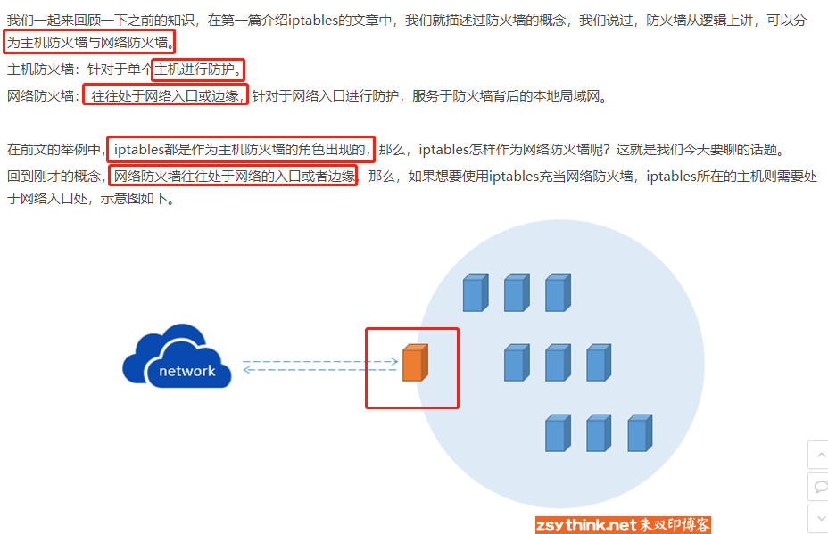
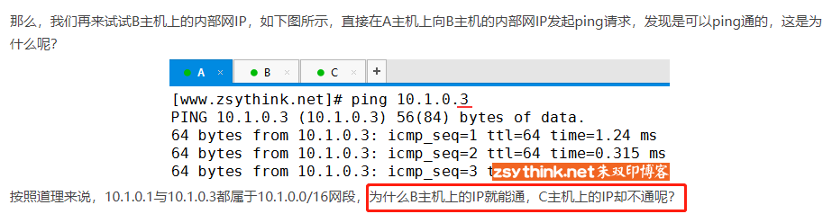
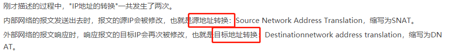

## iptables 学习笔记

[TOC]

**参考博客：http://www.zsythink.net/archives/1199**

### iptables概念

iptables 其实不是真正的防火墙，可以理解成一个**客户端的代理**，通过iptables 这个代理，将用户的安全设定执行到对应的安全框架中，这个安全框架就是真正的防火墙，这个框架是 **netfilter**。

**netfilter** 是防火墙真正的安全框架，位于Linux的 **内核空间。**

**iptables** 其实是一个命令行的工具，位于 Linux的 **用户空间** ，我们使用 iptables 这个工具操作 netfilter 的安全框架。

**netfilter** 是Linux操作系统核心层的一个数据包处理模块，具有如下的功能：

1. 网络地址转换（Network Address Translate）
2. 数据包的内容修改
3. 数据包过滤（防火墙）

我们使用 service iptables start 启动iptables 的服务，其实准确的来说，iptables 并没有一个守护进程，并不是一个真正意义上的服务，而是 **内核提供的一个功能**。

### iptables基础


### 链的概念


### 表的概念


### 表链关系


### 数据包经过防火墙的流程


### 规则的概念


### iptables规则查询


### iptables规则管理


#### 增加规则


#### 删除规则


#### 修改规则


#### 保存规则


### iptables匹配条件总结

#### 匹配条件的更多的用法


```
按照上面的配置，如果此时 从146 的机器上 向防火墙所在的主机 ping 请求，146 的主机能得到回应吗？（不考虑其他链，只考虑INPUT链）
答案是： 能
上面的规则表达的意思是：源IP不是192.168.1.146 的报文就接收。但是并不代表源IP 是192.168.1.146 时就进行拒绝。上述，没有任何一条的规则限定 源IP是 192.168.1.146 的ip 执行何种操作，所以执行默认的操作ACCEPT
```

#### 匹配条件：目标IP地址


```
当一条的规则中存在多个戴尔匹配条件的时候，报文必须都满足这些条件，才算被规则匹配，多个规则之间是与的关系。
```

#### 匹配条件：协议类型


#### 匹配条件：网卡接口


#### 扩展匹配条件


#### iprange扩展模块


#### string扩展模块


#### time扩展模块


#### connlimit扩展模块


#### limit扩展模块


```
原因是 6s 的时候的数据包是匹配，这条规则进行放行的，而 6s之前的包没有匹配这条规则，则继续往下面的规则匹配，匹配到默认的规则进行了放行。
```


```
最开始的 5个ping 包是通的，这是因为 --limit-burst 的默认值是5，桶中默认已经存在了5个令牌
```


#### 扩展匹配条件之 “--tcp-flags”


#### 扩展匹配之udp和icmp扩展


#### 扩展模块之state模块


```
我们的客户端为了 链接 http或ssh 服务，开放了 80 或22 的端口的回包，但是如果其他的主机 通过80 恶意的发送数据到我们的客户端，我们也是可以收到的。
```


### iptables的黑白名单机制


### iptables自定义链


### iptables之网络防火墙



```
橘黄色的主机位iptables所在的主机，此时的iptables充当的角色即为网络防火墙；上图中的浅蓝色园形表示网络防火墙所防护的网络区域
```


#### 环境准备




```
B主机没有开启 内核转发 所以包到了B主机之后，不能进行转发，则不会进行报文转发
```


#### 网络防火墙测试


#### 小结


### iptables动作总结之一

#### 动作REJECT


#### 动作LOG


#### 动作MARK


### iptables动作总结之二


#### **场景1**





#### **场景2**


#### 实验环境


#### 动作SNAT


#### 动作DNAT


#### 动作MASQUERADE


#### 动作REDIRECT


#### 小结


### iptables小结


