## Kubernetes 入门公开课

### 第一堂云原生课


### 容器的基本概念


```
containerd： 容器的运行时管理引擎，独立于moby daemon，提供容器及镜像的相关管理
containerd-shim: 这个模块也是一个守护进程，他会去管理容器的生命周期，提供了插件化的管理机制，接入其他的容器运行时；这种插件化是可以被containerd动态接管的，如果对 moby或containerd进行升级，可以在不影响现有运行的容器的情况下进行
```


### Kubernets核心概念与API原语


```
kubernets 可以把用户提交的容器放到 kubernets 管理集群的某一台主机上，k8s 的调度器是执行这项能力的组件，会根据 所调度的容器的大小规格 调度到合适的机器上，进行一次 placement （放置的操作）
```

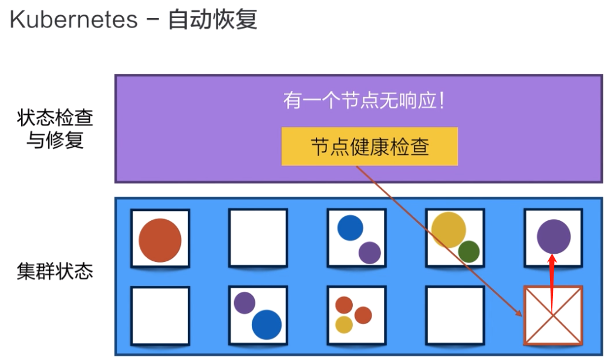


```
黄颜色的容器 检测到过于繁忙，就可以进行扩展到 三台的节点上，把负载流量打到三个节点上
```


```
API server： 进行API操作的，k8s 的所有组件都会和API进行操作
Controller: 控制器用来对集群的状态的管理，比如容器的自动修复，自动的水平扩容就是 controller能力
Scheduler: 把用户提交的container 根据资源需求，找一台合适的节点进行 放置
etcd： 分布式的存储系统，API server 所需的元数据的信息都放置在etcd 中

API server：在部署结构上是一个可以水平扩展的组件
Controller： 可以进行热备的部署组件，只有一个active
Scheduler：可以进行热备部署，只有一个active
```


```
kubelet: 接收APIserver 关于pod的运行状态，提交到container runtime的组件中，在OS进行pod的创建
kubernets 并不会直接对网络进行操作，会通过 Storage Plugin 和Network Plugin对网络进行操作
kube-proxy: 真正的完成service组网的组件，利用iptables、ipvs的能力
kubelet 不会直接和user进行交互，而是通过master进行操作
```


```
1. 用户通过UI或CLI提交一个pod给kubernets进行部署
2. pod的请求会首先通过UI或CLI提交给APIserver，API server会把这个信息写入到etcd
3. 之后，Scheduler会通过 watch或notify机制得到这个信息有一个pod需要被调度
4. Scheduler 会根据一系列的调度选择算法进行一次的调度决策
5. 之后会告诉api server 它会被调度到哪个节点， api server将调度的 决策结果写入到etcd中
6. kubelet watch 到API server 有本节点的pod的创建，拉取信息进行创建
```


### 理解pod与容器设计模式


```
Monitoring Adapter： 将 /metrics 的容器的接口，转换为 /healthz 接口
```


### 应用编排与管理核心原理


```
Labels: 资源的标签
Annotations: 用来描述资源的注解
OwnerRefernce: 描述多个资源之间相互关系的
```


```
标签可以添加域名，用来标识打标签的组织
```


```
逻辑与
```


```
replicaset 和pod 存在级联关系
```


```
replicaset 的 资源
```

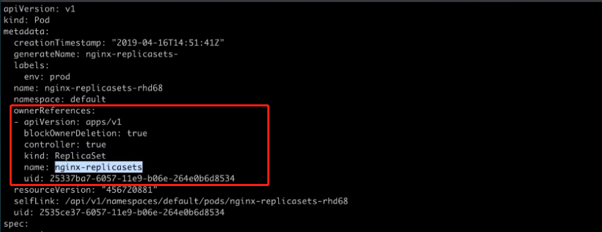

```
可以看到 pod 的引用 为 replicaset
```


### 应用编排和管理 - Deployment


### 应用编排和管理 - Job和DaemonSet


```
执行8次，每次两个pod，四个批次
```


### 应用配置管理


### 应用存储和持久化数据卷 - 核心知识


```
用户创建PVC的时候，需求的 存储大小和访问控制模式，和预先创建好的 PV的大小和访问的模式相同，则k8s 就会把它们 bound到一起
```


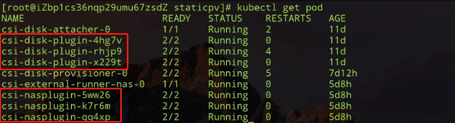

```
阿里云的 csi 的存储的插件
```


### 应用存储和持久化数据卷 - 存储快照与拓扑调度


```
通过模板 VolumeSnapshotClass 进行定义Volume Plugin
VolumeSnapshot 执行 VSC 类型，以及快照来源的PVC

使用的PVC定义的时候，指定DataSource 为定义的disk-snapshots
```


```
PVC 和 PV 的延时绑定
```


```
pod 没有创建的话，则PVC一直处于pending的状态
```


### 可观测性 - 你的应用健康吗？


### 可观测性 - 监控与日志


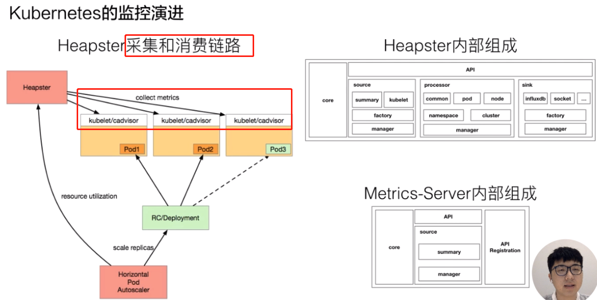

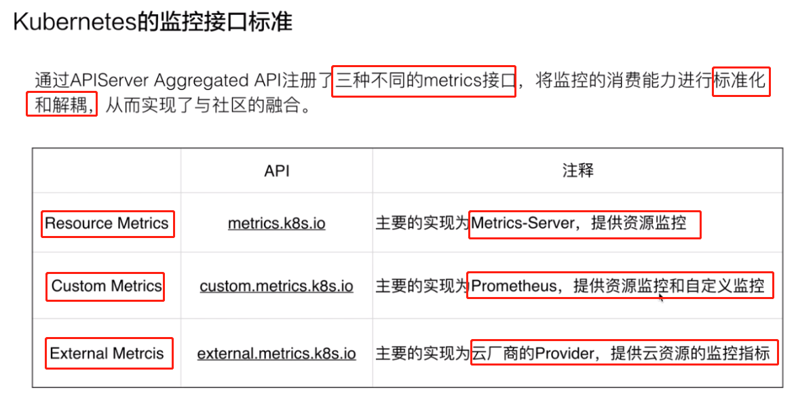


### kubernets网络概念及策略控制


### Kubernets Service


### 深入剖析Linux容器


```
有七种的 namespace，docker 容器实现的是 1-6中，第七种在 docker的 runc中实现
1. mount： 实现的是容器的文件视图是容器镜像提供的文件系统，和操作系统隔离
2. uts：隔离hostname和domain name 
3. pid：保证容器的init 进程是 1号进程启动的
4. network：除了容器使用 host网络之外，其他的网络模式都有自己的network namespace的文件
5. user: 这个namespace是控制用户的uid个gid容器内部和宿主机映射
6. ipc: 这个namespace是控制进程间通信东西，比如信号量
7. cgroup: 右边的两张图是开启和关闭 cgroup namespace，开启之后容器内部看到的namespace视图是以根的形式呈现的，和宿主机看到的namespace看到的视图方式是一样的，让容器内部使用cgroup更加安全
```


```
容器内部的 namespace 都是使用unshare的系统调用创建的

下图创建的是一个pid的namespace，可以看到bash 的pid为 1
```


```
device 和freezer这两个都是为了安全的
device控制你在容器中可以看到的设备
freezer：停止容器的时候使用，停止容器的时候，会把当前容器的所有的进程写入cgroup 把所有进程都（冻结掉 freezer）， 放置在停止的时候存在进程做 fork 逃逸到宿主机上device 和freezer这两个都是为了安全的
device控制你在容器中可以看到的设备
freezer：停止容器的时候使用，停止容器的时候，会把当前容器的所有的进程写入cgroup 把所有进程都（冻结掉 freezer）， 放置在停止的时候存在进程做 fork 逃逸到宿主机上

blkio: 用于限制容器使用到的磁盘iops和bps的速率限制
pid：限制的是容器里面使用的最大的进程数量

右边的docker中不常使用的cgroup，对于runc来说，所有的cgroup（除了rdma），在runc都是支持的，docker并没有开启这部分的支持
```

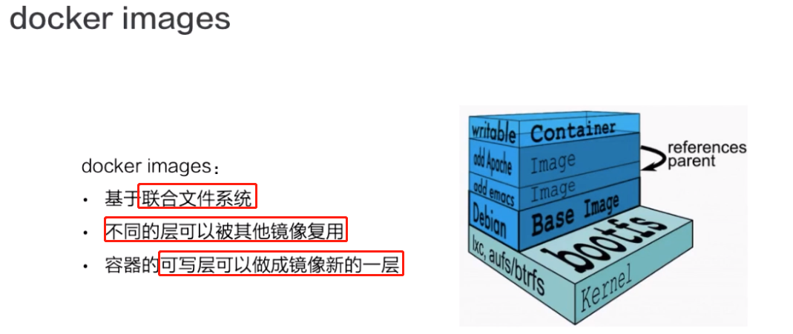


```
容器 start 是需要创建相应的namespace的，而exec则只是加入到已有的namespace中去
```

### 深入理解etcd - 基本原理解析


```
Transactions： etcd 提供的事务操作
```


```
term: 整个集群的leader 的任期，leader切换的时候对应的term值都会加一
revison：全局的数据的版本，当数据发生变更，创建删除修改的时候revison的版本都会加一，revison的存在使得etcd可以支持MVCC和数据的watch

KeyValue: 对于每一个keyvalue etcd记录了三个的版本的信息
	create_revison: 当前的kv在创建的时候，操作对应的版本号
	mod_revison: 数据被修改的时候其操作对应的版本号
	verson: 计数器，记录该kv被修改了多少次
```

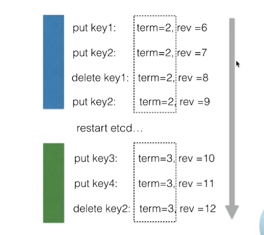


```
etcd 中所有的数据存储在B+tree 中，这个B+tree 保存在磁盘中，并通过map的方式映射到内存来加速查询操作

灰色的B+tree 存储着revison到value的映射关系
蓝色的B+tree 管理者 key到revison的映射关系
查询数据的时候，通过蓝色的B+tree 把key翻译成revisons，在通过灰色的B+tree 通过revison获取对应的value
```


```
etcd的事务机制
if的条件满足则，执行then，否则执行 else
k9s API server就是通过 etcd的事务性来实现多个api server的操作数据的一致性
```


```
lease（租赁） 是分布式系统中的一个常见的概念，用来代表一个租约，在分布式系统中检测一个节点是否存活的时候需要这个租约的机制。

上图中首先创建了一个 10s的租约，如果创建这个租约什么也不做，则10s后这个租约就会过期。
接着讲key1和key2 绑定到了这个租约之上，当这个租约过期的时候，etcd就会自动的气力到key1和key2的值。

如果我们希望这个租约永不过期，需要检测分布式系统中一个进程是否存活，在这个分布式系统中访问etcd创建一个租约，同时在这个进程中调用keepalive的方法，去etcd保持这个租约不断的续约的过程，事项如果这个进程挂掉之后，就不会到etcd进行续约，租约到期会就会被etcd清理掉，一次来判定节点是否存活

etcd 允许将多个的key关联到一个 lease上，这个设计很巧妙，将多个key保存在lease上，可以减少lease对象的刷新时间，减少大量key去刷新租约带来的性能问题，提升etcd的性能
```


```
安装范围查询
```


```
前缀查询
```


```
header 消息头是全局的信息
```


```
新增一条数据发现当前的 全局的revison 为13，版本增加了 1，raft_term 值不变
```


```
对key5的值进行了修改，则mod_revison 会更改为，当前系统的全局的版本号
做了一次的修改，则version的版本增加了1
```


```
再次修改 key5，全局的revison改变为了 15，也是key5的 mod_revison的版本
version做了第三次的修改，version为3
```


```
删除key5的时候，全局的revison变为了17
```


```
重新创建key5之后，create_revison和mod_revison都是从17开始的
```


```
停止etcd再尝试启动etcd，集群raft_term值已经从2 到3了
```


```
kubernets 通过etcd存储了大量的状态数据，通过etcd进行状态的流转，大大的降低了系统设计的复杂性
```


```
避免 master节点的单点，使用etcd进行master故障后的master的选主工作
```


```
可以防止进程的并发执行，可以依次的调度进程的执行，
当进程执行到一半死掉之后，可以提出故障节点，分发未执行完成的任务到存活的节点上
```


### 深入理解etcd - etcd的性能优化实践


```
蓝色的为raft层
红色的为storage层：
	treeIndex层： 索引层
	boltdb：底层持久化存储kv层
```


```
红色的为已经使用的，白色的已经不使用，可以进行回收的存储位置，之前在需要存储连续页面为三的存储位置的时候，需要，从头开始进行扫描，当key数量比较大的情况下，性能会急剧的下降。

优化的算法是：建立一个freemap的hashmap，记录连续存储的位置的信息，需要三个的存储的位置的时候，就通过查找hashmap，直接O(1)的复杂度，到具体的位置进行存储
```


### Kubernets 的调度和资源管理


```
requests: 是资源保底的需求
limits：是资源的限制

ephemeral-storage：短暂的，临时存储
CPU: 可以小数 如：0.25（250m）

extended-resource: 扩展资源必须是整数，比如GPU只可以是1个或2个等
```


```
非整数的request cpu：会共享cpu2 到 cpu7 的CPU的使用

OOM的得分越高的话，在发生OOM的情况下会优先被 eviction（驱逐）
```


```
当资源使用超出之后，在提交创建pod的请求的时候，会受到一个403的foridden的错误
```


```
必须调度到 k1=v1 标签的节点上
```


```
Gt/Lt: 数值比较的玩法
```


```
NoExecute：这个行为不仅会evict所有的对这个节点没有 toleratioin的pod，还不会调度新的pod上来，这个行为比其他两个行为都严苛
```


```
低优先级的pod1（上图的蓝色），被驱逐，高优先级的pod2（下图黄色）持有了这两个CPU的使用
```


```
内置默认的优先级，没有进行优先级配置的话，则优先级为0
用户可配置最大的优先级为 10亿
系统可配置的最大的优先级为 20亿
```


```
pod2和pod1 先后进入优先级调度队列
```


```
出队列的时候，优先对高优先级的进行调度，把pod1 bind到node1上
```


```
在对pod2这个低优先级的pod进行调度
```


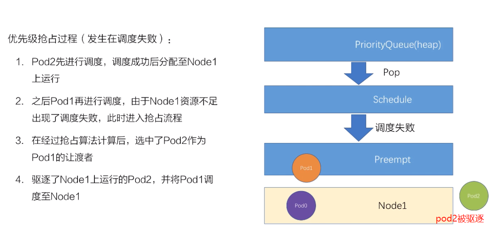

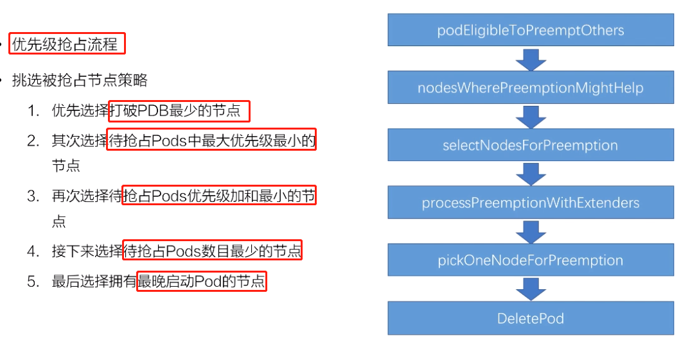

```
打破PDB最少：抢占的这个节点影响的服务最小
```


### 调度器调度流程和算法介绍


```
reserve：预占用，储备
```


```
预选器：Predicates
```


```
skew: 倾斜的意思
ActualSkew = count[topo] - min(count[topo])
现在的三个zone的的pod 分别为 1,1,0；假设调度到了 zone1 上，则 单个zone的 值为 2,1,0； 则 ActualSkew = 2 - 0 = 2， 大于了 maxSkew=1的设定，所以只能调度到 zone3上

对于有容灾需求的可以设定 maxSkew 值，进行pod进行打散，设置maxSkew=1则在每个zone就是均衡的
```


```
Prioritues: 优选器，打分算法
```


```
使用 --write-config-to 写入文件（默认的配置）
```


### GPU管理和Device Plugin工作机制


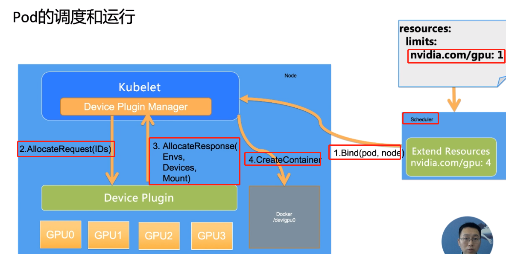

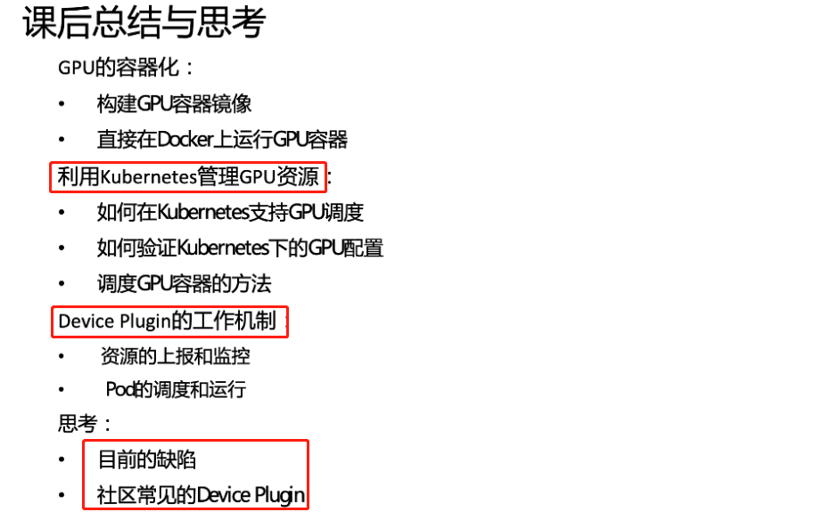


### Kubernets存储架构及插件的使用


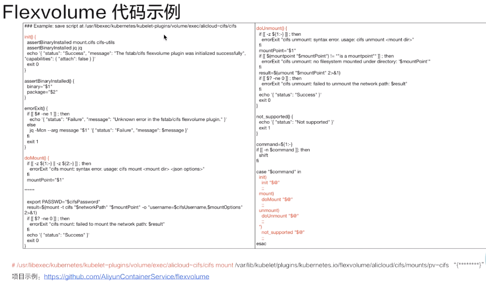


```
监听/var/lib/kubelet/plugin_registry/ 目录每添加一个sock文件，就注册一个plugin
```


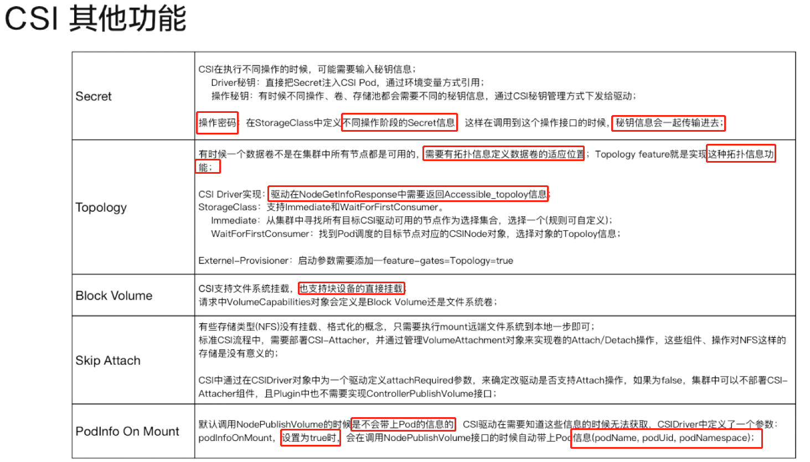


### 有状态应用编排 StatefulSet


```
为每一个nginx 申请PVC 挂载到 /usr/share/nginx/html 下
```


```
www-storage 为PVC的name
nginx-web: stateful name
从而达到不同的pod 绑定不同的pv的需求
```


```
三个nginx依次创建，pvc也依次创建绑定

stateful 在版本更新前后，会复用之前创建的 PVC的存储，以及网络资源，从而达到有状态应用的数据前后一致性的要求
```


```
如果补丁已PVC的 template，则创建出来而pod就不会挂载独立的PV

statefulSet Owned 三个资源： controller revison，Pdd，PVC，但不同的是，statefulset 只会在 controller revison和pod中添加 ownref的信息，不会在PVC 添加owenref。

拥有ownref资源，他的管理资源在删除的情况下，会级联删除下属资源，默认情况下删除 statefulset的资源之后，不会删除PVC
```


### Kubernets 的API编程范式


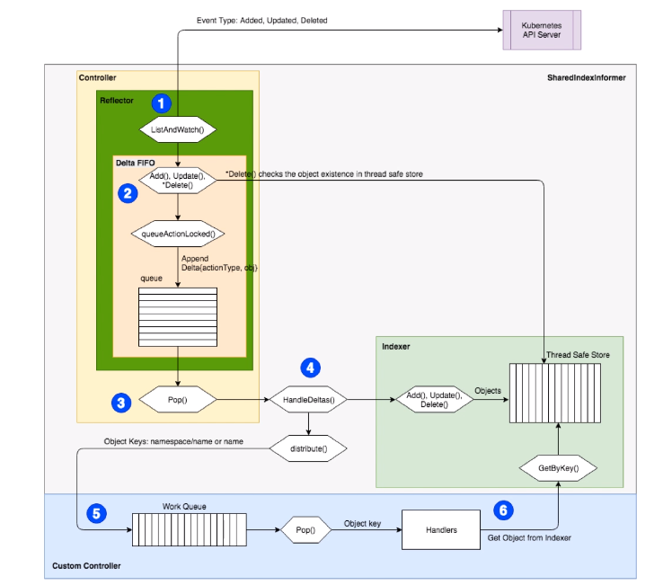

### Operator 和 Operator Framwork

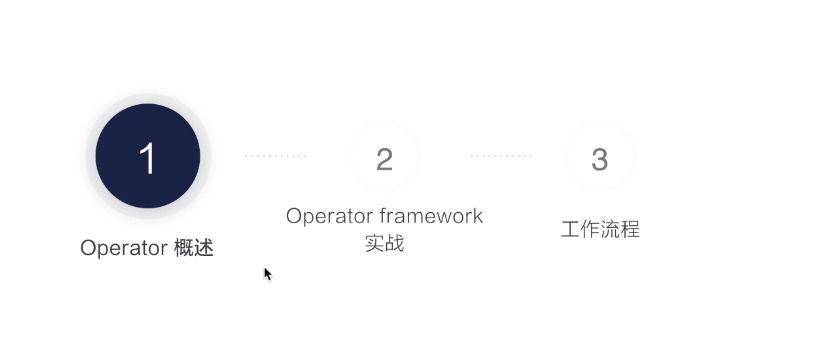


```
蓝色的 为 上面三次的命令执行的生成文件
```


```
可能使用 webhook 完成 业务的逻辑，而不使用controller
```

### Kubernets网络模型进阶


```
如果不经由路由，可以使用 vxlan的隧道，填写对端的隧道号，把包发到对端
```

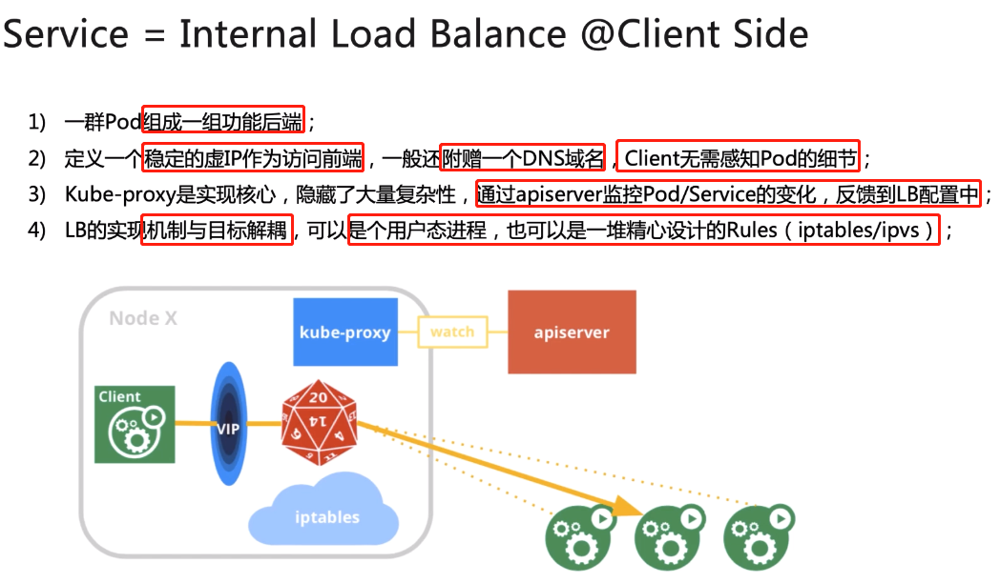


### 理解CNI和CNI插件


```
Overlay：容器有独立于主机的ip段，跨主机通信的时候，在每个主机创建隧道的方式，把容器网络的包封装成底层物理机之间的包，好处是不依赖与底层的网络。
路由模式：容器独立于主机的网络，跨主机通信使用路由的方式，依赖底层网络的二层可达的能力
underlay： 容器和宿主机是同一层的网络
```


```
给pod分配ip：
	一般会把pod的网段按node进行分段，这样视为了保证分配给pod的ip是不冲突的
```


### Kubernets安全之访问控制


```
Authentication： 认证，是否为合法用户
Authorization: 鉴权，认证通过的用户是否 有权限访问
Admission Control: 访问的请求是否合规安全
```


```
RBAC是面对API级别的绑定，不能绑定到具体的实例对象
```


### 理解容器运行时接口 - CRI


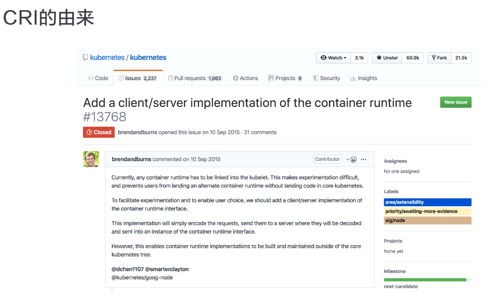


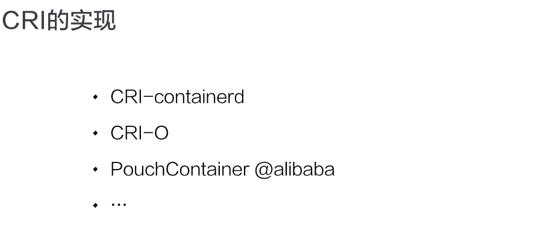


### 安全容器技术


```
gVisor的做法是：对于不常用的系统调用直接在sentry里处理调用，只有大约20%的会进行Linux系统调用
Linux的攻击大都是通过open() 这个系统的调用进行，因为open()在Linux系统中可以做太多的事情了，gVisor 就把open() 做了一个专门的进程 Gofer来执行操作

sentry和 Gofer都是使用golang实现的，是一个内存安全性的语言，就少了攻击
```


### 理解RuntimeClass与使用多容器运行时


```
handler：代表的是真正的容器运行时
scheduling.nodeSelector.runtime: runv : 会根据节点的标签选择调度到runv使用的 运行时，然后handler： runv，则使用runv的运行时启动容器
```


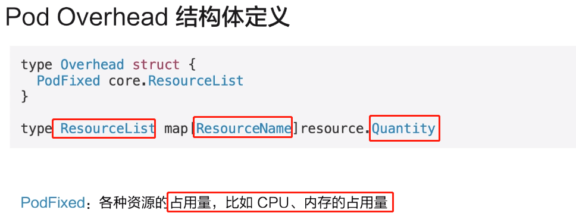


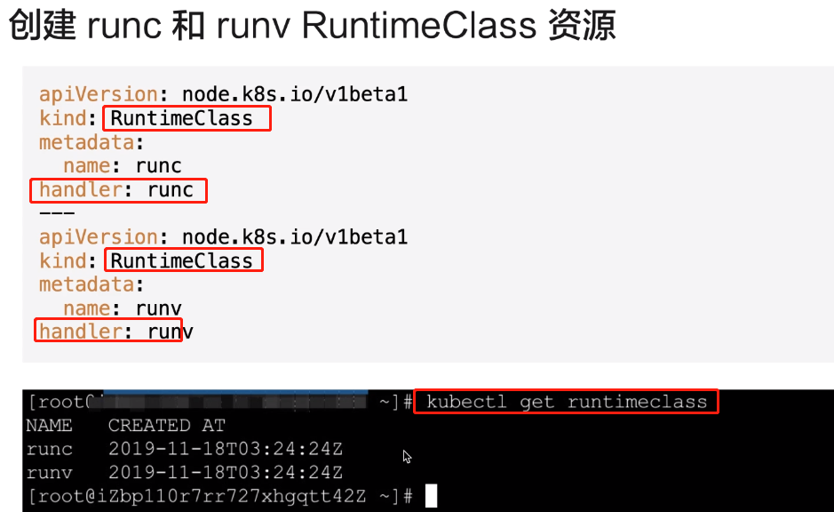


