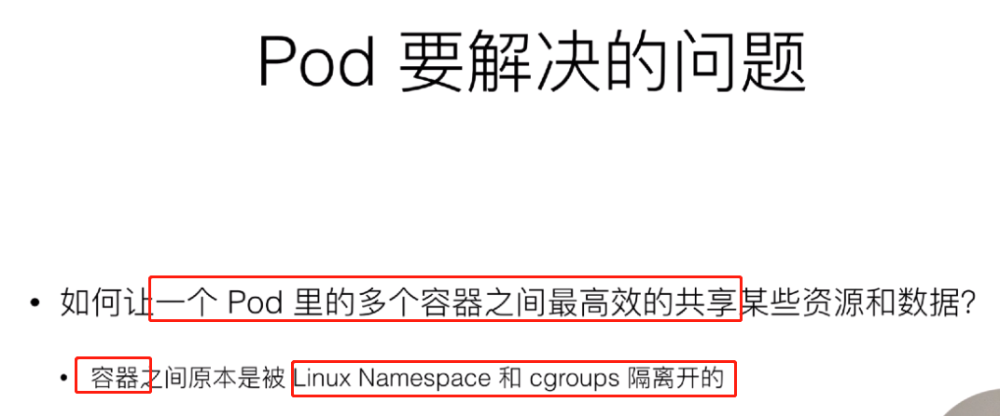

## Kubernetes 入门公开课

### 第一堂云原生课


### 容器的基本概念


```
containerd： 容器的运行时管理引擎，独立于moby daemon，提供容器及镜像的相关管理
containerd-shim: 这个模块也是一个守护进程，他会去管理容器的生命周期，提供了插件化的管理机制，接入其他的容器运行时；这种插件化是可以被containerd动态接管的，如果对 moby或containerd进行升级，可以在不影响现有运行的容器的情况下进行
```


### Kubernets核心概念与API原语


```
kubernets 可以把用户提交的容器放到 kubernets 管理集群的某一台主机上，k8s 的调度器是执行这项能力的组件，会根据 所调度的容器的大小规格 调度到合适的机器上，进行一次 placement （放置的操作）
```


```
黄颜色的容器 检测到过于繁忙，就可以进行扩展到 三台的节点上，把负载流量打到三个节点上
```


```
API server： 进行API操作的，k8s 的所有组件都会和API进行操作
Controller: 控制器用来对集群的状态的管理，比如容器的自动修复，自动的水平扩容就是 controller能力
Scheduler: 把用户提交的container 根据资源需求，找一台合适的节点进行 放置
etcd： 分布式的存储系统，API server 所需的元数据的信息都放置在etcd 中

API server：在部署结构上是一个可以水平扩展的组件
Controller： 可以进行热备的部署组件，只有一个active
Scheduler：可以进行热备部署，只有一个active
```


```
kubelet: 接收APIserver 关于pod的运行状态，提交到container runtime的组件中，在OS进行pod的创建
kubernets 并不会直接对网络进行操作，会通过 Storage Plugin 和Network Plugin对网络进行操作
kube-proxy: 真正的完成service组网的组件，利用iptables、ipvs的能力
kubelet 不会直接和user进行交互，而是通过master进行操作
```


```
1. 用户通过UI或CLI提交一个pod给kubernets进行部署
2. pod的请求会首先通过UI或CLI提交给APIserver，API server会把这个信息写入到etcd
3. 之后，Scheduler会通过 watch或notify机制得到这个信息有一个pod需要被调度
4. Scheduler 会根据一系列的调度选择算法进行一次的调度决策
5. 之后会告诉api server 它会被调度到哪个节点， api server将调度的 决策结果写入到etcd中
6. kubelet watch 到API server 有本节点的pod的创建，拉取信息进行创建
```


### 理解pod与容器设计模式





```
Monitoring Adapter： 将 /metrics 的容器的接口，转换为 /healthz 接口
```


### 应用编排与管理核心原理


```
Labels: 资源的标签
Annotations: 用来描述资源的注解
OwnerRefernce: 描述多个资源之间相互关系的
```


```
标签可以添加域名，用来标识打标签的组织
```


```
逻辑与
```


```
replicaset 和pod 存在级联关系
```


```
replicaset 的 资源
```


```
可以看到 pod 的引用 为 replicaset
```


### 应用编排和管理 - Deployment


### 应用编排和管理 - Job和DaemonSet


```
执行8次，每次两个pod，四个批次
```


### 应用配置管理


