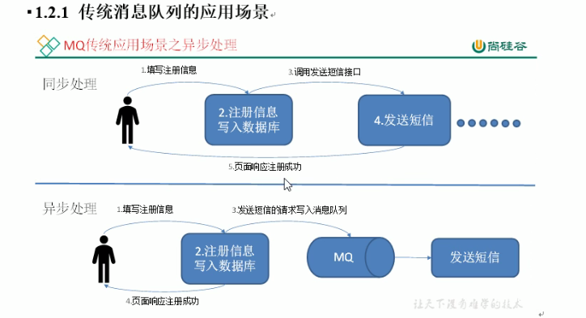
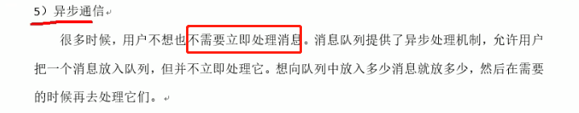
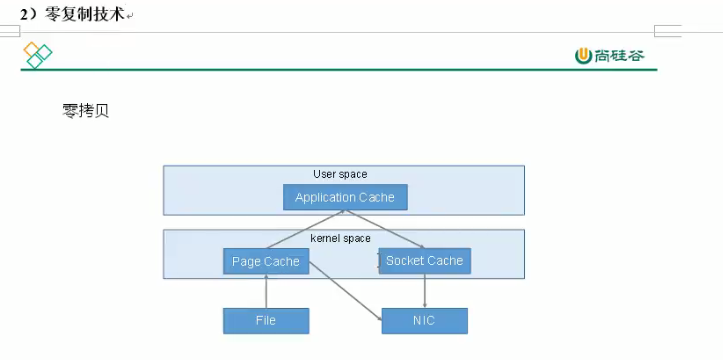

## Kafka 学习笔记

### 第一章、Kafka概述

#### 1.1 定义


#### 1.2 消息队列

##### 1.2.1 消息队列的应用场景



```
业务解耦
削峰填谷
```




##### 1.2.2 消息队列的两种模式


```
只能发送给一个人
```


```
消费者消费消息的两种方式：
	1. 消费者主动拉去（kafka的模式）
		消费者消费速度由消费者自己确定，缺点是消费者一直要有一个长轮询，一直去队列询问是否有新的消息，没有新信息的时候，也不停的轮询
	2. 队列进行推送
		缺点是 如果消息量很大，推送消息 可能对不同的 消费能力的消费者，有的 承受不了，有的吃不饱
```

#### 1.3 Kafka 基础架构


```
Broker: 启动 kafka 的服务器
Topic: 把消息进行分类，不同的类型的消息，放入不同的topic， 消费者通过topic进行消费
	partition：一个 topic 可以有多个 partition 可以提高消息的并发写入
		leader：每一个 partition 分为 leader 和 follow， follow是leader的副本，数据写入时只有leader其作用，follow只是在宕机的时候才起作用，提升为leader
consumer GROUP：
	多个消费者可以划分为一个消费组，一个分区只能被同一个消费组中的一个消费者消费，一个topic 的partiton的数量应该和消费者的数据相同，才能更好的提高并发。
	如果partition的数量小于consumer的数量，则多出来的consumer 是无法消费到数据的

zookeeper: 
	kafka 存储kafka集群的信息，topic 和分区，以及消费者的信息，在broker 宕机的时候，可以进行故障转移，提升 follow的分区为leader
	保存消费者消费消息的位置
	0.9 版本之前，存储 consumer的消费位置保存在zk中
	0.9 版本之后，consumer的消费位置保存在kafka 本地，为了避免consumer 过多的与kafka进行交互，带来zk压力过大
```


### 第二章、Kafka 快速入门

#### 2.1 安装部署


#### 2.2 kafka 命令行操作


 


```
创建 topic 两个分区，两个副本，分片在三台机器上
```


```
删除分区，需要在配置文件中 指定 delete.topic.enable 为true
```


```
创建topic 的时候，partition 不能大于 broker数量
```


```
之前消费者连接的是 zk 的地址，这里 连接的 bootstrap-server 是kafka的集群地址
```


```
0.9 版本之后，consumer的消费位置，存储在kafka 本地，这是存储数据的topic 默认50个分区
使用新的连接方式连接之后，创建在本地的topic
```


```
zk里面存储的数据，除了 zookeeper 节点，其余的都是 kafka的节点

zk中的version-2 是存储的zk的数据
```

### 第三章、kafka架构深入

#### 3.1 kafka 工作流程


```
index 记录消息的 offset 和 消息的起始偏移量，以及消息的大小

通过 offset 知道 消息的其实偏移量，在读取到消息大小的数据
```

#### 3.2 kafka 生产者


```
全部同步成功后， n+1 个副本， 可以容忍n 台的故障；
但这种方案有个问题，要是有一台挂了之后，永远无法 ack 完成
```


```
采用 ISR的 优化方案，在一个节点宕机之后，剔除 ISR集合，从 ISR集合中 选取leader
```


```
acks: -1  丢数据的情况， 当 ISR 里面只剩 leader 的情况下，leader 宕机的情况会有数据丢失
```


```
故障的时候，只有 HW 之前的数据 才可以被消费者 可见
```


#### 3.3 kafka 消费者


```
默认是采用的 range 的模式，是按照主题来进行分区的划分，带来的问题可能是分区分配不均衡的问题；
round robin 是安装消费组来进行分区划分，分区分配教均衡，但是在 同一组内的消费者消费 多个topic 的时候，导致分区分配 可能存在重复 分配问题。

当一个 消费组内添加新的 消费者的时候， 分区会进行重新的分配
```


```
原有 一个消费组中只有 一个消费者 A， 消费到了的 offset 是 10；
有添加了一个消费组 B, 他是 从 10 的位置开始消费的， 因为 A和B 是属于同一个消费者的 
```


```
console-consumer-88502 这个是消费者组，在没有指定的时候，自动的生成一个
```


```
消费者组的数据
```


```
获取消费者组 分区的数据
```


```
exclude.internal.topic=false ## 配置后可以使用自己的消费者，消费系统的主题的消息
```


```
可以查看 启动的消费者的情况，同一时刻 只有一个 消费者 进行消费
```

#### 3.4 Kafka 高效读写数据





```
正常的 文件写入流程， 从文件到 内核空间page cache 通过用户空间的 应用，在写到 内核空间的 socket cache 之后通过网络进行发送
```


```
零拷贝 省去了 在用户空间的操作
```

```
分布式环境 下的 kafka 效率高，还有一个原因是，采用了分区的架构，提高了磁盘的并发写入能力
```

#### 3.5 zookeeper 在Kafka中的作用


```
当前的 contoller的资源 broker的id 为0
```


```
停止 id 为0的kafka
```


```
id为1 的kafka broker 抢到了资源，则他就是新的controller
```

#### 3.6 Kafka 事务


### 第四章 Kafka API

#### 4.1 Producer API


### 第五章 Kafka 监控


