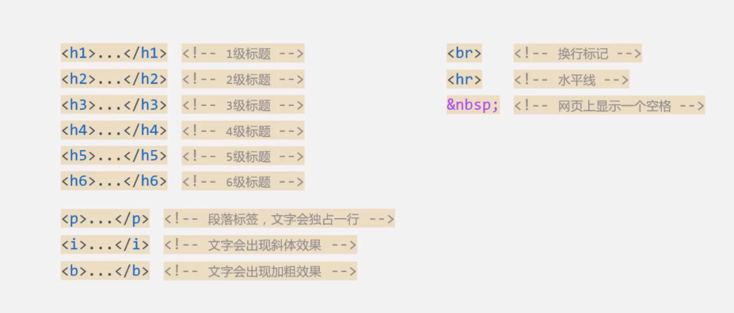
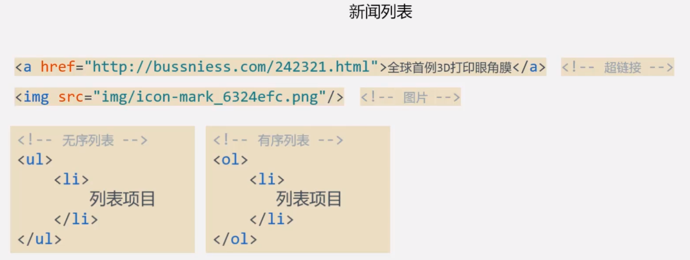
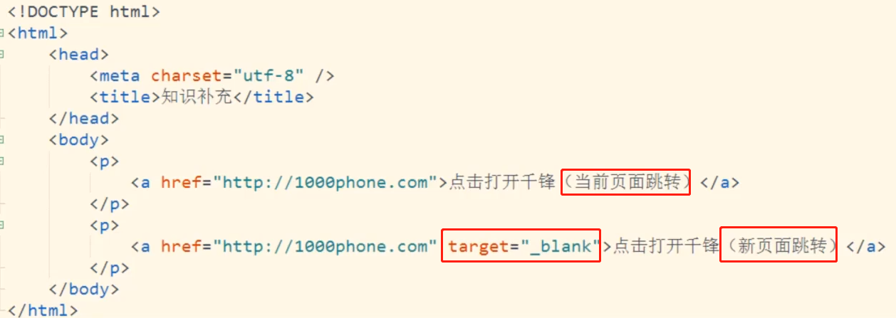
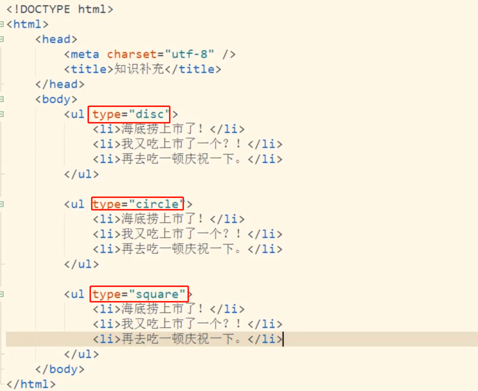
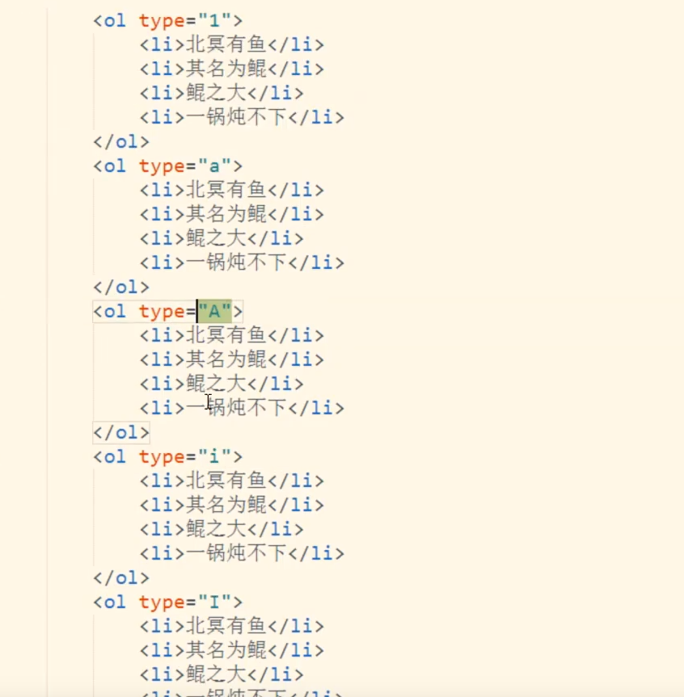
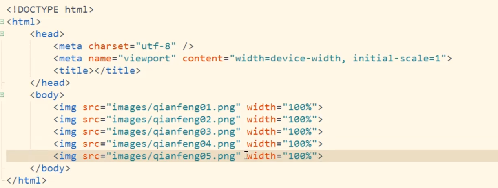
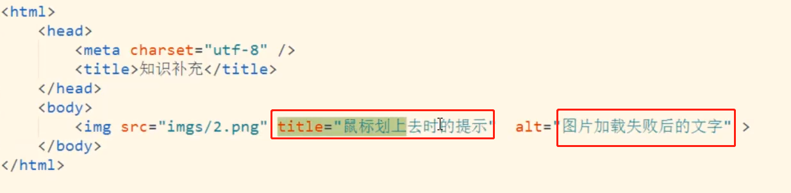
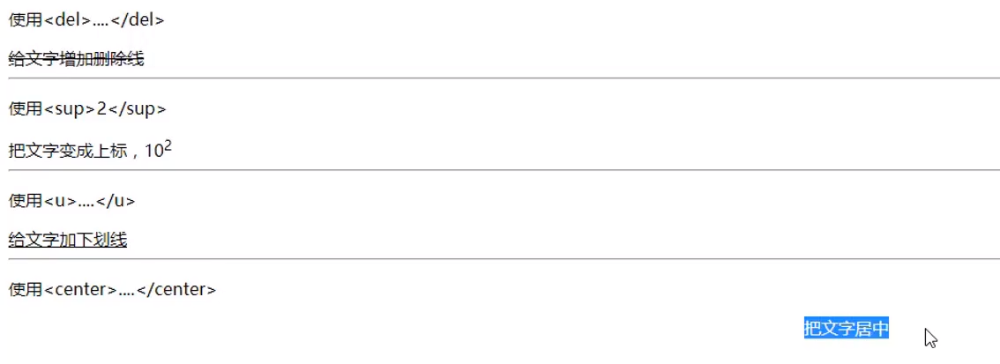

## H5 CSS学习笔记

[TOC]

### 一篇博客



### 新闻列表





```
超链接的跳转
```



```
disc: 实心圆
circle：空心圆
square：方块
```



```
1：数字排序
a: 小写字母排序
A: 大写字母
i: 小写罗马字母
I: 大写罗马字母
```

### 图片的使用



```
可以设定图片的 宽度 width=100px  这时候图片会进行等比例的缩放
width=100% 表示撑满整个的窗口
```



