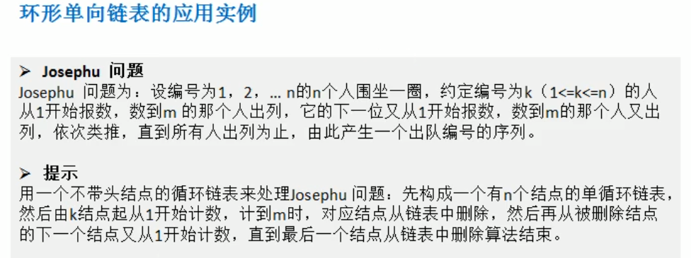
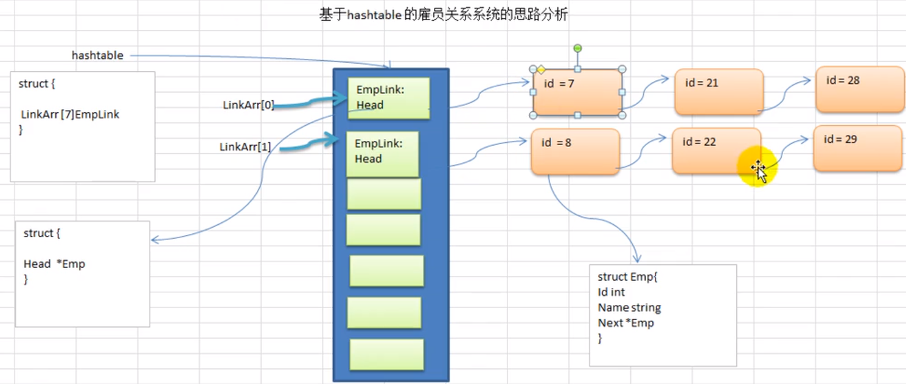

### 数据结构与算法

#### 稀疏数组


```
稀疏数组的做法：
1. 记录数组一共有几行几列，有多少个不同的值
2. 把具有不同值得行列及值记录在一个小规模的数组中，从而缩小程序的规模
```

```
package main

import "fmt"

type ValNode struct {
	row int
	col int
	val int
}

func main()  {
	var chessMap [11][11]int
	chessMap[1][2] = 1
	chessMap[2][3] = 2

	for _, v := range chessMap {
		for _, v2 := range v {
			fmt.Printf("%d\t", v2)
		}
		fmt.Println()
	}

	// 转换为稀疏数组
	// 遍历chessMap, 如果发现有一个元素的值不为0， 则创建一个ValNode 的结构体
	// 存放入到 ValNode 切片中

	// 先创建第一个valNode 节点
	valNode := ValNode{
		row: 11,
		col: 11,
		val: 0,
	}

	var sparseArr []ValNode
	sparseArr = append(sparseArr, valNode)

	for i, v := range chessMap {
		for j, v2 := range v {
			if v2 != 0 {
				valNode := ValNode{
					row: i,
					col: j,
					val: v2,
				}
				sparseArr = append(sparseArr, valNode)
			}
		}
	}

	// 输出稀疏数组
	fmt.Println("输出稀疏数组...")
	for i, valNode := range sparseArr {
		fmt.Printf("%d: %d %d %d\n", i, valNode.row, valNode.col, valNode.val)
	}

	// 不适用 数组，可以使用切片，避免固定数组长度
	var chess [11][11]int

	for i, v := range sparseArr {
		if i != 0 {
			chess[v.row][v.col] = v.col
		}
	}

	fmt.Println("稀疏数组转换到原数组...")
	for _, v := range chessMap {
		for _, v2 := range v {
			fmt.Printf("%d\t", v2)
		}
		fmt.Println()
	}
}
```

```
代码输出：
0	0	0	0	0	0	0	0	0	0	0	
0	0	1	0	0	0	0	0	0	0	0	
0	0	0	2	0	0	0	0	0	0	0	
0	0	0	0	0	0	0	0	0	0	0	
0	0	0	0	0	0	0	0	0	0	0	
0	0	0	0	0	0	0	0	0	0	0	
0	0	0	0	0	0	0	0	0	0	0	
0	0	0	0	0	0	0	0	0	0	0	
0	0	0	0	0	0	0	0	0	0	0	
0	0	0	0	0	0	0	0	0	0	0	
0	0	0	0	0	0	0	0	0	0	0	
输出稀疏数组...
0: 11 11 0
1: 1 2 1
2: 2 3 2
稀疏数组转换到原数组...
0	0	0	0	0	0	0	0	0	0	0	
0	0	1	0	0	0	0	0	0	0	0	
0	0	0	2	0	0	0	0	0	0	0	
0	0	0	0	0	0	0	0	0	0	0	
0	0	0	0	0	0	0	0	0	0	0	
0	0	0	0	0	0	0	0	0	0	0	
0	0	0	0	0	0	0	0	0	0	0	
0	0	0	0	0	0	0	0	0	0	0	
0	0	0	0	0	0	0	0	0	0	0	
0	0	0	0	0	0	0	0	0	0	0	
0	0	0	0	0	0	0	0	0	0	0	
```

#### 队列

```
1. 队列是一个有先后顺序的列表，可以使用数组或列表来进行实现
2. 遵循先入先出的原则
```


```
front 指到的位置为将要出队列的位置，rear 指到的位置为队列的最后一个位置
```


##### 单向队列（数组实现）

```
package main

import (
	"errors"
	"fmt"
	"os"
)

const (
	maxSize = 4
)

type Queue struct {
	array [maxSize]int // 数组模拟队列
	front int          // 表示指向队列的队首（不包含队首）
	rear  int          // 表示指向队列的队尾（包含队尾）
}

// 添加数据到队列
func (q *Queue) AddQueue(val int) (err error) {

	// 先判断队列是否已满, rear 为队列的尾部，包含最后的一个元素
	if q.rear == maxSize-1 {
		return errors.New("queue is full")
	}

	q.rear++
	q.array[q.rear] = val
	return
}

// 显示队列, 找到队首，遍历到队尾
func (q *Queue) ShowQueue() {
	fmt.Println("队列的当前的情况是:")
	for i := q.front + 1; i <= q.rear; i++ {
		fmt.Printf("array[%d]=%d\t", i, q.array[i])
	}
	fmt.Println()
}

func (q *Queue) GetQueue() (val int, err error) {
	// 判断队列是否为空
	if q.front == q.rear {
		return -1, errors.New("queue empty")
	}
	q.front++
	val = q.array[q.front]
	return val, nil
}

func main() {
	// 初始化一个队列
	queue := &Queue{
		front: -1,
		rear:  -1,
	}

	var key string
	var val int
	for {
		fmt.Println("1. 输入add ,向队列添加数据")
		fmt.Println("2. 输入get ,向队列取出数据")
		fmt.Println("3. 输入show ,显示队列数据")
		fmt.Println("4. 输入exit ,退出")

		fmt.Scanln(&key)
		switch key {
		case "add":
			fmt.Println("输入你想要的的数据:")
			fmt.Scanln(&val)
			err := queue.AddQueue(val)
			if err != nil {
				fmt.Println(err.Error())
			} else {
				fmt.Println("添加队列成功")
			}
		case "show":
			fmt.Println("显示当前队列的数据")
			queue.ShowQueue()
		case "get":
			val, err := queue.GetQueue()
			if err != nil {
				fmt.Println(err.Error())
			} else {
				fmt.Printf("从队列取出数据: %d\n", val)
			}
		case "exit":
			fmt.Println("退出。。")
			os.Exit(0)
		default:
			fmt.Println("你输入的命令错误。。")
		}
	}
}
```

```
输出结果：
1. 输入add ,向队列添加数据
2. 输入get ,向队列取出数据
3. 输入show ,显示队列数据
4. 输入exit ,退出
add
输入你想要的的数据:
1
添加队列成功
1. 输入add ,向队列添加数据
2. 输入get ,向队列取出数据
3. 输入show ,显示队列数据
4. 输入exit ,退出
add
输入你想要的的数据:
2
添加队列成功
1. 输入add ,向队列添加数据
2. 输入get ,向队列取出数据
3. 输入show ,显示队列数据
4. 输入exit ,退出
show
显示当前队列的数据
队列的当前的情况是:
array[0]=1	array[1]=2	
1. 输入add ,向队列添加数据
2. 输入get ,向队列取出数据
3. 输入show ,显示队列数据
4. 输入exit ,退出
get
从队列取出数据: 1
1. 输入add ,向队列添加数据
2. 输入get ,向队列取出数据
3. 输入show ,显示队列数据
4. 输入exit ,退出
show
显示当前队列的数据
队列的当前的情况是:
array[1]=2	
1. 输入add ,向队列添加数据
2. 输入get ,向队列取出数据
3. 输入show ,显示队列数据
4. 输入exit ,退出
add
输入你想要的的数据:
3
添加队列成功
1. 输入add ,向队列添加数据
2. 输入get ,向队列取出数据
3. 输入show ,显示队列数据
4. 输入exit ,退出
show
显示当前队列的数据
队列的当前的情况是:
array[1]=2	array[2]=3	
1. 输入add ,向队列添加数据
2. 输入get ,向队列取出数据
3. 输入show ,显示队列数据
4. 输入exit ,退出
add
输入你想要的的数据:
4
添加队列成功
1. 输入add ,向队列添加数据
2. 输入get ,向队列取出数据
3. 输入show ,显示队列数据
4. 输入exit ,退出
show
显示当前队列的数据
队列的当前的情况是:
array[1]=2	array[2]=3	array[3]=4	
1. 输入add ,向队列添加数据
2. 输入get ,向队列取出数据
3. 输入show ,显示队列数据
4. 输入exit ,退出
add
输入你想要的的数据:
5
queue is full
1. 输入add ,向队列添加数据
2. 输入get ,向队列取出数据
3. 输入show ,显示队列数据
4. 输入exit ,退出
get
从队列取出数据: 2
1. 输入add ,向队列添加数据
2. 输入get ,向队列取出数据
3. 输入show ,显示队列数据
4. 输入exit ,退出
get
从队列取出数据: 3
1. 输入add ,向队列添加数据
2. 输入get ,向队列取出数据
3. 输入show ,显示队列数据
4. 输入exit ,退出
get
从队列取出数据: 4
1. 输入add ,向队列添加数据
2. 输入get ,向队列取出数据
3. 输入show ,显示队列数据
4. 输入exit ,退出
get
queue empty			## front 与 rear 同事到达了 数组的尾部
1. 输入add ,向队列添加数据
2. 输入get ,向队列取出数据
3. 输入show ,显示队列数据
4. 输入exit ,退出
add
输入你想要的的数据:
5
queue is full		##  此时出现的情况是 队列为空 又为 满
1. 输入add ,向队列添加数据
2. 输入get ,向队列取出数据
3. 输入show ,显示队列数据
4. 输入exit ,退出
```

##### 数组模拟环形队列

```
对前面的数组进行优化，充分利用数组，将数组看做为一个环形的（通过取模的方式来进行实现）

注意：
1. 为索引的下一个索引为头索引，则表明队列已满，即将队列容量空出一个作为约定，作为队列满的时候：(tail +1) % maxSize == head (为满)
2. tail == head (为空)
3. 初始化的时候 head == 0  tail == 0
4. 统计队列有多少个数据  （tail + maxSize - head）% maxSize
```

```
package main

import (
	"fmt"
	"errors"
	"os"
)

type CircleQueue struct {
	maxSize int
	array   [4]int
	head    int
	tail    int
}

// 入队列
func (c *CircleQueue) Push(val int) (err error) {
	if c.IsFull() {
		return errors.New("queue full")
	}

	// c.tail 在队列的尾部，但是不包含最后的元素
	c.array[c.tail] = val
	c.tail = (c.tail + 1) % c.maxSize
	return
}

func (c *CircleQueue) Pop() (val int, err error) {
	if c.IsEmpty() {
		return 0, errors.New("queue empty")
	}

	// 取出head 的数据，head 包含队首的数据
	val = c.array[c.head]
	c.head = (c.head + 1) % c.maxSize
	return val, nil
}

func (c *CircleQueue) Size() int {
	return (c.tail + c.maxSize - c.head) % c.maxSize
}

func (c *CircleQueue) ListQueue() {
	size := c.Size()
	if size == 0 {
		fmt.Println("队列为空")
	}

	h := c.head
	for i := 0; i < size; i++ {
		fmt.Printf("arr[%d]=%d\t", h, c.array[h])
		h = (h + 1) % c.maxSize
	}
	fmt.Println()
}

func (c *CircleQueue) IsFull() bool {
	return (c.tail+1)%c.maxSize == c.head
}

func (c *CircleQueue) IsEmpty() bool {
	return c.tail == c.head
}

func main() {
	queue := &CircleQueue{
		maxSize: 4,
		head:    0,
		tail:    0,
	}

	var key string
	var val int
	for {
		fmt.Println("1. 输入add ,向队列添加数据")
		fmt.Println("2. 输入get ,向队列取出数据")
		fmt.Println("3. 输入show ,显示队列数据")
		fmt.Println("4. 输入exit ,退出")

		fmt.Scanln(&key)
		switch key {
		case "add":
			fmt.Println("输入你想要的的数据:")
			fmt.Scanln(&val)
			err := queue.Push(val)
			if err != nil {
				fmt.Println(err.Error())
			} else {
				fmt.Println("添加队列成功")
			}
		case "show":
			fmt.Println("显示当前队列的数据")
			queue.ListQueue()
		case "get":
			val, err := queue.Pop()
			if err != nil {
				fmt.Println(err.Error())
			} else {
				fmt.Printf("从队列取出数据: %d\n", val)
			}
		case "exit":
			fmt.Println("退出。。")
			os.Exit(0)
		default:
			fmt.Println("你输入的命令错误。。")
		}
	}
}
```

```
测试结果：
1. 输入add ,向队列添加数据
2. 输入get ,向队列取出数据
3. 输入show ,显示队列数据
4. 输入exit ,退出
add
输入你想要的的数据:
1
添加队列成功
1. 输入add ,向队列添加数据
2. 输入get ,向队列取出数据
3. 输入show ,显示队列数据
4. 输入exit ,退出
show
显示当前队列的数据
arr[0]=1	
1. 输入add ,向队列添加数据
2. 输入get ,向队列取出数据
3. 输入show ,显示队列数据
4. 输入exit ,退出
add
输入你想要的的数据:
2
添加队列成功
1. 输入add ,向队列添加数据
2. 输入get ,向队列取出数据
3. 输入show ,显示队列数据
4. 输入exit ,退出
add
输入你想要的的数据:
3
添加队列成功
1. 输入add ,向队列添加数据
2. 输入get ,向队列取出数据
3. 输入show ,显示队列数据
4. 输入exit ,退出
add
输入你想要的的数据:
4
queue full
1. 输入add ,向队列添加数据
2. 输入get ,向队列取出数据
3. 输入show ,显示队列数据
4. 输入exit ,退出
get
从队列取出数据: 1
1. 输入add ,向队列添加数据
2. 输入get ,向队列取出数据
3. 输入show ,显示队列数据
4. 输入exit ,退出
add
输入你想要的的数据:
4
添加队列成功
1. 输入add ,向队列添加数据
2. 输入get ,向队列取出数据
3. 输入show ,显示队列数据
4. 输入exit ,退出
add
输入你想要的的数据:
5
queue full
1. 输入add ,向队列添加数据
2. 输入get ,向队列取出数据
3. 输入show ,显示队列数据
4. 输入exit ,退出
get
从队列取出数据: 2
1. 输入add ,向队列添加数据
2. 输入get ,向队列取出数据
3. 输入show ,显示队列数据
4. 输入exit ,退出
show
显示当前队列的数据
arr[2]=3	arr[3]=4	
1. 输入add ,向队列添加数据
2. 输入get ,向队列取出数据
3. 输入show ,显示队列数据
4. 输入exit ,退出
add
输入你想要的的数据:
5
添加队列成功
1. 输入add ,向队列添加数据
2. 输入get ,向队列取出数据
3. 输入show ,显示队列数据
4. 输入exit ,退出
show
显示当前队列的数据
arr[2]=3	arr[3]=4	arr[0]=5	## 添加到0 位置索引
1. 输入add ,向队列添加数据
2. 输入get ,向队列取出数据
3. 输入show ,显示队列数据
4. 输入exit ,退出
add
输入你想要的的数据:
6
queue full
1. 输入add ,向队列添加数据
2. 输入get ,向队列取出数据
3. 输入show ,显示队列数据
4. 输入exit ,退出
get
从队列取出数据: 3
1. 输入add ,向队列添加数据
2. 输入get ,向队列取出数据
3. 输入show ,显示队列数据
4. 输入exit ,退出
get
从队列取出数据: 4
1. 输入add ,向队列添加数据
2. 输入get ,向队列取出数据
3. 输入show ,显示队列数据
4. 输入exit ,退出
show
显示当前队列的数据
arr[0]=5	
1. 输入add ,向队列添加数据
2. 输入get ,向队列取出数据
3. 输入show ,显示队列数据
4. 输入exit ,退出
get
从队列取出数据: 5
1. 输入add ,向队列添加数据
2. 输入get ,向队列取出数据
3. 输入show ,显示队列数据
4. 输入exit ,退出
show
显示当前队列的数据
队列为空

1. 输入add ,向队列添加数据
2. 输入get ,向队列取出数据
3. 输入show ,显示队列数据
4. 输入exit ,退出
add
输入你想要的的数据:
6
添加队列成功
1. 输入add ,向队列添加数据
2. 输入get ,向队列取出数据
3. 输入show ,显示队列数据
4. 输入exit ,退出
add
输入你想要的的数据:
7
添加队列成功
1. 输入add ,向队列添加数据
2. 输入get ,向队列取出数据
3. 输入show ,显示队列数据
4. 输入exit ,退出
add
输入你想要的的数据:
8
添加队列成功
1. 输入add ,向队列添加数据
2. 输入get ,向队列取出数据
3. 输入show ,显示队列数据
4. 输入exit ,退出
add
输入你想要的的数据:
9
queue full
```

##### queue 实现

```
package queue

import "sync"

type Queue struct {
	firstElement *Element
	lastElement  *Element
	size         int
	lock         *sync.RWMutex
}

type Element struct {
	next *Element
	data []byte
}

func New() *Queue {
	return &Queue{
		firstElement: nil,
		lastElement:  nil,
		size:         0,
		lock:         &sync.RWMutex{},
	}
}

func (q *Queue) Put(data []byte) {
	q.lock.Lock()
	defer q.lock.Unlock()
	elem := &Element{
		data: data,
	}

	// 判断 队列是否为空，刚初始化的队列 last 和 first 都为nil，之后添加数据之后，更新last 的值
	if q.lastElement == nil {
		// 为空则将 first 置为当前添加的 elem
		// 跳出 if 语句时， 更新 last 也为当前的 elem
		q.firstElement = elem
	} else {
		// 如果存在 elem， 则在最后的元素 的 Element 的 next 指向，新的添加的元素
		q.lastElement.next = elem
	}
	// 更新last 为新添加的元素
	q.lastElement = elem
	q.size++
}

func (q *Queue) Get() []byte {
	q.lock.RLock()
	defer q.lock.RUnlock()

	if q.firstElement == nil {
		return nil
	}

	data := q.firstElement.data
	q.firstElement = q.firstElement.next
	q.size--
	return data
}

func (q *Queue) Size() int {
	q.lock.RLock()
	defer q.lock.RUnlock()
	return q.size
}
```

#### 链表


```
一般来说，为了更好的对链表进行增删改查的操作，会给他设置一个头结点，头结点本身不存放任何的数据，作用是标识链表头。
```

##### 单向链表

```
package main

import "fmt"

// 定义一个 HeroNode
type HeroNode struct {
	no int
	name string
	nickname string
	next *HeroNode
}

// 给链表插入一个新的结点
// 在链表的最后进行插入
func InsertHeroNode(head *HeroNode, newHeroNode *HeroNode)  {
	// 1. 找到该链表的最后的一个结点
	// 2. 创建一个 游标 结点，通过指向不同的结点引用，来更改节点的下一个节点的指向
	cursor := head
	for {
		if cursor.next == nil {
			break
		}

		// next 指向不为nil, 继续寻找到链表尾部
		cursor = cursor.next
	}

	// 此时的 cursor 指向最后的一个结点，把cursor.next 赋值为 新的结点
	cursor.next = newHeroNode
}

// 显示所有的结点的信息
func ListHeroNode(head *HeroNode) {
	// 1. 使用游标结点进行遍历
	cursor := head
	// 2. 遍历这个链表
	for {
		if cursor.next == nil {
			break
		}

		fmt.Printf("[%d, %s, %s]==>",cursor.next.no, cursor.next.name, cursor.next.nickname)
		cursor = cursor.next
	}
}

func main()  {
	// 1. 创建一个头结点
	head := &HeroNode{}

	// 2. 创建第一个新的英雄
	hero1 := &HeroNode{
		no:1,
		name: "宋江",
		nickname: "及时雨",
	}

	hero2 := &HeroNode{
		no:2,
		name: "卢俊义",
		nickname: "玉麒麟",
	}

	// 3. 加入英雄
	InsertHeroNode(head, hero1)
	InsertHeroNode(head, hero2)
	// 4. 显示链表
	ListHeroNode(head)
}
```

```
输出：
[1, 宋江, 及时雨]==>[2, 卢俊义, 玉麒麟]==>
## 此种插入的顺序与调用 InsertHeroNode 的次序有关，没有办法按照 Hero1.no 的值进行顺序插入
```

##### 根据no 的排位进行插入

```
package main

import (
	"fmt"
)

// 定义一个 HeroNode
type HeroNode struct {
	no int
	name string
	nickname string
	next *HeroNode
}

//// 给链表插入一个新的结点
//// 在链表的最后进行插入
//func InsertHeroNode(head *HeroNode, newHeroNode *HeroNode)  {
//	// 1. 找到该链表的最后的一个结点
//	// 2. 创建一个 游标 结点，通过指向不同的结点引用，来更改节点的下一个节点的指向
//	cursor := head
//	for {
//		if cursor.next == nil {
//			break
//		}
//
//		// next 指向不为nil, 继续寻找到链表尾部
//		cursor = cursor.next
//	}
//
//	// 此时的 cursor 指向最后的一个结点，吧cursor.next 赋值为 新的结点
//	cursor.next = newHeroNode
//}

// 给链表插入一个新的结点
// 根据 no 的编号进行从小到大的插入
func InsertHeroNode(head *HeroNode, newHeroNode *HeroNode)  {
	cursor := head
	flag := true
	for {
		if cursor.next == nil {
			break
		} else if cursor.next.no > newHeroNode.no {
			// 说明newHeroNode 需要插入到 cursor 当前指向的 结点的后面，此时就找到了插入的结点，
			// 进行break
			break
		} else if cursor.next.no == newHeroNode.no {
			// 说明此时链表中已经存在这个no，就不让进行插入
			flag = false
			break
		}

		// next 指向下一个继续进行比较
		cursor = cursor.next
	}

	if !flag {
		fmt.Printf("已经存在这个排号的英雄, no=%d\n", newHeroNode.no)
		return
	}
	// 找到要插入的cursor 的结点
	// 先把 newHeroNode 的结点指向 插入点 结点的下一个结点
	newHeroNode.next = cursor.next
	// 插入点的 next 指向到 newHeroNode
	cursor.next = newHeroNode
}

// 显示所有的结点的信息
func ListHeroNode(head *HeroNode) {
	// 1. 使用游标结点进行遍历
	cursor := head
	// 2. 遍历这个链表
	for {
		if cursor.next == nil {
			break
		}

		fmt.Printf("[%d, %s, %s]==>",cursor.next.no, cursor.next.name, cursor.next.nickname)
		cursor = cursor.next
	}
}

func main()  {
	// 1. 创建一个头结点
	head := &HeroNode{}

	// 2. 创建第一个新的英雄
	hero1 := &HeroNode{
		no:1,
		name: "宋江",
		nickname: "及时雨",
	}

	hero2 := &HeroNode{
		no:2,
		name: "卢俊义",
		nickname: "玉麒麟",
	}

	hero3 := &HeroNode{
		no:3,
		name: "林冲",
		nickname: "豹子头",
	}

	// 3. 加入英雄
	InsertHeroNode(head, hero3)
	InsertHeroNode(head, hero1)
	InsertHeroNode(head, hero2)
	// 4. 显示链表
	ListHeroNode(head)
}
```

##### 删除一个结点

```
package main

import (
	"fmt"
)

// 定义一个 HeroNode
type HeroNode struct {
	no int
	name string
	nickname string
	next *HeroNode
}

// 给链表插入一个新的结点
// 根据 no 的编号进行从小到大的插入
func InsertHeroNode(head *HeroNode, newHeroNode *HeroNode)  {
	cursor := head
	flag := true
	for {
		if cursor.next == nil {
			break
		} else if cursor.next.no > newHeroNode.no {
			// 说明newHeroNode 需要插入到 cursor 当前指向的 结点的后面，此时就找到了插入的结点，
			// 进行break
			break
		} else if cursor.next.no == newHeroNode.no {
			// 说明此时链表中已经存在这个no，就不让进行插入
			flag = false
			break
		}

		// next 指向下一个继续进行比较
		cursor = cursor.next
	}

	if !flag {
		fmt.Printf("已经存在这个排号的英雄, no=%d\n", newHeroNode.no)
		return
	}
	// 找到要插入的cursor 的结点
	// 先把 newHeroNode 的结点指向 插入点 结点的下一个结点
	newHeroNode.next = cursor.next
	// 插入点的 next 指向到 newHeroNode
	cursor.next = newHeroNode
}

// 删除链表从的结点
func DelHeroNode(head *HeroNode, id int)  {
	// 1. 找到需要删除的链表的结点
	// 2. 创建一个 游标 结点，通过指向不同的结点引用，来更改节点的下一个节点的指向
	cursor := head
	flag := false
	for {
		if cursor.next == nil {
			break
		} else if cursor.next.no == id {
			// 说明此时链表中找到了这个no
			flag = true
			break
		}

		// next 指向下一个继续进行比较
		cursor = cursor.next
	}

	if flag {
		// 把 把当前指向的下个结点（待删除的结点）, 直接略过
		cursor.next = cursor.next.next
	} else {
		fmt.Println("要删除的id 不存在...")
	}
	
}

// 显示所有的结点的信息
func ListHeroNode(head *HeroNode) {
	// 1. 使用游标结点进行遍历
	cursor := head
	// 2. 遍历这个链表
	for {
		if cursor.next == nil {
			break
		}

		fmt.Printf("[%d, %s, %s]==>",cursor.next.no, cursor.next.name, cursor.next.nickname)
		cursor = cursor.next
	}
	fmt.Println()
}

func main()  {
	// 1. 创建一个头结点
	head := &HeroNode{}

	// 2. 创建第一个新的英雄
	hero1 := &HeroNode{
		no:1,
		name: "宋江",
		nickname: "及时雨",
	}

	hero2 := &HeroNode{
		no:2,
		name: "卢俊义",
		nickname: "玉麒麟",
	}

	hero3 := &HeroNode{
		no:3,
		name: "林冲",
		nickname: "豹子头",
	}

	// 3. 加入英雄
	InsertHeroNode(head, hero3)
	InsertHeroNode(head, hero1)
	InsertHeroNode(head, hero2)
	// 4. 显示链表
	ListHeroNode(head)
	// 5. 删除结点
	DelHeroNode(head, 2)
	ListHeroNode(head)
}
```

```
输出：
[1, 宋江, 及时雨]==>[2, 卢俊义, 玉麒麟]==>[3, 林冲, 豹子头]==>
[1, 宋江, 及时雨]==>[3, 林冲, 豹子头]==>
```

##### 双向链表

```
单向链表的缺点分析：
1. 单向链表查找方向，只能是一个方向，而双向链表可以向前或向后进行查找
2. 单向链表不能进行自我删除，只能借助于辅助的结点（cursor），而双向链表可以进行自我删除，所以我们的单链表的删除结点是，只能找到 cursor的下一个结点进行删除
```


```
package main

import (
	"fmt"
)

// 定义一个 HeroNode
type HeroNode struct {
	no int
	name string
	nickname string
	pre *HeroNode		// 添加指向首部的字段
	next *HeroNode
}

// 给双向链表插入一个新的结点
// 在链表的最后进行插入
func InsertHeroNode(head *HeroNode, newHeroNode *HeroNode)  {
	// 1. 找到该链表的最后的一个结点
	// 2. 创建一个 游标 结点，通过指向不同的结点引用，来更改节点的下一个节点的指向
	cursor := head
	for {
		if cursor.next == nil {
			break
		}

		// next 指向不为nil, 继续寻找到链表尾部
		cursor = cursor.next
	}

	// 此时的 cursor 指向最后的一个结点，把cursor.next 赋值为 新的结点
	cursor.next = newHeroNode
	// 同时把newHeroNode 的pre  指向前一个结点
	newHeroNode.pre = cursor
}

// 显示所有的结点的信息
func ListHeroNode(head *HeroNode) {
	// 1. 使用游标结点进行遍历
	cursor := head
	// 2. 遍历这个链表
	for {
		if cursor.next == nil {
			break
		}

		fmt.Printf("[%d, %s, %s]==>",cursor.next.no, cursor.next.name, cursor.next.nickname)
		cursor = cursor.next
	}
	fmt.Println()
}

// 逆序显示所有的结点的信息
func ListHeroNode2(head *HeroNode) {
	// 1. 使用游标结点进行遍历
	cursor := head
	// 2. 遍历这个链表
	for {
		if cursor.next == nil {
			break
		}

		cursor = cursor.next
	}

	// 跳出循环后到达链表的最后一个元素
	for {
		// 打印出当前cursor 的元素
		fmt.Printf("[%d, %s, %s]==>",cursor.no, cursor.name, cursor.nickname)

		cursor = cursor.pre
		if cursor.pre == nil {
			// 说明到达了 链表的首部
			break
		}
	}
	fmt.Println()
}

func main()  {
	// 1. 创建一个头结点
	head := &HeroNode{}

	// 2. 创建第一个新的英雄
	hero1 := &HeroNode{
		no:1,
		name: "宋江",
		nickname: "及时雨",
	}

	hero2 := &HeroNode{
		no:2,
		name: "卢俊义",
		nickname: "玉麒麟",
	}

	hero3 := &HeroNode{
		no:3,
		name: "林冲",
		nickname: "豹子头",
	}

	// 3. 加入英雄
	InsertHeroNode(head, hero1)
	InsertHeroNode(head, hero2)
	InsertHeroNode(head, hero3)

	// 4. 显示链表
	ListHeroNode2(head)
}
```

```
## 逆序显示
[3, 林冲, 豹子头]==>[2, 卢俊义, 玉麒麟]==>[1, 宋江, 及时雨]==>
```

##### 双向链表的添加与删除

```
package main

import (
	"fmt"
)

// 定义一个 HeroNode
type HeroNode struct {
	no int
	name string
	nickname string
	pre *HeroNode
	next *HeroNode
}

// 给双向链表插入一个新的结点
// 在链表的最后进行插入
func InsertHeroNode(head *HeroNode, newHeroNode *HeroNode)  {
	// 1. 找到该链表的最后的一个结点
	// 2. 创建一个 游标 结点，通过指向不同的结点引用，来更改节点的下一个节点的指向
	cursor := head
	for {
		if cursor.next == nil {
			break
		}

		// next 指向不为nil, 继续寻找到链表尾部
		cursor = cursor.next
	}

	// 此时的 cursor 指向最后的一个结点，把cursor.next 赋值为 新的结点
	cursor.next = newHeroNode
	// 同事把newHeroNode 的pre  指向前一个结点
	newHeroNode.pre = cursor
}

// 给双向链表插入一个新的结点
// 根据 no 的编号进行从小到大的插入
func InsertHeroNode2(head *HeroNode, newHeroNode *HeroNode)  {
	cursor := head
	flag := true
	for {
		if cursor.next == nil {
			break
		} else if cursor.next.no > newHeroNode.no {
			// 说明newHeroNode 需要插入到 cursor 当前指向的 结点的后面，此时就找到了插入的结点，
			// 进行break
			break
		} else if cursor.next.no == newHeroNode.no {
			// 说明此时链表中已经存在这个no，就不让进行插入
			flag = false
			break
		}

		// next 指向下一个继续进行比较
		cursor = cursor.next
	}

	if !flag {
		fmt.Printf("已经存在这个排号的英雄, no=%d\n", newHeroNode.no)
		return
	}
	// 找到要插入的cursor 的结点
	// 先把 newHeroNode 的结点指向 插入点 结点的下一个结点
	newHeroNode.next = cursor.next
	// 新节点的 pre 指向 当前的 cursor 的位置
	newHeroNode.pre	 = cursor

	// 当前 cursor 的后一个结点，指向新的结点
	// 排除当前 cursor 不为链表的最后一个结点
	if cursor.next != nil {
		cursor.next.pre = newHeroNode
	}
	// 插入点的 next 指向到 newHeroNode
	cursor.next = newHeroNode
}

// 删除双向链表的结点
func DelHeroNode(head *HeroNode, id int) {
	// 1. 找到需要删除的链表的结点
	// 2. 创建一个 游标 结点，通过指向不同的结点引用，来更改节点的下一个节点的指向
	cursor := head
	flag := false
	for {
		if cursor.next == nil {
			break
		} else if cursor.next.no == id {
			// 找到了这个no
			flag = true
			break
		}

		// next 指向下一个继续进行比较
		cursor = cursor.next
	}

	if flag {
		// 把 把当前指向的下个结点（待删除的结点）, 直接略过
		cursor.next = cursor.next.next
		// 排除 cursor.next 为nil, 自然没有 cursor.next.pre
		if cursor.next != nil {
			cursor.next.pre	 = cursor
		}
	} else {
		fmt.Println("要删除的id 不存在...")
	}
}

// 显示所有的结点的信息
func ListHeroNode(head *HeroNode) {
	// 1. 使用游标结点进行遍历
	cursor := head
	// 2. 遍历这个链表
	for {
		if cursor.next == nil {
			break
		}

		fmt.Printf("[%d, %s, %s]==>",cursor.next.no, cursor.next.name, cursor.next.nickname)
		cursor = cursor.next
	}
	fmt.Println()
}

// 逆序显示所有的结点的信息
func ListHeroNode2(head *HeroNode) {
	// 1. 使用游标结点进行遍历
	cursor := head
	// 2. 遍历这个链表
	for {
		if cursor.next == nil {
			break
		}

		cursor = cursor.next
	}

	// 跳出循环后到达链表的最后一个元素
	for {
		// 打印出当前cursor 的元素
		fmt.Printf("[%d, %s, %s]==>",cursor.no, cursor.name, cursor.nickname)

		cursor = cursor.pre
		if cursor.pre == nil {
			// 说明到达了 链表的首部
			break
		}
	}
	fmt.Println()
}

func main()  {
	// 1. 创建一个头结点
	head := &HeroNode{}

	// 2. 创建第一个新的英雄
	hero1 := &HeroNode{
		no:1,
		name: "宋江",
		nickname: "及时雨",
	}

	hero2 := &HeroNode{
		no:2,
		name: "卢俊义",
		nickname: "玉麒麟",
	}

	hero3 := &HeroNode{
		no:3,
		name: "林冲",
		nickname: "豹子头",
	}

	// 3. 加入英雄
	//InsertHeroNode(head, hero1)
	//InsertHeroNode(head, hero2)
	//InsertHeroNode(head, hero3)

	InsertHeroNode2(head, hero3)
	InsertHeroNode2(head, hero1)
	InsertHeroNode2(head, hero2)

	// 4. 显示链表
	ListHeroNode(head)
	ListHeroNode2(head)
	// 5. 删除结点
	DelHeroNode(head, 2)
	ListHeroNode(head)
	ListHeroNode2(head)
}
```

```
输出结果：
[1, 宋江, 及时雨]==>[2, 卢俊义, 玉麒麟]==>[3, 林冲, 豹子头]==>
[3, 林冲, 豹子头]==>[2, 卢俊义, 玉麒麟]==>[1, 宋江, 及时雨]==>
[1, 宋江, 及时雨]==>[3, 林冲, 豹子头]==>
[3, 林冲, 豹子头]==>[1, 宋江, 及时雨]==>
```

##### 单向环形链表


```
package main

import "fmt"

type CatNode struct {
	no int
	name string
	next *CatNode
}

func InsertCatNode(head *CatNode, newCatNode *CatNode) {
	// 判断是不是添加第一只猫
	if head.next == nil {
		head.no = newCatNode.no
		head.name = newCatNode.name
		head.next = head		// 这只猫指向自己，构成一个环形
		//head.next = newCatNode  错误：因为 newCatNode 是传入的实参的地址，不是head 的地址
		return
	}

	// 定义一个 cursor , 用于寻找环形的最后的结点
	cursor := head
	for {
		if cursor.next == head {
			// 最后一个 的next  指向 链表的首部（head）
			// 证明当前的 cursor为 环形链表的最后的额一个结点
			break
		}

		// cursor.next != head 时 移动游标向下走
		cursor = cursor.next
	}

	// 加入到链表中
	cursor.next = newCatNode	// 当前结点 指向新的结点
	newCatNode.next = head		// 新节点 则指向 头结点
}

func ListCircleLink(head *CatNode)  {
	cursor := head
	if cursor.next == nil {
		fmt.Println("这是一个空链表。。")
		return
	}

	fmt.Printf("猫的信息为: ")
	for {
		fmt.Printf("[%d %s %v] ==>", cursor.no, cursor.name, cursor.next)
		if cursor.next == head {
			// 此时已经到达环形链表的队尾
			break
		}
		cursor = cursor.next
	}
}

func main()  {
	// 初始化一个头结点
	head := &CatNode{}

	// 创建一只猫
	cat1 := &CatNode{
		no: 1,
		name: "tom",
	}

	cat2 := &CatNode{
		no: 2,
		name: "neo",
	}

	cat3 := &CatNode{
		no: 3,
		name: "sam",
	}
	
	InsertCatNode(head, cat1)
	InsertCatNode(head, cat2)
	InsertCatNode(head, cat3)
	ListCircleLink(head)
}
```

```
猫的信息为: [1 tom &{2 neo 0xc000058480}] ==>[2 neo &{3 sam 0xc000058420}] ==>[3 sam &{1 tom 0xc000058460}] ==>
```

##### 环形链表的删除


```
package main

import (
	"fmt"
)

type CatNode struct {
	no int
	name string
	next *CatNode
}

func InsertCatNode(head *CatNode, newCatNode *CatNode) {
	// 判断是不是添加第一只猫
	if head.next == nil {
		head.no = newCatNode.no
		head.name = newCatNode.name
		head.next = head		// 这只猫指向自己，构成一个环形
		return
	}

	// 定义一个 cursor , 用于寻找环形的最后的结点
	cursor := head
	for {
		if cursor.next == head {
			// 最后一个 的next  指向 链表的首部（head）
			// 证明当前的 cursor为 环形链表的最后的额一个结点
			break
		}

		// cursor.next != head 时 移动游标向下走
		cursor = cursor.next
	}

	// 加入到链表中
	cursor.next = newCatNode	// 当前结点 指向新的结点
	newCatNode.next = head		// 新节点 则指向 头结点
}

func ListCircleLink(head *CatNode)  {
	cursor := head
	if cursor.next == nil {
		fmt.Println("这是一个空链表。。")
		return
	}

	fmt.Printf("猫的信息为: ")
	for {
		fmt.Printf("[%d %s %v] ==>", cursor.no, cursor.name, cursor.next)
		if cursor.next == head {
			// 此时已经到达环形链表的队尾
			break
		}
		cursor = cursor.next
	}
	fmt.Println()
}

func DelCatNode(head *CatNode, id int) *CatNode {
	cursor := head
	helper := head

	// 空链表
	if cursor.next == nil {
		fmt.Println("这是一个空的环形链表，无法删除")
		return head
	}

	// 只有一个结点的链表
	if cursor.next == head {
		// 如果这一个结点是 要删除的结点
		if cursor.no == id {
			// 此时 head, cursor, helper 的内存地址是一样的
			// 所以 cursor.next = nil 等同 head.next = nil
			// 将head  置为 nil，即可删除
			cursor.next = nil
		}
		return head
	}

	// 移动helper 到当前指向 head 的结点(即 环形链表的最后)
	for {
		if helper.next == head {
			break
		}
		helper = helper.next
	}

	// 存在两个及以上的结点
	flag := true
	for {
		if cursor.next == head {
			// 已经比较到最后一个，但最后一个没有进行比较（即当前的cursor 的指向的结点）
			break
		}
		if cursor.no == id {
			// 找到要删除的结点

			// 如果要删除的结点就是头结点
			if cursor == head {
				head = head.next	// 先要将头结点 指向他的下一个结点，返回新的头结点
			}
			// cursor 是要删除的当前的结点， helper 是cursor 结点的上一个结点
			helper.next = cursor.next	// 此句 直接略过 当前的 cursor 结点到下个结点
			fmt.Printf("猫: %d 被移除\n", id)
			flag = false
			break
		}

		// cursor 和 helper 同时进行移动
		cursor = cursor.next	// 移动， 进行比较 要删除的id
		helper = helper.next	// 移动， 用于进行删除的具体操作
	}

	// 如果flag 没有改变，则证明 除了最后一个没有比较外，其他的结点不是要删除的结点
	if flag {
		if cursor.no == id {
			helper.next = cursor.next	// 此句 直接略过 当前的 cursor 结点到下个结点
			fmt.Printf("猫: %d 被移除\n", id)
		} else {
			fmt.Printf("id 为 %d 的猫不存在\n", id)
		}
	}
	return head
}

func main() {
	// 初始化一个头结点
	head := &CatNode{}

	//创建一只猫
	cat1 := &CatNode{
		no: 1,
		name: "tom",
	}

	cat2 := &CatNode{
		no: 2,
		name: "neo",
	}

	cat3 := &CatNode{
		no: 3,
		name: "sam",
	}

	InsertCatNode(head, cat1)
	InsertCatNode(head, cat2)
	InsertCatNode(head, cat3)

	fmt.Println("删除前的环形链表:")
	ListCircleLink(head)

	head = DelCatNode(head, 1)  // 删除头结点，一定要接受放回的 head 值

	fmt.Println("删除后的环形链表:")
	ListCircleLink(head)
}
```

```
输出结果：
删除前的环形链表:
猫的信息为: [1 tom &{2 neo 0xc0000044c0}] ==>[2 neo &{3 sam 0xc000004460}] ==>[3 sam &{1 tom 0xc0000044a0}] ==>
猫: 1 被移除
删除后的环形链表:
猫的信息为: [2 neo &{3 sam 0xc0000044a0}] ==>[3 sam &{2 neo 0xc0000044c0}] ==>
```

##### 环形链表的应用实例



```
构建的环形链表：
package main

import "fmt"

// 小孩结构体
type Boy struct {
	no int
	next *Boy
}

// 编写一个函数，生成单向的环形链表
func AddBoy(num int) *Boy {
	// 创建第一个小孩
	first := &Boy{}		// 第一个头结点
	cursor := &Boy{}

	if num < 1 {
		fmt.Println("num 的输入错误")
		return first
	}

	// 构建 环形的链表
	for i:=1; i<=num;i++ {
		boy := &Boy{
			no: i,
		}

		// 如果只有一个小孩
		if i == 1 {
			// 首先让 first 和cursor 指向这一个小孩
			// 将cursor  的next 指向first（自己）
			first = boy		// 此时的first 不能进行移动，否则找不到 环境链表的头
			cursor = boy
			cursor.next = first
		} else {
			// 第一个小孩 之后的小孩
			cursor.next = boy
			cursor = boy	// 将cursor 指向刚刚新加入的 小孩
			cursor.next = first		// 将新加入的小孩 指向第一个节点
		}
	}
	return first
}

func ShowBoy(first *Boy)  {
	// 创建一个指针 帮助遍历
	cursor := first

	// 处理环形链表为空的情况
	if first.next == nil {
		fmt.Println("此时的环形链表为空")
		return
	}

	// 此时至少一个小孩
	for {
		fmt.Printf("小孩的编号为: %v ==>", cursor)
		fmt.Printf("下一个编号为: %v ==>", cursor.next.no)
		if cursor.next == first {
			break
		}
		// 游标进行移动
		cursor = cursor.next
	}
}

func main()  {
	first := AddBoy(5)
	ShowBoy(first)
}
```

```
输出的结果：
小孩的编号为: &{1 0xc00004e1e0} ==>下一个编号为: 2 ==>小孩的编号为: &{2 0xc00004e1f0} ==>下一个编号为: 3 ==>小孩的编号为: &{3 0xc00004e200} ==>下一个编号为: 4 ==>小孩的编号为: &{4 0xc00004e210} ==>下一个编号为: 5 ==>小孩的编号为: &{5 0xc00004e1d0} ==>下一个编号为: 1 ==>
```

##### 约瑟夫问题（出圈）

```
package main

import "fmt"

// 小孩结构体
type Boy struct {
	no   int
	next *Boy
}

// 编写一个函数，生成单向的环形链表
func AddBoy(num int) *Boy {
	// 创建第一个小孩
	first := &Boy{} // 第一个头结点
	cursor := &Boy{}

	if num < 1 {
		fmt.Println("num 的输入错误")
		return first
	}

	// 构建 环形的链表
	for i := 1; i <= num; i++ {
		boy := &Boy{
			no: i,
		}

		// 如果只有一个小孩
		if i == 1 {
			// 首先让 first 和cursor 指向这一个小孩
			// 将cursor  的next 指向first（自己）
			first = boy // 此时的first 不能进行移动，否则找不到 环形链表的头
			cursor = boy
			cursor.next = first
		} else {
			// 第一个小孩 之后的小孩
			cursor.next = boy
			cursor = boy        // 将cursor 指向刚刚新加入的 小孩
			cursor.next = first // 将新加入的小孩 指向第一个节点
		}
	}
	return first
}

func PlayGame(first *Boy, startNo, countNum int) {
	// 处理空链表的问题
	if first.next == nil {
		fmt.Println("空的链表，没有游戏的小孩")
		return
	}

	// 定义辅助指针，用于删除小孩
	tail := first
	// 移动 tail 到 环形链表的最后的一个小孩
	// 统计小孩的总数
	total := 1
	for {
		// 说明到达最后一个小孩
		if tail.next == first {
			break
		}
		tail = tail.next
		total++
	}

	// 判断起始的小孩NO，小于总数
	if startNo <= total {
		// 此时 first 是在第一个小孩，比如需要移动到 第三个 小孩，只需要移动 startNo -1 次
		for i := 1; i <= startNo-1; i++ {
			// 移动 first 到startNo 的小孩
			first = first.next
			tail = tail.next // tail 需要跟着移动，目的是需要使用tail 进行 链表的删除操作
		}

		// 开始数 countNum, 然后删除first 指向的小孩
		for {
			// 数 countNum -1 次
			for i := 1; i <= countNum-1; i++ {
				first = first.next
				tail = tail.next
			}

			// 删除指向first 的小孩
			fmt.Printf("编号为: %d 的小孩出圈。\n", first.no)
			first = first.next // first 指向下一个， tail又执行first， 则first 被删除
			tail.next = first

			// 当 只剩一个小孩的时候，跳出for循环
			if tail == first {
				break
			}
		}
		fmt.Println("最后一个出圈的小孩为: ", first.no)

	} else {
		fmt.Println("起始小孩的no，不存在（NO > total）")
	}
}

func ShowBoy(first *Boy) {
	// 创建一个指针 指向first  帮助遍历
	cursor := first

	// 处理环形链表为空的情况
	if first.next == nil {
		fmt.Println("此时的环形链表为空")
		return
	}

	// 此时至少一个小孩
	for {
		fmt.Printf("小孩的编号为: %v ==>", cursor)
		fmt.Printf("下一个编号为: %v ==>", cursor.next.no)
		if cursor.next == first {
			break
		}
		// 游标进行移动
		cursor = cursor.next
	}
}

func main() {
	first := AddBoy(5)
	//ShowBoy(first)
	PlayGame(first, 2, 3)
}
```

```
输出结果：
编号为: 4 的小孩出圈。
编号为: 2 的小孩出圈。
编号为: 1 的小孩出圈。
编号为: 3 的小孩出圈。
最后一个出圈的小孩为:  5
```

#### 排序算法


```
排序的速度：
冒泡 < 选择 < 插入 < 快速
```

##### 选择排序思想


```
package main

import "fmt"

func SelectSort(arr *[5]int)  {

	for i := 0; i<len(arr) -1; i++ {
		// 假设第一个为最大值
		max := arr[i]
		maxIndex := i

		for j := i +1; j < len(arr); j++ {
			if max < arr[j] {
				max = arr[j]
				// 找到后续的最大值的soyb
				maxIndex = j
			}
		}
		// 进行数据的交换
		if maxIndex != i {
			arr[i],arr[maxIndex] = arr[maxIndex], arr[i]
		}

		fmt.Printf("第 %d 次比较: %v\n", i, *arr)
	}
}

func main() {
	// 定义数组从大到小排序
	arr := [5]int{10, 30, 8, 100, 23}
	SelectSort(&arr)
	fmt.Println(arr)
}
```

```
输出结果：
第 0 次比较: [100 30 8 10 23]
第 1 次比较: [100 30 8 10 23]
第 2 次比较: [100 30 23 10 8]
第 3 次比较: [100 30 23 10 8]
[100 30 23 10 8]
```

##### 插入排序


```
package main

import "fmt"

func InsertSort(arr *[5]int) {
	for i := 1; i < len(arr); i++ {
		insertVal := arr[i]  // 从数组的第二个值进行比较
		insertIndex := i - 1 // 插入值得前一个索引进行比较

		// 从大到小进行排序
		for insertIndex >= 0 && arr[insertIndex] < insertVal {
			arr[insertIndex+1] = arr[insertIndex] // 这个小的数据移动到 原 arr[i] (insertVal) 的位置
			insertIndex--                         // 索引前移继续比较
		}
		// 跳出for 循环后， 说明insertIndex 现在只想的位置，是要插入这个索引之后，即 insertIndex+1 的位置
		// 插入
		if insertIndex+1 != i {
			// 如果 insertIndex +1 = i 则证明。要插入的位置就是 他原来的位置
			arr[insertIndex+1] = insertVal
		}

		fmt.Printf("第 %d 次插入: %v\n", i, *arr)
	}
}

func main() {
	// 定义数组从大到小排序
	arr := [5]int{10, 30, 8, 100, 23}
	InsertSort(&arr)
	fmt.Println(arr)
}
```

```
输出结果：
第 1 次插入: [30 10 8 100 23]
第 2 次插入: [30 10 8 100 23]
第 3 次插入: [100 30 10 8 23]
第 4 次插入: [100 30 23 10 8]
[100 30 23 10 8]
```

##### 快速排序法


```
package main

import "fmt"

func QuickSort(left int, right int, array *[6]int) {
	l := left
	r := right

	// pivot 数组的中轴
	pivot := array[(left+right)/2]

	// for 循环的目标是将比 pivot 小的所有数放到左边
	// 比 pivot 大的所有数放在右边
	// l 和 r 是数组的最左边和最右边
	for l < r {
		// 从pivot的左边找到第一个大于等于 pivot 的值(大于的话终止循环)
		for array[l] < pivot {
			l++
		}
		// 再从pivot 的右边找到第一个小于等于 pivot 的值(小于的话终止循环)
		for array[r] > pivot {
			r--
		}

		// l 向右移动， 而r 向左移动，当 l >= r 时，说明本次的分割任务完成
		// 即: pivot 左边的数小于 pivot， 右边的数大于pivot
		if l >= r {
			break
		}

		// 没有分割完成则进行交换上面的值
		array[l], array[r] = array[r], array[l]
		// 交换完成后，如果原来的 array[l] 被交换到了 array[r] 的位置上
		// 则 array[l] 如果等于 pivot， 则直接 r--, 不再进行比较
		if array[l] == pivot {
			r--
		}
		if array[r] == pivot {
			l++
		}
	}

	// 如果 l == r 则为同一个值，不需要进行比较
	if l == r {
		l++
		r--
	}
	// 向左递归，此时 因为上面的 for l < r, 所有此时的 r 移动到了 pivot 值附近
	// 继续调用 QuickSort 排序 则是对 pivot 左边的数列进行再次的排序
	if left < r {
		QuickSort(left, r, array)
	}
	// 向右递归
	if right > l {
		QuickSort(l, right, array)
	}
}

func main() {
	arr := [6]int{-9, 78, 0, 23, -567, 70}

	fmt.Printf("初始数组：%v\n", arr)
	QuickSort(0, len(arr) -1, &arr)
	fmt.Printf("排序后的: %v\n", arr)
}
```

```
输出结果：
初始数组：[-9 78 0 23 -567 70]
排序后的: [-567 -9 0 23 70 78]
```

```
package main

import "fmt"

func QuickSort(left int, right int, array *[10]int) {
	l := left
	r := right

	// pivot 数组的中轴
	pivot := array[(left+right)/2]
	fmt.Printf("中轴值: %d\n", pivot)

	// for 循环的目标是将比 pivot 小的所有数放到左边
	// 比 pivot 大的所有数放在右边
	// l 和 r 是数组的最左边和最右边
	for l < r {
		// 从pivot的左边找到第一个大于等于 pivot 的值(大于的话终止循环)
		for array[l] < pivot {
			l++
		}
		// 再从pivot 的右边找到第一个小于等于 pivot 的值(小于的话终止循环)
		for array[r] > pivot {
			r--
		}

		fmt.Printf("找到l: %d r: %d 交换\n", l, r)

		// l 向右移动， 而r 向左移动，当 l >= r 时，说明本次的分割任务完成
		// 即: pivot 左边的数小于 pivot， 右边的数大于pivot
		if l >= r {
			fmt.Printf("跳出时l: %d r: %d\n", l, r)
			break
		}

		// 没有分割完成则进行交换上面的值
		array[l], array[r] = array[r], array[l]
		fmt.Printf("交换后: %v\n", array)
		// 交换完成后，如果原来的 array[l] 被交换到了 array[r] 的位置上
		// 则 array[l] 如果等于 pivot， 则直接 r--, 不再进行比较
		if array[l] == pivot {
			r--
		}
		if array[r] == pivot {
			l++
		}
	}

	// 如果 l == r 则为同一个值，不需要进行比较
	if l == r {
		l++
		r--
	}
	// 向左递归，此时 因为上面的 for l < r, 所以此时的 l 与 r 指针 相遇
	// 继续调用 QuickSort 排序 则是对 pivot 左边的数列进行再次的排序
	if left < r {
		fmt.Printf("左侧递归: %d %d %v\n", left, r, array)
		QuickSort(left, r, array)
	}
	// 向右递归
	if right > l {
		fmt.Printf("右侧递归: %d %d %v\n", l, right, array)
		QuickSort(l, right, array)
	}
}

func main() {

	arr := [10]int{-9, -3, 0, 23, -567, 70, 111, -30, 22, 777}

	fmt.Printf("初始数组：%v\n", arr)
	QuickSort(0, len(arr) -1, &arr)
	fmt.Printf("排序后的: %v\n", arr)
}
```

```
初始数组：[-9 -3 0 23 -567 70 111 -30 22 777]
中轴值: -567
找到l: 0 r: 4 交换
交换后: &[-567 -3 0 23 -9 70 111 -30 22 777]
找到l: 0 r: 0 交换
跳出时l: 0 r: 0
右侧递归: 1 9 &[-567 -3 0 23 -9 70 111 -30 22 777]
中轴值: 70
找到l: 5 r: 8 交换
交换后: &[-567 -3 0 23 -9 22 111 -30 70 777]
找到l: 6 r: 8 交换
交换后: &[-567 -3 0 23 -9 22 70 -30 111 777]
找到l: 6 r: 7 交换
交换后: &[-567 -3 0 23 -9 22 -30 70 111 777]
左侧递归: 1 6 &[-567 -3 0 23 -9 22 -30 70 111 777]
中轴值: 23
找到l: 3 r: 6 交换
交换后: &[-567 -3 0 -30 -9 22 23 70 111 777]
找到l: 6 r: 6 交换
跳出时l: 6 r: 6
左侧递归: 1 5 &[-567 -3 0 -30 -9 22 23 70 111 777]
中轴值: -30
找到l: 1 r: 3 交换
交换后: &[-567 -30 0 -3 -9 22 23 70 111 777]
找到l: 1 r: 1 交换
跳出时l: 1 r: 1
右侧递归: 2 5 &[-567 -30 0 -3 -9 22 23 70 111 777]
中轴值: -3
找到l: 2 r: 4 交换
交换后: &[-567 -30 -9 -3 0 22 23 70 111 777]
找到l: 3 r: 3 交换
跳出时l: 3 r: 3
右侧递归: 4 5 &[-567 -30 -9 -3 0 22 23 70 111 777]
中轴值: 0
找到l: 4 r: 4 交换
跳出时l: 4 r: 4
右侧递归: 8 9 &[-567 -30 -9 -3 0 22 23 70 111 777]
中轴值: 111
找到l: 8 r: 8 交换
跳出时l: 8 r: 8
排序后的: [-567 -30 -9 -3 0 22 23 70 111 777]
```

#### 栈（stack）


```
package main

import (
	"errors"
	"fmt"
)

type Stack struct {
	MaxTop int    // 最大的可以存放的个数
	Top    int    // 栈顶, -1 为空
	arr    [5]int // 数组模拟栈
}

func (s *Stack) Push(val int) (err error) {
	// 判断栈是否满
	if s.Top == s.MaxTop-1 {
		fmt.Println("stack full")
		return errors.New("stack full")
	}
	// 栈顶加一
	s.Top++
	// 放入数据
	s.arr[s.Top] = val
	return
}

func (s *Stack) List() {
	// 先判断 栈是否为空
	if s.Top == -1 {
		fmt.Println("stack empty")
	}

	for i := s.Top; i >= 0; i-- {
		fmt.Printf("arr[%d]=%d\n", i, s.arr[i])
	}
}

func (s *Stack) Pop() (val int, err error) {
	// 先判断 栈是否为空
	if s.Top == -1 {
		fmt.Println("stack empty")
		return 0, errors.New("stack empty")
	}

	// 先取值，在 s.Top--
	val = s.arr[s.Top]
	s.Top--
	return val, nil

}
func main() {
	stack := &Stack{
		MaxTop: 5,
		Top:    -1,
	}

	_ = stack.Push(1)
	_ = stack.Push(2)
	_ = stack.Push(3)
	_ = stack.Push(4)
	_ = stack.Push(5)

	stack.List()

	val, _ := stack.Pop()
	fmt.Println("出栈val=", val)
	val, _ = stack.Pop()
	fmt.Println("出栈val=", val)
	val, _ = stack.Pop()
	fmt.Println("出栈val=", val)
	stack.List()
	fmt.Println(stack.arr)	// 并不会删除arr 的内容

}

```

```
输出结果：
arr[4]=5
arr[3]=4
arr[2]=3
arr[1]=2
arr[0]=1
出栈val= 5
出栈val= 4
出栈val= 3
arr[1]=2
arr[0]=1
[1 2 3 4 5]
```

##### 使用栈进行表达式计算


```
package main

import (
	"errors"
	"fmt"
	"strconv"
)

type Stack struct {
	MaxTop int     // 最大的可以存放的个数
	Top    int     // 栈顶, -1 为空
	arr    [20]int // 数组模拟栈
}

func (s *Stack) Push(val int) (err error) {
	// 判断栈是否满
	if s.Top == s.MaxTop-1 {
		fmt.Println("stack full")
		return errors.New("stack full")
	}
	// 栈顶加一
	s.Top++
	// 放入数据
	s.arr[s.Top] = val
	return
}

func (s *Stack) List() {
	// 先判断 栈是否为空
	if s.Top == -1 {
		fmt.Println("stack empty")
	}

	for i := s.Top; i >= 0; i-- {
		fmt.Printf("arr[%d]=%d\n", i, s.arr[i])
	}
}

func (s *Stack) Pop() (val int, err error) {
	// 先判断 栈是否为空
	if s.Top == -1 {
		fmt.Println("stack empty")
		return 0, errors.New("stack empty")
	}

	// 先取值，在 s.Top--
	val = s.arr[s.Top]
	s.Top--
	return val, nil

}

func (s *Stack) IsOper(val int) bool {
	if val == 42 || val == 43 || val == 45 || val == 47 {
		return true
	} else {
		return false
	}
}

func (s *Stack) Cal(num1, num2, oper int) int {
	result := 0
	switch oper {
	case 42:
		result = num2 * num1 // 需要将 num1 与 num2 进行颠倒， 因为栈先入后出
	case 43:
		result = num2 + num1
	case 45:
		result = num2 - num1
	case 47:
		result = num2 / num1
	default:
		fmt.Println("运算符错误")
	}
	return result
}

func (s *Stack) Priority(oper int) int {
	res := 0
	if oper == 42 || oper == 47 {
		res = 1
	} else if oper == 43 || oper == 45 {
		res = 0
	}
	return res
}

func main() {
	numStack := &Stack{
		MaxTop: 20,
		Top:    -1,
	}

	operStack := &Stack{
		MaxTop: 20,
		Top:    -1,
	}

	exp := "3+2*6-2"

	// 定义index 辅助扫描
	index := 0

	// 定义运算的时候需要的变量
	num1 := 0
	num2 := 0
	oper := 0
	result := 0

	for {
		c := exp[index : index+1]

		// 转换取出的字符 转换为int(ASCII码)
		chASCII := int([]byte(c)[0])
		if operStack.IsOper(chASCII) {
			// 如果 operStack 是一个空栈， 则直接入栈
			if operStack.Top == -1 {
				_ = operStack.Push(chASCII)
			} else {
				// 如果operStack 的栈顶的运算符的优先级 大于等于当前的 入栈的运算符的优先级
				// 就从符号栈中pop 出一个运算符，再从数字栈 pop 出 两个数，进行运算
				// 计算的结果重新压入数字栈
				if operStack.Priority(operStack.arr[operStack.Top]) >=
					operStack.Priority(chASCII) {
					num1, _ = numStack.Pop()
					num2, _ = numStack.Pop()
					oper, _ = operStack.Pop()
					result = operStack.Cal(num1, num2, oper)
					// 计算结果入栈
					_ = numStack.Push(result)
					// 刚才进行比较没有入栈的运算符，进行入栈
					_ = operStack.Push(chASCII)
				} else {
					// 新的符号优先级大的话，直接入栈
					_ = operStack.Push(chASCII)
				}
			}
		} else {
			// 字符串的数字类型转换为 数字类型
			val, _ := strconv.ParseInt(c, 10, 64)
			_ = numStack.Push(int(val))
		}

		// 检测是否到达表达式的最后
		if index+1 == len(exp) {
			break
		}
		index++
	}

	// 如果表达式 扫描完毕, 依次从符号栈取出符号，从数字栈取出数字，进行计算
	for {
		if operStack.Top == -1 {
			break
		}
		num1, _ = numStack.Pop()
		num2, _ = numStack.Pop()
		oper, _ = operStack.Pop()
		result = operStack.Cal(num1, num2, oper)
		// 计算结果入栈
		_ = numStack.Push(result)
	}

	// 最后，取出栈中的最后一个数，就位最后的计算结果
	res, _ := numStack.Pop()
	fmt.Printf("表达式: %s = %v\n", exp, res)
}
```

```
输出结果：
表达式: 3+2*6-2 = 13
```

##### 增加处理多位数的运算问题

```
package main

import (
	"errors"
	"fmt"
	"strconv"
)

type Stack struct {
	MaxTop int     // 最大的可以存放的个数
	Top    int     // 栈顶, -1 为空
	arr    [20]int // 数组模拟栈
}

func (s *Stack) Push(val int) (err error) {
	// 判断栈是否满
	if s.Top == s.MaxTop-1 {
		fmt.Println("stack full")
		return errors.New("stack full")
	}
	// 栈顶加一
	s.Top++
	// 放入数据
	s.arr[s.Top] = val
	return
}

func (s *Stack) List() {
	// 先判断 栈是否为空
	if s.Top == -1 {
		fmt.Println("stack empty")
	}

	for i := s.Top; i >= 0; i-- {
		fmt.Printf("arr[%d]=%d\n", i, s.arr[i])
	}
}

func (s *Stack) Pop() (val int, err error) {
	// 先判断 栈是否为空
	if s.Top == -1 {
		fmt.Println("stack empty")
		return 0, errors.New("stack empty")
	}

	// 先取值，在 s.Top--
	val = s.arr[s.Top]
	s.Top--
	return val, nil

}

func (s *Stack) IsOper(val int) bool {
	if val == 42 || val == 43 || val == 45 || val == 47 {
		return true
	} else {
		return false
	}
}

func (s *Stack) Cal(num1, num2, oper int) int {
	result := 0
	switch oper {
	case 42:
		result = num2 * num1 // 需要将 num1 与 num2 进行颠倒， 因为栈先入后出
	case 43:
		result = num2 + num1
	case 45:
		result = num2 - num1
	case 47:
		result = num2 / num1
	default:
		fmt.Println("运算符错误")
	}
	return result
}

func (s *Stack) Priority(oper int) int {
	res := 0
	if oper == 42 || oper == 47 {
		res = 1
	} else if oper == 43 || oper == 45 {
		res = 0
	}
	return res
}

func main() {
	numStack := &Stack{
		MaxTop: 20,
		Top:    -1,
	}

	operStack := &Stack{
		MaxTop: 20,
		Top:    -1,
	}

	exp := "30+2*6-2"

	// 定义index 辅助扫描
	index := 0

	// 定义运算的时候需要的变量
	num1 := 0
	num2 := 0
	oper := 0
	result := 0
	keepNum := ""

	for {
		c := exp[index : index+1]

		// 转换取出的字符 转换为int(ASCII码)
		chASCII := int([]byte(c)[0])
		if operStack.IsOper(chASCII) {
			// 如果 operStack 是一个空栈， 则直接入栈
			if operStack.Top == -1 {
				_ = operStack.Push(chASCII)
			} else {
				// 如果operStack 的栈顶的运算符的优先级 大于等于当前的 入栈的运算符的优先级
				// 就从符号栈中pop 出一个运算符，再从数字栈 pop 出 两个数，进行运算
				// 计算的结果重新压入数字栈
				if operStack.Priority(operStack.arr[operStack.Top]) >=
					operStack.Priority(chASCII) {
					num1, _ = numStack.Pop()
					num2, _ = numStack.Pop()
					oper, _ = operStack.Pop()
					result = operStack.Cal(num1, num2, oper)
					// 计算结果入栈
					_ = numStack.Push(result)
					// 刚才进行比较没有入栈的运算符，进行入栈
					_ = operStack.Push(chASCII)
				} else {
					// 新的符号优先级大的话，直接入栈
					_ = operStack.Push(chASCII)
				}
			}
		} else {
			// 说明是数
			// 定义 一个变量 keepNum 做多位数字的拼接
			keepNum += c
			// 每次得到一个数字，则要向 index 后面的字符 测试一下，看看是不是运算符

			// 到达表达式的末尾，直接进行压栈
			if index == len(exp) -1 {
				// 字符串的数字类型转换为 数字类型
				val, _ := strconv.ParseInt(keepNum, 10, 64)
				_ = numStack.Push(int(val))
			} else {
				// 在index 指向的后一位，检测是不是运算符
				if operStack.IsOper(int([]byte(exp[index+1:index+2])[0])) {
					val, _ := strconv.ParseInt(keepNum, 10, 64)
					_ = numStack.Push(int(val))
					keepNum = ""
				}
			}

		}

		// 检测是否到达表达式的最后
		if index+1 == len(exp) {
			break
		}
		index++
	}

	// 如果表达式 扫描完毕, 依次从符号栈取出符号，从数字栈取出数字，进行计算
	for {
		if operStack.Top == -1 {
			break
		}
		num1, _ = numStack.Pop()
		num2, _ = numStack.Pop()
		oper, _ = operStack.Pop()
		result = operStack.Cal(num1, num2, oper)
		// 计算结果入栈
		_ = numStack.Push(result)
	}

	// 最后，取出栈中的最后一个数，就位最后的计算结果
	res, _ := numStack.Pop()
	fmt.Printf("表达式: %s = %v\n", exp, res)
}
```

```
输出结果：
表达式: 30+2*6-2 = 40
```

#### 递归


```
package main

import "fmt"

var arrMap [8][7]int

func genMap() {
	// 定义一个二维数组 模拟迷宫
	// 如果 元素的数值为 1，就是墙
	// 如果元素的值为 0，是没有走过的点
	// 如果元素的值为 2，是一个通路
	// 如果元素的值为 3，走过的点，但走不通

	// 先把地图上最上最下设置为 1
	for i := 0; i < 7; i++ {
		arrMap[0][i] = 1
		arrMap[7][i] = 1
	}

	// 先把地图上最左最右设置为 1
	for i := 0; i < 8; i++ {
		arrMap[i][0] = 1
		arrMap[i][6] = 1
	}

	arrMap[3][1] =1
	arrMap[3][2] =1

	// 输出地图
	for i := 0; i < 8; i++ {
		for j := 0; j < 7; j++ {
			fmt.Print(arrMap[i][j], " ")
		}
		fmt.Println()
	}
}

// arrMap *[8][7]int 地图， 保证是统一的地图，使用引用
// i, j 表示对地图的那个点进行测试
func SetWay(arrMap *[8][7]int, i int, j int) bool {
	// 在 arrMap[6][5] == 2 的情况下，就找到了出路, 递归的终结
	if arrMap[6][5] == 2 {
		return true
	} else {
		// 继续进行寻找
		if arrMap[i][j] == 0 { // 可以进行探测的点
			// 假设 这个点可以通(当前的点 置为 通路 2)
			//
			arrMap[i][j] = 2
			if SetWay(arrMap, i+1, j) { // 下
				return true
			} else if SetWay(arrMap, i, j+1) { // 右
				return true
			} else if SetWay(arrMap, i-1, j) { // 上
				return true
			} else if SetWay(arrMap, i, j-1) { // 左
				return false
			} else { // 死路
				// 指定下个点为 3，假设错误
				arrMap[i][j] = 3
				return false
			}

		} else {
			// 不为0， 说明这个点不可以探测，为一堵墙
			return false
		}
	}
}

func main() {
	// 生成地图
	genMap()
	// 进行测试
	SetWay(&arrMap, 1, 1)
	fmt.Println("探测完毕的地图。。。")
	for i := 0; i < 8; i++ {
		for j := 0; j < 7; j++ {
			fmt.Print(arrMap[i][j], " ")
		}
		fmt.Println()
	}
}
```

```
输出结果：
1 1 1 1 1 1 1 
1 0 0 0 0 0 1 
1 0 0 0 0 0 1 
1 1 1 0 0 0 1 
1 0 0 0 0 0 1 
1 0 0 0 0 0 1 
1 0 0 0 0 0 1 
1 1 1 1 1 1 1 
探测完毕的地图。。。
1 1 1 1 1 1 1 
1 2 0 0 0 0 1 
1 2 2 2 0 0 1 
1 1 1 2 0 0 1 
1 0 0 2 0 0 1 
1 0 0 2 0 0 1 
1 0 0 2 2 2 1 
1 1 1 1 1 1 1 
```

#### 哈希表（散列）




```
package main

import (
	"fmt"
	"os"
)

// 定义Emp 雇员结构体
type Emp struct {
	Id   int
	Name string
	Next *Emp
}

// 定义展示雇员信息
func (e *Emp) ShowMe()  {
	fmt.Printf("链表%d 找到该雇员 %d\n", e.Id % 7, e.Id)

}

// 定义 EmpLink 不带头结点，即第一个节点直接存放雇员
type EmpLink struct {
	Head *Emp
}

// 雇员 的链表的插入方法，需要保证id添加时从小到大
func (el *EmpLink) Insert(emp *Emp) {
	// 游标，指向当前的 结点
	cursor := el.Head
	// pre 指向游标指针 指向的前一个 Emp， 跟在 cursor 后面
	var pre *Emp = nil
	// cursor 为 nil 则为空链表
	if cursor == nil {
		el.Head = emp
		return
	}

	// 不是空链表，找到要插入的位置，cursor 指向的id 与 emp.Id 进行比较，pre 保持在cursor 前面
	for {
		if cursor != nil {
			if cursor.Id > emp.Id {
				// 找到要插入的 位置
				break
			}
			// pre 移动到 cursor 的位置，curosr 往下一个移动
			pre = cursor
			cursor = cursor.Next
		} else {
			// 说明找到了 链表的最后
			break
		}
	}

	// 退出时，添加 雇员到 pre 指向的后面
	//if cursor == nil {
	//	// 则在 for 查询到 链表的最后了
	//	pre.Next = emp
	//	emp.Next = cursor
	//} else {
	//	pre.Next = emp
	//	emp.Next = cursor
	//}
	pre.Next = emp
	emp.Next = cursor
}

// 显示link 的所有元素
func (el *EmpLink) ShowLink(index int) {
	if el.Head == nil {
		fmt.Printf("链表: %d为空\n", index)
		return
	}

	// 遍历当前的链表，显示数据
	cursor := el.Head
	for {
		if cursor != nil {
			fmt.Printf("链表: %d 雇员id: %d 名字=%s ==>", index, cursor.Id, cursor.Name)
			cursor = cursor.Next
		} else {
			break
		}
	}
	fmt.Println()
}

// 根据id  查找固定的 雇员
func (el *EmpLink) FindById(id int) *Emp {
	cursor := el.Head
	for {
		if cursor != nil && cursor.Id == id {
			return cursor
		} else if cursor == nil {
			break
		}
		cursor = cursor.Next
	}
	return nil
}

// 定义一个hashtable，含有一个链表数组
type HashTable struct {
	LinkArr [7]EmpLink
}

func (ht *HashTable) Insert(emp *Emp) {
	// 使用散列函数，确定雇员添加在哪个链表
	linkIndex := ht.HashFun(emp.Id)
	// 使用对应的链表的方法进行emp 的添加
	ht.LinkArr[linkIndex].Insert(emp)
}

// 显示HashTable 的所有的雇员
func (ht *HashTable) ShowAll() {
	for i := 0; i < len(ht.LinkArr); i++ {
		ht.LinkArr[i].ShowLink(i)
	}
}

// 重找指定 id 的雇员
func (ht *HashTable) FindById(id int) *Emp {
	// 使用散列函数，确定雇员添加在哪个链表
	linkIndex := ht.HashFun(id)
	return ht.LinkArr[linkIndex].FindById(id)
}

// 编写一个散列的方法
func (ht *HashTable) HashFun(id int) int {
	return id % 7
	//return id % 7 %7  耳机链表
}

func main() {
	key := ""
	id := 0
	name := ""
	var hashTable HashTable
	for {
		fmt.Println("============官员菜单系统============")
		fmt.Println("input 添加雇员")
		fmt.Println("show 显示雇员")
		fmt.Println("find 查找雇员")
		fmt.Println("exit 退出系统")
		fmt.Println("输入你的选择：")
		fmt.Scanln(&key)
		switch key {
		case "input":
			fmt.Println(">>> 输入雇员的ID")
			fmt.Scanln(&id)
			fmt.Println(">>> 输入雇员的name")
			fmt.Scanln(&name)
			emp := &Emp{
				Id: id,
				Name: name,
			}
			hashTable.Insert(emp)
		case "show":
			hashTable.ShowAll()
		case "find":
			fmt.Println("请输入要查找的ID:")
			fmt.Scanln(&id)
			emp := hashTable.FindById(id)
			if emp == nil {
				fmt.Printf("id= %d 的雇员不存在\n", id)
			} else {
				emp.ShowMe()
			}
		case "exit":
			os.Exit(0)
		default:
			fmt.Println("输入错误")
		}
		
	}
}
```

#### 二叉树


```
package main

import "fmt"

type Hero struct {
	No int
	Name string
	Left *Hero
	Right *Hero
}

// 前序遍历（先输出root节点，再输出左子树，再输出右子树）
func PreOrder(node *Hero) {
	if node != nil {
		fmt.Printf("no=%d name=%s\n", node.No, node.Name)
		PreOrder(node.Left)
		PreOrder(node.Right)
	}
}

// 中序遍历（先输出root的左子树，再输出root结点，再输出root的右子树）
func InfixOrder(node *Hero) {
	if node != nil {
		InfixOrder(node.Left)
		fmt.Printf("no=%d name=%s\n", node.No, node.Name)
		InfixOrder(node.Right)
	}
}

// 后序遍历（先输出root的左子树，再输出root的右子树，再输出root结点）
func PostOrder(node *Hero) {
	if node != nil {
		PostOrder(node.Left)
		PostOrder(node.Right)
		fmt.Printf("no=%d name=%s\n", node.No, node.Name)
	}
}

func main()  {
	// 构建一个二叉树
	root := &Hero{
		No: 1,
		Name: "宋江",
	}

	l1 := &Hero{
		No: 2,
		Name: "吴用",
	}

	r1 := &Hero{
		No: 3,
		Name: "卢俊义",
	}

	r2 := &Hero{
		No: 4,
		Name: "林冲",
	}

	l3 := &Hero{
		No: 5,
		Name: "tom",
	}

	l4 := &Hero{
		No: 6,
		Name: "jack",
	}

	root.Left = l1
	l1.Left = l3
	l1.Right = l4

	root.Right = r1

	r1.Right = r2

	PreOrder(root)
	fmt.Println()
	InfixOrder(root)
	fmt.Println()
	PostOrder(root)
}
```

```
## 前序遍历
no=1 name=宋江
no=2 name=吴用
no=5 name=tom
no=6 name=jack
no=3 name=卢俊义
no=4 name=林冲

## 终须遍历
no=5 name=tom
no=2 name=吴用
no=6 name=jack
no=1 name=宋江
no=3 name=卢俊义
no=4 name=林冲

## 后续遍历
no=5 name=tom
no=6 name=jack
no=2 name=吴用
no=4 name=林冲
no=3 name=卢俊义
no=1 name=宋江
```

